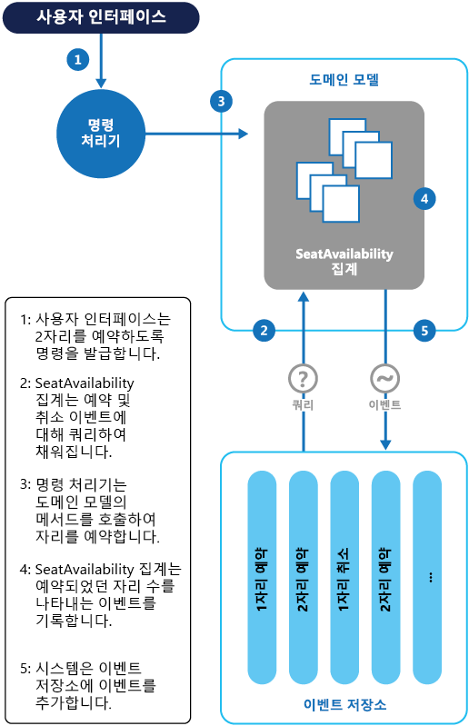

# 이벤트 소싱

[!INCLUDE [header](../_includes/header.md)]

도메인에 데이터의 현재 상태를 단순 저장하는 대신 추가 전용 저장소를 사용해 해당 데이터에서 수행된 일련의 모든 동작을 기록합니다. 
레코드 시스템으로 작용하는 추가 전용 저장소는 도메인 개체를 구체화하는 데 사용할 수 있습니다. 이렇게 하면 데이터 모델과 비즈니스 도메인을 동기화할 필요가 없을 뿐 아니라 성능, 확장성, 응답성을 향상시켜 복잡한 도메인에서 작업을 단순화할 수 있습니다. 또한 트랜잭션 데이터의 일관성을 제공하고 보상 동작을 가능하게 하는 전체 감사 내역과 기록을 유지할 수도 있습니다.

## 배경 및 문제

많은 응용 프로그램은 데이터를 사용합니다. 대표적인 접근 방식은 사용자가 데이터를 변경함에 따라 응용 프로그램이 변경 내용을 업데이트해 데이터의 현재 상태를 유지하는 것입니다. 예를 들면 전통적인 생성, 읽기, 업데이트, 삭제(CRUD) 모델에서 대표적인 데이터 프로세스는 데이터를 저장소에서 읽어오고, 데이터를 수정한 다음, 데이터의 현재 상태를 새 값으로 업데이트(종종 데이터를 잠그는 트랜잭션 사용)하는 것입니다.

CRUD 접근 방식에는 다음과 같은 한계가 있습니다.

- 데이터 저장소에 직접 업데이트 작업을 수행하는 CRUD 시스템에는 처리 오버헤드가 필요하므로 성능과 응답성이 느려지고 확장성이 제한될 수 있습니다.

- 수 많은 사용자가 동시 접속하는 공동 작업 도메인에서는 업데이트 작업이 데이터의 단일 항목에서 발생하기 때문에 데이터 업데이트의 충돌 가능성이 높아집니다.

- 별도의 로그에 각 작업의 세부 정보를 기록하는 추가 감사 메커니즘이 없는 한 기록은 손실됩니다.

> CRUD 접근 방식의 한계에 대한 자세한 설명은 [CRUD, 가능한 경우에만](https://msdn.microsoft.com/library/ms978509.aspx) 을 참조하시기 바랍니다.

## 해결책

이벤트 소싱 패턴은 추가 전용 저장소에 기록되는 이벤트의 순서대로 구동되는 데이터에서의 처리 작업에 대한 접근 방식을 정의합니다. 응용 프로그램 코드는 데이터에서 발생한 각각의 동작을 자세하게 설명하는 일련의 이벤트를 이벤트가 유지되는 이벤트 저장소에 전송합니다. 각각의 이벤트는 데이터에 대한 변경 내용의 집합을 나타냅니다(예: `AddedItemToOrder`).

이벤트는 최신 상태 데이터에 대한 레코드 시스템(신뢰할 수 있는 데이터 원본)으로 작용하는 이벤트 저장소에 유지됩니다. 보통 이벤트 저장소는 이런 이벤트를 게시해 소비자에게 알리고 소비자가 필요에 따라 처리할 수 있도록 조치합니다. 예를 들어 소비자는 이벤트의 작업을 다른 시스템에 적용하는 작업을 시작하거나 작업을 완료하는 데 필요한 다른 관련 동작을 수행할 수 있습니다. 이 때 이벤트를 생성하는 응용 프로그램 코드는 이벤트를 구독하는 시스템과 분리됩니다.

이벤트 저장소에서 게시하는 이벤트의 대표적인 용도는 응용 프로그램의 동작이 엔터티를 변경함에 따라 엔터티의 구체화된 뷰를 유지하고 외부 시스템과 통합하는 것입니다. 예를 들면 시스템은 UI의 부분을 채우는 데 사용되는 모든 고객 주문의 구체화된 뷰를 유지할 수 있습니다. 응용 프로그램이 새로운 주문을 추가하고, 주문에서 항목을 추가하거나 삭제하며, 배송 정보를 추가함에 따라 [구체화된 뷰](materialized-view.md)의 업데이트를 위해 이런 변경 내용을 설명하는 이벤트를 처리 및 사용할 수 있습니다.

또한 응용 프로그램은 언제든 이벤트의 기록을 읽을 수 있을 뿐 아니라 해당 엔터티와 관련된 모든 이벤트를 재생하고 사용해 엔터티의 현재 상태를 구체화하는 데 이벤트의 기록을 사용할 수 있습니다. 이는 요청을 처리할 때 또는 엔터티의 상태를 구체화된 뷰로 저장해 표시 계층을 지원하는 용도로 예약된 작업을 통해 도메인 개체를 구체화하려는 요구에서 발생할 수 있습니다.

이벤트 소싱 패턴의 개요를 보여주는 다음 그림에는 구체화된 뷰 생성, 이벤트를 외부 응용 프로그램 및 시스템에 통합, 특정 엔터티의 현재 상태 프로젝션 생성을 위한 이벤트 재생과 같은 이벤트 스트림을 사용하는 옵션 중 일부가 포함되어 있습니다.

이벤트 소싱 패턴은 다음과 같은 이점을 제공합니다.

이벤트는 변경할 수 없고 추가 전용 작업을 사용해 저장할 수 있습니다. 이벤트를 시작하는 사용자 인터페이스, 워크플로, 프로세스는 계속될 수 있고, 이벤트를 처리하는 작업은 백그라운드에서 실행될 수 있습니다. 이런 사실은 트랜잭션 처리 중 경합이 없다는 사실과 결합되어 응용 프로그램, 특히 프레젠테이션 수준 또는 사용자 인터페이스의 성능과 확장성을 엄청나게 높일 수 있습니다.

이벤트는 이벤트가 나타내는 동작을 설명하는 데 필요한 모든 관련 데이터와 함께 발생한 특정 동작을 설명하는 간단한 개체입니다. 이벤트는 데이터 저장소를 직접 업데이트하지 않고 적절한 시점에서의 처리를 위해 간단히 기록됩니다. 따라서 구현과 관리를 단순화할 수 있습니다.

보통 이벤트는 도메인 전문가에게 의미가 있는 반면, [개체 관계형 임피던스 불일치](https://en.wikipedia.org/wiki/Object-relational_impedance_mismatch) 는 복잡한 데이터베이스 테이블을 이해하기 어렵게 만들 수 있습니다. 테이블은 발생한 이벤트가 아닌 시스템의 현재 상태를 나타내는 인위적인 구문입니다.

데이터 저장소에서 개체를 직접 업데이트하는 요구 사항이 없기 때문에 이벤트 소싱은 동시 업데이트가 초래하는 충돌을 방지하는 데 도움을 줄 수 있지만 그렇더라도 도메인 모델은 불일치 상태를 초래할 수 있는 요청에 대해 도메인을 보호하도록 설계되어야 합니다.

이벤트의 추가 전용 저장소는 데이터 저장소에 대해 수행된 동작을 모니터링하는 데 사용할 수 있는 감사 내역을 제공하고, 언제라도 이벤트를 재생해 현재 상태를 구체화된 뷰 또는 프로젝션으로 다시 생성할 수 있도록 지원하며, 시스템의 테스트와 디버깅을 지원합니다. 또한 보상 이벤트를 사용해 변경 내용을 취소하는 요구 사항은 반대가 되는 변경 내용의 기록을 제공하는데, 모델이 현재 상태를 단순 저장하는 경우에는 해당되지 않습니다. 이벤트 목록은 응용 프로그램 성능을 분석하고 사용자 동작 추세를 검색하거나 다른 유용한 비즈니스 정보를 가져오는 데 사용할 수도 있습니다.

이벤트 저장소는 이벤트를 발생시키고, 작업은 발생한 이벤트에 따라 동작을 수행합니다. 이런 작업과 이벤트의 분리는 유연성과 확장성을 제공합니다. 작업은 이벤트 유형과 이벤트 데이터에 대한 정보를 가지고 있지만 이벤트를 트리거한 원인은 모릅니다. 또한 여러 작업은 각각의 이벤트를 처리할 수 있습니다. 따라서 이벤트 저장소에서 발생된 새로운 이벤트를 수신하기만 하는 다른 서비스 및 시스템과 쉽게 통합할 수 있습니다. 그러나 이벤트 소싱 이벤트는 매우 낮은 수준이 되는 경향이 있습니다. 따라서 그 대신 특정 통합 이벤트 생성이 필요할 수 있습니다.

> 일반적으로 이벤트 소싱은 이벤트에 따라 데이터 관리 작업을 수행하고 저장된 이벤트로 보기를 구체화해 명령과 쿼리의 역할 분리(CQRS) 패턴과 조합합니다.

## 문제 및 고려 사항

이 패턴의 구현 방법을 결정할 때는 다음 사항을 고려해야 합니다.

구체화된 뷰를 생성하거나 이벤트를 재생해 데이터의 프로젝션을 생성할 때만 시스템의 최종 일관성이 나타납니다. 요청 처리의 결과로 이벤트를 이벤트 저장소에 추가하는 응용 프로그램, 게시 중인 이벤트, 이벤트를 처리하는 이벤트의 소비자 사이에는 약간의 지연이 발생합니다. 이런 지연 동안 엔터티의 추가 변경 내용을 설명하는 새로운 이벤트가 이벤트 저장소에 도착할 수 있습니다.

> [!참고]
> 최종 일관성에 대한 정보는 [데이터 일관성 프라이머](https://msdn.microsoft.com/library/dn589800.aspx) 를 참조하시기 바랍니다.

이벤트 저장소는 영구적인 정보 소스이므로 이벤트 데이터를 업데이트해서는 안 됩니다. 엔터티를 업데이트해 변경 내용을 실행 취소하는 유일한 방법은 보상 이벤트를 이벤트 저장소에 추가하는 것입니다. 마이그레이션 중 유지되는 이벤트의 형식(데이터가 아님)을 변경해야 하는 경우, 이벤트 저장소의 기존 이벤트를 새 버전과 함께 사용하기가 어려울 수 있습니다. 이 경우 변경된 모든 이벤트를 반복하여 이벤트가 새로운 형식을 준수하도록 조치하거나 새로운 형식을 사용하는 새로운 이벤트를 추가할 필요가 있습니다. 기존 및 새로운 이벤트 형식을 모두 유지하려면 각각의 이벤트 스키마 버전에 대한 버전 스탬프 사용을 고려해야 합니다.

다중 스레드 응용 프로그램 및 응용 프로그램의 여러 인스턴스는 이벤트 저장소에 저장되는 이벤트일 수 있습니다. 특정 엔터티에 영향을 미치는 이벤트의 순서처럼(엔터티의 변경 내용이 발생하는 순서는 엔터티의 현재 상태에 영향을 미침) 이벤트 저장소에서는 이벤트의 일관성은 반드시 유지해야 합니다. 모든 이벤트에 타임스탬프를 추가하면 문제를 방지하는 데 도움이 될 수 있습니다. 다른 일반적인 방법은 요청으로 발생한 각 이벤트에 주석을 달아 증분 식별자로 사용하는 것입니다. 그러면 두 동작이 동시에 동일한 엔터티에 이벤트를 추가하려는 경우, 이벤트 저장소가 기존의 엔터티 식별자 및 이벤트 식별자와 일치하는 이벤트를 거부할 수 있습니다.

이벤트를 읽어 정보를 가져오기 위한 표준 접근 방식은 없습니다. 또한 SQL 쿼리와 같은 기존 방식 역시 이런 목적에는 적합하지 않습니다. 추출할 수 있는 유일한 데이터는 이벤트 식별자를 기준으로 사용하는 이벤트의 스트림입니다. 보통 이벤트 ID는 개별 엔터티에 매핑됩니다. 엔터티의 현재 상태는 해당 엔터티의 원래 상태를 기준으로 엔터티와 관련된 모든 이벤트의 재생을 통해서만 결정할 수 있습니다.

각각의 이벤트 스트림의 길이는 시스템의 관리와 업데이트에 영향을 미칩니다. 스트림이 크면 이벤트 개수를 지정하는 등 특정 간격으로 스냅숏을 생성할 것을 고려해야 합니다. 엔터티의 현재 상태는 스냅숏을 통해 확보할 수 있고 발생 시점 이후 발생한 모든 이벤트를 재생해 파악할 수 있습니다. 데이터의 스냅숏 생성에 대한 자세한 내용은 [Martin Fowler의 엔터프라이즈 응용 프로그램 아키텍처에 관한 스냅숏 웹 사이트](http://martinfowler.com/eaaDev/Snapshot.html) 및 [마스터-종속 스냅숏 복제](https://msdn.microsoft.com/library/ff650012.aspx)를 참조하시기 바랍니다.

이벤트 소싱이 데이터 업데이트의 충돌 가능성을 최소화하더라도 응용 프로그램은 여전히 최종 일관성으로 인해 발생하는 불일치와 트랜잭션의 부족을 해결할 수 있어야 합니다. 예를 들어 재고 감소 품목을 주문하는 동안 재고 감소를 표시하는 이벤트가 데이터 저장소에 도착하면 고객에게 조언하거나 미처리 주문을 만들어 두 작업을 조정할 필요가 있습니다.

이벤트 게시는 "한 번 이상"일 수 있으므로 이벤트의 소비자는 멱등적이어야 합니다. 소비자는 이벤트가 한 번 이상 처리되는 경우 이벤트에 설명된 업데이트를 다시 적용하지 않아야 합니다. 예를 들어 소비자의 여러 인스턴스가 발행한 주문의 총수와 같이 엔터티의 속성을 집계로 유지하는 경우, 주문을 발행하는 이벤트가 발생할 때 집계의 증분은 한 번만 성공해야 합니다.  이런 방식이 이벤트 소싱의 주요 특성인 것은 아니지만 흔히 사용되는 구현 결정입니다.

## 패턴 사용 사례

다음 시나리오에 이 패턴을 사용합니다.

- 데이터의 의도, 목적 또는 이유를 캡처하려는 경우. 예를 들어 고객 엔터티의 변경 내용은  _Moved home_, _Closed account_, or _Deceased_ 와 같은 특정 이벤트 유형으로 캡처할 수 있습니다.

- 데이터 업데이트의 충돌 발생을 최소화하거나 완전히 방지해야 하는 경우

- 발생하는 이벤트를 기록하고 이벤트를 재생해 시스템의 상태를 복원하고, 변경 내용을 롤백하며, 기록과 감사 로그를 유지할 수 있기를 원하는 경우. 예를 들어 작업이 여러 단계로 구성되어 있으면 업데이트를 되돌리는 동작을 실행한 다음 일부 단계를 재생해 데이터를 일치 상태로 되돌릴 필요가 있습니다.

- 이벤트 사용이 응용 프로그램을 운영에 기본으로 포함되어 있고 추가 개발 또는 구현 노력이 거의 필요하지 않은 경우

- 데이터를 입력하거나 업데이트하는 프로세스와 입력이나 업데이트에 필요한 작업을 분리해야 하는 경우. 이렇게 분리하면 UI 성능이 향상되거나 이벤트가 발생할 때 동작을 수행하는 다른 수신기에 이벤트를 배포할 수 있습니다. 예를 들어 급료 지불 명세표 시스템과 비용 제출 웹 사이트를 통합하면 웹 사이트에서 수행된 데이터 업데이트에 따라 이벤트 저장소에서 발생하는 이벤트는 비용 제출 웹 사이트와 급료 지불 명세표 시스템 둘 다에서 사용할 수 있습니다.

- 요구 사항을 변경하거나 CQRS와 함께 사용할 때 읽기 모델 또는 데이터를 표시하는 보기를 조정해야 하는 상황에서 구체화된 모델의 형식과 엔터티 데이터를 변경할 수 있는 유연성을 원하는 경우 

- CQRS와 함께 사용할 때 읽기 모델을 업데이트하는 동안 최종 일관성을 수락할 수 있거나 엔터티와 이벤트 스트림 데이터의 리하이드레이션이 성능에 미치는 영향을 수락할 수 있는 경우

다음의 상황에는 이 패턴이 유용하지 않습니다.

- 작거나 간단한 도메인, 비즈니스 논리가 거의 또는 전혀 없는 시스템, 전통적인 CRUD 데이터 관리 방식이 자연스럽고 원활하게 작동하는 비도메인 시스템

- 데이터의 보기에 일관성과 실시간 업데이트가 필요한 시스템

- 감사 내역, 기록 및 동작을 롤백하고 재생하는 기능이 필요 없는 시스템

- 기본 데이터의 업데이트 충돌 가능성이 매우 낮은 시스템. 예를 들어 데이터의 업데이트보다 주로 데이터를 추가하는 시스템.

## 예제

회의 관리 시스템은 회의 예약 완료 수를 추적하여 잠재적 참석자가 예약을 시도할 때 좌석이 남아 있는지 여부를 확인할 필요가 있습니다. 시스템은 적어도 다음과 같은 두 가지 방식으로 회의 예약 총수를 저장할 수 있습니다.

- 시스템은 예약 총수에 대한 정보를 예약 정보를 보관하는 데이터베이스에 별도의 엔터티로 저장할 수 있습니다. 예약이 이루어지거나 취소됨에 따라 시스템은 예약 숫자를 하나씩 늘리거나 줄일 수 있습니다. 이런 접근 방식은 이론적으로는 간단하지만 단기간에 많은 참석자가 좌석 예약을 시도하는 경우 확장성 문제를 초래할 수 있습니다. 예를 들면 이런 문제는 마지막 날 또는 예약 기간 마감 직전에 발생할 수 있습니다.

- 시스템은 예약 및 취소 정보를 이벤트 저장소에 보관하는 이벤트로 저장할 수 있습니다. 그런 다음 이런 이벤트를 재생해 사용할 수 있는 좌석 수를 계산할 수 있습니다. 이런 접근 방식은 이벤트의 변경 불가능성으로 인해 확장성이 더 높습니다. 이 시스템은 데이터를 이벤트 저장소에서 읽어오거나 데이터를 이벤트 저장소에 추가할 수만 있으면 되고 예약과 취소에 대한 이벤트 정보를 절대로 변경하지 않습니다.

다음 다이어그램은 이벤트 소싱을 사용해 회의 관리 시스템의 좌석 예약 하위 시스템을 구현하는 방법을 보여줍니다.

좌석 두 개를 예약하는 동작의 순서는 다음과 같습니다.

1. 사용자 인터페이스가 두 참석자의 좌석 예약을 명령합니다. 이 명령은 별도의 명령 처리기가 처리합니다. 하나의 논리는 사용자 인터페이스와 분리되고 명령으로 게시된 요청을 처리합니다.

2. 모든 회의 예약에 대한 정보를 포함하는 집계는 예약과 취소를 설명하는 이벤트 쿼리를 통해 생성됩니다. 이런 집계는 `SeatAvailability` 라 부르고 집계의 데이터를 쿼리하고 수정해 메서드를 표시하는 도메인 모델 내에 포함됩니다.

    > 고려해 보아야 할 일부 최적화는 스냅숏 사용(집계의 현재 상태를 가져오기 위해 이벤트의 전체 목록을 쿼리하고 재생할 필요성 제거)과 캐시된 집계 사본의 메모리 내 유지입니다.

3. 명령 처리기는 예약을 위해 도메인 모델이 표시하는 메서드를 호출합니다.

4. `SeatAvailability` 집계는 예약된 좌석 수를 포함하는 이벤트를 기록합니다. 집계가 이벤트를 적용하고 나면 모든 예약은 남은 좌석 수 계산에 사용됩니다.

5. 시스템은 새로운 이벤트를 이벤트 저장소의 이벤트 목록에 추가합니다.

사용자가 좌석을 취소하면 시스템은 비슷한 프로세스를 따르는데, 명령 처리기가 좌석 취소 이벤트를 생성하는 명령을 내리고 생성된 이벤트를 이벤트 저장소에 추가한다는 점만 다릅니다.

이벤트 저장소를 사용하면 확장성을 위한 추가 범위를 제공할 뿐 아니라 회의 예약과 취소의 완전한 기록 또는 감사 내역을 제공합니다. 이벤트 저장소의 이벤트는 정확한 레코드입니다. 시스템은 이벤트를 쉽게 재생하고 상태를 특정 시점으로 복원할 수 있기 때문에, 집계를 다른 방식으로 유지할 필요가 없습니다.

> 이 예제에 대한 자세한 내용은 [이벤트 소싱 도입](https://msdn.microsoft.com/library/jj591559.aspx)에서 확인할 수 있습니다.

## 관련 패턴 및 지침

이 패턴을 구현할 때 관련될 수 있는 패턴과 지침은 다음과 같습니다.

- [명령과 쿼리의 역할 분리(CQRS) 패턴](cqrs.md). CQRS 구현을 위한 영구적인 정보 소스를 제공하는 쓰기 저장소는 이벤트 소싱 패턴의 구현을 기반으로 하는 경우가 많습니다. 별도의 인터페이스를 사용해 데이터를 업데이트하는 작업에서 응용 프로그램의 데이터를 읽는 작업을 분리하는 방법을 설명합니다.

- [구체화된 뷰 패턴](materialized-view.md). 이벤트 소싱을 기반으로 하는 시스템에 사용되는 데이터 저장소는 보통 효율적인 쿼리에는 적합하지 않습니다. 대신 일반적인 접근 방식은 정기적으로 또는 데이터를 변경할 때 데이터의 미리 채워진 뷰를 생성하는 것입니다. 미리 채워진 뷰의 생성 방법을 보여줍니다.

- [보상 트랜잭션 패턴](materialized-view.md). 이벤트 소싱 저장소의 기존 데이터가 업데이트되지 않는 대신 상태가 전환되는 새로운 엔터티가 새 값에 추가됩니다. 이전 변경을 간단히 반대로 바꿀 방법이 없으므로, 보상 항목을 사용하여 변경을 반대로 바꿔야 합니다. 이전 작업이 수행한 결과를 실행 취소하는 방법을 설명합니다.

- [데이터 일관성 프라이머](https://msdn.microsoft.com/library/dn589800.aspx). 이벤트 소싱을 별도의 읽기 저장소 또는 구체화된 뷰와 함께 사용할 때 읽기 데이터는 즉시 일관되는 것이 아니라 최종 일관성을 제공합니다. 분산 데이터에서 일관성 유지와 관련된 문제를 요약합니다.

- [데이터 분할 지침](https://msdn.microsoft.com/library/dn589795.aspx). 데이터는 확장성을 개선하고, 경합을 줄이며, 성능을 최적화하기 위해 이벤트 소싱을 사용할 때 분할되는 경우가 많습니다. 데이터를 개별 파티션으로 분할하는 방법 및 그에 따른 문제를 설명합니다.

- Greg Young이 포스팅한 [왜 이벤트 소싱을 사용하는가?](http://codebetter.com/gregyoung/2010/02/20/why-use-event-sourcing/)를 참조하시기 바랍니다.
