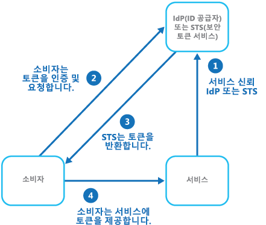
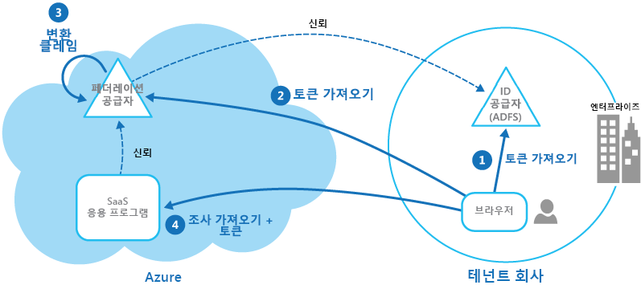

# 페더레이션 ID 패턴

[!INCLUDE [header](../_includes/header.md)]

외부 ID 공급자에게 인증을 위임합니다. 이렇게 하면 개발을 간소화하고, 사용자 관리 요구 사항을 최소화하며, 응용 프로그램의 사용자 환경을 향상할 수 있습니다.

## 컨텍스트 및 문제점

일반적으로 사용자는 비즈니스 관계가 있는 다른 조직에서 제공 및 호스팅되는 여러 응용 프로그램으로 작업해야 합니다. 이들은 각 응용 프로그램에 특정(및 다른) 자격 증명을 사용해야 할 수도 있습니다. 이 경우 다음과 같은 문제가 발생할 수 있습니다.

- **연결성 없는 사용자 경험**. 사용자가 여러 다른 로그인 자격 증명을 가지고 있는 경우 잊어버리기 쉽습니다.

- **보안 취약성 노출**. 사용자가 퇴사하면 즉시 계정 프로비전을 해제해야 합니다. 대규모 조직에서는 이 작업을 간과하기 쉽습니다.

- **복잡한 사용자 관리**. 관리자가 모든 사용자의 자격 증명을 관리하고 암호 힌트 제공 등의 추가 작업을 수행해야 합니다.

일반적으로 사용자는 이러한 모든 응용 프로그램에 동일한 자격 증명을 사용하는 것을 선호합니다.

## 해결 방법

페더레이션 ID를 사용할 수 있는 인증 메커니즘을 구현합니다. 사용자 인증과 응용 프로그램 코드를 분리하고 신뢰할 수 있는 ID 공급자에게 인증을 위임합니다. 이렇게 하면 개발을 간소화할 수 있으며, 관리 오버헤드를 최소화하는 동시에 사용자가 다양한 IdP(ID 공급자)를 사용하여 인증하도록 허용할 수 있습니다. 또한 인증과 권한 부여를 명확하게 분리할 수 있습니다.

신뢰할 수 있는 ID 공급자로는 회사 디렉터리, 온-프레미스 페더레이션 서비스, 비즈니스 파트너가 제공하는 기타 STS(보안 토큰 서비스) 또는 Microsoft, Google, Yahoo!, Facebook 계정 등을 가진 사용자를 인증할 수 있는 소셜 ID 공급자가 있습니다.

다음 그림은 클라이언트 응용 프로그램이 인증이 필요한 서비스에 액세스해야 하는 경우의 페더레이션 ID 패턴을 보여 줍니다. IdP가 STS를 이용하여 인증을 수행합니다. IdP는 인증된 사용자에 대한 정보를 제공하는 보안 토큰을 발급합니다. 이 정보를 클레임이라고 하며, 여기에는 사용자 ID뿐 아니라 역할 멤버 자격, 보다 세분화된 액세스 권한 등의 기타 정보도 포함될 수 있습니다.

이 모델을 클레임 기반 액세스 제어라고도 합니다. 응용 프로그램과 서비스는 토큰에 포함된 클레임을 기준으로 기능과 특성에 대한 액세스 권한을 부여합니다. 인증이 필요한 서비스는 IdP를 신뢰해야 합니다. 클라이언트 응용 프로그램은 인증을 수행하는 IdP에 연결됩니다. 인증에 성공하면 IdP는 사용자를 식별하는 클레임이 포함된 토큰을 STS에 반환합니다(IdP와 STS는 동일한 서비스일 수 있음). STS는 사전 정의된 규칙에 따라 토큰의 클레임을 변환하고 보강한 후 클라이언트 응용 프로그램에 반환할 수 있습니다. 그러면 클라이언트 응용 프로그램이 이 토큰을 해당 ID 증명으로 서비스에 전달할 수 있습니다.

> 신뢰 체인에 추가 STS가 있을 수도 있습니다. 예를 들어, 나중에 설명하는 시나리오에서 온-프레미스 STS는 사용자를 인증하기 위해 ID 공급자 액세스를 담당하는 다른 STS를 신뢰합니다. 이 접근 방법은 온-프레미스 STS 및 디렉터리가 있는 엔터프라이즈 시나리오에서 일반적으로 사용됩니다.

페더레이션 인증은 다양한 도메인의 ID를 신뢰하는 문제에 대한 표준 기반 솔루션을 제공하며 Single Sign-On을 지원할 수 있습니다. 또한 ID 공급자에 대한 직접적인 네트워크 연결을 요구하지 않고 Single Sign-On을 지원하므로 페더레이션 인증은 모든 유형의 응용 프로그램(특히 클라우드에 호스트된 응용 프로그램)에서 더욱 인기를 끌고 있습니다. 사용자가 각 응용 프로그램에 대한 자격 증명을 입력할 필요가 없습니다. 이 경우 여러 다른 응용 프로그램에 액세스하는 데 필요한 자격 증명을 생성할 필요가 없고, 원래 ID 공급자를 제외한 모든 공급자로부터 사용자 자격 증명이 숨겨지므로 보안이 강화됩니다. 응용 프로그램에는 토큰에 포함된 인증된 ID 정보만 표시됩니다.

페더레이션 ID에는 ID 공급자가 ID 및 자격 증명을 관리한다는 주요 장점도 있습니다. 응용 프로그램 또는 서비스에서 ID 관리 기능을 제공할 필요가 없습니다. 또한 회사 시나리오에서는 회사 디렉터리가 ID 공급자를 신뢰할 경우 사용자에 대한 정보를 필요로 하지 않습니다. 그러면 디렉터리 내에서 사용자 ID를 관리하는 모든 관리 오버헤드가 제거됩니다.

## 문제 및 고려 사항

페더레이션 인증을 구현하는 응용 프로그램을 디자인할 때 다음을 고려하세요.

- 인증은 단일 장애 지점(Single point of failure)이 될 수 있습니다. 여러 데이터 센터에 응용 프로그램을 배포하는 경우 응용 프로그램 안정성 및 가용성을 유지하기 위해 동일한 데이터 센터에 ID 관리 메커니즘을 배포하는 것이 좋습니다.

- 인증 도구를 사용하면 인증 토큰에 포함된 역할 클레임에 따라 액세스 제어를 구성할 수 있습니다. 이를 RBAC(역할 기반 액세스 제어)라고도 하며, 기능 및 리소스에 대한 액세스를 보다 세분화해서 제어할 수 있습니다.

- 회사 디렉터리와 달리, 소셜 ID 공급자를 사용한 클레임 기반 인증은 일반적으로 메일 주소와 이름 이외에 인증된 사용자에 대한 정보를 제공하지 않습니다. Microsoft 계정과 같은 일부 소셜 ID 공급자는 고유 식별자만 제공합니다. 응용 프로그램은 일반적으로 등록된 사용자에 대한 일부 정보를 유지 관리해야 하며 이 정보를 토큰의 클레임에 포함된 식별자와 일치시킬 수 있어야 합니다. 대체로 이 작업은 사용자가 응용 프로그램에 처음 액세스할 때 등록을 통해 수행되며, 정보는 각 인증 후에 추가 클레임으로 토큰에 삽입됩니다.

- STS에 대해 둘 이상의 ID 공급자가 구성되어 있는 경우 응용 프로그램은 인증을 위해 사용자가 리디렉션되어야 하는 ID 공급자를 검색해야 합니다. 이 프로세스를 홈 영역 검색(Home realm discovery)이라고 합니다. STS는 사용자가 제공하는 메일 주소 또는 사용자 이름, 사용자가 액세스하는 응용 프로그램의 하위 도메인, 사용자의 IP 주소 범위 또는 사용자 브라우저에 저장된 쿠키 콘텐츠를 기준으로 이 작업을 자동으로 수행할 수 있습니다. 예를 들어 사용자가 Microsoft 도메인의 메일 주소(예: user@live.com)를 입력한 경우 STS에서 사용자를 Microsoft 계정 로그인 페이지로 리디렉션합니다. 이후 방문 시에는 STS가 쿠키를 사용하여 마지막 로그인이 Microsoft 계정으로 수행되었음을 나타낼 수 있습니다. 자동 검색을 통해 홈 영역을 확인할 수 없는 경우, STS는 신뢰할 수 있는 ID 공급자 목록이 나열된 홈 영역 검색 페이지를 표시하며 사용자는 여기서 사용할 ID 공급자를 선택해야 합니다.

## 이 패턴을 사용해야 하는 경우

이 패턴은 다음과 같은 시나리오에 유용합니다.

- **엔터프라이즈에서 Single Sign-On 사용**. 이 시나리오에서는 회사 보안 경계 외부의 클라우드에 호스트된 회사 응용 프로그램에 대해 직원을 인증하여 응용 프로그램을 방문할 때마다 로그인하도록 요구하지 않아야 합니다. 사용자 환경은 회사 네트워크에 로그인할 때 인증된 후 다시 로그인할 필요 없이 모든 관련 응용 프로그램에 액세스할 수 있는 온-프레미스 응용 프로그램을 사용할 때와 동일합니다.

- **여러 파트너에서 페더레이션 ID 사용**. 이 시나리오에서는 회사 직원 및 회사 디렉터리에 계정이 없는 비즈니스 파트너를 둘 다 인증해야 합니다. 이 시나리오는 B2B 응용 프로그램, 타사 서비스와 통합된 응용 프로그램, 서로 다른 IT 시스템을 가진 회사에 병합 또는 공유된 리소스가 있는 경우에 일반적으로 사용됩니다.

- **SaaS 응용 프로그램에서 페더레이션 ID 사용**. 이 시나리오에서는 독립 소프트웨어 공급업체가 여러 클라이언트 또는 테넌트에 즉시 사용할 수 있는 서비스를 제공합니다. 각 테넌트는 적합한 ID 공급자를 사용하여 인증합니다. 예를 들어 비즈니스 사용자는 회사 자격 증명을 사용하는 반면, 테넌트의 소비자와 클라이언트는 해당 소셜 ID 자격 증명을 사용합니다.

이 패턴은 다음과 같은 경우에 유용하지 않을 수 있습니다.

- 하나의 ID 공급자가 응용 프로그램의 모든 사용자를 인증할 수 있으며, 다른 ID 공급자를 사용하여 인증해야 하는 요구 사항이 없는 경우. 이는 온-프레미스 디렉터리와 응용 프로그램 간의 가상 네트워크 연결을 통해 (클라우드에 호스트된 시나리오에서) 또는 VPN을 사용하여 회사 디렉터리(응용 프로그램 내에서 액세스할 수 있음)를 인증에 사용하는 비즈니스 응용 프로그램에서 일반적입니다.

- 응용 프로그램이 원래 사용자 지정 사용자 저장소와 함께 다른 인증 메커니즘을 사용하여 빌드되었거나 클레임 기반 기술에서 사용되는 협상 표준을 처리할 수 없는 경우. 기존 응용 프로그램에 클레임 기반 인증 및 액세스 제어 기능을 추가하는 것은 복잡하고 비용 효율적이지 않을 수 있습니다.

## 예

조직이 Microsoft Azure에서 다중 테넌트 SaaS(Software as a Service) 응용 프로그램을 호스트합니다. 응용 프로그램에는 테넌트에서 해당 사용자를 위해 응용 프로그램을 관리하는 데 사용할 수 있는 웹 사이트가 포함되어 있습니다. 이 응용 프로그램을 통해 테넌트는 사용자가 해당 조직의 Active Directory에서 인증될 때 ADFS(Active Directory Federation Services)에서 생성되는 페더레이션 ID를 사용하여 웹 사이트에 액세스할 수 있습니다.

이 그림은 테넌트가 해당 ID 공급자, 이 경우에는 ADFS로 인증하는 방법(1단계)을 보여 줍니다. ADFS는 테넌트를 성공적으로 인증한 후 토큰을 발급합니다. 클라이언트 브라우저는 테넌트의 ADFS에서 발급한 토큰을 신뢰하는 SaaS 응용 프로그램의 페더레이션 공급자에게 이 토큰을 전달하여, SaaS 페더레이션 공급자에 유효한 토큰을 다시 가져옵니다(2단계). 필요한 경우 SaaS 페더레이션 공급자는 토큰의 클레임을 응용 프로그램에서 인식하는 토큰으로 변환(3단계)한 후 새 토큰을 클라이언트 브라우저에 반환합니다. 응용 프로그램은 SaaS 페더레이션 공급자가 발급한 토큰을 신뢰하고 토큰의 클레임을 사용하여 권한 부여 규칙을 적용합니다(4단계).

테넌트는 응용 프로그램에 액세스하기 위해 별도의 자격 증명을 기억할 필요가 없으며, 테넌트 회사의 관리자가 응용 프로그램에 액세스할 수 있는 사용자 목록을 해당 ADFS에 구성할 수 있습니다.

## 관련 지침

- [Microsoft Azure Active Directory](https://azure.microsoft.com/services/active-directory/)
- [Active Directory Domain Services](https://msdn.microsoft.com/library/bb897402.aspx)
- [ADFS(Active Directory Federation Services)](https://msdn.microsoft.com/library/bb897402.aspx)
- [Microsoft Azure에서 다중 테넌트 응용 프로그램에 대한 ID 관리](https://azure.microsoft.com/documentation/articles/guidance-multitenant-identity/)
- [Azure의 다중 테넌트 응용 프로그램](https://azure.microsoft.com/documentation/articles/dotnet-develop-multitenant-applications/)
