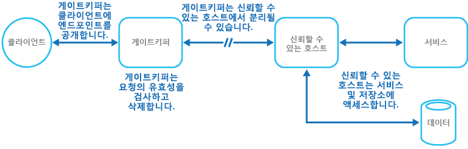

# 게이트키퍼 패턴Gatekeeper pattern

[!INCLUDE [header](../_includes/header.md)]

클라이언트와 응용 프로그램 또는 서비스 간 브로커 역할을 하며, 요청을 검사 및 정리하고, 요청 및 데이터를 전달하는 전용 호스트 인스턴스를 사용하여 응용 프로그램 및 서비스를 보호합니다.Protect applications and services by using a dedicated host instance that acts as a broker between clients and the application or service, validates and sanitizes requests, and passes requests and data between them. 이를 통해 보안의 추가적인 계층을 제공하고 공격에 노출되는 시스템 부분을 제한할 수 있습니다.This can provide an additional layer of security, and limit the attack surface of the system.

## 컨텍스트 및 문제점Context and problem

응용 프로그램은 요청을 수락하고 처리하면서 고객에게 해당 기술을 노출합니다.Applications expose their functionality to clients by accepting and processing requests. 클라우드 호스팅 시나리오에서 응용 프로그램은 클라이언트가 연결하였고, 일반적으로 클라이언트의 요청을 처리하는 코드를 포함하는 끝점을 노출합니다.In cloud-hosted scenarios, applications expose endpoints clients connect to, and typically include the code to handle the requests from clients. 이 코드는 인증 및 유효성 검사, 일부 또는 모든 요청 처리를 수행하고 클라이언트 대신 저장소 및 기타 서비스에 액세스할 가능성이 있습니다.This code performs authentication and validation, some or all request processing, and is likely to accesses storage and other services on behalf of the client.

악의적인 사용자가 시스템을 손상하고 응용 프로그램의 호스팅 환경에 액세스할 수 있는 경우, 자격 증명 및 저장소 키와 같이 응용 프로그램에서 사용하는 보안 메커니즘을 비롯하여 응용 프로그램이 액세스하는 서비스 및 데이터가 노출됩니다.If a malicious user is able to compromise the system and gain access to the application’s hosting environment, the security mechanisms it uses such as credentials and storage keys, and the services and data it accesses, are exposed. 따라서 악의적인 사용자가 중요한 정보 및 다른 서비스에 쉽게 액세스할 수 있습니다.As a result, the malicious user can gain unrestrained access to sensitive information and other services.

## 해결 방법Solution

클라이언트가 중요한 정보 및 서비스에 액세스하는 위험을 최소화하려면 공용 끝점을 노출하는 호스트 또는 작업을 요청을 처리하고 저장소에 액세스하는 코드와 분리합니다.To minimize the risk of clients gaining access to sensitive information and services, decouple hosts or tasks that expose public endpoints from the code that processes requests and accesses storage. 클라이언트와 상호 작용한 다음 요청을 처리할 호스트 또는 작업에 요청을 전달(분리된 인터페이스를 통해)하는 외관 또는 전용 작업을 사용하여 이 작업을 수행할 수 있습니다.You can achieve this by using a façade or a dedicated task that interacts with clients and then hands off the request&mdash;perhaps through a decoupled interface&mdash;to the hosts or tasks that'll handle the request. 그림에 이 패턴의 대략적인 개요가 나와 있습니다.The figure provides a high-level overview of this pattern.

게이트키퍼 패턴은 저장소를 보호하는 간단한 방법으로 사용하거나 응용 프로그램의 모든 기능을 보호하기 위한 더 포괄적인 외관으로 사용할 수 있습니다.The gatekeeper pattern can be used to simply protect storage, or it can be used as a more comprehensive façade to protect all of the functions of the application. 중요한 요인은 다음과 같습니다.The important factors are:

- **제어된 유효성 검사.****Controlled validation.** 게이트 키퍼는 모든 요청의 유효성을 검사하고 유효성 검사 요구 사항을 충족하지 않는 요청을 거부합니다.The gatekeeper validates all requests, and rejects those that don't meet validation requirements.
- **제한된 위험 및 노출.****Limited risk and exposure.** 게이트 키퍼는 신뢰할 수 있는 호스트가 저장소 및 서비스에 액세스하는 데 사용하는 자격 증명 또는 키에 액세스하지 않습니다.The gatekeeper doesn't have access to the credentials or keys used by the trusted host to access storage and services. 게이트 키퍼가 손상되면 공격자가 이러한 자격 증명 또는 키에 액세스하지 않습니다.If the gatekeeper is compromised, the attacker doesn't get access to these credentials or keys.
- **적절한 보안.****Appropriate security.** 게이트 키퍼는 나머지 응용 프로그램이 저장소 및 서비스 액세스에 요구되는 완전 신뢰 모드에서 실행되는 동안 제한된 권한 모드에서 실행됩니다.The gatekeeper runs in a limited privilege mode, while the rest of the application runs in the full trust mode required to access storage and services. 게이트 키퍼가 손상되면 응용 프로그램 서비스 또는 데이터에 직접 액세스할 수 없습니다.If the gatekeeper is compromised, it can't directly access the application services or data.

이 패턴은 일반적인 네트워크 토폴로지의 방화벽과 같은 역할을 합니다.This pattern acts like a firewall in a typical network topography. 이를 통해 게이트 키퍼가 요청을 검사하고, 필요한 작업을 수행하는 신뢰할 수 있는 호스트(키마스터라고도 함)에 요청을 전달할지 여부를 결정할 수 있습니다. It allows the gatekeeper to examine requests and make a decision about whether to pass the request on to the trusted host (sometimes called the keymaster) that performs the required tasks. 이 결정에는 일반적으로 요청 콘텐츠를 신뢰할 수 있는 호스트에 전달하기 전에 유효성을 검사하고 정리하기 위해 게이트 키퍼가 필요합니다.This decision typically requires the gatekeeper to validate and sanitize the request content before passing it on to the trusted host.

## 문제 및 고려 사항Issues and considerations

이 패턴을 구현할 방법을 결정할 때 다음 사항을 고려하세요.Consider the following points when deciding how to implement this pattern:

- 신뢰할 수 있는 호스트의 게이트 키퍼가 요청을 전달하여 내부 또는 보호된 끝점만 노출하고 게이트 키퍼에만 연결하는지 확인합니다.Ensure that the trusted hosts the gatekeeper passes requests to expose only internal or protected endpoints, and connect only to the gatekeeper. 신뢰할 수 있는 호스트는 외부 끝점 또는 인터페이스를 노출해서는 안 됩니다.The trusted hosts shouldn't expose any external endpoints or interfaces.
- 게이트 키퍼를 제한된 권한 모드로 실행해야 합니다.The gatekeeper must run in a limited privilege mode. 일반적으로 게이트 키퍼와 신뢰할 수 있는 호스트를 개별 호스팅된 서비스 또는 가상 머신에서 실행하는 것을 의미합니다.Typically this means running the gatekeeper and the trusted host in separate hosted services or virtual machines.
- 게이트 키퍼는 응용 프로그램 또는 서비스와 관련된 처리를 수행하거나 어떠한 데이터에도 액세스해서는 안 됩니다.The gatekeeper shouldn't perform any processing related to the application or services, or access any data. 순수하게 유효성을 검사하고 요청을 정리하는 기능만 합니다.Its function is purely to validate and sanitize requests. 신뢰할 수 있는 호스트에서 추가 유효성 검사를 수행해야 할 수도 있지만, 핵심적인 유효성 검사는 게이트 키퍼가 수행해야 합니다.The trusted hosts might need to perform additional validation of requests, but the core validation should be performed by the gatekeeper.
- 게이트 키퍼와 신뢰할 수 있는 호스트 또는 가능한 작업 간의 보안 통신 채널(HTTPS, SSL 또는 TLS)을 사용합니다.Use a secure communication channel (HTTPS, SSL, or TLS) between the gatekeeper and the trusted hosts or tasks where this is possible. 그러나 일부 호스팅 환경은 내부 끝점에 HTTPS를 지원하지 않습니다.However, some hosting environments don't support HTTPS on internal endpoints.
- 게이트 키퍼 패턴을 구현하는 응용 프로그램에 추가 계층을 더하면 그에 따른 추가적인 처리 및 네트워크 통신으로 인해 성능에 어느 정도 영향을 미칠 가능성이 높습니다.Adding the extra layer to the application to implement the gatekeeper pattern is likely to have some impact on performance due to the additional processing and network communication it requires.
- 게이트 키퍼 인스턴스는 단일 실패 지점일 수 있습니다.The gatekeeper instance could be a single point of failure. 오류의 영향을 최소화하려면 추가 인스턴스를 배포하고, 용량이 가용성을 유지할 수 있는지 확인하는 자동 크기 조정 메커니즘을 사용하는 것이 좋습니다.To minimize the impact of a failure, consider deploying additional instances and using an autoscaling mechanism to ensure capacity to maintain availability.

## 이 패턴을 사용해야 하는 경우When to use this pattern

이 패턴은 다음과 같은 경우에 유용합니다.This pattern is useful for:

- 중요한 정보를 처리하거나, 악의적인 공격으로부터 높은 보호 수준이 필수인 서비스를 노출하거나, 중단되어서는 안 되는 중요 업무용 작업을 수행하는 응용 프로그램.Applications that handle sensitive information, expose services that must have a high degree of protection from malicious attacks, or perform mission-critical operations that shouldn't be disrupted.
- 주요 작업에서 별도로 요청 유효성 검사를 수행하거나, 유지 관리 및 관리를 간소화하기 위해 이 유효성 검사를 중앙 집중화할 필요가 있는 분산 응용 프로그램.Distributed applications where it's necessary to perform request validation separately from the main tasks, or to centralize this validation to simplify maintenance and administration.

## 예Example

클라우드 호스팅 시나리오에서는 게이트 키퍼 역할 또는 가상 머신을 응용 프로그램의 신뢰할 수 있는 역할 및 서비스와 분리하여 이 패턴을 구현할 수 있습니다.In a cloud-hosted scenario, this pattern can be implemented by decoupling the gatekeeper role or virtual machine from the trusted roles and services in an application. 이는 내부 끝점, 큐 또는 저장소를 중간 통신 메커니즘으로 사용하면 수행할 수 있습니다.Do this by using an internal endpoint, a queue, or storage as an intermediate communication mechanism. 이 그림에서는 내부 끝점을 사용하는 모습을 보여 줍니다.The figure illustrates using an internal endpoint.

## 관련된 패턴Related patterns

[Valet 키 패턴](valet-key.md)은 게이트 키퍼 패턴을 구현하는 경우와 관련될 수도 있습니다.The [Valet Key pattern](valet-key.md) might also be relevant when implementing the Gatekeeper pattern. 이는 게이트 키퍼와 신뢰할 수 있는 역할 사이에서 통신할 때 리소스에 대한 액세스 사용 권한을 제한하는 키 또는 토큰을 사용하여 보안을 강화하기에 좋은 사례입니다.When communicating between the Gatekeeper and trusted roles it's good practice to enhance security by using keys or tokens that limit permissions for accessing resources. 클라이언트에 특정 리소스 또는 서비스에 대한 제한된 직접 액세스를 제공하는 토큰 또는 키를 사용하는 방법을 설명합니다.Describes how to use a token or key that provides clients with restricted direct access to a specific resource or service.
