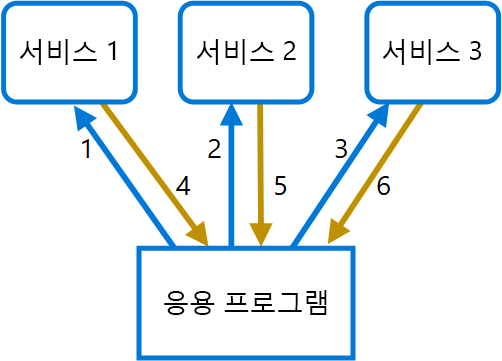

# <a name="gateway-aggregation-pattern"></a>게이트웨이 집계 패턴

게이트웨이를 사용하여 여러 개별 요청을 단일 요청으로 집계합니다. 이 패턴은 클라이언트가 다른 백 엔드 시스템을 여러 번 호출하여 작업을 수행해야 할 경우에 유용합니다.

## <a name="context-and-problem"></a>컨텍스트 및 문제점

단일 작업을 수행하기 위해 클라이언트가 다양한 백 엔드 서비스를 여러 번 호출해야 할 수 있습니다. 여러 서비스를 사용하여 작업을 수행하는 응용 프로그램은 각 요청마다 리소스를 확장해야 합니다. 새로운 기능이나 서비스가 응용 프로그램에 추가되면 추가 요청이 필요하고 리소스 요구 사항 및 네트워크 호출이 증가합니다. 클라이언트와 백 엔드 사이에서 이 데이터 전송이 증가하면 응용 프로그램의 성능 및 규모에 악영향을 줄 수 있습니다.  여러 소규모 서비스로 빌드된 응용 프로그램은 자연히 서비스 간 호출이 많으므로 마이크로 서비스 아키텍처에서는 이 문제가 보다 일반적입니다. 

다음 다이어그램에서 클라이언트가 각 서비스에 요청을 보냅니다(1,2,3). 각 서비스는 요청을 처리하고 응용 프로그램으로 다시 응답을 보냅니다(4,5,6). 일반적으로 대기 시간이 긴 셀룰러 네트워크에서 이러한 방식으로 개별 요청을 사용하는 것은 비효율적이며 연결이 끊어지거나 불완전한 요청이 될 수 있습니다. 각 요청을 병렬로 수행할 수 있지만 응용 프로그램이 각 요청 데이터를 모두 별도의 연결로 전송, 대기 및 처리해야 하므로 실패할 가능성이 높아집니다.

 

## <a name="solution"></a>해결 방법

게이트웨이를 사용하여 클라이언트와 서비스 간의 데이터 전송량을 줄입니다. 게이트웨이는 클라이언트 요청을 받고, 다양한 백 엔드 시스템에 요청을 디스패치한 다음 결과를 집계하여 요청 클라이언트에 다시 보냅니다.

이 패턴은 백 엔드 서비스에 대한 응용 프로그램 요청 수를 줄이고 대기 시간이 긴 네트워크에서 응용 프로그램 성능을 향상시킬 수 있습니다.

다음 다이어그램에서는 응용 프로그램이 게이트웨이에 요청을 보냅니다(1). 요청에는 추가 요청 패키지가 포함되어 있습니다. 게이트웨이는 이를 분해하여 각 요청을 관련 서비스로 전송 처리합니다(2). 각 서비스는 게이트웨이에 응답을 반환합니다(3). 게이트웨이는 각 서비스의 응답을 조합하여 응용 프로그램에 응답을 보냅니다(4). 응용 프로그램은 단일 요청을 보내고 게이트웨이로부터 단일 응답만 수신합니다.


## <a name="issues-and-considerations"></a>문제 및 고려 사항

- 게이트웨이는 백 엔드 서비스를 결합해서는 안 됩니다.
- 게이트웨이는 가능한 대기 시간을 줄이기 위해 백 엔드 서비스 근처에 있어야 합니다.
- 게이트웨이 서비스에 단일 실패 지점이 발생할 수 있습니다. 게이트웨이가 응용 프로그램의 가용성 요구 사항에 맞게 적절하게 디자인되었는지 확인합니다.
- 게이트웨이에 병목 현상이 발생할 수 있습니다. 게이트웨이 성능이 부하를 처리할 정도로 적당하고 예상되는 증가량에 맞게 크기를 조정할 수 있는지 확인합니다.
- 게이트웨이 부하 테스트를 수행하여 서비스가 연속으로 실패하지 않도록 합니다.
- [격벽][bulkhead], [회로 차단][circuit-breaker], [다시 시도][retry] 및 시간 제한 등의 기법을 사용하여 복원력 있는 디자인을 구현합니다.
- 하나 이상의 서비스를 호출하는 데 시간이 너무 오래 걸리는 경우 시간을 초과할 수 있기 때문에 데이터 일부 집합만 반환하는 것이 좋을 수 있습니다. 응용 프로그램에서 이 시나리오를 처리하는 방법을 고려합니다.
- 비동기 I/O를 사용하여 백 엔드의 지연이 응용 프로그램에서 성능 문제를 야기하지 않도록 합니다.
- 상관 관계 ID를 사용한 자동 분산 추적을 구현하여 각 개별 호출을 추적합니다.
- 요청 메트릭 및 응답 크기를 모니터링합니다.
- 오류를 처리하기 위해 장애 조치 전략으로 캐시된 데이터를 반환하는 것이 좋습니다.
- 게이트웨이에 집계를 빌드하는 대신 게이트웨이 뒤에 집계 서비스를 배치하는 것이 좋습니다. 요청 집계는 게이트웨이에서 다른 서비스보다 다양한 리소스 요구 사항이 있으므로 게이트웨이의 라우팅 및 오프로딩 기능에 영향을 줄 수 있습니다.

## <a name="when-to-use-this-pattern"></a>이 패턴을 사용해야 하는 경우

다음 경우에 이 패턴을 사용합니다.

- 클라이언트가 작업을 수행하기 위해 여러 백 엔드 서비스와 통신해야 하는 경우
- 클라이언트가 대기 시간이 상당한 네트워크(예: 셀룰러 네트워크)를 사용하는 경우

다음 경우에는 이 패턴이 적합하지 않을 수 있습니다.

- 여러 작업에서 클라이언트와 단일 서비스 간에 호출 횟수를 줄이고 싶은 경우. 이 시나리오에서는 서비스에 일괄 처리 작업을 추가하는 것이 나을 수 있습니다.
- 클라이언트 또는 응용 프로그램이 백 엔드 서비스 근처에 있고 대기 시간이 중요한 요소가 아닌 경우

## <a name="example"></a>예

다음 예제는 Lua를 사용하여 간단한 게이트웨이 집계 NGINX 서비스를 만드는 방법을 보여 줍니다.

```lua
worker_processes  4;

events {
  worker_connections 1024;
}

http {
  server {
    listen 80;

    location = /batch {
      content_by_lua '
        ngx.req.read_body()

        -- read json body content
        local cjson = require "cjson"
        local batch = cjson.decode(ngx.req.get_body_data())["batch"]

        -- create capture_multi table
        local requests = {}
        for i, item in ipairs(batch) do
          table.insert(requests, {item.relative_url, { method = ngx.HTTP_GET}})
        end

        -- execute batch requests in parallel
        local results = {}
        local resps = { ngx.location.capture_multi(requests) }
        for i, res in ipairs(resps) do
          table.insert(results, {status = res.status, body = cjson.decode(res.body), header = res.header})
        end

        ngx.say(cjson.encode({results = results}))
      ';
    }

    location = /service1 {
      default_type application/json;
      echo '{"attr1":"val1"}';
    }

    location = /service2 {
      default_type application/json;
      echo '{"attr2":"val2"}';
    }
  }
}
```

## <a name="related-guidance"></a>관련 지침

- [프런트 엔드에 대한 백 엔드 패턴](./backends-for-frontends.md)
- [게이트웨이 오프로딩 패턴](./gateway-offloading.md)
- [게이트웨이 라우팅 패턴](./gateway-routing.md)

[bulkhead]: ./bulkhead.md
[circuit-breaker]: ./circuit-breaker.md
[retry]: ./retry.md