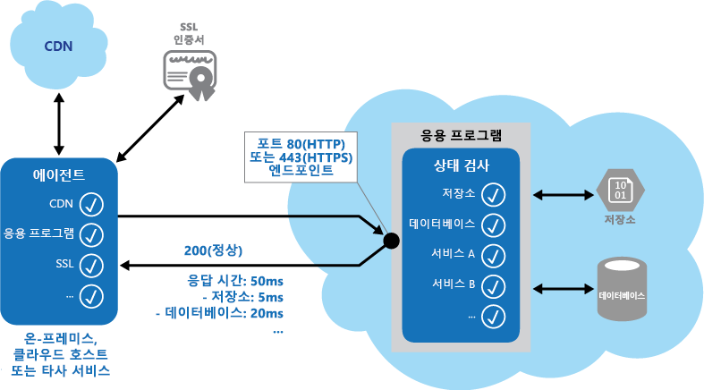

# <a name="health-endpoint-monitoring-pattern"></a><span data-ttu-id="d29b5-104">상태 끝점 모니터링 패턴</span><span class="sxs-lookup"><span data-stu-id="d29b5-104">Health Endpoint Monitoring pattern</span></span>

[!INCLUDE [header](../_includes/header.md)]

<span data-ttu-id="d29b5-105">외부 도구가 노출된 엔드포인트를 통해 주기적으로 액세스할 수 있는 기능 검사를 응용 프로그램 내부에 구현합니다.</span><span class="sxs-lookup"><span data-stu-id="d29b5-105">Implement functional checks in an application that external tools can access through exposed endpoints at regular intervals.</span></span> <span data-ttu-id="d29b5-106">이런 구현은 응용 프로그램과 서비스가 올바르게 수행되고 있다는 것을 확인하는 데 도움을 줄 수 있습니다.</span><span class="sxs-lookup"><span data-stu-id="d29b5-106">This can help to verify that applications and services are performing correctly.</span></span>

## <a name="context-and-problem"></a><span data-ttu-id="d29b5-107">컨텍스트 및 문제점</span><span class="sxs-lookup"><span data-stu-id="d29b5-107">Context and problem</span></span>

<span data-ttu-id="d29b5-108">웹 응용 프로그램과 백 엔드 서비스를 모니터링하여 사용 가능하고 올바르게 수행되고 있다는 것을 확인하는 것은 좋은 방법일 뿐 아니라 비즈니스 요구 사항인 경우가 많습니다.</span><span class="sxs-lookup"><span data-stu-id="d29b5-108">It's a good practice, and often a business requirement, to monitor web applications and back-end services, to ensure they're available and performing correctly.</span></span> <span data-ttu-id="d29b5-109">그러나 클라우드에서 실행 중인 서비스의 모니터링은 온-프레미스 서비스의 모니터링보다 더 어렵습니다.</span><span class="sxs-lookup"><span data-stu-id="d29b5-109">However, it's more difficult to monitor services running in the cloud than it is to monitor on-premises services.</span></span> <span data-ttu-id="d29b5-110">예를 들어, 호스팅 환경을 완전히 제어할 수 없는 데다가, 일반적으로 플랫폼 공급업체와 다른 업체가 제공하는 다른 서비스에 의존하기 때문입니다.</span><span class="sxs-lookup"><span data-stu-id="d29b5-110">For example, you don't have full control of the hosting environment, and the services typically depend on other services provided by platform vendors and others.</span></span>

<span data-ttu-id="d29b5-111">네트워크 대기 시간, 기본 계산과 저장소 시스템의 성능 및 가용성, 기본 계산과 저장소 시스템 사이의 네트워크 대역폭과 같이 클라우드 호스티드 응용 프로그램에 영향을 주는 요인은 다양합니다.</span><span class="sxs-lookup"><span data-stu-id="d29b5-111">There are many factors that affect cloud-hosted applications such as network latency, the performance and availability of the underlying compute and storage systems, and the network bandwidth between them.</span></span> <span data-ttu-id="d29b5-112">이런 요인으로 인해 서비스가 완전히 또는 부분적으로 실패할 수 있습니다.</span><span class="sxs-lookup"><span data-stu-id="d29b5-112">The service can fail entirely or partially due to any of these factors.</span></span> <span data-ttu-id="d29b5-113">따라서 서비스가 올바르게 수행되고 있다는 것을 정기적으로 확인해 SLA(서비스 수준 계약)에 포함될 수 있는 필요한 수준의 가용성을 보장해야 합니다.</span><span class="sxs-lookup"><span data-stu-id="d29b5-113">Therefore, you must verify at regular intervals that the service is performing correctly to ensure the required level of availability, which might be part of your service level agreement (SLA).</span></span>

## <a name="solution"></a><span data-ttu-id="d29b5-114">해결 방법</span><span class="sxs-lookup"><span data-stu-id="d29b5-114">Solution</span></span>

<span data-ttu-id="d29b5-115">요청을 응용 프로그램의 끝점에 전송해 상태 모니터링을 구현합니다.</span><span class="sxs-lookup"><span data-stu-id="d29b5-115">Implement health monitoring by sending requests to an endpoint on the application.</span></span> <span data-ttu-id="d29b5-116">응용 프로그램은 필요한 검사를 수행하고 상태의 표시를 반환해야 합니다.</span><span class="sxs-lookup"><span data-stu-id="d29b5-116">The application should perform the necessary checks, and return an indication of its status.</span></span>

<span data-ttu-id="d29b5-117">상태 모니터링 검사는 대개 다음의 두 요인을 조합합니다.</span><span class="sxs-lookup"><span data-stu-id="d29b5-117">A health monitoring check typically combines two factors:</span></span>

- <span data-ttu-id="d29b5-118">상태 확인 끝점에 전송된 요청에 대한 응답으로 응용 프로그램 또는 서비스가 수행하는 검사(해당하는 경우)</span><span class="sxs-lookup"><span data-stu-id="d29b5-118">The checks (if any) performed by the application or service in response to the request to the health verification endpoint.</span></span>
- <span data-ttu-id="d29b5-119">상태 확인 검사를 수행하는 도구 또는 프레임워크의 결과 분석</span><span class="sxs-lookup"><span data-stu-id="d29b5-119">Analysis of the results by the tool or framework that performs the health verification check.</span></span>

<span data-ttu-id="d29b5-120">응답 코드는 응용 프로그램 및 선택적으로 사용하는 구성 요소 또는 서비스의 상태를 표시합니다.</span><span class="sxs-lookup"><span data-stu-id="d29b5-120">The response code indicates the status of the application and, optionally, any components or services it uses.</span></span> <span data-ttu-id="d29b5-121">대기 시간 또는 응답 시간 검사는 모니터링 도구 또는 프레임워크가 수행합니다.</span><span class="sxs-lookup"><span data-stu-id="d29b5-121">The latency or response time check is performed by the monitoring tool or framework.</span></span> <span data-ttu-id="d29b5-122">다음 그림은 이 패턴의 개요를 보여 줍니다.</span><span class="sxs-lookup"><span data-stu-id="d29b5-122">The figure provides an overview of the pattern.</span></span>



<span data-ttu-id="d29b5-124">다음은 응용 프로그램에서 상태 모니터링 코드로 수행할 수 있는 다른 검사입니다.</span><span class="sxs-lookup"><span data-stu-id="d29b5-124">Other checks that might be carried out by the health monitoring code in the application include:</span></span>
- <span data-ttu-id="d29b5-125">클라우드 저장소 또는 데이터베이스의 가용성과 응답 시간 검사</span><span class="sxs-lookup"><span data-stu-id="d29b5-125">Checking cloud storage or a database for availability and response time.</span></span>
- <span data-ttu-id="d29b5-126">응용 프로그램 내에 있거나 다른 위치에 있지만 응용 프로그램이 사용할 수 있는 다른 리소스 또는 서비스의 검사</span><span class="sxs-lookup"><span data-stu-id="d29b5-126">Checking other resources or services located in the application, or located elsewhere but used by the application.</span></span>

<span data-ttu-id="d29b5-127">서비스와 도구는 요청을 끝점의 구성 가능한 집합에 제출하고 구성 가능한 규칙의 집합을 기준으로 결과를 평가해 웹 응용 프로그램을 모니터링하는 데 사용할 수 있습니다.</span><span class="sxs-lookup"><span data-stu-id="d29b5-127">Services and tools are available that monitor web applications by submitting a request to a configurable set of endpoints, and evaluating the results against a set of configurable rules.</span></span> <span data-ttu-id="d29b5-128">시스템에서 일부 기능 테스트를 수행하는 목적만 가진 서비스 끝점을 생성하는 것은 비교적 쉽습니다.</span><span class="sxs-lookup"><span data-stu-id="d29b5-128">It's relatively easy to create a service endpoint whose sole purpose is to perform some functional tests on the system.</span></span>

<span data-ttu-id="d29b5-129">다음은 모니터링 도구로 수행할 수 있는 대표적인 검사입니다.</span><span class="sxs-lookup"><span data-stu-id="d29b5-129">Typical checks that can be performed by the monitoring tools include:</span></span>

- <span data-ttu-id="d29b5-130">응답 코드의 유효성 검사.</span><span class="sxs-lookup"><span data-stu-id="d29b5-130">Validating the response code.</span></span> <span data-ttu-id="d29b5-131">예를 들면 200 (OK)의 HTTP 응답은 응용 프로그램이 오류 없이 응답했다는 것을 의미합니다.</span><span class="sxs-lookup"><span data-stu-id="d29b5-131">For example, an HTTP response of 200 (OK) indicates that the application responded without error.</span></span> <span data-ttu-id="d29b5-132">모니터링 시스템은 더 포괄적인 결과를 제공하기 위해 다른 응답 코드도 검사할 수 있습니다.</span><span class="sxs-lookup"><span data-stu-id="d29b5-132">The monitoring system might also check for other response codes to give more comprehensive results.</span></span>
- <span data-ttu-id="d29b5-133">200 (OK) 상태 코드를 반환하더라도 오류를 검색하기 위해 응답의 내용을 검사.</span><span class="sxs-lookup"><span data-stu-id="d29b5-133">Checking the content of the response to detect errors, even when a 200 (OK) status code is returned.</span></span> <span data-ttu-id="d29b5-134">이런 검사는 반환된 웹 페이지 또는 서비스 응답의 섹션에만 영향을 주는 오류를 검색할 수 있습니다.</span><span class="sxs-lookup"><span data-stu-id="d29b5-134">This can detect errors that affect only a section of the returned web page or service response.</span></span> <span data-ttu-id="d29b5-135">예를 들어 페이지의 제목 검사 또는 정확한 페이지가 반환되었다는 것을 의미하는 특정 구문의 찾기가 있습니다.</span><span class="sxs-lookup"><span data-stu-id="d29b5-135">For example, checking the title of a page or looking for a specific phrase that indicates the correct page was returned.</span></span>
- <span data-ttu-id="d29b5-136">네트워크 대기 시간과 응용 프로그램이 요청을 실행하는 데 걸린 시간의 조합을 표시하는 응답 시간의 측정.</span><span class="sxs-lookup"><span data-stu-id="d29b5-136">Measuring the response time, which indicates a combination of the network latency and the time that the application took to execute the request.</span></span> <span data-ttu-id="d29b5-137">값이 증가하면 응용 프로그램 또는 네트워크에 문제가 발생했다는 것을 의미할 수 있습니다.</span><span class="sxs-lookup"><span data-stu-id="d29b5-137">An increasing value can indicate an emerging problem with the application or network.</span></span>
- <span data-ttu-id="d29b5-138">전역 캐시의 콘텐츠를 배달하기 위해 응용 프로그램이 사용하는 콘텐츠 배달 네트워크와 같이 응용 프로그램을 벗어나 위치하는 리소스 또는 서비스의 검사</span><span class="sxs-lookup"><span data-stu-id="d29b5-138">Checking resources or services located outside the application, such as a content delivery network used by the application to deliver content from global caches.</span></span>
- <span data-ttu-id="d29b5-139">SSL 인증서의 만료 검사</span><span class="sxs-lookup"><span data-stu-id="d29b5-139">Checking for expiration of SSL certificates.</span></span>
- <span data-ttu-id="d29b5-140">DNS 대기 시간과 DNS 오류를 측정하기 위해 응용 프로그램의 URL에 대한 DNS 조회의 응답 시간 측정</span><span class="sxs-lookup"><span data-stu-id="d29b5-140">Measuring the response time of a DNS lookup for the URL of the application to measure DNS latency and DNS failures.</span></span>
- <span data-ttu-id="d29b5-141">정확한 항목인지를 확인하기 위해 DNS 조회가 반환한 URL의 유효성 검사.</span><span class="sxs-lookup"><span data-stu-id="d29b5-141">Validating the URL returned by the DNS lookup to ensure correct entries.</span></span> <span data-ttu-id="d29b5-142">이런 유효성 검사는 DNS 서버에서 공격 성공을 통한 악의적인 요청 리디렉션을 방지하는 데 도움을 줄 수 있습니다.</span><span class="sxs-lookup"><span data-stu-id="d29b5-142">This can help to avoid malicious request redirection through a successful attack on the DNS server.</span></span>

<span data-ttu-id="d29b5-143">가능한 경우 응답 시간을 측정하고 비교하기 위해 다른 온-프레미스 또는 호스트된 위치에서 이런 검사를 실행하는 것도 유용합니다.</span><span class="sxs-lookup"><span data-stu-id="d29b5-143">It's also useful, where possible, to run these checks from different on-premises or hosted locations to measure and compare response times.</span></span> <span data-ttu-id="d29b5-144">사용자는 각 위치에서 성능의 정확한 보기를 얻기 위해 고객과 가까운 위치에서 응용 프로그램을 모니터링해야 합니다.</span><span class="sxs-lookup"><span data-stu-id="d29b5-144">Ideally you should monitor applications from locations that are close to customers to get an accurate view of the performance from each location.</span></span> <span data-ttu-id="d29b5-145">결과는 더 강력한 검사 방식을 제공할 뿐 아니라 응용 프로그램의 배포 위치 및 응용 프로그램을 하나 이상의 데이터 센터에 배포할지 여부를 결정하는 데 도움을 줄 수 있습니다.</span><span class="sxs-lookup"><span data-stu-id="d29b5-145">In addition to providing a more robust checking mechanism, the results can help you decide on the deployment location for the application&mdash;and whether to deploy it in more than one datacenter.</span></span>

<span data-ttu-id="d29b5-146">또한 응용 프로그램이 모든 고객을 대상으로 올바르게 작동하고 있는지를 확인하기 위해 고객이 사용하는 모든 서비스 인스턴스에 대해 테스트를 실시해야 합니다.</span><span class="sxs-lookup"><span data-stu-id="d29b5-146">Tests should also be run against all the service instances that customers use to ensure the application is working correctly for all customers.</span></span> <span data-ttu-id="d29b5-147">예를 들어 고객 저장소가 하나 이상의 저장소 계정에 연결되어 있으면 모니터링 프로세스는 모든 계정을 검사해야 합니다.</span><span class="sxs-lookup"><span data-stu-id="d29b5-147">For example, if customer storage is spread across more than one storage account, the monitoring process should check all of these.</span></span>

## <a name="issues-and-considerations"></a><span data-ttu-id="d29b5-148">문제 및 고려 사항</span><span class="sxs-lookup"><span data-stu-id="d29b5-148">Issues and considerations</span></span>

<span data-ttu-id="d29b5-149">이 패턴을 구현할 방법을 결정할 때 다음 사항을 고려하세요.</span><span class="sxs-lookup"><span data-stu-id="d29b5-149">Consider the following points when deciding how to implement this pattern:</span></span>

<span data-ttu-id="d29b5-150">응답의 유효성을 검사하는 방법.</span><span class="sxs-lookup"><span data-stu-id="d29b5-150">How to validate the response.</span></span> <span data-ttu-id="d29b5-151">예를 들어 하나의 200 (OK) 상태 코드만으로 응용 프로그램이 올바르게 작동하고 있다는 것을 충분히 확인할 수 있을까요?</span><span class="sxs-lookup"><span data-stu-id="d29b5-151">For example, is just a single 200 (OK) status code sufficient to verify the application is working correctly?</span></span> <span data-ttu-id="d29b5-152">이 방법은 응용 프로그램 가용성에 대한 가장 기본적인 척도를 제공하고 이 패턴의 최소 구현에 해당하지만 작업, 추세 및 응용 프로그램에서 발생할 수 있는 문제에 대한 정보를 거의 제공하지 않습니다.</span><span class="sxs-lookup"><span data-stu-id="d29b5-152">While this provides the most basic measure of application availability, and is the minimum implementation of this pattern, it provides little information about the operations, trends, and possible upcoming issues in the application.</span></span>

   >  <span data-ttu-id="d29b5-153">응용 프로그램이 대상 리소스를 발견하고 처리한 경우에만 200 (OK)을 올바르게 반환하는지 확인합니다.</span><span class="sxs-lookup"><span data-stu-id="d29b5-153">Make sure that the application correctly returns a 200 (OK) only when the target resource is found and processed.</span></span> <span data-ttu-id="d29b5-154">마스터 페이지를 사용해 대상 웹 페이지를 호스트하는 경우와 같은 일부 시나리오에서는 서버가 대상 콘텐츠 페이지를 찾지 못했더라도 404 (Not Found) 코드 대신 200 (OK) 상태 코드를 다시 전송하기 때문입니다.</span><span class="sxs-lookup"><span data-stu-id="d29b5-154">In some scenarios, such as when using a master page to host the target web page, the server sends back a 200 (OK) status code instead of a 404 (Not Found) code, even when the target content page was not found.</span></span>

<span data-ttu-id="d29b5-155">응용 프로그램에 노출시키는 끝점의 개수.</span><span class="sxs-lookup"><span data-stu-id="d29b5-155">The number of endpoints to expose for an application.</span></span> <span data-ttu-id="d29b5-156">한 가지 접근 방식은 각각의 응용 프로그램이 사용하는 핵심 서비스를 위해 하나 이상의 끝점을 노출시키고 우선 순위가 낮은 서비스를 위해 다른 끝점을 노출시켜 모니터링 결과에 다양한 수준의 중요성을 할당하는 것입니다.</span><span class="sxs-lookup"><span data-stu-id="d29b5-156">One approach is to expose at least one endpoint for the core services that the application uses and another for lower priority services, allowing different levels of importance to be assigned to each monitoring result.</span></span> <span data-ttu-id="d29b5-157">또한 추가 모니터링 세분성을 위해 핵심 서비스마다 끝점을 추가로 노출시키는 것도 고려해야 합니다.</span><span class="sxs-lookup"><span data-stu-id="d29b5-157">Also consider exposing more endpoints, such as one for each core service, for additional monitoring granularity.</span></span> <span data-ttu-id="d29b5-158">예를 들면 상태 확인 검사는 다른 수준의 작동 시간과 응답 시간을 요구하여 응용 프로그램이 사용하는 데이터베이스, 저장소 및 외부 지오코딩 서비스를 검사할 수 있습니다.</span><span class="sxs-lookup"><span data-stu-id="d29b5-158">For example, a health verification check might check the database, storage, and an external geocoding service that an application uses, with each requiring a different level of uptime and response time.</span></span> <span data-ttu-id="d29b5-159">지오코딩 서비스 또는 일부 다른 백그라운드 작업을 몇 분간 사용할 수 없는 경우라도 응용 프로그램은 여전히 정상일 수 있습니다.</span><span class="sxs-lookup"><span data-stu-id="d29b5-159">The application could still be healthy if the geocoding service, or some other background task, is unavailable for a few minutes.</span></span>

<span data-ttu-id="d29b5-160">모니터링에는 일반 액세스에 사용하는 것과 동일한 끝점이 아닌 일반 액세스 끝점에서 상태 확인 검사용으로 설계된 특정 경로(예: /HealthCheck/{GUID}/)를 사용합니다.</span><span class="sxs-lookup"><span data-stu-id="d29b5-160">Whether to use the same endpoint for monitoring as is used for general access, but to a specific path designed for health verification checks, for example, /HealthCheck/{GUID}/ on the general access endpoint.</span></span> <span data-ttu-id="d29b5-161">이렇게 하면 모니터링 도구를 통해 응용 프로그램에서 새로운 사용자 등록 추가, 로그인 및 테스트 명령 발행과 같은 일부 기능 테스트를 실행할 수 있으며 일반 액세스 끝점의 가용성을 확인할 수도 있습니다.</span><span class="sxs-lookup"><span data-stu-id="d29b5-161">This allows some functional tests in the application to be run by the monitoring tools, such as adding a new user registration, signing in, and placing a test order, while also verifying that the general access endpoint is available.</span></span>

<span data-ttu-id="d29b5-162">모니터링 요청에 대한 응답으로 서비스에서 수집하는 정보의 유형 및 이런 정보를 반환하는 방법.</span><span class="sxs-lookup"><span data-stu-id="d29b5-162">The type of information to collect in the service in response to monitoring requests, and how to return this information.</span></span> <span data-ttu-id="d29b5-163">대부분의 기존 도구와 프레임워크는 끝점이 반환하는 HTTP 상태 코드만 확인합니다.</span><span class="sxs-lookup"><span data-stu-id="d29b5-163">Most existing tools and frameworks look only at the HTTP status code that the endpoint returns.</span></span> <span data-ttu-id="d29b5-164">추가 정보를 반환하고 유효성을 검사하려면 사용자 지정 모니터링 유틸리티 또는 서비스를 생성해야 합니다.</span><span class="sxs-lookup"><span data-stu-id="d29b5-164">To return and validate additional information, you might have to create a custom monitoring utility or service.</span></span>

<span data-ttu-id="d29b5-165">수집하는 정보의 양.</span><span class="sxs-lookup"><span data-stu-id="d29b5-165">How much information to collect.</span></span> <span data-ttu-id="d29b5-166">검사 중 과도한 처리를 수행하면 응용 프로그램에 오버로드가 발생하고 다른 사용자에게 영향을 미칠 수 있습니다.</span><span class="sxs-lookup"><span data-stu-id="d29b5-166">Performing excessive processing during the check can overload the application and impact other users.</span></span> <span data-ttu-id="d29b5-167">이 때 모니터링 시스템의 시간 제한을 초과하게 되면 응용 프로그램안 사용할 수 없음으로 표시됩니다.</span><span class="sxs-lookup"><span data-stu-id="d29b5-167">The time it takes might exceed the timeout of the monitoring system so it marks the application as unavailable.</span></span> <span data-ttu-id="d29b5-168">대부분의 응용 프로그램에는 오류 처리기, 성능과 자세한 오류 정보를 로그하는 성능 카운터와 같은 계측이 포함되어 있는데, 이런 계측은 상태 확인 검사에서 추가 정보의 반환을 충분히 대신할 수 있습니다.</span><span class="sxs-lookup"><span data-stu-id="d29b5-168">Most applications include instrumentation such as error handlers and performance counters that log performance and detailed error information, this might be sufficient instead of returning additional information from a health verification check.</span></span>

<span data-ttu-id="d29b5-169">끝점 상태 캐시.</span><span class="sxs-lookup"><span data-stu-id="d29b5-169">Caching the endpoint status.</span></span> <span data-ttu-id="d29b5-170">상태 검사를 너무 자주 실행하면 비용이 많이 들 수 있습니다.</span><span class="sxs-lookup"><span data-stu-id="d29b5-170">It could be expensive to run the health check too frequently.</span></span> <span data-ttu-id="d29b5-171">예를 들어 상태가 대시보드를 통해 보고되는 경우 대시보드에서 요청이 있을 때마다 상태 검사를 트리거하지 않도록 하고,</span><span class="sxs-lookup"><span data-stu-id="d29b5-171">If the health status is reported through a dashboard, for example, you don't want every request from the dashboard to trigger a health check.</span></span> <span data-ttu-id="d29b5-172">대신 주기적으로 시스템 상태를 확인 및 캐시할 수 있습니다.</span><span class="sxs-lookup"><span data-stu-id="d29b5-172">Instead, periodically check the system health and cache the status.</span></span> <span data-ttu-id="d29b5-173">캐시된 상태를 반환하는 끝점 노출.</span><span class="sxs-lookup"><span data-stu-id="d29b5-173">Expose an endpoint that returns the cached status.</span></span>

<span data-ttu-id="d29b5-174">응용 프로그램을 악의적인 공격에 노출시키고 민감한 정보를 노출할 위험이 있으며 또는 서비스 거부(DoS) 공격을 유도할 수 있는 공용 액세스에서 모니터링 끝점을 보호하도록 보안을 구성하는 방법.</span><span class="sxs-lookup"><span data-stu-id="d29b5-174">How to configure security for the monitoring endpoints to protect them from public access, which might expose the application to malicious attacks, risk the exposure of sensitive information, or attract denial of service (DoS) attacks.</span></span> <span data-ttu-id="d29b5-175">일반적으로 이런 방법은 응용 프로그램을 다시 시작하지 않고 쉽게 업데이트할 수 있도록 응용 프로그램 구성에서 수행되어야 합니다.</span><span class="sxs-lookup"><span data-stu-id="d29b5-175">Typically this should be done in the application configuration so that it can be updated easily without restarting the application.</span></span> <span data-ttu-id="d29b5-176">다음 기법 중 하나 이상의 사용을 고려해야 합니다.</span><span class="sxs-lookup"><span data-stu-id="d29b5-176">Consider using one or more of the following techniques:</span></span>

- <span data-ttu-id="d29b5-177">인증을 통한 끝점의 보안.</span><span class="sxs-lookup"><span data-stu-id="d29b5-177">Secure the endpoint by requiring authentication.</span></span> <span data-ttu-id="d29b5-178">이 기법은 요청 헤더에 인증 보안 키를 사용하거나 모니터링 서비스 또는 도구가 인증을 지원하는 경우 자격 증명과 요청을 통과시켜 수행할 수 있습니다.</span><span class="sxs-lookup"><span data-stu-id="d29b5-178">You can do this by using an authentication security key in the request header or by passing credentials with the request, provided that the monitoring service or tool supports authentication.</span></span>

  - <span data-ttu-id="d29b5-179">은닉되거나 숨겨진 끝점의 사용.</span><span class="sxs-lookup"><span data-stu-id="d29b5-179">Use an obscure or hidden endpoint.</span></span> <span data-ttu-id="d29b5-180">예를 들면 기본 응용 프로그램 URL이 사용하는 것과 다른 IP 주소에 끝점을 노출시키거나, 끝점을 비표준 HTTP 포트에 구성하거나, 시험 페이지까지 복잡한 경로를 사용합니다.</span><span class="sxs-lookup"><span data-stu-id="d29b5-180">For example, expose the endpoint on a different IP address to that used by the default application URL, configure the endpoint on a nonstandard HTTP port, and/or use a complex path to the test page.</span></span> <span data-ttu-id="d29b5-181">일반적으로 응용 프로그램 구성에서 끝점 주소와 포트를 추가로 지정하고 IP 주소를 직접 지정하지 않는 경우 이런 끝점의 항목을 DNS 서버에 추가할 수 있습니다.</span><span class="sxs-lookup"><span data-stu-id="d29b5-181">You can usually specify additional endpoint addresses and ports in the application configuration, and add entries for these endpoints to the DNS server if required to avoid having to specify the IP address directly.</span></span>

  - <span data-ttu-id="d29b5-182">끝점에서 키 값 또는 작동 모드 값과 같은 매개 변수를 수락하는 메서드의 노출.</span><span class="sxs-lookup"><span data-stu-id="d29b5-182">Expose a method on an endpoint that accepts a parameter such as a key value or an operation mode value.</span></span> <span data-ttu-id="d29b5-183">이런 매개 변수에 제공된 값에 따라 요청을 수신하면 코드는 특정 테스트 또는 테스트 집합을 수행하거나 매개 변수 값을 인식하지 못하는 경우 404 (Not Found)를 반환할 수 있습니다.</span><span class="sxs-lookup"><span data-stu-id="d29b5-183">Depending on the value supplied for this parameter, when a request is received the code can perform a specific test or set of tests, or return a 404 (Not Found) error if the parameter value isn't recognized.</span></span> <span data-ttu-id="d29b5-184">인식된 매개 변수 값은 응용 프로그램 구성에 설정될 수 있습니다.</span><span class="sxs-lookup"><span data-stu-id="d29b5-184">The recognized parameter values could be set in the application configuration.</span></span>

     >  <span data-ttu-id="d29b5-185">DoS 공격은 응용 프로그램의 작동에 영향을 미치지 않으면서 기본 기능 테스트를 수행하는 별도의 끝점에 더 적은 영향을 미칠 수 있습니다.</span><span class="sxs-lookup"><span data-stu-id="d29b5-185">DoS attacks are likely to have less impact on a separate endpoint that performs basic functional tests without compromising the operation of the application.</span></span> <span data-ttu-id="d29b5-186">민감한 정보를 노출시킬 수 있는 테스트는 사용하지 않는 것이 좋습니다.</span><span class="sxs-lookup"><span data-stu-id="d29b5-186">Ideally, avoid using a test that might expose sensitive information.</span></span> <span data-ttu-id="d29b5-187">공격자에게 유용할 수 있는 정보를 반환해야 하는 경우, 끝점과 데이터에 권한이 없는 액세스의 차단 방법을 고려해야 합니다.</span><span class="sxs-lookup"><span data-stu-id="d29b5-187">If you must return information that might be useful to an attacker, consider how you'll protect the endpoint and the data from unauthorized access.</span></span> <span data-ttu-id="d29b5-188">이 경우 은닉에만 의존하는 것으로는 충분하지 않습니다.</span><span class="sxs-lookup"><span data-stu-id="d29b5-188">In this case just relying on obscurity isn't enough.</span></span> <span data-ttu-id="d29b5-189">또한 서버에 부하를 추가하더라도 HTTPS 연결을 사용하고 민감한 데이터를 암호화하는 것도 고려해야 합니다.</span><span class="sxs-lookup"><span data-stu-id="d29b5-189">You should also consider using an HTTPS connection and encrypting any sensitive data, although this will increase the load on the server.</span></span>

- <span data-ttu-id="d29b5-190">인증을 사용해 보안을 제공하는 끝점에 액세스하는 방법.</span><span class="sxs-lookup"><span data-stu-id="d29b5-190">How to access an endpoint that's secured using authentication.</span></span> <span data-ttu-id="d29b5-191">모든 도구와 프레임워크를 자격 증명과 상태 확인 요청을 포함하도록 구성할 수는 없습니다.</span><span class="sxs-lookup"><span data-stu-id="d29b5-191">Not all tools and frameworks can be configured to include credentials with the health verification request.</span></span> <span data-ttu-id="d29b5-192">예를 들어 Microsoft Azure의 기본 제공 상태 확인 기능은 인증 자격 증명을 제공할 수 없습니다.</span><span class="sxs-lookup"><span data-stu-id="d29b5-192">For example, Microsoft Azure built-in health verification features can't provide authentication credentials.</span></span> <span data-ttu-id="d29b5-193">일부 타사 대안은 [Pingdom](https://www.pingdom.com/), [Panopta](http://www.panopta.com/), [NewRelic](https://newrelic.com/) 및 [Statuscake](https://www.statuscake.com/)입니다.</span><span class="sxs-lookup"><span data-stu-id="d29b5-193">Some third-party alternatives are [Pingdom](https://www.pingdom.com/), [Panopta](http://www.panopta.com/), [NewRelic](https://newrelic.com/), and [Statuscake](https://www.statuscake.com/).</span></span>

- <span data-ttu-id="d29b5-194">모니터링 에이전트가 올바르게 수행되고 있는지를 확인하는 방법.</span><span class="sxs-lookup"><span data-stu-id="d29b5-194">How to ensure that the monitoring agent is performing correctly.</span></span> <span data-ttu-id="d29b5-195">한 가지 접근 방식은 응용 프로그램 구성의 값 또는 에이전트를 테스트하는 데 사용할 수 있는 임의 값을 단순 반환하는 끝점을 노출시키는 것입니다.</span><span class="sxs-lookup"><span data-stu-id="d29b5-195">One approach is to expose an endpoint that simply returns a value from the application configuration or a random value that can be used to test the agent.</span></span>

   >  <span data-ttu-id="d29b5-196">또한 모니터링 시스템이 잘못된 반대 결과를 발행하지 않도록 자체 테스트 또는 기본 제공 테스트와 같은 검사를 자체적으로 수행하는지도 확인해야 합니다.</span><span class="sxs-lookup"><span data-stu-id="d29b5-196">Also ensure that the monitoring system performs checks on itself, such as a self-test and built-in test, to avoid it issuing false positive results.</span></span>

## <a name="when-to-use-this-pattern"></a><span data-ttu-id="d29b5-197">이 패턴을 사용해야 하는 경우</span><span class="sxs-lookup"><span data-stu-id="d29b5-197">When to use this pattern</span></span>

<span data-ttu-id="d29b5-198">이 패턴은 다음의 경우에 유용합니다.</span><span class="sxs-lookup"><span data-stu-id="d29b5-198">This pattern is useful for:</span></span>
- <span data-ttu-id="d29b5-199">가용성을 확인하기 위한 웹 사이트와 웹 응용 프로그램의 모니터링</span><span class="sxs-lookup"><span data-stu-id="d29b5-199">Monitoring websites and web applications to verify availability.</span></span>
- <span data-ttu-id="d29b5-200">올바른 작동을 검사하기 위한 웹 사이트와 웹 응용 프로그램의 모니터링</span><span class="sxs-lookup"><span data-stu-id="d29b5-200">Monitoring websites and web applications to check for correct operation.</span></span>
- <span data-ttu-id="d29b5-201">다른 응용 프로그램을 방해할 수 있는 장애를 검색하고 격리하기 위한 중간 계층 또는 공유 서비스의 모니터링</span><span class="sxs-lookup"><span data-stu-id="d29b5-201">Monitoring middle-tier or shared services to detect and isolate a failure that could disrupt other applications.</span></span>
- <span data-ttu-id="d29b5-202">응용 프로그램에서 성능 카운터와 오류 처리기 같은 기존 계측의 보완.</span><span class="sxs-lookup"><span data-stu-id="d29b5-202">Complementing existing instrumentation in the application, such as performance counters and error handlers.</span></span> <span data-ttu-id="d29b5-203">상태 확인 검사는 응용 프로그램에서 로깅과 감사의 요구 사항을 바꾸지 않습니다.</span><span class="sxs-lookup"><span data-stu-id="d29b5-203">Health verification checking doesn't replace the requirement for logging and auditing in the application.</span></span> <span data-ttu-id="d29b5-204">계측은 장애 또는 다른 문제를 검색하기 위해 카운터와 오류 로그를 모니터링하는 기존 프레임워크에 대한 귀중한 정보를 제공할 수 있습니다.</span><span class="sxs-lookup"><span data-stu-id="d29b5-204">Instrumentation can provide valuable information for an existing framework that monitors counters and error logs to detect failures or other issues.</span></span> <span data-ttu-id="d29b5-205">그러나 응용 프로그램을 사용할 수 없는 경우에는 정보를 제공할 수 없습니다.</span><span class="sxs-lookup"><span data-stu-id="d29b5-205">However, it can't provide information if the application is unavailable.</span></span>

## <a name="example"></a><span data-ttu-id="d29b5-206">예</span><span class="sxs-lookup"><span data-stu-id="d29b5-206">Example</span></span>

<span data-ttu-id="d29b5-207">`HealthCheckController` 클래스에서 가져온 다음 코드 예제(이 패턴을 보여주는 샘플은 [GitHub](https://github.com/mspnp/cloud-design-patterns/tree/master/health-endpoint-monitoring)에서 다운로드 가능)는 다양한 상태 검사를 수행하기 위해 끝점을 노출시키는 것을 보여 줍니다.</span><span class="sxs-lookup"><span data-stu-id="d29b5-207">The following code examples, taken from the `HealthCheckController` class (a sample that demonstrates this pattern is available on [GitHub](https://github.com/mspnp/cloud-design-patterns/tree/master/health-endpoint-monitoring)), demonstrates exposing an endpoint for performing a range of health checks.</span></span>

<span data-ttu-id="d29b5-208">아래 C#으로 제시된 `CoreServices` 메서드는 응용 프로그램에 사용되는 서비스에서 일련의 검사를 수행합니다.</span><span class="sxs-lookup"><span data-stu-id="d29b5-208">The `CoreServices` method, shown below in C#, performs a series of checks on services used in the application.</span></span> <span data-ttu-id="d29b5-209">모든 테스트가 오류 없이 실행되면 이 메서드는 200 (OK) 상태 코드를 반환합니다.</span><span class="sxs-lookup"><span data-stu-id="d29b5-209">If all of the tests run without error, the method returns a 200 (OK) status code.</span></span> <span data-ttu-id="d29b5-210">어떤 테스트라도 예외를 발생시키면 이 메서드는 500 (Internal Error) 상태 코드를 반환합니다.</span><span class="sxs-lookup"><span data-stu-id="d29b5-210">If any of the tests raises an exception, the method returns a 500 (Internal Error) status code.</span></span> <span data-ttu-id="d29b5-211">모니터링 도구 또는 프레임워크를 사용할 수 있는 경우, 이 메서드는 오류가 발생할 때 추가 정보를 선택적으로 반환할 수 있습니다.</span><span class="sxs-lookup"><span data-stu-id="d29b5-211">The method could optionally return additional information when an error occurs, if the monitoring tool or framework is able to make use of it.</span></span>

```csharp
public ActionResult CoreServices()
{
  try
  {
    // Run a simple check to ensure the database is available.
    DataStore.Instance.CoreHealthCheck();

    // Run a simple check on our external service.
    MyExternalService.Instance.CoreHealthCheck();
  }
  catch (Exception ex)
  {
    Trace.TraceError("Exception in basic health check: {0}", ex.Message);

    // This can optionally return different status codes based on the exception.
    // Optionally it could return more details about the exception.
    // The additional information could be used by administrators who access the
    // endpoint with a browser, or using a ping utility that can display the
    // additional information.
    return new HttpStatusCodeResult((int)HttpStatusCode.InternalServerError);
  }
  return new HttpStatusCodeResult((int)HttpStatusCode.OK);
}
```
<span data-ttu-id="d29b5-212">`ObscurePath` 메서드는 경로를 응용 프로그램 구성에서 읽어와 테스트를 위한 끝점으로 사용하는 방법을 보여 줍니다.</span><span class="sxs-lookup"><span data-stu-id="d29b5-212">The `ObscurePath` method shows how you can read a path from the application configuration and use it as the endpoint for tests.</span></span> <span data-ttu-id="d29b5-213">C#으로 제시된 이 예제도 ID를 매개 변수로 수락하고 유효한 요청을 검사하는 데 사용하는 방법을 보여 줍니다.</span><span class="sxs-lookup"><span data-stu-id="d29b5-213">This example, in C#, also shows how you can accept an ID as a parameter and use it to check for valid requests.</span></span>

```csharp
public ActionResult ObscurePath(string id)
{
  // The id could be used as a simple way to obscure or hide the endpoint.
  // The id to match could be retrieved from configuration and, if matched,
  // perform a specific set of tests and return the result. If not matched it
  // could return a 404 (Not Found) status.

  // The obscure path can be set through configuration to hide the endpoint.
  var hiddenPathKey = CloudConfigurationManager.GetSetting("Test.ObscurePath");

  // If the value passed does not match that in configuration, return 404 (Not Found).
  if (!string.Equals(id, hiddenPathKey))
  {
    return new HttpStatusCodeResult((int)HttpStatusCode.NotFound);
  }

  // Else continue and run the tests...
  // Return results from the core services test.
  return this.CoreServices();
}
```

<span data-ttu-id="d29b5-214">`TestResponseFromConfig` 메서드는 지정된 구성 설정 값의 검사를 수행하는 끝점을 노출시키는 방법을 보여 줍니다.</span><span class="sxs-lookup"><span data-stu-id="d29b5-214">The `TestResponseFromConfig` method shows how you can expose an endpoint that performs a check for a specified configuration setting value.</span></span>

```csharp
public ActionResult TestResponseFromConfig()
{
  // Health check that returns a response code set in configuration for testing.
  var returnStatusCodeSetting = CloudConfigurationManager.GetSetting(
                                                          "Test.ReturnStatusCode");

  int returnStatusCode;

  if (!int.TryParse(returnStatusCodeSetting, out returnStatusCode))
  {
    returnStatusCode = (int)HttpStatusCode.OK;
  }

  return new HttpStatusCodeResult(returnStatusCode);
}
```
## <a name="monitoring-endpoints-in-azure-hosted-applications"></a><span data-ttu-id="d29b5-215">Azure 호스트드 응용 프로그램에서 끝점 모니터링</span><span class="sxs-lookup"><span data-stu-id="d29b5-215">Monitoring endpoints in Azure hosted applications</span></span>

<span data-ttu-id="d29b5-216">Azure 응용 프로그램에서 끝점을 모니터링하기 위한 몇 가지 옵션은 다음과 같습니다.</span><span class="sxs-lookup"><span data-stu-id="d29b5-216">Some options for monitoring endpoints in Azure applications are:</span></span>

- <span data-ttu-id="d29b5-217">Azure의 기본 제공 모니터링 기능 사용</span><span class="sxs-lookup"><span data-stu-id="d29b5-217">Use the built-in monitoring features of Azure.</span></span>

- <span data-ttu-id="d29b5-218">타사 서비스 또는 Microsoft System Center Operations Manager와 같은 프레임워크 사용</span><span class="sxs-lookup"><span data-stu-id="d29b5-218">Use a third-party service or a framework such as Microsoft System Center Operations Manager.</span></span>

- <span data-ttu-id="d29b5-219">호스티드 서버 또는 사용자가 직접 운영하는 사용자 지정 유틸리티나 서비스 생성</span><span class="sxs-lookup"><span data-stu-id="d29b5-219">Create a custom utility or a service that runs on your own or on a hosted server.</span></span>

   >  <span data-ttu-id="d29b5-220">Azure가 상당히 포괄적인 모니터링 옵션을 제공하는 것은 사실이지만, 추가 정보를 제공하는 추가 서비스와 도구를 사용할 수 있습니다.</span><span class="sxs-lookup"><span data-stu-id="d29b5-220">Even though Azure provides a reasonably comprehensive set of monitoring options, you can use additional services and tools to provide extra information.</span></span> <span data-ttu-id="d29b5-221">Azure Management Service는 경고 규칙을 위한 기본 제공 모니터링 메커니즘을 제공합니다.</span><span class="sxs-lookup"><span data-stu-id="d29b5-221">Azure Management Services provides a built-in monitoring mechanism for alert rules.</span></span> <span data-ttu-id="d29b5-222">Azure Portal에서 관리 서비스 페이지의 경고 섹션을 사용하면 사용자 서비스를 위한 구독당 최대 10개의 경고 규칙을 구성할 수 있습니다.</span><span class="sxs-lookup"><span data-stu-id="d29b5-222">The alerts section of the management services page in the Azure portal allows you to configure up to ten alert rules per subscription for your services.</span></span> <span data-ttu-id="d29b5-223">경고 규칙은 CPU 부하와 같은 서비스의 조건과 임계값 또는 초당 요청이나 오류의 개수를 지정하고, 서비스는 각 규칙에 정의된 주소로 전자 메일 알림을 자동으로 전송할 수 있습니다.</span><span class="sxs-lookup"><span data-stu-id="d29b5-223">These rules specify a condition and a threshold value for a service such as CPU load, or the number of requests or errors per second, and the service can automatically send email notifications to addresses you define in each rule.</span></span>

<span data-ttu-id="d29b5-224">모니터링할 수 있는 조건은 응용 프로그램을 위해 선택하는 호스팅 메커니즘(예: 웹 사이트, 클라우드 서비스, 가상 컴퓨터, 모바일 서비스)에 따라 달라지지만, 모든 호스팅 방식은 서비스를 위한 설정에 지정되는 웹 끝점을 사용하는 경고 규칙을 만드는 능력을 갖추고 있습니다.</span><span class="sxs-lookup"><span data-stu-id="d29b5-224">The conditions you can monitor vary depending on the hosting mechanism you choose for your application (such as Web Sites, Cloud Services, Virtual Machines, or Mobile Services), but all of these include the ability to create an alert rule that uses a web endpoint you specify in the settings for your service.</span></span> <span data-ttu-id="d29b5-225">이런 끝점은 응용 프로그램이 올바르게 작동하고 있다는 것을 경고 시스템이 감지할 수 있도록 시기적절한 방식으로 응답해야 합니다.</span><span class="sxs-lookup"><span data-stu-id="d29b5-225">This endpoint should respond in a timely way so that the alert system can detect that the application is operating correctly.</span></span>

>  <span data-ttu-id="d29b5-226">[경고 알림 만들기][portal-alerts]에 대한 자세한 내용을 확인하세요.</span><span class="sxs-lookup"><span data-stu-id="d29b5-226">Read more information about [creating alert notifications][portal-alerts].</span></span>

<span data-ttu-id="d29b5-227">응용 프로그램을 Azure Cloud Service 웹과 작업자 역할 또는 가상 컴퓨터에서 호스팅하는 경우, Traffic Manager라 부르는 Azure의 기본 제공 서비스 중 하나를 활용할 수 있습니다.</span><span class="sxs-lookup"><span data-stu-id="d29b5-227">If you host your application in Azure Cloud Services web and worker roles or Virtual Machines, you can take advantage of one of the built-in services in Azure called Traffic Manager.</span></span> <span data-ttu-id="d29b5-228">Traffic Manager는 다양한 규칙과 설정을 기반으로 하는 Cloud Service 호스팅 응용 프로그램의 특정 인스턴스에 요청을 분산시킬 수 있는 라우팅과 부하 분산 서비스입니다.</span><span class="sxs-lookup"><span data-stu-id="d29b5-228">Traffic Manager is a routing and load-balancing service that can distribute requests to specific instances of your Cloud Services hosted application based on a range of rules and settings.</span></span>

<span data-ttu-id="d29b5-229">요청 라우팅 외에 Traffic Manager는 사용자가 지정하는 URL, 포트 및 상대 경로에 정기적으로 핑을 전송해 규칙에 정의된 응용 프로그램의 어떤 인스턴스가 사용 중이고 요청에 응답하고 있는지를 결정합니다.</span><span class="sxs-lookup"><span data-stu-id="d29b5-229">In addition to routing requests, Traffic Manager pings a URL, port, and relative path that you specify on a regular basis to determine which instances of the application defined in its rules are active and are responding to requests.</span></span> <span data-ttu-id="d29b5-230">상태 코드 200 (OK)을 감지하면 Traffic Manager는 응용 프로그램을 사용할 수 있음으로 표시합니다.</span><span class="sxs-lookup"><span data-stu-id="d29b5-230">If it detects a status code 200 (OK), it marks the application as available.</span></span> <span data-ttu-id="d29b5-231">다른 상태 코드의 경우 Traffic Manager는 응용 프로그램을 오프라인으로 표시합니다.</span><span class="sxs-lookup"><span data-stu-id="d29b5-231">Any other status code causes Traffic Manager to mark the application as offline.</span></span> <span data-ttu-id="d29b5-232">사용자는 상태를 Traffic Manager 콘솔에서 확인하고 요청을 응답 중인 응용 프로그램의 다른 인스턴스로 경로 조정하는 규칙을 구성할 수 있습니다.</span><span class="sxs-lookup"><span data-stu-id="d29b5-232">You can view the status in the Traffic Manager console, and configure the rule to reroute requests to other instances of the application that are responding.</span></span>

<span data-ttu-id="d29b5-233">그러나 Traffic Manager는 모니터링 URL에서 응답을 수신하는 데 단 10초만 기다립니다.</span><span class="sxs-lookup"><span data-stu-id="d29b5-233">However, Traffic Manager will only wait ten seconds to receive a response from the monitoring URL.</span></span> <span data-ttu-id="d29b5-234">따라서 Traffic Manager에서 사용자 응용 프로그램까지 및 사용자 응용 프로그램에서 Traffic Manager까지 왕복하기 위한 네트워크 대기 시간을 허용하도록 상태 확인 코드가 이 시점에 실행되는지를 확인해야 합니다.</span><span class="sxs-lookup"><span data-stu-id="d29b5-234">Therefore, you should ensure that your health verification code executes in this time, allowing for network latency for the round trip from Traffic Manager to your application and back again.</span></span>

>  <span data-ttu-id="d29b5-235">[Traffic Manager를 사용하여 응용 프로그램 모니터링](https://azure.microsoft.com/documentation/services/traffic-manager/)에 대한 자세한 내용을 확인하세요.</span><span class="sxs-lookup"><span data-stu-id="d29b5-235">Read more information about using [Traffic Manager to monitor your applications](https://azure.microsoft.com/documentation/services/traffic-manager/).</span></span> <span data-ttu-id="d29b5-236">Traffic Manager는 [다중 데이터 센터 배포 지침](https://msdn.microsoft.com/library/dn589779.aspx)에서도 논의됩니다.</span><span class="sxs-lookup"><span data-stu-id="d29b5-236">Traffic Manager is also discussed in [Multiple Datacenter Deployment Guidance](https://msdn.microsoft.com/library/dn589779.aspx).</span></span>

## <a name="related-guidance"></a><span data-ttu-id="d29b5-237">관련 지침</span><span class="sxs-lookup"><span data-stu-id="d29b5-237">Related guidance</span></span>

<span data-ttu-id="d29b5-238">이 패턴을 구현할 때 유용할 수 있는 지침은 다음과 같습니다.</span><span class="sxs-lookup"><span data-stu-id="d29b5-238">The following guidance can be useful when implementing this pattern:</span></span>
- <span data-ttu-id="d29b5-239">[계측 및 원격 분석 지침](https://msdn.microsoft.com/library/dn589775.aspx)</span><span class="sxs-lookup"><span data-stu-id="d29b5-239">[Instrumentation and Telemetry Guidance](https://msdn.microsoft.com/library/dn589775.aspx).</span></span> <span data-ttu-id="d29b5-240">보통 서비스와 구성 요소의 상태 검사는 검색으로 이루어지지만, 응용 프로그램 성능을 모니터링하고 런타임에서 발생하는 이벤트를 검색하기 위해 정보를 수집하는 것도 유용합니다.</span><span class="sxs-lookup"><span data-stu-id="d29b5-240">Checking the health of services and components is typically done by probing, but it's also useful to have information in place to monitor application performance and detect events that occur at runtime.</span></span> <span data-ttu-id="d29b5-241">이런 데이터는 상태 모니터링을 위한 추가 정보로 모니터링 도구에 다시 전송할 수 있습니다.</span><span class="sxs-lookup"><span data-stu-id="d29b5-241">This data can be transmitted back to monitoring tools as additional information for health monitoring.</span></span> <span data-ttu-id="d29b5-242">계측 및 원격 분석 지침은 응용 프로그램 내 계측을 통해 수집되는 원격 진단 정보 수집을 탐색합니다.</span><span class="sxs-lookup"><span data-stu-id="d29b5-242">Instrumentation and Telemetry Guidance explores gathering remote diagnostics information that's collected by instrumentation in applications.</span></span>
- <span data-ttu-id="d29b5-243">[경고 알림 수신][portal-alerts].</span><span class="sxs-lookup"><span data-stu-id="d29b5-243">[Receiving alert notifications][portal-alerts].</span></span>
- <span data-ttu-id="d29b5-244">이 패턴에는 다운로드 가능한 [샘플 응용 프로그램](https://github.com/mspnp/cloud-design-patterns/tree/master/health-endpoint-monitoring)이 있습니다.</span><span class="sxs-lookup"><span data-stu-id="d29b5-244">This pattern includes a downloadable [sample application](https://github.com/mspnp/cloud-design-patterns/tree/master/health-endpoint-monitoring).</span></span>

[portal-alerts]: https://azure.microsoft.com/documentation/articles/insights-receive-alert-notifications/
