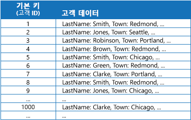
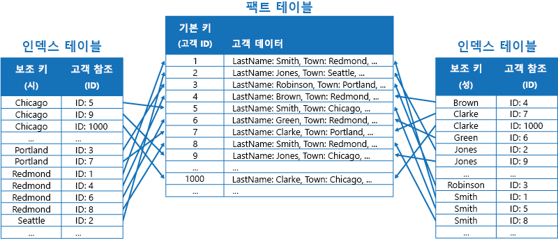
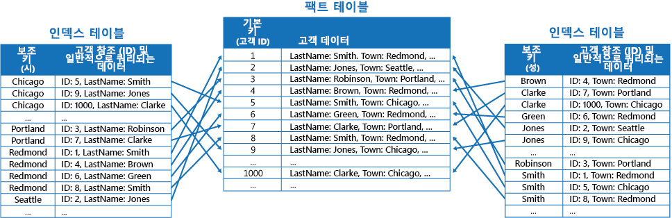
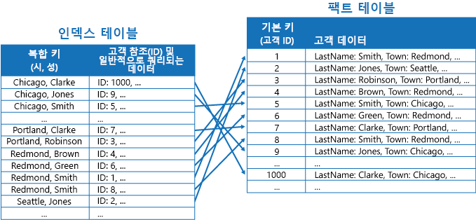
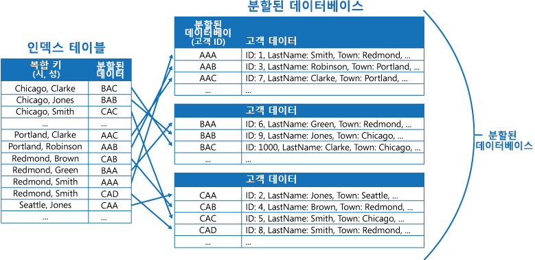
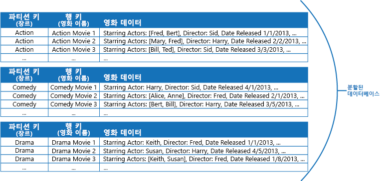
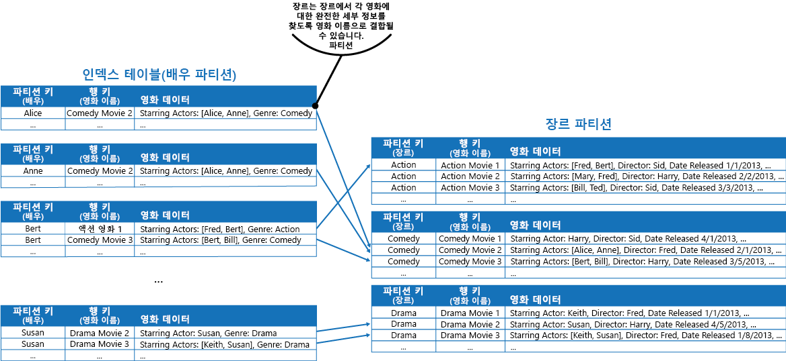

# 인덱스 테이블 패턴

[!INCLUDE [header](../_includes/header.md)]

쿼리에서 자주 참조하는 데이터 저장소의 필드에 대한 인덱스를 만듭니다. 이 패턴은 응용 프로그램이 데이터 저장소에서 검색할 데이터를 더 신속하게 찾을 수 있어 쿼리 성능을 향상시킬 수 있습니다.

## 컨텍스트 및 문제점

많은 데이터 저장소는 기본 키를 사용해 엔터티 모음에 대한 데이터를 구성합니다. 응용 프로그램은 기본 키를 사용해 데이터를 찾고 검색할 수 있습니다. 다음 그림은 고객 정보를 보관하는 데이터 저장소의 예를 보여 줍니다. 기본 키는 Customer ID입니다. 다음 그림은 기본 키(Customer ID)를 사용해 구성한 고객 정보를 보여 줍니다.

기본 키가 기본 키의 값을 기준으로 데이터를 가져오는 쿼리에 중요한 경우, 일부 다른 필드를 기준으로 데이터를 검색해야 하면 응용 프로그램은 기본 키를 사용하지 않을 수 있습니다. Customers 테이블의 예에서 고객이 사는 마을과 같이 일부 다른 특성의 값만 참조해 데이터를 쿼리하면 응용 프로그램은 Customer ID 기본 키를 사용해 고객을 검색할 수 없습니다. 이런 쿼리를 수행하려면 응용 프로그램은 모든 고객 레코드를 가져와 조사해야 할 수 있으며, 그러면 프로세스가 느려질 수 있습니다.

많은 관계형 데이터베이스 관리 시스템은 보조 인덱스를 지원합니다. 보조 인덱스는 하나 이상의 기본이 아닌(보조) 키 필드로 구성되는 별도의 데이터 구조이며 각 인덱스 값을 위한 데이터가 저장된다는 것을 의미합니다. 보조 인덱스의 항목은 대개 데이터를 빠르게 조회할 수 있도록 보조 키의 값으로 정렬됩니다. 보통 보조 인덱스는 데이터베이스 관리 시스템을 통해 자동으로 유지됩니다.

응용 프로그램이 수행하는 다양한 쿼리를 지원하는데 필요한 개수만큼 보조 인덱스를 생성할 수 있습니다. 예를 들면 Customer ID가 기본 키인 관계형 데이터베이스의 Customers 테이블에서 응용 프로그램이 거주하는 마을을 기준으로 고객을 자주 조회하는 경우 마을 필드에 보조 인덱스를 추가하는 것이 유용합니다.

그러나 관계형 시스템에서 보조 인덱스를 일반적으로 사용하더라도 클라우드 응용 프로그램이 사용하는 대부분의 NoSQL 데이터 저장소는 동등한 기능을 제공하지 않습니다.

## 해결 방법

데이터 저장소가 보조 인덱스를 지원하지 않는 경우, 보조 인덱스는 인덱스 테이블을 생성해 수동으로 에뮬레이트할 수 있습니다. 인덱스 테이블은 지정된 키를 통해 데이터를 구성합니다. 일반적으로 필요한 보조 인덱스의 개수와 응용 프로그램이 수행하는 쿼리의 특성에 따라 인덱스 테이블을 구성하는 데 3가지 전략이 사용됩니다.

첫 번째 전략은 데이터를 각각의 인덱스 테이블에 복제하고 다른 키로 구성하는 것입니다(완전 역정규화). 다음 그림은 Town과 LastName을 기준으로 동일한 고객 정보를 구성하는 인덱스 테이블을 보여 줍니다.

이 전략은 각 키를 사용해 쿼리하는 횟수에 비해 데이터가 비교적 정적인 경우에 적절합니다. 데이터가 너무 동적이면 각 인덱스 테이블을 유지하는 처리 오버헤드가 너무 커서 이런 접근 방식이 유용하지 않게 됩니다. 또한 데이터 볼륨이 너무 크면 복제 데이터를 저장하는 데 필요한 공간이 커집니다.

두 번째 전략은 다음 그림에서처럼 다른 키로 구성되는 정규화된 인덱스 테이블을 생성하고 데이터를 복제하기보다 기본 키를 사용해 원본 데이터를 참조하는 것입니다. 원본 데이터를 팩트 테이블이라고 부릅니다.

이 기법은 공간을 절약하고 복제 데이터를 유지하는 오버헤드를 줄인다는 장점이 있습니다. 단점은 응용 프로그램이 보조 키를 사용해 두 번의 조회 작업을 수행해야만 데이터를 찾을 수 있다는 것입니다. 그리고 인덱스 테이블에서 데이터의 기본 키를 찾은 다음 기본 키를 사용해 팩트 테이블의 데이터를 조회해야 합니다.

세 번째 전략은 다른 키로 구성되고 자주 검색된 필드를 복제하는 부분적으로 정규화된 인덱스 테이블을 생성하는 것입니다. 비교적 적게 액세스된 필드에 대한 액세스는 팩트 테이블을 참조합니다. 다음 그림은 일반적으로 액세스되는 데이터를 각 인덱스 테이블에 복제하는 방법을 보여 줍니다.

이 전략을 사용하면 첫 번째 접근 방식과 두 번째 접근 방식 사이에 균형을 유지할 수 있습니다. 단일 조회를 사용해 일반 쿼리를 위한 데이터를 빠르게 검색할 수 있으면서도 공간과 유지 관리 오버헤드는 전체 데이터 집합을 복제하는 것만큼 크지 않습니다.

응용 프로그램이 값의 조합(예: “Redmond에 살고 성이 Smith인 모든 고객 찾기”)을 지정해 데이터를 자주 쿼리하는 경우, 인덱스 테이블의 항목에 대한 키를 Town 특성과 LastName 특성의 연결로 구현할 수 있습니다. 다음 그림은 복합 키를 기준으로 하는 인덱스 테이블을 보여 줍니다. 키는 먼저 Town을 기준으로 정렬된 다음 Town의 값이 동일한 레코드에 대해 LastName을 기준으로 정렬됩니다.

인덱스 테이블은 분할 데이터를 대상으로 하는 쿼리 작업의 속도를 높일 수 있는데, 분할 키가 해시된 경우 특히 유용합니다. 다음 그림은 분할 키가 Customer ID의 해시인 예를 보여 줍니다. 인덱스 테이블은 데이터를 해시되지 않은 값(Town과 LastName)으로 구성하고 해시된 분할 키를 조회 데이터로 제공할 수 있습니다. 이렇게 하면 범위 내에 있는 데이터를 검색해야 하거나 해시되지 않은 키의 순서로 데이터를 검색해야 하는 경우 응용 프로그램이 해시 키를 반복적으로 계산(비용이 드는 작업)할 필요가 없습니다. 예를 들어 “Redmond에 사는 모든 고객 찾기”와 같은 쿼리는 인덱스 테이블에서 일치하는 항목을 찾아 신속하게 해결할 수 있습니다(일치하는 항목은 모두 연속 블록에 저장됨). 그런 다음 인덱스 테이블에 저장된 분할 키를 사용해 고객 데이터에 대한 참조를 따릅니다.

## 문제 및 고려 사항

이 패턴을 구현할 방법을 결정할 때 다음 사항을 고려하세요.

- 보조 인덱스를 유지하는 오버헤드가 클 수 있습니다. 사용자는 응용 프로그램이 사용하는 쿼리를 분석하고 이해해야 합니다. 인덱스 테이블은 정기적으로 사용할 가능성이 있는 경우에만 생성합니다. 응용 프로그램이 수행하지 않거나 가끔씩만 수행하는 쿼리를 지원하기 위한 인덱스 테이블은 굳이 생성할 필요가 없습니다.
- 인덱스 테이블에 데이터를 복제하는 것은 데이터의 다중 사본을 유지하는 데 필요한 저장 비용과 노력에 상당한 오버헤드를 추가할 수 있습니다.
- 인덱스 테이블을 원본 데이터를 참조하는 정규화된 구조로 구현하려면 응용 프로그램이 데이터를 찾기 위해 두 번의 조회 작업을 수행해야 합니다. 첫 번째 작업은 인덱스 테이블을 검색해 기본 키를 검색하고, 두 번째 작업은 기본 키를 사용해 데이터를 가져옵니다.
- 시스템이 대량의 데이터 집합에 대한 많은 인덱스 테이블을 통합하는 경우, 인덱스 테이블과 원본 데이터 사이에 일관성을 유지하는 것이 어려울 수 있습니다. 응용 프로그램은 최종 일관성 모델로 디자인할 수 있습니다. 예를 들어 데이터를 삽입, 업데이트 또는 삭제하기 위해 응용 프로그램은 메시지를 큐에 게시하고 별도의 작업을 사용해 동작을 수행하며 이런 데이터를 비동기적으로 참조하는 인덱스 테이블을 유지할 수 있습니다. 최종 일관성을 구현하는 방법에 대한 자세한 내용은 [데이터 일관성 입문서](https://msdn.microsoft.com/library/dn589800.aspx)를 참조하세요.

   >  Microsoft Azure 저장소 테이블은 동일한 파티션에 보관되는 데이터에 수행된 변경 사항에 대한 트랜잭션 업데이트(엔터티 그룹 트랜잭션)를 지원합니다. 동일한 파티션에 있는 하나의 팩트 테이블과 하나 이상의 인덱스 테이블에 데이터를 저장할 수 있는 경우, 이 기능을 사용하면 일관성을 보장하는 데 도움을 줄 수 있습니다.

- 인덱스 테이블은 나누거나 분할할 수 있습니다.

## 이 패턴을 사용해야 하는 경우

이 패턴은 응용 프로그램이 기본(또는 분할) 키가 아닌 다른 키를 사용해 데이터를 자주 검색해야 할 때 쿼리 성능을 높이기 위해 사용합니다.

다음의 경우에는 이 패턴이 유용하지 않습니다.

- 데이터가 휘발성인 경우. 인덱스 테이블은 매우 빠르게 구식이 되어 비효과적이 되거나 인덱스 테이블을 유지하는 오버헤드가 인덱스 테이블의 사용을 통해 절감한 비용보다 커질 수 있습니다.
- 인덱스 테이블을 위해 보조 키로 선택한 필드가 구분할 수 없고 작은 값의 집합(예: 성별)만 포함할 수 있는 경우
- 인덱스 테이블을 위해 보조 키로 선택한 필드에서 데이터 값의 균형이 매우 비대칭인 경우. 예를 들어 레코드의 90%가 하나의 필드에서 동일한 값을 포함하면 이 필드를 기준으로 데이터를 조회하기 위해 인덱스 테이블을 생성하고 유지하는 것이 데이터 전체를 순차적으로 스캔하는 것보다 많은 오버헤드를 초래할 수 있습니다. 그러나 나머지 10%에 있는 대상 값을 굉장히 자주 쿼리하는 경우에는 이 인덱스가 유용할 수 있습니다. 사용자는 응용 프로그램이 수행하고 있는 쿼리뿐 아니라 쿼리를 얼마나 자주 수행하는지를 이해해야 합니다.

## 예

Azure 저장소 테이블은 클라우드에서 실행 중인 응용 프로그램에 대한 확장성이 뛰어난 키/값 데이터 저장소를 제공합니다. 응용 프로그램은 키를 지정해 데이터 값을 저장하고 검색합니다. 데이터 값은 여러 필드를 포함할 수 있지만, 데이터 항목의 구조는 단순히 데이터 항목을 바이트의 배열로 처리하는 테이블 저장소가 이해하기 힘듭니다.

Azure 저장소 테이블은 분할도 지원합니다. 분할 키는 두 요소인 파티션 키와 행 키를 포함합니다. 파티션 키가 동일한 항목은 동일한 파티션(분할된 데이터베이스)에 저장되고, 항목은 분할된 데이터베이스 내에 행 키 순서로 저장됩니다. 테이블 저장소는 파티션 내에서 행 키 값의 연속 범위 내에 속한 데이터를 가져오는 쿼리를 수행할 수 있도록 최적화됩니다. Azure 테이블에 정보를 저장하는 클라우드 응용 프로그램을 작성하는 경우에는 이런 기능을 염두에 두고 데이터를 구조화해야 합니다.

예를 들면 영화에 대한 정보를 저장하는 응용 프로그램을 생각해볼 수 있습니다. 응용 프로그램은 장르(액션, 다큐멘터리, 역사, 코메디, 드라마 등)를 기준으로 영화를 자주 쿼리합니다. 사용자는 다음 그림에서처럼 장르를 파티션 키로 사용하고 영화 이름을 행 키로 지정해 Azure 테이블을 생성할 수 있습니다.

이런 접근 방식은 응용 프로그램이 주연 배우로도 영화를 쿼리해야 하는 경우 효과가 떨어집니다. 이 경우 인덱스 테이블로 작용하는 별도의 Azure 테이블을 생성할 수 있습니다. 파티션 키는 배우이고 행 키는 영화 이름입니다. 각 배우의 데이터는 별도의 파티션에 저장됩니다. 영화에 주연 배우가 한 명 이상이면 동일한 영화가 여러 파티션에 발생하게 됩니다.

영화 데이터는 위의 해결책 섹션에서 설명한 첫 번째 접근 방식을 채택해 각 파티션에 보관되는 값에 복제할 수 있습니다. 그러나 각 영화는 여러 번 중복될 수 있으므로(주연 배우당 한 번) 가장 일반적인 쿼리(다른 주연 배우의 이름)를 지원하고 응용 프로그램이 장르 파티션에서 완전한 정보를 찾는 데 필요한 파티션 키를 삽입해 나머지 세부 정보를 검색할 수 있도록 데이터를 부분적으로 역정규화하는 것이 더 효율적일 수 있습니다. 이런 접근 방식은 해결 방법 섹션의 세 번째 옵션에 설명되어 있습니다. 다음 그림은 이런 접근 방식을 보여 줍니다.

## 관련 패턴 및 지침

이 패턴을 구현할 때 다음 패턴 및 지침도 관련이 있을 수 있습니다.

- [데이터 일관성 입문서](https://msdn.microsoft.com/library/dn589800.aspx). 인덱스 테이블은 변경 사항을 인덱싱하는 데이터로 유지되어야 합니다. 클라우드에서는 데이터를 수정하는 동일한 트랜잭션의 일부로 인덱스를 업데이트하는 작업을 수행하는 것이 불가능하거나 적절하지 않을 수 있습니다. 이 경우 결과적으로 일관되는 접근 방식이 더 적합합니다. 최종 일관성과 관련된 문제에 대한 정보를 제공합니다.
- [분할 패턴](https://msdn.microsoft.com/library/dn589797.aspx). 인덱스 테이블 패턴은 분할된 데이터베이스를 사용해 분할한 데이터와 함께 자주 사용합니다. 분할 패턴은 데이터 저장소를 분할된 데이터베이스 집합으로 분할하는 방법에 대한 추가 정보를 제공합니다.
- [구체화된 뷰 패턴](materialized-view.md). 데이터를 요약하는 쿼리를 지원하기 위한 데이터 인덱싱 대신 데이터의 구체화된 뷰를 생성하는 것이 더 적절할 수 있습니다. 데이터의 미리 채워진 뷰를 생성해 효울적인 요약 쿼리를 지원하는 방법을 설명합니다.
