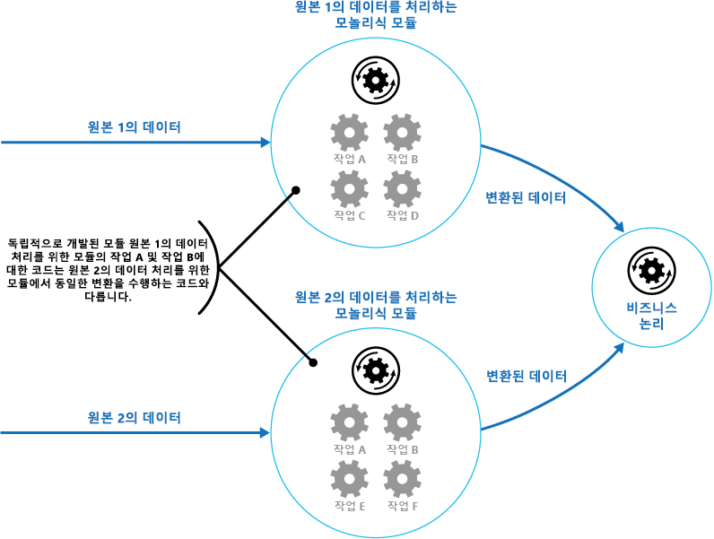
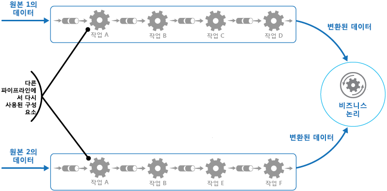
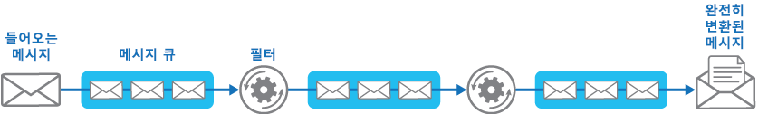

# <a name="pipes-and-filters-pattern"></a>파이프 및 필터 패턴

[!INCLUDE [header](../_includes/header.md)]

복잡한 처리를 수행하는 작업을 재사용 가능한 일련의 독립 요소로 나눕니다. 이렇게 하면 처리를 수행하는 작업 요소를 독립적으로 배포하고 크기를 조정할 수 있으므로 성능, 확장성, 재사용성을 개선할 수 있습니다.

## <a name="context-and-problem"></a>컨텍스트 및 문제점

응용 프로그램은 처리되는 정보의 복잡도가 서로 다른 여러 작업을 수행해야 합니다. 간단하면서도 유연성 없는 응용 프로그램 구현 방식은 이 처리를 모놀리식 모듈로 수행하는 것입니다. 그러나 이러한 접근은 어플리케이션 내의 다른 부분에서 중복된 프로세싱이 필요한 경우에 대해, 코드 리팩터링 및 최적화 그리고 재사용의 기회를 줄일 가능성이 있습니다.

그림은 모노리식 방식을 사용해 처리할 때의 문제점을 보여 줍니다. 응용 프로그램은 두 가지 원본의 데이터를 받아서 처리합니다. 각 원본의 데이터는 각각 다른 모듈에 의해 처리되며, 이 모듈은 응용 프로그램 비즈니스 논리로 전달하기 전에 이 데이터를 변환하는 일련의 작업을 수행합니다.



모노리식 모듈이 수행하는 작업 일부는 기능적인 측면에서 아주 유사하지만 서로 다르게 설계되어 있습니다. 작업을 구현하는 코드는 모듈 내에 밀접하게 결합되어 있으며, 재사용 또는 확장성은 거의 고려하지 않고 개발되었습니다.

단, 각 모듈에서 수행하는 처리 작업 또는 각 작업에 대한 배포 요구사항은 비즈니스 요구사항이 업데이트될 때 변경될 수 있습니다. 계산 집약적인 일부 작업은 강력한 하드웨어에서 실행하면 좋지만, 일부 작업은 그렇게 값비싼 리소스가 필요하지 않을 수 있습니다. 또한, 향후 추가적인 처리가 필요하거나 해당 처리로 수행되는 작업 순서가 변경될 수 있습니다. 이러한 문제를 처리하고 코드 재사용 가능성을 높여 주는 솔루션이 필요합니다.

## <a name="solution"></a>해결 방법

각 스트림에 필요한 처리를 각각 단일 작업을 수행하는 일련의 독립 구성 요소(또는 필터)로 나눕니다. 각 구성 요소가 받아서 보내는 데이터의 형식을 표준화하면, 이 필터를 하나의 파이프라인으로 결합할 수 있습니다. 이렇게 하면 코드 중복을 방지할 수 있으며, 처리 요구 사항이 변경되는 경우 추가 구성 요소를 제거, 대체 또는 통합하는 것이 쉬워집니다. 다음 그림은 파이프 및 필터를 사용해 구현된 솔루션을 보여 줍니다.




단일 요청을 처리하는 데 소요되는 시간은 파이프라인에서 가장 느린 필터의 속도에 좌우됩니다. 한 개 이상의 필터로 인해 특히 특정 데이터 원본의 스트림에서 대량의 요청이 나타날 때 병목 현상이 발생할 수 있습니다. 파이프라인 구조의 주요 장점은 느린 필터의 병렬 인스턴스를 실행할 수 있어 시스템이 부하를 분배하고 처리량을 개선할 수 있다는 것입니다.

파이프라인을 구성하는 필터는 다양한 장비에서 실행할 수 있기 때문에, 독립적으로 크기를 조정할 수 있으며 여러 클라우드 환경이 제공하는 탄력성을 활용할 수 있습니다. 계산 집약적인 필터는 고성능 하드웨어에서 실행할 수 있지만, 소모량이 낮은 필터는 그 보다 비용이 낮은 상용 하드웨어에 호스팅할 수 있습니다. 필터는 동일한 데이터 센터나 지리적 위치에 있을 필요는 없으므로, 같은 파이프라인의 요소들을 각각 필요한 리소스에 가까운 환경에서 실행할 수 있습니다.  다음 그림은 원본 1의 데이터에 대한 파이프라인에 적용되는 예시를 보여 줍니다.


필터의 입력과 출력이 한 스트림으로 구성된 경우, 각 필터를 동시에 처리할 수 있습니다. 파이프라인의 첫 번째 필터가 작업을 시작해서 결과를 출력하고, 이는 첫 번째 필터가 작업을 완료하기 전에 순서대로 그 다음 필터로 직접 전달됩니다.

또 다른 장점은 이 모델이 제공할 수 있는 복원력입니다. 필터가 고장나거나 해당 장비를 더 이상 사용할 수 없는 경우, 파이프라인은 필터가 수행하던 작업의 일정을 조정하고 이 작업을 다른 구성 요소 인스턴스로 보낼 수 있습니다. 단일 필터의 실패가 반드시 전체 파이프라인의 실패로 이어지지는 않습니다.

파이프 및 필터 패턴을 [보상 트랜잭션 패턴](compensating-transaction.md)과 함께 사용하는 것은 분산 트랜잭션을 구현하는 또 다른 방식입니다. 분산 트랜잭션은 분리된 보상 가능 작업으로 나눌 수 있으며, 이 작업은 각각 보상 트랜잭션 패턴을 구현하는 필터를 사용해 구현할 수 있습니다. 파이프라인의 필터는 유지 관리되는 데이터에 근접해 실행되는 별도로 호스트된 작업으로 구현할 수 있습니다.

## <a name="issues-and-considerations"></a>문제 및 고려 사항

이 패턴을 구현할 방법을 결정할 때 다음 사항을 고려해야 합니다.
- **복잡성**. 이 패턴의 향상된 유연성으로 인해 파이프라인의 필터가 여러 서버에 걸쳐 분포되어 있는 경우 복잡성을 야기할 수 있습니다.

- **신뢰성**. 파이프라인의 필터 사이에 흐르는 데이터가 손실되지 않는 인프라를 사용합니다.

- **멱등성**. 메시지를 수신한 후 파이프라인의 필터에 오류가 나서 작업을 해당 필터의 다른 인스턴스로 조정한 경우, 작업 일부가 이미 완료되었을 수 있습니다. 이 작업이 전역 상태의 일부 측면(데이터베이스에 저장된 정보 등)을 업데이트하는 경우, 동일한 업데이트가 반복될 수 있습니다. 파이프라인의 그 다음 필터에 결과를 게시한 후 작업을 성공적으로 완료했다는 표시를 하기 전 필터가 실패하는 경우 동일한 문제가 발생할 수 있습니다. 이러한 경우, 동일한 작업을 필터의 다른 인스턴스에서 반복하여 같은 결과를 두 번 게시하게 됩니다. 이로 인해 파이프라인의 그 다음 필터가 같은 데이터를 두 번 처리하게 됩니다. 그러므로 파이프라인의 필터는 멱등성을 가지도록 설계해야 합니다. 자세한 내용은 Jonathan Oliver에서 [멱등성 패턴](http://blog.jonathanoliver.com/idempotency-patterns/)을 참조하세요.

- **반복 메시지**. 파이프라인의 다음 단계로 메시지를 게시한 후 파이프라인의 필터가 실패하는 경우, 해당 필터의 다른 인스턴스가 실행될 수 있으며 동일한 메시지 복사본을 파이프라인에 게시합니다. 이로 인해 같은 메시지의 인스턴스 두 개가 다음 필터로 전달됩니다. 이것을 방지하려면 파이프라인은 중복 메시지를 감지하여 제거해야 합니다.

    >  메시지 큐(Microsoft Azure Service Bus 큐 등)를 사용해 파이프라인을 구현하는 경우, 메시지 큐 인프라에 자동 중복 메시지 감지 및 제거 기능이 있어야 합니다.

- **컨텍스트 및 상태**. 파이프라인에서 각 필터는 기본적으로 분리되어 실행되며 호출된 방식에 대한 가정을 해서는 안 됩니다. 즉, 각 필터에는 작업을 수행할 충분한 컨텍스트가 제공되어야 한다는 뜻입니다. 이 컨텍스트에는 대량의 상태 정보가 포함될 수 있습니다.

## <a name="when-to-use-this-pattern"></a>이 패턴을 사용해야 하는 경우

다음 경우에 이 패턴을 사용합니다.
- 응용 프로그램에 필요한 처리는 일련의 독립된 단계로 쉽게 나눌 수 있는 경우

- 응용 프로그램에서 수행하는 처리 단계는 확장성 요구 사항이 서로 다른 경우

    >  동일한 프로세스에서 같이 크기를 조정해야 하는 필터를 그룹화할 수 있습니다. 자세한 내용은 [계산 리소스 통합 패턴](compute-resource-consolidation.md)을 참조하세요.

- 응용 프로그램이 수행하는 처리 단계의 순서를 다시 매기려면 유연성이 필요하거나 단계를 추가 및 제거할 용량이 필요한 경우

- 여러 서버에 걸친 단계 처리를 배포함으로써 시스템이 장점을 취할 수 있는 경우

- 데이터가 처리되는 중에 어느 단계의 실패를 최소화할 수 있는 신뢰성 있는 솔루션이 필요한 경우

다음의 경우에는 이 패턴이 유용하지 않습니다.
- 응용 프로그램에서 수행하는 처리 단계가 독립적이지 않거나 동일한 트랜잭션의 일부로 같이 수행해야 하는 경우

- 해당 단계에 필요한 텍스트 또는 상태 정보의 양으로 인해 이러한 접근의 효율성이 떨어지는 경우. 대신 상태 정보를 데이터베이스에 유지할 수 있습니다. 단, 데이터베이스에 대한 추가 부하로 인해 경합이 과도해지는 경우 이 전략을 사용하지 마세요.

## <a name="example"></a>예

메시지 큐의 시퀀스를 사용해 파이프라인 구현에 필요한 인프라를 제공할 수 있습니다. 초기 메시지 큐는 처리되지 않은 메시지를 수신합니다. 필터 작업으로 구현된 구성 요소가 이 큐에서 메시지에 대한 수신 대기를 하고, 해당 작업을 수행한 다음 시퀀스의 다음 큐로 변환된 메시지를 게시합니다. 완전히 변환된 데이터가 큐의 최종 메시지에 표시될 때가지 다른 필터 작업이 이 큐에서 메시지에 대한 수신 대기를 하고, 이를 처리하며, 다른 큐로 결과를 게시할 수 있습니다. 다음 그림은 메시지 큐를 사용한 파이프라인 구현을 보여 줍니다.




Azure에 솔루션을 빌드하는 경우, 서비스 버스 큐를 사용해 신뢰성 및 확장성 있는 큐 메커니즘을 제공할 수 있습니다. C#로 된 아래 `ServiceBusPipeFilter` 클래스는 큐로부터 입력 메시지를 수신하여, 이 메시지를 처리해 그 결과를 다른 큐에 게시하는 필터를 구현하는 방법을 보여 줍니다.

>  `ServiceBusPipeFilter` 클래스는 [GitHub](https://github.com/mspnp/cloud-design-patterns/tree/master/pipes-and-filters)에서 사용할 수 있는 PipesAndFilters.Shared 프로젝트에 정의되어 있습니다.

```csharp
public class ServiceBusPipeFilter
{
  ...
  private readonly string inQueuePath;
  private readonly string outQueuePath;
  ...
  private QueueClient inQueue;
  private QueueClient outQueue;
  ...

  public ServiceBusPipeFilter(..., string inQueuePath, string outQueuePath = null)
  {
     ...
     this.inQueuePath = inQueuePath;
     this.outQueuePath = outQueuePath;
  }

  public void Start()
  {
    ...
    // Create the outbound filter queue if it doesn't exist.
    ...
    this.outQueue = QueueClient.CreateFromConnectionString(...);

    ...
    // Create the inbound and outbound queue clients.
    this.inQueue = QueueClient.CreateFromConnectionString(...);
  }

  public void OnPipeFilterMessageAsync(
    Func<BrokeredMessage, Task<BrokeredMessage>> asyncFilterTask, ...)
  {
    ...

    this.inQueue.OnMessageAsync(
      async (msg) =>
    {
      ...
      // Process the filter and send the output to the
      // next queue in the pipeline.
      var outMessage = await asyncFilterTask(msg);

      // Send the message from the filter processor
      // to the next queue in the pipeline.
      if (outQueue != null)
      {
        await outQueue.SendAsync(outMessage);
      }

      // Note: There's a chance that the same message could be sent twice
      // or that a message gets processed by an upstream or downstream
      // filter at the same time.
      // This would happen in a situation where processing of a message was
      // completed, it was sent to the next pipe/queue, and then failed
      // to complete when using the PeekLock method.
      // Idempotent message processing and concurrency should be considered
      // in a real-world implementation.
    },
    options);
  }

  public async Task Close(TimeSpan timespan)
  {
    // Pause the processing threads.
    this.pauseProcessingEvent.Reset();

    // There's no clean approach for waiting for the threads to complete
    // the processing. This example simply stops any new processing, waits
    // for the existing thread to complete, then closes the message pump
    // and finally returns.
    Thread.Sleep(timespan);

    this.inQueue.Close();
    ...
  }

  ...
}
```

`ServiceBusPipeFilter` 클래스의 `Start` 메서드는 한 쌍의 입력과 출력 큐로 연결되어 있으며, `Close` 메서드는 입력 큐와의 연결이 차단됩니다. `OnPipeFilterMessageAsync` 메서드는 실제 메시지 처리를 수행하며 이 메서드에 대한 `asyncFilterTask` 매개 변수는 수행할 처리를 지정합니다. `OnPipeFilterMessageAsync` 메서드는 입력 큐에서 메시지 수신까지 대기하며, 메시지가 도착하면 각 메시지에서 `asyncFilterTask` 매개 변수가 지정한 코드를 실행하고, 그 결과를 출력 큐에 게시합니다. 큐 자체는 생성자에 의해 지정됩니다.

동일한 솔루션으로 일련의 작업자 역할에서 필터를 구현합니다. 각 작업자 역할은 수행하는 비즈니스 처리의 복잡도 또는 처리에 필요한 리소스에 따라 독립적으로 크기를 조정할 수 있습니다. 또한, 처리량을 늘리기 위해 각 작업자 역할의 인스턴스를 여러 개 동시에 실행할 수 있습니다.

아래 코드는 이름이 `PipeFilterARoleEntry`인 Azure 작업자 역할로, 샘플 솔루션의 PipeFilterA 프로젝트에 정의되어 있습니다.

```csharp
public class PipeFilterARoleEntry : RoleEntryPoint
{
  ...
  private ServiceBusPipeFilter pipeFilterA;

  public override bool OnStart()
  {
    ...
    this.pipeFilterA = new ServiceBusPipeFilter(
      ...,
      Constants.QueueAPath,
      Constants.QueueBPath);

    this.pipeFilterA.Start();
    ...
  }

  public override void Run()
  {
    this.pipeFilterA.OnPipeFilterMessageAsync(async (msg) =>
    {
      // Clone the message and update it.
      // Properties set by the broker (Deliver count, enqueue time, ...)
      // aren't cloned and must be copied over if required.
      var newMsg = msg.Clone();

      await Task.Delay(500); // DOING WORK

      Trace.TraceInformation("Filter A processed message:{0} at {1}",
        msg.MessageId, DateTime.UtcNow);

      newMsg.Properties.Add(Constants.FilterAMessageKey, "Complete");

      return newMsg;
    });

    ...
  }

  ...
}
```

이 역할에는 `ServiceBusPipeFilter`  개체가 포함되어 있습니다. 역할에서 `OnStart` 메서드는 입력 메시지 수신과 출력 메시지 게시를 위해 큐에 연결되어 있습니다(큐의 이름은 `Constants` 클래스에 정의되어 있음). `Run` 메서드는 수신한 각 메시지에서 일부 처리를 수행하기 위해 `OnPipeFilterMessagesAsync` 메서드를 호출합니다(이 예제에서는 짧은 시간 동안 대기함으로써 처리를 시뮬레이트함). 처리가 완료되면, 결과를 포함한 새 메시지가 생성되고(이 경우, 입력 메시지에 사용자 지정 속성이 추가되어 있음), 이 메시지는 출력 큐에 게시됩니다.

샘플 코드에서는 PipeFilterB 프로젝트에 `PipeFilterBRoleEntry`라는 이름의 작업자 역할이 포함되어 있습니다. 이 역할은 `PipeFilterARoleEntry`와 유사하지만 `Run` 메서드로 다른 처리를 수행한다는 점에서 차이가 있습니다. 예제 솔루션에서는 이 두 역할이 결합되어 한 파이프라인을 구성하고 있으며 `PipeFilterARoleEntry` 역할에 대한 출력 큐는 `PipeFilterBRoleEntry` 역할에 대한 입력 큐입니다.

또한 샘플 솔루션은 이름이 `InitialSenderRoleEntry`(InitialSender 프로젝트) 및 `FinalReceiverRoleEntry`(FinalReceiver 프로젝트)인 두 개의 추가 역할을 제공합니다. `InitialSenderRoleEntry` 역할은 파이프라인의 초기 메시지를 제공합니다. `OnStart` 메서드는 단일 큐에 연결되며 `Run` 메서드가 이 큐에 메서드를 게시합니다. 이 큐는 `PipeFilterARoleEntry` 역할이 사용하는 입력 큐이므로, 이 큐에 메시지를 게시하면 해당 메시지를 `PipeFilterARoleEntry` 역할이 수신하여 처리합니다. 그런 다음 처리된 메시지는 `PipeFilterBRoleEntry` 역할을 통해 전달됩니다.

`FinalReceiveRoleEntry` 역할의 입력 큐는 `PipeFilterBRoleEntry` 역할의 출력 큐입니다. 아래 나타나 있는 `FinalReceiveRoleEntry` 역할의 `Run` 메시지를 수신하여 최종 처리 중 일부를 수행합니다. 그런 다음 파이프라인의 필터에서 추가한 사용자 지정 속성값을 출력 추적에 씁니다.

```csharp
public class FinalReceiverRoleEntry : RoleEntryPoint
{
  ...
  // Final queue/pipe in the pipeline to process data from.
  private ServiceBusPipeFilter queueFinal;

  public override bool OnStart()
  {
    ...
    // Set up the queue.
    this.queueFinal = new ServiceBusPipeFilter(...,Constants.QueueFinalPath);
    this.queueFinal.Start();
    ...
  }

  public override void Run()
  {
    this.queueFinal.OnPipeFilterMessageAsync(
      async (msg) =>
      {
        await Task.Delay(500); // DOING WORK

        // The pipeline message was received.
        Trace.TraceInformation(
          "Pipeline Message Complete - FilterA:{0} FilterB:{1}",
          msg.Properties[Constants.FilterAMessageKey],
          msg.Properties[Constants.FilterBMessageKey]);

        return null;
      });
    ...
  }

  ...
}
```

## <a name="related-patterns-and-guidance"></a>관련 패턴 및 지침

이 패턴을 구현할 때 다음 패턴 및 지침도 관련이 있을 수 있습니다.
- 이 패턴을 [GitHub](https://github.com/mspnp/cloud-design-patterns/tree/master/pipes-and-filters)에서 사용할 수 있음을 보여주는 샘플.
- [경쟁 소비자 패턴](competing-consumers.md) 파이프라인에는 하나 이상의 필터의 여러 인스턴스가 포함될 수 있습니다. 이 방법은 느린 필터의 병렬 인스턴스를 실행할 때 시스템이 부하를 분산시키고 처리량을 향상시킬 수 있도록 하므로 유용합니다. 필터의 각 인스턴스는 다른 인스턴스의 입력과 경쟁하며, 한 필터의 두 인스턴스가 같은 데이터를 처리할 수는 없습니다. 이 방법에 대한 설명이 제공됩니다.
- [계산 리소스 통합 패턴](compute-resource-consolidation.md) 동일한 프로세스에서 같이 크기를 조정해야 하는 필터를 그룹화할 수 있습니다. 이 전략의 장단점에 대한 자세한 내용을 제공합니다.
- [보상 트랜잭션 패턴](compensating-transaction.md). 필터를 되돌릴 수 있거나, 오류가 발생할 때 상태를 이전 상태로 복원하는 보상 작업을 포함하는 작업으로 구현할 수 있습니다. 이 기능을 구현하여 최종 일관성을 유지 관리하거나 달성하기 위한 방법을 설명합니다.
- Jonathan Oliver의 [멱등성 패턴](http://blog.jonathanoliver.com/idempotency-patterns/)
