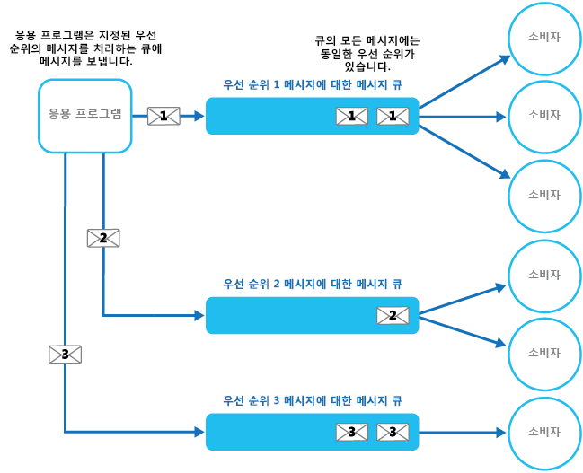
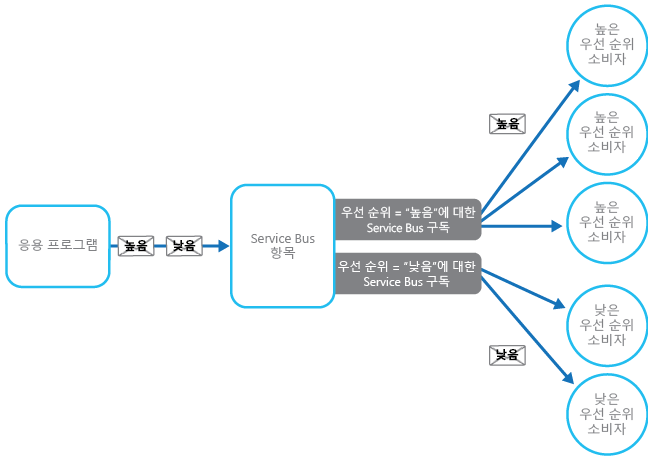

# <a name="priority-queue-pattern"></a><span data-ttu-id="7dd11-104">우선 순위 큐 패턴</span><span class="sxs-lookup"><span data-stu-id="7dd11-104">Priority Queue pattern</span></span>

[!INCLUDE [header](../_includes/header.md)]

<span data-ttu-id="7dd11-105">우선 순위가 높은 요청을 우선 순위가 낮은 요청보다 먼저 받아서 처리하도록 서비스로 전송된 요청의 우선 순위를 지정합니다.</span><span class="sxs-lookup"><span data-stu-id="7dd11-105">Prioritize requests sent to services so that requests with a higher priority are received and processed more quickly than those with a lower priority.</span></span> <span data-ttu-id="7dd11-106">이 패턴은 개별 클라이언트에 서로 다른 서비스 수준 보장을 제공하는 응용 프로그램에서 유용합니다.</span><span class="sxs-lookup"><span data-stu-id="7dd11-106">This pattern is useful in applications that offer different service level guarantees to individual clients.</span></span>

## <a name="context-and-problem"></a><span data-ttu-id="7dd11-107">컨텍스트 및 문제</span><span class="sxs-lookup"><span data-stu-id="7dd11-107">Context and Problem</span></span>

<span data-ttu-id="7dd11-108">응용 프로그램은 특정 작업(예: 백그라운드 처리 수행 또는 다른 응용 프로그램이나 서비스와의 통합)을 다른 서비스에 위임할 수 있습니다.</span><span class="sxs-lookup"><span data-stu-id="7dd11-108">Applications can delegate specific tasks to other services, for example, to perform background processing or to integrate with other applications or services.</span></span> <span data-ttu-id="7dd11-109">클라우드에서 메시지 큐는 일반적으로 작업을 백그라운드 처리에 위임하는 데 사용됩니다.</span><span class="sxs-lookup"><span data-stu-id="7dd11-109">In the cloud, a message queue is typically used to delegate tasks to background processing.</span></span> <span data-ttu-id="7dd11-110">대부분의 경우 서비스에서 수신되는 주문 요청은 중요하지 않습니다.</span><span class="sxs-lookup"><span data-stu-id="7dd11-110">In many cases the order requests are received in by a service isn't important.</span></span> <span data-ttu-id="7dd11-111">그러나 경우에 따라 특정 요청에 대해 우선 순위를 지정해야 합니다.</span><span class="sxs-lookup"><span data-stu-id="7dd11-111">In some cases, though, it's necessary to prioritize specific requests.</span></span> <span data-ttu-id="7dd11-112">이러한 요청은 이전에 응용 프로그램에서 보낸 우선 순위가 낮은 요청보다 먼저 처리해야 합니다.</span><span class="sxs-lookup"><span data-stu-id="7dd11-112">These requests should be processed earlier than lower priority requests that were sent previously by the application.</span></span>

## <a name="solution"></a><span data-ttu-id="7dd11-113">해결 방법</span><span class="sxs-lookup"><span data-stu-id="7dd11-113">Solution</span></span>

<span data-ttu-id="7dd11-114">큐는 일반적으로 FIFO(선입 선출) 구조이며, 소비자는 대개 큐에 게시된 것과 동일한 순서로 메시지를 받습니다.</span><span class="sxs-lookup"><span data-stu-id="7dd11-114">A queue is usually a first-in, first-out (FIFO) structure, and consumers typically receive messages in the same order that they were posted to the queue.</span></span> <span data-ttu-id="7dd11-115">그러나 일부 메시지 큐에서는 우선 순위 메시지를 지원합니다.</span><span class="sxs-lookup"><span data-stu-id="7dd11-115">However, some message queues support priority messaging.</span></span> <span data-ttu-id="7dd11-116">메시지를 게시하는 응용 프로그램은 우선 순위를 지정할 수 있으며, 이 경우 큐의 메시지가 자동으로 다시 정렬되어 우선 순위가 높은 메시지가 우선 순위가 낮은 메시지보다 먼저 수신됩니다.</span><span class="sxs-lookup"><span data-stu-id="7dd11-116">The application posting a message can assign a priority and the messages in the queue are automatically reordered so that those with a higher priority will be received before those with a lower priority.</span></span> <span data-ttu-id="7dd11-117">그림에서는 우선 순위 메시지가 있는 큐를 보여 줍니다.</span><span class="sxs-lookup"><span data-stu-id="7dd11-117">The figure illustrates a queue with priority messaging.</span></span>


> <span data-ttu-id="7dd11-119">대부분의 메시지 큐 구현은 [경쟁 소비자 패턴](https://msdn.microsoft.com/library/dn568101.aspx)에 따라 여러 소비자를 지원하며, 수요에 따라 소비자 프로세스의 수를 늘리거나 줄일 수 있습니다.</span><span class="sxs-lookup"><span data-stu-id="7dd11-119">Most message queue implementations support multiple consumers (following the [Competing Consumers pattern](https://msdn.microsoft.com/library/dn568101.aspx)), and the number of consumer processes can be scaled up or down depending on demand.</span></span>

<span data-ttu-id="7dd11-120">우선 순위 기반 메시지 큐를 지원하지 않는 시스템에서 적용할 수 있는 다른 솔루션은 각 우선 순위마다 별도의 큐를 유지하는 것입니다.</span><span class="sxs-lookup"><span data-stu-id="7dd11-120">In systems that don't support priority-based message queues, an alternative solution is to maintain a separate queue for each priority.</span></span> <span data-ttu-id="7dd11-121">응용 프로그램은 해당 큐에 메시지를 게시해야 합니다.</span><span class="sxs-lookup"><span data-stu-id="7dd11-121">The application is responsible for posting messages to the appropriate queue.</span></span> <span data-ttu-id="7dd11-122">각 큐에는 별도의 소비자 풀이 있을 수 있습니다.</span><span class="sxs-lookup"><span data-stu-id="7dd11-122">Each queue can have a separate pool of consumers.</span></span> <span data-ttu-id="7dd11-123">우선 순위가 높은 큐는 우선 순위가 낮은 큐보다 더 빠른 하드웨어에서 실행되는 더 큰 소비자 풀을 가질 수 있습니다.</span><span class="sxs-lookup"><span data-stu-id="7dd11-123">Higher priority queues can have a larger pool of consumers running on faster hardware than lower priority queues.</span></span> <span data-ttu-id="7dd11-124">다음 그림에서는 각 우선 순위마다 별도의 메시지 큐를 사용하는 방법을 보여 줍니다.</span><span class="sxs-lookup"><span data-stu-id="7dd11-124">The next figure illustrates using separate message queues for each priority.</span></span>




<span data-ttu-id="7dd11-126">이 전략의 변형은 우선 순위가 높은 큐의 메시지를 먼저 확인한 다음, 우선 순위가 낮은 큐에서 메시지를 가져오기 시작하는 단일 소비자 풀을 갖는 것입니다.</span><span class="sxs-lookup"><span data-stu-id="7dd11-126">A variation on this strategy is to have a single pool of consumers that check for messages on high priority queues first, and only then start to fetch messages from lower priority queues.</span></span> <span data-ttu-id="7dd11-127">단일 소비자 프로세스 풀을 사용하는 솔루션(우선 순위가 다른 메시지를 지원하는 단일 큐 또는 각각 단일 우선 순위의 메시지를 처리하는 큐를 여러 개 사용하는 솔루션) 및 각각 별도의 풀이 있는 큐를 여러 개 사용하는 솔루션 간에는 몇 가지 의미상의 차이가 있습니다.</span><span class="sxs-lookup"><span data-stu-id="7dd11-127">There are some semantic differences between a solution that uses a single pool of consumer processes (either with a single queue that supports messages with different priorities or with multiple queues that each handle messages of a single priority), and a solution that uses multiple queues with a separate pool for each queue.</span></span>

<span data-ttu-id="7dd11-128">단일 풀 접근 방식에서 우선 순위가 높은 메시지는 항상 우선 순위가 낮은 메시지보다 먼저 수신되고 처리됩니다.</span><span class="sxs-lookup"><span data-stu-id="7dd11-128">In the single pool approach, higher priority messages are always received and processed before lower priority messages.</span></span> <span data-ttu-id="7dd11-129">이론적으로, 우선 순위가 매우 낮은 메시지는 지속적으로 대체될 수 있으며, 이로 인해 처리되지 않을 수도 있습니다.</span><span class="sxs-lookup"><span data-stu-id="7dd11-129">In theory, messages that have a very low priority could be continually superseded and might never be processed.</span></span> <span data-ttu-id="7dd11-130">다중 풀 접근 방식에서 우선 순위가 낮은 메시지는 풀의 상대적 크기와 사용 가능한 리소스에 따라 항상 우선 순위가 높은 메시지만큼 빠르게 처리되지 않습니다.</span><span class="sxs-lookup"><span data-stu-id="7dd11-130">In the multiple pool approach, lower priority messages will always be processed, just not as quickly as those of a higher priority (depending on the relative size of the pools and the resources that they have available).</span></span>

<span data-ttu-id="7dd11-131">우선 순위 큐 메커니즘을 사용하면 다음과 같은 이점이 있습니다.</span><span class="sxs-lookup"><span data-stu-id="7dd11-131">Using a priority queuing mechanism can provide the following advantages:</span></span>

- <span data-ttu-id="7dd11-132">이를 통해 특정 고객 그룹에 서로 다른 수준의 서비스를 제공하는 것과 같이 가용성 또는 성능의 우선 순위를 요구한 비즈니스 요구 사항이 응용 프로그램에서 충족될 수 있습니다.</span><span class="sxs-lookup"><span data-stu-id="7dd11-132">It allows applications to meet business requirements that require prioritization of availability or performance, such as offering different levels of service to specific groups of customers.</span></span>

- <span data-ttu-id="7dd11-133">운영 비용을 최소화할 수 있습니다.</span><span class="sxs-lookup"><span data-stu-id="7dd11-133">It can help to minimize operational costs.</span></span> <span data-ttu-id="7dd11-134">단일 큐 접근 방식에서는 필요에 따라 소비자의 수를 조정할 수 있습니다.</span><span class="sxs-lookup"><span data-stu-id="7dd11-134">In the single queue approach, you can scale back the number of consumers if necessary.</span></span> <span data-ttu-id="7dd11-135">우선 순위가 높은 메시지가 먼저 처리되며(다소 느릴 수도 있음), 우선 순위가 낮은 메시지는 더 오래 지연될 수 있습니다.</span><span class="sxs-lookup"><span data-stu-id="7dd11-135">High priority messages will still be processed first (although possibly more slowly), and lower priority messages might be delayed for longer.</span></span> <span data-ttu-id="7dd11-136">각 큐에 대해 별도의 소비자 풀이 있는 여러 메시지 큐 방식을 구현한 경우, 우선 순위가 낮은 큐의 소비자 풀을 줄이거나 이러한 큐의 메시지를 수신 대기하는 모든 소비자를 중지하여 우선 순위가 매우 낮은 큐의 처리를 일시 중단 할 수도 있습니다.</span><span class="sxs-lookup"><span data-stu-id="7dd11-136">If you've implemented the multiple message queue approach with separate pools of consumers for each queue, you can reduce the pool of consumers for lower priority queues, or even suspend processing for some very low priority queues by stopping all the consumers that listen for messages on those queues.</span></span>

- <span data-ttu-id="7dd11-137">여러 메시지 큐 방식을 사용하면 처리 요구 사항에 따라 메시지를 분할하여 응용 프로그램 성능 및 확장성을 최대화할 수 있습니다.</span><span class="sxs-lookup"><span data-stu-id="7dd11-137">The multiple message queue approach can help maximize application performance and scalability by partitioning messages based on processing requirements.</span></span> <span data-ttu-id="7dd11-138">예를 들어, 덜 중요한 백그라운드 작업은 한가한 시간에 실행하도록 예약된 수신기에서 처리하는 대신, 중요한 작업은 즉시 실행되는 수신기에서 처리할 수 있도록 더 높은 우선 순위를 지정할 수 있습니다.</span><span class="sxs-lookup"><span data-stu-id="7dd11-138">For example, vital tasks can be prioritized to be handled by receivers that run immediately while less important background tasks can be handled by receivers that are scheduled to run at less busy periods.</span></span>

## <a name="issues-and-considerations"></a><span data-ttu-id="7dd11-139">문제 및 고려 사항</span><span class="sxs-lookup"><span data-stu-id="7dd11-139">Issues and Considerations</span></span>

<span data-ttu-id="7dd11-140">이 패턴을 구현할 방법을 결정할 때 다음 사항을 고려하세요.</span><span class="sxs-lookup"><span data-stu-id="7dd11-140">Consider the following points when deciding how to implement this pattern:</span></span>

<span data-ttu-id="7dd11-141">솔루션의 컨텍스트에서 우선 순위를 정의합니다.</span><span class="sxs-lookup"><span data-stu-id="7dd11-141">Define the priorities in the context of the solution.</span></span> <span data-ttu-id="7dd11-142">예를 들어 높은 우선 순위는 메시지를 10초 이내에 처리해야 함을 의미할 수 있습니다.</span><span class="sxs-lookup"><span data-stu-id="7dd11-142">For example, high priority could mean that messages should be processed within ten seconds.</span></span> <span data-ttu-id="7dd11-143">우선 순위가 높은 항목 및 이러한 기준을 맞추기 위해 할당되어야 하는 다른 리소스를 처리하기 위한 요구 사항을 식별합니다.</span><span class="sxs-lookup"><span data-stu-id="7dd11-143">Identify the requirements for handling high priority items, and the other resources that should be allocated to meet these criteria.</span></span>

<span data-ttu-id="7dd11-144">우선 순위가 높은 모든 항목을 우선 순위가 낮은 항목보다 먼저 처리해야 하는지 결정합니다.</span><span class="sxs-lookup"><span data-stu-id="7dd11-144">Decide if all high priority items must be processed before any lower priority items.</span></span> <span data-ttu-id="7dd11-145">메시지가 단일 소비자 풀에서 처리되는 경우, 우선 순위가 높은 메시지를 사용할 수 있게 되면 우선 순위가 낮은 메시지를 처리하는 작업을 선점하여 일시 중단할 수 있는 메커니즘을 제공해야 합니다.</span><span class="sxs-lookup"><span data-stu-id="7dd11-145">If the messages are being processed by a single pool of consumers, you have to provide a mechanism that can preempt and suspend a task that's handling a low priority message if a higher priority message becomes available.</span></span>

<span data-ttu-id="7dd11-146">여러 큐 방식에서 각 큐의 전용 소비자 풀이 아닌 모든 큐에서 수신 대기하는 단일 소비자 프로세스 풀을 사용하는 경우, 소비자는 항상 우선 순위가 높은 큐의 메시지를 우선 순위가 낮은 큐의 메시지보다 먼저 처리하는 알고리즘을 적용해야 합니다.</span><span class="sxs-lookup"><span data-stu-id="7dd11-146">In the multiple queue approach, when using a single pool of consumer processes that listen on all queues rather than a dedicated consumer pool for each queue, the consumer must apply an algorithm that ensures it always services messages from higher priority queues before those from lower priority queues.</span></span>

<span data-ttu-id="7dd11-147">우선 순위가 높고 낮은 큐의 처리 속도를 모니터링하여 이러한 큐의 메시지가 예상 속도로 처리되도록 합니다.</span><span class="sxs-lookup"><span data-stu-id="7dd11-147">Monitor the processing speed on high and low priority queues to ensure that messages in these queues are processed at the expected rates.</span></span>

<span data-ttu-id="7dd11-148">우선 순위가 낮은 메시지가 처리되도록 하려면 여러 개의 소비자 풀을 사용하는 여러 메시지 큐 방식을 구현해야 합니다.</span><span class="sxs-lookup"><span data-stu-id="7dd11-148">If you need to guarantee that low priority messages will be processed, it's necessary to implement the multiple message queue approach with multiple pools of consumers.</span></span> <span data-ttu-id="7dd11-149">또는 메시지 우선 순위 지정을 지원하는 큐에서 대기 중인 메시지의 우선 순위를 동적으로 높일 수 있습니다.</span><span class="sxs-lookup"><span data-stu-id="7dd11-149">Alternatively, in a queue that supports message prioritization, it's possible to dynamically increase the priority of a queued message as it ages.</span></span> <span data-ttu-id="7dd11-150">그러나 이 방식은 이 기능을 제공하는 메시지 큐에 따라 달라집니다.</span><span class="sxs-lookup"><span data-stu-id="7dd11-150">However, this approach depends on the message queue providing this feature.</span></span>

<span data-ttu-id="7dd11-151">각 메시지 우선 순위에 대해 별도의 큐를 사용하면 잘 정의된 우선 순위의 수가 적은 시스템에서 가장 잘 작동합니다.</span><span class="sxs-lookup"><span data-stu-id="7dd11-151">Using a separate queue for each message priority works best for systems that have a small number of well-defined priorities.</span></span>

<span data-ttu-id="7dd11-152">메시지 우선 순위는 시스템에서 논리적으로 결정될 수 있습니다.</span><span class="sxs-lookup"><span data-stu-id="7dd11-152">Message priorities can be determined logically by the system.</span></span> <span data-ttu-id="7dd11-153">예를 들어 명시적으로 우선 순위가 높고 낮은 메시지를 사용하는 것이 아니라 "유료 고객" 또는 "무료 고객"으로 지정할 수도 있습니다.</span><span class="sxs-lookup"><span data-stu-id="7dd11-153">For example, rather than having explicit high and low priority messages, they could be designated as “fee paying customer,” or “non-fee paying customer.”</span></span> <span data-ttu-id="7dd11-154">비즈니스 모델에 따라 무료 고객보다 유료 고객의 메시지를 처리하는 데 더 많은 리소스를 할당할 수 있습니다.</span><span class="sxs-lookup"><span data-stu-id="7dd11-154">Depending on your business model, your system can allocate more resources to processing messages from fee paying customers than non-fee paying ones.</span></span>

<span data-ttu-id="7dd11-155">큐에서 메시지를 확인하는 것과 관련된 금융 및 처리 비용이 있을 수 있습니다(일부 상용 메시지 시스템은 메시지를 게시하거나 검색할 때마다 그리고 메시지에 대해 큐를 쿼리할 때마다 약간의 요금을 부과합니다).</span><span class="sxs-lookup"><span data-stu-id="7dd11-155">There might be a financial and processing cost associated with checking a queue for a message (some commercial messaging systems charge a small fee each time a message is posted or retrieved, and each time a queue is queried for messages).</span></span> <span data-ttu-id="7dd11-156">여러 큐를 확인하는 경우 이 비용이 늘어납니다.</span><span class="sxs-lookup"><span data-stu-id="7dd11-156">This cost increases when checking multiple queues.</span></span>

<span data-ttu-id="7dd11-157">풀에서 처리하는 큐의 길이에 따라 소비자 풀의 크기를 동적으로 조정할 수 있습니다.</span><span class="sxs-lookup"><span data-stu-id="7dd11-157">It's possible to dynamically adjust the size of a pool of consumers based on the length of the queue that the pool is servicing.</span></span> <span data-ttu-id="7dd11-158">자세한 내용은 [자동 크기 조정 지침](https://msdn.microsoft.com/library/dn589774.aspx)을 참조하세요.</span><span class="sxs-lookup"><span data-stu-id="7dd11-158">For more information, see the [Autoscaling Guidance](https://msdn.microsoft.com/library/dn589774.aspx).</span></span>

## <a name="when-to-use-this-pattern"></a><span data-ttu-id="7dd11-159">이 패턴을 사용해야 하는 경우</span><span class="sxs-lookup"><span data-stu-id="7dd11-159">When to use this pattern</span></span>

<span data-ttu-id="7dd11-160">이 패턴은 다음과 같은 시나리오에서 유용합니다.</span><span class="sxs-lookup"><span data-stu-id="7dd11-160">This pattern is useful in scenarios where:</span></span>

- <span data-ttu-id="7dd11-161">시스템에서 우선 순위가 다른 여러 작업을 처리해야 합니다.</span><span class="sxs-lookup"><span data-stu-id="7dd11-161">The system must handle multiple tasks that have different priorities.</span></span>

- <span data-ttu-id="7dd11-162">다른 사용자 또는 테넌트에는 서로 다른 우선 순위로 서비스가 제공되어야 합니다.</span><span class="sxs-lookup"><span data-stu-id="7dd11-162">Different users or tenants should be served with different priority.</span></span>

## <a name="example"></a><span data-ttu-id="7dd11-163">예</span><span class="sxs-lookup"><span data-stu-id="7dd11-163">Example</span></span>

<span data-ttu-id="7dd11-164">Microsoft Azure는 기본적으로 정렬을 통해 자동 메시지 우선 순위 지정을 지원하는 큐 메커니즘을 제공하지 않습니다.</span><span class="sxs-lookup"><span data-stu-id="7dd11-164">Microsoft Azure doesn't provide a queuing mechanism that natively supports automatic prioritization of messages through sorting.</span></span> <span data-ttu-id="7dd11-165">그러나 메시지 필터링을 제공하는 큐 메커니즘을 지원하는 Azure Service Bus 토픽 및 구독과 함께 대부분의 우선 순위 큐 구현에 완벽하게 사용할 수 있는 유연성 있는 다양한 기능을 제공합니다.</span><span class="sxs-lookup"><span data-stu-id="7dd11-165">However, it does provide Azure Service Bus topics and subscriptions that support a queuing mechanism that provides message filtering, together with a wide range of flexible capabilities that make it ideal for use in most priority queue implementations.</span></span>

<span data-ttu-id="7dd11-166">Azure 솔루션은 응용 프로그램에서 큐와 동일한 방식으로 메시지를 게시할 수 있는 Service Bus 토픽을 구현할 수 있습니다.</span><span class="sxs-lookup"><span data-stu-id="7dd11-166">An Azure solution can implement a Service Bus topic an application can post messages to, in the same way as a queue.</span></span> <span data-ttu-id="7dd11-167">메시지에는 응용 프로그램 정의 사용자 지정 속성 형식의 메타데이터가 포함될 수 있습니다.</span><span class="sxs-lookup"><span data-stu-id="7dd11-167">Messages can contain metadata in the form of application-defined custom properties.</span></span> <span data-ttu-id="7dd11-168">Service Bus 구독은 토픽과 연결될 수 있으며, 이러한 구독은 해당 속성에 따라 메시지를 필터링할 수 있습니다.</span><span class="sxs-lookup"><span data-stu-id="7dd11-168">Service Bus subscriptions can be associated with the topic, and these subscriptions can filter messages based on their properties.</span></span> <span data-ttu-id="7dd11-169">응용 프로그램에서 토픽으로 메시지를 보내는 경우 해당 메시지는 소비자가 읽을 수 있는 적절한 구독으로 보내집니다.</span><span class="sxs-lookup"><span data-stu-id="7dd11-169">When an application sends a message to a topic, the message is directed to the appropriate subscription where it can be read by a consumer.</span></span> <span data-ttu-id="7dd11-170">소비자 프로세스는 메시지 큐와 동일한 의미 체계를 사용하여 구독에서 메시지를 검색할 수 있습니다(구독은 논리적 큐임).</span><span class="sxs-lookup"><span data-stu-id="7dd11-170">Consumer processes can retrieve messages from a subscription using the same semantics as a message queue (a subscription is a logical queue).</span></span> <span data-ttu-id="7dd11-171">다음 그림에서는 Azure Service Bus 토픽 및 구독으로 우선 순위 큐를 구현하고 있습니다.</span><span class="sxs-lookup"><span data-stu-id="7dd11-171">The following figure illustrates implementing a priority queue with Azure Service Bus topics and subscriptions.</span></span>




<span data-ttu-id="7dd11-173">위의 그림에서 응용 프로그램은 여러 메시지를 만들고 각 메시지에 있는 `Priority`라는 사용자 지정 속성에 `High` 또는 `Low` 값을 할당합니다.</span><span class="sxs-lookup"><span data-stu-id="7dd11-173">In the figure above, the application creates several messages and assigns a custom property called `Priority` in each message with a value, either `High` or `Low`.</span></span> <span data-ttu-id="7dd11-174">응용 프로그램은 이러한 메시지를 토픽에 게시합니다.</span><span class="sxs-lookup"><span data-stu-id="7dd11-174">The application posts these messages to a topic.</span></span> <span data-ttu-id="7dd11-175">토픽에는 `Priority` 속성을 검사하여 메시지를 필터링하는 데 관련된 두 개의 구독이 있습니다.</span><span class="sxs-lookup"><span data-stu-id="7dd11-175">The topic has two associated subscriptions that both filter messages by examining the `Priority` property.</span></span> <span data-ttu-id="7dd11-176">한 구독은 `Priority` 속성이 `High`로 설정된 메시지를 수락하고, 다른 한 구독은 `Priority` 속성이 `Low`로 설정된 메시지를 수락합니다.</span><span class="sxs-lookup"><span data-stu-id="7dd11-176">One subscription accepts messages where the `Priority` property is set to `High`, and the other accepts messages where the `Priority` property is set to `Low`.</span></span> <span data-ttu-id="7dd11-177">소비자 풀은 각 구독에서 메시지를 읽습니다.</span><span class="sxs-lookup"><span data-stu-id="7dd11-177">A pool of consumers reads messages from each subscription.</span></span> <span data-ttu-id="7dd11-178">우선 순위가 높은 구독에는 더 큰 풀이 있으며, 이러한 소비자는 우선 순위가 낮은 풀의 소비자보다 리소스를 더 많이 사용할 수 있는 더 강력한 컴퓨터에서 실행될 수 있습니다.</span><span class="sxs-lookup"><span data-stu-id="7dd11-178">The high priority subscription has a larger pool, and these consumers might be running on more powerful computers with more resources available than the consumers in the low priority pool.</span></span>

<span data-ttu-id="7dd11-179">이 예에서 높음 및 낮음 우선 순위의 메시지 지정에는 특별한 의미가 없습니다.</span><span class="sxs-lookup"><span data-stu-id="7dd11-179">Note that there's nothing special about the designation of high and low priority messages in this example.</span></span> <span data-ttu-id="7dd11-180">다만 각 메시지의 속성으로 지정된 레이블일 뿐이며, 메시지를 특정 구독으로 보내는 데 사용됩니다.</span><span class="sxs-lookup"><span data-stu-id="7dd11-180">They're simply labels specified as properties in each message, and are used to direct messages to a specific subscription.</span></span> <span data-ttu-id="7dd11-181">추가 우선 순위가 필요한 경우 추가 구독 및 소비자 프로세스 풀을 비교적 쉽게 만들어 이러한 우선 순위를 처리할 수 있습니다.</span><span class="sxs-lookup"><span data-stu-id="7dd11-181">If additional priorities are required, it's relatively easy to create further subscriptions and pools of consumer processes to handle these priorities.</span></span>

<span data-ttu-id="7dd11-182">[GitHub](https://github.com/mspnp/cloud-design-patterns/tree/master/priority-queue)에서 사용할 수 있는 PriorityQueue 솔루션에는 이러한 방식의 구현이 포함되어 있습니다.</span><span class="sxs-lookup"><span data-stu-id="7dd11-182">The PriorityQueue solution available on [GitHub](https://github.com/mspnp/cloud-design-patterns/tree/master/priority-queue) contains an implementation of this approach.</span></span> <span data-ttu-id="7dd11-183">이 솔루션에는 `PriorityQueue.High` 및 `PriorityQueue.Low`라는 두 개의 작업자 역할 프로젝트가 있습니다.</span><span class="sxs-lookup"><span data-stu-id="7dd11-183">This solution contains two worker role projects named `PriorityQueue.High` and `PriorityQueue.Low`.</span></span> <span data-ttu-id="7dd11-184">이러한 작업자 역할은 `OnStart` 메서드에 지정된 구독에 연결하는 기능이 포함된 `PriorityWorkerRole` 클래스에서 상속됩니다.</span><span class="sxs-lookup"><span data-stu-id="7dd11-184">These worker roles inherit from the `PriorityWorkerRole` class that contains the functionality for connecting to a specified subscription in the `OnStart` method.</span></span>

<span data-ttu-id="7dd11-185">`PriorityQueue.High` 및 `PriorityQueue.Low` 작업자 역할은 해당 구성 설정으로 정의된 다른 구독에 연결됩니다.</span><span class="sxs-lookup"><span data-stu-id="7dd11-185">The `PriorityQueue.High` and `PriorityQueue.Low` worker roles connect to different subscriptions, defined by their configuration settings.</span></span> <span data-ttu-id="7dd11-186">관리자는 실행할 각 역할의 수를 다르게 구성할 수 있습니다.</span><span class="sxs-lookup"><span data-stu-id="7dd11-186">An administrator can configure different numbers of each role to be run.</span></span> <span data-ttu-id="7dd11-187">일반적으로 `PriorityQueue.High` 작업자 역할의 인스턴스가 `PriorityQueue.Low` 작업자 역할보다 더 많습니다.</span><span class="sxs-lookup"><span data-stu-id="7dd11-187">Typically there'll be more instances of the `PriorityQueue.High` worker role than the `PriorityQueue.Low` worker role.</span></span>

<span data-ttu-id="7dd11-188">`PriorityWorkerRole` 클래스의 `Run` 메서드는 큐에서 받은 각 메시지에 대해 실행될 가상 `ProcessMessage` 메서드(`PriorityWorkerRole` 클래스에서도 정의됨)를 정렬합니다.</span><span class="sxs-lookup"><span data-stu-id="7dd11-188">The `Run` method in the `PriorityWorkerRole` class arranges for the virtual `ProcessMessage` method (also defined in the `PriorityWorkerRole` class) to be run for each message received on the queue.</span></span> <span data-ttu-id="7dd11-189">다음 코드에서는 `Run` 및 `ProcessMessage` 메서드를 보여 줍니다.</span><span class="sxs-lookup"><span data-stu-id="7dd11-189">The following code shows the `Run` and `ProcessMessage` methods.</span></span> <span data-ttu-id="7dd11-190">PriorityQueue.Shared 프로젝트에 정의된 `QueueManager` 클래스는 Azure Service Bus 큐를 사용하기 위한 도우미 메서드를 제공합니다.</span><span class="sxs-lookup"><span data-stu-id="7dd11-190">The `QueueManager` class, defined in the PriorityQueue.Shared project, provides helper methods for using Azure Service Bus queues.</span></span>

```csharp
public class PriorityWorkerRole : RoleEntryPoint
{
  private QueueManager queueManager;
  ...

  public override void Run()
  {
    // Start listening for messages on the subscription.
    var subscriptionName = CloudConfigurationManager.GetSetting("SubscriptionName");
    this.queueManager.ReceiveMessages(subscriptionName, this.ProcessMessage);
    ...;
  }
  ...

  protected virtual async Task ProcessMessage(BrokeredMessage message)
  {
    // Simulating processing.
    await Task.Delay(TimeSpan.FromSeconds(2));
  }
}
```
<span data-ttu-id="7dd11-191">`PriorityQueue.High` 및 `PriorityQueue.Low` 작업자 역할은 모두`ProcessMessage` 메서드의 기본 기능을 재정의합니다.</span><span class="sxs-lookup"><span data-stu-id="7dd11-191">The `PriorityQueue.High` and `PriorityQueue.Low` worker roles both override the default functionality of the `ProcessMessage` method.</span></span> <span data-ttu-id="7dd11-192">아래 코드에서는 `PriorityQueue.High` 작업자 역할에 대한 `ProcessMessage` 메서드를 보여 줍니다.</span><span class="sxs-lookup"><span data-stu-id="7dd11-192">The code below shows the `ProcessMessage` method for the `PriorityQueue.High` worker role.</span></span>

```csharp
protected override async Task ProcessMessage(BrokeredMessage message)
{
  // Simulate message processing for High priority messages.
  await base.ProcessMessage(message);
  Trace.TraceInformation("High priority message processed by " +
    RoleEnvironment.CurrentRoleInstance.Id + " MessageId: " + message.MessageId);
}
```

<span data-ttu-id="7dd11-193">응용 프로그램이 `PriorityQueue.High` 및 `PriorityQueue.Low` 작업자 역할에서 사용하는 구독과 연결된 토픽에 메시지를 게시하는 경우, 다음 코드 예제와 같이 `Priority` 사용자 지정 속성을 사용하여 우선 순위를 지정합니다.</span><span class="sxs-lookup"><span data-stu-id="7dd11-193">When an application posts messages to the topic associated with the subscriptions used by the `PriorityQueue.High` and `PriorityQueue.Low` worker roles, it specifies the priority by using the `Priority` custom property, as shown in the following code example.</span></span> <span data-ttu-id="7dd11-194">이 코드(PriorityQueue.Sender 프로젝트의 `WorkerRole` 클래스에서 구현됨)는 `QueueManager` 클래스의 `SendBatchAsync` 도우미 메서드를 사용하여 메시지를 토픽에 일괄적으로 게시합니다.</span><span class="sxs-lookup"><span data-stu-id="7dd11-194">This code (implemented in the `WorkerRole` class in the PriorityQueue.Sender project), uses the `SendBatchAsync` helper method of the `QueueManager` class to post messages to a topic in batches.</span></span>

```csharp
// Send a low priority batch.
var lowMessages = new List<BrokeredMessage>();

for (int i = 0; i < 10; i++)
{
  var message = new BrokeredMessage() { MessageId = Guid.NewGuid().ToString() };
  message.Properties["Priority"] = Priority.Low;
  lowMessages.Add(message);
}

this.queueManager.SendBatchAsync(lowMessages).Wait();
...

// Send a high priority batch.
var highMessages = new List<BrokeredMessage>();

for (int i = 0; i < 10; i++)
{
  var message = new BrokeredMessage() { MessageId = Guid.NewGuid().ToString() };
  message.Properties["Priority"] = Priority.High;
  highMessages.Add(message);
}

this.queueManager.SendBatchAsync(highMessages).Wait();
```

## <a name="related-patterns-and-guidance"></a><span data-ttu-id="7dd11-195">관련 패턴 및 지침</span><span class="sxs-lookup"><span data-stu-id="7dd11-195">Related patterns and guidance</span></span>

<span data-ttu-id="7dd11-196">이 패턴을 구현할 때 다음 패턴 및 지침도 관련이 있을 수 있습니다.</span><span class="sxs-lookup"><span data-stu-id="7dd11-196">The following patterns and guidance might also be relevant when implementing this pattern:</span></span>

- <span data-ttu-id="7dd11-197">이 패턴을 [GitHub](https://github.com/mspnp/cloud-design-patterns/tree/master/priority-queue)에서 사용할 수 있음을 보여주는 샘플.</span><span class="sxs-lookup"><span data-stu-id="7dd11-197">A sample that demonstrates this pattern is available on [GitHub](https://github.com/mspnp/cloud-design-patterns/tree/master/priority-queue).</span></span>

- <span data-ttu-id="7dd11-198">[비동기 메시징 입문](https://msdn.microsoft.com/library/dn589781.aspx).</span><span class="sxs-lookup"><span data-stu-id="7dd11-198">[Asynchronous Messaging Primer](https://msdn.microsoft.com/library/dn589781.aspx).</span></span> <span data-ttu-id="7dd11-199">요청을 처리하는 소비자 서비스에서 해당 요청을 게시한 응용 프로그램의 인스턴스에 응답을 보내야 할 수도 있습니다.</span><span class="sxs-lookup"><span data-stu-id="7dd11-199">A consumer service that processes a request might need to send a reply to the instance of the application that posted the request.</span></span> <span data-ttu-id="7dd11-200">요청/응답 메시지를 구현하는 데 사용할 수 있는 전략에 대한 정보를 제공하세요.</span><span class="sxs-lookup"><span data-stu-id="7dd11-200">Provides information on the strategies that you can use to implement request/response messaging.</span></span>

- <span data-ttu-id="7dd11-201">[경쟁 소비자 패턴](competing-consumers.md).</span><span class="sxs-lookup"><span data-stu-id="7dd11-201">[Competing Consumers pattern](competing-consumers.md).</span></span> <span data-ttu-id="7dd11-202">큐의 처리량을 늘리려면 동일한 큐에서 수신 대기하는 여러 소비자를 갖추고 작업을 병렬로 처리할 수 있습니다.</span><span class="sxs-lookup"><span data-stu-id="7dd11-202">To increase the throughput of the queues, it’s possible to have multiple consumers that listen on the same queue, and process the tasks in parallel.</span></span> <span data-ttu-id="7dd11-203">이러한 소비자는 메시지를 얻기 위해 경쟁하지만, 한 소비자만 각 메시지를 처리할 수 있어야 합니다.</span><span class="sxs-lookup"><span data-stu-id="7dd11-203">These consumers will compete for messages, but only one should be able to process each message.</span></span> <span data-ttu-id="7dd11-204">이 방식을 구현할 경우의 장단점에 대한 자세한 정보를 제공하세요.</span><span class="sxs-lookup"><span data-stu-id="7dd11-204">Provides more information on the benefits and tradeoffs of implementing this approach.</span></span>

- <span data-ttu-id="7dd11-205">[제한 패턴](throttling.md).</span><span class="sxs-lookup"><span data-stu-id="7dd11-205">[Throttling pattern](throttling.md).</span></span> <span data-ttu-id="7dd11-206">큐를 사용하여 제한을 구현할 수 있습니다.</span><span class="sxs-lookup"><span data-stu-id="7dd11-206">You can implement throttling by using queues.</span></span> <span data-ttu-id="7dd11-207">우선 순위 메시지를 사용하여 덜 중요한 응용 프로그램의 요청보다 높은 우선 순위를 중요한 응용 프로그램 또는 고부가 가치 고객이 실행하는 응용 프로그램의 요청에 지정할 수 있습니다.</span><span class="sxs-lookup"><span data-stu-id="7dd11-207">Priority messaging can be used to ensure that requests from critical applications, or applications being run by high-value customers, are given priority over requests from less important applications.</span></span>

- <span data-ttu-id="7dd11-208">[자동 크기 조정 지침](https://msdn.microsoft.com/library/dn589774.aspx).</span><span class="sxs-lookup"><span data-stu-id="7dd11-208">[Autoscaling Guidance](https://msdn.microsoft.com/library/dn589774.aspx).</span></span> <span data-ttu-id="7dd11-209">큐의 길이에 따라 큐를 처리하는 소비자 프로세스 풀의 크기를 조정할 수 있습니다.</span><span class="sxs-lookup"><span data-stu-id="7dd11-209">It might be possible to scale the size of the pool of consumer processes handling a queue depending on the length of the queue.</span></span> <span data-ttu-id="7dd11-210">이 전략은 특히 우선 순위가 높은 메시지를 처리하는 풀의 성능을 향상시키는 데 도움이 됩니다.</span><span class="sxs-lookup"><span data-stu-id="7dd11-210">This strategy can help to improve performance, especially for pools handling high priority messages.</span></span>

- <span data-ttu-id="7dd11-211">[Service Bus가 있는 엔터프라이즈 통합 패턴](http://abhishekrlal.com/2013/01/11/enterprise-integration-patterns-with-service-bus-part-2/)(Abhishek Lal의 블로그)</span><span class="sxs-lookup"><span data-stu-id="7dd11-211">[Enterprise Integration Patterns with Service Bus](http://abhishekrlal.com/2013/01/11/enterprise-integration-patterns-with-service-bus-part-2/) on Abhishek Lal’s blog.</span></span>

