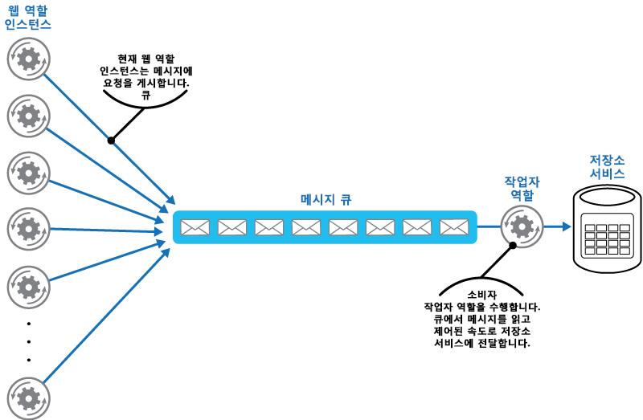

# 큐 기반 부하 평준화 패턴

[!INCLUDE [header](../_includes/header.md)]

서비스 장애 또는 작업의 시간 초과를 야기할 수 있는 일시적 과부하를 원활히 처리하기 위해 작업과 그 작업이 호출하는 서비스 사이에서 버퍼 역할을 하는 큐를 사용합니다. 그러면 요구 급증이 작업 및 서비스의 가용성과 응답성에 미치는 영향을 최소화할 수 있습니다.

## 컨텍스트 및 문제점

클라우드의 다양한 솔루션에는 서비스 호출 작업을 실행하는 것이 포함됩니다. 이러한 환경에서 서비스가 일시적 과부하를 받게 되면 성능 또는 신뢰성 문제가 야기될 수 있습니다.

서비스는 이를 사용하는 작업과 동일한 솔루션의 일부이거나 캐시, 저장소 서비스 등 자주 사용하는 리소스에 대한 액세스를 제공하는 타사 서비스일 수도 있습니다. 동시에 실행되는 여러 작업에서 동일한 서비스를 사용할 경우 임의 시점에 서비스에 대한 요청 규모를 예측하는 것은 어려울 수 있습니다.

서비스 요구가 급증할 수 있고 이는 오버로드를 야기하여 적시에 요청에 대응하는 것을 불가능하게 만들 수 있습니다. 동시에 여러 요청이 서비스에 쇄도하면 이러한 요청으로 야기되는 경합을 처리할 수 없을 경우 서비스 장애로 이어질 수도 있습니다.

## 해결 방법

솔루션을 리팩터링하고 작업과 서비스 간에 큐를 도입합니다. 작업과 서비스가 비동기적으로 실행됩니다. 작업은 서비스가 큐에 요구하는 데이터가 포함된 메시지를 게시합니다. 큐는 버퍼 역할을 하며 서비스가 검색할 때까지 메시지를 저장합니다. 서비스가 큐의 메시지를 검색하고 처리합니다. 매우 다양한 속도로 생성될 수 있는 여러 작업의 요청을 동일한 메시지 큐를 통해 서비스에 전달할 수 있습니다. 아래 그림은 큐를 사용하여 서비스의 부하를 평준화하는 것을 보여 줍니다.

큐는 작업을 서비스로부터 분리하고, 서비스는 동시 작업의 요청 규모에 관계없이 자체 속도로 메시지를 처리할 수 있습니다. 또한 큐에 메시지를 게시하는 시점에 서비스를 사용할 수 없는 경우에도 작업이 지연되지 않습니다.

이 패턴은 다음과 같은 이점을 제공합니다.

- 가용성을 최대화하는 데 도움이 됩니다. 왜냐하면 서비스에 발생하는 지연이 응용 프로그램에 즉각적이고 직접적인 영향을 주지 않고, 서비스를 이용할 수 없거나 현재 메시지를 처리할 수 없는 상태에서도 메시지를 큐에 계속 게시할 수 있기 때문입니다.
- 요구를 충족하도록 큐 수와 서비스 수를 모두 변경할 수 있기 때문에 가용성을 최대화할 수 있습니다.
- 배포되는 서비스 인스턴스의 수가 최대 부하가 아닌 평균 부하만 충족하도록 적절한 수준이면 되므로 비용을 조절하는 데 도움이 됩니다.

    >  요구가 시스템 장애를 야기할 수준의 임계값에 도달할 경우 일부 서비스는 제한을 적용합니다. 제한은 이용 가능한 기능을 축소할 수 있습니다. 이 임계값에 도달하지 않도록 하기 위해 이 서비스를 사용하여 부하 평준화를 구현할 수 있습니다.

## 문제 및 고려 사항

이 패턴을 구현할 방법을 결정할 때 다음 사항을 고려하세요.

- 대상 리소스의 과부하를 피하기 위해 서비스의 메시지 처리 속도를 제어하는 응용 프로그램 논리를 구현할 필요가 있습니다. 요구 급증이 시스템의 다음 단계로 전달되지 않도록 합니다. 부하 상태에서 시스템을 테스트하여 필요한 평준화 기능을 제공하는지 확인하고, 이를 달성하기 위해 메시지를 처리하는 서비스 인스턴스 수와 큐 수를 조정합니다.
- 메시지 큐는 단방향 통신 메커니즘입니다. 작업이 서비스로부터 회신을 예상할 경우 서비스가 응답 전송을 위해 사용할 수 있는 메커니즘을 구현하는 것이 필요합니다. 자세한 내용은 [비동기 메시징 입문서](https://msdn.microsoft.com/library/dn589781.aspx)를 참조하세요.
- 큐의 요청을 수신하는 서비스에 자동 크기 조정을 적용할 경우 주의해야 합니다. 해당 서비스가 공유하는 모든 리소스의 경합이 증가되고, 부하 평준화를 위해 큐를 사용하는 효과가 축소될 수 있습니다.

## 이 패턴을 사용해야 하는 경우

이 패턴은 오버로드가 발생하는 서비스를 사용하는 모든 응용 프로그램에 유용합니다.

응용 프로그램이 최소 대기 시간으로 서비스로부터 응답을 받을 것으로 예상되는 경우에는 이 패턴이 유용하지 않습니다.

## 예

Microsoft Azure 웹 역할은 별도 저장소 서비스를 사용하여 데이터를 저장합니다. 다수의 웹 역할 인스턴스가 동시에 실행될 경우 저장소 서비스가 요청 시간 초과 또는 실패를 방지할 만큼 충분히 빨리 요청에 응답하지 못할 수 있습니다. 아래 그림은 웹 역할의 인스턴스로부터 다수의 동시 요청을 받아 과부하가 걸린 서비스를 강조 표시하고 있습니다.

이 문제를 해결하기 위해 큐를 사용하여 웹 역할 인스턴스와 저장소 서비스 간의 부하를 평준화할 수 있습니다. 하지만 저장소 서비스는 동기 요청을 수용하도록 디자인되므로, 메시지 읽기 및 처리량 관리를 위해 쉽게 수정할 수는 없습니다. 큐로부터 요청을 받아 저장소 서비스로 전달하는 프록시 서비스 역할을 수행하도록 작업자 역할을 도입할 수 있습니다. 작업자 역할의 응용 프로그램 논리는 저장소 서비스의 과부하 방지를 위해 저장소 서비스에 요청을 전달하는 속도를 제어할 수 있습니다. 다음 그림은 큐 및 작업자 역할을 사용하여 웹 역할 인스턴스와 서비스 간의 부하를 평준화하는 것을 보여 줍니다.

## 관련 패턴 및 지침

이 패턴을 구현할 때 다음 패턴 및 지침도 관련이 있을 수 있습니다.

- [비동기 메시징 입문서](https://msdn.microsoft.com/library/dn589781.aspx). 메시지 큐는 본질적으로 비동기 방식입니다. 서비스와 직접 통신하는 것에서 메시지 큐를 사용하는 것으로 조정하려면 응용 프로그램 논리를 다시 디자인해야 할 수 있습니다. 마찬가지로 메시지 큐에서 요청을 받으려면 서비스를 리팩터링해야 할 수 있습니다. 또는 예에서 설명한 것처럼 프록시 서비스를 구현하는 것도 가능할 수 있습니다.
- [경쟁 소비자 패턴](competing-consumers.md). 부하 평준화 큐에서 각각 메시지 소비자 역할을 하는 다수의 서비스 인스턴스를 실행하는 것이 가능할 수 있습니다. 이 접근 방식을 사용하여 메시지를 수신하고 서비스로 전달하는 속도를 조정할 수 있습니다.
- [제한 패턴](throttling.md). 서비스로 제한을 구현하는 간단한 방법은 큐 기반 부하 평준화를 사용하여 모든 요청을 메시지 큐를 통해 서비스로 라우트하는 것입니다. 서비스는 서비스가 요구하는 리소스가 소진되지 않고 발생 가능한 경합 수량을 줄이는 속도로 요청을 처리할 수 있습니다.
- [큐 서비스 개념](https://msdn.microsoft.com/library/azure/dd179353.aspx). Azure 응용 프로그램에서 메시징 및 큐 메커니즘 선택에 관한 정보입니다.
