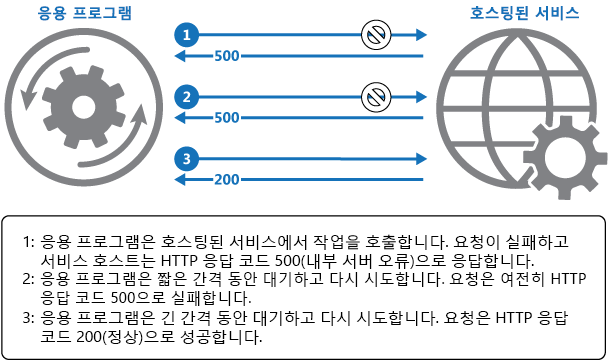

# 재시도

[!INCLUDE [header](../_includes/header.md)]

응용 프로그램에 서비스 또는 네트워크 리소스에 연결을 시도할 때 투명하게 실패한 작업을 다시 시도함으로써 일시적 장애를 처리하도록 지원합니다. 이를 통해 응용 프로그램의 안정성을 향상할 수 있습니다.

## 상황 및 문제점

클라우드에서 실행되는 요소와 통신하는 응용 프로그램은 그 환경에서 발생할 수 있는 일시적 장애에 민감해야 합니다. 장애에는 구성 요소 및 서비스에 대한 네트워크 연결의 순간적 끊김, 일시적인 서비스 사용 불가, 서비스를 이용 중일 때 발생하는 시간 초과 등이 포함됩니다.

이러한 장애는 일반적으로 자체 시정되며, 장애를 야기한 작업이 적절한 지연 후에 반복될 경우 성공할 가능성이 있습니다. 예를 들어 다수의 동시 요청을 처리하는 데이터베이스 서비스는 작업이 완화될 때까지 추가 요청을 일시적으로 거절하는 제한 전략을 구현할 수 있습니다. 데이터베이스 액세스를 시도하는 응용 프로그램이 연결에 실패할 수 있지만, 지연 후에 다시 시도할 경우 성공할 수도 있습니다.

## 솔루션

클라우드에서는 일시적 장애가 흔하지는 않으며, 응용 프로그램이 원활하고 투명하게 장애를 처리하도록 설계되어야 합니다. 그러면 응용 프로그램이 수행하는 비즈니스 작업에 대한 장애의 영향이 최소화됩니다.

응용 프로그램이 요청을 원격 서비스에 전송하려고 시도할 때 장애를 감지하면 아래 전략들을 사용하여 장애를 처리할 수 있습니다:

- **취소**. 장애가 일시적인 것이 아니거나 반복해도 성공하지 못할 가능성이 있을 경우, 응용 프로그램은 작업을 취소하고 예외를 보고해야 합니다. 예를 들어 잘못된 자격 증명을 제시하여 발생한 인증 실패는 몇 번을 시도하더라도 성공할 가능성이 없습니다.

- **재시도**. 보고된 특정 장애가 특이하거나 드문 경우, 네트워크 패킷이 전송되는 동안 손상되는 등 특이한 상황 때문에 야기되었을 가능성이 있습니다. 이 경우, 응용 프로그램이 실패한 요청을 즉시 다시 시도할 수 있는데 그 이유는 동일한 장애가 반복될 가능성이 낮고, 요청이 성공할 가능성이 있기 때문입니다.

- **지연 후 재시도.** 보다 일반적인 연결 또는 사용 중 장애 중 하나로 장애가 야기될 경우, 연결 문제를 시정하거나 작업 백로그가 비워지는 동안 네트워크나 서비스에 잠깐의 시간이 필요할 수 있습니다. 응용 프로그램은 요청을 재시도하기 전에 적절한 시간 동안 기다려야 합니다.

더 일반적인 일시적 장애인 경우, 요청을 응용 프로그램 인스턴스 간에 최대한 분산시키도록 재시도 사이의 기간을 선택해야 합니다. 그러면 사용 중인 서비스에 계속 과부하가 걸릴 가능성이 낮아집니다. 응용 프로그램의 많은 인스턴스가 재시도 요청으로 계속 과부하가 걸릴 경우, 서비스 복구에 더 많은 시간이 걸립니다.

그래도 요청이 계속 실패하면 응용 프로그램이 기다려서 또 한번 시도할 수 있습니다. 필요 시, 최대 요청 수에 도달할 때까지 재시도 간 지연 시간을 증가시키면서 이 프로세스를 반복할 수 있습니다. 해당 시간이 시정될 가능성과 장애 유형에 따라 지연 시간을 증분으로 또는 급격하게 증가시킬 수 있습니다.

아래 다이어그램은 이 패턴을 사용하여 호스팅된 서비스에서 작업을 호출하는 것을 보여주고 있습니다. 미리 정의된 시도 횟수 후에도 요청이 성공하지 못하면, 응용 프로그램이 해당 장애를 예외로 취급하고 그에 따라 처리해야 합니다.



응용 프로그램은 위에 열거된 전략 중 하나와 일치하는 재시도 정책을 구현하는 코드에 원격 서비스 액세스를 위한 모든 시도를 래핑해야 합니다. 다양한 서비스로 전송되는 요청들은 다른 정책의 적용을 받을 수 있습니다. 일부 공급업체는 재시도 정책을 구현하는 라이브러리를 제공하며, 여기서 응용 프로그램이 최대 재시도 횟수, 재시도 사이 시간 및 기타 매개 변수를 지정할 수 있습니다.

응용 프로그램은 오류 및 실패한 작업들의 상세정보를 기록해야 합니다. 이 정보는 운영자에게 유용합니다. 서비스가 빈번히 사용 불가 또는 사용 중 상태가 될 경우, 서비스가 해당 자원을 소진했기 때문인 경우가 자주 있습니다. 서비스를 확장함으로써 그러한 장애의 빈도를 낮출 수 있습니다. 예를 들어 데이터베이스 서비스에 계속 과부하가 걸릴 경우, 데이터베이스를 분할하고 부하를 여러 서버에 분산시키는 것이 유익할 수 있습니다.

> Microsoft Azure는 재시도 패턴에 대해 포괄적 지원을 제공합니다. Patterns & Practices [일시적 장애 처리 블록](https://msdn.microsoft.com/library/hh680934.aspx)은 다양한 재시도 전략을 사용하여 다수의 Azure 서비스에서 일시적 장애를 처리하도록 지원합니다. [Microsoft Entity Framework 버전 6](https://msdn.microsoft.com/en-us/data/dn456835.aspx)은 데이터베이스 작업 재시도를 위한 시설을 제공합니다. 또한 많은 Azure Service Bus 및 Azure Storage API가 재시도 논리를 투명하게 구현합니다.

## 문제점 및 고려 사항

이 패턴의 구현 방법을 결정할 때 아래 사항을 고려해야 합니다.

재시도 정책은 응용 프로그램의 비즈니스 요구사항과 고장 성격에 일치하도록 조정되어야 합니다. 일부 중요하지 않은 작업의 경우, 몇 번을 시도하여 응용 프로그램의 처리량에 영향을 주는 것보다 따르게 실패하는 것이 더 좋습니다. 예를 들어, 원격 서비스에 접속하는 양방향 웹 응용 프로그램의 경우, 재시도 기간을 짧게 하여 적은 수의 재시도 후에 실패 처리를 하고 사용자에게 적절한 메시지(예: "나중에 다시 시도하십시오" 표시하는 것이 더 좋습니다. 배치 작업의 경우 재시도 사이의 지연 시간을 크게 늘리고 재시도 횟수를 증가시키는 것이 보다 적절할 수 있습니다.

재시도 사이에 최소한의 지연 시간을 지정하고 재시도 횟수를 많이 지정하는 적극적 재시도 정책의 경우 용량에 근접하여 또는 용량 한계에서 실행되는 서비스의 기능을 더욱 저하시킬 수 있습니다. 이 재시도 정책은 실패한 작업을 수행하려고 계속 시도할 경우 응용 프로그램의 응답성에도 영향을 줄 수 있습니다.

상당 수의 재시도 후에도 요청이 계속 실패하면, 응용 프로그램이 추가 요청이 동일한 리소스로 전달되는 것을 방지하고 즉시 간단 장애 보고를 하는 것이 더 좋습니다. 지정 기간이 만료되면 응용 프로그램이 시험적으로 한 두 개의 요청이 통과하도록 하여 성공 여부를 확인할 수 있습니다. 이 전략에 관한 세부 내용은 [회로 차단기 패턴](circuit-breaker.md)을 참조하십시오.

작업이 idempotent인지 여부를 고려하십시오. 그렇다면 본질적으로 재시도가 안전합니다. 그렇지 않으면, 재시도로 작업이 두 번 이상 실행될 가능성이 있고 원치 않는 부작용이 발생할 수 있습니다. 예를 들어, 서비스가 요청을 받아 요청을 성공적으로 처리하지만 응답 전송에 실패할 수도 있습니다. 그 시점에 첫 번째 요청이 수신되지 않았다고 가정하여, 재시도 논리가 요청을 다시 전송할 수도 있습니다.

장애의 성격에 따라 예외를 야기하는 다양한 이유 때문에 서비스 요청이 실패할 수 있습니다. 일부 예외는 신속히 해결할 수 있는 장애를 표시하지만, 일부는 오래 지속되는 장애를 표시할 수 있습니다. 재시도 정책이 예외 유형을 기준으로 재시도 사이 시간을 조정하는 것이 유용합니다.

트랜잭션의 일부인 작업을 재시도하는 것이 전반적 트랜잭션 일관성에 어떤 영향을 주는지 고려하십시오. 성공 가능성을 극대화하고 모든 트랜잭션 단계를 취소할 필요성을 줄이도록 트랜잭션 작업 재시도 정책을 미세 조정하십시오.

모든 재시도 코드를 다양한 장애 조건에 대비하여 테스트해야 합니다. 응용 프로그램의 성능이나 신뢰성에 심각한 영향을 주지 않고, 서비스와 리소스에 과도한 부하를 야기하지 않고, 또는 경합 조건이나 병목 현상을 야기하지 않는지 확인하십시오.

실패한 작업의 전체 맥락을 이해한 경우에만 재시도 논리를 구현하십시오. 예를 들어, 재시도 정책이 포함된 작업이 역시 재시도 정책이 포함된 다른 작업을 호출할 경우 이 추가적 재시도 계층이 처리에 긴 지연 시간을 추가할 수 있습니다. 더 낮은 수준의 작업이 먼저 실패하고 실패(장애) 원인을 호출한 작업에 보고하도록 구성하는 것이 좋습니다. 그러면 더 높은 수준의 작업이 자체 정책을 기준으로 장애를 처리할 수 있습니다.

응용 프로그램, 서비스 또는 리소스의 근본적 문제점을 식별할 수 있도록 재시도를 야기한 모든 연결 장애를 기록하는 것이 중요합니다.

서비스 또는 리소스에 발생할 가능성이 높은 장애를 조사하여 장애가 오래 지속될 것인지 또는 구제 불능인지 여부를 파악합니다. 만약 그렇다면 그 장애는 예외로 처리하는 것이 더 좋습니다. 응용 프로그램이 예외를 보고하거나 기록하고, 대체 서비스(이용 가능할 경우)를 호출하거나 또는 저하된 기능을 제공함으로써 진행을 시도할 수 있습니다. 오래 지속되는 장애를 감지하는 방법에 관한 자세한 내용은 [회로 차단기 패턴](circuit-breaker.md)을 참조하십시오.

## 이 패턴을 사용할 시기

이 패턴은 응용 프로그램이 원격 서비스와 상호작용할 때 또는 원격 리소스에 액세스할 때 발생하는 일시적 오류를 경험하는 경우에 사용합니다. 이들 오류는 단기적일 것으로 예상되며, 이전에 실패했던 요청을 반복하면 나중 시도에서 성공할 수 있습니다.

이 패턴이 다음 경우에는 유용하지 않을 수 있습니다:

- 오류가 오래 지속될 가능성이 있는 경우. 그 이유는 응용 프로그램의 응답성에 영향을 줄 수 있기 때문입니다. 응용 프로그램이 실패 가능성이 있는 요청을 반복 시도함으로써 시간과 자원을 낭비할 가능성이 있습니다.
- 일시적 오류가 아닌 이유, 예를 들어 응용 프로그램의 비즈니스 논리의 오류로 인한 내부적 예외 때문에 발생한 장애를 처리하는 경우. 
- 시스템에서 확장성 문제에 대응하는 대안으로 사용할 경우. 응용 프로그램에 빈번하게 사용 중 오류가 발생할 경우, 액세스 대상 서비스나 리소스의 확장을 요구하는 신호인 경우가 종종 있습니다.

## 예

C#로 된 이 예제는 재시도 패턴의 구현을 보여주고 있습니다. 아래 표시된 `OperationWithBasicRetryAsync` 메서드가 `TransientOperationAsync` 메서드를 통해 비동기적으로 외부 서비스를 호출합니다 (이 메서드의 세부 내용은 서비스에 특정한 것이며, 샘플 코드에서 생략됩니다).

```csharp
private int retryCount = 3;
...

public async Task OperationWithBasicRetryAsync()
{
  int currentRetry = 0;

  for (; ;)
  {
    try
    {
      // Calling external service.
      await TransientOperationAsync();

      // Return or break.
      break;
    }
    catch (Exception ex)
    {
      Trace.TraceError("Operation Exception");

      currentRetry++;

      // Check if the exception thrown was a transient exception
      // based on the logic in the error detection strategy.
      // Determine whether to retry the operation, as well as how
      // long to wait, based on the retry strategy.
      if (currentRetry > this.retryCount || !IsTransient(ex))
      {
        // If this isn't a transient error
        // or we shouldn't retry, rethrow the exception.
        throw;
      }
    }

    // Wait to retry the operation.
    // Consider calculating an exponential delay here and
    // using a strategy best suited for the operation and fault.
    Await.Task.Delay();
  }
}

// Async method that wraps a call to a remote service (details not shown).
private async Task TransientOperationAsync()
{
  ...
}
```

이 메서드를 호출하는 문은 for 루프에 래핑되는 try/catch 블록에 포함됩니다. `TransientOperationAsync` 메서드가 예외를 발생시키지 않고 성공할 경우에 for 루프가 존재합니다. `TransientOperationAsync` 메서드가 실패할 경우 catch 블록이 실패 이유를 검사합니다. 일시적 오류로 간주될 경우 코드는 잠깐 지연 후에 작업을 재시도합니다.

또한 for 루프가 작업 시도 횟수를 추적하며, 코드가 세 번 실패하면 예외가 보다 오래 지속되는 것으로 가정합니다. 예외가 일시적이 아니거나 오래 지속될 경우, catch 핸들러가 예외를 발생시킵니다. 이 예외는 for 루프에 대해 존재하며, `OperationWithBasicRetryAsync` 메서드를 호출하는 코드가 포착해야 합니다.

아래 표시된 `IsTransient` 메서드가 코드 실행 환경과 관련된 특정 예외 집합을 확인합니다. 일시적 예외의 정의는 액세스 대상 리소스와 작업이 수행 중인 환경에 따라 달라집니다.

```csharp
private bool IsTransient(Exception ex)
{
  // Determine if the exception is transient.
  // In some cases this is as simple as checking the exception type, in other
  // cases it might be necessary to inspect other properties of the exception.
  if (ex is OperationTransientException)
    return true;

  var webException = ex as WebException;
  if (webException != null)
  {
    // If the web exception contains one of the following status values
    // it might be transient.
    return new[] {WebExceptionStatus.ConnectionClosed,
                  WebExceptionStatus.Timeout,
                  WebExceptionStatus.RequestCanceled }.
            Contains(webException.Status);
  }

  // Additional exception checking logic goes here.
  return false;
}
```

## 관련 패턴 및 지침

- [회로 차단기 패턴](circuit-breaker.md). 재시도 패턴은 일시적 오류를 처리할 때 유용합니다. 장애가 오래 지속될 것으로 예상되면, 회로 차단기 패턴을 구현하는 것이 보다 적절할 수 있습니다. 또한 재시도 패턴은 장애 처리에 관한 종합적 접근법을 제공하기 위해 회로 차단기와 함께 사용할 수도 있습니다.
- [일시적 장애 처리 응용 프로그램 블록](https://msdn.microsoft.com/library/hh680934.aspx).
- [연결 복원 / 재시도 논리](https://msdn.microsoft.com/en-us/data/dn456835.aspx)
