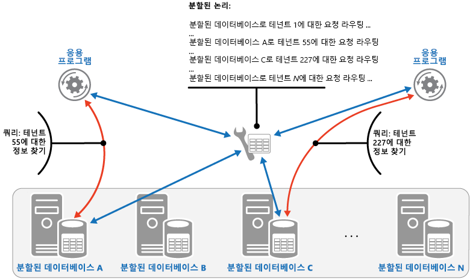
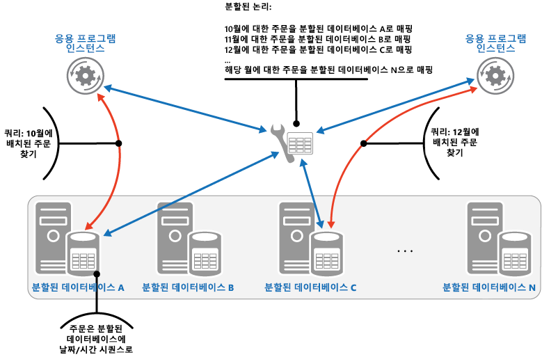

# <a name="sharding-pattern"></a>분할 패턴

[!INCLUDE [header](../_includes/header.md)]

데이터 저장소를 수평 파티션 또는 분할 집합으로 나눕니다. 이를 통해 대량의 데이터를 저장하고 액세스할 때 확장성을 개선할 수 있습니다.

## <a name="context-and-problem"></a>컨텍스트 및 문제점

단일 서버에 의해 호스트된 데이터 저장소는 다음과 같은 제한을 받을 수 있습니다.

- **저장소 공간**. 대규모 클라우드 응용 프로그램을 위한 데이터 저장소에는 시간이 지남에 따라 크게 늘어날 수 있는 대규모 데이터가 포함됩니다. 서버는 일반적으로 한정된 디스크 저장소만 제공하지만, 데이터 볼륨이 늘어남에 따라 기존의 디스크를 용량이 더 큰 디스크로 교체하거나 컴퓨터에 디스크를 추가할 수 있습니다. 그러나, 시스템은 결국 정해진 서버의 저장소 용량을 쉽게 늘릴 수 없는 한계에 이르게 됩니다.

- **컴퓨팅 리소스**. 클라우드 응용 프로그램은 많은 동시 사용자를 지원해야 하고 각 사용자는 데이터 저장소에서 정보를 검색하는 쿼리를 실행합니다. 데이터 저장소를 호스트하는 단일 서버는 데이터 저장 및 검색을 시도하는 응용 프로그램이 시간 초과되면서 사용자에 대한 응답 시간이 길어지고 빈번한 실패를 야기함에 따라 이 부하를 지원하는 데 필요한 컴퓨팅 기능을 제공하지 못할 수 있습니다. 메모리를 추가하거나 프로세서를 업데이트하는 것이 가능할 수도 있지만, 더 이상 계산 리소스를 늘리는 것이 불가능하면 시스템은 한계에 도달하게 됩니다.

- **네트워크 대역폭**. 궁극적으로 단일 서버에서 실행되는 데이터 저장소의 성능은 서버가 요청을 검색하고 응답을 전송할 수 있는 속도에 따라 달라집니다. 네트워크 트래픽 볼륨이 서버 연결에 사용된 네트워크 용량을 초과하여 요청이 실패할 수 있습니다.

- **지리**. 법률, 규정 준수 또는 성능상의 이유로 또는 데이터 액세스의 대기 시간을 줄이기 위해 특정 사용자가 생성한 데이터를 해당 사용자와 동일한 지역에 저장해야 할 수 있습니다. 사용자가 여러 나라나 지역에 분산된 경우 단일 데이터 저장소에 응용 프로그램의 전체 데이터를 저장하는 것이 불가능할 수 있습니다.

디스크 용량, 처리 능력, 메모리, 네트워크 연결을 추가하여 수직적으로 확장하면 이러한 한계의 영향을 늦출 수 있지만, 일시적 해결책에 불과할 수 있습니다. 많은 사용자와 대용량 데이터를 지원할 수 있는 상용 클라우드 응용 프로그램은 거의 무한정으로 크기 조정이 가능해야 하므로 수직적 확장이 반드시 최선의 해결책은 아닙니다.

## <a name="solution"></a>해결 방법

데이터 저장소를 수평 파티션 또는 분할된 데이터베이스로 나눕니다. 각 분할된 데이터베이스는 같은 스키마를 갖지만 고유의 자체 데이터 하위 집합을 보유합니다. 분할된 데이터베이스는 다양한 유형의 많은 엔터티에 대한 데이터를 포함할 수 있는 데이터 저장소 그 자체이며, 저장소 노드 역할을 하는 서버에서 실행됩니다.

이 패턴에는 다음과 같은 이점이 있습니다.

- 추가 저장소 노드에서 실행되는 분할된 데이터베이스를 더 추가하여 시스템을 확장할 수 있습니다.

- 시스템은 각 저장소 노드에 특별하고 값비싼 컴퓨터 대신 기성 하드웨어를 사용할 수 있습니다.

- 분할된 데이터베이스에 워크로드를 분산하여 경합을 줄이고 성능을 개선할 수 있습니다.

- 클라우드에서 분할된 데이터베이스는 데이터를 액세스할 사용자와 물리적으로 가까이 배치할 수 있습니다.

데이터 저장소를 분할된 데이터베이스로 나눌 때 분할된 각 데이터베이스에 배치할 데이터를 결정합니다. 일반적으로 분할된 데이터베이스는 하나 이상의 데이터 특성에 의해 결정되는 특정한 범위에 속하는 항목을 포함합니다. 이러한 특성이 분할 키(파티션 키라고도 함)를 형성합니다. 분할 키는 정적이어야 합니다. 변경될 수 있는 데이터를 기반으로 하면 안 됩니다.

분할은 물리적으로 데이터를 구성합니다. 응용 프로그램이 데이터를 저장하고 검색할 때 분할 논리는 응용 프로그램을 적절한 분할된 데이터베이스로 전달합니다. 이 분할 논리는 응용 프로그램에서 데이터 액세스 코드의 일부로 구현되거나, 분할을 투명하게 지원할 경우 데이터 저장소 시스템에 의해 구현될 수 있습니다.

데이터의 물리적 위치를 분할 논리로 추상화하면 어떤 분할된 데이터베이스가 어떤 데이터를 포함하는지에 대한 높은 수준의 관리를 제공합니다. 또한 분할된 데이터베이스에 있는 데이터가 추후 재배포되어야 할 경우(예: 분할된 데이터베이스가 불균형 상태가 되는 경우) 응용 프로그램의 비즈니스 논리를 재작업하지 않고 분할된 데이터베이스 간에 데이터를 마이그레이션할 수 있습니다. 단점은 각 데이터 항목 검색 시 해당 위치 결정에 필요한 추가적인 데이터 액세스 오버헤드가 발생한다는 것입니다.

최적의 성능과 확장성을 위해 응용 프로그램이 수행하는 쿼리 유형에 맞는 방식으로 데이터를 분할하는 것이 중요합니다. 대부분의 경우 분할 구성표는 모든 쿼리의 요구 사항과 정확히 일치할 가능성이 낮습니다. 예를 들어 다중 테넌트 시스템에서 응용 프로그램은 테넌트 ID로 테넌트 데이터를 검색해야 할 수 있지만, 테넌트 이름이나 위치 등 일부 다른 특성을 기반으로 이 데이터를 조회해야 할 수도 있습니다. 이러한 상황을 처리하기 위해서는 가장 일반적으로 수행되는 쿼리를 지원하는 분할 키로 분할 전략을 구현합니다.

쿼리가 특성 값을 조합하여 정기적으로 데이터를 검색할 경우 특성을 함께 연결하여 복합 분할 키를 정의할 수도 있습니다. 또는 분할 키로 찾을 수 없는 특성을 기반으로 하는 데이터를 빨리 조회하려면 [인덱스 테이블](index-table.md)과 같은 패턴을 사용합니다.

## <a name="sharding-strategies"></a>분할 전략

분할 키를 선택하고 분할된 데이터베이스에 데이터를 어떻게 분산시킬지 결정할 때 일반적으로 사용하는 세 가지 전략이 있습니다. 분할된 데이터베이스와 이를 호스트하는 서버가 일대일로 대응할 필요는 없습니다. 단일 서버가 여러 분할된 데이터베이스를 호스트할 수 있습니다. 전략은 다음과 같습니다.

**조회 전략**. 이 전략에서 분할 논리는 분할 키를 사용하여 데이터 요청을 해당 데이터가 포함된 분할된 데이터베이스로 라우트하는 맵을 구현합니다. 다중 테넌트 응용 프로그램에서 테넌트의 모든 데이터는 테넌트 ID를 사용하여 분할된 데이터베이스에 함께 분할 키로 저장할 수 있습니다. 여러 테넌트가 같은 분할된 데이터베이스를 공유할 수는 있지만, 단일 테넌트의 데이터를 여러 분할된 데이터베이스에 분배할 수는 없습니다. 다음 그림은 테넌트 ID를 기반으로 테넌트 데이터를 분할하는 것을 보여 줍니다.

   


   분할 키와 실제 저장소 간의 매핑은 각 분할 키가 물리적 파티션에 매핑되는 물리적 분할된 데이터베이스를 기반으로 할 수 있습니다. 또는 보다 유연한 분할된 데이터베이스 리밸러스 기술은 가상으로 분할하는 것으로, 분할 키는 같은 수의 가상 분할된 데이터베이스에 매핑되고 결국 더 적은 수의 물리적 파티션에 매핑됩니다. 이 접근 방식에서 응용 프로그램은 가상 분할된 데이터베이스를 참조하는 분할 키를 사용하여 데이터를 찾고 시스템은 가상 분할된 데이터베이스를 물리적 파티션에 투명하게 매핑합니다. 가상 분할된 데이터베이스와 물리적 파티션 간의 매핑은 다양한 분할 키 집합을 사용하기 위해 응용 프로그램 코드를 수정하지 않고도 변경될 수 있습니다.

**범위 전략**. 이 전략은 같은 분할된 데이터베이스의 관련된 항목을 함께 그룹화하고 분할 키에 따라 정렬합니다(분할 키는 순차적임). 범위 쿼리(특정 범위에 속하는 분할 키에 대한 데이터 항목 집합을 반환하는 쿼리)를 사용하여 항목 집합을 자주 검색하는 응용 프로그램에 유용합니다. 예를 들어 응용 프로그램에서 특정 월에 있었던 모든 주문을 찾아야 할 경우 한 달 동안의 모든 주문이 같은 분할된 데이터베이스에 날짜 및 시간 순으로 저장되어 있다면 더 빨리 이 데이터를 검색할 수 있습니다. 각 주문이 다른 분할된 데이터베이스에 저장된 경우에는 여러 번의 지점 쿼리(단일 데이터 항목을 반환하는 쿼리)를 수행하여 주문을 개별적으로 가져와야 합니다. 다음 그림은 순차적 데이터 집합(범위)을 분할된 데이터베이스에 저장하는 것을 보여 줍니다.

   

이 예에서, 분할 키는 주문 월을 가장 중요한 요소로 포함하고 그 다음으로 주문한 날짜와 시간을 포함하는 복합 키입니다. 새 주문이 생성되고 분할된 데이터베이스에 추가되면 주문 데이터는 자연스럽게 저장됩니다. 일부 데이터 저장소는 분할된 데이터베이스를 식별하는 분할 키 요소와 분할된 데이터베이스에서 항목을 고유하게 식별하는 행 키를 포함한, 두 부분으로 구성된 분할 키를 지원합니다. 일반적으로 데이터는 분할된 데이터베이스에 행 키 순으로 저장됩니다. 범위 쿼리에 적용되고 함께 그룹화해야 하는 항목은 파티션 키에 대해서는 동일한 값을 갖지만 행 키에 대해서는 고유한 값을 갖는 분할 키를 사용할 수 있습니다.

**해시 전략**. 이 전략의 목적은 핫스폿(너무 많은 부하를 받는 분할된 데이터베이스)을 줄이는 것입니다. 각각의 분할된 데이터베이스의 크기와 각각의 분할된 데이터베이스가 받게 될 부하 사이에 균형 잡힌 방식으로 분할된 데이터베이스에 데이터를 분산합니다. 분할 논리는 하나 이상의 데이터 특성에 대한 해시를 기반으로 항목을 저장할 분할된 데이터베이스를 계산합니다. 선택된 해시 함수는 가능하면 몇 가지 임의 요소를 계산에 도입하여 분할된 데이터베이스 간에 균등하게 데이터를 분산해야 합니다. 다음 그림은 테넌트 ID의 해시를 기반으로 테넌트 데이터를 분할하는 것을 보여 줍니다.

   

다른 분할 전략보다 해시 전략의 장점을 이해하려면 새 테넌트를 순차적으로 등록하는 다중 테넌트 응용 프로그램이 데이터 저장소에서 어떤 식으로 분할된 데이터베이스에 테넌트를 할당할 수 있는지 고려합니다. 범위 전략을 사용할 때, 테넌트 1 ~ n의 데이터는 모두 분할된 데이터베이스 A에, 테넌트 n+1 ~ m의 데이터는 모두 분할된 데이터베이스 B에, 이런 식으로 저장됩니다. 가장 최근에 등록된 테넌트가 가장 활동적인 경우 대부분의 데이터 작업은 소수의 분할된 데이터베이스에서 발생하고 이로 인해 핫스폿이 야기될 수 있습니다. 반대로, 해시 전략은 테넌트 ID의 해시를 기반으로 분할된 데이터베이스에 테넌트를 할당합니다. 이는 순차적인 테넌트가 서로 다른 분할된 데이터베이스에 할당될 가능성이 높고, 결국 분할된 데이터베이스 간의 부하가 분산됨을 의미합니다. 위 그림은 테넌트 55와 56에 대하여 이 전략을 보여 줍니다.

세 가지 분할 전략의 이점 및 고려 사항은 다음과 같습니다.

- **조회**. 분할된 데이터베이스의 구성 및 사용 방식을 잘 제어합니다. 가상 분할된 데이터베이스를 사용하면 새로운 물리적 파티션이 추가되어 워크로드를 균등하게 분배할 수 있기 때문에 데이터를 리밸러스할 때 영향이 줄어듭니다. 분할된 데이터베이스를 구현하는 가상 분할된 데이터베이스와 물리적 파티션 간의 매핑은 데이터 저장 및 검색에 분할 키를 사용하는 응용 프로그램 코드에 영향을 주지 않고 수정할 수 있습니다. 분할된 데이터베이스 위치 조회로 추가 오버헤드가 발생할 수 있습니다.

- **범위**. 단일 분할된 데이터베이스로부터 여러 데이터 항목을 단일 작업으로 가져올 수 있는 경우가 많으므로 범위 쿼리와 잘 맞고 구현하기 쉽습니다. 이 전략은 데이터 관리가 쉽습니다. 예를 들어 같은 지역의 사용자가 같은 분할된 데이터베이스에 있을 경우 로컬 부하 및 요구 패턴에 따라 각 표준 시간대에 업데이트를 예약할 수 있습니다. 그러나 이 전략은 분할된 데이터베이스 간에 최적의 균형을 제공하지 않습니다. 분할된 데이터베이스의 리밸러싱은 어려우며 대부분의 작업이 인접 분할 키에 관한 것일 경우 불균등한 부하 문제를 해결할 수 없을 수 있습니다.

- **해시**. 이 전략은 데이터 및 부하를 보다 균등하게 분산할 수 있습니다. 해시 함수를 사용하여 직접 요청 라우팅을 수행할 수 있습니다. 맵을 유지 관리할 필요가 없습니다. 해시 계산으로 추가적인 오버헤드가 발생할 수 있습니다. 또한 분할된 데이터베이스의 리밸러싱이 어렵습니다.

가장 일반적인 분할 시스템은 위에서 설명한 접근 방식 중 하나를 구현하는 것이지만 응용 프로그램의 비즈니스 요구 사항과 데이터 사용량 패턴도 고려해야 합니다. 예를 들어 다중 테넌트 응용 프로그램에서 다음을 수행할 수 있습니다.

- 워크로드를 기반으로 데이터를 분할할 수 있습니다. 별도의 분할된 데이터베이스에서 고휘발성 테넌트에 대한 데이터를 분리할 수 있습니다. 결과적으로 다른 테넌트에 대한 데이터 액세스 속도가 개선될 수 있습니다.

- 테넌트 위치를 기반으로 데이터를 분할할 수 있습니다. 백업 및 유지 관리를 위해 특정 지역의 테넌트 데이터를 해당 지역에서 사용량이 적은 시간에 오프라인으로 가져올 수 있는 반면, 다른 지역의 테넌트 데이터는 온라인으로 유지되며 업무 시간에 액세스할 수 있습니다.

- 중요한 테넌트는 개인 소유의 부하가 낮은 고성능 분할된 데이터베이스에 할당될 수 있는 반면, 그렇지 않은 테넌트는 더 밀집되고 사용량이 많은 분할된 데이터베이스를 공유하게 됩니다.

- 고도의 데이터 격리 및 개인정보보호가 필요한 테넌트 데이터는 완전히 분리된 서버에 저장할 수 있습니다.

## <a name="scaling-and-data-movement-operations"></a>크기 조정 및 데이터 이동 작업

각 분할 전략은 규모 축소, 규모 확장, 데이터 이동을 관리하고 상태를 유지 관리하기 위한 다양한 기능과 복잡도를 의미합니다.

조회 전략은 온라인 또는 오프라인으로 사용자 수준에서 수행될 수 있도록 크기 조정 및 데이터 이동 작업을 허용합니다. 이 기술을 사용하면 사용량이 많지 않을 때 일부 또는 모든 사용자 작업을 일시 중단하고, 데이터를 새로운 가상 파티션이나 물리적 분할된 데이터베이스로 이동하고, 매핑을 변경하고, 이 데이터를 보관하는 캐시를 무효화하거나 새로 고친 다음 사용자 활동을 다시 시작할 수 있습니다. 보통 이 작업 유형은 중앙에서 관리할 수 있습니다. 조회 전략은 캐시가 원활하고 복제하기 쉬운 상태여야 합니다.

범위 전략은 크기 조정 및 데이터 이동 작업 시 일부 제한이 있습니다. 분할된 데이터베이스에서 데이터가 분할 및 병합되기 때문에 일반적으로 일부 또는 모든 데이터 저장소가 오프라인일 때 수행해야 합니다. 대부분의 작업이 인접 분할 키 또는 같은 범위 내에 있는 데이터 식별자에 관한 것일 경우 데이터를 이동하여 분할된 데이터베이스 리밸러스로 불균등한 부하 문제를 해결할 수 없습니다. 범위 전략은 범위를 물리적 파티션에 매핑하기 위해 일부 상태를 유지 관리해야 할 수도 있습니다.

파티션 키는 분할 키 또는 데이터 식별자의 해시이므로 해시 전략은 크기 조정 및 데이터 이동 작업을 더 복잡하게 만듭니다. 해시 함수 또는 정확한 매핑을 제공하도록 수정된 함수에서 각 분할된 데이터베이스의 새로운 위치를 결정해야 합니다. 그러나 해시 전략은 상태 유지 관리가 필요하지 않습니다.

## <a name="issues-and-considerations"></a>문제 및 고려 사항

이 패턴을 구현할 방법을 결정할 때 다음 사항을 고려하세요.

- 분할은 수직 분할, 기능 분할 등 기타 형태의 분할을 보완합니다. 예를 들어 단일 분할된 데이터베이스는 수직으로 분할된 엔터티를 포함할 수 있고, 기능 파티션은 다중 분할된 데이터베이스로 구현할 수 있습니다. 분할에 대한 자세한 내용은 [데이터 분할 지침](https://msdn.microsoft.com/library/dn589795.aspx)을 참조하세요.

- 분할된 데이터베이스가 모두 비슷한 양의 I/O를 처리할 수 있도록 균형이 조정된 상태를 유지합니다. 데이터가 삽입되고 삭제되면 균등한 분산을 보장하고 핫스폿 가능성을 줄이기 위해 주기적으로 분할된 데이터베이스를 리밸러스해야 합니다. 리밸러싱은 비용 부담이 큰 작업일 수 있습니다. 리밸러싱의 필요성을 줄이려면 각 분할된 데이터베이스에 예상되는 변동량을 충분히 처리할 사용 가능한 공간을 포함하여 변동량 증가에 대비합니다. 또한 분할된 데이터베이스를 리밸러스해야 할 경우에 신속히 조정하는 데 사용할 수 있는 전략 및 스크립트를 개발해야 합니다.

- 분할 키에 대한 안정적인 데이터를 사용합니다. 분할 키가 변경되면 해당 데이터 항목은 분할된 데이터베이스 간에 이동해야 하고 이때 업데이트 작업에 의해 수행되는 작업량이 늘어날 수 있습니다. 따라서 분할 키가 잠재적 휘발성 정보를 기반으로 하지 않도록 합니다. 대신 고정적이거나 자연스럽게 키를 만드는 특성을 찾습니다.

- 분할 키가 고유한지 확인합니다. 예를 들어 자동 증가 필드는 분할 키로 사용하지 않습니다. 일부 시스템에서 자동 증가된 필드는 분할된 데이터베이스 간에 조정될 수 없으므로 다른 분할된 데이터베이스에 있는 항목이 같은 분할 키를 가지게 될 수 있습니다.

    >  분할 키가 아닌 다른 필드의 자동 증가 값 또한 문제를 일으킬 수 있습니다. 예를 들어 자동 증가된 필드를 사용하여 고유한 ID를 생성할 경우 다른 분할된 데이터베이스에 있는 다른 두 항목에 같은 ID가 지정될 수 있습니다.

- 데이터에 대해 가능한 모든 쿼리의 요구 사항과 일치하는 분할 키를 디자인하는 것은 불가능할 수 있습니다. 데이터를 분할하여 가장 빈번히 수행되는 쿼리를 지원하고, 필요한 경우 보조 인덱스 테이블을 만들어 분할 키에 속하지 않는 특성을 기반으로 하는 조건을 사용하여 데이터를 검색하는 쿼리를 지원합니다. 자세한 내용은 [인덱스 테이블 패턴](index-table.md)을 참조하세요.

- 단일 분할된 데이터베이스만 액세스하는 쿼리가 여러 분할된 데이터베이스에서 데이터를 검색하는 쿼리보다 효율적이므로 응용 프로그램이 다른 분할된 데이터베이스에 저장된 데이터를 조인하는 다수의 쿼리를 수행하도록 하는 분할 시스템은 구현하지 않도록 합니다. 단일 분할된 데이터베이스는 여러 엔터티 유형의 데이터를 포함할 수 있습니다. 응용 프로그램이 별도로 수행하는 읽기 횟수를 줄이려면 데이터를 비정규화하여 일반적으로 함께 쿼리되는 관련 엔터티(고객 및 주문 세부 사항 등)를 같은 분할된 데이터베이스에 보관하는 것이 좋습니다.

    >  하나의 분할된 데이터베이스에 있는 엔터티가 다른 분할된 데이터베이스에 저장된 엔터티를 참조할 경우 두 번째 엔터티에 대한 분할 키를 첫 번째 엔터티에 대한 스키마의 일부로 포함합니다. 이렇게 하면 분할된 데이터베이스에서 관련 데이터를 참조하는 쿼리 성능을 개선할 수 있습니다.

- 응용 프로그램이 여러 분할된 데이터베이스에서 데이터를 검색하는 쿼리를 수행해야 할 경우 병렬 작업을 사용하여 이 데이터를 가져올 수 있습니다. 예를 들어 팬아웃 쿼리의 경우 여러 분할된 데이터베이스의 데이터를 병렬로 검색한 다음 단일 결과로 집계합니다. 그러나 이 접근 방식을 사용하면 불가피하게 솔루션의 데이터 액세스 논리가 좀 더 복잡해집니다.

- 대부분의 응용 프로그램에서 다수의 소규모 분할된 데이터베이스를 만드는 것이 소수의 대규모 분할된 데이터베이스보다 더 효율적일 수 있는데, 이는 부하 분산이 더 용이하기 때문입니다. 또한 분할된 데이터베이스를 한 물리적 위치에서 다른 물리적 위치로 마이그레이션할 필요성이 예상될 경우에도 유용할 수 있습니다. 작은 분할된 데이터베이스를 이동하는 것이 큰 분할된 데이터베이스 이동보다 빠릅니다.

- 각 분할 저장소 노드에 사용할 수 있는 리소스가 데이터 크기 및 처리량 관점에서 확장성 요구 사항을 충분히 처리할 수 있어야 합니다. 자세한 내용은 [데이터 분할 지침](https://msdn.microsoft.com/library/dn589795.aspx)의 "확장성을 위한 파티션 디자인" 섹션을 참조하세요.

- 모든 분할된 데이터베이스에 참조 데이터를 복제할 것을 고려합니다. 분할된 데이터베이스에서 데이터를 검색하는 작업이 동일한 쿼리의 일부로 정적 또는 느리게 이동하는 데이터도 참조할 경우 이 데이터를 분할된 데이터베이스에 추가합니다. 이렇게 하면 응용 프로그램은 별도의 데이터 저장소를 추가로 왕복하지 않고 쿼리의 모든 데이터를 쉽게 가져올 수 있습니다.

    >  여러 분할된 데이터베이스에 보관된 참조 데이터가 변경되면 시스템은 모든 분할된 데이터베이스 간에 이 변경 내용을 동기화해야 합니다. 이 동기화가 진행되는 동안 시스템에서 어느 정도의 불일치가 발생할 수 있습니다. 동기화를 수행하려면 응용 프로그램이 이를 처리할 수 있도록 디자인해야 합니다.

- 분할된 데이터베이스 간에 참조 무결성 및 일관성을 유지하기 어려울 수 있으므로 여러 분할된 데이터베이스에 있는 데이터에 영향을 주는 작업을 최소화해야 합니다. 응용 프로그램이 분할된 데이터베이스에서 데이터를 수정해야 하는 경우 완벽한 데이터 일관성이 실제로 필요한지 여부를 평가합니다. 일반적으로 클라우드에서는 강력한 일관성 대신 최종 일관성을 구현합니다. 각 파티션에 있는 데이터가 개별적으로 업데이트되고, 응용 프로그램 논리를 사용하여 업데이트를 모두 성공적으로 완료할 수 있도록 하며, 최종적으로 일치하는 작업이 실행되는 동안 데이터 쿼리에서 발생할 수 있는 불일치를 처리해야 합니다. 최종 일관성을 구현하는 방법에 대한 자세한 내용은 [데이터 일관성 입문서](https://msdn.microsoft.com/library/dn589800.aspx)를 참조하세요.

- 다수의 분할된 데이터베이스를 구성하고 관리하는 작업은 어려울 수 있습니다. 모니터링, 백업, 일관성 확인, 로깅 또는 감사 등의 작업은 여러 지역에 있을 수 있는 여러 개의 분할된 데이터베이스 및 서버에서 수행해야 합니다. 이러한 작업은 스크립트나 다른 자동화 솔루션으로 구현되기 쉽지만 추가적인 관리 요구 사항을 완전히 없애지는 못할 수 있습니다.

- 분할된 데이터베이스를 여기에 포함된 데이터가 이 데이터를 사용하는 응용 프로그램 인스턴스에 가깝게 위치하도록 배치할 수 있습니다. 이 접근 방식은 성능을 크게 개선할 수 있지만, 다른 위치에서 여러 분할된 데이터베이스에 액세스해야 하는 작업도 추가로 고려해야 합니다.

## <a name="when-to-use-this-pattern"></a>이 패턴을 사용해야 하는 경우

데이터 저장소를 단일 저장소 노드에서 사용 가능한 리소스 이상으로 크기를 조정할 필요가 있거나 데이터 저장소에서 경합을 줄여 성능을 개선해야 할 필요가 있을 경우 이 패턴을 사용합니다.

>  분할의 주안점은 시스템의 성능 및 확장성을 개선하는 것이지만 부가적으로 데이터가 별도의 파티션으로 어떻게 분할되느냐에 따라 가용성을 개선할 수도 있습니다. 한 파티션에서 오류가 발생했다고 해서 반드시 응용 프로그램이 다른 파티션에 보관된 데이터에 액세스할 수 없는 것은 아니며, 운영자는 응용 프로그램의 전체 데이터를 액세스 불가로 만들지 않고 하나 이상의 파티션을 유지 관리하거나 복구할 수 있습니다. 자세한 내용은 [데이터 분할 지침](https://msdn.microsoft.com/library/dn589795.aspx)을 참조하세요.

## <a name="example"></a>예

C#으로 작성된 다음 예제는 분할된 데이터베이스 역할을 하는 SQL Server 데이터베이스 집합을 사용합니다. 각 데이터베이스에는 응용 프로그램에서 사용된 데이터의 하위 집합이 있습니다. 응용 프로그램은 자체 분할 논리(팬아웃 쿼리의 예)를 사용하여 분할된 데이터베이스에서 분산된 데이터를 검색합니다. 각 분할된 데이터베이스에 위치한 데이터의 세부 사항은 `GetShards`라는 메서드에 의해 반환됩니다. 이 메서드는 `ShardInformation` 개체의 열거 목록을 반환하는데, 여기서 `ShardInformation` 형식에는 각 분할된 데이터베이스의 식별자 및 응용 프로그램이 분할된 데이터베이스 연결에 사용해야 하는 SQL Server 연결 문자열이 포함됩니다(연결 문자열은 코드 예제에 표시되지 않음).

```csharp
private IEnumerable<ShardInformation> GetShards()
{
  // This retrieves the connection information from a shard store
  // (commonly a root database).
  return new[]
  {
    new ShardInformation
    {
      Id = 1,
      ConnectionString = ...
    },
    new ShardInformation
    {
      Id = 2,
      ConnectionString = ...
    }
  };
}
```

다음 코드는 응용 프로그램에서 `ShardInformation` 개체 목록을 사용하여 각 분할된 데이터베이스에서 병렬로 데이터를 가져오는 쿼리를 수행하는 방법을 보여 줍니다. 자세한 쿼리는 표시되어 있지 않지만, 이 예제에서 검색된 데이터에는 분할된 데이터베이스에 고객의 세부 정보가 포함된 경우 고객 이름 등의 정보를 보관할 수 있는 문자열이 포함됩니다. 결과는 응용 프로그램에서 처리하기 위해 `ConcurrentBag` 컬렉션으로 집계됩니다.

```csharp
// Retrieve the shards as a ShardInformation[] instance.
var shards = GetShards();

var results = new ConcurrentBag<string>();

// Execute the query against each shard in the shard list.
// This list would typically be retrieved from configuration
// or from a root/master shard store.
Parallel.ForEach(shards, shard =>
{
  // NOTE: Transient fault handling isn't included,
  // but should be incorporated when used in a real world application.
  using (var con = new SqlConnection(shard.ConnectionString))
  {
    con.Open();
    var cmd = new SqlCommand("SELECT ... FROM ...", con);

    Trace.TraceInformation("Executing command against shard: {0}", shard.Id);

    var reader = cmd.ExecuteReader();
    // Read the results in to a thread-safe data structure.
    while (reader.Read())
    {
      results.Add(reader.GetString(0));
    }
  }
});

Trace.TraceInformation("Fanout query complete - Record Count: {0}",
                        results.Count);
```

## <a name="related-patterns-and-guidance"></a>관련 패턴 및 지침

이 패턴을 구현할 때 다음 패턴 및 지침도 관련이 있을 수 있습니다.
- [데이터 일관성 입문서](https://msdn.microsoft.com/library/dn589800.aspx). 서로 다른 분할된 데이터베이스 간에 분산된 데이터의 일관성을 유지해야 할 수 있습니다. 분산된 데이터의 일관성 유지 관리와 관련된 문제를 요약하고 다양한 일관성 모델의 장점과 단점을 설명합니다.
- [데이터 분할 지침](https://msdn.microsoft.com/library/dn589795.aspx). 데이터 저장소 분할에 다양한 문제가 추가로 제기될 수 있습니다. 확장성을 개선하고, 경합을 줄이고, 성능을 최적화하기 위해 클라우드의 데이터 저장소 분할과 관련된 이러한 문제에 대해 설명합니다.
- [인덱스 테이블 패턴](index-table.md). 분할 키 디자인만으로 쿼리를 완전히 지원할 수 없는 경우가 있습니다. 응용 프로그램에서 분할 키 이외의 키를 지정하여 대규모 데이터 저장소에서 데이터를 빠르게 검색할 수 있습니다.
- [구체화된 뷰 패턴](materialized-view.md). 일부 쿼리 작업의 성능을 유지 관리하려면 데이터를 집계하고 요약하는 구체화된 뷰를 만드는 것이 유용합니다. 이 요약 데이터가 분할된 데이터베이스 간에 분산된 정보를 기반으로 할 경우에 특히 유용합니다. 이러한 뷰를 생성하고 채우는 방법에 대해 설명합니다.
- Adding Simplicity 블로그의 [Shard Lessons](http://www.addsimplicity.com/adding_simplicity_an_engi/2008/08/shard-lessons.html)(분할된 데이터베이스 단원)
- CodeFutures 웹 사이트의 [Database Sharding](http://dbshards.com/database-sharding/)(데이터베이스 분할)
- Max Indelicato 블로그의 [Scalability Strategies Primer: Database Sharding](http://blog.maxindelicato.com/2008/12/scalability-strategies-primer-database-sharding.html)(확장성 전략 입문서: 데이터베이스 분할)
- Dare Obasanjo 블로그의 [Building Scalable Databases: Pros and Cons of Various Database Sharding Schemes](http://www.25hoursaday.com/weblog/2009/01/16/BuildingScalableDatabasesProsAndConsOfVariousDatabaseShardingSchemes.aspx)(확장성 있는 데이터베이스 빌드: 다양한 데이터베이스 분할 구성표의 장단점)
