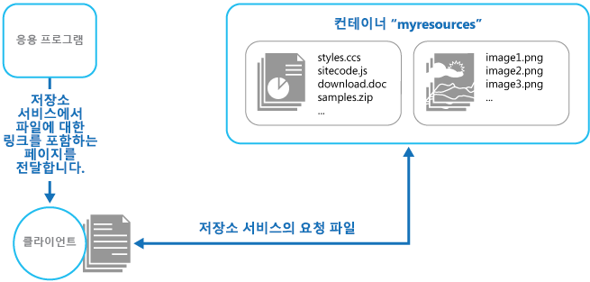

# <a name="static-content-hosting-pattern"></a>정적 콘텐츠 호스팅 패턴

[!INCLUDE [header](../_includes/header.md)]

정적 콘텐츠를 클라이언트에 직접 제공할 수 있는 클라우드 기반 저장소 서비스에 배포합니다. 이렇게 하면 잠재적으로 비용이 많이 들 수 있는 계산 인스턴스에 대한 필요성이 줄어듭니다.

## <a name="context-and-problem"></a>컨텍스트 및 문제점

웹 응용 프로그램에는 일반적으로 일부 정적 콘텐츠 요소가 포함되어 있습니다. 이 정적 콘텐츠에는 HTML 페이지, 그리고 HTML 페이지의 일부(예: 인라인 이미지, 스타일시트 및 클라이언트 쪽 JavaScript 파일) 혹은 별도의 다운로드(예: PDF 문서)로 클라이언트에서 사용할 수 있는 이미지 및 문서와 같은 기타 리소스가 포함될 수 있습니다.

웹 서버는 효율적인 동적 페이지 코드 실행 및 출력 캐싱을 통해 요청을 최적화하도록 잘 조정되어 있지만, 여전히 정적 콘텐츠의 다운로드 요청을 처리해야 합니다. 이를 위해 소비되는 처리 주기는 실상 다른 목적을 위해 보다 효율적으로 사용될 수 있습니다.

## <a name="solution"></a>해결 방법

대부분의 클라우드 호스팅 환경에서는 응용 프로그램의 리소스 및 정적 페이지 일부를 저장소 서비스에 배치하여 계산 인스턴스에 대한 필요성을 최소화할 수 있습니다(예를 들어 더 작은 인스턴스 또는 더 적은 수의 인스턴스 사용). 클라우드에 호스트된 저장소의 비용은 일반적으로 계산 인스턴스의 경우보다 훨씬 저렴합니다.

응용 프로그램의 일부를 저장소 서비스에 호스트할 때 주요 고려 사항은 응용 프로그램의 배포와, 그리고 익명 사용자의 사용을 의도하지 않는 리소스의 보안과 관련되어 있습니다.

## <a name="issues-and-considerations"></a>문제 및 고려 사항

이 패턴을 구현할 방법을 결정할 때 다음 사항을 고려하세요.

- 호스트된 저장소 서비스는 사용자가 정적 리소스를 다운로드하기 위해 액세스할 수 있는 HTTP 끝점을 노출해야 합니다. 일부 저장소 서비스는 HTTPS도 지원하므로 SSL이 필요한 리소스를 저장소 서비스에 호스트할 수 있습니다.

- 최대 성능 및 가용성을 위해, CDN(콘텐츠 전송 네트워크)을 사용하여 전 세계에 있는 여러 데이터 센터에 저장소 컨테이너의 콘텐츠를 캐시하는 것이 좋습니다. 그렇지만 CDN 사용 비용을 지불해야 할 수 있습니다.

- 저장소 계정은 데이터 센터에 영향을 줄 수 있는 이벤트에 대한 복원력을 제공하기 위해 기본적으로 지리적으로 복제되는 경우가 많습니다. 즉, IP 주소는 변경될 수 있지만 URL은 동일하게 유지됩니다.

- 저장소 계정에 있는 콘텐츠도 있고, 호스트된 계산 인스턴스에 있는 콘텐츠도 있는 경우, 응용 프로그램을 배포하고 업데이트하는 것이 더 어려워집니다. 보다 쉬운 관리를 위해 배포를 개별로 수행하고 응용 프로그램 및 콘텐츠의 버전을 관리해야 할 수 있습니다(특히 정적 콘텐츠에 스크립트 파일 또는 UI 구성 요소가 포함되어 있는 경우). 그러나 정적 리소스만 업데이트해야 할 경우에는, 응용 프로그램 패키지를 다시 배포하지 않고도 해당 리소스를 저장소 계정에 업로드하기만 하면 됩니다.

- 저장소 서비스는 사용자 지정 도메인 이름의 사용을 지원하지 않을 수 있습니다. 이 경우, 리소스가 링크를 포함하는 동적으로 생성된 콘텐츠와는 다른 도메인에 포함되므로, 리소스의 전체 URL을 링크에 지정해야 합니다.

- 저장소 컨테이너는 공용 읽기 액세스용으로 구성해야 하며, 공용 쓰기 액세스용으로 구성하지 않아야 합니다. 사용자가 콘텐츠를 업로드하지 못하게 해야 하기 때문입니다. 발렛(Valet) 키 또는 토큰을 사용해서 익명으로 사용할 수 없도록 할 리소스에 대한 액세스를 제어하는 것이 좋습니다(자세한 내용은 [발렛(Valet) 키 패턴](valet-key.md) 참조).

## <a name="when-to-use-this-pattern"></a>이 패턴을 사용해야 하는 경우

이 패턴은 다음의 경우에 유용합니다.

- 정적 리소스를 일부 포함한 웹 사이트 및 응용 프로그램에 대한 호스팅 비용을 최소화할 경우

- 정적 콘텐츠 및 리소스만으로 구성된 웹 사이트에 대한 호스팅 비용을 최소화할 경우. 호스팅 공급자의 저장소 시스템 기능에 따라, 완전 정적인 웹 사이트를 저장소 계정에 전적으로 호스트할 수도 있습니다.

- 다른 호스팅 환경 또는 온-프레미스 서버에서 실행되는 응용 프로그램에 대한 정적 리소스 및 콘텐츠를 노출할 경우

- 전 세계 여러 데이터 센터에 저장소 계정의 콘텐츠를 캐시하는 콘텐츠 전송 네트워크를 사용하여 둘 이상의 지리적 영역에 콘텐츠를 배치할 경우

- 비용 및 대역폭 사용량을 모니터링할 경우. 정적 콘텐츠의 일부나 전체에 대해 별도 저장소 계정을 사용하면 호스팅 및 런타임 비용에서 콘텐츠 비용을 보다 쉽게 분리할 수 있습니다.

이 패턴은 다음과 같은 상황에서는 유용하지 않을 수 있습니다.

- 응용 프로그램은 정적 콘텐츠를 클라이언트에 배달하기 전에 몇 가지 처리를 수행해야 합니다. 예를 들어, 문서에 타임스탬프를 추가해야 할 수도 있습니다.

- 정적 콘텐츠의 양이 매우 작습니다. 이 콘텐츠를 별도 저장소에서 가져올 때 발생하는 오버헤드가 계산 리소스에서 이 콘텐츠를 별도로 관리할 때 파생되는 비용 혜택보다 클 우려가 있을 수 있습니다.

## <a name="example"></a>예

Azure Blob 저장소에 있는 정적 콘텐츠는 웹 브라우저에서 직접 액세스할 수 있습니다. Azure는 클라이언트에 공개적으로 노출될 수 있는 저장소에 대해 HTTP 기반 인터페이스를 제공합니다. 예를 들어, Azure Blob 저장소 컨테이너의 콘텐츠는 다음 형식의 URL을 사용하여 노출됩니다.

`http://[ storage-account-name ].blob.core.windows.net/[ container-name ]/[ file-name ]`


콘텐츠를 업로드하는 경우, 파일 및 문서를 보유할 하나 이상의 Blob 컨테이너를 만들어야 합니다. 새 컨테이너에 대한 기본 사용 권한은 개인(Private)이며, 클라이언트가 콘텐츠에 액세스하도록 하려면 이 권한을 공용(Public)으로 변경해야 합니다. 콘텐츠를 익명 액세스로부터 보호해야 하는 경우 사용자가 리소스 다운로드를 위해 유효한 토큰을 제공해야 하도록 [발렛(Valet) 키 패턴](valet-key.md)을 구현할 수 있습니다.

> [Blob Service Concepts](https://msdn.microsoft.com/library/azure/dd179376.aspx)(Blob 서비스 개념)에서 Blob 저장소 및 이 저장소를 액세스하고 사용하는 방법을 참조하세요.

각 페이지의 링크는 리소스의 URL을 지정하며, 클라이언트는 저장소 서비스에서 리소스에 직접 액세스합니다. 다음 그림에서는 저장소 서비스에서 직접 응용 프로그램의 정적 부분을 전달하는 모습을 보여 줍니다.




클라이언트에 전달된 페이지의 링크는 Blob 컨테이너 및 리소스의 전체 URL을 반드시 지정해야 합니다. 예를 들어, 공용 컨테이너에 있는 이미지에 대한 링크를 포함하는 페이지에는 다음 HTML이 포함될 수 있습니다.

```html

```

> 리소스가 발렛 키(예: Azure 공유 액세스 서명)를 사용하여 보호되는 경우, 이 서명이 링크의 URL에 포함되어야 합니다.

정적 리소스에 대해 외부 저장소를 사용하는 모습을 보여 주는 StaticContentHosting이라는 솔루션은 [GitHub](https://github.com/mspnp/cloud-design-patterns/tree/master/static-content-hosting)에서 사용할 수 있습니다. StaticContentHosting.Cloud 프로젝트에는 저장소 계정을 지정하는 구성 파일과, 정적 콘텐츠를 보유하는 컨테이너가 포함되어 있습니다.

```xml
<Setting name="StaticContent.StorageConnectionString"
         value="UseDevelopmentStorage=true" />
<Setting name="StaticContent.Container" value="static-content" />
```

StaticContentHosting.Web 프로젝트의 Settings.cs 파일에 있는 `Settings` 클래스는 이러한 값을 추출하고 클라우드 저장소 계정 컨테이너 URL을 포함하는 문자열 값을 작성하기 위한 메서드를 포함합니다.

```csharp
public class Settings
{
  public static string StaticContentStorageConnectionString {
    get
    {
      return RoleEnvironment.GetConfigurationSettingValue(
                              "StaticContent.StorageConnectionString");
    }
  }

  public static string StaticContentContainer
  {
    get
    {
      return RoleEnvironment.GetConfigurationSettingValue("StaticContent.Container");
    }
  }

  public static string StaticContentBaseUrl
  {
    get
    {
      var account = CloudStorageAccount.Parse(StaticContentStorageConnectionString);

      return string.Format("{0}/{1}", account.BlobEndpoint.ToString().TrimEnd('/'),
                                      StaticContentContainer.TrimStart('/'));
    }
  }
}
```

StaticContentUrlHtmlHelper.cs 파일의 `StaticContentUrlHtmlHelper` 클래스는 전달된 URL이 ASP.NET 루트 경로 문자(~)로 시작하는 경우 클라우드 저장소 계정에 대한 경로를 포함한 URL을 생성하는 `StaticContentUrl`이라는 메서드를 노출합니다.

```csharp
public static class StaticContentUrlHtmlHelper
{
  public static string StaticContentUrl(this HtmlHelper helper, string contentPath)
  {
    if (contentPath.StartsWith("~"))
    {
      contentPath = contentPath.Substring(1);
    }

    contentPath = string.Format("{0}/{1}", Settings.StaticContentBaseUrl.TrimEnd('/'),
                                contentPath.TrimStart('/'));

    var url = new UrlHelper(helper.ViewContext.RequestContext);

    return url.Content(contentPath);
  }
}
```

Views\Home 폴더의 Index.cshtml에는 `StaticContentUrl` 메서드를 사용하여 해당 `src` 특성에 대한 URL을 만드는 이미지 요소가 포함되어 있습니다.

```html

```

## <a name="related-patterns-and-guidance"></a>관련 패턴 및 지침

- 이 패턴의 사용을 보여주는 예제는 [GitHub](https://github.com/mspnp/cloud-design-patterns/tree/master/static-content-hosting)에서 확인할 수 있습니다.
- [발레 키 패턴](valet-key.md). 대상 리소스를 익명 사용자가 사용할 수 없게 하려는 경우 정적 콘텐츠를 보유하는 저장소에 보안 조치를 구현해야 합니다. 클라이언트에 특정 리소스 또는 서비스(예: 클라우드 호스티드 저장소 서비스)에 대한 제한된 직접 액세스를 제공하는 토큰 또는 키를 사용하는 방법을 설명합니다.
- Infosys 블로그의 [An efficient way of deploying a static web site on Azure](http://www.infosysblogs.com/microsoft/2010/06/an_efficient_way_of_deploying.html)(Azure에서 정적 웹 사이트를 배포하는 효율적인 방법)
- [Blob Service Concepts](https://msdn.microsoft.com/library/azure/dd179376.aspx)(Blob 서비스 개념)
