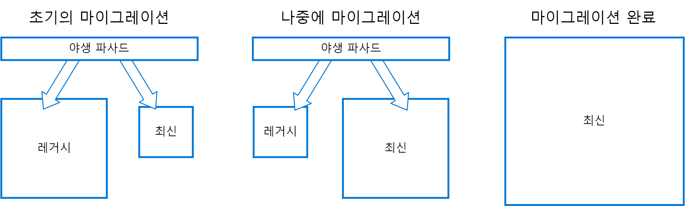

# 스트랭글러 패턴Strangler pattern

특정 기능을 새로운 응용 프로그램 및 서비스로 점진적으로 교체하여 레거시 시스템을 단계적으로 마이그레이션합니다.Incrementally migrate a legacy system by gradually replacing specific pieces of functionality with new applications and services. 레거시 시스템의 기능이 교체되면 결국 새 시스템이 기존 시스템의 모든 기능을 대체하여 기존 시스템을 중단하고 서비스 해제할 수 있습니다.As features from the legacy system are replaced, the new system eventually replaces all of the old system's features, strangling the old system and allowing you to decommission it. 

## 컨텍스트 및 문제점Context and problem

시스템 사용 기간으로 인해 개발 도구, 호스팅 기술뿐만 아니라 구축된 시스템 아키텍처까지도 점차 사용하지 않게 될 수 있습니다.As systems age, the development tools, hosting technology, and even system architectures they were built on can become increasingly obsolete. 새로운 기능이 추가되면 이러한 응용 프로그램의 복잡성이 매우 증가하여 새 기능을 유지 관리하거나 추가하는 것이 더 어려워질 수 있습니다.As new features and functionality are added, the complexity of these applications can increase dramatically, making them harder to maintain or add new features to.

복잡한 시스템을 완전히 교체하는 것은 매우 어려운 작업일 수 있습니다.Completely replacing a complex system can be a huge undertaking. 경우에 따라 아직 마이그레이션되지 않은 기능을 처리하도록 기존 시스템을 유지하면서 점진적으로 새 시스템으로 마이그레이션해야 합니다.Often, you will need a gradual migration to a new system, while keeping the old system to handle features that haven't been migrated yet. 그러나 응용 프로그램의 두 개의 별도 버전을 실행하려면 클라이언트가 특정 기능의 위치를 파악해야 합니다.However, running two separate versions of an application means that clients have to know where particular features are located. 기능 또는 서비스를 마이그레이션할 때마다 새 위치를 가리키도록 클라이언트를 업데이트해야 합니다.Every time a feature or service is migrated, clients need to be updated to point to the new location.

## 해결 방법Solution

특정 부분의 기능을 새로운 응용 프로그램 및 서비스로 점진적으로 교체합니다.Incrementally replace specific pieces of functionality with new applications and services. 백 엔드 레거시 시스템으로 이동하는 요청을 가로채는 외관을 만듭니다.Create a façade that intercepts requests going to the backend legacy system. 외관은 레거시 응용 프로그램 또는 새 서비스로 이러한 요청을 라우트합니다.The façade routes these requests either to the legacy application or the new services. 기존 기능을 새로운 시스템으로 점차적으로 마이그레이션할 수 있으며, 소비자는 마이그레이션이 발생한 것을 인식하지 못하고 동일한 인터페이스를 계속 사용할 수 있습니다.Existing features can be migrated to the new system gradually, and consumers can continue using the same interface, unaware that any migration has taken place.

  

이 패턴을 통해 마이그레이션의 위험을 최소화하고 시간이 지남에 따라 개발 활동을 분산할 수 있습니다.This pattern helps to minimize risk from the migration, and spread the development effort over time. 올바른 응용 프로그램에 사용자를 안전하게 라우팅하는 외관을 사용하여 레거시 응용 프로그램이 계속 작동하도록 하면서 원하는 속도로 새 시스템에 기능을 추가할 수 있습니다.With the façade safely routing users to the correct application, you can add functionality to the new system at whatever pace you like, while ensuring the legacy application continues to function. 시간이 지남에 따라 새 시스템에 기능이 마이그레이션되므로 결국 레거시 시스템은 "스트랭글되고" 더 이상 필요가 없습니다.Over time, as features are migrated to the new system, the legacy system is eventually "strangled" and is no longer necessary. 이 프로세스가 완료되면 레거시 시스템을 안전하게 사용 중지할 수 있습니다.Once this process is complete, the legacy system can safely be retired.

## 문제 및 고려 사항Issues and considerations

- 새 시스템 및 레거시 시스템 모두에서 잠재적으로 사용되는 서비스 및 데이터 저장소를 처리하는 방법을 고려합니다.Consider how to handle services and data stores that are potentially used by both new and legacy systems. 둘 다 이러한 리소스에 병행하여 액세스할 수 있는지 확인합니다.Make sure both can access these resources side-by-side.
- 향후 스트랭글러 마이그레이션에서 쉽게 가로채고 대체할 수 있는 방식으로 새 응용 프로그램 및 서비스를 구성합니다.Structure new applications and services in a way that they can easily be intercepted and replaced in future strangler migrations.
- 어느 시점에 마이그레이션이 완료되면 스트랭글러 외관은 사라지거나 레거시 클라이언트용 어댑터로 발전합니다.At some point, when the migration is complete, the strangler façade will either go away or evolve into an adaptor for legacy clients.
- 외관에서 마이그레이션이 지속되는지 확인합니다.Make sure the façade keeps up with the migration.
- 외관이 단일 실패 지점 또는 성능 병목 상태가 되지 않는지 확인합니다.Make sure the façade doesn't become a single point of failure or a performance bottleneck.

## 이 패턴을 사용해야 하는 경우When to use this pattern

백 엔드 응용 프로그램을 새로운 아키텍처로 점진적으로 마이그레이션하는 경우 이 패턴을 사용합니다.Use this pattern when gradually migrating a back-end application to a new architecture.

다음 경우에는 이 패턴이 적합하지 않을 수 있습니다.This pattern may not be suitable:

- 백 엔드 시스템에 대한 요청을 가로챌 수 없는 경우When requests to the back-end system cannot be intercepted.
- 대량 교체의 복잡성이 낮은 소규모 시스템의 경우For smaller systems where the complexity of wholesale replacement is low.

## 관련 지침Related guidance

- [손상 방지 레이어 패턴Anti-Corruption Layer pattern](./anti-corruption-layer.md)
- [게이트웨이 라우팅 패턴Gateway Routing pattern](./gateway-routing.md)

 

