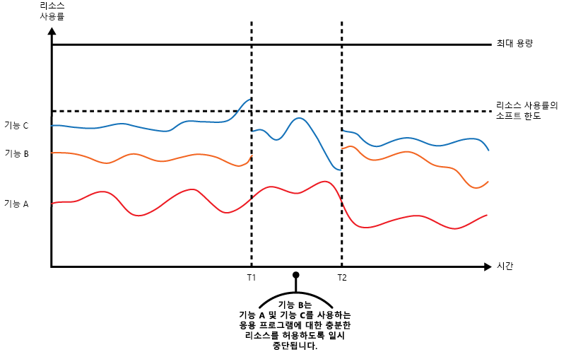
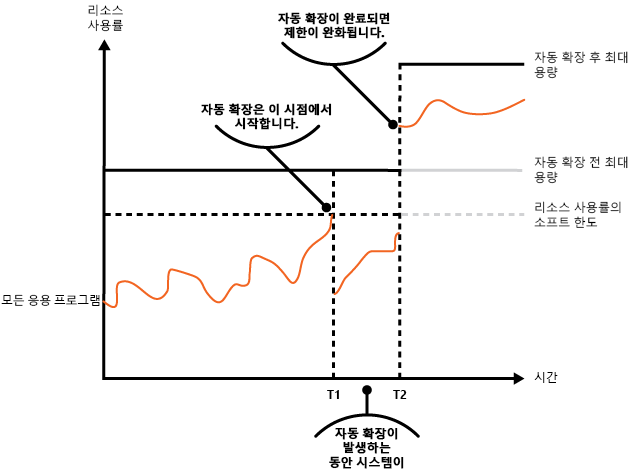
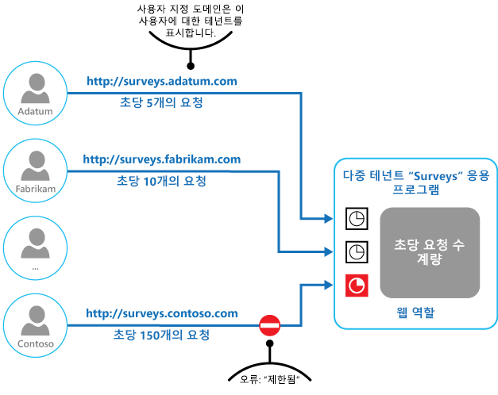

# 제한 패턴

[!INCLUDE [header](../_includes/header.md)]

응용 프로그램 인스턴스, 개별 테넌트 또는 서비스 전체의 리소스 사용량을 제어합니다. 이를 통해 수요 증가가 리소스에 극단적인 부하를 주는 경우에도 시스템은 계속해서 작동하고 서비스 수준 계약을 충족할 수 있습니다.

## 컨텍스트 및 문제점

클라우드 응용 프로그램에 대한 부하는 일반적으로 활성 사용자 수 또는 수행 중인 작업 유형을 기반으로 시간이 지남에 따라 달라집니다. 예를 들어 업무 시간 동안에 더 많은 사용자가 활성화될 수 있고 시스템은 월말마다 값비싼 분석을 수행해야 할 수 있습니다. 작업이 갑자기 예기치 않게 증가할 수도 있습니다. 시스템의 처리 요구 사항이 사용 가능한 리소스 용량을 초과할 경우 성능이 저하되며 실패할 수도 있습니다. 시스템이 계약된 서비스 수준을 충족해야 하는 경우 이러한 실패는 허용될 수 없습니다.

응용 프로그램에 대한 비즈니스 목표에 따라 클라우드의 다양한 부하를 처리할 수 있는 전략은 여러 가지가 있습니다. 한 가지 전략은 지정된 시간에 프로비전된 리소스를 사용자 요구에 맞게 자동 크기 조정을 사용하는 것입니다. 이렇게 하면 실행 비용을 최적화하면서 일관되게 사용자 요구를 잠재적으로 충족할 수 있습니다. 그러나 자동 크기 조정으로 추가 리소스의 프로비전을 트리거할 수 있지만 이 프로비전은 바로 실행되지 않습니다. 요구가 빠르게 증가할 경우 리소스가 부족한 기간이 발생할 수 있습니다.

## 해결 방법

자동 크기 조정을 대체할 수 있는 전략은 응용 프로그램이 리소스를 일정 한도까지만 사용하고 이 한도에 도달하면 리소스를 제한하는 것입니다. 사용량이 임계값을 초과하면 하나 이상의 사용자의 요청을 제한할 수 있도록 시스템은 리소스를 어떻게 사용하는지 모니터링해야 합니다. 이렇게 하면 시스템이 계속 작동할 수 있고 사용 중인 모든 SLA(서비스 수준 계약)를 충족할 수 있습니다. 리소스 사용량을 모니터링하는 방법에 대한 자세한 내용은 [계측 및 원격 분석 지침](https://msdn.microsoft.com/library/dn589775.aspx)을 참조하세요.

시스템에서 다음과 같이 몇 가지 제한 전략을 구현할 수 있습니다.

- 지정된 기간 동안 이미 초당 n번을 초과하여 시스템 API에 액세스한 개별 사용자의 요청을 거부합니다. 이를 위해 시스템은 응용 프로그램을 실행하는 사용자 또는 각 테넌트의 리소스 사용을 측정해야 합니다. 자세한 내용은 [서비스 계량 지침](https://msdn.microsoft.com/library/dn589796.aspx)을 참조하세요.

- 충분한 리소스를 사용하여 필수 서비스를 실행하는 데 방해되지 않도록 필수가 아닌 선택된 서비스의 기능을 사용하지 않도록 설정하거나 저하시킵니다. 예를 들어 응용 프로그램에서 비디오 출력을 스트리밍하는 경우 낮은 해상도로 전환할 수 있습니다.

- 부하 평준화를 사용하여 작업 볼륨을 완만하게 유지합니다(이 방법은 [큐 기반 부하 평준화 패턴](queue-based-load-leveling.md)에서 자세히 다룹니다). 이 방법은 다중 테넌트 환경에서 모든 테넌트의 성능을 감소시킵니다. 시스템이 다양한 SLA로 여러 테넌트를 혼합하여 지원해야 하는 경우 중요한 테넌트에 대한 작업을 즉시 수행할 수 있습니다. 다른 테넌트에 대한 요청을 다시 유지하고 백로그가 용이해지면 처리할 수 있습니다. [우선 순위 큐 패턴][]을 사용하여 이 방법을 구현할 수 있습니다.

- 우선 순위가 낮은 응용 프로그램 또는 테넌트를 대신하여 수행할 작업을 연기합니다. 이러한 작업은 시스템이 사용 중이고 작업을 나중에 다시 시도해야 함을 테넌트에 알리기 위해 예외를 생성하며 일시 중단되거나 제한될 수 있습니다.

다음 그림은 세 가지 기능을 사용하는 응용 프로그램의 시간별 리소스 사용(메모리, CPU, 대역폭 및 기타 요인의 조합)에 대한 영역 그래프를 보여 줍니다. 기능(feature)은 특정 작업 집합을 수행하는 구성 요소, 복잡한 계산을 수행하는 간단한 코드, 메모리 내 캐시와 같은 서비스를 제공하는 요소 등의 단위 기능(functionality)의 영역입니다. 이러한 기능은 A, B, C로 레이블이 지정되어 있습니다.

> 각 기능의 선 바로 아래 영역이 응용 프로그램에서 이 기능을 호출할 때 사용하는 리소스를 나타냅니다. 예를 들어 기능 A 선 아래의 영역은 기능 A를 사용하는 응용 프로그램에서 사용하는 리소스를 나타내고, 기능 A와 기능 B 선 사이의 영역은 기능 B를 호출하는 응용 프로그램에서 사용하는 리소스를 나타냅니다. 각 기능에 대한 영역을 집계하면 시스템의 전체 리소스 사용이 나타납니다.

이전 그림에서 작업 지연 효과를 보여 줍니다. 시간 T1 직전에 이러한 기능을 사용하는 모든 응용 프로그램에 할당된 총 리소스가 임계값(리소스 사용 한도)에 도달합니다. 이 시점에서 응용 프로그램은 사용할 수 있는 리소스를 소모할 위험이 있습니다. 이 시스템에서 기능 B는 기능 A 또는 기능 C보다 덜 중요하므로 일시적으로 비활성화되고 사용하고 있는 리소스가 해제됩니다. 시간 T1과 T2 사이에서 기능 A와 기능 C를 사용하는 응용 프로그램은 계속 정상적으로 실행됩니다. 결국 이 두 기능의 리소스 사용이 줄어들어 T2 시점에서는 충분한 용량으로 기능 B가 다시 활성화됩니다.

자동 크기 조정 및 제한 방법을 결합하여 사용하면 SLA 내의 응용 프로그램 응답 성능을 유지할 수도 있습니다. 시스템을 확장하는 동안 수요를 높은 상태로 유지해야 하는 경우 제한이 임시 솔루션이 될 수 있습니다. 이 시점에서 시스템의 모든 기능을 복원할 수 있습니다.

다음 그림은 시스템에서 실행 중인 모든 응용 프로그램의 시간별 전체 리소스 사용에 대한 영역 그래프 및 자동 크기 조정과 제한을 결합하는 방법을 보여 줍니다.

시간 T1에서 리소스 사용의 소프트 한도를 지정하는 임계값에 도달합니다. 이 시점에서 시스템은 규모 확장을 시작할 수 있습니다. 그러나 새 리소스를 빨리 사용할 수 없는 경우에는 기존 리소스가 소진되어 시스템이 실패할 수 있습니다. 이런 경우가 발생하지 않도록 앞에서 설명한 대로 시스템이 일시적으로 제한됩니다. 자동 크기 조정이 완료되고 추가 리소스를 사용할 수 있게 되면 제한이 완화될 수 있습니다.

## 문제 및 고려 사항

이 패턴을 구현할 방법을 결정할 때 다음 사항을 고려해야 합니다.

- 응용 프로그램 제한(사용 전략)은 시스템의 전체 디자인에 영향을 주는 아키텍처 의사 결정입니다. 제한은 시스템이 구현되면 추가하는 것이 쉽지 않으므로 응용 프로그램 디자인 프로세스 초기에 고려해야 합니다.

- 제한은 신속하게 수행되어야 합니다. 시스템은 작업의 증가를 검색하고 그에 따라 반응할 수 있어야 합니다. 또한 시스템은 부하가 용이하게 된 후 신속하게 원래 상태로 되돌릴 수 있어야 합니다. 이를 위해 적절한 성능 데이터를 지속적으로 캡처하고 모니터링해야 합니다.

- 서비스가 일시적으로 사용자 요청을 거부해야 하는 경우 클라이언트 응용 프로그램에서 작업 수행을 거부하는 사유가 제한으로 인한 것임을 알도록 특정 오류 코드를 반환해야 합니다. 클라이언트 응용 프로그램은 요청을 다시 시도하기 전에 일정 기간 대기할 수 있습니다.

- 시스템 자동 크기 조정 동안 임시 수단으로 제한을 사용할 수 있습니다. 갑자기 증가한 작업이 그리 오래 지속되지 않을 경우에는 크기 조정이 실행 비용을 상당히 추가할 수 있으므로 일부 경우 크기 조정 대신 간단하게 제한하는 것이 좋습니다.

- 시스템 크기 조정 동안 제한을 임시 수단으로 사용하는 경우와 리소스 요구가 매우 빠르게 증가하는 경우 시스템이 계속 작동하지 않을 수 있습니다. 제한된 모드에서 운영할 때에도 그러합니다. 이를 예방하려면 더 큰 용량 예약을 유지하고 보다 강력한 자동 크기 조정을 구성하는 것이 좋습니다.

## 이 패턴을 사용해야 하는 경우

이 패턴을 사용하여 다음을 수행할 수 있습니다.

- 시스템이 계속해서 서비스 수준 계약을 충족하도록 합니다.

- 단일 테넌트가 응용 프로그램에서 제공하는 리소스를 독점하지 않도록 합니다.

- 갑작스러운 작업 증가를 처리합니다.

- 작동을 유지하는 데 필요한 최대 리소스 수준을 제한하여 시스템 비용을 최적화할 수 있습니다.

## 예

마지막 그림은 다중 테넌트 시스템에서 제한을 구현할 수 있는 방법을 보여 줍니다. 각 테넌트 조직의 사용자가 설문 조사를 작성 및 제출하는 클라우드 호스팅 응용 프로그램에 액세스합니다. 이 응용 프로그램에는 해당 사용자가 응용 프로그램에 요청을 제출하는 속도를 모니터링하는 계측이 포함되어 있습니다.

한 테넌트의 사용자가 다른 모든 사용자에 대한 응용 프로그램의 응답성 및 가용성에 영향을 주지 않도록 한 테넌트의 사용자가 제출할 수 있는 초당 요청 수에 한도를 적용합니다. 응용 프로그램이 이 한도를 초과하는 요청을 차단합니다.

## 관련 패턴 및 지침

이 패턴을 구현할 때 다음 패턴 및 지침도 관련이 있을 수 있습니다.
- [계측 및 원격 분석 지침](https://msdn.microsoft.com/library/dn589775.aspx) 제한은 서비스가 얼마나 많이 사용되고 있는지에 대한 정보 수집에 따라 달라집니다. 사용자 지정 모니터링 정보를 생성하고 캡처하는 방법에 대해 설명합니다.
- [서비스 계량 지침](https://msdn.microsoft.com/library/dn589796.aspx). 사용 방법을 이해하기 위해 서비스 사용을 계량하는 방법을 설명합니다. 이 정보는 서비스 제한 방법을 결정하는 데 유용할 수 있습니다.
- [자동 크기 조정 지침](https://msdn.microsoft.com/library/dn589774.aspx). 제한은 시스템 자동 크기 조정 동안 임시 수단으로 사용될 수 있으며, 제한을 사용하면 시스템에서 자동 크기 조정이 필요하지 않습니다. 자동 크기 조정 전략에 대한 정보를 포함합니다.
- [큐 기반 부하 평준화 패턴](queue-based-load-leveling.md). 큐 기반 부하 평준화는 제한을 구현하기 위해 일반적으로 사용되는 메커니즘입니다. 큐는 응용 프로그램에 의해 전송되는 요청이 서비스로 전달되는 속도를 평준화하도록 하는 버퍼 역할을 할 수 있습니다.
- [우선 순위 큐 패턴][]. 시스템은 제한 전략의 일환으로 우선 순위 큐를 사용하여 덜 중요한 응용 프로그램의 성능은 줄이고 중요한 응용 프로그램의 성능을 유지 관리할 수 있습니다.

[우선 순위 큐 패턴]: priority-queue.md