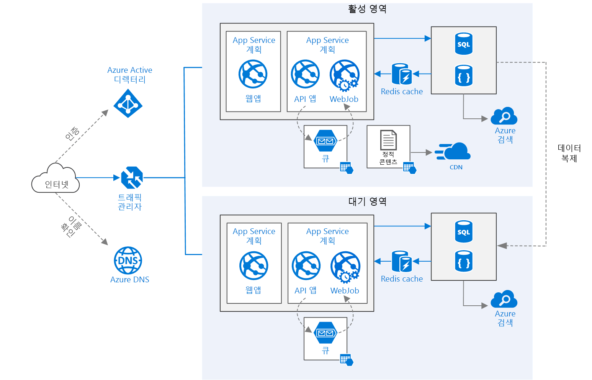

# <a name="run-a-web-application-in-multiple-regions"></a>여러 지역에서 웹 응용 프로그램 실행
[!INCLUDE [header](../../_includes/header.md)]

이 참조 아키텍처는 여러 지역에서 Azure App Service 응용 프로그램을 실행하여 고가용성을 실현하는 방법을 보여 줍니다. 

 

*이 아키텍처의 [Visio 파일][visio-download]을 다운로드합니다.*

## <a name="architecture"></a>건축 

이 아키텍처는 [웹 응용 프로그램에서 확장성 향상][guidance-web-apps-scalability]에 표시된 아키텍처를 기반으로 합니다. 주요 차이점은 다음과 같습니다.

* **주 지역 및 보조 지역**. 이 아키텍처는 더 높은 가용성을 달성하기 위해 두 지역을 사용합니다. 응용 프로그램이 각 지역에 배포됩니다. 정상적으로 작동하는 동안에는 네트워크 트래픽이 주 지역으로 라우팅됩니다. 주 지역을 사용할 수 없는 경우에는 트래픽이 보조 지역으로 라우팅됩니다. 
* **Azure DNS**. [Azure DNS][azure-dns]는 Microsoft Azure 인프라를 사용하여 이름 확인을 제공하는 DNS 도메인에 대한 호스팅 서비스입니다. Azure에 도메인을 호스트하면 다른 Azure 서비스와 동일한 자격 증명, API, 도구 및 대금 청구를 사용하여 DNS 레코드를 관리할 수 있습니다.
* **Azure Traffic Manager**. [Traffic Manager][traffic-manager]는 들어오는 요청을 주 지역으로 라우팅합니다. 해당 지역을 실행하는 응용 프로그램을 사용할 수 없게 되면 Traffic Manager가 보조 지역으로 장애 조치(failover)합니다.
* SQL Database와 Cosmos DB의 **지역에서 복제** 

다중 지역 아키텍처는 단일 지역에 배포하는 것보다 더 높은 가용성을 제공할 수 있습니다. 지역 가동 중단이 주 지역에 영향을 주는 경우 [Traffic Manager][traffic-manager]를 사용하여 보조 지역으로 장애 조치(failover)할 수 있습니다. 이 아키텍처는 응용 프로그램의 개별 하위 시스템이 고장난 경우에도 도움이 될 수 있습니다.

지역에서 고가용성을 달성하는 데 몇 가지 일반적인 접근 방식이 있습니다. 

* 활성/수동(상시 대기). 트래픽이 한 지역으로 이동하면 다른 하나가 상시 대기 상태에서 기다립니다. 상시 대기는 항상 보조 지역의 VM이 할당되고 실행 중이라는 의미입니다.
* 활성/수동(수동 대기). 트래픽이 한 지역으로 이동하면 다른 하나가 수동 대기에서 기다립니다. 수동 대기는 장애 조치(failover)에 필요할 때까지 보조 지역의 VM이 할당되지 않는다는 것입니다. 이 방법은 실행하는 데 비용이 덜 들지만, 일반적으로 실패 상태에 있을 때 온라인 상태가 되는 데 더 오래 시간이 걸립니다.
* 활성/활성. 두 지역 모두 활성화되어 있으며, 요청이 두 지역 사이에서 부하 분산됩니다. 한 지역을 사용할 수 없게 되면 회전이 중단됩니다. 

이 참조 아키텍처는 장애 조치(failover)를 위해 Traffic Manager를 사용하여 활성/수동(상시 대기)을 중점적으로 다룹니다. 


## <a name="recommendations"></a>권장 사항

개발자의 요구 사항이 여기에 설명된 아키텍처와 다를 수 있습니다. 이 섹션의 권장 사항을 시작점으로 사용합니다.

### <a name="regional-pairing"></a>지역을 쌍으로 연결
Azure 지역은 동일한 지역 내에서 다른 지역과 쌍을 이룹니다. 일반적으로 같은 지역 쌍에서 지역을 선택합니다. 예를 들어 미국 동부 2와 미국 중부입니다. 이에 따른 장점은 다음과 같습니다.

* 광범위한 가동 중단이 발생한 경우 모든 쌍 중에서 하나 이상의 지역에 대한 복구에 우선 순위가 지정됩니다.
* 계획된 Azure 시스템 업데이트는 순차적으로 쌍을 이루는 지역으로 출시되어 가동 중지 시간을 최소화할 수 있습니다.
* 대부분의 경우 지역 쌍은 데이터 상주 요구 사항을 충족하기 위해 동일한 지리 내에 상주합니다.

그러나 두 지역 모두 응용 프로그램에 필요한 모든 Azure 서비스를 지원하는지 확인합니다. [지역별 서비스][services-by-region]를 참조하세요. 지역 쌍에 대한 자세한 내용은 [BCDR(무중단 업무 방식 및 재해 복구): Azure 쌍을 이루는 지역][regional-pairs]을 참조하세요.

### <a name="resource-groups"></a>리소스 그룹
주 지역, 보조 지역 및 Traffic Manager를 별도의[리소스 그룹][resource groups]에 배치하는 것을 고려합니다. 이 방법을 사용하면 각 지역에 배포된 리소스를 단일 컬렉션으로 관리할 수 있습니다.

### <a name="traffic-manager-configuration"></a>Traffic Manager 구성 

**라우팅**. Traffic Manager는 여러 [라우팅 알고리즘][tm-routing]을 지원합니다. 이 문서에 설명된 시나리오는 *우선 순위* 라우팅(이전에는 *장애 조치(failover)* 라우팅이라고 함)을 사용합니다. 이 설정을 사용하면 Traffic Manager가 해당 지역의 끝점에 연결할 수 없는 경우가 아닌 한 모든 요청을 주 지역으로 보냅니다. 이때 자동으로 보조 지역으로 장애 조치(failover)됩니다. [장애 조치(failover) 라우팅 방법 구성][tm-configure-failover]을 참조하세요.

**상태 프로브**. Traffic Manager는 HTTP(또는 HTTPS) 프로브를 사용하여 각 끝점의 가용성을 모니터링합니다. 이 프로브는 Traffic Manager가 보조 지역으로의 장애 조치(failover)에 대한 통과/실패 테스트를 제공합니다. 지정된 URL 경로 요청을 전송하여 작동됩니다. 제한 시간 내에 200개의 비응답을 받으면 프로브가 실패합니다. 4개의 요청이 실패하면 Traffic Manager가 끝점을 성능 저하로 표시하고 다른 끝점으로 장애 조치(failover)합니다. 자세한 내용은 [Traffic Manager 끝점 모니터링 및 장애 조치(failover)][tm-monitoring]를 참조하세요.

응용 프로그램의 전반적인 상태를 보고하는 상태 프로브 끝점을 만들고 이 끝점을 상태 프로브에 사용하는 것이 좋습니다. 끝점은 App Service 앱, 저장소 큐, SQL Database와 같은 중요 종속성을 확인해야 합니다. 그렇지 않으면 응용 프로그램의 중요한 부분이 실제로 실패할 때 프로브에서 정상 끝점을 보고할 수 있습니다.

반면에 하위 우선 순위 서비스를 확인하는 데 상태 프로브를 사용하지 않습니다. 예를 들어 메일 서비스가 중단되면 응용 프로그램이 두 번째 공급자로 전환하거나 나중에 메일을 보낼 수 있습니다. 이는 응용 프로그램에서 장애 조치(failover)를 취할 만큼 높은 우선 순위가 아닙니다. 자세한 내용은 [상태 끝점 모니터링 패턴][health-endpoint-monitoring-pattern]을 참조하세요.
 
### <a name="sql-database"></a>SQL Database
[활성 지역 복제][sql-replication]를 사용하여 다른 지역에서 읽기 가능한 보조 복제본을 만듭니다. 최대 4개의 읽기 가능한 보조 복제본을 사용할 수 있습니다. 주 데이터베이스에 오류가 발생하거나 데이터베이스를 오프라인으로 전환해야 하는 경우 보조 데이터베이스로 장애 조치(failover)합니다. Elastic Database 풀에서 모든 데이터베이스에 대한 활성 지역 복제를 구성할 수 있습니다.

### <a name="cosmos-db"></a>Cosmos DB
Cosmos DB는 지역 간 지역에서 복제를 지원합니다. 한 지역은 쓰기 가능으로 지정되고 다른 지역은 읽기 전용 복제본으로 지정됩니다.

지역 가동 중단이 발생하면 다른 지역을 쓰기 지역으로 선택하여 장애 조치(failover)할 수 있습니다. 클라이언트 SDK에서는 현재 쓰기 지역에 쓰기 요청을 자동으로 보내므로 장애 조치(failover) 후에 클라이언트 구성을 업데이트할 필요가 없습니다. 자세한 내용은 [Azure Cosmos DB로 데이터를 전역적으로 배포하는 방법][cosmosdb-geo]을 참조하세요.

> [!NOTE]
> 모든 복제본은 동일한 리소스 그룹에 속합니다.
>
>

### <a name="storage"></a>Storage
Azure Storage의 경우 RA-GRS([읽기 액세스 지역 중복 저장소][ra-grs])를 사용합니다. RA-GRS 저장소를 사용하면 데이터가 보조 지역에 복제됩니다. 별도의 끝점을 통해 보조 지역의 데이터에 읽기 전용으로 액세스할 수 있습니다. 지역 가동 중단이나 재해가 발생할 경우 Azure Storage 팀이 보조 지역에 대해 지역 장애 조치(failover)를 수행하기로 결정할 수 있습니다. 이 장애 조치(failover)에 필요한 고객 작업은 없습니다.

Queue Storage의 경우 보조 지역에 백업 큐를 만듭니다. 장애 조치(failover) 중에 앱은 주 지역을 다시 사용할 수 있을 때까지 백업 큐를 사용할 수 있습니다. 이런 방식으로 응용 프로그램이 새 요청을 계속 처리할 수 있습니다.

## <a name="availability-considerations"></a>가용성 고려 사항


### <a name="traffic-manager"></a>Traffic Manager

주 지역을 사용할 수 없게 되면 Traffic Manager가 자동으로 장애 조치(failover)합니다. Traffic Manager가 장애 조치(failover)할 때 클라이언트가 응용 프로그램에 연결할 수 없는 기간이 있습니다. 그 기간은 다음과 같은 요인에 의해 영향을 받습니다.

* 상태 프로브가 기본 데이터 센터에 연결할 수 없는지 검색해야 합니다.
* DNS(도메인 이름 서비스) 서버가 DNS TTL(time-to-live)에 따라 IP 주소에 대해 캐시된 DNS 레코드를 업데이트해야 합니다. 기본 TTL은 300초(5분)이지만 Traffic Manager 프로필을 만들 때 이 값을 구성할 수 있습니다.

자세한 내용은 [Traffic Manager 모니터링 정보][tm-monitoring]를 참조하세요.

Traffic Manager는 시스템에서 오류가 발생할 수 있는 지점입니다. 서비스가 실패하면 클라이언트가 가동 중지 시간 동안 응용 프로그램에 액세스할 수 없습니다. [Traffic Manager SLA(서비스 수준 계약)][tm-sla]를 검토하고 Traffic Manager만 사용하는 것이 고가용성을 위한 비즈니스 요구 사항을 충족하는지 확인합니다. 그렇지 않은 경우 다른 트래픽 관리 솔루션을 장애 복구(failback)로 추가합니다. Azure Traffic Manager 서비스가 실패하면 다른 트래픽 관리 서비스를 가리키도록 DNS의 CNAME(정식 이름) 레코드를 변경합니다. 이 단계는 수동으로 수행해야 하며 DNS 변경 사항이 전파될 때까지 응용 프로그램을 사용할 수 없습니다.

### <a name="sql-database"></a>SQL Database
SQL Database의 RPO(복구 지점 목표) 및 ERT(예상 복구 시간)에 대한 설명은 [Azure SQL Database의 무중단 업무 방식 개요][sql-rpo]에 나와 있습니다. 

### <a name="storage"></a>Storage
RA-GRS 저장소는 지속형 저장소를 제공하지만 가동 중단 시 다음과 같은 사항이 발생할 수 있다는 점을 이해하는 것이 중요합니다.

* 저장소 가동 중단이 발생하는 경우 데이터에 대한 쓰기 액세스 권한이 없는 기간이 발생합니다. 가동 중단 중에 보조 끝점에서 계속 읽을 수 있습니다.
* 지역 가동 중단이나 재해가 기본 위치에 영향을 미치고 해당 위치의 데이터를 복구할 수 없는 경우 Azure Storage 팀에서 보조 지역에 대한 지역 장애 조치(failover)를 수행하기로 결정할 수 있습니다.
* 보조 지역에 대한 데이터 복제는 비동기적으로 수행됩니다. 따라서 지역 장애 조치(failover)를 수행하는 경우 주 지역에서 데이터를 복구할 수 없으면 일부 데이터가 손실될 수 있습니다.
* 네트워크 가동 중단 등의 일시적인 오류는 저장소 장애 조치(failover)를 트리거하지 않습니다. 일시적인 장애를 복원할 수 있도록 응용 프로그램을 디자인합니다. 다음은 가능한 완화 방법입니다.
  
  * 보조 지역에서 읽습니다.
  * 새 쓰기 작업(예: 메시지 큐에 넣기)을 위해 다른 저장소 계정으로 일시적으로 전환합니다.
  * 데이터를 보조 지역에서 다른 저장소 계정으로 복사합니다.
  * 시스템이 장애 복구(failback)할 때까지 축소된 기능을 제공합니다.

자세한 내용은 [Azure Storage 가동 중단이 발생할 경우 수행할 작업][storage-outage]을 참조하세요.

## <a name="manageability-considerations"></a>관리 효율성 고려 사항

### <a name="traffic-manager"></a>Traffic Manager

Traffic Manager가 장애 조치(failover)를 수행하는 경우 자동 장애 복구(failback)를 구현하기 보다는 수동 장애 복구(failback)를 수행하는 것이 좋습니다. 그렇지 않으면 응용 프로그램이 지역 간에 앞뒤로 대칭 이동하는 상황이 발생할 수 있습니다. 장애 복구(failback) 전에 모든 응용 프로그램 하위 시스템이 정상 상태인지 확인합니다.

Traffic Manager는 기본적으로 자동으로 장애를 복구(failback)합니다. 이를 방지하려면 장애 조치(failover) 이벤트 후 수동으로 주 지역의 우선 순위를 낮춥니다. 예를 들어 주 지역의 우선 순위가 1이고 보조 지역의 우선 순위를 2로 가정합니다. 장애 조치(failover) 후 자동 장애 복구(failback)를 방지하기 위해 주 지역의 우선 순위를 3으로 설정합니다. 다시 전환할 준비가 되면 우선 순위를 1로 업데이트합니다.

다음 명령은 우선 순위를 업데이트합니다.

**PowerShell**

```bat
$endpoint = Get-AzureRmTrafficManagerEndpoint -Name <endpoint> -ProfileName <profile> -ResourceGroupName <resource-group> -Type AzureEndpoints
$endpoint.Priority = 3
Set-AzureRmTrafficManagerEndpoint -TrafficManagerEndpoint $endpoint
```

자세한 내용은 [Azure Traffic Manager Cmdlet][tm-ps]을 참조하세요.

**Azure CLI(명령줄 인터페이스)**

```bat
azure network traffic-manager endpoint set --name <endpoint> --profile-name <profile> --resource-group <resource-group> --type AzureEndpoints --priority 3
```    

### <a name="sql-database"></a>SQL Database
주 데이터베이스에 오류가 발생하는 경우 보조 데이터베이스에 수동 장애 조치(failover)를 수행합니다. [Azure SQL Database 복원 또는 보조 데이터베이스에 대한 장애 조치(failover)][sql-failover]를 참조하세요. 장애 조치(failover)될 때까지 보조 데이터베이스는 읽기 전용으로 유지됩니다.


<!-- links -->

[azure-sql-db]: https://azure.microsoft.com/documentation/services/sql-database/
[azure-dns]: /azure/dns/dns-overview
[cosmosdb-geo]: /azure/cosmos-db/distribute-data-globally
[guidance-web-apps-scalability]: ./scalable-web-app.md
[health-endpoint-monitoring-pattern]: https://msdn.microsoft.com/library/dn589789.aspx
[ra-grs]: /azure/storage/storage-redundancy#read-access-geo-redundant-storage
[regional-pairs]: /azure/best-practices-availability-paired-regions
[resource groups]: /azure/azure-resource-manager/resource-group-overview#resource-groups
[services-by-region]: https://azure.microsoft.com/regions/#services
[sql-failover]: /azure/sql-database/sql-database-disaster-recovery
[sql-replication]: /azure/sql-database/sql-database-geo-replication-overview
[sql-rpo]: /azure/sql-database/sql-database-business-continuity#sql-database-features-that-you-can-use-to-provide-business-continuity
[storage-outage]: /azure/storage/storage-disaster-recovery-guidance
[tm-configure-failover]: /azure/traffic-manager/traffic-manager-configure-failover-routing-method
[tm-monitoring]: /azure/traffic-manager/traffic-manager-monitoring
[tm-ps]: https://msdn.microsoft.com/library/mt125941.aspx
[tm-routing]: /azure/traffic-manager/traffic-manager-routing-methods
[tm-sla]: https://azure.microsoft.com/support/legal/sla/traffic-manager/v1_0/
[traffic-manager]: https://azure.microsoft.com/services/traffic-manager/
[visio-download]: https://archcenter.blob.core.windows.net/cdn/app-service-reference-architectures.vsdx
