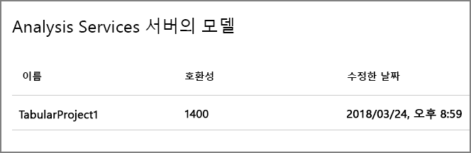
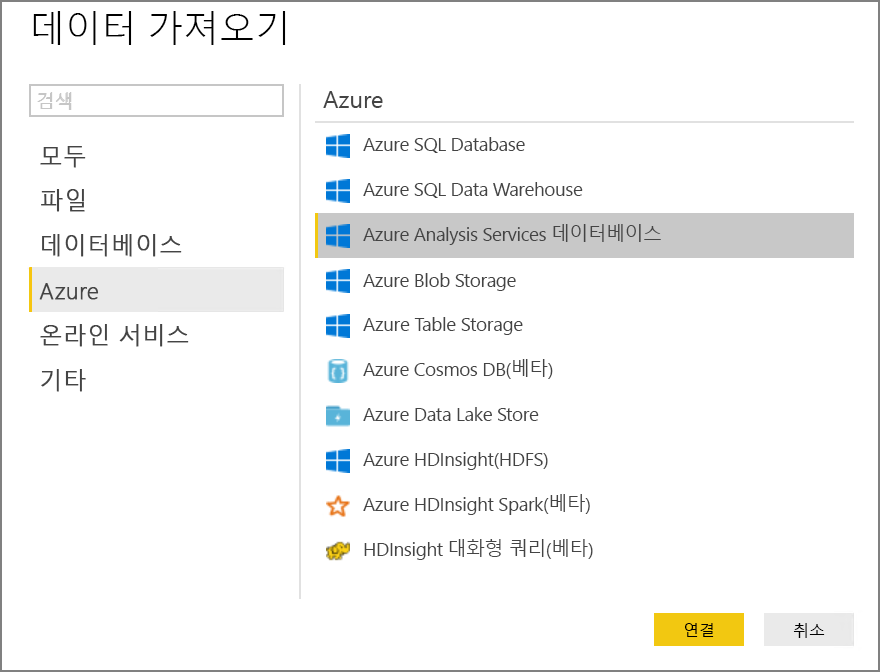

# <a name="automated-enterprise-bi-with-sql-data-warehouse-and-azure-data-factory"></a><span data-ttu-id="02d5b-103">SQL Data Warehouse 및 Azure Data Factory를 사용하는 자동화된 Enterprise BI</span><span class="sxs-lookup"><span data-stu-id="02d5b-103">Automated enterprise BI with SQL Data Warehouse and Azure Data Factory</span></span>

<span data-ttu-id="02d5b-104">이 참조 아키텍처는 [ELT](../../data-guide/relational-data/etl.md#extract-load-and-transform-elt)(추출-로드-변환) 파이프라인에서 증분 로드를 수행하는 방법을 보여줍니다.</span><span class="sxs-lookup"><span data-stu-id="02d5b-104">This reference architecture shows how to perform incremental loading in an [ELT](../../data-guide/relational-data/etl.md#extract-load-and-transform-elt) (extract-load-transform) pipeline.</span></span> <span data-ttu-id="02d5b-105">Azure Data Factory를 사용하여 ELT 파이프라인을 자동화합니다.</span><span class="sxs-lookup"><span data-stu-id="02d5b-105">It uses Azure Data Factory to automate the ELT pipeline.</span></span> <span data-ttu-id="02d5b-106">파이프라인은 증분 방식으로 최신 OLTP 데이터를 온-프레미스 SQL Server 데이터베이스에서 SQL Data Warehouse로 이동합니다.</span><span class="sxs-lookup"><span data-stu-id="02d5b-106">The pipeline incrementally moves the latest OLTP data from an on-premises SQL Server database into SQL Data Warehouse.</span></span> <span data-ttu-id="02d5b-107">트랜잭션 데이터는 분석을 위해 테이블 형식 모델로 변환됩니다.</span><span class="sxs-lookup"><span data-stu-id="02d5b-107">Transactional data is transformed into a tabular model for analysis.</span></span> [<span data-ttu-id="02d5b-108">**이 솔루션을 배포합니다**.</span><span class="sxs-lookup"><span data-stu-id="02d5b-108">**Deploy this solution**.</span></span>](#deploy-the-solution)


<span data-ttu-id="02d5b-109">이 아키텍처는 [SQL Data Warehouse를 사용한 Enterprise BI](./enterprise-bi-sqldw.md)에 표시된 아키텍처 위에 빌드하지만 엔터프라이즈 데이터 웨어하우징 시나리오에 대해 중요한 일부 기능을 추가합니다.</span><span class="sxs-lookup"><span data-stu-id="02d5b-109">This architecture builds on the one shown in [Enterprise BI with SQL Data Warehouse](./enterprise-bi-sqldw.md), but adds some features that are important for enterprise data warehousing scenarios.</span></span>

-   <span data-ttu-id="02d5b-110">Data Factory를 사용하여 파이프라인의 자동화.</span><span class="sxs-lookup"><span data-stu-id="02d5b-110">Automation of the pipeline using Data Factory.</span></span>
-   <span data-ttu-id="02d5b-111">증분 로드.</span><span class="sxs-lookup"><span data-stu-id="02d5b-111">Incremental loading.</span></span>
-   <span data-ttu-id="02d5b-112">다중 데이터 원본 통합.</span><span class="sxs-lookup"><span data-stu-id="02d5b-112">Integrating multiple data sources.</span></span>
-   <span data-ttu-id="02d5b-113">지리 공간 데이터 및 이미지 같은 이진 데이터 로드.</span><span class="sxs-lookup"><span data-stu-id="02d5b-113">Loading binary data such as geospatial data and images.</span></span>

## <a name="architecture"></a><span data-ttu-id="02d5b-114">아키텍처</span><span class="sxs-lookup"><span data-stu-id="02d5b-114">Architecture</span></span>

<span data-ttu-id="02d5b-115">이 아키텍처는 다음 구성 요소로 구성됩니다.</span><span class="sxs-lookup"><span data-stu-id="02d5b-115">The architecture consists of the following components.</span></span>

### <a name="data-sources"></a><span data-ttu-id="02d5b-116">데이터 원본</span><span class="sxs-lookup"><span data-stu-id="02d5b-116">Data sources</span></span>

<span data-ttu-id="02d5b-117">**온-프레미스 SQL Server**.</span><span class="sxs-lookup"><span data-stu-id="02d5b-117">**On-premises SQL Server**.</span></span> <span data-ttu-id="02d5b-118">원본 데이터는 SQL Server 데이터베이스 온-프레미스에 위치합니다.</span><span class="sxs-lookup"><span data-stu-id="02d5b-118">The source data is located in a SQL Server database on premises.</span></span> <span data-ttu-id="02d5b-119">온-프레미스 환경을 시뮬레이션하기 위해 이 아키텍처에 대한 배포 스크립트는 설치된 SQL Server를 사용하여 Azure에서 가상 머신을 프로비전합니다.</span><span class="sxs-lookup"><span data-stu-id="02d5b-119">To simulate the on-premises environment, the deployment scripts for this architecture provision a virtual machine in Azure with SQL Server installed.</span></span> <span data-ttu-id="02d5b-120">[Wide World Importers OLTP 예제 데이터베이스][wwi]는 원본 데이터로 사용됩니다.</span><span class="sxs-lookup"><span data-stu-id="02d5b-120">The [Wide World Importers OLTP sample database][wwi] is used as the source database.</span></span>

<span data-ttu-id="02d5b-121">**외부 데이터**.</span><span class="sxs-lookup"><span data-stu-id="02d5b-121">**External data**.</span></span> <span data-ttu-id="02d5b-122">데이터 웨어하우스에 대한 일반적인 시나리오는 여러 데이터 원본을 통합하는 것입니다.</span><span class="sxs-lookup"><span data-stu-id="02d5b-122">A common scenario for data warehouses is to integrate multiple data sources.</span></span> <span data-ttu-id="02d5b-123">이 참조 아키텍처는 연도별 도시 인구를 포함하는 외부 데이터 집합을 로드하여 OLTP 데이터베이스의 데이터와 통합합니다.</span><span class="sxs-lookup"><span data-stu-id="02d5b-123">This reference architecture loads an external data set that contains city populations by year, and integrates it with the data from the OLTP database.</span></span> <span data-ttu-id="02d5b-124">"각 지역의 매출 증가가 인구 증가와 일치하거나 초과합니까?" 같은 인사이트에 이 데이터를 사용할 수 있습니다.</span><span class="sxs-lookup"><span data-stu-id="02d5b-124">You can use this data for insights such as: "Does sales growth in each region match or exceed population growth?"</span></span>

### <a name="ingestion-and-data-storage"></a><span data-ttu-id="02d5b-125">수집 및 데이터 저장소</span><span class="sxs-lookup"><span data-stu-id="02d5b-125">Ingestion and data storage</span></span>

<span data-ttu-id="02d5b-126">**Blob Storage**</span><span class="sxs-lookup"><span data-stu-id="02d5b-126">**Blob Storage**.</span></span> <span data-ttu-id="02d5b-127">Blob 저장소는 SQL Data Warehouse로 로딩하기 전에 원본 데이터에 대한 준비 영역으로 사용됩니다.</span><span class="sxs-lookup"><span data-stu-id="02d5b-127">Blob storage is used as a staging area for the source data before loading it into SQL Data Warehouse.</span></span>

<span data-ttu-id="02d5b-128">**Azure SQL Data Warehouse**</span><span class="sxs-lookup"><span data-stu-id="02d5b-128">**Azure SQL Data Warehouse**.</span></span> <span data-ttu-id="02d5b-129">[SQL Data Warehouse](/azure/sql-data-warehouse/)는 대규모 데이터 분석을 수행하도록 설계되고 배포된 시스템입니다.</span><span class="sxs-lookup"><span data-stu-id="02d5b-129">[SQL Data Warehouse](/azure/sql-data-warehouse/) is a distributed system designed to perform analytics on large data.</span></span> <span data-ttu-id="02d5b-130">고성능 분석을 실행하는 데 적합하도록 하는 MPP(대규모 병렬 처리)를 지원합니다.</span><span class="sxs-lookup"><span data-stu-id="02d5b-130">It supports massive parallel processing (MPP), which makes it suitable for running high-performance analytics.</span></span> 

<span data-ttu-id="02d5b-131">**Azure Data Factory**.</span><span class="sxs-lookup"><span data-stu-id="02d5b-131">**Azure Data Factory**.</span></span> <span data-ttu-id="02d5b-132">[Data Factory][adf]는 데이터 이동 및 데이터 변환을 오케스트레이션하고 자동화하는 관리되는 서비스입니다.</span><span class="sxs-lookup"><span data-stu-id="02d5b-132">[Data Factory][adf] is a managed service that orchestrates and automates data movement and data transformation.</span></span> <span data-ttu-id="02d5b-133">이 아키텍처에서 다양한 단계의 ELT 프로세스를 조정합니다.</span><span class="sxs-lookup"><span data-stu-id="02d5b-133">In this architecture, it coordinates the various stages of the ELT process.</span></span>

### <a name="analysis-and-reporting"></a><span data-ttu-id="02d5b-134">분석 및 보고</span><span class="sxs-lookup"><span data-stu-id="02d5b-134">Analysis and reporting</span></span>

<span data-ttu-id="02d5b-135">**Azure Analysis Services**.</span><span class="sxs-lookup"><span data-stu-id="02d5b-135">**Azure Analysis Services**.</span></span> <span data-ttu-id="02d5b-136">[Analysis Services](/azure/analysis-services/)는 데이터 모델링 기능을 제공하는 완전히 관리되는 서비스입니다.</span><span class="sxs-lookup"><span data-stu-id="02d5b-136">[Analysis Services](/azure/analysis-services/) is a fully managed service that provides data modeling capabilities.</span></span> <span data-ttu-id="02d5b-137">의미 체계 모델은 Analysis Services에 로드됩니다.</span><span class="sxs-lookup"><span data-stu-id="02d5b-137">The semantic model is loaded into Analysis Services.</span></span>

<span data-ttu-id="02d5b-138">**Power BI**.</span><span class="sxs-lookup"><span data-stu-id="02d5b-138">**Power BI**.</span></span> <span data-ttu-id="02d5b-139">Power BI는 비즈니스 정보에 대한 데이터를 분석하는 비즈니스 분석 도구 제품군입니다.</span><span class="sxs-lookup"><span data-stu-id="02d5b-139">Power BI is a suite of business analytics tools to analyze data for business insights.</span></span> <span data-ttu-id="02d5b-140">이 아키텍처에서 Analysis Services에 저장된 의미 체계 모델을 쿼리합니다.</span><span class="sxs-lookup"><span data-stu-id="02d5b-140">In this architecture, it queries the semantic model stored in Analysis Services.</span></span>

### <a name="authentication"></a><span data-ttu-id="02d5b-141">인증</span><span class="sxs-lookup"><span data-stu-id="02d5b-141">Authentication</span></span>

<span data-ttu-id="02d5b-142">**Azure Active Directory**(Azure AD)는 Power BI를 통해 Analysis Services 서버에 연결하는 사용자를 인증합니다.</span><span class="sxs-lookup"><span data-stu-id="02d5b-142">**Azure Active Directory** (Azure AD) authenticates users who connect to the Analysis Services server through Power BI.</span></span>

<span data-ttu-id="02d5b-143">Data Factory는 서비스 주체 또는 MSI(관리되는 서비스 ID)를 사용하여 SQL Data Warehouse를 인증하려면 Azure AD를 사용할 수 있습니다.</span><span class="sxs-lookup"><span data-stu-id="02d5b-143">Data Factory can use also use Azure AD to authenticate to SQL Data Warehouse, by using a service principal or Managed Service Identity (MSI).</span></span> <span data-ttu-id="02d5b-144">간소화를 위해 예제 배포는 SQL Server 인증을 사용합니다.</span><span class="sxs-lookup"><span data-stu-id="02d5b-144">For simplicity, the example deployment uses SQL Server authentication.</span></span>

## <a name="data-pipeline"></a><span data-ttu-id="02d5b-145">데이터 파이프라인</span><span class="sxs-lookup"><span data-stu-id="02d5b-145">Data pipeline</span></span>

<span data-ttu-id="02d5b-146">[Azure Data Factory][adf]에서 파이프라인은 이 경우에 작업 &mdash;를 조정하는 데 사용된 활동의 논리적 그룹화로서 데이터를 SQL Data Warehouse로 로드하고 변환합니다.</span><span class="sxs-lookup"><span data-stu-id="02d5b-146">In [Azure Data Factory][adf], a pipeline is a logical grouping of activities used to coordinate a task &mdash; in this case, loading and transforming data into SQL Data Warehouse.</span></span> 

<span data-ttu-id="02d5b-147">이 참조 아키텍처에서는 자식 파이프라인의 시퀀스를 실행하는 마스터 파이프라인을 정의합니다.</span><span class="sxs-lookup"><span data-stu-id="02d5b-147">This reference architecture defines a master pipeline that runs a sequence of child pipelines.</span></span> <span data-ttu-id="02d5b-148">각 자식 파이프라인은 하나 이상의 데이터 웨어하우스 테이블에 데이터를 로드합니다.</span><span class="sxs-lookup"><span data-stu-id="02d5b-148">Each child pipeline loads data into one or more data warehouse tables.</span></span>


## <a name="incremental-loading"></a><span data-ttu-id="02d5b-149">증분 로드</span><span class="sxs-lookup"><span data-stu-id="02d5b-149">Incremental loading</span></span>

<span data-ttu-id="02d5b-150">자동화된 ETL 또는 ELT 프로세스를 실행하는 경우 이전 실행 이후에 변경된 데이터만 로드하는 것이 가장 효율적입니다.</span><span class="sxs-lookup"><span data-stu-id="02d5b-150">When you run an automated ETL or ELT process, it's most efficient to load only the data that changed since the previous run.</span></span> <span data-ttu-id="02d5b-151">이는 모든 데이터를 로드하는 전체 로드와 달리 *증분 로드*라고 합니다.</span><span class="sxs-lookup"><span data-stu-id="02d5b-151">This is called an *incremental load*, as opposed to a full load that loads all of the data.</span></span> <span data-ttu-id="02d5b-152">증분 로드를 수행하려면 데이터가 변경되었음을 식별하는 방법이 필요합니다.</span><span class="sxs-lookup"><span data-stu-id="02d5b-152">To perform an incremental load, you need a way to identify which data has changed.</span></span> <span data-ttu-id="02d5b-153">가장 일반적인 방법은 날짜/시간 열이든 고유 정수 열이든 원본 테이블에서 일부 열의 최신 값을 추적하는 것을 의미하는 *상위 워터 마크* 값을 사용하는 것입니다.</span><span class="sxs-lookup"><span data-stu-id="02d5b-153">The most common approach is to use a *high water mark* value, which means tracking the latest value of some column in the source table, either a datetime column or a unique integer column.</span></span> 

<span data-ttu-id="02d5b-154">SQL Server 2016부터 [임시 테이블](/sql/relational-databases/tables/temporal-tables)을 사용할 수 있습니다.</span><span class="sxs-lookup"><span data-stu-id="02d5b-154">Starting with SQL Server 2016, you can use [temporal tables](/sql/relational-databases/tables/temporal-tables).</span></span> <span data-ttu-id="02d5b-155">이들은 데이터 변경 내용의 전체 기록을 유지하는 시스템 버전이 지정된 테이블이 있습니다.</span><span class="sxs-lookup"><span data-stu-id="02d5b-155">These are system-versioned tables that keep a full history of data changes.</span></span> <span data-ttu-id="02d5b-156">데이터베이스 엔진은 별도 기록 테이블의 모든 변경 기록을 자동으로 레코드합니다.</span><span class="sxs-lookup"><span data-stu-id="02d5b-156">The database engine automatically records the history of every change in a separate history table.</span></span> <span data-ttu-id="02d5b-157">FOR SYSTEM_TIME 절을 쿼리에 추가하여 기록 데이터를 쿼리할 수 있습니다.</span><span class="sxs-lookup"><span data-stu-id="02d5b-157">You can query the historical data by adding a FOR SYSTEM_TIME clause to a query.</span></span> <span data-ttu-id="02d5b-158">내부적으로 데이터베이스 엔진은 기록 테이블을 쿼리하지만 응용 프로그램에 대해서는 투명합니다.</span><span class="sxs-lookup"><span data-stu-id="02d5b-158">Internally, the database engine queries the history table, but this is transparent to the application.</span></span> 

> [!NOTE]
> <span data-ttu-id="02d5b-159">이전 버전의 SQL Server의 경우 [변경 데이터 캡처](/sql/relational-databases/track-changes/about-change-data-capture-sql-server)(CDC)를 사용할 수 있습니다.</span><span class="sxs-lookup"><span data-stu-id="02d5b-159">For earlier versions of SQL Server, you can use [Change Data Capture](/sql/relational-databases/track-changes/about-change-data-capture-sql-server) (CDC).</span></span> <span data-ttu-id="02d5b-160">이 방법은 별도 변경 테이블을 쿼리해야 하고 변경 내용이 타임스탬프보다는 로그 시퀀스 번호로 추적되기 때문에 임시 테이블보다 더 불편합니다.</span><span class="sxs-lookup"><span data-stu-id="02d5b-160">This approach is less convenient than temporal tables, because you have to query a separate change table, and changes are tracked by a log sequence number, rather than a timestamp.</span></span> 

<span data-ttu-id="02d5b-161">임시 테이블은 시간이 지남에 따라 변경될 수 있는 차원 데이터에 유용합니다.</span><span class="sxs-lookup"><span data-stu-id="02d5b-161">Temporal tables are useful for dimension data, which can change over time.</span></span> <span data-ttu-id="02d5b-162">팩트 테이블은 대개 시스템 버전 기록을 유지하는 것이 사리에 맞지 않은 경우에 판매 같은 변경이 불가능한 트랜잭션을 나타냅니다.</span><span class="sxs-lookup"><span data-stu-id="02d5b-162">Fact tables usually represent an immutable transaction such as a sale, in which case keeping the system version history doesn't make sense.</span></span> <span data-ttu-id="02d5b-163">대신 트랜잭션에는 대개 워터 마크 값으로 사용될 수 있는 트랜잭션 날짜를 나타내는 열이 있습니다.</span><span class="sxs-lookup"><span data-stu-id="02d5b-163">Instead, transactions usually have a column that represents the transaction date, which can be used as the watermark value.</span></span> <span data-ttu-id="02d5b-164">예를 들어 Wide World Importers OLTP 데이터베이스에서 Sales.Invoices 및 Sales.InvoiceLines 테이블에는 `sysdatetime()`을 기본값으로 하는 `LastEditedWhen` 필드가 있습니다.</span><span class="sxs-lookup"><span data-stu-id="02d5b-164">For example, in the Wide World Importers OLTP databse, the Sales.Invoices and Sales.InvoiceLines tables have a `LastEditedWhen` field that defaults to `sysdatetime()`.</span></span> 

<span data-ttu-id="02d5b-165">ELT 파이프라인의 일반적인 흐름은 다음과 같습니다.</span><span class="sxs-lookup"><span data-stu-id="02d5b-165">Here is the general flow for the ELT pipeline:</span></span>

1. <span data-ttu-id="02d5b-166">원본 데이터베이스의 각 테이블의 경우 마지막 ELT 작업이 실행될 때 마감 시간을 추적하여,</span><span class="sxs-lookup"><span data-stu-id="02d5b-166">For each table in the source database, track the cutoff time when the last ELT job ran.</span></span> <span data-ttu-id="02d5b-167">데이터 웨어하우스에 이 정보를 저장합니다.</span><span class="sxs-lookup"><span data-stu-id="02d5b-167">Store this information in the data warehouse.</span></span> <span data-ttu-id="02d5b-168">(초기 설치 시 항상 시간은 '1900-1-1'로 설정돼 있습니다.)</span><span class="sxs-lookup"><span data-stu-id="02d5b-168">(On initial setup, all times are set to '1-1-1900'.)</span></span>

2. <span data-ttu-id="02d5b-169">데이터 내보내기 단계 중 마감 시간은 원본 데이터베이스의 저장 프로시저 집합에 매개 변수로 전달됩니다.</span><span class="sxs-lookup"><span data-stu-id="02d5b-169">During the data export step, the cutoff time is passed as a parameter to a set of stored procedures in the source database.</span></span> <span data-ttu-id="02d5b-170">이러한 저장 프로시저는 마감 시간 이후 변경되거나 생성된 모든 레코드에 대해 쿼리합니다.</span><span class="sxs-lookup"><span data-stu-id="02d5b-170">These stored procedures query for any records that were changed or created after the cutoff time.</span></span> <span data-ttu-id="02d5b-171">판매 팩트 테이블에 대해 `LastEditedWhen` 열을 사용하고,</span><span class="sxs-lookup"><span data-stu-id="02d5b-171">For the Sales fact table, the `LastEditedWhen` column is used.</span></span> <span data-ttu-id="02d5b-172">차원 데이터에 대해 시스템 버전이 있는 임시 테이블을 사용합니다.</span><span class="sxs-lookup"><span data-stu-id="02d5b-172">For the dimension data, system-versioned temporal tables are used.</span></span>

3. <span data-ttu-id="02d5b-173">데이터 마이그레이션이 완료되면 마감 시간을 저장하는 테이블을 업데이트합니다.</span><span class="sxs-lookup"><span data-stu-id="02d5b-173">When the data migration is complete, update the table that stores the cutoff times.</span></span>

<span data-ttu-id="02d5b-174">또한 각 ELT 실행에 대해 *계보*를 레코드하는 것이 유용합니다.</span><span class="sxs-lookup"><span data-stu-id="02d5b-174">It's also useful to record a *lineage* for each ELT run.</span></span> <span data-ttu-id="02d5b-175">지정된 레코드에 대해 계보는 데이터를 생성한 ELT 실행을 사용하여 해당 레코드와 연결합니다.</span><span class="sxs-lookup"><span data-stu-id="02d5b-175">For a given record, the lineage associates that record with the ELT run that produced the data.</span></span> <span data-ttu-id="02d5b-176">각 ETL 실행의 경우 새 계보 레코드가 모든 테이블에 대해 만들어져 시작 및 종료 로드 시간을 보여줍니다.</span><span class="sxs-lookup"><span data-stu-id="02d5b-176">For each ETL run, a new lineage record is created for every table, showing the starting and ending load times.</span></span> <span data-ttu-id="02d5b-177">각 레코드에 대한 계보 키는 차원 및 팩트 테이블에 저장됩니다.</span><span class="sxs-lookup"><span data-stu-id="02d5b-177">The lineage keys for each record are stored in the dimension and fact tables.</span></span>


<span data-ttu-id="02d5b-178">새 일괄 처리 데이터가 웨어하우스에 로드된 후 Analysis Services 테이블 형식 모델을 새로 고칩니다.</span><span class="sxs-lookup"><span data-stu-id="02d5b-178">After a new batch of data is loaded into the warehouse, refresh the Analysis Services tabular model.</span></span> <span data-ttu-id="02d5b-179">[REST API를 사용한 비동기 새로 고침](/azure/analysis-services/analysis-services-async-refresh)을 참조합니다.</span><span class="sxs-lookup"><span data-stu-id="02d5b-179">See [Asynchronous refresh with the REST API](/azure/analysis-services/analysis-services-async-refresh).</span></span>

## <a name="data-cleansing"></a><span data-ttu-id="02d5b-180">데이터 정리</span><span class="sxs-lookup"><span data-stu-id="02d5b-180">Data cleansing</span></span>

<span data-ttu-id="02d5b-181">데이터 정리는 ELT 프로세스의 일부여야 합니다.</span><span class="sxs-lookup"><span data-stu-id="02d5b-181">Data cleansing should be part of the ELT process.</span></span> <span data-ttu-id="02d5b-182">이 참조 아키텍처에서 잘못된 데이터 원본 하나는 아마도 사용할 수 있는 데이터가 없기 때문에 일부 도시에 인구가 없는 도시 인구 테이블입니다.</span><span class="sxs-lookup"><span data-stu-id="02d5b-182">In this reference architecture, one source of bad data is the city population table, where some cities have zero population, perhaps because no data was available.</span></span> <span data-ttu-id="02d5b-183">처리 동안 ELT 파이프라인은 도시 인구 테이블에서 해당 도시를 제거합니다.</span><span class="sxs-lookup"><span data-stu-id="02d5b-183">During processing, the ELT pipeline removes those cities from the city population table.</span></span> <span data-ttu-id="02d5b-184">외부 테이블보다는 준비 테이블에서 데이터 정리를 수행하세요.</span><span class="sxs-lookup"><span data-stu-id="02d5b-184">Perform data cleansing on staging tables, rather than external tables.</span></span>

<span data-ttu-id="02d5b-185">도시 인구 테이블에서 인구가 없는 도시를 제거하는 저장 프로시저는 다음과 같습니다.</span><span class="sxs-lookup"><span data-stu-id="02d5b-185">Here is the stored procedure that removes the cities with zero population from the City Population table.</span></span> <span data-ttu-id="02d5b-186">([여기](https://github.com/mspnp/reference-architectures/blob/master/data/enterprise_bi_sqldw_advanced/azure/sqldw_scripts/citypopulation/%5BIntegration%5D.%5BMigrateExternalCityPopulationData%5D.sql)에서 소스 파일을 찾을 수 있습니다.)</span><span class="sxs-lookup"><span data-stu-id="02d5b-186">(You can find the source file [here](https://github.com/mspnp/reference-architectures/blob/master/data/enterprise_bi_sqldw_advanced/azure/sqldw_scripts/citypopulation/%5BIntegration%5D.%5BMigrateExternalCityPopulationData%5D.sql).)</span></span> 

```sql
DELETE FROM [Integration].[CityPopulation_Staging]
WHERE RowNumber in (SELECT DISTINCT RowNumber
FROM [Integration].[CityPopulation_Staging]
WHERE POPULATION = 0
GROUP BY RowNumber
HAVING COUNT(RowNumber) = 4)
```

## <a name="external-data-sources"></a><span data-ttu-id="02d5b-187">외부 데이터 원본</span><span class="sxs-lookup"><span data-stu-id="02d5b-187">External data sources</span></span>

<span data-ttu-id="02d5b-188">데이터 웨어하우스는 종종 여러 소스의 데이터를 통합합니다.</span><span class="sxs-lookup"><span data-stu-id="02d5b-188">Data warehouses often consolidate data from multiple sources.</span></span> <span data-ttu-id="02d5b-189">이 참조 아키텍처는 인구 통계 데이터를 포함하는 외부 데이터 원본을 로드합니다.</span><span class="sxs-lookup"><span data-stu-id="02d5b-189">This reference architecture loads an external data source that contains demographics data.</span></span> <span data-ttu-id="02d5b-190">이 데이터 집합은 [WorldWideImportersDW](https://github.com/Microsoft/sql-server-samples/tree/master/samples/databases/wide-world-importers/sample-scripts/polybase) 샘플의 일부로 Azure Blob Storage에서 사용할 수 있습니다.</span><span class="sxs-lookup"><span data-stu-id="02d5b-190">This dataset is available in Azure blob storage as part of the [WorldWideImportersDW](https://github.com/Microsoft/sql-server-samples/tree/master/samples/databases/wide-world-importers/sample-scripts/polybase) sample.</span></span>

<span data-ttu-id="02d5b-191">Azure Data Factory는 [Blob Storage 커넥터](/azure/data-factory/connector-azure-blob-storage)를 사용하여 Blob Storage에서 직접 복사할 수 있습니다.</span><span class="sxs-lookup"><span data-stu-id="02d5b-191">Azure Data Factory can copy directly from blob storage, using the [blob storage connector](/azure/data-factory/connector-azure-blob-storage).</span></span> <span data-ttu-id="02d5b-192">그러나 커넥터는 연결 문자열 또는 공유 액세스 서명이 필요하므로 공용 읽기 액세스를 사용하여 BLOB을 복사하는 데 사용할 수 없습니다.</span><span class="sxs-lookup"><span data-stu-id="02d5b-192">However, the connector requires a connection string or a shared access signature, so it can't be used to copy a blob with public read access.</span></span> <span data-ttu-id="02d5b-193">해결 방법으로 PolyBase를 사용하여 Blob 저장소에서 외부 테이블을 만든 다음, 외부 테이블을 SQL Data Warehouse에 복사할 수 있습니다.</span><span class="sxs-lookup"><span data-stu-id="02d5b-193">As a workaround, you can use PolyBase to create an external table over Blob storage and then copy the external tables into SQL Data Warehouse.</span></span> 

## <a name="handling-large-binary-data"></a><span data-ttu-id="02d5b-194">큰 이진 데이터 처리</span><span class="sxs-lookup"><span data-stu-id="02d5b-194">Handling large binary data</span></span> 

<span data-ttu-id="02d5b-195">원본 데이터베이스에서 도시 테이블에는 [geography](/sql/t-sql/spatial-geography/spatial-types-geography) 공간 데이터 형식을 보유하는 위치 열이 있습니다.</span><span class="sxs-lookup"><span data-stu-id="02d5b-195">In the source database, the Cities table has a Location column that holds a [geography](/sql/t-sql/spatial-geography/spatial-types-geography) spatial data type.</span></span> <span data-ttu-id="02d5b-196">SQL Data Warehouse는 기본적으로 **geography** 형식을 지원하지 않으므로 이 필드는 로딩 동안 **varbinary** 형식으로 변환됩니다.</span><span class="sxs-lookup"><span data-stu-id="02d5b-196">SQL Data Warehouse doesn't support the **geography** type natively, so this field is converted to a **varbinary** type during loading.</span></span> <span data-ttu-id="02d5b-197">([지원되지 않는 데이터 형식에 대한 해결 방법](/azure/sql-data-warehouse/sql-data-warehouse-tables-data-types#unsupported-data-types)을 참조합니다.)</span><span class="sxs-lookup"><span data-stu-id="02d5b-197">(See [Workarounds for unsupported data types](/azure/sql-data-warehouse/sql-data-warehouse-tables-data-types#unsupported-data-types).)</span></span>

<span data-ttu-id="02d5b-198">하지만 PolyBase는 `varbinary(8000)`의 최대 열 크기를 지원하여 일부 데이터가 잘릴 수도 있습니다.</span><span class="sxs-lookup"><span data-stu-id="02d5b-198">However, PolyBase supports a maximum column size of `varbinary(8000)`, which means some data could be truncated.</span></span> <span data-ttu-id="02d5b-199">이 문제에 대한 해결 방법은 다음과 같이 내보내기 중에 데이터를 청크로 분할한 다음, 청크를 다시 어셈블하는 것입니다.</span><span class="sxs-lookup"><span data-stu-id="02d5b-199">A workaround for this problem is to break the data up into chunks during export, and then reassemble the chunks, as follows:</span></span>

1. <span data-ttu-id="02d5b-200">위치 열에 대해 임시 준비 테이블을 만듭니다.</span><span class="sxs-lookup"><span data-stu-id="02d5b-200">Create a temporary staging table for the Location column.</span></span>

2. <span data-ttu-id="02d5b-201">각 도시의 경우 위치 데이터를 8000바이트 청크로 분할하여 그 결과 각 도시에 대해 1 &ndash; N 행이 됩니다.</span><span class="sxs-lookup"><span data-stu-id="02d5b-201">For each city, split the location data into 8000-byte chunks, resulting in 1 &ndash; N rows for each city.</span></span>

3. <span data-ttu-id="02d5b-202">청크를 다시 어셈블하려면 T-SQL [PIVOT](/sql/t-sql/queries/from-using-pivot-and-unpivot) 연산자를 사용하여 행을 열로 변환한 다음, 각 도시에 대해 열 값을 연결합니다.</span><span class="sxs-lookup"><span data-stu-id="02d5b-202">To reassemble the chunks, use the T-SQL [PIVOT](/sql/t-sql/queries/from-using-pivot-and-unpivot) operator to convert rows into columns and then concatenate the column values for each city.</span></span>

<span data-ttu-id="02d5b-203">문제는 각 도시가 지리 데이터의 크기에 따라 다른 수의 행으로 분할된다는 것입니다.</span><span class="sxs-lookup"><span data-stu-id="02d5b-203">The challenge is that each city will be split into a different number of rows, depending on the size of geography data.</span></span> <span data-ttu-id="02d5b-204">PIVOT 연산자가 작동하려면 모든 도시에 동일한 수의 행이 있어야 합니다.</span><span class="sxs-lookup"><span data-stu-id="02d5b-204">For the PIVOT operator to work, every city must have the same number of rows.</span></span> <span data-ttu-id="02d5b-205">이 작업을 수행하려면 피벗 후에 모든 도시가 동일한 수의 열을 가질 수 있도록 T-SQL 쿼리([here][MergeLocation]을 볼 수 있는)가 빈 값이 있는 행을 채우기 위한 몇 가지 트릭을 수행합니다.</span><span class="sxs-lookup"><span data-stu-id="02d5b-205">To make this work, the T-SQL query (which you can view [here][MergeLocation]) does some tricks to pad out the rows with blank values, so that every city has the same number of columns after the pivot.</span></span> <span data-ttu-id="02d5b-206">결과 쿼리는 한 번에 하나씩 행을 반복하는 것보다 훨씬 더 빠른 것으로 밝혀졌습니다.</span><span class="sxs-lookup"><span data-stu-id="02d5b-206">The resulting query turns out to be much faster than looping through the rows one at a time.</span></span>

<span data-ttu-id="02d5b-207">동일한 방식이 이미지 데이터에 사용됩니다.</span><span class="sxs-lookup"><span data-stu-id="02d5b-207">The same approach is used for image data.</span></span>

## <a name="slowly-changing-dimensions"></a><span data-ttu-id="02d5b-208">느린 변경 차원</span><span class="sxs-lookup"><span data-stu-id="02d5b-208">Slowly changing dimensions</span></span>

<span data-ttu-id="02d5b-209">차원 데이터는 상대적으로 정적이지만 변경될 수 있습니다.</span><span class="sxs-lookup"><span data-stu-id="02d5b-209">Dimension data is relatively static, but it can change.</span></span> <span data-ttu-id="02d5b-210">예를 들어 제품이 다른 제품 범주에 다시 할당될 수 있습니다.</span><span class="sxs-lookup"><span data-stu-id="02d5b-210">For example, a product might get reassigned to a different product category.</span></span> <span data-ttu-id="02d5b-211">느린 변경 차원을 처리하는 방법은 여러 가지가 있습니다.</span><span class="sxs-lookup"><span data-stu-id="02d5b-211">There are several approaches to handling slowly changing dimensions.</span></span> <span data-ttu-id="02d5b-212">[유형 2](https://wikipedia.org/wiki/Slowly_changing_dimension#Type_2:_add_new_row)라는 일반 기술은 차원이 변경될 때마다 새 레코드를 추가하는 것입니다.</span><span class="sxs-lookup"><span data-stu-id="02d5b-212">A common technique, called [Type 2](https://wikipedia.org/wiki/Slowly_changing_dimension#Type_2:_add_new_row), is to add a new record whenever a dimension changes.</span></span> 

<span data-ttu-id="02d5b-213">유형 2 방법을 구현하려면 차원 테이블은 지정된 레코드의 유효 날짜 범위를 지정하는 추가 열이 필요합니다.</span><span class="sxs-lookup"><span data-stu-id="02d5b-213">In order to implement the Type 2 approach, dimension tables need additional columns that specify the effective date range for a given record.</span></span> <span data-ttu-id="02d5b-214">또한 원본 데이터베이스의 기본 키가 중복되게 되므로 차원 테이블에 인공적인 기본 키가 있어야 합니다.</span><span class="sxs-lookup"><span data-stu-id="02d5b-214">Also, primary keys from the source database will be duplicated, so the dimension table must have an artificial primary key.</span></span>

<span data-ttu-id="02d5b-215">다음 이미지에서는 Dimension.City 테이블을 보여줍니다.</span><span class="sxs-lookup"><span data-stu-id="02d5b-215">The following image shows the Dimension.City table.</span></span> <span data-ttu-id="02d5b-216">`WWI City ID` 열은 원본 데이터베이스의 기본 키입니다.</span><span class="sxs-lookup"><span data-stu-id="02d5b-216">The `WWI City ID` column is the primary key from the source database.</span></span> <span data-ttu-id="02d5b-217">`City Key` 열은 ETL 파이프라인 도중 생성된 인공 키입니다.</span><span class="sxs-lookup"><span data-stu-id="02d5b-217">The `City Key` column is an artificial key generated during the ETL pipeline.</span></span> <span data-ttu-id="02d5b-218">또한 테이블에는 각 행이 유효한 경우 범위를 정의하는 `Valid From` 및 `Valid To` 열이 있습니다.</span><span class="sxs-lookup"><span data-stu-id="02d5b-218">Also notice that the table has `Valid From` and `Valid To` columns, which define the range when each row was valid.</span></span> <span data-ttu-id="02d5b-219">현재 값에는 '9999-12-31'과 동일한 `Valid To`가 있습니다.</span><span class="sxs-lookup"><span data-stu-id="02d5b-219">Current values have a `Valid To` equal to '9999-12-31'.</span></span>


<span data-ttu-id="02d5b-220">이 방식의 장점은 분석에 중요할 수 있는 기록 데이터를 보존한다는 것입니다.</span><span class="sxs-lookup"><span data-stu-id="02d5b-220">The advantage of this approach is that it preserves historical data, which can be valuable for analysis.</span></span> <span data-ttu-id="02d5b-221">그러나 동일한 엔터티에 대해 여러 행이 있다는 의미이기도 합니다.</span><span class="sxs-lookup"><span data-stu-id="02d5b-221">However, it also means there will be multiple rows for the same entity.</span></span> <span data-ttu-id="02d5b-222">예를 들어 `WWI City ID` = 28561과 일치하는 레코드는 다음과 같습니다.</span><span class="sxs-lookup"><span data-stu-id="02d5b-222">For example, here are the records that match `WWI City ID` = 28561:</span></span>


<span data-ttu-id="02d5b-223">각 판매 팩트의 경우 송장 날짜에 해당하는 도시 차원 테이블의 단일 행과 해당 팩트를 연결하려 합니다.</span><span class="sxs-lookup"><span data-stu-id="02d5b-223">For each Sales fact, you want to associate that fact with a single row in City dimension table, corresponding to the invoice date.</span></span> <span data-ttu-id="02d5b-224">ETL 프로세스의 일부로 다음과 같은 추가 열을 만듭니다.</span><span class="sxs-lookup"><span data-stu-id="02d5b-224">As part of the ETL process, create an additional column that</span></span> 

<span data-ttu-id="02d5b-225">다음 T-SQL 쿼리는 도시 차원 테이블에서 올바른 도시 키와 각 송장을 연결하는 임시 테이블을 만듭니다.</span><span class="sxs-lookup"><span data-stu-id="02d5b-225">The following T-SQL query creates a temporary table that associates each invoice with the correct City Key from the City dimension table.</span></span>

```sql
CREATE TABLE CityHolder
WITH (HEAP , DISTRIBUTION = HASH([WWI Invoice ID]))
AS
SELECT DISTINCT s1.[WWI Invoice ID] AS [WWI Invoice ID],
                c.[City Key] AS [City Key]
    FROM [Integration].[Sale_Staging] s1
    CROSS APPLY (
                SELECT TOP 1 [City Key]
                    FROM [Dimension].[City]
                WHERE [WWI City ID] = s1.[WWI City ID]
                    AND s1.[Last Modified When] > [Valid From]
                    AND s1.[Last Modified When] <= [Valid To]
                ORDER BY [Valid From], [City Key] DESC
                ) c

```

<span data-ttu-id="02d5b-226">이 테이블은 판매 팩트 테이블의 열을 채우는 데 사용됩니다.</span><span class="sxs-lookup"><span data-stu-id="02d5b-226">This table is used to populate a column in the Sales fact table:</span></span>

```sql
UPDATE [Integration].[Sale_Staging]
SET [Integration].[Sale_Staging].[WWI Customer ID] =  CustomerHolder.[WWI Customer ID]
```

<span data-ttu-id="02d5b-227">이 열을 사용하면 Power BI 쿼리가 지정된 판매 송장에 대해 올바른 도시 레코드를 찾을 수 있습니다.</span><span class="sxs-lookup"><span data-stu-id="02d5b-227">This column enables a Power BI query to find the correct City record for a given sales invoice.</span></span>

## <a name="security-considerations"></a><span data-ttu-id="02d5b-228">보안 고려 사항</span><span class="sxs-lookup"><span data-stu-id="02d5b-228">Security considerations</span></span>

<span data-ttu-id="02d5b-229">추가 보안을 위해 [Virtual Network 서비스 엔드포인트](/azure/virtual-network/virtual-network-service-endpoints-overview)를 사용하여 가상 네트워크에 대해서만 Azure 서비스 리소스를 보호할 수 있습니다.</span><span class="sxs-lookup"><span data-stu-id="02d5b-229">For additional security, you can use [Virtual Network service endpoints](/azure/virtual-network/virtual-network-service-endpoints-overview) to secure Azure service resources to only your virtual network.</span></span> <span data-ttu-id="02d5b-230">이렇게 함으로써 해당 리소스에 대한 공용 인터넷 액세스를 완전히 제거하여 가상 네트워크의 트래픽만 허용하게 됩니다.</span><span class="sxs-lookup"><span data-stu-id="02d5b-230">This fully removes public Internet access to those resources, allowing traffic only from your virtual network.</span></span>

<span data-ttu-id="02d5b-231">이 방법을 사용하여 Azure에서 VNet을 만든 다음, Azure 서비스에 대한 개인 서비스 엔드포인트를 만듭니다.</span><span class="sxs-lookup"><span data-stu-id="02d5b-231">With this approach, you create a VNet in Azure and then create private service endpoints for Azure services.</span></span> <span data-ttu-id="02d5b-232">그러면 이러한 서비스는 해당 가상 네트워크의 트래픽으로 제한됩니다.</span><span class="sxs-lookup"><span data-stu-id="02d5b-232">Those services are then restricted to traffic from that virtual network.</span></span> <span data-ttu-id="02d5b-233">게이트웨이를 통해 온-프레미스 네트워크에서 이 서비스에 연결할 수도 있습니다.</span><span class="sxs-lookup"><span data-stu-id="02d5b-233">You can also reach them from your on-premises network through a gateway.</span></span>

<span data-ttu-id="02d5b-234">다음과 같은 제한 사항을 고려해야 합니다.</span><span class="sxs-lookup"><span data-stu-id="02d5b-234">Be aware of the following limitations:</span></span>

- <span data-ttu-id="02d5b-235">이 참조 아키텍처가 만들어졌을 때 VNet 서비스 엔드포인트는 Azure Analysis Service를 제외한 Azure Storage 및 Azure SQL Data Warehouse에 대해 지원됩니다.</span><span class="sxs-lookup"><span data-stu-id="02d5b-235">At the time this reference architecture was created, VNet service endpoints are supported for Azure Storage and Azure SQL Data Warehouse, but not for Azure Analysis Service.</span></span> <span data-ttu-id="02d5b-236">[여기](https://azure.microsoft.com/updates/?product=virtual-network)에서 최신 상태를 확인합니다.</span><span class="sxs-lookup"><span data-stu-id="02d5b-236">Check the latest status [here](https://azure.microsoft.com/updates/?product=virtual-network).</span></span> 

- <span data-ttu-id="02d5b-237">Azure Storage에 대해 서비스 엔드포인트가 사용하도록 설정된 경우 PolyBase는 Storage의 데이터를 SQL Data Warehouse에 복사할 수 없습니다.</span><span class="sxs-lookup"><span data-stu-id="02d5b-237">If service endpoints are enabled for Azure Storage, PolyBase cannot copy data from Storage into SQL Data Warehouse.</span></span> <span data-ttu-id="02d5b-238">이 문제에 대한 완화 방법이 있습니다.</span><span class="sxs-lookup"><span data-stu-id="02d5b-238">There is a mitigation for this issue.</span></span> <span data-ttu-id="02d5b-239">자세한 내용은 [Azure 저장소에서 VNet 서비스 엔드포인트 사용의 영향](/azure/sql-database/sql-database-vnet-service-endpoint-rule-overview?toc=%2fazure%2fvirtual-network%2ftoc.json#impact-of-using-vnet-service-endpoints-with-azure-storage)을 참조합니다.</span><span class="sxs-lookup"><span data-stu-id="02d5b-239">For more information, see [Impact of using VNet Service Endpoints with Azure storage](/azure/sql-database/sql-database-vnet-service-endpoint-rule-overview?toc=%2fazure%2fvirtual-network%2ftoc.json#impact-of-using-vnet-service-endpoints-with-azure-storage).</span></span> 

- <span data-ttu-id="02d5b-240">온-프레미스에서 Azure Storage로 데이터를 이동하려면 온-프레미스 또는 ExpressRoute에서 공용 IP 주소를 허용 목록에 추가해야 합니다.</span><span class="sxs-lookup"><span data-stu-id="02d5b-240">To move data from on-premises into Azure Storage, you will need to whitelist public IP addresses from your on-premises or ExpressRoute.</span></span> <span data-ttu-id="02d5b-241">자세한 내용은 [Virtual Network에 대한 Azure 서비스 보호](/azure/virtual-network/virtual-network-service-endpoints-overview#securing-azure-services-to-virtual-networks)를 참조합니다.</span><span class="sxs-lookup"><span data-stu-id="02d5b-241">For details, see [Securing Azure services to virtual networks](/azure/virtual-network/virtual-network-service-endpoints-overview#securing-azure-services-to-virtual-networks).</span></span>

- <span data-ttu-id="02d5b-242">SQL Data Warehouse에서 데이터를 읽기 위해 Analysis Services를 사용하려면 SQL Data Warehouse 서비스 엔드포인트를 포함하는 가상 네트워크에 Windows VM을 배포합니다.</span><span class="sxs-lookup"><span data-stu-id="02d5b-242">To enable Analysis Services to read data from SQL Data Warehouse, deploy a Windows VM to the virtual network that contains the SQL Data Warehouse service endpoint.</span></span> <span data-ttu-id="02d5b-243">이 VM에 [Azure 온-프레미스 데이터 게이트웨이](/azure/analysis-services/analysis-services-gateway)를 설치합니다.</span><span class="sxs-lookup"><span data-stu-id="02d5b-243">Install [Azure On-premises Data Gateway](/azure/analysis-services/analysis-services-gateway) on this VM.</span></span> <span data-ttu-id="02d5b-244">그런 다음, 데이터 게이트웨이에 Azure Analysis 서비스를 연결합니다.</span><span class="sxs-lookup"><span data-stu-id="02d5b-244">Then connect your Azure Analysis service to the data gateway.</span></span>

## <a name="deploy-the-solution"></a><span data-ttu-id="02d5b-245">솔루션 배포</span><span class="sxs-lookup"><span data-stu-id="02d5b-245">Deploy the solution</span></span>

<span data-ttu-id="02d5b-246">이 참조 아키텍처에 대한 배포는 [GitHub][ref-arch-repo-folder]에서 사용할 수 있습니다.</span><span class="sxs-lookup"><span data-stu-id="02d5b-246">A deployment for this reference architecture is available on [GitHub][ref-arch-repo-folder].</span></span> <span data-ttu-id="02d5b-247">다음을 배포합니다.</span><span class="sxs-lookup"><span data-stu-id="02d5b-247">It deploys the following:</span></span>

  * <span data-ttu-id="02d5b-248">온-프레미스 데이터베이스 서버를 시뮬레이션하는 Windows VM</span><span class="sxs-lookup"><span data-stu-id="02d5b-248">A Windows VM to simulate an on-premises database server.</span></span> <span data-ttu-id="02d5b-249">Power BI Desktop과 함께 SQL Server 2017 및 관련된 도구를 포함합니다.</span><span class="sxs-lookup"><span data-stu-id="02d5b-249">It includes SQL Server 2017 and related tools, along with Power BI Desktop.</span></span>
  * <span data-ttu-id="02d5b-250">SQL Server 데이터베이스에서 가져온 데이터를 저장할 Blob 저장소를 제공하는 Azure 저장소 계정</span><span class="sxs-lookup"><span data-stu-id="02d5b-250">An Azure storage account that provides Blob storage to hold data exported from the SQL Server database.</span></span>
  * <span data-ttu-id="02d5b-251">Azure SQL Data Warehouse 인스턴스</span><span class="sxs-lookup"><span data-stu-id="02d5b-251">An Azure SQL Data Warehouse instance.</span></span>
  * <span data-ttu-id="02d5b-252">Azure Analysis Services 인스턴스</span><span class="sxs-lookup"><span data-stu-id="02d5b-252">An Azure Analysis Services instance.</span></span>
  * <span data-ttu-id="02d5b-253">ELT 작업에 대한 Azure Data Factory 및 Data Factory 파이프라인</span><span class="sxs-lookup"><span data-stu-id="02d5b-253">Azure Data Factory and the Data Factory pipeline for the ELT job.</span></span>

### <a name="prerequisites"></a><span data-ttu-id="02d5b-254">필수 조건</span><span class="sxs-lookup"><span data-stu-id="02d5b-254">Prerequisites</span></span>

[!INCLUDE [ref-arch-prerequisites.md](../../../includes/ref-arch-prerequisites.md)]

### <a name="variables"></a><span data-ttu-id="02d5b-255">variables</span><span class="sxs-lookup"><span data-stu-id="02d5b-255">Variables</span></span>

<span data-ttu-id="02d5b-256">이후 단계는 일부 사용자 정의 변수를 포함합니다.</span><span class="sxs-lookup"><span data-stu-id="02d5b-256">The steps that follow include some user-defined variables.</span></span> <span data-ttu-id="02d5b-257">이를 자신이 정의하는 값으로 바꿔야 합니다.</span><span class="sxs-lookup"><span data-stu-id="02d5b-257">You will need to replace these with values that you define.</span></span>

- <span data-ttu-id="02d5b-258">`<data_factory_name>`</span><span class="sxs-lookup"><span data-stu-id="02d5b-258">`<data_factory_name>`.</span></span> <span data-ttu-id="02d5b-259">데이터 팩터리 이름.</span><span class="sxs-lookup"><span data-stu-id="02d5b-259">Data Factory name.</span></span>
- <span data-ttu-id="02d5b-260">`<analysis_server_name>`</span><span class="sxs-lookup"><span data-stu-id="02d5b-260">`<analysis_server_name>`.</span></span> <span data-ttu-id="02d5b-261">Analysis Services 서버 이름.</span><span class="sxs-lookup"><span data-stu-id="02d5b-261">Analysis Services server name.</span></span>
- <span data-ttu-id="02d5b-262">`<active_directory_upn>`</span><span class="sxs-lookup"><span data-stu-id="02d5b-262">`<active_directory_upn>`.</span></span> <span data-ttu-id="02d5b-263">Azure Active Directory UPN(사용자 계정 이름).</span><span class="sxs-lookup"><span data-stu-id="02d5b-263">Your Azure Active Directory user principal name (UPN).</span></span> <span data-ttu-id="02d5b-264">예: `user@contoso.com`</span><span class="sxs-lookup"><span data-stu-id="02d5b-264">For example, `user@contoso.com`.</span></span>
- <span data-ttu-id="02d5b-265">`<data_warehouse_server_name>`</span><span class="sxs-lookup"><span data-stu-id="02d5b-265">`<data_warehouse_server_name>`.</span></span> <span data-ttu-id="02d5b-266">SQL Data Warehouse 서버 이름.</span><span class="sxs-lookup"><span data-stu-id="02d5b-266">SQL Data Warehouse server name.</span></span>
- <span data-ttu-id="02d5b-267">`<data_warehouse_password>`</span><span class="sxs-lookup"><span data-stu-id="02d5b-267">`<data_warehouse_password>`.</span></span> <span data-ttu-id="02d5b-268">SQL Data Warehouse 관리자 암호.</span><span class="sxs-lookup"><span data-stu-id="02d5b-268">SQL Data Warehouse administrator password.</span></span>
- <span data-ttu-id="02d5b-269">`<resource_group_name>`</span><span class="sxs-lookup"><span data-stu-id="02d5b-269">`<resource_group_name>`.</span></span> <span data-ttu-id="02d5b-270">리소스 그룹의 이름.</span><span class="sxs-lookup"><span data-stu-id="02d5b-270">The name of the resource group.</span></span>
- <span data-ttu-id="02d5b-271">`<region>`</span><span class="sxs-lookup"><span data-stu-id="02d5b-271">`<region>`.</span></span> <span data-ttu-id="02d5b-272">리소스가 배포될 Azure 지역.</span><span class="sxs-lookup"><span data-stu-id="02d5b-272">The Azure region where the resources will be deployed.</span></span>
- <span data-ttu-id="02d5b-273">`<storage_account_name>`</span><span class="sxs-lookup"><span data-stu-id="02d5b-273">`<storage_account_name>`.</span></span> <span data-ttu-id="02d5b-274">Storage 계정 이름</span><span class="sxs-lookup"><span data-stu-id="02d5b-274">Storage account name.</span></span> <span data-ttu-id="02d5b-275">Storage 계정에 대한 [명명 규칙](../../best-practices/naming-conventions.md#naming-rules-and-restrictions)을 따라야 합니다.</span><span class="sxs-lookup"><span data-stu-id="02d5b-275">Must follow the [naming rules](../../best-practices/naming-conventions.md#naming-rules-and-restrictions) for Storage accounts.</span></span>
- <span data-ttu-id="02d5b-276">`<sql-db-password>`</span><span class="sxs-lookup"><span data-stu-id="02d5b-276">`<sql-db-password>`.</span></span> <span data-ttu-id="02d5b-277">SQL Server 로그인 암호.</span><span class="sxs-lookup"><span data-stu-id="02d5b-277">SQL Server login password.</span></span>

### <a name="deploy-azure-data-factory"></a><span data-ttu-id="02d5b-278">Azure Data Factory 배포</span><span class="sxs-lookup"><span data-stu-id="02d5b-278">Deploy Azure Data Factory</span></span>

1. <span data-ttu-id="02d5b-279">[GitHub 리포지터리][ref-arch-repo]의 `data\enterprise_bi_sqldw_advanced\azure\templates` 폴더로 이동합니다.</span><span class="sxs-lookup"><span data-stu-id="02d5b-279">Navigate to the `data\enterprise_bi_sqldw_advanced\azure\templates` folder of the [GitHub repository][ref-arch-repo].</span></span>

2. <span data-ttu-id="02d5b-280">다음 Azure CLI 명령을 실행하여 리소스 그룹을 만듭니다.</span><span class="sxs-lookup"><span data-stu-id="02d5b-280">Run the following Azure CLI command to create a resource group.</span></span>  

    ```bash
    az group create --name <resource_group_name> --location <region>  
    ```

    <span data-ttu-id="02d5b-281">SQL Data Warehouse, Azure Analysis Services 및 Data Factory v2를 지원하는 지역을 지정합니다.</span><span class="sxs-lookup"><span data-stu-id="02d5b-281">Specify a region that supports SQL Data Warehouse, Azure Analysis Services, and Data Factory v2.</span></span> <span data-ttu-id="02d5b-282">[지역별 Azure 제품](https://azure.microsoft.com/global-infrastructure/services/) 참조</span><span class="sxs-lookup"><span data-stu-id="02d5b-282">See [Azure Products by Region](https://azure.microsoft.com/global-infrastructure/services/)</span></span>

3. <span data-ttu-id="02d5b-283">다음 명령을 실행합니다.</span><span class="sxs-lookup"><span data-stu-id="02d5b-283">Run the following command</span></span>

    ```
    az group deployment create --resource-group <resource_group_name> \
        --template-file adf-create-deploy.json \
        --parameters factoryName=<data_factory_name> location=<location>
    ```

<span data-ttu-id="02d5b-284">다음으로, Azure Portal을 사용하여 다음과 같이 Azure Data Factory [통합 런타임](/azure/data-factory/concepts-integration-runtime)에 대한 인증 키를 가져옵니다.</span><span class="sxs-lookup"><span data-stu-id="02d5b-284">Next, use the Azure Portal to get the authentication key for the Azure Data Factory [integration runtime](/azure/data-factory/concepts-integration-runtime), as follows:</span></span>

1. <span data-ttu-id="02d5b-285">[Azure Portal](https://portal.azure.com/)에서 Data Factory 인스턴스로 이동합니다.</span><span class="sxs-lookup"><span data-stu-id="02d5b-285">In the [Azure Portal](https://portal.azure.com/), navigate to the Data Factory instance.</span></span>

2. <span data-ttu-id="02d5b-286">Data Factory 블레이드에서 **작성자 및 모니터링**을 클릭합니다.</span><span class="sxs-lookup"><span data-stu-id="02d5b-286">In the Data Factory blade, click **Author & Monitor**.</span></span> <span data-ttu-id="02d5b-287">이렇게 하면 다른 브라우저 창에서 Azure Data Factory 포털이 열립니다.</span><span class="sxs-lookup"><span data-stu-id="02d5b-287">This opens the Azure Data Factory portal in another browser window.</span></span>

    

3. <span data-ttu-id="02d5b-288">Azure Data Factory 포털에서 연필 아이콘("작성자")을 선택합니다.</span><span class="sxs-lookup"><span data-stu-id="02d5b-288">In the Azure Data Factory portal, select the pencil icon ("Author").</span></span> 

4. <span data-ttu-id="02d5b-289">**연결**을 클릭한 다음, **Integration Runtime**을 선택합니다.</span><span class="sxs-lookup"><span data-stu-id="02d5b-289">Click **Connections**, and then select **Integration Runtimes**.</span></span>

5. <span data-ttu-id="02d5b-290">**sourceIntegrationRuntime**에서 연필 아이콘("편집")을 클릭합니다.</span><span class="sxs-lookup"><span data-stu-id="02d5b-290">Under **sourceIntegrationRuntime**, click the pencil icon ("Edit").</span></span>

    > [!NOTE]
    > <span data-ttu-id="02d5b-291">포털의 상태가 "사용할 수 없음"으로 표시됩니다.</span><span class="sxs-lookup"><span data-stu-id="02d5b-291">The portal will show the status as "unavailable".</span></span> <span data-ttu-id="02d5b-292">이는 온-프레미스 서버를 배포할 때까지 필요합니다.</span><span class="sxs-lookup"><span data-stu-id="02d5b-292">This is expected until you deploy the on-premises server.</span></span>

6. <span data-ttu-id="02d5b-293">**Key1**을 찾아 인증 키의 값을 복사합니다.</span><span class="sxs-lookup"><span data-stu-id="02d5b-293">Find **Key1** and copy the value of the authentication key.</span></span>

<span data-ttu-id="02d5b-294">다음 단계에 대한 인증 키가 필요합니다.</span><span class="sxs-lookup"><span data-stu-id="02d5b-294">You will need the authentication key for the next step.</span></span>

### <a name="deploy-the-simulated-on-premises-server"></a><span data-ttu-id="02d5b-295">시뮬레이션된 온-프레미스 서버 배포</span><span class="sxs-lookup"><span data-stu-id="02d5b-295">Deploy the simulated on-premises server</span></span>

<span data-ttu-id="02d5b-296">이 단계에서는 SQL Server 2017 및 관련 도구를 포함하는 시뮬레이션된 온-프레미스 서버로 VM을 배포합니다.</span><span class="sxs-lookup"><span data-stu-id="02d5b-296">This step deploys a VM as a simulated on-premises server, which includes SQL Server 2017 and related tools.</span></span> <span data-ttu-id="02d5b-297">또한 [Wide World Importers OLTP 데이터베이스][wwi]를 SQL Server로 로드합니다.</span><span class="sxs-lookup"><span data-stu-id="02d5b-297">It also loads the [Wide World Importers OLTP database][wwi] into SQL Server.</span></span>

1. <span data-ttu-id="02d5b-298">리포지토리의 `data\enterprise_bi_sqldw_advanced\onprem\templates` 폴더로 이동합니다.</span><span class="sxs-lookup"><span data-stu-id="02d5b-298">Navigate to the `data\enterprise_bi_sqldw_advanced\onprem\templates` folder of the repository.</span></span>

2. <span data-ttu-id="02d5b-299">`onprem.parameters.json` 파일에서 `adminPassword`을 검색합니다.</span><span class="sxs-lookup"><span data-stu-id="02d5b-299">In the `onprem.parameters.json` file, search for `adminPassword`.</span></span> <span data-ttu-id="02d5b-300">SQL Server VM에 로그인하기 위한 암호입니다.</span><span class="sxs-lookup"><span data-stu-id="02d5b-300">This is the password to log into the SQL Server VM.</span></span> <span data-ttu-id="02d5b-301">다른 암호로 값을 바꿉니다.</span><span class="sxs-lookup"><span data-stu-id="02d5b-301">Replace the value with another password.</span></span>

3. <span data-ttu-id="02d5b-302">동일한 파일에서 `SqlUserCredentials`을 검색합니다.</span><span class="sxs-lookup"><span data-stu-id="02d5b-302">In the same file, search for `SqlUserCredentials`.</span></span> <span data-ttu-id="02d5b-303">이 속성은 SQL Server 계정 자격 증명을 지정합니다.</span><span class="sxs-lookup"><span data-stu-id="02d5b-303">This property specifies the SQL Server account credentials.</span></span> <span data-ttu-id="02d5b-304">다른 값으로 암호를 바꿉니다.</span><span class="sxs-lookup"><span data-stu-id="02d5b-304">Replace the password with a different value.</span></span>

4. <span data-ttu-id="02d5b-305">아래와 같이 동일한 파일에서 Integration Runtime 인증 키를 `IntegrationRuntimeGatewayKey` 매개 변수에 붙여넣습니다.</span><span class="sxs-lookup"><span data-stu-id="02d5b-305">In the same file, paste the Integration Runtime authentication key into the `IntegrationRuntimeGatewayKey` parameter, as shown below:</span></span>

    ```json
    "protectedSettings": {
        "configurationArguments": {
            "SqlUserCredentials": {
                "userName": ".\\adminUser",
                "password": "<sql-db-password>"
            },
            "IntegrationRuntimeGatewayKey": "<authentication key>"
        }
    ```

5. <span data-ttu-id="02d5b-306">다음 명령을 실행합니다.</span><span class="sxs-lookup"><span data-stu-id="02d5b-306">Run the following command.</span></span>

    ```bash
    azbb -s <subscription_id> -g <resource_group_name> -l <region> -p onprem.parameters.json --deploy
    ```

<span data-ttu-id="02d5b-307">이 단계는 완료하는 데 20~30분 정도 걸릴 수 있습니다.</span><span class="sxs-lookup"><span data-stu-id="02d5b-307">This step may take 20 to 30 minutes to complete.</span></span> <span data-ttu-id="02d5b-308">도구를 설치하고 데이터베이스를 복원하려면 [DSC](/powershell/dsc/overview) 스크립트 실행이 포함됩니다.</span><span class="sxs-lookup"><span data-stu-id="02d5b-308">It includes running a [DSC](/powershell/dsc/overview) script to install the tools and restore the database.</span></span> 

### <a name="deploy-azure-resources"></a><span data-ttu-id="02d5b-309">Azure 리소스 배포</span><span class="sxs-lookup"><span data-stu-id="02d5b-309">Deploy Azure resources</span></span>

<span data-ttu-id="02d5b-310">이 단계에서는 SQL Data Warehouse, Azure Analysis Services 및 Data Factory를 프로비전합니다.</span><span class="sxs-lookup"><span data-stu-id="02d5b-310">This step provisions SQL Data Warehouse, Azure Analysis Services, and Data Factory.</span></span>

1. <span data-ttu-id="02d5b-311">[GitHub 리포지터리][ref-arch-repo]의 `data\enterprise_bi_sqldw_advanced\azure\templates` 폴더로 이동합니다.</span><span class="sxs-lookup"><span data-stu-id="02d5b-311">Navigate to the `data\enterprise_bi_sqldw_advanced\azure\templates` folder of the [GitHub repository][ref-arch-repo].</span></span>

2. <span data-ttu-id="02d5b-312">다음 Azure CLI 명령을 실행합니다.</span><span class="sxs-lookup"><span data-stu-id="02d5b-312">Run the following Azure CLI command.</span></span> <span data-ttu-id="02d5b-313">꺾쇠 괄호 안에 표시된 매개 변수 값을 바꿉니다.</span><span class="sxs-lookup"><span data-stu-id="02d5b-313">Replace the parameter values shown in angle brackets.</span></span>

    ```bash
    az group deployment create --resource-group <resource_group_name> \
     --template-file azure-resources-deploy.json \
     --parameters "dwServerName"="<data_warehouse_server_name>" \
     "dwAdminLogin"="adminuser" "dwAdminPassword"="<data_warehouse_password>" \ 
     "storageAccountName"="<storage_account_name>" \
     "analysisServerName"="<analysis_server_name>" \
     "analysisServerAdmin"="<user@contoso.com>"
    ```

    - <span data-ttu-id="02d5b-314">`storageAccountName` 매개 변수는 Storage 계정에 대한 [명명 규칙](../../best-practices/naming-conventions.md#naming-rules-and-restrictions)을 따라야 합니다.</span><span class="sxs-lookup"><span data-stu-id="02d5b-314">The `storageAccountName` parameter must follow the [naming rules](../../best-practices/naming-conventions.md#naming-rules-and-restrictions) for Storage accounts.</span></span> 
    - <span data-ttu-id="02d5b-315">`analysisServerAdmin` 매개 변수의 경우 Azure Active Directory UPN(사용자 계정 이름)을 사용합니다.</span><span class="sxs-lookup"><span data-stu-id="02d5b-315">For the `analysisServerAdmin` parameter, use your Azure Active Directory user principal name (UPN).</span></span>

3. <span data-ttu-id="02d5b-316">저장소 계정에서 액세스 키를 가져오려면 다음 Azure CLI 명령을 실행합니다.</span><span class="sxs-lookup"><span data-stu-id="02d5b-316">Run the following Azure CLI command to get the access key for the storage account.</span></span> <span data-ttu-id="02d5b-317">이 키는 다음 단계에서 사용합니다.</span><span class="sxs-lookup"><span data-stu-id="02d5b-317">You will use this key in the next step.</span></span>

    ```bash
    az storage account keys list -n <storage_account_name> -g <resource_group_name> --query [0].value
    ```

4. <span data-ttu-id="02d5b-318">다음 Azure CLI 명령을 실행합니다.</span><span class="sxs-lookup"><span data-stu-id="02d5b-318">Run the following Azure CLI command.</span></span> <span data-ttu-id="02d5b-319">꺾쇠 괄호 안에 표시된 매개 변수 값을 바꿉니다.</span><span class="sxs-lookup"><span data-stu-id="02d5b-319">Replace the parameter values shown in angle brackets.</span></span> 

    ```bash
    az group deployment create --resource-group <resource_group_name> \
    --template-file adf-pipeline-deploy.json \
    --parameters "factoryName"="<data_factory_name>" \
    "sinkDWConnectionString"="Server=tcp:<data_warehouse_server_name>.database.windows.net,1433;Initial Catalog=wwi;Persist Security Info=False;User ID=adminuser;Password=<data_warehouse_password>;MultipleActiveResultSets=False;Encrypt=True;TrustServerCertificate=False;Connection Timeout=30;" \
    "blobConnectionString"="DefaultEndpointsProtocol=https;AccountName=<storage_account_name>;AccountKey=<storage_account_key>;EndpointSuffix=core.windows.net" \
    "sourceDBConnectionString"="Server=sql1;Database=WideWorldImporters;User Id=adminuser;Password=<sql-db-password>;Trusted_Connection=True;"
    ```

    <span data-ttu-id="02d5b-320">연결 문자열에는 바꿔야 될 하위 문자열이 꺾쇠 괄호로 표시돼 있습니다.</span><span class="sxs-lookup"><span data-stu-id="02d5b-320">The connection strings have substrings shown in angle brackets that must be replaced.</span></span> <span data-ttu-id="02d5b-321">`<storage_account_key>`의 경우 이전 단계에서 얻은 키를 사용합니다.</span><span class="sxs-lookup"><span data-stu-id="02d5b-321">For `<storage_account_key>`, use the key that you got in the previous step.</span></span> <span data-ttu-id="02d5b-322">`<sql-db-password>`의 경우는 이전에 `onprem.parameters.json` 파일에서 지정한 SQL Server 계정 암호를 사용합니다.</span><span class="sxs-lookup"><span data-stu-id="02d5b-322">For `<sql-db-password>`, use the SQL Server account password that you specified in the `onprem.parameters.json` file previously.</span></span>

### <a name="run-the-data-warehouse-scripts"></a><span data-ttu-id="02d5b-323">데이터 웨어하우스 스크립트 실행</span><span class="sxs-lookup"><span data-stu-id="02d5b-323">Run the data warehouse scripts</span></span>

1. <span data-ttu-id="02d5b-324">[Azure Portal](https://portal.azure.com/)에서 `sql-vm1`이라는 온-프레미스 VM을 찾습니다.</span><span class="sxs-lookup"><span data-stu-id="02d5b-324">In the [Azure Portal](https://portal.azure.com/), find the on-premises VM, which is named `sql-vm1`.</span></span> <span data-ttu-id="02d5b-325">VM에 대한 사용자 이름 및 암호는 `onprem.parameters.json` 파일에서 지정됩니다.</span><span class="sxs-lookup"><span data-stu-id="02d5b-325">The user name and password for the VM are specified in the `onprem.parameters.json` file.</span></span>

2. <span data-ttu-id="02d5b-326">**연결**을 클릭하고 원격 데스크톱을 사용하여 VM에 연결합니다.</span><span class="sxs-lookup"><span data-stu-id="02d5b-326">Click **Connect** and use Remote Desktop to connect to the VM.</span></span>

3. <span data-ttu-id="02d5b-327">원격 데스크톱 세션에서 명령 프롬프트를 열고 VM에서 다음 폴더로 이동합니다.</span><span class="sxs-lookup"><span data-stu-id="02d5b-327">From your Remote Desktop session, open a command prompt and navigate to the following folder on the VM:</span></span>

    ```
    cd C:\SampleDataFiles\reference-architectures\data\enterprise_bi_sqldw_advanced\azure\sqldw_scripts
    ```

4. <span data-ttu-id="02d5b-328">다음 명령 실행:</span><span class="sxs-lookup"><span data-stu-id="02d5b-328">Run the following command:</span></span>

    ```
    deploy_database.cmd -S <data_warehouse_server_name>.database.windows.net -d wwi -U adminuser -P <data_warehouse_password> -N -I
    ```

    <span data-ttu-id="02d5b-329">`<data_warehouse_server_name>` 및 `<data_warehouse_password>`의 경우 이전의 데이터 웨어하우스 서버 이름 및 암호를 사용합니다.</span><span class="sxs-lookup"><span data-stu-id="02d5b-329">For `<data_warehouse_server_name>` and `<data_warehouse_password>`, use the data warehouse server name and password from earlier.</span></span>

<span data-ttu-id="02d5b-330">이 단계를 확인하려면 SSMS(SQL Server Management Studio)를 사용하여 SQL Data Warehouse 데이터베이스에 연결할 수 있습니다.</span><span class="sxs-lookup"><span data-stu-id="02d5b-330">To verify this step, you can use SQL Server Management Studio (SSMS) to connect to the SQL Data Warehouse database.</span></span> <span data-ttu-id="02d5b-331">데이터베이스 테이블 스키마를 참조해야 합니다.</span><span class="sxs-lookup"><span data-stu-id="02d5b-331">You should see the database table schemas.</span></span>

### <a name="run-the-data-factory-pipeline"></a><span data-ttu-id="02d5b-332">Data Factory 파이프라인 실행</span><span class="sxs-lookup"><span data-stu-id="02d5b-332">Run the Data Factory pipeline</span></span>

1. <span data-ttu-id="02d5b-333">동일한 원격 데스크톱 세션에서 PowerShell 창을 엽니다.</span><span class="sxs-lookup"><span data-stu-id="02d5b-333">From the same Remote Desktop session, open a PowerShell window.</span></span>

2. <span data-ttu-id="02d5b-334">다음 PowerShell 명령을 실행합니다.</span><span class="sxs-lookup"><span data-stu-id="02d5b-334">Run the following PowerShell command.</span></span> <span data-ttu-id="02d5b-335">메시지가 표시되면 **예**를 선택합니다.</span><span class="sxs-lookup"><span data-stu-id="02d5b-335">Choose **Yes** when prompted.</span></span>

    ```powershell
    Install-Module -Name AzureRM -AllowClobber
    ```

3. <span data-ttu-id="02d5b-336">다음 PowerShell 명령을 실행합니다.</span><span class="sxs-lookup"><span data-stu-id="02d5b-336">Run the following PowerShell command.</span></span> <span data-ttu-id="02d5b-337">메시지가 표시되면 Azure 자격 증명을 입력합니다.</span><span class="sxs-lookup"><span data-stu-id="02d5b-337">Enter your Azure credentials when prompted.</span></span>

    ```powershell
    Connect-AzureRmAccount 
    ```

4. <span data-ttu-id="02d5b-338">다음 PowerShell 명령을 실행합니다.</span><span class="sxs-lookup"><span data-stu-id="02d5b-338">Run the following PowerShell commands.</span></span> <span data-ttu-id="02d5b-339">꺽쇠 괄호 안의 값을 바꿉니다.</span><span class="sxs-lookup"><span data-stu-id="02d5b-339">Replace the values in angle brackets.</span></span>

    ```powershell
    Set-AzureRmContext -SubscriptionId <subscription id>

    Invoke-AzureRmDataFactoryV2Pipeline -DataFactory <data-factory-name> -PipelineName "MasterPipeline" -ResourceGroupName <resource_group_name>

5. In the Azure Portal, navigate to the Data Factory instance that was created earlier.

6. In the Data Factory blade, click **Author & Monitor**. This opens the Azure Data Factory portal in another browser window.

    

7. In the Azure Data Factory portal, click the **Monitor** icon. 

8. Verify that the pipeline completes successfully. It can take a few minutes.

    


## Build the Analysis Services model

In this step, you will create a tabular model that imports data from the data warehouse. Then you will deploy the model to Azure Analysis Services.

**Create a new tabular project**

1. From your Remote Desktop session, launch SQL Server Data Tools 2015.

2. Select **File** > **New** > **Project**.

3. In the **New Project** dialog, under **Templates**, select  **Business Intelligence** > **Analysis Services** > **Analysis Services Tabular Project**. 

4. Name the project and click **OK**.

5. In the **Tabular model designer** dialog, select **Integrated workspace**  and set **Compatibility level** to `SQL Server 2017 / Azure Analysis Services (1400)`. 

6. Click **OK**.


**Import data**

1. In the **Tabular Model Explorer** window, right-click the project and select **Import from Data Source**.

2. Select **Azure SQL Data Warehouse** and click **Connect**.

3. For **Server**, enter the fully qualified name of your Azure SQL Data Warehouse server. You can get this value from the Azure Portal. For **Database**, enter `wwi`. Click **OK**.

4. In the next dialog, choose **Database** authentication and enter your Azure SQL Data Warehouse user name and password, and click **OK**.

5. In the **Navigator** dialog, select the checkboxes for the **Fact.\*** and **Dimension.\*** tables.

    

6. Click **Load**. When processing is complete, click **Close**. You should now see a tabular view of the data.

**Create measures**

1. In the model designer, select the **Fact Sale** table.

2. Click a cell in the the measure grid. By default, the measure grid is displayed below the table. 

    

3. In the formula bar, enter the following and press ENTER:

    ```
    <span data-ttu-id="02d5b-340">Total Sales:=SUM('Fact Sale'[Total Including Tax])</span><span class="sxs-lookup"><span data-stu-id="02d5b-340">Total Sales:=SUM('Fact Sale'[Total Including Tax])</span></span>
    ```

4. Repeat these steps to create the following measures:

    ```
    <span data-ttu-id="02d5b-341">Number of Years:=(MAX('Fact CityPopulation'[YearNumber])-MIN('Fact CityPopulation'[YearNumber]))+1</span><span class="sxs-lookup"><span data-stu-id="02d5b-341">Number of Years:=(MAX('Fact CityPopulation'[YearNumber])-MIN('Fact CityPopulation'[YearNumber]))+1</span></span>
    
    <span data-ttu-id="02d5b-342">Beginning Population:=CALCULATE(SUM('Fact CityPopulation'[Population]),FILTER('Fact CityPopulation','Fact CityPopulation'[YearNumber]=MIN('Fact CityPopulation'[YearNumber])))</span><span class="sxs-lookup"><span data-stu-id="02d5b-342">Beginning Population:=CALCULATE(SUM('Fact CityPopulation'[Population]),FILTER('Fact CityPopulation','Fact CityPopulation'[YearNumber]=MIN('Fact CityPopulation'[YearNumber])))</span></span>
    
    <span data-ttu-id="02d5b-343">Ending Population:=CALCULATE(SUM('Fact CityPopulation'[Population]),FILTER('Fact CityPopulation','Fact CityPopulation'[YearNumber]=MAX('Fact CityPopulation'[YearNumber])))</span><span class="sxs-lookup"><span data-stu-id="02d5b-343">Ending Population:=CALCULATE(SUM('Fact CityPopulation'[Population]),FILTER('Fact CityPopulation','Fact CityPopulation'[YearNumber]=MAX('Fact CityPopulation'[YearNumber])))</span></span>
    
    <span data-ttu-id="02d5b-344">CAGR:=IFERROR((([Ending Population]/[Beginning Population])^(1/[Number of Years]))-1,0)</span><span class="sxs-lookup"><span data-stu-id="02d5b-344">CAGR:=IFERROR((([Ending Population]/[Beginning Population])^(1/[Number of Years]))-1,0)</span></span>
    ```

    

For more information about creating measures in SQL Server Data Tools, see [Measures](/sql/analysis-services/tabular-models/measures-ssas-tabular).

**Create relationships**

1. In the **Tabular Model Explorer** window, right-click the project and select **Model View** > **Diagram View**.

2. Drag the **[Fact Sale].[City Key]** field to the **[Dimension City].[City Key]** field to create a relationship.  

3. Drag the **[Face CityPopulation].[City Key]** field to the **[Dimension City].[City Key]** field.  

    

**Deploy the model**

1. From the **File** menu, choose **Save All**.

2. In **Solution Explorer**, right-click the project and select **Properties**. 

3. Under **Server**, enter the URL of your Azure Analysis Services instance. You can get this value from the Azure Portal. In the portal, select the Analysis Services resource, click the Overview pane, and look for the **Server Name** property. It will be similar to `asazure://westus.asazure.windows.net/contoso`. Click **OK**.

    

4. In **Solution Explorer**, right-click the project and select **Deploy**. Sign into Azure if prompted. When processing is complete, click **Close**.

5. In the Azure portal, view the details for your Azure Analysis Services instance. Verify that your model appears in the list of models.

    

## Analyze the data in Power BI Desktop

In this step, you will use Power BI to create a report from the data in Analysis Services.

1. From your Remote Desktop session, launch Power BI Desktop.

2. In the Welcome Scren, click **Get Data**.

3. Select **Azure** > **Azure Analysis Services database**. Click **Connect**

    

4. Enter the URL of your Analysis Services instance, then click **OK**. Sign into Azure if prompted.

5. In the **Navigator** dialog, expand the tabular project, select the model, and click **OK**.

2. In the **Visualizations** pane, select the **Table** icon. In the Report view, resize the visualization to make it larger.

6. In the **Fields** pane, expand **Dimension City**.

7. From **Dimension City**, drag **City** and **State Province** to the **Values** well.

9. In the **Fields** pane, expand **Fact Sale**.

10. From **Fact Sale**, drag **CAGR**, **Ending Population**,  and **Total Sales** to the **Value** well.

11. Under **Visual Level Filters**, select **Ending Population**. Set the filter to "is greater than 100000" and click **Apply filter**.

12. Under **Visual Level Filters**, select **Total Sales**. Set the filter to "is 0" and click **Apply filter**.


The table now shows cities with population greater than 100,000 and zero sales. CAGR  stands for Compounded Annual Growth Rate and measures the rate of population growth per city. You could use this value to find cities with high growth rates, for example. However, note that the values for CAGR in the model aren't accurate, because they are derived from sample data.

To learn more about Power BI Desktop, see [Getting started with Power BI Desktop](/power-bi/desktop-getting-started).


[adf]: //azure/data-factory
[azure-cli-2]: //azure/install-azure-cli
[azbb-repo]: https://github.com/mspnp/template-building-blocks
[azbb-wiki]: https://github.com/mspnp/template-building-blocks/wiki/Install-Azure-Building-Blocks
[MergeLocation]: https://github.com/mspnp/reference-architectures/blob/master/data/enterprise_bi_sqldw_advanced/azure/sqldw_scripts/city/%5BIntegration%5D.%5BMergeLocation%5D.sql
[ref-arch-repo]: https://github.com/mspnp/reference-architectures
[ref-arch-repo-folder]: https://github.com/mspnp/reference-architectures/tree/master/data/enterprise_bi_sqldw_advanced
[wwi]: //sql/sample/world-wide-importers/wide-world-importers-oltp-database
