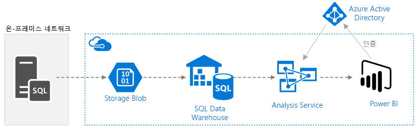
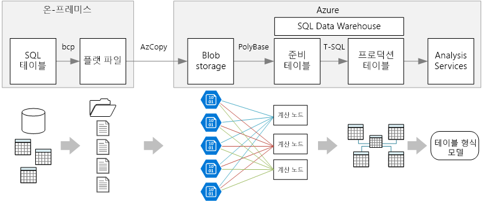
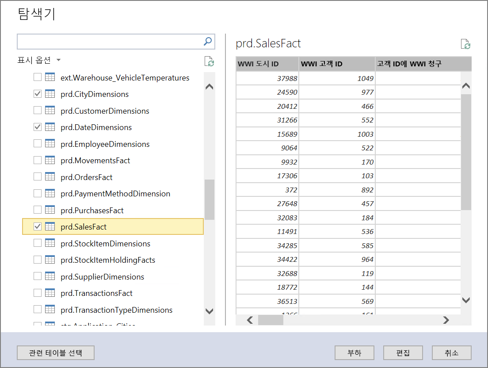
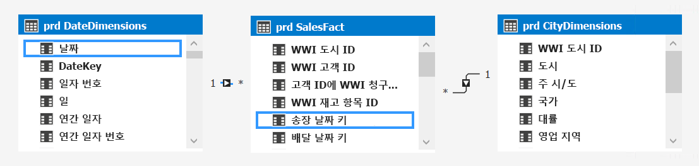
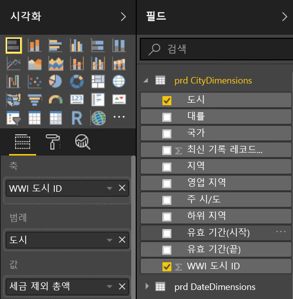
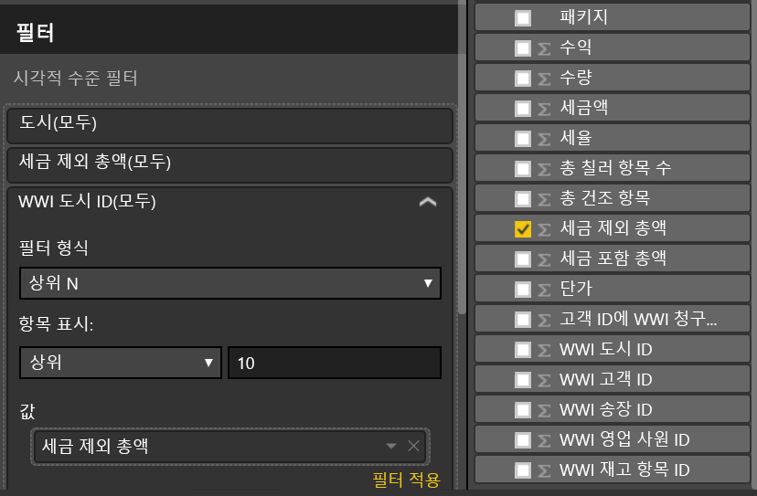
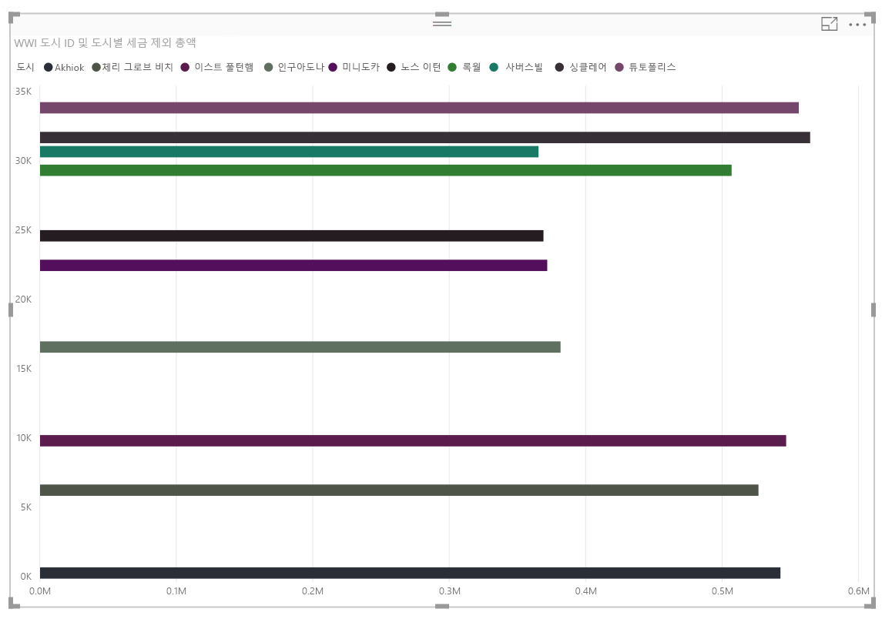

# <a name="enterprise-bi-with-sql-data-warehouse"></a><span data-ttu-id="e1ea7-103">SQL Data Warehouse를 사용하는 Enterprise BI</span><span class="sxs-lookup"><span data-stu-id="e1ea7-103">Enterprise BI with SQL Data Warehouse</span></span>
 
<span data-ttu-id="e1ea7-104">이 참조 아키텍처는 온-프레미스 SQL Server 데이터베이스에서 SQL Data Warehouse로 데이터를 이동하고 분석을 위해 데이터를 변경하는 [ELT](../../data-guide/relational-data/etl.md#extract-load-and-transform-elt)(추출 부하 변형) 파이프라인을 구현합니다.</span><span class="sxs-lookup"><span data-stu-id="e1ea7-104">This reference architecture implements an [ELT](../../data-guide/relational-data/etl.md#extract-load-and-transform-elt) (extract-load-transform) pipeline that moves data from an on-premises SQL Server database into SQL Data Warehouse and transforms the data for analysis.</span></span> [<span data-ttu-id="e1ea7-105">**이 솔루션을 배포합니다**.</span><span class="sxs-lookup"><span data-stu-id="e1ea7-105">**Deploy this solution**.</span></span>](#deploy-the-solution)



<span data-ttu-id="e1ea7-106">**시나리오**: 조직에는 SQL Server 데이터베이스 온-프레미스에 저장된 대규모 OLTP 데이터 집합이 있습니다.</span><span class="sxs-lookup"><span data-stu-id="e1ea7-106">**Scenario**: An organization has a large OLTP data set stored in a SQL Server database on premises.</span></span> <span data-ttu-id="e1ea7-107">조직은 Power BI를 사용하여 분석을 수행하기 위해 SQL Data Warehouse를 사용하려고 합니다.</span><span class="sxs-lookup"><span data-stu-id="e1ea7-107">The organization wants to use SQL Data Warehouse to perform analysis using Power BI.</span></span> 

<span data-ttu-id="e1ea7-108">이 참조 아키텍처는 일회성 또는 주문형 작업을 위해 설계되었습니다.</span><span class="sxs-lookup"><span data-stu-id="e1ea7-108">This reference architecture is designed for one-time or on-demand jobs.</span></span> <span data-ttu-id="e1ea7-109">지속적으로(매시간 또는 매일) 데이터를 이동해야 하는 경우 Azure Data Factory를 사용하여 자동화된 워크플로를 정의하는 것이 좋습니다.</span><span class="sxs-lookup"><span data-stu-id="e1ea7-109">If you need to move data on a continuing basis (hourly or daily), we recommend using Azure Data Factory to define an automated workflow.</span></span>

## <a name="architecture"></a><span data-ttu-id="e1ea7-110">아키텍처</span><span class="sxs-lookup"><span data-stu-id="e1ea7-110">Architecture</span></span>

<span data-ttu-id="e1ea7-111">이 아키텍처는 다음 구성 요소로 구성됩니다.</span><span class="sxs-lookup"><span data-stu-id="e1ea7-111">The architecture consists of the following components.</span></span>

<span data-ttu-id="e1ea7-112">**SQL Server**.</span><span class="sxs-lookup"><span data-stu-id="e1ea7-112">**SQL Server**.</span></span> <span data-ttu-id="e1ea7-113">원본 데이터는 SQL Server 데이터베이스 온-프레미스에 위치합니다.</span><span class="sxs-lookup"><span data-stu-id="e1ea7-113">The source data is located in a SQL Server database on premises.</span></span> <span data-ttu-id="e1ea7-114">온-프레미스 환경을 시뮬레이션하기 위해 이 아키텍처에 대한 배포 스크립트는 설치된 SQL Server를 사용하여 Azure에서 가상 머신을 프로비전합니다.</span><span class="sxs-lookup"><span data-stu-id="e1ea7-114">To simulate the on-premises environment, the deployment scripts for this architecture provision a virtual machine in Azure with SQL Server installed.</span></span> 

<span data-ttu-id="e1ea7-115">**Blob Storage**</span><span class="sxs-lookup"><span data-stu-id="e1ea7-115">**Blob Storage**.</span></span> <span data-ttu-id="e1ea7-116">Blob 저장소는 SQL Data Warehouse로 로딩하기 전에 데이터를 복사하는 준비 영역으로 사용됩니다.</span><span class="sxs-lookup"><span data-stu-id="e1ea7-116">Blob storage is used as a staging area to copy the data before loading it into SQL Data Warehouse.</span></span>

<span data-ttu-id="e1ea7-117">**Azure SQL Data Warehouse**</span><span class="sxs-lookup"><span data-stu-id="e1ea7-117">**Azure SQL Data Warehouse**.</span></span> <span data-ttu-id="e1ea7-118">[SQL Data Warehouse](/azure/sql-data-warehouse/)는 대규모 데이터 분석을 수행하도록 설계되고 배포된 시스템입니다.</span><span class="sxs-lookup"><span data-stu-id="e1ea7-118">[SQL Data Warehouse](/azure/sql-data-warehouse/) is a distributed system designed to perform analytics on large data.</span></span> <span data-ttu-id="e1ea7-119">고성능 분석을 실행하는 데 적합하도록 하는 MPP(대규모 병렬 처리)를 지원합니다.</span><span class="sxs-lookup"><span data-stu-id="e1ea7-119">It supports massive parallel processing (MPP), which makes it suitable for running high-performance analytics.</span></span> 

<span data-ttu-id="e1ea7-120">**Azure Analysis Services**.</span><span class="sxs-lookup"><span data-stu-id="e1ea7-120">**Azure Analysis Services**.</span></span> <span data-ttu-id="e1ea7-121">[Analysis Services](/azure/analysis-services/)는 데이터 모델링 기능을 제공하는 완전히 관리되는 서비스입니다.</span><span class="sxs-lookup"><span data-stu-id="e1ea7-121">[Analysis Services](/azure/analysis-services/) is a fully managed service that provides data modeling capabilities.</span></span> <span data-ttu-id="e1ea7-122">Analysis Services를 사용하여 사용자가 쿼리할 수 있는 의미 체계 모델을 만듭니다.</span><span class="sxs-lookup"><span data-stu-id="e1ea7-122">Use Analysis Services to create a semantic model that users can query.</span></span> <span data-ttu-id="e1ea7-123">Analysis Services는 BI 대시보드 시나리오에서 특히 유용합니다.</span><span class="sxs-lookup"><span data-stu-id="e1ea7-123">Analysis Services is especially useful in a BI dashboard scenario.</span></span> <span data-ttu-id="e1ea7-124">이 아키텍처에서 Analysis Services는 의미 체계 모델을 처리하도록 데이터 웨어하우스에서 데이터를 읽고, 대시보드 쿼리를 효율적으로 처리합니다.</span><span class="sxs-lookup"><span data-stu-id="e1ea7-124">In this architecture, Analysis Services reads data from the data warehouse to process the semantic model, and efficiently serves dashboard queries.</span></span> <span data-ttu-id="e1ea7-125">또한 신속한 쿼리 처리에 대한 복제본을 확장하여 탄력적 동시성을 지원합니다.</span><span class="sxs-lookup"><span data-stu-id="e1ea7-125">It also supports elastic concurrency, by scaling out replicas for faster query processing.</span></span>

<span data-ttu-id="e1ea7-126">현재 Azure Analysis Services는 테이블 형식 모델을 지원하지만 다차원 모델을 지원하지는 않습니다.</span><span class="sxs-lookup"><span data-stu-id="e1ea7-126">Currently, Azure Analysis Services supports tabular models but not multidimensional models.</span></span> <span data-ttu-id="e1ea7-127">테이블 형식 모델은 관계형 모델링 구문(테이블 및 열)을 사용하는 반면 다차원 모델은 OLAP 모델링 구문(큐브, 차원 및 측정값)을 사용합니다.</span><span class="sxs-lookup"><span data-stu-id="e1ea7-127">Tabular models use relational modeling constructs (tables and columns), whereas multidimensional models use OLAP modeling constructs (cubes, dimensions, and measures).</span></span> <span data-ttu-id="e1ea7-128">다차원 모델이 필요한 경우 SSAS(SQL Server Analysis Services)를 사용합니다.</span><span class="sxs-lookup"><span data-stu-id="e1ea7-128">If you require multidimensional models, use SQL Server Analysis Services (SSAS).</span></span> <span data-ttu-id="e1ea7-129">자세한 내용은 [테이블 형식 및 다차원 솔루션 비교](/sql/analysis-services/comparing-tabular-and-multidimensional-solutions-ssas)를 참조하세요.</span><span class="sxs-lookup"><span data-stu-id="e1ea7-129">For more information, see [Comparing tabular and multidimensional solutions](/sql/analysis-services/comparing-tabular-and-multidimensional-solutions-ssas).</span></span>

<span data-ttu-id="e1ea7-130">**Power BI**.</span><span class="sxs-lookup"><span data-stu-id="e1ea7-130">**Power BI**.</span></span> <span data-ttu-id="e1ea7-131">Power BI는 비즈니스 정보에 대한 데이터를 분석하는 비즈니스 분석 도구 제품군입니다.</span><span class="sxs-lookup"><span data-stu-id="e1ea7-131">Power BI is a suite of business analytics tools to analyze data for business insights.</span></span> <span data-ttu-id="e1ea7-132">이 아키텍처에서 Analysis Services에 저장된 의미 체계 모델을 쿼리합니다.</span><span class="sxs-lookup"><span data-stu-id="e1ea7-132">In this architecture, it queries the semantic model stored in Analysis Services.</span></span>

<span data-ttu-id="e1ea7-133">**Azure Active Directory**(Azure AD)는 Power BI를 통해 Analysis Services 서버에 연결하는 사용자를 인증합니다.</span><span class="sxs-lookup"><span data-stu-id="e1ea7-133">**Azure Active Directory** (Azure AD) authenticates users who connect to the Analysis Services server through Power BI.</span></span>

## <a name="data-pipeline"></a><span data-ttu-id="e1ea7-134">데이터 파이프라인</span><span class="sxs-lookup"><span data-stu-id="e1ea7-134">Data Pipeline</span></span>
 
<span data-ttu-id="e1ea7-135">이 참조 아키텍처는 데이터 원본으로 [WorldWideImporters](/sql/sample/world-wide-importers/wide-world-importers-oltp-database) 샘플 데이터베이스를 사용합니다.</span><span class="sxs-lookup"><span data-stu-id="e1ea7-135">This reference architecture uses the [WorldWideImporters](/sql/sample/world-wide-importers/wide-world-importers-oltp-database) sample database as data source.</span></span> <span data-ttu-id="e1ea7-136">데이터 파이프라인에는 다음 단계가 있습니다.</span><span class="sxs-lookup"><span data-stu-id="e1ea7-136">The data pipeline has the following stages:</span></span>

1. <span data-ttu-id="e1ea7-137">SQL Server에서 플랫 파일로 데이터를 내보냅니다(bcp 유틸리티).</span><span class="sxs-lookup"><span data-stu-id="e1ea7-137">Export the data from SQL Server to flat files (bcp utility).</span></span>
2. <span data-ttu-id="e1ea7-138">Azure Blob Storage로 플랫 파일을 복사합니다(AzCopy).</span><span class="sxs-lookup"><span data-stu-id="e1ea7-138">Copy the flat files to Azure Blob Storage (AzCopy).</span></span>
3. <span data-ttu-id="e1ea7-139">SQL Data Warehouse로 데이터를 로드합니다(PolyBase).</span><span class="sxs-lookup"><span data-stu-id="e1ea7-139">Load the data into SQL Data Warehouse (PolyBase).</span></span>
4. <span data-ttu-id="e1ea7-140">데이터를 별모양 스키마로 변환합니다(T-SQL).</span><span class="sxs-lookup"><span data-stu-id="e1ea7-140">Transform the data into a star schema (T-SQL).</span></span>
5. <span data-ttu-id="e1ea7-141">의미 체계 모델을 Analysis Services로 로드합니다(SQL Server Data Tools).</span><span class="sxs-lookup"><span data-stu-id="e1ea7-141">Load a semantic model into Analysis Services (SQL Server Data Tools).</span></span>


 
> [!NOTE]
> <span data-ttu-id="e1ea7-142">1&ndash;3단계의 경우 Redgate Data Platform Studio를 사용하는 것이 좋습니다.</span><span class="sxs-lookup"><span data-stu-id="e1ea7-142">For steps 1 &ndash; 3, consider using Redgate Data Platform Studio.</span></span> <span data-ttu-id="e1ea7-143">Data Platform Studio는 가장 적합한 호환성 수정 및 최적화를 적용하므로 SQL Data Warehouse를 시작하는 가장 빠른 방법입니다.</span><span class="sxs-lookup"><span data-stu-id="e1ea7-143">Data Platform Studio applies the most appropriate compatibility fixes and optimizations, so it's the quickest way to get started with SQL Data Warehouse.</span></span> <span data-ttu-id="e1ea7-144">자세한 내용은 [Redgate Data Platform Studio를 사용하여 데이터 로드](/azure/sql-data-warehouse/sql-data-warehouse-load-with-redgate)를 참조하세요.</span><span class="sxs-lookup"><span data-stu-id="e1ea7-144">For more information, see [Load data with Redgate Data Platform Studio](/azure/sql-data-warehouse/sql-data-warehouse-load-with-redgate).</span></span> 

<span data-ttu-id="e1ea7-145">다음 섹션에서는 이러한 단계를 자세히 설명합니다.</span><span class="sxs-lookup"><span data-stu-id="e1ea7-145">The next sections describe these stages in more detail.</span></span>

### <a name="export-data-from-sql-server"></a><span data-ttu-id="e1ea7-146">SQL Server에서 데이터 내보내기</span><span class="sxs-lookup"><span data-stu-id="e1ea7-146">Export data from SQL Server</span></span>

<span data-ttu-id="e1ea7-147">[bcp](/sql/tools/bcp-utility)(대량 복사 프로그램) 유틸리티는 SQL 테이블에서 플랫 텍스트 파일을 만드는 신속한 방법입니다.</span><span class="sxs-lookup"><span data-stu-id="e1ea7-147">The [bcp](/sql/tools/bcp-utility) (bulk copy program) utility is a fast way to create flat text files from SQL tables.</span></span> <span data-ttu-id="e1ea7-148">이 단계에서는 내보내려는 열을 선택하지만 데이터를 변환하지 않습니다.</span><span class="sxs-lookup"><span data-stu-id="e1ea7-148">In this step, you select the columns that you want to export, but don't transform the data.</span></span> <span data-ttu-id="e1ea7-149">모든 데이터 변환은 SQL Data Warehouse에서 수행되어야 합니다.</span><span class="sxs-lookup"><span data-stu-id="e1ea7-149">Any data transformations should happen in SQL Data Warehouse.</span></span>

<span data-ttu-id="e1ea7-150">**권장 사항**</span><span class="sxs-lookup"><span data-stu-id="e1ea7-150">**Recommendations**</span></span>

<span data-ttu-id="e1ea7-151">가능하면 프로덕션 환경에서 리소스 경합을 최소화하기 위해 사용량이 적은 시간에 데이터 추출을 예약합니다.</span><span class="sxs-lookup"><span data-stu-id="e1ea7-151">If possible, schedule data extraction during off-peak hours, to minimize resource contention in the production environment.</span></span> 

<span data-ttu-id="e1ea7-152">데이터베이스 서버에서 bcp를 실행하지 않습니다.</span><span class="sxs-lookup"><span data-stu-id="e1ea7-152">Avoid running bcp on the database server.</span></span> <span data-ttu-id="e1ea7-153">대신 다른 컴퓨터에서 실행합니다.</span><span class="sxs-lookup"><span data-stu-id="e1ea7-153">Instead, run it from another machine.</span></span> <span data-ttu-id="e1ea7-154">로컬 드라이브에 파일을 씁니다.</span><span class="sxs-lookup"><span data-stu-id="e1ea7-154">Write the files to a local drive.</span></span> <span data-ttu-id="e1ea7-155">동시 쓰기를 처리하기에 충분한 I/O 리소스가 있는지 확인합니다.</span><span class="sxs-lookup"><span data-stu-id="e1ea7-155">Ensure that you have sufficient I/O resources to handle the concurrent writes.</span></span> <span data-ttu-id="e1ea7-156">최상의 성능을 위해서 전용 고속 저장소 드라이브에 파일을 내보냅니다.</span><span class="sxs-lookup"><span data-stu-id="e1ea7-156">For best performance, export the files to dedicated fast storage drives.</span></span>

<span data-ttu-id="e1ea7-157">Gzip 압축된 형식으로 내보낸 데이터를 저장하여 네트워크 전송 속도를 높일 수 있습니다.</span><span class="sxs-lookup"><span data-stu-id="e1ea7-157">You can speed up the network transfer by saving the exported data in Gzip compressed format.</span></span> <span data-ttu-id="e1ea7-158">그러나 압축된 파일을 웨어하우스로 로드하는 것은 압축되지 않은 파일을 로드하는 것보다 느리므로 더 빠른 네트워크 전송과 더 빠른 로딩 간에 균형 유지가 있습니다.</span><span class="sxs-lookup"><span data-stu-id="e1ea7-158">However, loading compressed files into the warehouse is slower than loading uncompressed files, so there is a tradeoff between faster network transfer versus faster loading.</span></span> <span data-ttu-id="e1ea7-159">Gzip 압축을 사용하려는 경우 단일 Gzip 파일을 만들지 마십시오.</span><span class="sxs-lookup"><span data-stu-id="e1ea7-159">If you decide to use Gzip compression, don't create a single Gzip file.</span></span> <span data-ttu-id="e1ea7-160">대신 여러 개의 압축된 파일로 데이터를 분할합니다.</span><span class="sxs-lookup"><span data-stu-id="e1ea7-160">Instead, split the data into multiple compressed files.</span></span>

### <a name="copy-flat-files-into-blob-storage"></a><span data-ttu-id="e1ea7-161">플랫 파일을 Blob 저장소에 복사</span><span class="sxs-lookup"><span data-stu-id="e1ea7-161">Copy flat files into blob storage</span></span>

<span data-ttu-id="e1ea7-162">[AzCopy](/azure/storage/common/storage-use-azcopy) 유틸리티는 Azure Blob 저장소로 데이터의 고성능 복사를 위해 설계되었습니다.</span><span class="sxs-lookup"><span data-stu-id="e1ea7-162">The [AzCopy](/azure/storage/common/storage-use-azcopy) utility is designed for high-performance copying of data into Azure blob storage.</span></span>

<span data-ttu-id="e1ea7-163">**권장 사항**</span><span class="sxs-lookup"><span data-stu-id="e1ea7-163">**Recommendations**</span></span>

<span data-ttu-id="e1ea7-164">원본 데이터의 위치 근처 지역에서 저장소 계정을 만듭니다.</span><span class="sxs-lookup"><span data-stu-id="e1ea7-164">Create the storage account in a region near the location of the source data.</span></span> <span data-ttu-id="e1ea7-165">동일한 지역에 저장소 계정 및 SQL Data Warehouse 인스턴스를 배포합니다.</span><span class="sxs-lookup"><span data-stu-id="e1ea7-165">Deploy the storage account and the SQL Data Warehouse instance in the same region.</span></span> 

<span data-ttu-id="e1ea7-166">CPU 및 I/O 사용은 프로덕션 작업에 영향을 줄 수 있으므로 프로덕션 작업을 실행하는 동일한 컴퓨터에서 AzCopy를 실행하지 마십시오.</span><span class="sxs-lookup"><span data-stu-id="e1ea7-166">Don't run AzCopy on the same machine that runs your production workloads, because the CPU and I/O consumption can interfere with the production workload.</span></span> 

<span data-ttu-id="e1ea7-167">업로드 속도를 확인하려면 먼저 업로드를 테스트합니다.</span><span class="sxs-lookup"><span data-stu-id="e1ea7-167">Test the upload first to see what the upload speed is like.</span></span> <span data-ttu-id="e1ea7-168">AzCopy에서 /NC 옵션을 사용하여 동시 복사 작업의 수를 지정할 수 있습니다.</span><span class="sxs-lookup"><span data-stu-id="e1ea7-168">You can use the /NC option in AzCopy to specify the number of concurrent copy operations.</span></span> <span data-ttu-id="e1ea7-169">기본 값으로 시작한 다음, 이 설정으로 실험하여 성능을 조정합니다.</span><span class="sxs-lookup"><span data-stu-id="e1ea7-169">Start with the default value, then experiment with this setting to tune the performance.</span></span> <span data-ttu-id="e1ea7-170">저대역폭 환경에서는 많은 수의 동시 작업으로 네트워크 연결에 과부하가 걸려 작업이 성공적으로 실행되지 못할 수 있습니다.</span><span class="sxs-lookup"><span data-stu-id="e1ea7-170">In a low-bandwidth environment, too many concurrent operations can overwhelm the network connection and prevent the operations from completing successfully.</span></span>  

<span data-ttu-id="e1ea7-171">AzCopy는 공용 인터넷을 통해 저장소로 데이터를 이동합니다.</span><span class="sxs-lookup"><span data-stu-id="e1ea7-171">AzCopy moves data to storage over the public internet.</span></span> <span data-ttu-id="e1ea7-172">충분히 빠르지 않은 경우 [ExpressRoute](/azure/expressroute/) 회로 설정을 고려합니다.</span><span class="sxs-lookup"><span data-stu-id="e1ea7-172">If this isn't fast enough, consider setting up an [ExpressRoute](/azure/expressroute/) circuit.</span></span> <span data-ttu-id="e1ea7-173">ExpressRoute는 Azure에 대한 전용 비공개 연결을 통해 데이터를 라우팅하는 서비스입니다.</span><span class="sxs-lookup"><span data-stu-id="e1ea7-173">ExpressRoute is a service that routes your data through a dedicated private connection to Azure.</span></span> <span data-ttu-id="e1ea7-174">네트워크 연결 속도가 너무 느린 경우 다른 옵션은 디스크의 데이터를 Azure 데이터 센터로 물리적으로 배달하는 것입니다.</span><span class="sxs-lookup"><span data-stu-id="e1ea7-174">Another option, if your network connection is too slow, is to physically ship the data on disk to an Azure datacenter.</span></span> <span data-ttu-id="e1ea7-175">자세한 내용은 [Azure 간 데이터 전송](/azure/architecture/data-guide/scenarios/data-transfer)을 참조하세요.</span><span class="sxs-lookup"><span data-stu-id="e1ea7-175">For more information, see [Transferring data to and from Azure](/azure/architecture/data-guide/scenarios/data-transfer).</span></span>

<span data-ttu-id="e1ea7-176">복사 작업 중 AzCopy는 임시 저널 파일을 만듭니다. 이를 통해 중단되는 경우(예: 네트워크 오류로 인해) AzCopy에서 작업을 다시 시작할 수 있습니다.</span><span class="sxs-lookup"><span data-stu-id="e1ea7-176">During a copy operation, AzCopy creates a temporary journal file, which enables AzCopy to restart the operation if it gets interrupted (for example, due to a network error).</span></span> <span data-ttu-id="e1ea7-177">저널 파일을 저장할 디스크 공간이 충분한지 확인합니다.</span><span class="sxs-lookup"><span data-stu-id="e1ea7-177">Make sure there is enough disk space to store the journal files.</span></span> <span data-ttu-id="e1ea7-178">/Z 옵션을 사용하여 저널 파일이 기록되는 위치를 지정할 수 있습니다.</span><span class="sxs-lookup"><span data-stu-id="e1ea7-178">You can use the /Z option to specify where the journal files are written.</span></span>

### <a name="load-data-into-sql-data-warehouse"></a><span data-ttu-id="e1ea7-179">SQL Data Warehouse로 데이터 로드</span><span class="sxs-lookup"><span data-stu-id="e1ea7-179">Load data into SQL Data Warehouse</span></span>

<span data-ttu-id="e1ea7-180">[PolyBase](/sql/relational-databases/polybase/polybase-guide)를 사용하여 Blob 저장소에서 데이터 웨어하우스로 파일을 로드합니다.</span><span class="sxs-lookup"><span data-stu-id="e1ea7-180">Use [PolyBase](/sql/relational-databases/polybase/polybase-guide) to load the files from blob storage into the data warehouse.</span></span> <span data-ttu-id="e1ea7-181">PolyBase는 SQL Data Warehouse의 MPP(대규모 병렬 처리) 아키텍처를 활용하도록 디자인되었으며 가장 빠르게 SQL Data Warehouse로 데이터를 로드할 수 있게 합니다.</span><span class="sxs-lookup"><span data-stu-id="e1ea7-181">PolyBase is designed to leverage the MPP (Massively Parallel Processing) architecture of SQL Data Warehouse, which makes it the fastest way to load data into SQL Data Warehouse.</span></span> 

<span data-ttu-id="e1ea7-182">데이터 로드는 두 단계 프로세스로 이루어집니다.</span><span class="sxs-lookup"><span data-stu-id="e1ea7-182">Loading the data is a two-step process:</span></span>

1. <span data-ttu-id="e1ea7-183">데이터에 대한 외부 테이블 집합을 만듭니다.</span><span class="sxs-lookup"><span data-stu-id="e1ea7-183">Create a set of external tables for the data.</span></span> <span data-ttu-id="e1ea7-184">외부 테이블은 웨어하우스의 외부에 저장된 데이터를 가리키는 테이블 정의이며 &mdash; 이 경우 Blob 저장소의 플랫 파일입니다.</span><span class="sxs-lookup"><span data-stu-id="e1ea7-184">An external table is a table definition that points to data stored outside of the warehouse &mdash; in this case, the flat files in blob storage.</span></span> <span data-ttu-id="e1ea7-185">이 단계는 데이터를 웨어하우스로 이동하지 않습니다.</span><span class="sxs-lookup"><span data-stu-id="e1ea7-185">This step does not move any data into the warehouse.</span></span>
2. <span data-ttu-id="e1ea7-186">준비 테이블을 만들고, 준비 테이블로 데이터를 로드합니다.</span><span class="sxs-lookup"><span data-stu-id="e1ea7-186">Create staging tables, and load the data into the staging tables.</span></span> <span data-ttu-id="e1ea7-187">이 단계는 데이터를 웨어하우스로 복사합니다.</span><span class="sxs-lookup"><span data-stu-id="e1ea7-187">This step copies the data into the warehouse.</span></span>

<span data-ttu-id="e1ea7-188">**권장 사항**</span><span class="sxs-lookup"><span data-stu-id="e1ea7-188">**Recommendations**</span></span>

<span data-ttu-id="e1ea7-189">많은 양의 데이터(1TB 이상)가 있고 병렬 처리를 활용하는 분석 워크 로드를 실행하는 경우 SQL Data Warehouse를 고려합니다.</span><span class="sxs-lookup"><span data-stu-id="e1ea7-189">Consider SQL Data Warehouse when you have large amounts of data (more than 1 TB) and are running an analytics workload that will benefit from parallelism.</span></span> <span data-ttu-id="e1ea7-190">SQL Data Warehouse는 OLTP 워크로드 또는 소량의 데이터 집합(< 250GB)에 잘 맞지 않습니다.</span><span class="sxs-lookup"><span data-stu-id="e1ea7-190">SQL Data Warehouse is not a good fit for OLTP workloads or smaller data sets (< 250GB).</span></span> <span data-ttu-id="e1ea7-191">250GB보다 작은 데이터 집합의 경우 Azure SQL Database 또는 SQL Server를 고려합니다.</span><span class="sxs-lookup"><span data-stu-id="e1ea7-191">For data sets less than 250GB, consider Azure SQL Database or SQL Server.</span></span> <span data-ttu-id="e1ea7-192">자세한 내용은 [데이터 웨어하우징](../../data-guide/relational-data/data-warehousing.md)을 참조하세요.</span><span class="sxs-lookup"><span data-stu-id="e1ea7-192">For more information, see [Data warehousing](../../data-guide/relational-data/data-warehousing.md).</span></span>

<span data-ttu-id="e1ea7-193">힙 테이블로 인덱싱되지 않은 준비 테이블을 만듭니다.</span><span class="sxs-lookup"><span data-stu-id="e1ea7-193">Create the staging tables as heap tables, which are not indexed.</span></span> <span data-ttu-id="e1ea7-194">프로덕션 테이블을 만드는 쿼리는 전체 테이블 검색이 발생하므로 준비 테이블을 인덱싱할 이유가 없습니다.</span><span class="sxs-lookup"><span data-stu-id="e1ea7-194">The queries that create the production tables will result in a full table scan, so there is no reason to index the staging tables.</span></span>

<span data-ttu-id="e1ea7-195">PolyBase는 웨어하우스에서 자동으로 병렬 처리를 활용합니다.</span><span class="sxs-lookup"><span data-stu-id="e1ea7-195">PolyBase automatically takes advantage of parallelism in the warehouse.</span></span> <span data-ttu-id="e1ea7-196">로드 성능은 DWU를 늘리면 확장합니다.</span><span class="sxs-lookup"><span data-stu-id="e1ea7-196">The load performance scales as you increase DWUs.</span></span> <span data-ttu-id="e1ea7-197">최상의 성능을 위해 단일 로드 작업을 사용합니다.</span><span class="sxs-lookup"><span data-stu-id="e1ea7-197">For best performance, use a single load operation.</span></span> <span data-ttu-id="e1ea7-198">입력 데이터를 청크로 분리하고 여러 동시 로드를 실행하는 성능 이점이 없습니다.</span><span class="sxs-lookup"><span data-stu-id="e1ea7-198">There is no performance benefit to breaking the input data into chunks and running multiple concurrent loads.</span></span>

<span data-ttu-id="e1ea7-199">PolyBase는 Gzip 압축된 파일을 읽을 수 있습니다.</span><span class="sxs-lookup"><span data-stu-id="e1ea7-199">PolyBase can read Gzip compressed files.</span></span> <span data-ttu-id="e1ea7-200">그러나 파일 압축 풀기는 단일 스레드 작업이므로 압축된 파일당 단일 판독기만 사용됩니다.</span><span class="sxs-lookup"><span data-stu-id="e1ea7-200">However, only a single reader is used per compressed file, because uncompressing the file is a single-threaded operation.</span></span> <span data-ttu-id="e1ea7-201">따라서 대량의 단일 압축된 파일을 로드하지 않도록 합니다.</span><span class="sxs-lookup"><span data-stu-id="e1ea7-201">Therefore, avoid loading a single large compressed file.</span></span> <span data-ttu-id="e1ea7-202">대신 병렬 처리를 활용하기 위해 여러 개의 압축된 파일로 데이터를 분할합니다.</span><span class="sxs-lookup"><span data-stu-id="e1ea7-202">Instead, split the data into multiple compressed files, in order to take advantage of parallelism.</span></span> 

<span data-ttu-id="e1ea7-203">다음과 같은 제한 사항을 고려해야 합니다.</span><span class="sxs-lookup"><span data-stu-id="e1ea7-203">Be aware of the following limitations:</span></span>

- <span data-ttu-id="e1ea7-204">PolyBase는 `varchar(8000)`, `nvarchar(4000)` 또는 `varbinary(8000)`의 최대 열 크기를 지원합니다.</span><span class="sxs-lookup"><span data-stu-id="e1ea7-204">PolyBase supports a maximum column size of `varchar(8000)`, `nvarchar(4000)`, or `varbinary(8000)`.</span></span> <span data-ttu-id="e1ea7-205">이러한 한도를 초과하는 데이터가 있는 경우 한 가지 옵션은 내보낼 때 데이터를 청크로 분리한 다음, 가져온 후 청크를 다시 어셈블하는 것입니다.</span><span class="sxs-lookup"><span data-stu-id="e1ea7-205">If you have data that exceeds these limits, one option is to break the data up into chunks when you export it, and then reassemble the chunks after import.</span></span> 

- <span data-ttu-id="e1ea7-206">PolyBase는 \n 또는 새 줄의 고정된 행 종결자를 사용합니다.</span><span class="sxs-lookup"><span data-stu-id="e1ea7-206">PolyBase uses a fixed row terminator of \n or newline.</span></span> <span data-ttu-id="e1ea7-207">새 줄 문자가 원본 데이터에 표시되는 경우 문제가 발생할 수 있습니다.</span><span class="sxs-lookup"><span data-stu-id="e1ea7-207">This can cause problems if newline characters appear in the source data.</span></span>

- <span data-ttu-id="e1ea7-208">원본 데이터 스키마는 SQL Data Warehouse에서 지원되지 않는 데이터 형식을 포함할 수 있습니다.</span><span class="sxs-lookup"><span data-stu-id="e1ea7-208">Your source data schema might contain data types that are not supported in SQL Data Warehouse.</span></span>

<span data-ttu-id="e1ea7-209">이러한 제한 사항을 해결하기 위해 필요한 전환을 수행하는 저장 프로시저를 만들 수 있습니다.</span><span class="sxs-lookup"><span data-stu-id="e1ea7-209">To work around these limitations, you can create a stored procedure that performs the necessary conversions.</span></span> <span data-ttu-id="e1ea7-210">bcp를 실행할 때 이 저장 프로시저를 참조합니다.</span><span class="sxs-lookup"><span data-stu-id="e1ea7-210">Reference this stored procedure when you run bcp.</span></span> <span data-ttu-id="e1ea7-211">또는 [Redgate Data Platform Studio](/azure/sql-data-warehouse/sql-data-warehouse-load-with-redgate)에서 SQL Data Warehouse에서 지원되지 않는 데이터 형식을 자동으로 변환합니다.</span><span class="sxs-lookup"><span data-stu-id="e1ea7-211">Alternatively, [Redgate Data Platform Studio](/azure/sql-data-warehouse/sql-data-warehouse-load-with-redgate) automatically converts data types that aren’t supported in SQL Data Warehouse.</span></span>

<span data-ttu-id="e1ea7-212">자세한 내용은 다음 문서를 참조하세요.</span><span class="sxs-lookup"><span data-stu-id="e1ea7-212">For more information, see the following articles:</span></span>

- <span data-ttu-id="e1ea7-213">[Azure SQL Data Warehouse에 데이터를 로드하는 모범 사례](/azure/sql-data-warehouse/guidance-for-loading-data)</span><span class="sxs-lookup"><span data-stu-id="e1ea7-213">[Best practices for loading data into Azure SQL Data Warehouse](/azure/sql-data-warehouse/guidance-for-loading-data).</span></span>
- [<span data-ttu-id="e1ea7-214">SQL Data Warehouse로 스키마 마이그레이션</span><span class="sxs-lookup"><span data-stu-id="e1ea7-214">Migrate your schemas to SQL Data Warehouse</span></span>](/azure/sql-data-warehouse/sql-data-warehouse-migrate-schema)
- [<span data-ttu-id="e1ea7-215">SQL Data Warehouse의 테이블에 대한 데이터 형식을 정의하기 위한 지침</span><span class="sxs-lookup"><span data-stu-id="e1ea7-215">Guidance for defining data types for tables in SQL Data Warehouse</span></span>](/azure/sql-data-warehouse/sql-data-warehouse-tables-data-types)

### <a name="transform-the-data"></a><span data-ttu-id="e1ea7-216">데이터 변환</span><span class="sxs-lookup"><span data-stu-id="e1ea7-216">Transform the data</span></span>

<span data-ttu-id="e1ea7-217">데이터를 변환하고 프로덕션 테이블로 이동합니다.</span><span class="sxs-lookup"><span data-stu-id="e1ea7-217">Transform the data and move it into production tables.</span></span> <span data-ttu-id="e1ea7-218">이 단계에서 데이터는 의미 체계 모델링에 적합한 차원 테이블 및 팩트 테이블을 사용하여 별모양 스키마로 변환됩니다.</span><span class="sxs-lookup"><span data-stu-id="e1ea7-218">In this step, the data is transformed into a star schema with dimension tables and fact tables, suitable for semantic modeling.</span></span>

<span data-ttu-id="e1ea7-219">전반적으로 최적의 쿼리 성능을 제공하는 클러스터형 columnstore 인덱스가 포함된 프로덕션 테이블을 만듭니다.</span><span class="sxs-lookup"><span data-stu-id="e1ea7-219">Create the production tables with clustered columnstore indexes, which offer the best overall query performance.</span></span> <span data-ttu-id="e1ea7-220">Columnstore 인덱스는 많은 레코드를 검색하는 쿼리에 최적화됩니다.</span><span class="sxs-lookup"><span data-stu-id="e1ea7-220">Columnstore indexes are optimized for queries that scan many records.</span></span> <span data-ttu-id="e1ea7-221">Columnstore 인덱스는 싱글톤 조회(즉, 단일 행 조회)도 수행하지 않습니다.</span><span class="sxs-lookup"><span data-stu-id="e1ea7-221">Columnstore indexes don't perform as well for singleton lookups (that is, looking up a single row).</span></span> <span data-ttu-id="e1ea7-222">자주 싱글톤 조회를 수행해야 하는 경우 테이블에 비클러스터형 인덱스를 추가할 수 있습니다.</span><span class="sxs-lookup"><span data-stu-id="e1ea7-222">If you need to perform frequent singleton lookups, you can add a non-clustered index to a table.</span></span> <span data-ttu-id="e1ea7-223">싱글톤 조회는 비클러스터형 인덱스를 사용하여 훨씬 더 빠르게 실행할 수 있습니다.</span><span class="sxs-lookup"><span data-stu-id="e1ea7-223">Singleton lookups can run significantly faster using a non-clustered index.</span></span> <span data-ttu-id="e1ea7-224">그러나 싱글톤 조회는 일반적으로 OLTP 작업보다 데이터 웨어하우스 시나리오에서 덜 일반적입니다.</span><span class="sxs-lookup"><span data-stu-id="e1ea7-224">However, singleton lookups are typically less common in data warehouse scenarios than OLTP workloads.</span></span> <span data-ttu-id="e1ea7-225">자세한 내용은 [SQL Data Warehouse의 테이블 인덱싱](/azure/sql-data-warehouse/sql-data-warehouse-tables-index)을 참조하세요.</span><span class="sxs-lookup"><span data-stu-id="e1ea7-225">For more information, see [Indexing tables in SQL Data Warehouse](/azure/sql-data-warehouse/sql-data-warehouse-tables-index).</span></span>

> [!NOTE]
> <span data-ttu-id="e1ea7-226">클러스터형 columnstore 테이블은 `varchar(max)`, `nvarchar(max)` 또는 `varbinary(max)` 데이터 형식을 지원하지 않습니다.</span><span class="sxs-lookup"><span data-stu-id="e1ea7-226">Clustered columnstore tables do not support `varchar(max)`, `nvarchar(max)`, or `varbinary(max)` data types.</span></span> <span data-ttu-id="e1ea7-227">이 경우 힙 또는 클러스터형 인덱스를 고려합니다.</span><span class="sxs-lookup"><span data-stu-id="e1ea7-227">In that case, consider a heap or clustered index.</span></span> <span data-ttu-id="e1ea7-228">별도 테이블에 해당 열을 넣을 수 있습니다.</span><span class="sxs-lookup"><span data-stu-id="e1ea7-228">You might put those columns into a separate table.</span></span>

<span data-ttu-id="e1ea7-229">샘플 데이터베이스는 매우 크지 않으므로 파티션이 없는 복제된 테이블을 만들었습니다.</span><span class="sxs-lookup"><span data-stu-id="e1ea7-229">Because the sample database is not very large, we created replicated tables with no partitions.</span></span> <span data-ttu-id="e1ea7-230">프로덕션 작업의 경우 분산 테이블을 사용하면 쿼리 성능을 개선할 수 있습니다.</span><span class="sxs-lookup"><span data-stu-id="e1ea7-230">For production workloads, using distributed tables is likely to improve query performance.</span></span> <span data-ttu-id="e1ea7-231">[Azure SQL Data Warehouse의 분산 테이블 디자인 지침](/azure/sql-data-warehouse/sql-data-warehouse-tables-distribute)을 참조하세요.</span><span class="sxs-lookup"><span data-stu-id="e1ea7-231">See [Guidance for designing distributed tables in Azure SQL Data Warehouse](/azure/sql-data-warehouse/sql-data-warehouse-tables-distribute).</span></span> <span data-ttu-id="e1ea7-232">예제 스크립트는 정적 [리소스 클래스](/azure/sql-data-warehouse/resource-classes-for-workload-management)를 사용하여 쿼리를 실행합니다.</span><span class="sxs-lookup"><span data-stu-id="e1ea7-232">Our example scripts run the queries using a static [resource class](/azure/sql-data-warehouse/resource-classes-for-workload-management).</span></span>

### <a name="load-the-semantic-model"></a><span data-ttu-id="e1ea7-233">의미 체계 모델 로드</span><span class="sxs-lookup"><span data-stu-id="e1ea7-233">Load the semantic model</span></span>

<span data-ttu-id="e1ea7-234">Azure Analysis Services에서 테이블 형식 모델로 데이터를 로드합니다.</span><span class="sxs-lookup"><span data-stu-id="e1ea7-234">Load the data into a tabular model in Azure Analysis Services.</span></span> <span data-ttu-id="e1ea7-235">이 단계에서는 SSDT(SQL Server Data Tools)를 사용하여 의미 체계 데이터 모델을 만듭니다.</span><span class="sxs-lookup"><span data-stu-id="e1ea7-235">In this step, you create a semantic data model by using SQL Server Data Tools (SSDT).</span></span> <span data-ttu-id="e1ea7-236">또한 Power BI Desktop 파일에서 가져와서 모델을 만들 수도 있습니다.</span><span class="sxs-lookup"><span data-stu-id="e1ea7-236">You can also create a model by importing it from a Power BI Desktop file.</span></span> <span data-ttu-id="e1ea7-237">SQL Data Warehouse는 외래 키를 지원하지 않으므로 테이블에서 조인할 수 있도록 관계를 의미 체계 모델에 추가해야 합니다.</span><span class="sxs-lookup"><span data-stu-id="e1ea7-237">Because SQL Data Warehouse does not support foreign keys, you must add the relationships to the semantic model, so that you can join across tables.</span></span>

### <a name="use-power-bi-to-visualize-the-data"></a><span data-ttu-id="e1ea7-238">Power BI를 사용하여 데이터 시각화</span><span class="sxs-lookup"><span data-stu-id="e1ea7-238">Use Power BI to visualize the data</span></span>

<span data-ttu-id="e1ea7-239">Power BI는 Azure Analysis Services에 연결하기 위한 두 가지 옵션을 지원합니다.</span><span class="sxs-lookup"><span data-stu-id="e1ea7-239">Power BI supports two options for connecting to Azure Analysis Services:</span></span>

- <span data-ttu-id="e1ea7-240">가져오기</span><span class="sxs-lookup"><span data-stu-id="e1ea7-240">Import.</span></span> <span data-ttu-id="e1ea7-241">데이터를 Power BI 모델로 가져옵니다.</span><span class="sxs-lookup"><span data-stu-id="e1ea7-241">The data is imported into the Power BI model.</span></span>
- <span data-ttu-id="e1ea7-242">라이브 연결</span><span class="sxs-lookup"><span data-stu-id="e1ea7-242">Live Connection.</span></span> <span data-ttu-id="e1ea7-243">데이터를 Analysis Services에서 직접 가져옵니다.</span><span class="sxs-lookup"><span data-stu-id="e1ea7-243">Data is pulled directly from Analysis Services.</span></span>

<span data-ttu-id="e1ea7-244">Power BI 모델로 데이터를 복사할 필요가 없기 때문에 라이브 연결을 권장합니다.</span><span class="sxs-lookup"><span data-stu-id="e1ea7-244">We recommend Live Connection because it doesn't require copying data into the Power BI model.</span></span> <span data-ttu-id="e1ea7-245">또한 DirectQuery를 사용하면 결과는 항상 최신 원본 데이터와 일치하게 됩니다.</span><span class="sxs-lookup"><span data-stu-id="e1ea7-245">Also, using DirectQuery ensures that results are always consistent with the latest source data.</span></span> <span data-ttu-id="e1ea7-246">자세한 내용은 [Power BI로 연결](/azure/analysis-services/analysis-services-connect-pbi)을 참조하세요.</span><span class="sxs-lookup"><span data-stu-id="e1ea7-246">For more information, see [Connect with Power BI](/azure/analysis-services/analysis-services-connect-pbi).</span></span>

<span data-ttu-id="e1ea7-247">**권장 사항**</span><span class="sxs-lookup"><span data-stu-id="e1ea7-247">**Recommendations**</span></span>

<span data-ttu-id="e1ea7-248">데이터 웨어하우스에 대해 직접 BI 대시보드 쿼리를 실행하지 마십시오.</span><span class="sxs-lookup"><span data-stu-id="e1ea7-248">Avoid running BI dashboard queries directly against the data warehouse.</span></span> <span data-ttu-id="e1ea7-249">BI 대시보드는 웨어하우스에 대한 직접 쿼리가 충족할 수 없는 매우 낮은 응답 시간이 필요합니다.</span><span class="sxs-lookup"><span data-stu-id="e1ea7-249">BI dashboards require very low response times, which direct queries against the warehouse may be unable to satisfy.</span></span> <span data-ttu-id="e1ea7-250">또한 대시보드를 새로 고치면 성능에 영향을 줄 수 있는 동시 쿼리 수에 불리하게 간주됩니다.</span><span class="sxs-lookup"><span data-stu-id="e1ea7-250">Also, refreshing the dashboard will count against the number of concurrent queries, which could impact performance.</span></span> 

<span data-ttu-id="e1ea7-251">Azure Analysis Services는 BI 대시보드의 쿼리 요구 사항을 처리하도록 설계되었으므로 Power BI에서 Analysis Services를 쿼리하는 것이 좋습니다.</span><span class="sxs-lookup"><span data-stu-id="e1ea7-251">Azure Analysis Services is designed to handle the query requirements of a BI dashboard, so the recommended practice is to query Analysis Services from Power BI.</span></span>

## <a name="scalability-considerations"></a><span data-ttu-id="e1ea7-252">확장성 고려 사항</span><span class="sxs-lookup"><span data-stu-id="e1ea7-252">Scalability Considerations</span></span>

### <a name="sql-data-warehouse"></a><span data-ttu-id="e1ea7-253">SQL Data Warehouse</span><span class="sxs-lookup"><span data-stu-id="e1ea7-253">SQL Data Warehouse</span></span>

<span data-ttu-id="e1ea7-254">SQL Data Warehouse를 사용하여 주문형 계산 리소스를 확장할 수 있습니다.</span><span class="sxs-lookup"><span data-stu-id="e1ea7-254">With SQL Data Warehouse, you can scale out your compute resources on demand.</span></span> <span data-ttu-id="e1ea7-255">쿼리 엔진은 계산 노드 수에 따라 병렬 처리에 대한 쿼리를 최적화하고, 필요에 따라 노드 간에 데이터를 이동합니다.</span><span class="sxs-lookup"><span data-stu-id="e1ea7-255">The query engine optimizes queries for parallel processing based on the number of compute nodes, and moves data between nodes as necessary.</span></span> <span data-ttu-id="e1ea7-256">자세한 내용은 [Azure SQL Data Warehouse에서 계산 관리](/azure/sql-data-warehouse/sql-data-warehouse-manage-compute-overview)를 참조하세요.</span><span class="sxs-lookup"><span data-stu-id="e1ea7-256">For more information, see [Manage compute in Azure SQL Data Warehouse](/azure/sql-data-warehouse/sql-data-warehouse-manage-compute-overview).</span></span>

### <a name="analysis-services"></a><span data-ttu-id="e1ea7-257">Analysis Services</span><span class="sxs-lookup"><span data-stu-id="e1ea7-257">Analysis Services</span></span>

<span data-ttu-id="e1ea7-258">프로덕션 작업의 경우 Azure Analysis Services에 대한 표준 계층은 분할 및 DirectQuery를 지원하므로 이를 권장합니다.</span><span class="sxs-lookup"><span data-stu-id="e1ea7-258">For production workloads, we recommend the Standard Tier for Azure Analysis Services, because it supports partitioning and DirectQuery.</span></span> <span data-ttu-id="e1ea7-259">계층 내에서 인스턴스 크기는 메모리 및 처리 용량을 결정합니다.</span><span class="sxs-lookup"><span data-stu-id="e1ea7-259">Within a tier, the instance size determines the memory and processing power.</span></span> <span data-ttu-id="e1ea7-260">처리 능력은 QPU(쿼리 처리 단위)로 측정됩니다.</span><span class="sxs-lookup"><span data-stu-id="e1ea7-260">Processing power is measured in Query Processing Units (QPUs).</span></span> <span data-ttu-id="e1ea7-261">QPU 사용량을 모니터링하여 적절한 크기를 선택합니다.</span><span class="sxs-lookup"><span data-stu-id="e1ea7-261">Monitor your QPU usage to select the appropriate size.</span></span> <span data-ttu-id="e1ea7-262">자세한 내용은 [서버 메트릭 모니터링](/azure/analysis-services/analysis-services-monitor)을 참조하세요.</span><span class="sxs-lookup"><span data-stu-id="e1ea7-262">For more information, see [Monitor server metrics](/azure/analysis-services/analysis-services-monitor).</span></span>

<span data-ttu-id="e1ea7-263">높은 부하 상태에서 쿼리 성능은 쿼리 동시성으로 인해 저하될 수 있습니다.</span><span class="sxs-lookup"><span data-stu-id="e1ea7-263">Under high load, query performance can become degraded due to query concurrency.</span></span> <span data-ttu-id="e1ea7-264">더 많은 쿼리를 동시에 수행할 수 있도록 쿼리를 처리하는 복제본의 풀을 만들어 Analysis Services를 확장할 수 있습니다.</span><span class="sxs-lookup"><span data-stu-id="e1ea7-264">You can scale out Analysis Services by creating a pool of replicas to process queries, so that more queries can be performed concurrently.</span></span> <span data-ttu-id="e1ea7-265">데이터 모델 처리 작업은 항상 주 서버에서 발생합니다.</span><span class="sxs-lookup"><span data-stu-id="e1ea7-265">The work of processing the data model always happens on the primary server.</span></span> <span data-ttu-id="e1ea7-266">기본적으로 주 서버도 쿼리를 처리합니다.</span><span class="sxs-lookup"><span data-stu-id="e1ea7-266">By default, the primary server also handles queries.</span></span> <span data-ttu-id="e1ea7-267">필요에 따라 쿼리 풀이 모든 쿼리를 처리하도록 단독으로 처리를 실행하도록 주 서버를 지정할 수 있습니다.</span><span class="sxs-lookup"><span data-stu-id="e1ea7-267">Optionally, you can designate the primary server to run processing exclusively, so that the query pool handles all queries.</span></span> <span data-ttu-id="e1ea7-268">높은 처리 요구 사항이 있는 경우 쿼리 풀에서 처리를 구분해야 합니다.</span><span class="sxs-lookup"><span data-stu-id="e1ea7-268">If you have high processing requirements, you should separate the processing from the query pool.</span></span> <span data-ttu-id="e1ea7-269">높은 쿼리 부하와 상대적으로 약한 처리가 있는 경우 쿼리 풀에 주 서버를 포함할 수 있습니다.</span><span class="sxs-lookup"><span data-stu-id="e1ea7-269">If you have high query loads, and relatively light processing, you can include the primary server in the query pool.</span></span> <span data-ttu-id="e1ea7-270">자세한 내용은 [Azure Analysis Services 확장](/azure/analysis-services/analysis-services-scale-out)을 참조하세요.</span><span class="sxs-lookup"><span data-stu-id="e1ea7-270">For more information, see [Azure Analysis Services scale-out](/azure/analysis-services/analysis-services-scale-out).</span></span> 

<span data-ttu-id="e1ea7-271">불필요한 처리 시간을 줄이기 위해 테이블 형식 모델을 논리적 부분으로 분할하는 데 파티션을 사용하는 것이 좋습니다.</span><span class="sxs-lookup"><span data-stu-id="e1ea7-271">To reduce the amount of unnecessary processing, consider using partitions to divide the tabular model into logical parts.</span></span> <span data-ttu-id="e1ea7-272">각 파티션은 개별적으로 처리될 수 있습니다.</span><span class="sxs-lookup"><span data-stu-id="e1ea7-272">Each partition can be processed separately.</span></span> <span data-ttu-id="e1ea7-273">자세한 내용은 [파티션](/sql/analysis-services/tabular-models/partitions-ssas-tabular)을 참조하세요.</span><span class="sxs-lookup"><span data-stu-id="e1ea7-273">For more information, see [Partitions](/sql/analysis-services/tabular-models/partitions-ssas-tabular).</span></span>

## <a name="security-considerations"></a><span data-ttu-id="e1ea7-274">보안 고려사항</span><span class="sxs-lookup"><span data-stu-id="e1ea7-274">Security Considerations</span></span>

### <a name="ip-whitelisting-of-analysis-services-clients"></a><span data-ttu-id="e1ea7-275">Analysis Services 클라이언트의 IP 허용 목록</span><span class="sxs-lookup"><span data-stu-id="e1ea7-275">IP whitelisting of Analysis Services clients</span></span>

<span data-ttu-id="e1ea7-276">클라이언트 IP 주소를 허용 목록에 추가하는 데 Analysis Services 방화벽 기능을 사용하는 것이 좋습니다.</span><span class="sxs-lookup"><span data-stu-id="e1ea7-276">Consider using the Analysis Services firewall feature to whitelist client IP addresses.</span></span> <span data-ttu-id="e1ea7-277">활성화된 경우 방화벽은 방화벽 규칙에 지정된 것 이외의 모든 클라이언트 연결을 차단합니다.</span><span class="sxs-lookup"><span data-stu-id="e1ea7-277">If enabled, the firewall blocks all client connections other than those specified in the firewall rules.</span></span> <span data-ttu-id="e1ea7-278">기본 규칙은 Power BI 서비스를 허용 목록에 추가하지만 필요한 경우 이 규칙을 비활성화할 수 있습니다.</span><span class="sxs-lookup"><span data-stu-id="e1ea7-278">The default rules whitelist the Power BI service, but you can disable this rule if desired.</span></span> <span data-ttu-id="e1ea7-279">자세한 내용은 [새 방화벽 기능을 사용하여 Azure Analysis Services 보안 강화](https://azure.microsoft.com/blog/hardening-azure-analysis-services-with-the-new-firewall-capability/)를 참조하세요.</span><span class="sxs-lookup"><span data-stu-id="e1ea7-279">For more information, see [Hardening Azure Analysis Services with the new firewall capability](https://azure.microsoft.com/blog/hardening-azure-analysis-services-with-the-new-firewall-capability/).</span></span>

### <a name="authorization"></a><span data-ttu-id="e1ea7-280">권한 부여</span><span class="sxs-lookup"><span data-stu-id="e1ea7-280">Authorization</span></span>

<span data-ttu-id="e1ea7-281">Azure Analysis Services는 Azure AD(Azure Active Directory)를 사용하여 Analysis Services 서버에 연결하는 사용자를 인증합니다.</span><span class="sxs-lookup"><span data-stu-id="e1ea7-281">Azure Analysis Services uses Azure Active Directory (Azure AD) to authenticate users who connect to an Analysis Services server.</span></span> <span data-ttu-id="e1ea7-282">역할을 만든 다음, 해당 역할에 Azure AD 사용자 또는 그룹을 할당하여 특정 사용자가 볼 수 있는 데이터를 제한할 수 있습니다.</span><span class="sxs-lookup"><span data-stu-id="e1ea7-282">You can restrict what data a particular user is able to view, by creating roles and then assigning Azure AD users or groups to those roles.</span></span> <span data-ttu-id="e1ea7-283">각 역할의 경우 다음을 수행할 수 있습니다.</span><span class="sxs-lookup"><span data-stu-id="e1ea7-283">For each role, you can:</span></span> 

- <span data-ttu-id="e1ea7-284">테이블 또는 개별 열을 보호합니다.</span><span class="sxs-lookup"><span data-stu-id="e1ea7-284">Protect tables or individual columns.</span></span> 
- <span data-ttu-id="e1ea7-285">필터 식에 따라 개별 행을 보호합니다.</span><span class="sxs-lookup"><span data-stu-id="e1ea7-285">Protect individual rows based on filter expressions.</span></span> 

<span data-ttu-id="e1ea7-286">자세한 내용은 [데이터베이스 역할 및 사용자 관리](/azure/analysis-services/analysis-services-database-users)를 참조하세요.</span><span class="sxs-lookup"><span data-stu-id="e1ea7-286">For more information, see [Manage database roles and users](/azure/analysis-services/analysis-services-database-users).</span></span>

## <a name="deploy-the-solution"></a><span data-ttu-id="e1ea7-287">솔루션 배포</span><span class="sxs-lookup"><span data-stu-id="e1ea7-287">Deploy the solution</span></span>

<span data-ttu-id="e1ea7-288">이 참조 아키텍처에 대한 배포는 [GitHub][ref-arch-repo-folder]에서 사용할 수 있습니다.</span><span class="sxs-lookup"><span data-stu-id="e1ea7-288">A deployment for this reference architecture is available on [GitHub][ref-arch-repo-folder].</span></span> <span data-ttu-id="e1ea7-289">다음을 배포합니다.</span><span class="sxs-lookup"><span data-stu-id="e1ea7-289">It deploys the following:</span></span>

  * <span data-ttu-id="e1ea7-290">온-프레미스 데이터베이스 서버를 시뮬레이션하는 Windows VM</span><span class="sxs-lookup"><span data-stu-id="e1ea7-290">A Windows VM to simulate an on-premises database server.</span></span> <span data-ttu-id="e1ea7-291">Power BI Desktop과 함께 SQL Server 2017 및 관련된 도구를 포함합니다.</span><span class="sxs-lookup"><span data-stu-id="e1ea7-291">It includes SQL Server 2017 and related tools, along with Power BI Desktop.</span></span>
  * <span data-ttu-id="e1ea7-292">SQL Server 데이터베이스에서 가져온 데이터를 저장할 Blob 저장소를 제공하는 Azure 저장소 계정</span><span class="sxs-lookup"><span data-stu-id="e1ea7-292">An Azure storage account that provides Blob storage to hold data exported from the SQL Server database.</span></span>
  * <span data-ttu-id="e1ea7-293">Azure SQL Data Warehouse 인스턴스</span><span class="sxs-lookup"><span data-stu-id="e1ea7-293">An Azure SQL Data Warehouse instance.</span></span>
  * <span data-ttu-id="e1ea7-294">Azure Analysis Services 인스턴스</span><span class="sxs-lookup"><span data-stu-id="e1ea7-294">An Azure Analysis Services instance.</span></span>

### <a name="prerequisites"></a><span data-ttu-id="e1ea7-295">필수 조건</span><span class="sxs-lookup"><span data-stu-id="e1ea7-295">Prerequisites</span></span>

1. <span data-ttu-id="e1ea7-296">[Azure 참조 아키텍처][ref-arch-repo] GitHub 리포지토리의 zip 파일을 복제, 포크 또는 다운로드합니다.</span><span class="sxs-lookup"><span data-stu-id="e1ea7-296">Clone, fork, or download the zip file for the [Azure reference architectures][ref-arch-repo] GitHub repository.</span></span>

2. <span data-ttu-id="e1ea7-297">[Azure 빌딩 블록][azbb-wiki](azbb)을 설치합니다.</span><span class="sxs-lookup"><span data-stu-id="e1ea7-297">Install the [Azure Building Blocks][azbb-wiki] (azbb).</span></span>

3. <span data-ttu-id="e1ea7-298">명령 프롬프트, bash 프롬프트 또는 PowerShell 프롬프트에서 아래 명령을 사용하여 Azure 계정에 로그인하고, 지침을 따릅니다.</span><span class="sxs-lookup"><span data-stu-id="e1ea7-298">From a command prompt, bash prompt, or PowerShell prompt, login to your Azure account by using the command below and following the instructions.</span></span>

  ```bash
  az login  
  ```

### <a name="deploy-the-simulated-on-premises-server"></a><span data-ttu-id="e1ea7-299">시뮬레이션된 온-프레미스 서버 배포</span><span class="sxs-lookup"><span data-stu-id="e1ea7-299">Deploy the simulated on-premises server</span></span>

<span data-ttu-id="e1ea7-300">먼저 SQL Server 2017 및 관련된 도구를 포함하는 시뮬레이션된 온-프레미스 서버로 VM을 배포합니다.</span><span class="sxs-lookup"><span data-stu-id="e1ea7-300">First you'll deploy a VM as a simulated on-premises server, which includes SQL Server 2017 and related tools.</span></span> <span data-ttu-id="e1ea7-301">이 단계는 또한 샘플 [Wide World Importers OLTP 데이터베이스](/sql/sample/world-wide-importers/wide-world-importers-oltp-database)를 SQL Server로 로드합니다.</span><span class="sxs-lookup"><span data-stu-id="e1ea7-301">This step also loads the sample [Wide World Importers OLTP database](/sql/sample/world-wide-importers/wide-world-importers-oltp-database) into SQL Server.</span></span>

1. <span data-ttu-id="e1ea7-302">위의 필수 조건에서 다운로드한 리포지토리의 `data\enterprise-bi-sqldw\onprem\templates` 폴더로 이동합니다.</span><span class="sxs-lookup"><span data-stu-id="e1ea7-302">Navigate to the `data\enterprise-bi-sqldw\onprem\templates` folder of the repository you downloaded in the prerequisites above.</span></span>

2. <span data-ttu-id="e1ea7-303">`onprem.parameters.json` 파일에서 `adminUsername` 및 `adminPassword`에 대한 값을 대체합니다.</span><span class="sxs-lookup"><span data-stu-id="e1ea7-303">In the `onprem.parameters.json` file, replace the values for `adminUsername` and `adminPassword`.</span></span> <span data-ttu-id="e1ea7-304">또한 `SqlUserCredentials` 섹션의 값을 사용자 이름 및 암호와 일치하도록 변경합니다.</span><span class="sxs-lookup"><span data-stu-id="e1ea7-304">Also change the values in the `SqlUserCredentials` section to match the user name and password.</span></span> <span data-ttu-id="e1ea7-305">userName 속성의 `.\\` 접두사를 적어 둡니다.</span><span class="sxs-lookup"><span data-stu-id="e1ea7-305">Note the `.\\` prefix in the userName property.</span></span>
    
    ```bash
    "SqlUserCredentials": {
      "userName": ".\\username",
      "password": "password"
    }
    ```

3. <span data-ttu-id="e1ea7-306">아래와 같이 `azbb`를 실행하여 온-프레미스 서버를 배포합니다.</span><span class="sxs-lookup"><span data-stu-id="e1ea7-306">Run `azbb` as shown below to deploy the on-premises server.</span></span>

    ```bash
    azbb -s <subscription_id> -g <resource_group_name> -l <location> -p onprem.parameters.json --deploy
    ```

4. <span data-ttu-id="e1ea7-307">배포는 완료하는 데 20~30분이 걸릴 수 있습니다. 이는 도구를 설치하고 데이터베이스를 복원하는 [DSC](/powershell/dsc/overview) 스크립트 실행을 포함합니다.</span><span class="sxs-lookup"><span data-stu-id="e1ea7-307">The deployment may take 20 to 30 minutes to complete, which includes running the [DSC](/powershell/dsc/overview) script to install the tools and restore the database.</span></span> <span data-ttu-id="e1ea7-308">리소스 그룹에서 리소스를 검토하여 Azure Portal에서 배포를 확인합니다.</span><span class="sxs-lookup"><span data-stu-id="e1ea7-308">Verify the deployment in the Azure portal by reviewing the resources in the resource group.</span></span> <span data-ttu-id="e1ea7-309">`sql-vm1` 가상 머신 및 연결된 리소스가 표시됩니다.</span><span class="sxs-lookup"><span data-stu-id="e1ea7-309">You should see the `sql-vm1` virtual machine and its associated resources.</span></span>

### <a name="deploy-the-azure-resources"></a><span data-ttu-id="e1ea7-310">Azure 리소스 배포</span><span class="sxs-lookup"><span data-stu-id="e1ea7-310">Deploy the Azure resources</span></span>

<span data-ttu-id="e1ea7-311">이 단계는 Storage 계정과 함께 Azure SQL Data Warehouse 및 Azure Analysis Services를 프로비전합니다.</span><span class="sxs-lookup"><span data-stu-id="e1ea7-311">This step provisions Azure SQL Data Warehouse and Azure Analysis Services, along with a Storage account.</span></span> <span data-ttu-id="e1ea7-312">원하는 경우에 이전 단계와 동시에 이 단계를 실행할 수 있습니다.</span><span class="sxs-lookup"><span data-stu-id="e1ea7-312">If you want, you can run this step in parallel with the previous step.</span></span>

1. <span data-ttu-id="e1ea7-313">위의 필수 조건에서 다운로드한 리포지토리의 `data\enterprise-bi-sqldw\azure\templates` 폴더로 이동합니다.</span><span class="sxs-lookup"><span data-stu-id="e1ea7-313">Navigate to the `data\enterprise-bi-sqldw\azure\templates` folder of the repository you downloaded in the prerequisites above.</span></span>

2. <span data-ttu-id="e1ea7-314">다음 Azure CLI 명령을 실행하여 지정된 대괄호로 묶은 매개 변수를 대체하는 리소스 그룹을 만듭니다.</span><span class="sxs-lookup"><span data-stu-id="e1ea7-314">Run the following Azure CLI command to create a resource group, replacing the bracketed parameters specified.</span></span> <span data-ttu-id="e1ea7-315">이전 단계에서 온-프레미스 서버에 대해 사용한 것과 다른 리소스 그룹에 배포할 수 있습니다.</span><span class="sxs-lookup"><span data-stu-id="e1ea7-315">Note that you can deploy to a different resource group than you used for the on-premises server in the previous step.</span></span> 

    ```bash
    az group create --name <resource_group_name> --location <location>  
    ```

3. <span data-ttu-id="e1ea7-316">다음 Azure CLI 명령을 실행하여 지정된 대괄호로 묶은 매개 변수를 대체하는 Azure 리소스를 배포합니다.</span><span class="sxs-lookup"><span data-stu-id="e1ea7-316">Run the following Azure CLI command to deploy the Azure resources, replacing the bracketed parameters specified.</span></span> <span data-ttu-id="e1ea7-317">`storageAccountName` 매개 변수는 Storage 계정에 대한 [명명 규칙](../../best-practices/naming-conventions.md#naming-rules-and-restrictions)을 따라야 합니다.</span><span class="sxs-lookup"><span data-stu-id="e1ea7-317">The `storageAccountName` parameter must follow the [naming rules](../../best-practices/naming-conventions.md#naming-rules-and-restrictions) for Storage accounts.</span></span> <span data-ttu-id="e1ea7-318">`analysisServerAdmin` 매개 변수의 경우 Azure Active Directory UPN(사용자 계정 이름)을 사용합니다.</span><span class="sxs-lookup"><span data-stu-id="e1ea7-318">For the `analysisServerAdmin` parameter, use your Azure Active Directory user principal name (UPN).</span></span>

    ```bash
    az group deployment create --resource-group <resource_group_name> --template-file azure-resources-deploy.json --parameters "dwServerName"="<server_name>" "dwAdminLogin"="<admin_username>" "dwAdminPassword"="<password>" "storageAccountName"="<storage_account_name>" "analysisServerName"="<analysis_server_name>" "analysisServerAdmin"="user@contoso.com"
    ```

4. <span data-ttu-id="e1ea7-319">리소스 그룹에서 리소스를 검토하여 Azure Portal에서 배포를 확인합니다.</span><span class="sxs-lookup"><span data-stu-id="e1ea7-319">Verify the deployment in the Azure portal by reviewing the resources in the resource group.</span></span> <span data-ttu-id="e1ea7-320">저장소 계정, Azure SQL Data Warehouse 인스턴스 및 Analysis Services 인스턴스가 표시됩니다.</span><span class="sxs-lookup"><span data-stu-id="e1ea7-320">You should see a storage account, Azure SQL Data Warehouse instance, and Analysis Services instance.</span></span>

5. <span data-ttu-id="e1ea7-321">Azure Portal을 사용하여 저장소 계정에 대한 액세스 키를 가져옵니다.</span><span class="sxs-lookup"><span data-stu-id="e1ea7-321">Use the Azure portal to get the access key for the storage account.</span></span> <span data-ttu-id="e1ea7-322">저장소 계정을 선택하여 엽니다.</span><span class="sxs-lookup"><span data-stu-id="e1ea7-322">Select the storage account to open it.</span></span> <span data-ttu-id="e1ea7-323">**설정** 아래에서 **액세스 키**를 선택합니다.</span><span class="sxs-lookup"><span data-stu-id="e1ea7-323">Under **Settings**, select **Access keys**.</span></span> <span data-ttu-id="e1ea7-324">기본 키 값을 복사합니다.</span><span class="sxs-lookup"><span data-stu-id="e1ea7-324">Copy the primary key value.</span></span> <span data-ttu-id="e1ea7-325">다음 단계에서 사용하게 됩니다.</span><span class="sxs-lookup"><span data-stu-id="e1ea7-325">You will use it in the next step.</span></span>

### <a name="export-the-source-data-to-azure-blob-storage"></a><span data-ttu-id="e1ea7-326">Azure Blob 저장소로 원본 데이터 내보내기</span><span class="sxs-lookup"><span data-stu-id="e1ea7-326">Export the source data to Azure Blob storage</span></span> 

<span data-ttu-id="e1ea7-327">이 단계에서는 bcp를 사용하여 VM의 플랫 파일에 SQL 데이터베이스를 내보낸 다음, AzCopy를 사용하여 Azure Blob Storage로 해당 파일을 복사하는 PowerShell 스크립트를 실행합니다.</span><span class="sxs-lookup"><span data-stu-id="e1ea7-327">In this step, you will run a PowerShell script that uses bcp to export the SQL database to flat files on the VM, and then uses AzCopy to copy those files into Azure Blob Storage.</span></span>

1. <span data-ttu-id="e1ea7-328">원격 데스크톱을 사용하여 시뮬레이션된 온-프레미스 VM에 연결합니다.</span><span class="sxs-lookup"><span data-stu-id="e1ea7-328">Use Remote Desktop to connect to the simulated on-premises VM.</span></span>

2. <span data-ttu-id="e1ea7-329">VM에 로그인하는 동안 PowerShell 창에서 다음 명령을 실행합니다.</span><span class="sxs-lookup"><span data-stu-id="e1ea7-329">While logged into the VM, run the following commands from a PowerShell window.</span></span>  

    ```powershell
    cd 'C:\SampleDataFiles\reference-architectures\data\enterprise_bi_sqldw\onprem'

    .\Load_SourceData_To_Blob.ps1 -File .\sql_scripts\db_objects.txt -Destination 'https://<storage_account_name>.blob.core.windows.net/wwi' -StorageAccountKey '<storage_account_key>'
    ```

    <span data-ttu-id="e1ea7-330">`Destination` 매개 변수의 경우 이전에 만든 Storage 계정의 이름으로 `<storage_account_name>`을 대체합니다.</span><span class="sxs-lookup"><span data-stu-id="e1ea7-330">For the `Destination` parameter, replace `<storage_account_name>` with the name the Storage account that you created previously.</span></span> <span data-ttu-id="e1ea7-331">`StorageAccountKey` 매개 변수의 경우 해당 Storage 계정에 대한 액세스 키를 사용합니다.</span><span class="sxs-lookup"><span data-stu-id="e1ea7-331">For the `StorageAccountKey` parameter, use the access key for that Storage account.</span></span>

3. <span data-ttu-id="e1ea7-332">Azure Portal에서 저장소 계정으로 이동하고, Blob 서비스를 선택하고, `wwi` 컨테이너를 열어 원본 데이터가 Blob 저장소로 복사되었는지 확인합니다.</span><span class="sxs-lookup"><span data-stu-id="e1ea7-332">In the Azure portal, verify that the source data was copied to Blob storage by navigating to the storage account, selecting the Blob service, and opening the `wwi` container.</span></span> <span data-ttu-id="e1ea7-333">앞에 `WorldWideImporters_Application_*`이 추가된 테이블 목록이 표시됩니다.</span><span class="sxs-lookup"><span data-stu-id="e1ea7-333">You should see a list of tables prefaced with `WorldWideImporters_Application_*`.</span></span>

### <a name="execute-the-data-warehouse-scripts"></a><span data-ttu-id="e1ea7-334">데이터 웨어하우스 스크립트 실행</span><span class="sxs-lookup"><span data-stu-id="e1ea7-334">Execute the data warehouse scripts</span></span>

1. <span data-ttu-id="e1ea7-335">원격 데스크톱 세션에서 SSMS(SQL Server Management Studio)를 시작합니다.</span><span class="sxs-lookup"><span data-stu-id="e1ea7-335">From your Remote Desktop session, launch SQL Server Management Studio (SSMS).</span></span> 

2. <span data-ttu-id="e1ea7-336">SQL Data Warehouse에 연결</span><span class="sxs-lookup"><span data-stu-id="e1ea7-336">Connect to SQL Data Warehouse</span></span>

    - <span data-ttu-id="e1ea7-337">서버 유형: 데이터베이스 엔진</span><span class="sxs-lookup"><span data-stu-id="e1ea7-337">Server type: Database Engine</span></span>
    
    - <span data-ttu-id="e1ea7-338">서버 이름: `<dwServerName>.database.windows.net`, 여기서 `<dwServerName>`은 Azure 리소스를 배포했을 때 지정한 이름입니다.</span><span class="sxs-lookup"><span data-stu-id="e1ea7-338">Server name: `<dwServerName>.database.windows.net`, where `<dwServerName>` is the name that you specified when you deployed the Azure resources.</span></span> <span data-ttu-id="e1ea7-339">Azure Portal에서 이 이름을 가져올 수 있습니다.</span><span class="sxs-lookup"><span data-stu-id="e1ea7-339">You can get this name from the Azure portal.</span></span>
    
    - <span data-ttu-id="e1ea7-340">인증: SQL Server 인증</span><span class="sxs-lookup"><span data-stu-id="e1ea7-340">Authentication: SQL Server Authentication.</span></span> <span data-ttu-id="e1ea7-341">`dwAdminLogin` 및 `dwAdminPassword` 매개 변수에서 Azure 리소스를 배포했을 때 지정한 자격 증명을 사용합니다.</span><span class="sxs-lookup"><span data-stu-id="e1ea7-341">Use the credentials that you specified when you deployed the Azure resources, in the `dwAdminLogin` and `dwAdminPassword` parameters.</span></span>

2. <span data-ttu-id="e1ea7-342">VM에서 `C:\SampleDataFiles\reference-architectures\data\enterprise_bi_sqldw\azure\sqldw_scripts` 폴더로 이동합니다.</span><span class="sxs-lookup"><span data-stu-id="e1ea7-342">Navigate to the `C:\SampleDataFiles\reference-architectures\data\enterprise_bi_sqldw\azure\sqldw_scripts` folder on the VM.</span></span> <span data-ttu-id="e1ea7-343">`STEP_1`에서 `STEP_7`로 번호순으로 이 폴더에서 스크립트를 실행합니다.</span><span class="sxs-lookup"><span data-stu-id="e1ea7-343">You will execute the scripts in this folder in numerical order, `STEP_1` through `STEP_7`.</span></span>

3. <span data-ttu-id="e1ea7-344">SSMS에서 `master` 데이터베이스를 선택하고 `STEP_1` 스크립트를 엽니다.</span><span class="sxs-lookup"><span data-stu-id="e1ea7-344">Select the `master` database in SSMS and open the `STEP_1` script.</span></span> <span data-ttu-id="e1ea7-345">다음 줄에서 암호의 값을 변경한 다음, 스크립트를 실행합니다.</span><span class="sxs-lookup"><span data-stu-id="e1ea7-345">Change the value of the password in the following line, then execute the script.</span></span>

    ```sql
    CREATE LOGIN LoaderRC20 WITH PASSWORD = '<change this value>';
    ```

4. <span data-ttu-id="e1ea7-346">SSMS에서 `wwi` 데이터베이스를 선택합니다.</span><span class="sxs-lookup"><span data-stu-id="e1ea7-346">Select the `wwi` database in SSMS.</span></span> <span data-ttu-id="e1ea7-347">`STEP_2` 스크립트를 열고 스크립트를 실행합니다.</span><span class="sxs-lookup"><span data-stu-id="e1ea7-347">Open the `STEP_2` script and execute the script.</span></span> <span data-ttu-id="e1ea7-348">오류가 발생하는 경우 `master`가 아닌 `wwi` 데이터베이스에 대해 스크립트를 실행하고 있는지 확인합니다.</span><span class="sxs-lookup"><span data-stu-id="e1ea7-348">If you get an error, make sure you are running the script against the `wwi` database and not `master`.</span></span>

5. <span data-ttu-id="e1ea7-349">`STEP_1` 스크립트에 표시된 `LoaderRC20` 사용자 및 암호를 사용하여 SQL Data Warehouse에 대한 새 연결을 엽니다.</span><span class="sxs-lookup"><span data-stu-id="e1ea7-349">Open a new connection to SQL Data Warehouse, using the `LoaderRC20` user and the password indicated in the `STEP_1` script.</span></span>

6. <span data-ttu-id="e1ea7-350">이 연결을 사용하여 `STEP_3` 스크립트를 엽니다.</span><span class="sxs-lookup"><span data-stu-id="e1ea7-350">Using this connection, open the `STEP_3` script.</span></span> <span data-ttu-id="e1ea7-351">스크립트에서 다음 값을 설정합니다.</span><span class="sxs-lookup"><span data-stu-id="e1ea7-351">Set the following values in the script:</span></span>

    - <span data-ttu-id="e1ea7-352">SECRET: 저장소 계정에 대한 액세스 키를 사용합니다.</span><span class="sxs-lookup"><span data-stu-id="e1ea7-352">SECRET: Use the access key for your storage account.</span></span>
    - <span data-ttu-id="e1ea7-353">LOCATION: `wasbs://wwi@<storage_account_name>.blob.core.windows.net`과 같이 저장소 계정의 이름을 사용합니다.</span><span class="sxs-lookup"><span data-stu-id="e1ea7-353">LOCATION: Use the name of the storage account as follows: `wasbs://wwi@<storage_account_name>.blob.core.windows.net`.</span></span>

7. <span data-ttu-id="e1ea7-354">동일한 연결을 사용하여 `STEP_4`에서 `STEP_7`로 순차적으로 스크립트를 실행합니다.</span><span class="sxs-lookup"><span data-stu-id="e1ea7-354">Using the same connection, execute scripts `STEP_4` through `STEP_7` sequentially.</span></span> <span data-ttu-id="e1ea7-355">각 스크립트에서 다음을 실행하기 전에 제대로 완료하는지 확인합니다.</span><span class="sxs-lookup"><span data-stu-id="e1ea7-355">Verify that each script completes successfully before running the next.</span></span>

<span data-ttu-id="e1ea7-356">SMSS에서 `wwi` 데이터베이스에 `prd.*` 테이블의 집합이 표시됩니다.</span><span class="sxs-lookup"><span data-stu-id="e1ea7-356">In SMSS, you should see a set of `prd.*` tables in the `wwi` database.</span></span> <span data-ttu-id="e1ea7-357">데이터가 생성되었는지 확인하려면 다음 쿼리를 실행합니다.</span><span class="sxs-lookup"><span data-stu-id="e1ea7-357">To verify that the data was generated, run the following query:</span></span> 

```sql
SELECT TOP 10 * FROM prd.CityDimensions
```

### <a name="build-the-azure-analysis-services-model"></a><span data-ttu-id="e1ea7-358">Azure Analysis Services 모델 빌드</span><span class="sxs-lookup"><span data-stu-id="e1ea7-358">Build the Azure Analysis Services model</span></span>

<span data-ttu-id="e1ea7-359">이 단계에서는 데이터 웨어하우스에서 데이터를 가져오는 테이블 형식 모델을 만듭니다.</span><span class="sxs-lookup"><span data-stu-id="e1ea7-359">In this step, you will create a tabular model that imports data from the data warehouse.</span></span> <span data-ttu-id="e1ea7-360">그런 다음, Azure Analysis Services에 모델을 배포합니다.</span><span class="sxs-lookup"><span data-stu-id="e1ea7-360">Then you will deploy the model to Azure Analysis Services.</span></span>

1. <span data-ttu-id="e1ea7-361">원격 데스크톱 세션에서 SQL Server Data Tools 2015를 시작합니다.</span><span class="sxs-lookup"><span data-stu-id="e1ea7-361">From your Remote Desktop session, launch SQL Server Data Tools 2015.</span></span>

2. <span data-ttu-id="e1ea7-362">**파일** > **새로 만들기** > **프로젝트**를 선택합니다.</span><span class="sxs-lookup"><span data-stu-id="e1ea7-362">Select **File** > **New** > **Project**.</span></span>

3. <span data-ttu-id="e1ea7-363">**새 프로젝트** 대화 상자의 **템플릿** 아래에서 **비즈니스 인텔리전스** > **Analysis Services** > **Analysis Services 테이블 형식 프로젝트**를 선택합니다.</span><span class="sxs-lookup"><span data-stu-id="e1ea7-363">In the **New Project** dialog, under **Templates**, select  **Business Intelligence** > **Analysis Services** > **Analysis Services Tabular Project**.</span></span> 

4. <span data-ttu-id="e1ea7-364">프로젝트 이름을 지정하고 **확인**을 클릭합니다.</span><span class="sxs-lookup"><span data-stu-id="e1ea7-364">Name the project and click **OK**.</span></span>

5. <span data-ttu-id="e1ea7-365">**테이블 형식 모델 디자이너** 대화 상자에서 **통합된 작업 영역**을 선택하고 **호환성 수준**을 `SQL Server 2017 / Azure Analysis Services (1400)`로 설정합니다.</span><span class="sxs-lookup"><span data-stu-id="e1ea7-365">In the **Tabular model designer** dialog, select **Integrated workspace**  and set **Compatibility level** to `SQL Server 2017 / Azure Analysis Services (1400)`.</span></span> <span data-ttu-id="e1ea7-366">**확인**을 클릭합니다.</span><span class="sxs-lookup"><span data-stu-id="e1ea7-366">Click **OK**.</span></span>

6. <span data-ttu-id="e1ea7-367">**테이블 형식 모델 탐색기** 창에서 프로젝트를 마우스 오른쪽 단추로 클릭하고 **데이터 원본에서 가져오기**를 선택합니다.</span><span class="sxs-lookup"><span data-stu-id="e1ea7-367">In the **Tabular Model Explorer** window, right-click the project and select **Import from Data Source**.</span></span>

7. <span data-ttu-id="e1ea7-368">**Azure SQL Data Warehouse**를 선택하고 **연결**을 클릭합니다.</span><span class="sxs-lookup"><span data-stu-id="e1ea7-368">Select **Azure SQL Data Warehouse** and click **Connect**.</span></span>

8. <span data-ttu-id="e1ea7-369">**서버**에 Azure SQL Data Warehouse 서버의 정규화된 이름을 입력합니다.</span><span class="sxs-lookup"><span data-stu-id="e1ea7-369">For **Server**, enter the fully qualified name of your Azure SQL Data Warehouse server.</span></span> <span data-ttu-id="e1ea7-370">**데이터베이스**에 `wwi`를 입력합니다.</span><span class="sxs-lookup"><span data-stu-id="e1ea7-370">For **Database**, enter `wwi`.</span></span> <span data-ttu-id="e1ea7-371">**확인**을 클릭합니다.</span><span class="sxs-lookup"><span data-stu-id="e1ea7-371">Click **OK**.</span></span>

9. <span data-ttu-id="e1ea7-372">다음 대화 상자에서 **데이터베이스** 인증을 선택하고 Azure SQL Data Warehouse 사용자 이름 및 암호를 입력하고, **확인**을 클릭합니다.</span><span class="sxs-lookup"><span data-stu-id="e1ea7-372">In the next dialog, choose **Database** authentication and enter your Azure SQL Data Warehouse user name and password, and click **OK**.</span></span>

10. <span data-ttu-id="e1ea7-373">**탐색기** 대화 상자에서 **prd.CityDimensions**, **prd.DateDimensions** 및 **prd.SalesFact**에 대한 확인란을 선택합니다.</span><span class="sxs-lookup"><span data-stu-id="e1ea7-373">In the **Navigator** dialog, select the checkboxes for **prd.CityDimensions**, **prd.DateDimensions**, and **prd.SalesFact**.</span></span> 

    

11. <span data-ttu-id="e1ea7-374">**로드**를 클릭합니다.</span><span class="sxs-lookup"><span data-stu-id="e1ea7-374">Click **Load**.</span></span> <span data-ttu-id="e1ea7-375">처리가 완료되면 **닫기**를 클릭합니다.</span><span class="sxs-lookup"><span data-stu-id="e1ea7-375">When processing is complete, click **Close**.</span></span> <span data-ttu-id="e1ea7-376">이제 데이터의 테이블 형식 보기가 표시됩니다.</span><span class="sxs-lookup"><span data-stu-id="e1ea7-376">You should now see a tabular view of the data.</span></span>

12. <span data-ttu-id="e1ea7-377">**테이블 형식 모델 탐색기** 창에서 프로젝트를 마우스 오른쪽 단추로 클릭하고 **모델 보기** > **다이어그램 보기**를 선택합니다.</span><span class="sxs-lookup"><span data-stu-id="e1ea7-377">In the **Tabular Model Explorer** window, right-click the project and select **Model View** > **Diagram View**.</span></span>

13. <span data-ttu-id="e1ea7-378">**[prd.SalesFact].[WWI City ID]** 필드를 **[prd.CityDimensions].[WWI City ID]** 필드로 끌어서 관계를 만듭니다.</span><span class="sxs-lookup"><span data-stu-id="e1ea7-378">Drag the **[prd.SalesFact].[WWI City ID]** field to the **[prd.CityDimensions].[WWI City ID]** field to create a relationship.</span></span>  

14. <span data-ttu-id="e1ea7-379">**[prd.SalesFact].[Invoice Date Key]** 필드를 **[prd.DateDimensions].[Date]** 필드로 끕니다.</span><span class="sxs-lookup"><span data-stu-id="e1ea7-379">Drag the **[prd.SalesFact].[Invoice Date Key]** field to the **[prd.DateDimensions].[Date]** field.</span></span>  
    

15. <span data-ttu-id="e1ea7-380">**파일** 메뉴에서 **모두 저장**을 선택합니다.</span><span class="sxs-lookup"><span data-stu-id="e1ea7-380">From the **File** menu, choose **Save All**.</span></span>  

16. <span data-ttu-id="e1ea7-381">**솔루션 탐색기**에서 프로젝트를 마우스 오른쪽 단추로 클릭하고 **속성**을 선택합니다.</span><span class="sxs-lookup"><span data-stu-id="e1ea7-381">In **Solution Explorer**, right-click the project and select **Properties**.</span></span> 

17. <span data-ttu-id="e1ea7-382">**서버** 아래에서 Azure Analysis Services 인스턴스의 URL을 입력합니다.</span><span class="sxs-lookup"><span data-stu-id="e1ea7-382">Under **Server**, enter the URL of your Azure Analysis Services instance.</span></span> <span data-ttu-id="e1ea7-383">Azure Portal에서 이 값을 가져올 수 있습니다.</span><span class="sxs-lookup"><span data-stu-id="e1ea7-383">You can get this value from the Azure Portal.</span></span> <span data-ttu-id="e1ea7-384">포털에서 Analysis Services 리소스를 선택하고, 개요 창을 클릭하고, **서버 이름** 속성을 찾습니다.</span><span class="sxs-lookup"><span data-stu-id="e1ea7-384">In the portal, select the Analysis Services resource, click the Overview pane, and look for the **Server Name** property.</span></span> <span data-ttu-id="e1ea7-385">`asazure://westus.asazure.windows.net/contoso`와 유사합니다.</span><span class="sxs-lookup"><span data-stu-id="e1ea7-385">It will be similar to `asazure://westus.asazure.windows.net/contoso`.</span></span> <span data-ttu-id="e1ea7-386">**확인**을 클릭합니다.</span><span class="sxs-lookup"><span data-stu-id="e1ea7-386">Click **OK**.</span></span>

    

18. <span data-ttu-id="e1ea7-387">**솔루션 탐색기**에서 프로젝트를 마우스 오른쪽 단추로 클릭하고 **배포**를 선택합니다.</span><span class="sxs-lookup"><span data-stu-id="e1ea7-387">In **Solution Explorer**, right-click the project and select **Deploy**.</span></span> <span data-ttu-id="e1ea7-388">메시지가 표시되면 Azure에 로그인 합니다.</span><span class="sxs-lookup"><span data-stu-id="e1ea7-388">Sign into Azure if prompted.</span></span> <span data-ttu-id="e1ea7-389">처리가 완료되면 **닫기**를 클릭합니다.</span><span class="sxs-lookup"><span data-stu-id="e1ea7-389">When processing is complete, click **Close**.</span></span>

19. <span data-ttu-id="e1ea7-390">Azure Portal에서 Azure Analysis Services 인스턴스에 대한 정보를 봅니다.</span><span class="sxs-lookup"><span data-stu-id="e1ea7-390">In the Azure portal, view the details for your Azure Analysis Services instance.</span></span> <span data-ttu-id="e1ea7-391">모델이 모델 목록에 표시되는지 확인합니다.</span><span class="sxs-lookup"><span data-stu-id="e1ea7-391">Verify that your model appears in the list of models.</span></span>

    

### <a name="analyze-the-data-in-power-bi-desktop"></a><span data-ttu-id="e1ea7-392">Power BI Desktop에서 데이터 분석</span><span class="sxs-lookup"><span data-stu-id="e1ea7-392">Analyze the data in Power BI Desktop</span></span>

<span data-ttu-id="e1ea7-393">이 단계에서는 Power BI를 사용하여 Analysis Services의 데이터에서 보고서를 만듭니다.</span><span class="sxs-lookup"><span data-stu-id="e1ea7-393">In this step, you will use Power BI to create a report from the data in Analysis Services.</span></span>

1. <span data-ttu-id="e1ea7-394">원격 데스크톱 세션에서 Power BI Desktop을 시작합니다.</span><span class="sxs-lookup"><span data-stu-id="e1ea7-394">From your Remote Desktop session, launch Power BI Desktop.</span></span>

2. <span data-ttu-id="e1ea7-395">시작 화면에서 **데이터 가져오기**를 클릭합니다.</span><span class="sxs-lookup"><span data-stu-id="e1ea7-395">In the Welcome Scren, click **Get Data**.</span></span>

3. <span data-ttu-id="e1ea7-396">**Azure** > **Azure Analysis Services 데이터베이스**를 선택합니다.</span><span class="sxs-lookup"><span data-stu-id="e1ea7-396">Select **Azure** > **Azure Analysis Services database**.</span></span> <span data-ttu-id="e1ea7-397">**연결**</span><span class="sxs-lookup"><span data-stu-id="e1ea7-397">Click **Connect**</span></span>

    

4. <span data-ttu-id="e1ea7-398">Analysis Services 인스턴스의 URL을 입력한 다음, **확인**을 클릭합니다.</span><span class="sxs-lookup"><span data-stu-id="e1ea7-398">Enter the URL of your Analysis Services instance, then click **OK**.</span></span> <span data-ttu-id="e1ea7-399">메시지가 표시되면 Azure에 로그인 합니다.</span><span class="sxs-lookup"><span data-stu-id="e1ea7-399">Sign into Azure if prompted.</span></span>

5. <span data-ttu-id="e1ea7-400">**탐색기** 대화 상자에서 배포한 테이블 형식 프로젝트를 확장하고, 만든 모델을 선택하고 **확인**을 클릭합니다.</span><span class="sxs-lookup"><span data-stu-id="e1ea7-400">In the **Navigator** dialog, expand the tabular project that you deployed, select the model that you created, and click **OK**.</span></span>

2. <span data-ttu-id="e1ea7-401">**시각화** 창에서 **누적 가로 막대형 차트** 아이콘을 선택합니다.</span><span class="sxs-lookup"><span data-stu-id="e1ea7-401">In the **Visualizations** pane, select the **Stacked Bar Chart** icon.</span></span> <span data-ttu-id="e1ea7-402">보고서 보기에서 시각화의 크기를 더 크게 조정합니다.</span><span class="sxs-lookup"><span data-stu-id="e1ea7-402">In the Report view, resize the visualization to make it larger.</span></span>

6. <span data-ttu-id="e1ea7-403">**필드** 창에서 **prd.CityDimensions**를 확장합니다.</span><span class="sxs-lookup"><span data-stu-id="e1ea7-403">In the **Fields** pane, expand **prd.CityDimensions**.</span></span>

7. <span data-ttu-id="e1ea7-404">**prd.CityDimensions** > **WWI City ID**를 **축**으로 끕니다.</span><span class="sxs-lookup"><span data-stu-id="e1ea7-404">Drag **prd.CityDimensions** > **WWI City ID** to the **Axis well**.</span></span>

8. <span data-ttu-id="e1ea7-405">**prd.CityDimensions** > **City**를 **범례**로 끕니다.</span><span class="sxs-lookup"><span data-stu-id="e1ea7-405">Drag **prd.CityDimensions** > **City** to the **Legend** well.</span></span>

9. <span data-ttu-id="e1ea7-406">필드 창에서 **prd.SalesFact**를 확장합니다.</span><span class="sxs-lookup"><span data-stu-id="e1ea7-406">In the Fields pane, expand **prd.SalesFact**.</span></span>

10. <span data-ttu-id="e1ea7-407">**prd.SalesFact** > **Total Excluding Tax**를 **값**으로 끕니다.</span><span class="sxs-lookup"><span data-stu-id="e1ea7-407">Drag **prd.SalesFact** > **Total Excluding Tax** to the **Value** well.</span></span>

    

11. <span data-ttu-id="e1ea7-408">**시각적 수준 필터**아래에서 **WWI City ID**를 선택합니다.</span><span class="sxs-lookup"><span data-stu-id="e1ea7-408">Under **Visual Level Filters**, select **WWI City ID**.</span></span>

12. <span data-ttu-id="e1ea7-409">**필터 형식**을 `Top N`으로 설정하고, **표시 항목**을 `Top 10`으로 설정합니다.</span><span class="sxs-lookup"><span data-stu-id="e1ea7-409">Set the **Filter Type** to `Top N`, and set **Show Items** to `Top 10`.</span></span>

13. <span data-ttu-id="e1ea7-410">**prd.SalesFact** > **Total Excluding Tax**를 **값별**로 끕니다.</span><span class="sxs-lookup"><span data-stu-id="e1ea7-410">Drag **prd.SalesFact** > **Total Excluding Tax** to the **By Value** well</span></span>

    

14. <span data-ttu-id="e1ea7-411">**필터 적용**을 클릭합니다.</span><span class="sxs-lookup"><span data-stu-id="e1ea7-411">Click **Apply Filter**.</span></span> <span data-ttu-id="e1ea7-412">시각화는 도시별로 상위 10개의 총 판매액을 보여줍니다.</span><span class="sxs-lookup"><span data-stu-id="e1ea7-412">The visualization shows the top 10 total sales by city.</span></span>

    

<span data-ttu-id="e1ea7-413">Power BI Desktop에 대해 자세히 알아보려면 [Power BI Desktop 시작](/power-bi/desktop-getting-started)을 참조하세요.</span><span class="sxs-lookup"><span data-stu-id="e1ea7-413">To learn more about Power BI Desktop, see [Getting started with Power BI Desktop](/power-bi/desktop-getting-started).</span></span>

## <a name="next-steps"></a><span data-ttu-id="e1ea7-414">다음 단계</span><span class="sxs-lookup"><span data-stu-id="e1ea7-414">Next steps</span></span>

- <span data-ttu-id="e1ea7-415">이 참조 아키텍처에 대한 자세한 내용은 [GitHub 리포지토리][ref-arch-repo-folder]를 참조하세요.</span><span class="sxs-lookup"><span data-stu-id="e1ea7-415">For more information about this reference architecture, visit our [GitHub repository][ref-arch-repo-folder].</span></span>
- <span data-ttu-id="e1ea7-416">[Azure 빌딩 블록][azbb-repo]에 대해 알아봅니다.</span><span class="sxs-lookup"><span data-stu-id="e1ea7-416">Learn about the [Azure Building Blocks][azbb-repo].</span></span>

<!-- links -->

[azure-cli-2]: /azure/install-azure-cli
[azbb-repo]: https://github.com/mspnp/template-building-blocks
[azbb-wiki]: https://github.com/mspnp/template-building-blocks/wiki/Install-Azure-Building-Blocks
[github-folder]: https://github.com/mspnp/reference-architectures/tree/master/data/enterprise_bi_sqldw
[ref-arch-repo]: https://github.com/mspnp/reference-architectures
[ref-arch-repo-folder]: https://github.com/mspnp/reference-architectures/tree/master/data/enterprise_bi_sqldw

