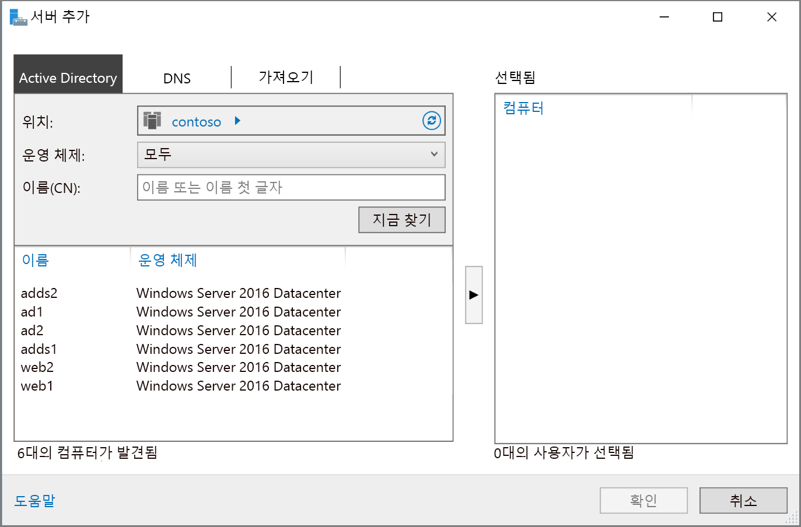

# <a name="extend-active-directory-domain-services-ad-ds-to-azure"></a><span data-ttu-id="c5168-103">AD DS(Active Directory Domain Services)를 Azure로 확장</span><span class="sxs-lookup"><span data-stu-id="c5168-103">Extend Active Directory Domain Services (AD DS) to Azure</span></span>

<span data-ttu-id="c5168-104">이 참조 아키텍처에서는 Active Directory 환경을 Azure로 확장하여 AD DS(Active Directory Domain Services)를 사용하여 분산 인증 서비스를 제공하는 방법을 설명합니다.</span><span class="sxs-lookup"><span data-stu-id="c5168-104">This reference architecture shows how to extend your Active Directory environment to Azure to provide distributed authentication services using Active Directory Domain Services (AD DS).</span></span> [<span data-ttu-id="c5168-105">**이 솔루션을 배포합니다**.</span><span class="sxs-lookup"><span data-stu-id="c5168-105">**Deploy this solution**.</span></span>](#deploy-the-solution)

<span data-ttu-id="c5168-106">[![0]][0]</span><span class="sxs-lookup"><span data-stu-id="c5168-106">[![0]][0]</span></span> 

<span data-ttu-id="c5168-107">*이 아키텍처의 [Visio 파일][visio-download]을 다운로드합니다.*</span><span class="sxs-lookup"><span data-stu-id="c5168-107">*Download a [Visio file][visio-download] of this architecture.*</span></span>

<span data-ttu-id="c5168-108">AD DS는 보안 도메인에 포함된 사용자, 컴퓨터, 응용 프로그램 및 기타 ID를 인증하는 데 사용됩니다.</span><span class="sxs-lookup"><span data-stu-id="c5168-108">AD DS is used to authenticate user, computer, application, or other identities that are included in a security domain.</span></span> <span data-ttu-id="c5168-109">AD DS는 온-프레미스에서 호스팅할 수 있지만, 응용 프로그램의 일부는 온-프레미스에 호스팅되어 있고 일부는 Azure에 호스팅되어 있는 경우에는 이 기능을 Azure에 복제하는 것이 효율적일 수 있습니다.</span><span class="sxs-lookup"><span data-stu-id="c5168-109">It can be hosted on-premises, but if your application is hosted partly on-premises and partly in Azure, it may be more efficient to replicate this functionality in Azure.</span></span> <span data-ttu-id="c5168-110">이렇게 하면 클라우드에서 온-프레미스에서 실행 중인 AD DS로 인증 및 로컬 인증 요청을 돌려보낼 때 발생하는 대기 시간을 줄일 수 있습니다.</span><span class="sxs-lookup"><span data-stu-id="c5168-110">This can reduce the latency caused by sending authentication and local authorization requests from the cloud back to AD DS running on-premises.</span></span> 

<span data-ttu-id="c5168-111">이 아키텍처는 일반적으로 온-프레미스 네트워크와 Azure 가상 네트워크가 VPN 또는 ExpressRoute 연결을 통해 연결된 경우에 사용됩니다.</span><span class="sxs-lookup"><span data-stu-id="c5168-111">This architecture is commonly used when the on-premises network and the Azure virtual network are connected by a VPN or ExpressRoute connection.</span></span> <span data-ttu-id="c5168-112">이 아키텍처는 양방향 복제도 지원합니다. 즉, 온-프레미스나 클라우드 중 한 곳에서 변경을 수행해도 온-프레미스와 클라우드의 데이터가 동일하게 유지됩니다.</span><span class="sxs-lookup"><span data-stu-id="c5168-112">This architecture also supports bidirectional replication, meaning changes can be made either on-premises or in the cloud, and both sources will be kept consistent.</span></span> <span data-ttu-id="c5168-113">일반적으로 이 아키텍처는 온-프레미스와 Azure 사이에 기능이 분산된 하이브리드 응용 프로그램 및 Active Directory를 사용하여 인증을 수행하는 응용 프로그램과 서비스에 사용됩니다.</span><span class="sxs-lookup"><span data-stu-id="c5168-113">Typical uses for this architecture include hybrid applications in which functionality is distributed between on-premises and Azure, and applications and services that perform authentication using Active Directory.</span></span>

<span data-ttu-id="c5168-114">추가 고려 사항은 [온-프레미스 Active Directory를 Azure와 통합하기 위한 솔루션 선택][considerations]을 참조하세요.</span><span class="sxs-lookup"><span data-stu-id="c5168-114">For additional considerations, see [Choose a solution for integrating on-premises Active Directory with Azure][considerations].</span></span> 

## <a name="architecture"></a><span data-ttu-id="c5168-115">아키텍처</span><span class="sxs-lookup"><span data-stu-id="c5168-115">Architecture</span></span> 

<span data-ttu-id="c5168-116">이 아키텍처는 [Azure와 인터넷 사이의 DMZ][implementing-a-secure-hybrid-network-architecture-with-internet-access]에 제시된 아키텍처를 확장합니다.</span><span class="sxs-lookup"><span data-stu-id="c5168-116">This architecture extends the architecture shown in [DMZ between Azure and the Internet][implementing-a-secure-hybrid-network-architecture-with-internet-access].</span></span> <span data-ttu-id="c5168-117">이 아키텍처에는 다음과 같은 구성 요소가 있습니다.</span><span class="sxs-lookup"><span data-stu-id="c5168-117">It has the following components.</span></span>

* <span data-ttu-id="c5168-118">**온-프레미스 네트워크**.</span><span class="sxs-lookup"><span data-stu-id="c5168-118">**On-premises network**.</span></span> <span data-ttu-id="c5168-119">온-프레미스 네트워크에는 온-프레미스에 위치한 구성 요소에 대해 인증 및 권한 부여를 수행하는 로컬 Active Directory 서버가 포함됩니다.</span><span class="sxs-lookup"><span data-stu-id="c5168-119">The on-premises network includes local Active Directory servers that can perform authentication and authorization for components located on-premises.</span></span>
* <span data-ttu-id="c5168-120">**Active Directory 서버**.</span><span class="sxs-lookup"><span data-stu-id="c5168-120">**Active Directory servers**.</span></span> <span data-ttu-id="c5168-121">클라우드에서 VM으로서 실행되는 디렉터리 서비스(AD DS)를 구현하는 도메인 컨트롤러입니다.</span><span class="sxs-lookup"><span data-stu-id="c5168-121">These are domain controllers implementing directory services (AD DS) running as VMs in the cloud.</span></span> <span data-ttu-id="c5168-122">Active Directory 서버는 Azure 가상 네트워크에서 실행되는 구성 요소에 인증을 제공할 수 있습니다.</span><span class="sxs-lookup"><span data-stu-id="c5168-122">These servers can provide authentication of components running in your Azure virtual network.</span></span>
* <span data-ttu-id="c5168-123">**Active Directory 서브넷**.</span><span class="sxs-lookup"><span data-stu-id="c5168-123">**Active Directory subnet**.</span></span> <span data-ttu-id="c5168-124">AD DS 서버는 별도의 서브넷에 호스팅됩니다.</span><span class="sxs-lookup"><span data-stu-id="c5168-124">The AD DS servers are hosted in a separate subnet.</span></span> <span data-ttu-id="c5168-125">NSG(네트워크 보안 그룹) 규칙은 AD DS 서버를 보호하고 예상치 못한 소스로부터 전달되는 트래픽에 대한 방화벽을 제공합니다.</span><span class="sxs-lookup"><span data-stu-id="c5168-125">Network security group (NSG) rules protect the AD DS servers and provide a firewall against traffic from unexpected sources.</span></span>
* <span data-ttu-id="c5168-126">**Azure 게이트웨이 및 Active Directory 동기화**.</span><span class="sxs-lookup"><span data-stu-id="c5168-126">**Azure Gateway and Active Directory synchronization**.</span></span> <span data-ttu-id="c5168-127">Azure 게이트웨이는 온-프레미스 네트워크와 Azure VNet 사이에 연결을 제공합니다.</span><span class="sxs-lookup"><span data-stu-id="c5168-127">The Azure gateway provides a connection between the on-premises network and the Azure VNet.</span></span> <span data-ttu-id="c5168-128">이러한 연결은 [VPN 연결][azure-vpn-gateway] 또는 [Azure ExpressRoute][azure-expressroute]일 수 있습니다.</span><span class="sxs-lookup"><span data-stu-id="c5168-128">This can be a [VPN connection][azure-vpn-gateway] or [Azure ExpressRoute][azure-expressroute].</span></span> <span data-ttu-id="c5168-129">클라우드와 온-프레미스에 존재하는 Active Directory 서버 사이에 이루어지는 모든 동기화 요청은 게이트웨이를 통과합니다.</span><span class="sxs-lookup"><span data-stu-id="c5168-129">All synchronization requests between the Active Directory servers in the cloud and on-premises pass through the gateway.</span></span> <span data-ttu-id="c5168-130">UDR(사용자 정의 경로)이 Azure로 전달되는 온-프레미스 트래픽의 라우팅을 처리합니다.</span><span class="sxs-lookup"><span data-stu-id="c5168-130">User-defined routes (UDRs) handle routing for on-premises traffic that passes to Azure.</span></span> <span data-ttu-id="c5168-131">Active Directory 서버로 송수신되는 트래픽은 이 시나리오에서 사용되는 NVA(네트워크 가상 어플라이언스)를 통과하지 않습니다.</span><span class="sxs-lookup"><span data-stu-id="c5168-131">Traffic to and from the Active Directory servers does not pass through the network virtual appliances (NVAs) used in this scenario.</span></span>

<span data-ttu-id="c5168-132">UDR 및 NVA 구성에 대한 자세한 내용은 [Azure에 보안 하이브리드 네트워크 아키텍처 구현][implementing-a-secure-hybrid-network-architecture]을 참조하세요.</span><span class="sxs-lookup"><span data-stu-id="c5168-132">For more information about configuring UDRs and the NVAs, see [Implementing a secure hybrid network architecture in Azure][implementing-a-secure-hybrid-network-architecture].</span></span> 

## <a name="recommendations"></a><span data-ttu-id="c5168-133">권장 사항</span><span class="sxs-lookup"><span data-stu-id="c5168-133">Recommendations</span></span>

<span data-ttu-id="c5168-134">대부분의 시나리오의 경우 다음 권장 사항을 적용합니다.</span><span class="sxs-lookup"><span data-stu-id="c5168-134">The following recommendations apply for most scenarios.</span></span> <span data-ttu-id="c5168-135">이러한 권장 사항을 재정의하라는 특정 요구 사항이 있는 경우가 아니면 따릅니다.</span><span class="sxs-lookup"><span data-stu-id="c5168-135">Follow these recommendations unless you have a specific requirement that overrides them.</span></span> 

### <a name="vm-recommendations"></a><span data-ttu-id="c5168-136">VM 권장 사항</span><span class="sxs-lookup"><span data-stu-id="c5168-136">VM recommendations</span></span>

<span data-ttu-id="c5168-137">예상되는 인증 요청의 양에 따라 [VM 크기][vm-windows-sizes] 요구 사항을 결정합니다.</span><span class="sxs-lookup"><span data-stu-id="c5168-137">Determine your [VM size][vm-windows-sizes] requirements based on the expected volume of authentication requests.</span></span> <span data-ttu-id="c5168-138">온-프레미스에서 AD DS를 호스팅하는 머신의 사양을 출발점으로 삼아 이를 Azure VM 크기와 매칭합니다.</span><span class="sxs-lookup"><span data-stu-id="c5168-138">Use the specifications of the machines hosting AD DS on premises as a starting point, and match them with the Azure VM sizes.</span></span> <span data-ttu-id="c5168-139">배포가 완료되면 VM에 가해지는 실제 부하를 바탕으로 사용률을 모니터링하고 확대 또는 축소합니다.</span><span class="sxs-lookup"><span data-stu-id="c5168-139">Once deployed, monitor utilization and scale up or down based on the actual load on the VMs.</span></span> <span data-ttu-id="c5168-140">AD DS 도메인 컨트롤러의 크기 결정에 대한 자세한 내용은 [Active Directory Domain Services의 용량 계획][capacity-planning-for-adds]을 참조하세요.</span><span class="sxs-lookup"><span data-stu-id="c5168-140">For more information about sizing AD DS domain controllers, see [Capacity Planning for Active Directory Domain Services][capacity-planning-for-adds].</span></span>

<span data-ttu-id="c5168-141">Active Directory의 데이터베이스, 로그 및 SYSVOL을 저장할 별도의 가상 데이터 디스크를 만듭니다.</span><span class="sxs-lookup"><span data-stu-id="c5168-141">Create a separate virtual data disk for storing the database, logs, and SYSVOL for Active Directory.</span></span> <span data-ttu-id="c5168-142">Active Directory의 데이터베이스, 로그 및 SYSVOL을 운영 체제와 동일한 디스크에 저장하지 않습니다.</span><span class="sxs-lookup"><span data-stu-id="c5168-142">Do not store these items on the same disk as the operating system.</span></span> <span data-ttu-id="c5168-143">기본적으로 VM에 연결된 데이터 디스크는 write-through 캐싱을 사용합니다.</span><span class="sxs-lookup"><span data-stu-id="c5168-143">Note that by default, data disks that are attached to a VM use write-through caching.</span></span> <span data-ttu-id="c5168-144">그러나 이러한 유형의 캐싱은 AD DS의 요구 사항과 충돌할 수 있습니다.</span><span class="sxs-lookup"><span data-stu-id="c5168-144">However, this form of caching can conflict with the requirements of AD DS.</span></span> <span data-ttu-id="c5168-145">따라서 데이터 디스크의 *호스트 캐시 기본 설정*을 *없음*으로 설정해야 합니다.</span><span class="sxs-lookup"><span data-stu-id="c5168-145">For this reason, set the *Host Cache Preference* setting on the data disk to *None*.</span></span> <span data-ttu-id="c5168-146">자세한 내용은 [Windows Server AD DS 데이터베이스 및 SYSVOL의 배치][adds-data-disks]를 참조하세요.</span><span class="sxs-lookup"><span data-stu-id="c5168-146">For more information, see [Placement of the Windows Server AD DS database and SYSVOL][adds-data-disks].</span></span>

<span data-ttu-id="c5168-147">도메인 컨트롤러로서 AD DS를 실행하는 VM을 2개 이상 배포하고 이를 [가용성 집합][availability-set]에 추가합니다.</span><span class="sxs-lookup"><span data-stu-id="c5168-147">Deploy at least two VMs running AD DS as domain controllers and add them to an [availability set][availability-set].</span></span>

### <a name="networking-recommendations"></a><span data-ttu-id="c5168-148">네트워킹 권장 사항</span><span class="sxs-lookup"><span data-stu-id="c5168-148">Networking recommendations</span></span>

<span data-ttu-id="c5168-149">각 AD DS 서버에 대해 완전한 DNS(도메인 이름 서비스)를 지원할 수 있도록 고정 사설 IP 주소를 사용하여 VM NIC(네트워크 인터페이스)를 구성합니다.</span><span class="sxs-lookup"><span data-stu-id="c5168-149">Configure the VM network interface (NIC) for each AD DS server with a static private IP address for full domain name service (DNS) support.</span></span> <span data-ttu-id="c5168-150">자세한 내용은 [Azure Portal에서 고정 사설 IP 주소를 설정하는 방법][set-a-static-ip-address]을 참조하세요.</span><span class="sxs-lookup"><span data-stu-id="c5168-150">For more information, see [How to set a static private IP address in the Azure portal][set-a-static-ip-address].</span></span>

> [!NOTE]
> <span data-ttu-id="c5168-151">AD DS에 대해 공용 IP 주소를 사용하여 VM NIC를 구성하지 않습니다.</span><span class="sxs-lookup"><span data-stu-id="c5168-151">Do not configure the VM NIC for any AD DS with a public IP address.</span></span> <span data-ttu-id="c5168-152">자세한 내용은 [보안 고려 사항][security-considerations]을 참조하세요.</span><span class="sxs-lookup"><span data-stu-id="c5168-152">See [Security considerations][security-considerations] for more details.</span></span>
> 
> 

<span data-ttu-id="c5168-153">Active Directory 서브넷 NSG에는 온-프레미스에서 수신되는 트래픽을 허용하는 규칙이 필요합니다.</span><span class="sxs-lookup"><span data-stu-id="c5168-153">The Active Directory subnet NSG requires rules to permit incoming traffic from on-premises.</span></span> <span data-ttu-id="c5168-154">AD DS에 의해 사용되는 포트에 대한 자세한 내용은 [Active Directory 및 Active Directory Domain Services 포트 요구 사항][ad-ds-ports]을 참조하세요.</span><span class="sxs-lookup"><span data-stu-id="c5168-154">For detailed information on the ports used by AD DS, see [Active Directory and Active Directory Domain Services Port Requirements][ad-ds-ports].</span></span> <span data-ttu-id="c5168-155">또한, UDR 테이블이 이 아키텍처에서 사용되는 NVA를 통과하여 AD DS 트래픽을 라우팅하지 않도록 해야 합니다.</span><span class="sxs-lookup"><span data-stu-id="c5168-155">Also, ensure the UDR tables do not route AD DS traffic through the NVAs used in this architecture.</span></span> 

### <a name="active-directory-site"></a><span data-ttu-id="c5168-156">Active Directory 사이트</span><span class="sxs-lookup"><span data-stu-id="c5168-156">Active Directory site</span></span>

<span data-ttu-id="c5168-157">AD DS에서 사이트는 물리적 위치, 네트워크 또는 장치 모음을 나타냅니다.</span><span class="sxs-lookup"><span data-stu-id="c5168-157">In AD DS, a site represents a physical location, network, or collection of devices.</span></span> <span data-ttu-id="c5168-158">AD DS 사이트는 서로 가까운 곳에 위치하며 고속 네트워크로 연결된 AD DS 개체를 그룹화하여 AD DS 데이터베이스 복제를 관리하는 데 사용됩니다.</span><span class="sxs-lookup"><span data-stu-id="c5168-158">AD DS sites are used to manage AD DS database replication by grouping together AD DS objects that are located close to one another and are connected by a high speed network.</span></span> <span data-ttu-id="c5168-159">AD DS에는 여러 사이트 간에 AD DS 데이터베이스를 복제할 최상의 전략을 선택하는 로직이 포함되어 있습니다.</span><span class="sxs-lookup"><span data-stu-id="c5168-159">AD DS includes logic to select the best strategy for replacating the AD DS database between sites.</span></span>

<span data-ttu-id="c5168-160">Azure상의 응용 프로그램에 대해 정의된 서브넷을 포함하여 AD DS 사이트를 만드는 것이 좋습니다.</span><span class="sxs-lookup"><span data-stu-id="c5168-160">We recommend that you create an AD DS site including the subnets defined for your application in Azure.</span></span> <span data-ttu-id="c5168-161">그런 다음 여러 온-프레미스 AD DS 사이트 사이에 사이트 링크를 구성하면 AD DS가 가장 효율적인 데이터베이스 복제를 수행합니다.</span><span class="sxs-lookup"><span data-stu-id="c5168-161">Then, configure a site link between your on-premises AD DS sites, and AD DS will automatically perform the most efficient database replication possible.</span></span> <span data-ttu-id="c5168-162">이와 같은 데이터베이스 복제에는 초기 구성 외에 추가로 요구되는 사항이 거의 없습니다.</span><span class="sxs-lookup"><span data-stu-id="c5168-162">Note that this database replication requires little beyond the initial configuration.</span></span>

### <a name="active-directory-operations-masters"></a><span data-ttu-id="c5168-163">Active Directory 작업 마스터</span><span class="sxs-lookup"><span data-stu-id="c5168-163">Active Directory operations masters</span></span>

<span data-ttu-id="c5168-164">AD DS 도메인 컨트롤러에 작업 마스터 역할을 할당하여 복제된 여러 AD DS 데이터베이스 인스턴스 간의 일관성 확인을 지원할 수 있습니다.</span><span class="sxs-lookup"><span data-stu-id="c5168-164">The operations masters role can be assigned to AD DS domain controllers to support consistency checking between instances of replicated AD DS databases.</span></span> <span data-ttu-id="c5168-165">작업 마스터에는 스키마 마스터, 도메인 이름 지정 마스터, 상대 식별자 마스터, 기본 도메인 컨트롤러 마스터 에뮬레이터, 인프라 마스터와 같은 다섯 가지 마스터 역할이 있습니다.</span><span class="sxs-lookup"><span data-stu-id="c5168-165">There are five operations master roles: schema master, domain naming master, relative identifier master, primary domain controller master emulator, and infrastructure master.</span></span> <span data-ttu-id="c5168-166">이러한 역할에 대한 자세한 내용은 [작업 마스터란?][ad-ds-operations-masters]을 참조하세요.</span><span class="sxs-lookup"><span data-stu-id="c5168-166">For more information about these roles, see [What are Operations Masters?][ad-ds-operations-masters].</span></span>

<span data-ttu-id="c5168-167">Azure에 배포한 도메인 컨트롤러에는 작업 마스터 역할을 할당하지 않는 것이 좋습니다.</span><span class="sxs-lookup"><span data-stu-id="c5168-167">We recommend you do not assign operations masters roles to the domain controllers deployed in Azure.</span></span>

### <a name="monitoring"></a><span data-ttu-id="c5168-168">모니터링</span><span class="sxs-lookup"><span data-stu-id="c5168-168">Monitoring</span></span>

<span data-ttu-id="c5168-169">도메인 컨트롤러 VM과 AD DS Services의 리소스를 모니터링하고 문제 발생 시 이를 신속하게 해결할 계획을 도출합니다.</span><span class="sxs-lookup"><span data-stu-id="c5168-169">Monitor the resources of the domain controller VMs as well as the AD DS Services and create a plan to quickly correct any problems.</span></span> <span data-ttu-id="c5168-170">자세한 내용은 [Active Directory 모니터링][monitoring_ad]을 참조하세요.</span><span class="sxs-lookup"><span data-stu-id="c5168-170">For more information, see [Monitoring Active Directory][monitoring_ad].</span></span> <span data-ttu-id="c5168-171">모니터링 서버에 [Microsoft Systems Center][microsoft_systems_center]와 같은 도구를 설치하여(아키텍처 다이어그램 참조) 이러한 작업을 수행할 수도 있습니다.</span><span class="sxs-lookup"><span data-stu-id="c5168-171">You can also install tools such as [Microsoft Systems Center][microsoft_systems_center] on the monitoring server (see the architecture diagram) to help perform these tasks.</span></span>  

## <a name="scalability-considerations"></a><span data-ttu-id="c5168-172">확장성 고려 사항</span><span class="sxs-lookup"><span data-stu-id="c5168-172">Scalability considerations</span></span>

<span data-ttu-id="c5168-173">AD DS는 확장성을 지원하도록 설계되었습니다.</span><span class="sxs-lookup"><span data-stu-id="c5168-173">AD DS is designed for scalability.</span></span> <span data-ttu-id="c5168-174">요청을 AD DS 도메인 컨트롤러로 전송하기 위해 부하 분산 장치나 트래픽 컨트롤러를 구성할 필요가 없습니다.</span><span class="sxs-lookup"><span data-stu-id="c5168-174">You don't need to configure a load balancer or traffic controller to direct requests to AD DS domain controllers.</span></span> <span data-ttu-id="c5168-175">염두에 두어야 할 유일한 확장성 고려 사항은 AD DS를 실행하는 VM에 네트워크 부하 요구 사항에 맞는 올바른 크기를 구성하고, VM의 부하를 모니터링하고, 필요에 따라 확장 또는 축소하는 것입니다.</span><span class="sxs-lookup"><span data-stu-id="c5168-175">The only scalability consideration is to configure the VMs running AD DS with the correct size for your network load requirements, monitor the load on the VMs, and scale up or down as necessary.</span></span>

## <a name="availability-considerations"></a><span data-ttu-id="c5168-176">가용성 고려 사항</span><span class="sxs-lookup"><span data-stu-id="c5168-176">Availability considerations</span></span>

<span data-ttu-id="c5168-177">AD DS를 실행하는 VM을 [가용성 집합][availability-set]에 배포합니다.</span><span class="sxs-lookup"><span data-stu-id="c5168-177">Deploy the VMs running AD DS into an [availability set][availability-set].</span></span> <span data-ttu-id="c5168-178">또한, 필요에 따라 하나 또는 그 이상의 서버에 [대기 작업 마스터][standby-operations-masters] 역할을 할당하는 방법을 고려할 수도 있습니다.</span><span class="sxs-lookup"><span data-stu-id="c5168-178">Also, consider assigning the role of [standby operations master][standby-operations-masters] to at least one server, and possibly more depending on your requirements.</span></span> <span data-ttu-id="c5168-179">대기 작업 마스터는 장애 조치(failover) 시에 기본 작업 마스터 서버 대신 사용할 수 있는 작업 마스터의 활성 복사본입니다.</span><span class="sxs-lookup"><span data-stu-id="c5168-179">A standby operations master is an active copy of the operations master that can be used in place of the primary operations masters server during fail over.</span></span>

## <a name="manageability-considerations"></a><span data-ttu-id="c5168-180">관리 효율성 고려 사항</span><span class="sxs-lookup"><span data-stu-id="c5168-180">Manageability considerations</span></span>

<span data-ttu-id="c5168-181">정식 AD DS 백업을 수행합니다.</span><span class="sxs-lookup"><span data-stu-id="c5168-181">Perform regular AD DS backups.</span></span> <span data-ttu-id="c5168-182">VHD상의 AD DS 데이터베이스 파일은 복사 시에 일관성 있는 상태가 아닐 수 있습니다. 이로 인해 데이터베이스를 다시 시작하지 못하게 될 수 있으므로 정식 백업을 수행하는 대신 도메인 컨트롤러의 VHD 파일을 복사하는 것은 지양해야 합니다.</span><span class="sxs-lookup"><span data-stu-id="c5168-182">Don't simply copy the VHD files of domain controllers instead of performing regular backups, because the AD DS database file on the VHD may not be in a consistent state when it's copied, making it impossible to restart the database.</span></span>

<span data-ttu-id="c5168-183">Azure Portal을 사용하여 도메인 컨트롤러 VM을 종료하지 않습니다.</span><span class="sxs-lookup"><span data-stu-id="c5168-183">Do not shut down a domain controller VM using Azure portal.</span></span> <span data-ttu-id="c5168-184">그 대신 게스트 운영 체제에서 VM을 종료하고 다시 시작합니다.</span><span class="sxs-lookup"><span data-stu-id="c5168-184">Instead, shut down and restart from the guest operating system.</span></span> <span data-ttu-id="c5168-185">포털을 통해 종료하면 VM의 할당이 취소되고 Active Directory 리포지토리의 `VM-GenerationID` 및 `invocationID`가 재설정됩니다.</span><span class="sxs-lookup"><span data-stu-id="c5168-185">Shutting down through the portal causes the VM to be deallocated, which resets both the `VM-GenerationID` and the `invocationID` of the Active Directory repository.</span></span> <span data-ttu-id="c5168-186">이 경우 AD DS RID(상대 식별자) 풀이 폐기되고 SYSVOL이 nonauthoritative로 표시되어 도메인 컨트롤러를 다시 구성해야 할 수 있습니다.</span><span class="sxs-lookup"><span data-stu-id="c5168-186">This discards the AD DS relative identifier (RID) pool and marks SYSVOL as nonauthoritative, and may require reconfiguration of the domain controller.</span></span>

## <a name="security-considerations"></a><span data-ttu-id="c5168-187">보안 고려 사항</span><span class="sxs-lookup"><span data-stu-id="c5168-187">Security considerations</span></span>

<span data-ttu-id="c5168-188">AD DS 서버는 인증 서비스를 제공하기 때문에 공격자들의 매력적인 표적이 됩니다.</span><span class="sxs-lookup"><span data-stu-id="c5168-188">AD DS servers provide authentication services and are an attractive target for attacks.</span></span> <span data-ttu-id="c5168-189">AD DS 서버를 안전하게 보호하기 위해 AD DS 서버를 NSG가 방화벽으로 기능하는 별도의 서브넷에 배치함으로써 인터넷에 직접 연결되지 않도록 합니다.</span><span class="sxs-lookup"><span data-stu-id="c5168-189">To secure them, prevent direct Internet connectivity by placing the AD DS servers in a separate subnet with an NSG acting as a firewall.</span></span> <span data-ttu-id="c5168-190">AD DS 서버에서 인증, 권한 부여 및 서버 동기화에 필요한 포트를 제외한 모든 포트를 닫습니다.</span><span class="sxs-lookup"><span data-stu-id="c5168-190">Close all ports on the AD DS servers except those necessary for authentication, authorization, and server synchronization.</span></span> <span data-ttu-id="c5168-191">자세한 내용은 [Active Directory 및 Active Directory Domain Services 포트 요구 사항][ad-ds-ports]을 참조하세요.</span><span class="sxs-lookup"><span data-stu-id="c5168-191">For more information, see [Active Directory and Active Directory Domain Services Port Requirements][ad-ds-ports].</span></span>

<span data-ttu-id="c5168-192">[Azure에서 인터넷 액세스를 이용하여 보안 하이브리드 네트워크 아키텍처 구현][implementing-a-secure-hybrid-network-architecture-with-internet-access]에 설명된 바와 같이 한 쌍의 서브넷과 NVA를 사용하여 서버에 추가적인 보안 경계를 구현하는 방법을 고려할 수 있습니다.</span><span class="sxs-lookup"><span data-stu-id="c5168-192">Consider implementing an additional security perimeter around servers with a pair of subnets and NVAs, as described in [Implementing a secure hybrid network architecture with Internet access in Azure][implementing-a-secure-hybrid-network-architecture-with-internet-access].</span></span>

<span data-ttu-id="c5168-193">AD DS 데이터베이스를 호스팅하는 디스크를 BitLocker 또는 Azure disk encryption을 사용하여 암호화합니다.</span><span class="sxs-lookup"><span data-stu-id="c5168-193">Use either BitLocker or Azure disk encryption to encrypt the disk hosting the AD DS database.</span></span>

## <a name="deploy-the-solution"></a><span data-ttu-id="c5168-194">솔루션 배포</span><span class="sxs-lookup"><span data-stu-id="c5168-194">Deploy the solution</span></span>

<span data-ttu-id="c5168-195">이 아키텍처에 대한 배포는 [GitHub][github]에서 사용할 수 있습니다.</span><span class="sxs-lookup"><span data-stu-id="c5168-195">A deployment for this architecture is available on [GitHub][github].</span></span> <span data-ttu-id="c5168-196">전체 배포는 최대 2시간이 걸릴 수 있으며 VPN 게이트웨이 만들기 및 AD DS를 구성하는 스크립트 실행을 포함합니다.</span><span class="sxs-lookup"><span data-stu-id="c5168-196">Note that the entire deployment can take up to two hours, which includes creating the VPN gateway and running the scripts that configure AD DS.</span></span>

### <a name="prerequisites"></a><span data-ttu-id="c5168-197">필수 조건</span><span class="sxs-lookup"><span data-stu-id="c5168-197">Prerequisites</span></span>

1. <span data-ttu-id="c5168-198">[참조 아키텍처][ref-arch-repo] GitHub 리포지토리의 zip 파일을 복제, 포크 또는 다운로드합니다.</span><span class="sxs-lookup"><span data-stu-id="c5168-198">Clone, fork, or download the zip file for the [reference architectures][ref-arch-repo] GitHub repository.</span></span>

2. <span data-ttu-id="c5168-199">[Azure CLI 2.0][azure-cli-2]을 설치합니다.</span><span class="sxs-lookup"><span data-stu-id="c5168-199">Install [Azure CLI 2.0][azure-cli-2].</span></span>

3. <span data-ttu-id="c5168-200">[Azure 빌딩 블록][azbb] npm 패키지를 설치합니다.</span><span class="sxs-lookup"><span data-stu-id="c5168-200">Install the [Azure building blocks][azbb] npm package.</span></span>

4. <span data-ttu-id="c5168-201">명령 프롬프트, bash 프롬프트 또는 PowerShell 프롬프트에서 아래 명령을 사용하여 Azure 계정에 로그인합니다.</span><span class="sxs-lookup"><span data-stu-id="c5168-201">From a command prompt, bash prompt, or PowerShell prompt, log into your Azure account by using the command below.</span></span>

   ```bash
   az login
   ```

### <a name="deploy-the-simulated-on-premises-datacenter"></a><span data-ttu-id="c5168-202">시뮬레이션된 온-프레미스 데이터 센터 배포</span><span class="sxs-lookup"><span data-stu-id="c5168-202">Deploy the simulated on-premises datacenter</span></span>

1. <span data-ttu-id="c5168-203">참조 아키텍처 리포지토리의 `identity/adds-extend-domain` 폴더로 이동합니다.</span><span class="sxs-lookup"><span data-stu-id="c5168-203">Navigate to the `identity/adds-extend-domain` folder of the reference architectures repository.</span></span>

2. <span data-ttu-id="c5168-204">`onprem.json` 파일을 엽니다.</span><span class="sxs-lookup"><span data-stu-id="c5168-204">Open the `onprem.json` file.</span></span> <span data-ttu-id="c5168-205">`adminPassword`를 검색하고 암호에 대한 값을 추가합니다.</span><span class="sxs-lookup"><span data-stu-id="c5168-205">Search for `adminPassword` and add values for the passwords.</span></span> <span data-ttu-id="c5168-206">파일에 세 개의 인스턴스가 있습니다.</span><span class="sxs-lookup"><span data-stu-id="c5168-206">There are three instances in the file.</span></span>

    ```bash
    "adminUsername": "testuser",
    "adminPassword": "<password>",
    ```

3. <span data-ttu-id="c5168-207">동일한 파일에서 `protectedSettings`를 검색하고 암호에 대한 값을 추가합니다.</span><span class="sxs-lookup"><span data-stu-id="c5168-207">In the same file, search for `protectedSettings` and add values for the passwords.</span></span> <span data-ttu-id="c5168-208">각 AD 서버에 대한 `protectedSettings`의 두 개의 인스턴스가 있습니다.</span><span class="sxs-lookup"><span data-stu-id="c5168-208">There are two instances of `protectedSettings`, one for each AD server.</span></span>

    ```bash
    "protectedSettings": {
      "configurationArguments": {
        ...
        "AdminCreds": {
          "UserName": "testadminuser",
          "Password": "<password>"
        },
        "SafeModeAdminCreds": {
          "UserName": "testsafeadminuser",
          "Password": "<password>"
        }
      }
    }
    ```

4. <span data-ttu-id="c5168-209">다음 명령을 실행하고 배포가 끝나기를 기다립니다.</span><span class="sxs-lookup"><span data-stu-id="c5168-209">Run the following command and wait for the deployment to finish:</span></span>

    ```bash
    azbb -s <subscription_id> -g <resource group> -l <location> -p onprem.json --deploy
    ```

### <a name="deploy-the-azure-vnet"></a><span data-ttu-id="c5168-210">Azure VNet에 배포</span><span class="sxs-lookup"><span data-stu-id="c5168-210">Deploy the Azure VNet</span></span>

1. <span data-ttu-id="c5168-211">`azure.json` 파일을 엽니다.</span><span class="sxs-lookup"><span data-stu-id="c5168-211">Open the `azure.json` file.</span></span>  <span data-ttu-id="c5168-212">`adminPassword`를 검색하고 암호에 대한 값을 추가합니다.</span><span class="sxs-lookup"><span data-stu-id="c5168-212">Search for `adminPassword` and add values for the passwords.</span></span> <span data-ttu-id="c5168-213">파일에 세 개의 인스턴스가 있습니다.</span><span class="sxs-lookup"><span data-stu-id="c5168-213">There are three instances in the file.</span></span>

    ```bash
    "adminUsername": "testuser",
    "adminPassword": "<password>",
    ```

2. <span data-ttu-id="c5168-214">동일한 파일에서 `protectedSettings`를 검색하고 암호에 대한 값을 추가합니다.</span><span class="sxs-lookup"><span data-stu-id="c5168-214">In the same file, search for `protectedSettings` and add values for the passwords.</span></span> <span data-ttu-id="c5168-215">각 AD 서버에 대한 `protectedSettings`의 두 개의 인스턴스가 있습니다.</span><span class="sxs-lookup"><span data-stu-id="c5168-215">There are two instances of `protectedSettings`, one for each AD server.</span></span>

    ```bash
    "protectedSettings": {
      "configurationArguments": {
        ...
        "AdminCreds": {
          "UserName": "testadminuser",
          "Password": "<password>"
        },
        "SafeModeAdminCreds": {
          "UserName": "testsafeadminuser",
          "Password": "<password>"
        }
      }
    }
    ```

3. <span data-ttu-id="c5168-216">`sharedKey`의 경우 VPN 연결에 대한 공유 키를 입력합니다.</span><span class="sxs-lookup"><span data-stu-id="c5168-216">For `sharedKey`, enter a shared key for the VPN connection.</span></span> <span data-ttu-id="c5168-217">매개 변수 파일에 `sharedKey`의 두 개의 인스턴스가 있습니다.</span><span class="sxs-lookup"><span data-stu-id="c5168-217">There are two instances of `sharedKey` in the parameter file.</span></span>

    ```bash
    "sharedKey": "",
    ```

4. <span data-ttu-id="c5168-218">다음 명령을 실행하고 배포가 끝나기를 기다립니다.</span><span class="sxs-lookup"><span data-stu-id="c5168-218">Run the following command and wait for the deployment to finish.</span></span>

    ```bash
    azbb -s <subscription_id> -g <resource group> -l <location> -p onoprem.json --deploy
    ```

   <span data-ttu-id="c5168-219">온-프레미스 VNet과 동일한 리소스 그룹에 배포합니다.</span><span class="sxs-lookup"><span data-stu-id="c5168-219">Deploy to the same resource group as the on-premises VNet.</span></span>

### <a name="test-connectivity-with-the-azure-vnet"></a><span data-ttu-id="c5168-220">Azure VNet을 사용하여 연결 테스트</span><span class="sxs-lookup"><span data-stu-id="c5168-220">Test connectivity with the Azure VNet</span></span>

<span data-ttu-id="c5168-221">배포가 완료된 후 시뮬레이션된 온-프레미스 환경에서 Azure VNet으로 연결을 테스트할 수 있습니다.</span><span class="sxs-lookup"><span data-stu-id="c5168-221">Afterr deployment completes, you can test conectivity from the simulated on-premises environment to the Azure VNet.</span></span>

1. <span data-ttu-id="c5168-222">Azure Portal을 사용하여 `ra-onpremise-mgmt-vm1`이라는 VM을 찾습니다.</span><span class="sxs-lookup"><span data-stu-id="c5168-222">Use the Azure portal to find the VM named `ra-onpremise-mgmt-vm1`.</span></span>

2. <span data-ttu-id="c5168-223">`Connect`를 클릭하여 VM에 대한 원격 데스크톱 세션을 엽니다.</span><span class="sxs-lookup"><span data-stu-id="c5168-223">Click `Connect` to open a remote desktop session to the VM.</span></span> <span data-ttu-id="c5168-224">사용자 이름은 `contoso\testuser`이고, 암호는 `onprem.json` 매개 변수 파일에서 지정한 것입니다.</span><span class="sxs-lookup"><span data-stu-id="c5168-224">The username is `contoso\testuser`, and the password is the one that you specified in the `onprem.json` parameter file.</span></span>

3. <span data-ttu-id="c5168-225">원격 데스크톱 세션 내에서 `adds-vm1`이라는 VM의 IP 주소인 10.0.4.4에 대한 다른 원격 데스크톱 세션을 엽니다.</span><span class="sxs-lookup"><span data-stu-id="c5168-225">From inside your remote desktop session, open another remote desktop session to 10.0.4.4, which is the IP address of the VM named `adds-vm1`.</span></span> <span data-ttu-id="c5168-226">사용자 이름은 `contoso\testuser`이고, 암호는 `azure.json` 매개 변수 파일에서 지정한 것입니다.</span><span class="sxs-lookup"><span data-stu-id="c5168-226">The username is `contoso\testuser`, and the password is the one that you specified in the `azure.json` parameter file.</span></span>

4. <span data-ttu-id="c5168-227">`adds-vm1`에 대한 원격 데스크톱 세션 내에서 **서버 관리자**로 이동하고 **관리할 다른 서버 추가**를 클릭합니다.</span><span class="sxs-lookup"><span data-stu-id="c5168-227">From inside the remote desktop session for `adds-vm1`, go to **Server Manager** and click **Add other servers to manage.**</span></span> 

5. <span data-ttu-id="c5168-228">**Active Directory** 탭에서 **지금 찾기**를 클릭합니다.</span><span class="sxs-lookup"><span data-stu-id="c5168-228">In the **Active Directory** tab, click **Find now**.</span></span> <span data-ttu-id="c5168-229">AD, AD DS 및 웹 VM의 목록이 표시됩니다.</span><span class="sxs-lookup"><span data-stu-id="c5168-229">You should see a list of the AD, AD DS, and Web VMs.</span></span>

   

## <a name="next-steps"></a><span data-ttu-id="c5168-230">다음 단계</span><span class="sxs-lookup"><span data-stu-id="c5168-230">Next steps</span></span>

* <span data-ttu-id="c5168-231">Azure에서 [AD DS 포리스트를 생성][adds-resource-forest]하기 위한 모범 사례를 알아봅니다.</span><span class="sxs-lookup"><span data-stu-id="c5168-231">Learn the best practices for [creating an AD DS resource forest][adds-resource-forest] in Azure.</span></span>
* <span data-ttu-id="c5168-232">Azure에서 [AD FS(Active Directory Federation Services) 인프라를 생성][adfs]하기 위한 모범 사례를 알아봅니다.</span><span class="sxs-lookup"><span data-stu-id="c5168-232">Learn the best practices for [creating an Active Directory Federation Services (AD FS) infrastructure][adfs] in Azure.</span></span>

<!-- links -->

[adds-resource-forest]: adds-forest.md
[adfs]: adfs.md
[azure-cli-2]: /azure/install-azure-cli
[azbb]: https://github.com/mspnp/template-building-blocks/wiki/Install-Azure-Building-Blocks
[implementing-a-secure-hybrid-network-architecture]: ../dmz/secure-vnet-hybrid.md
[implementing-a-secure-hybrid-network-architecture-with-internet-access]: ../dmz/secure-vnet-dmz.md

[adds-data-disks]: https://msdn.microsoft.com/library/azure/jj156090.aspx#BKMK_PlaceDB
[ad-ds-operations-masters]: https://technet.microsoft.com/library/cc779716(v=ws.10).aspx
[ad-ds-ports]: https://technet.microsoft.com/library/dd772723(v=ws.11).aspx
[availability-set]: /azure/virtual-machines/virtual-machines-windows-create-availability-set
[azure-expressroute]: /azure/expressroute/expressroute-introduction
[azure-vpn-gateway]: /azure/vpn-gateway/vpn-gateway-about-vpngateways
[capacity-planning-for-adds]: http://social.technet.microsoft.com/wiki/contents/articles/14355.capacity-planning-for-active-directory-domain-services.aspx
[considerations]: ./considerations.md
[GitHub]: https://github.com/mspnp/reference-architectures/tree/master/identity/adds-extend-domain
[microsoft_systems_center]: https://www.microsoft.com/server-cloud/products/system-center-2016/
[monitoring_ad]: https://msdn.microsoft.com/library/bb727046.aspx
[security-considerations]: #security-considerations
[set-a-static-ip-address]: /azure/virtual-network/virtual-networks-static-private-ip-arm-pportal
[standby-operations-masters]: https://technet.microsoft.com/library/cc794737(v=ws.10).aspx
[visio-download]: https://archcenter.blob.core.windows.net/cdn/identity-architectures.vsdx
[vm-windows-sizes]: /azure/virtual-machines/virtual-machines-windows-sizes

[0]: ./images/adds-extend-domain.png "Active Directory로 하이브리드 네트워크 아키텍처 보안"
