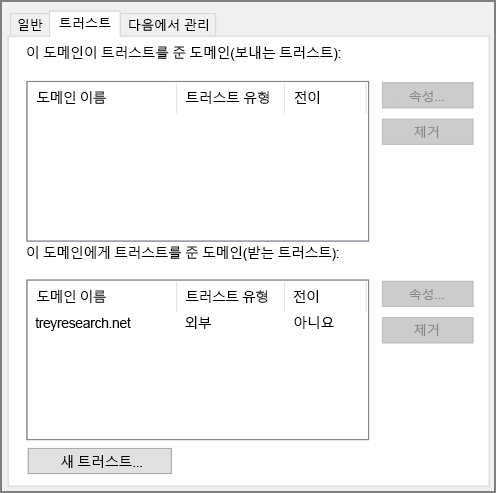

# <a name="create-an-active-directory-domain-services-ad-ds-resource-forest-in-azure"></a><span data-ttu-id="f95d9-104">Azure에서 AAD DS(Active Directory Domain Services) 리소스 포리스트 만들기</span><span class="sxs-lookup"><span data-stu-id="f95d9-104">Create an Active Directory Domain Services (AD DS) resource forest in Azure</span></span>

<span data-ttu-id="f95d9-105">이 참조 아키텍처는 온-프레미스 AD 포레스트에 있는 도메인의 신뢰를 받는 Azure의 별도 Active Directory 도메인을 생성하는 방법을 설명합니다.</span><span class="sxs-lookup"><span data-stu-id="f95d9-105">This reference architecture shows how to create a separate Active Directory domain in Azure that is trusted by domains in your on-premises AD forest.</span></span> [<span data-ttu-id="f95d9-106">**이 솔루션을 배포합니다**.</span><span class="sxs-lookup"><span data-stu-id="f95d9-106">**Deploy this solution**.</span></span>](#deploy-the-solution)

<span data-ttu-id="f95d9-107">[![0]][0]</span><span class="sxs-lookup"><span data-stu-id="f95d9-107">[![0]][0]</span></span> 

<span data-ttu-id="f95d9-108">*이 아키텍처의 [Visio 파일][visio-download]을 다운로드합니다.*</span><span class="sxs-lookup"><span data-stu-id="f95d9-108">*Download a [Visio file][visio-download] of this architecture.*</span></span>

<span data-ttu-id="f95d9-109">AD DS(Active Directory Domain Services)는 ID 정보를 계층 구조에 저장합니다.</span><span class="sxs-lookup"><span data-stu-id="f95d9-109">Active Directory Domain Services (AD DS) stores identity information in a hierarchical structure.</span></span> <span data-ttu-id="f95d9-110">계층 구조의 최상위 노드를 포레스트라고 합니다.</span><span class="sxs-lookup"><span data-stu-id="f95d9-110">The top node in the hierarchical structure is known as a forest.</span></span> <span data-ttu-id="f95d9-111">포레스트는 도메인을, 도메인은 다른 유형의 개체를 담고 있습니다.</span><span class="sxs-lookup"><span data-stu-id="f95d9-111">A forest contains domains, and domains contain other types of objects.</span></span> <span data-ttu-id="f95d9-112">이 참조 아키텍처는 온-프레미스 도메인과의 단방향의 보내는 트러스트 관계를 구축하여 Azure에 AD DS 포레스트를 만듭니다.</span><span class="sxs-lookup"><span data-stu-id="f95d9-112">This reference architecture creates an AD DS forest in Azure with a one-way outgoing trust relationship with an on-premises domain.</span></span> <span data-ttu-id="f95d9-113">Azure에 있는 포레스트는 온-프레미스에 없는 도메인을 포함합니다.</span><span class="sxs-lookup"><span data-stu-id="f95d9-113">The forest in Azure contains a domain that does not exist on-premises.</span></span> <span data-ttu-id="f95d9-114">트러스트 관계를 바탕으로 온-프레미스 도메인에서 수행한 로그인을 통해 별개의 Azure 도메인에 있는 리소스에 접속할 수 있습니다.</span><span class="sxs-lookup"><span data-stu-id="f95d9-114">Because of the trust relationship, logons made against on-premises domains can be trusted for access to resources in the separate Azure domain.</span></span> 

<span data-ttu-id="f95d9-115">이 아키텍처의 일반적인 용도는 클라우드에 저장된 개체 및 ID에 대한 보안 분리를 유지하는 것과 개별 도메인을 온-프레미스에서 클라우드로 마이그레이션하는 것입니다.</span><span class="sxs-lookup"><span data-stu-id="f95d9-115">Typical uses for this architecture include maintaining security separation for objects and identities held in the cloud, and migrating individual domains from on-premises to the cloud.</span></span> 

<span data-ttu-id="f95d9-116">추가 고려 사항은 [온-프레미스 Active Directory를 Azure와 통합하기 위한 솔루션 선택][considerations]을 참조하세요.</span><span class="sxs-lookup"><span data-stu-id="f95d9-116">For additional considerations, see [Choose a solution for integrating on-premises Active Directory with Azure][considerations].</span></span> 

## <a name="architecture"></a><span data-ttu-id="f95d9-117">아키텍처</span><span class="sxs-lookup"><span data-stu-id="f95d9-117">Architecture</span></span>

<span data-ttu-id="f95d9-118">이 아키텍처의 구성 요소는 다음과 같습니다.</span><span class="sxs-lookup"><span data-stu-id="f95d9-118">The architecture has the following components.</span></span>

* <span data-ttu-id="f95d9-119">**온-프레미스 네트워크**.</span><span class="sxs-lookup"><span data-stu-id="f95d9-119">**On-premises network**.</span></span> <span data-ttu-id="f95d9-120">온-프레미스 네트워크는 자체 Active Directory 포레스트와 도메인을 포함합니다.</span><span class="sxs-lookup"><span data-stu-id="f95d9-120">The on-premises network contains its own Active Directory forest and domains.</span></span>
* <span data-ttu-id="f95d9-121">**Active Directory 서버**.</span><span class="sxs-lookup"><span data-stu-id="f95d9-121">**Active Directory servers**.</span></span> <span data-ttu-id="f95d9-122">클라우드에서 VM으로 실행되는 도메인 서비스를 구현하는 도메인 컨트롤러입니다.</span><span class="sxs-lookup"><span data-stu-id="f95d9-122">These are domain controllers implementing domain services running as VMs in the cloud.</span></span> <span data-ttu-id="f95d9-123">이러한 서버는 온-프레미스에 위치한 도메인들과 분리된 하나 이상의 도메인을 포함하는 포레스트를 호스트합니다.</span><span class="sxs-lookup"><span data-stu-id="f95d9-123">These servers host a forest containing one or more domains, separate from those located on-premises.</span></span>
* <span data-ttu-id="f95d9-124">**단방향 트러스트 관계**.</span><span class="sxs-lookup"><span data-stu-id="f95d9-124">**One-way trust relationship**.</span></span> <span data-ttu-id="f95d9-125">이 다이어그램의 예제는 Azure 도메인으로부터 온-프레미스 도메인으로의 단방향 트러스트 관계를 보여 줍니다.</span><span class="sxs-lookup"><span data-stu-id="f95d9-125">The example in the diagram shows a one-way trust from the domain in Azure to the on-premises domain.</span></span> <span data-ttu-id="f95d9-126">이 관계를 통해 온-프레미스 사용자는 Azure의 도메인에 있는 리소스에 접근할 수 있지만 Azure 사용자가 온-프레미스의 리소스에 접근할 수는 없습니다.</span><span class="sxs-lookup"><span data-stu-id="f95d9-126">This relationship enables on-premises users to access resources in the domain in Azure, but not the other way around.</span></span> <span data-ttu-id="f95d9-127">클라우드 사용자가 온-프레미스 리소스 액세스를 요구하는 경우 양방향 트러스트 관계를 생성할 수도 있습니다.</span><span class="sxs-lookup"><span data-stu-id="f95d9-127">It is possible to create a two-way trust if cloud users also require access to on-premises resources.</span></span>
* <span data-ttu-id="f95d9-128">**Active Directory 서브넷**.</span><span class="sxs-lookup"><span data-stu-id="f95d9-128">**Active Directory subnet**.</span></span> <span data-ttu-id="f95d9-129">AD DS 서버는 별도의 서브넷에 호스팅됩니다.</span><span class="sxs-lookup"><span data-stu-id="f95d9-129">The AD DS servers are hosted in a separate subnet.</span></span> <span data-ttu-id="f95d9-130">NSG(네트워크 보안 그룹) 규칙은 AD DS 서버를 보호하고 예상치 못한 소스로부터의 트래픽에 대한 방화벽을 제공합니다.</span><span class="sxs-lookup"><span data-stu-id="f95d9-130">Network security group (NSG) rules protect the AD DS servers and provide a firewall against traffic from unexpected sources.</span></span>
* <span data-ttu-id="f95d9-131">**Azure 게이트웨이**.</span><span class="sxs-lookup"><span data-stu-id="f95d9-131">**Azure gateway**.</span></span> <span data-ttu-id="f95d9-132">Azure 게이트웨이는 온-프레미스 네트워크와 Azure VNet 간 연결을 제공합니다.</span><span class="sxs-lookup"><span data-stu-id="f95d9-132">The Azure gateway provides a connection between the on-premises network and the Azure VNet.</span></span> <span data-ttu-id="f95d9-133">[VPN 연결][azure-vpn-gateway] 또는 [Azure ExpressRoute][azure-expressroute]가 제공될 수 있습니다.</span><span class="sxs-lookup"><span data-stu-id="f95d9-133">This can be a [VPN connection][azure-vpn-gateway] or [Azure ExpressRoute][azure-expressroute].</span></span> <span data-ttu-id="f95d9-134">자세한 내용은 [Azure에 안전한 하이브리드 보안 네트워크 아키텍처 구현][implementing-a-secure-hybrid-network-architecture]을 참조하세요.</span><span class="sxs-lookup"><span data-stu-id="f95d9-134">For more information, see [Implementing a secure hybrid network architecture in Azure][implementing-a-secure-hybrid-network-architecture].</span></span>

## <a name="recommendations"></a><span data-ttu-id="f95d9-135">권장 사항</span><span class="sxs-lookup"><span data-stu-id="f95d9-135">Recommendations</span></span>

<span data-ttu-id="f95d9-136">Azure에서 Active Directory를 구현하는 방법에 대한 특정 권장 구성은 다음 문서를 참조하세요.</span><span class="sxs-lookup"><span data-stu-id="f95d9-136">For specific recommendations on implementing Active Directory in Azure, see the following articles:</span></span>

- <span data-ttu-id="f95d9-137">[AD DS(Active Directory Domain Services)를 Azure로 확장][adds-extend-domain]</span><span class="sxs-lookup"><span data-stu-id="f95d9-137">[Extending Active Directory Domain Services (AD DS) to Azure][adds-extend-domain].</span></span> 
- <span data-ttu-id="f95d9-138">[Azure Virtual Machines에 Windows Server Active Directory를 배포하기 위한 지침][ad-azure-guidelines]</span><span class="sxs-lookup"><span data-stu-id="f95d9-138">[Guidelines for Deploying Windows Server Active Directory on Azure Virtual Machines][ad-azure-guidelines].</span></span>

### <a name="trust"></a><span data-ttu-id="f95d9-139">신뢰</span><span class="sxs-lookup"><span data-stu-id="f95d9-139">Trust</span></span>

<span data-ttu-id="f95d9-140">온-프레미스 도메인은 클라우드에 있는 도메인과는 다른 포레스트 내에 있습니다.</span><span class="sxs-lookup"><span data-stu-id="f95d9-140">The on-premises domains are contained within a different forest from the domains in the cloud.</span></span> <span data-ttu-id="f95d9-141">클라우드에서 온-프레미스 사용자 인증을 하려면 Azure 도메인이 온-프레미스 포레스트의 로그인 도메인을 신뢰해야 합니다.</span><span class="sxs-lookup"><span data-stu-id="f95d9-141">To enable authentication of on-premises users in the cloud, the domains in Azure must trust the logon domain in the on-premises forest.</span></span> <span data-ttu-id="f95d9-142">마찬가지로, 클라우드가 외부 사용자를 위한 로그인 도메인을 제공한다면 온-프레미스 포레스트가 클라우드 도메인을 신뢰해야 합니다.</span><span class="sxs-lookup"><span data-stu-id="f95d9-142">Similarly, if the cloud provides a logon domain for external users, it may be necessary for the on-premises forest to trust the cloud domain.</span></span>

<span data-ttu-id="f95d9-143">포레스트 수준에서는 [포레스트 트러스트 생성][creating-forest-trusts]을 통해, 도메인 수준에서는 [외부 트러스트 생성][creating-external-trusts]을 통해 트러스트를 구축할 수 있습니다.</span><span class="sxs-lookup"><span data-stu-id="f95d9-143">You can establish trusts at the forest level by [creating forest trusts][creating-forest-trusts], or at the domain level by [creating external trusts][creating-external-trusts].</span></span> <span data-ttu-id="f95d9-144">포레스트 수준 트러스트는 두 개의 포레스트 내에 있는 모든 도메인들 사이에 관계를 형성합니다.</span><span class="sxs-lookup"><span data-stu-id="f95d9-144">A forest level trust creates a relationship between all domains in two forests.</span></span> <span data-ttu-id="f95d9-145">외부 도메인 수준 트러스트는 두 개의 지정된 도메인 간 관계만을 형성합니다.</span><span class="sxs-lookup"><span data-stu-id="f95d9-145">An external domain level trust only creates a relationship between two specified domains.</span></span> <span data-ttu-id="f95d9-146">서로 다른 포레스트의 도메인 간에는 외부 도메인 수준 트러스트만 형성해야 합니다.</span><span class="sxs-lookup"><span data-stu-id="f95d9-146">You should only create external domain level trusts between domains in different forests.</span></span>

<span data-ttu-id="f95d9-147">트러스트는 단방향 또는 양방향으로 생성됩니다.</span><span class="sxs-lookup"><span data-stu-id="f95d9-147">Trusts can be unidirectional (one-way) or bidirectional (two-way):</span></span>

* <span data-ttu-id="f95d9-148">단방향 트러스트는 하나의 도메인 또는 포레스트(*수신* 도메인 또는 포리스트)의 사용자가 다른(*송신*) 도메인 또는 포레스트에 있는 리소스에 액세스할 수 있도록 합니다.</span><span class="sxs-lookup"><span data-stu-id="f95d9-148">A one-way trust enables users in one domain or forest (known as the *incoming* domain or forest) to access the resources held in another (the *outgoing* domain or forest).</span></span>
* <span data-ttu-id="f95d9-149">양방향 트러스트는 어느 한 쪽의 도메인 또는 포레스트에 있는 사용자가 다른 쪽 도메인 또는 포레스트에 있는 리소스에 액세스할 수 있도록 합니다.</span><span class="sxs-lookup"><span data-stu-id="f95d9-149">A two-way trust enables users in either domain or forest to access resources held in the other.</span></span>

<span data-ttu-id="f95d9-150">다음 표에는 간단한 시나리오에 대한 트러스트 구성이 요약되어 있습니다.</span><span class="sxs-lookup"><span data-stu-id="f95d9-150">The following table summarizes trust configurations for some simple scenarios:</span></span>

| <span data-ttu-id="f95d9-151">시나리오</span><span class="sxs-lookup"><span data-stu-id="f95d9-151">Scenario</span></span> | <span data-ttu-id="f95d9-152">온-프레미스 트러스트</span><span class="sxs-lookup"><span data-stu-id="f95d9-152">On-premises trust</span></span> | <span data-ttu-id="f95d9-153">클라우드 트러스트</span><span class="sxs-lookup"><span data-stu-id="f95d9-153">Cloud trust</span></span> |
| --- | --- | --- |
| <span data-ttu-id="f95d9-154">온-프레미스 사용자는 클라우드에 있는 리소스에 대한 액세스를 요구할 수 있지만 그 반대 방향은 불가능합니다.</span><span class="sxs-lookup"><span data-stu-id="f95d9-154">On-premises users require access to resources in the cloud, but not vice versa</span></span> |<span data-ttu-id="f95d9-155">단방향, 수신</span><span class="sxs-lookup"><span data-stu-id="f95d9-155">One-way, incoming</span></span> |<span data-ttu-id="f95d9-156">단방향, 송신</span><span class="sxs-lookup"><span data-stu-id="f95d9-156">One-way, outgoing</span></span> |
| <span data-ttu-id="f95d9-157">클라우드 사용자는 온-프레미스에 위치한 리소스에 대한 액세스를 요구할 수 있지만 그 반대 방향은 불가능합니다.</span><span class="sxs-lookup"><span data-stu-id="f95d9-157">Users in the cloud require access to resources located on-premises, but not vice versa</span></span> |<span data-ttu-id="f95d9-158">단방향, 송신</span><span class="sxs-lookup"><span data-stu-id="f95d9-158">One-way, outgoing</span></span> |<span data-ttu-id="f95d9-159">단방향, 수신</span><span class="sxs-lookup"><span data-stu-id="f95d9-159">One-way, incoming</span></span> |
| <span data-ttu-id="f95d9-160">클라우드와 온-프레미스 사용자 모두 클라우드와 온-프레미스에 있는 리소스에 대한 액세스를 요구할 수 있습니다.</span><span class="sxs-lookup"><span data-stu-id="f95d9-160">Users in the cloud and on-premises both requires access to resources held in the cloud and on-premises</span></span> |<span data-ttu-id="f95d9-161">양방향, 수신 및 송신</span><span class="sxs-lookup"><span data-stu-id="f95d9-161">Two-way, incoming and outgoing</span></span> |<span data-ttu-id="f95d9-162">양방향, 수신 및 송신</span><span class="sxs-lookup"><span data-stu-id="f95d9-162">Two-way, incoming and outgoing</span></span> |

## <a name="scalability-considerations"></a><span data-ttu-id="f95d9-163">확장성 고려 사항</span><span class="sxs-lookup"><span data-stu-id="f95d9-163">Scalability considerations</span></span>

<span data-ttu-id="f95d9-164">Active Directory는 동일한 도메인의 일부인 도메인 컨트롤러를 위해 자동으로 확장 가능합니다.</span><span class="sxs-lookup"><span data-stu-id="f95d9-164">Active Directory is automatically scalable for domain controllers that are part of the same domain.</span></span> <span data-ttu-id="f95d9-165">요청은 하나의 도메인 내에 있는 모든 컨트롤러로 분산됩니다.</span><span class="sxs-lookup"><span data-stu-id="f95d9-165">Requests are distributed across all controllers within a domain.</span></span> <span data-ttu-id="f95d9-166">도메인 컨트롤러를 추가하면 자동으로 해당 도메인과 동기화가 진행됩니다.</span><span class="sxs-lookup"><span data-stu-id="f95d9-166">You can add another domain controller, and it synchronizes automatically with the domain.</span></span> <span data-ttu-id="f95d9-167">해당 도메인 내에서 트래픽을 컨트롤러로 전송하기 위해 별도의 부하 분산 장치를 구성하지 마세요.</span><span class="sxs-lookup"><span data-stu-id="f95d9-167">Do not configure a separate load balancer to direct traffic to controllers within the domain.</span></span> <span data-ttu-id="f95d9-168">모든 도메인 컨트롤러는 도메인 데이터베이스를 처리하기에 충부한 메모리와 저장소 리소스를 가져야 합니다.</span><span class="sxs-lookup"><span data-stu-id="f95d9-168">Ensure that all domain controllers have sufficient memory and storage resources to handle the domain database.</span></span> <span data-ttu-id="f95d9-169">모든 도메인 컨트롤러 VM은 동일한 크기여야 합니다.</span><span class="sxs-lookup"><span data-stu-id="f95d9-169">Make all domain controller VMs the same size.</span></span>

## <a name="availability-considerations"></a><span data-ttu-id="f95d9-170">가용성 고려 사항</span><span class="sxs-lookup"><span data-stu-id="f95d9-170">Availability considerations</span></span>

<span data-ttu-id="f95d9-171">각 도메인에 대해 최소 두 개의 도메인 컨트롤러를 프로비전합니다.</span><span class="sxs-lookup"><span data-stu-id="f95d9-171">Provision at least two domain controllers for each domain.</span></span> <span data-ttu-id="f95d9-172">이를 통해 서버 간 자동 복제가 가능해집니다.</span><span class="sxs-lookup"><span data-stu-id="f95d9-172">This enables automatic replication between servers.</span></span> <span data-ttu-id="f95d9-173">각 도메인을 처리하는 Active Directory 서버의 역할을 하는 VM에 대한 가용성 집합을 생성합니다.</span><span class="sxs-lookup"><span data-stu-id="f95d9-173">Create an availability set for the VMs acting as Active Directory servers handling each domain.</span></span> <span data-ttu-id="f95d9-174">이 가용성 집합 내에 최소 두 개의 서버를 배치합니다.</span><span class="sxs-lookup"><span data-stu-id="f95d9-174">Put at least two servers in this availability set.</span></span>

<span data-ttu-id="f95d9-175">또한 유연한 단일 마스터 작업(FSMO) 역할을 수행하는 서버에 대한 연결 실패를 대비하여 각 도메인에 있는 하나 이상의 서버를 [대기 작업 마스터][standby-operations-masters]로 지정하는 것을 고려해 보세요.</span><span class="sxs-lookup"><span data-stu-id="f95d9-175">Also, consider designating one or more servers in each domain as [standby operations masters][standby-operations-masters] in case connectivity to a server acting as a flexible single master operation (FSMO) role fails.</span></span>

## <a name="manageability-considerations"></a><span data-ttu-id="f95d9-176">관리 효율성 고려 사항</span><span class="sxs-lookup"><span data-stu-id="f95d9-176">Manageability considerations</span></span>

<span data-ttu-id="f95d9-177">관리 및 모니터링 고려사항에 대한 자세한 내용은 [Active Directory를 Azure로 확장][adds-extend-domain]을 참조하세요.</span><span class="sxs-lookup"><span data-stu-id="f95d9-177">For information about management and monitoring considerations, see [Extending Active Directory to Azure][adds-extend-domain].</span></span> 
 
<span data-ttu-id="f95d9-178">자세한 내용은 [Active Directory 모니터링][monitoring_ad]을 참조하세요.</span><span class="sxs-lookup"><span data-stu-id="f95d9-178">For additional information, see [Monitoring Active Directory][monitoring_ad].</span></span> <span data-ttu-id="f95d9-179">관리 서브넷의 모니터링 서버에 [Microsoft Systems Center][microsoft_systems_center]와 같은 도구를 설치하며 이러한 작업 수행이 수월해질 수 있습니다.</span><span class="sxs-lookup"><span data-stu-id="f95d9-179">You can install tools such as [Microsoft Systems Center][microsoft_systems_center] on a monitoring server in the management subnet to help perform these tasks.</span></span>

## <a name="security-considerations"></a><span data-ttu-id="f95d9-180">보안 고려 사항</span><span class="sxs-lookup"><span data-stu-id="f95d9-180">Security considerations</span></span>

<span data-ttu-id="f95d9-181">포레스트 수준 트러스트는 전이적입니다.</span><span class="sxs-lookup"><span data-stu-id="f95d9-181">Forest level trusts are transitive.</span></span> <span data-ttu-id="f95d9-182">온-프레미스 포레스트와 클라우드 포레스트 간 포레스트 수준 트러스트를 구축하는 경우 이 트러스트는 어느 하나의 포레스트에 생성된 다른 새로운 도메인로 확장됩니다.</span><span class="sxs-lookup"><span data-stu-id="f95d9-182">If you establish a forest level trust between an on-premises forest and a forest in the cloud, this trust is extended to other new domains created in either forest.</span></span> <span data-ttu-id="f95d9-183">보안을 목적으로 도메인을 사용하여 분리를 제공하는 경우에는 도메인 수준에서만 트러스트를 생성하는 것을 고려하세요.</span><span class="sxs-lookup"><span data-stu-id="f95d9-183">If you use domains to provide separation for security purposes, consider creating trusts at the domain level only.</span></span> <span data-ttu-id="f95d9-184">도메인 수준 트러스트는 비전이적입니다.</span><span class="sxs-lookup"><span data-stu-id="f95d9-184">Domain level trusts are non-transitive.</span></span>

<span data-ttu-id="f95d9-185">Active Directory 관련 보안 고려사항을 확인하려면 [Active Directory를 Azure로 확장][adds-extend-domain]의 보안 고려항 섹션을 참조하세요.</span><span class="sxs-lookup"><span data-stu-id="f95d9-185">For Active Directory-specific security considerations, see the security considerations section in [Extending Active Directory to Azure][adds-extend-domain].</span></span>

## <a name="deploy-the-solution"></a><span data-ttu-id="f95d9-186">솔루션 배포</span><span class="sxs-lookup"><span data-stu-id="f95d9-186">Deploy the solution</span></span>

<span data-ttu-id="f95d9-187">이 아키텍처에 대한 배포는 [GitHub][github]에서 사용할 수 있습니다.</span><span class="sxs-lookup"><span data-stu-id="f95d9-187">A deployment for this architecture is available on [GitHub][github].</span></span> <span data-ttu-id="f95d9-188">전체 배포는 최대 2시간이 걸릴 수 있으며 VPN 게이트웨이 만들기 및 AD DS를 구성하는 스크립트 실행을 포함합니다.</span><span class="sxs-lookup"><span data-stu-id="f95d9-188">Note that the entire deployment can take up to two hours, which includes creating the VPN gateway and running the scripts that configure AD DS.</span></span>

### <a name="prerequisites"></a><span data-ttu-id="f95d9-189">필수 조건</span><span class="sxs-lookup"><span data-stu-id="f95d9-189">Prerequisites</span></span>

1. <span data-ttu-id="f95d9-190">[참조 아키텍처][github] GitHub 리포지토리의 zip 파일을 복제, 포크 또는 다운로드합니다.</span><span class="sxs-lookup"><span data-stu-id="f95d9-190">Clone, fork, or download the zip file for the [reference architectures][github] GitHub repository.</span></span>

2. <span data-ttu-id="f95d9-191">[Azure CLI 2.0][azure-cli-2]을 설치합니다.</span><span class="sxs-lookup"><span data-stu-id="f95d9-191">Install [Azure CLI 2.0][azure-cli-2].</span></span>

3. <span data-ttu-id="f95d9-192">[Azure 빌딩 블록][azbb] npm 패키지를 설치합니다.</span><span class="sxs-lookup"><span data-stu-id="f95d9-192">Install the [Azure building blocks][azbb] npm package.</span></span>

4. <span data-ttu-id="f95d9-193">명령 프롬프트, bash 프롬프트 또는 PowerShell 프롬프트에서 아래 명령을 사용하여 Azure 계정에 로그인합니다.</span><span class="sxs-lookup"><span data-stu-id="f95d9-193">From a command prompt, bash prompt, or PowerShell prompt, log into your Azure account by using the command below.</span></span>

   ```bash
   az login
   ```

### <a name="deploy-the-simulated-on-premises-datacenter"></a><span data-ttu-id="f95d9-194">시뮬레이션된 온-프레미스 데이터 센터 배포</span><span class="sxs-lookup"><span data-stu-id="f95d9-194">Deploy the simulated on-premises datacenter</span></span>

1. <span data-ttu-id="f95d9-195">GitHub 리포지토리의 `identity/adds-forest` 폴더로 이동합니다.</span><span class="sxs-lookup"><span data-stu-id="f95d9-195">Navigate to the `identity/adds-forest` folder of the GitHub repository.</span></span>

2. <span data-ttu-id="f95d9-196">`onprem.json` 파일을 엽니다.</span><span class="sxs-lookup"><span data-stu-id="f95d9-196">Open the `onprem.json` file.</span></span> <span data-ttu-id="f95d9-197">`adminPassword` 및 `Password` 인스턴스를 검색하고 암호 값을 추가합니다.</span><span class="sxs-lookup"><span data-stu-id="f95d9-197">Search for instances of `adminPassword` and `Password` and add values for the passwords.</span></span>

3. <span data-ttu-id="f95d9-198">다음 명령을 실행하고 배포가 끝나기를 기다립니다.</span><span class="sxs-lookup"><span data-stu-id="f95d9-198">Run the following command and wait for the deployment to finish:</span></span>

    ```bash
    azbb -s <subscription_id> -g <resource group> -l <location> -p onprem.json --deploy
    ```

### <a name="deploy-the-azure-vnet"></a><span data-ttu-id="f95d9-199">Azure VNet에 배포</span><span class="sxs-lookup"><span data-stu-id="f95d9-199">Deploy the Azure VNet</span></span>

1. <span data-ttu-id="f95d9-200">`azure.json` 파일을 엽니다.</span><span class="sxs-lookup"><span data-stu-id="f95d9-200">Open the `azure.json` file.</span></span> <span data-ttu-id="f95d9-201">`adminPassword` 및 `Password` 인스턴스를 검색하고 암호 값을 추가합니다.</span><span class="sxs-lookup"><span data-stu-id="f95d9-201">Search for instances of `adminPassword` and `Password` and add values for the passwords.</span></span>

2. <span data-ttu-id="f95d9-202">동일한 파일에서 `sharedKey` 인스턴스를 검색하고 VPN 연결에 대한 공유 키를 입력합니다.</span><span class="sxs-lookup"><span data-stu-id="f95d9-202">In the same file, search for instances of `sharedKey` and enter shared keys for the VPN connection.</span></span> 

    ```bash
    "sharedKey": "",
    ```

3. <span data-ttu-id="f95d9-203">다음 명령을 실행하고 배포가 끝나기를 기다립니다.</span><span class="sxs-lookup"><span data-stu-id="f95d9-203">Run the following command and wait for the deployment to finish.</span></span>

    ```bash
    azbb -s <subscription_id> -g <resource group> -l <location> -p onoprem.json --deploy
    ```

   <span data-ttu-id="f95d9-204">온-프레미스 VNet과 동일한 리소스 그룹에 배포합니다.</span><span class="sxs-lookup"><span data-stu-id="f95d9-204">Deploy to the same resource group as the on-premises VNet.</span></span>


### <a name="test-the-ad-trust-relation"></a><span data-ttu-id="f95d9-205">AD 신뢰 관계 테스트</span><span class="sxs-lookup"><span data-stu-id="f95d9-205">Test the AD trust relation</span></span>

1. <span data-ttu-id="f95d9-206">Azure Portal을 사용하여 만든 리소스 그룹으로 이동합니다.</span><span class="sxs-lookup"><span data-stu-id="f95d9-206">Use the Azure portal, navigate to the resource group that you created.</span></span>

2. <span data-ttu-id="f95d9-207">Azure Portal을 사용하여 `ra-adt-mgmt-vm1`이라는 VM을 찾습니다.</span><span class="sxs-lookup"><span data-stu-id="f95d9-207">Use the Azure portal to find the VM named `ra-adt-mgmt-vm1`.</span></span>

2. <span data-ttu-id="f95d9-208">`Connect`를 클릭하여 VM에 대한 원격 데스크톱 세션을 엽니다.</span><span class="sxs-lookup"><span data-stu-id="f95d9-208">Click `Connect` to open a remote desktop session to the VM.</span></span> <span data-ttu-id="f95d9-209">사용자 이름은 `contoso\testuser`이고, 암호는 `onprem.json` 매개 변수 파일에서 지정한 것입니다.</span><span class="sxs-lookup"><span data-stu-id="f95d9-209">The username is `contoso\testuser`, and the password is the one that you specified in the `onprem.json` parameter file.</span></span>

3. <span data-ttu-id="f95d9-210">원격 데스크톱 세션 내에서 `ra-adtrust-onpremise-ad-vm1`이라는 VM의 IP 주소인 192.168.0.4에 대한 다른 원격 데스크톱 세션을 엽니다.</span><span class="sxs-lookup"><span data-stu-id="f95d9-210">From inside your remote desktop session, open another remote desktop session to 192.168.0.4, which is the IP address of the VM named `ra-adtrust-onpremise-ad-vm1`.</span></span> <span data-ttu-id="f95d9-211">사용자 이름은 `contoso\testuser`이고, 암호는 `azure.json` 매개 변수 파일에서 지정한 것입니다.</span><span class="sxs-lookup"><span data-stu-id="f95d9-211">The username is `contoso\testuser`, and the password is the one that you specified in the `azure.json` parameter file.</span></span>

4. <span data-ttu-id="f95d9-212">`ra-adtrust-onpremise-ad-vm1`에 대한 원격 데스크톱 세션 내에서 **서버 관리자**로 이동하고, **도구** > **Active Directory 도메인 및 신뢰**를 클릭합니다.</span><span class="sxs-lookup"><span data-stu-id="f95d9-212">From inside the remote desktop session for `ra-adtrust-onpremise-ad-vm1`, go to **Server Manager** and click **Tools** > **Active Directory Domains and Trusts**.</span></span> 

5. <span data-ttu-id="f95d9-213">왼쪽 창에서 contoso.com을 마우스 오른쪽 단추로 클릭하고, **속성**을 선택합니다.</span><span class="sxs-lookup"><span data-stu-id="f95d9-213">In the left pane, right-click on the contoso.com and select **Properties**.</span></span>

6. <span data-ttu-id="f95d9-214">**신뢰** 탭을 클릭합니다. 들어오는 신뢰로 나열된 treyresearch.net이 표시됩니다.</span><span class="sxs-lookup"><span data-stu-id="f95d9-214">Click the **Trusts** tab. You should see treyresearch.net listed as an incoming trust.</span></span>




## <a name="next-steps"></a><span data-ttu-id="f95d9-215">다음 단계</span><span class="sxs-lookup"><span data-stu-id="f95d9-215">Next steps</span></span>

* <span data-ttu-id="f95d9-216">[온-프레미스 AD DS 도메인을 Azure로 확장][adds-extend-domain]하기 위한 모범 사례를 살펴보세요.</span><span class="sxs-lookup"><span data-stu-id="f95d9-216">Learn the best practices for [extending your on-premises AD DS domain to Azure][adds-extend-domain]</span></span>
* <span data-ttu-id="f95d9-217">Azure에서 [AD FS 인프라를 생성][adfs]하기 위한 모범 사례를 살펴보세요.</span><span class="sxs-lookup"><span data-stu-id="f95d9-217">Learn the best practices for [creating an AD FS infrastructure][adfs] in Azure.</span></span>

<!-- links -->
[adds-extend-domain]: adds-extend-domain.md
[adfs]: adfs.md
[azure-cli-2]: /azure/install-azure-cli
[azbb]: https://github.com/mspnp/template-building-blocks/wiki/Install-Azure-Building-Blocks

[implementing-a-secure-hybrid-network-architecture]: ../dmz/secure-vnet-hybrid.md
[implementing-a-secure-hybrid-network-architecture-with-internet-access]: ../dmz/secure-vnet-dmz.md

[running-VMs-for-an-N-tier-architecture-on-Azure]: ../virtual-machines-windows/n-tier.md

[ad-azure-guidelines]: https://msdn.microsoft.com/library/azure/jj156090.aspx
[azure-expressroute]: https://azure.microsoft.com/documentation/articles/expressroute-introduction/
[azure-vpn-gateway]: https://azure.microsoft.com/documentation/articles/vpn-gateway-about-vpngateways/
[considerations]: ./considerations.md
[creating-external-trusts]: https://technet.microsoft.com/library/cc816837(v=ws.10).aspx
[creating-forest-trusts]: https://technet.microsoft.com/library/cc816810(v=ws.10).aspx
[github]: https://github.com/mspnp/reference-architectures/tree/master/identity/adds-forest
[incoming-trust]: https://raw.githubusercontent.com/mspnp/reference-architectures/master/identity/adds-forest/extensions/incoming-trust.ps1
[microsoft_systems_center]: https://www.microsoft.com/server-cloud/products/system-center-2016/
[monitoring_ad]: https://msdn.microsoft.com/library/bb727046.aspx
[resource-manager-overview]: /azure/azure-resource-manager/resource-group-overview
[solution-script]: https://raw.githubusercontent.com/mspnp/reference-architectures/master/identity/adds-forest/Deploy-ReferenceArchitecture.ps1
[standby-operations-masters]: https://technet.microsoft.com/library/cc794737(v=ws.10).aspx
[outgoing-trust]: https://raw.githubusercontent.com/mspnp/reference-architectures/master/identity/adds-forest/extensions/outgoing-trust.ps1
[verify-a-trust]: https://technet.microsoft.com/library/cc753821.aspx
[visio-download]: https://archcenter.blob.core.windows.net/cdn/identity-architectures.vsdx
[0]: ./images/adds-forest.png "별도 Active Directory 도메인으로 하이브리드 네트워크 아키텍처 보안 유지"