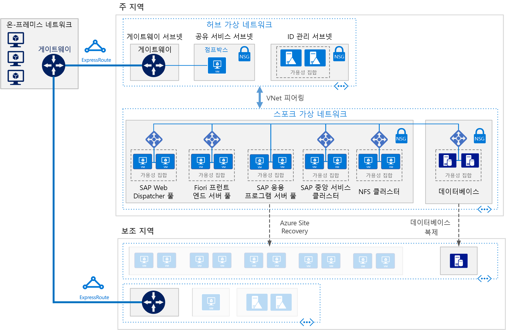

# Azure Virtual Machines에서 AnyDB용 SAP NetWeaver(Windows) 배포

이 참조 아키텍처는 Azure의 Windows 환경에서 고가용성을 통해 SAP NetWeaver를 실행하는 일단의 검증된 사례를 보여 줍니다. AnyDB는 데이터베이스이며, SAP HANA 이외에 지원되는 모든 DBMS에 대한 SAP 용어입니다. 이 아키텍처는 조직의 요구 사항에 맞게 변경할 수 있는 특정 VM(가상 머신) 크기로 배포됩니다.

 
> [!NOTE] 
> 이 참조 아키텍처에 따라 SAP 제품을 배포하려면 SAP 제품 및 Microsoft 이외의 기타 기술에 대한 적절한 라이선스가 필요합니다.

## 아키텍처
이 아키텍처를 구성하는 인프라 및 주요 소프트웨어 구성 요소는 다음과 같습니다.

**가상 네트워크**. Azure Virtual Network 서비스는 Azure 리소스를 서로 안전하게 연결합니다. 이 아키텍처에서 가상 네트워크는 [허브-스포크](../hybrid-networking/hub-spoke.md)의 허브에 배포된 VPN 게이트웨이를 통해 온-프레미스 환경에 연결합니다. 스포크는 SAP 응용 프로그램 및 데이터베이스 계층에 사용되는 가상 네트워크입니다.

**서브넷**. 가상 네트워크는 응용 프로그램(SAP NetWeaver), 데이터베이스, 공유 서비스(jumpbox) 및 Active Directory와 같은 각 계층에 대한 별도의 서브넷으로 세분화됩니다.
    
**가상 머신**. 이 아키텍처는 응용 프로그램 계층과 데이터베이스 계층에 대해 다음과 같이 그룹화된 가상 머신을 사용합니다.

- **SAP NetWeaver**. 응용 프로그램 계층에서 Windows 가상 머신을 사용하고 SAP Central Services와 SAP 응용 프로그램 서버를 실행합니다. Central Services를 실행하는 VM은 SIOS DataKeeper 클러스터 버전에서 지원하는 고가용성을 위한 Windows Server 장애 조치 클러스터로 구성됩니다.
- **AnyDB**. 데이터베이스 계층에서 AnyDB를 원본 데이터베이스(예: Microsoft SQL Server, Oracle 또는 IBM DB2)로 실행합니다.
- **Jumpbox**. 요새 호스트라고도 합니다. 이는 관리자가 다른 가상 머신에 연결하는 데 사용하는 네트워크의 보안 가상 머신입니다.
- **Windows Server Active Directory 도메인 컨트롤러**. 도메인 컨트롤러는 도메인의 모든 VM 및 사용자에 사용됩니다.

**부하 분산 장치**. 기본 제공 SAP 부하 분산 장치와 [Azure Load Balancer](/azure/load-balancer/load-balancer-overview)를 모두 사용하여 HA를 달성합니다. Azure Load Balancer 인스턴스를 사용하여 응용 프로그램 계층 서브넷의 가상 머신에 트래픽을 분산합니다.

**가용성 집합**. SAP Web Dispatcher, SAP 응용 프로그램 서버 및 (A)SCS 역할용 가상 머신은 별도의 [가용성 집합](/azure/virtual-machines/windows/tutorial-availability-sets)으로 그룹화되고, 역할당 둘 이상의 가상 머신이 프로비전됩니다. 이렇게 하면 가상 머신에 더 높은 [SLA(서비스 수준 계약)](https://azure.microsoft.com/support/legal/sla/virtual-machines)를 적용할 수 있습니다.

**NIC**. [NIC(네트워크 인터페이스 카드)](/azure/virtual-network/virtual-network-network-interface)를 사용하면 가상 네트워크의 모든 가상 머신에서 통신할 수 있습니다.

**네트워크 보안 그룹**. [NSG(네트워크 보안 그룹)](/azure/virtual-network/virtual-networks-nsg)는 가상 네트워크에서 들어오는 트래픽, 나가는 트래픽 및 서브넷 간 트래픽을 제한하기 위해 만들 수 있습니다.

**게이트웨이**. 게이트웨이는 온-프레미스 네트워크를 Azure 가상 네트워크로 확장합니다. [ExpressRoute](/azure/architecture/reference-architectures/hybrid-networking/expressroute)는 공용 인터넷을 통해 통신하지 않는 사설 연결을 만드는 데 권장되는 Azure 서비스이지만 [사이트 간 연결](/azure/vpn-gateway/vpn-gateway-howto-site-to-site-resource-manager-portal)도 사용할 수 있습니다.

**Azure Storage**. [Azure Storage](/azure/storage/storage-standard-storage)는 가상 머신의 VHD(가상 하드 디스크)용 영구 저장소를 제공하기 위해 필요합니다. 또한 [클라우드 감시](/windows-server/failover-clustering/deploy-cloud-witness)에서 장애 조치 클러스터 작업을 구현하는 데도 사용됩니다. 

## 권장 사항
개발자의 요구 사항이 여기에 설명된 아키텍처와 다를 수 있습니다. 여기서 추천하는 권장 사항을 단지 시작점으로 활용하세요.

### SAP Web Dispatcher 풀

Web Dispatcher 구성 요소가 SAP 응용 프로그램 서버 간의 SAP 트래픽을 위한 부하 분산 장치로 사용됩니다. Web Dispatcher 구성 요소의 고가용성을 달성하려면 Azure Load Balancer를 사용하여 병렬 Web Dispatcher 설정을 구현합니다. Web Dispatcher는 분산 장치 풀에서 사용할 수 있는 Web Dispatcher 간의 HTTP(S) 트래픽 분산을 위해 라운드 로빈 구성에서 사용합니다.

Azure VM에서 SAP NetWeaver를 실행하는 방법에 대한 자세한 내용은 [SAP NetWeaver에 대한 Azure Virtual Machines 계획 및 구현](/azure/virtual-machines/workloads/sap/planning-guide)을 참조하세요.

### 응용 프로그램 서버 풀

ABAP 응용 프로그램 서버에 대한 로그온 그룹을 관리하기 위해 SMLG 트랜잭션이 사용됩니다. Central Services의 메시지 서버 내에서 부하 분산 기능을 사용하여 SAPGUI 및 RFC 트래픽용 SAP 응용 프로그램 서버 풀 간의 워크로드를 분산합니다. 고가용성 Central Services에 대한 응용 프로그램 서버는 클러스터 가상 네트워크 이름을 통해 연결됩니다.

### SAP Central Services 클러스터

이 참조 아키텍처는 응용 프로그램 계층의 VM에서 Central Services를 실행합니다. 단일 VM에 배포하는 경우(고가용성이 요구 사항이 아닌 경우의 일반적인 배포) Central Services는 잠재적인 SPOF(단일 실패 지점)입니다. 고가용성 솔루션을 구현하기 위해 공유 디스크 클러스터 또는 파일 공유 클러스터를 사용할 수 있습니다.

공유 디스크 클러스터에 대한 VM을 구성하려면 [Windows Server 장애 조치 클러스터](https://blogs.sap.com/2018/01/25/how-to-create-sap-resources-in-windows-failover-cluster/)를 사용합니다. [클라우드 감시](/windows-server/failover-clustering/deploy-cloud-witness)는 쿼럼 감시로 사용하는 것이 좋습니다. 장애 조치 클러스터 환경을 지원하기 위해 [SIOS DataKeeper 클러스터 버전](https://azuremarketplace.microsoft.com/marketplace/apps/sios_datakeeper.sios-datakeeper-8)에서 클러스터 노드가 소유한 독립 디스크를 복제하여 클러스터 공유 볼륨 기능을 수행합니다. Azure는 기본적으로 공유 디스크를 지원하지 않으므로 SIOS에서 제공하는 솔루션이 필요합니다.

자세한 내용은 [Microsoft 플랫폼에서 SAP 응용 프로그램 실행](https://blogs.msdn.microsoft.com/saponsqlserver/2017/05/04/sap-on-azure-general-update-for-customers-partners-april-2017/)의 "3. Azure에서 SIOS의 ASCS를 실행하는 SAP 고객을 위한 중요 업데이트"를 참조하세요.

클러스터링을 처리하는 또 다른 방법은 Windows Server 장애 조치 클러스터를 사용하여 파일 공유 클러스터를 구현하는 것입니다. [SAP](https://blogs.sap.com/2018/03/19/migration-from-a-shared-disk-cluster-to-a-file-share-cluster/)는 UNC 경로를 통해 /sapmnt 전역 디렉터리에 액세스하도록 Central Services 배포 패턴을 수정했습니다. 이 변경에 따라 SIOS 또는 Central Services VM의 다른 공유 디스크 솔루션에 대한 [요구 사항이 제거](https://blogs.msdn.microsoft.com/saponsqlserver/2017/08/10/high-available-ascs-for-windows-on-file-share-shared-disk-no-longer-required/)되었습니다. 그래도 /sapmnt UNC 공유가 [고가용성](https://blogs.sap.com/2017/07/21/how-to-create-a-high-available-sapmnt-share/)인지 확인하는 것이 좋습니다. 이 작업은 Central Services 인스턴스에서 Windows Server 2016의 [SOFS(스케일 아웃 파일 서버)](https://blogs.msdn.microsoft.com/saponsqlserver/2017/11/14/file-server-with-sofs-and-s2d-as-an-alternative-to-cluster-shared-disk-for-clustering-of-an-sap-ascs-instance-in-azure-is-generally-available/) 및 [S2D(저장소 공간 다이렉트)](https://blogs.sap.com/2018/03/07/your-sap-on-azure-part-5-ascs-high-availability-with-storage-spaces-direct/) 기능이 있는 Windows Server 장애 조치 클러스터를 사용하여 수행할 수 있습니다. 

### 가용성 집합

가용성 집합은 서버를 서로 다른 물리적 인프라로 배포하고 그룹을 업데이트하여 서비스 가용성을 향상시킵니다. Azure 인프라 유지 관리로 인한 가동 중지 시간으로부터 보호하고 [SLA(서비스 수준 계약)](https://azure.microsoft.com/support/legal/sla/virtual-machines)를 충족하기 위해 동일한 역할을 수행하는 가상 머신을 가용성 집합에 배치합니다. 가용성 집합당 둘 이상의 가상 머신을 사용하는 것이 좋습니다.

집합의 모든 가상 머신은 동일한 역할을 수행해야 합니다. 동일한 가용성 집합에 역할이 다른 서버를 혼합하지 마세요. 예를 들어 Central Services 노드를 응용 프로그램 서버와 동일한 가용성 집합에 배치하면 안됩니다.

### NIC

기존의 온-프레미스 SAP 배포에서는 비즈니스 트래픽과 관리 트래픽을 분리하기 위해 컴퓨터당 여러 개의 NIC(네트워크 인터페이스 카드)를 구현합니다. Azure에서 가상 네트워크는 동일한 네트워크 구조를 통해 모든 트래픽을 보내는 소프트웨어 정의 네트워크입니다. 따라서 여러 개의 NIC를 사용할 필요가 없습니다. 그러나 조직에서 트래픽을 분리해야 하는 경우 VM당 여러 개의 NIC를 배포하고, 각 NIC를 서로 다른 서브넷에 연결한 다음, NSG를 사용하여 서로 다른 액세스 제어 정책을 적용할 수 있습니다.

### 서브넷 및 NSG

이 아키텍처는 가상 네트워크 주소 공간을 서브넷으로 세분화합니다. 이 참조 아키텍처는 주로 응용 프로그램 계층 서브넷에 중점을 둡니다. 각 서브넷은 해당 서브넷에 대한 액세스 정책을 정의하는 NSG와 연결할 수 있습니다. 응용 프로그램 서버를 별도의 서브넷에 배치하면 개별 서버가 아니라 서브넷 보안 정책을 관리하여 더 쉽게 보안을 유지할 수 있습니다.

NSG가 서브넷과 연결되면 서브넷 내의 모든 서버에 적용됩니다. NSG를 사용하여 서브넷의 서버를 더 자세히 제어하는 방법에 대한 자세한 내용은 [네트워크 보안 그룹을 통한 네트워크 트래픽 필터링](https://azure.microsoft.com/en-us/blog/multiple-vm-nics-and-network-virtual-appliances-in-azure/)을 참조하세요.

### 부하 분산 장치

[SAP Web Dispatcher](https://help.sap.com/doc/saphelp_nw73ehp1/7.31.19/en-US/48/8fe37933114e6fe10000000a421937/frameset.htm)는 SAP 응용 프로그램 서버 풀에 대한 HTTP(S) 트래픽의 부하 분산을 처리합니다.

DIAG 프로토콜 또는 RFC(원격 함수 호출)를 통해 SAP 서버에 연결하는 SAP GUI 클라이언트의 트래픽에 대해 Central Services 메시지 서버는 SAP 응용 프로그램 서버 [로그온 그룹](https://wiki.scn.sap.com/wiki/display/SI/ABAP+Logon+Group+based+Load+Balancing)을 통해 부하를 분산하므로 추가 부하 분산 장치가 필요하지 않습니다.

### Azure Storage

모든 데이터베이스 서버 가상 머신에 대해 일관된 읽기/쓰기 대기 시간을 유지하기 위해 Azure Premium Storage를 사용하는 것이 좋습니다. 모든 운영 체제 디스크 및 데이터 디스크에 Premium Storage를 사용하는 단일 인스턴스 가상 머신의 경우 [Virtual Machines에 대한 SLA](https://azure.microsoft.com/support/legal/sla/virtual-machines)를 참조하세요. 또한 프로덕션 SAP 시스템의 경우 모든 경우에 [Azure Managed Disks](/azure/storage/storage-managed-disks-overview) 프리미엄을 사용하는 것이 좋습니다. 안정성을 위해 Managed Disks를 사용하여 디스크의 VHD 파일을 관리합니다. Managed Disks는 가용성 집합 내의 가상 머신용 디스크를 격리하여 단일 실패 지점을 방지합니다.

Central Services 가상 머신을 포함한 SAP 응용 프로그램 서버의 경우 응용 프로그램 실행이 메모리에서 수행되고 디스크가 로깅에만 사용되기 때문에 Azure Standard Storage를 사용하여 비용을 절감할 수 있습니다. 그러나 이 시점에서 Standard Storage는 관리되지 않는 저장소에 대해서만 인증되었습니다. 응용 프로그램 서버는 어떤 데이터도 호스팅하지 않으므로 더 작은 P4 및 P6 Premium Storage 디스크를 사용하여 비용을 최소화할 수 있습니다.

또한 Azure Storage는 [클라우드 감시](/windows-server/failover-clustering/deploy-cloud-witness)에서 클러스터가 있는 주 지역에서 떨어져 있는 원격 Azure 지역의 장치에서 쿼럼을 유지하는 데도 사용됩니다.

백업 데이터 저장소의 경우 Azure [쿨 액세스 계층](/azure/storage/storage-blob-storage-tiers) 및 [보관 액세스 계층 저장소](/azure/storage/storage-blob-storage-tiers)를 사용하는 것이 좋습니다. 이러한 저장소 계층은 자주 액세스되지 않는 수명이 긴 데이터를 저장하는 비용 효율적인 방법입니다.

## 성능 고려 사항

SAP 응용 프로그램 서버는 데이터베이스 서버와 지속적으로 통신합니다. SAP HANA를 포함한 모든 데이터베이스 플랫폼에서 실행되는 성능이 중요한 응용 프로그램의 경우 [쓰기 가속기](/azure/virtual-machines/linux/how-to-enable-write-accelerator)를 사용하도록 설정하여 로그 쓰기 대기 시간을 향상시키는 것이 좋습니다. 서버 간 통신을 최적화하려면 [가속 네트워크](https://azure.microsoft.com/blog/linux-and-windows-networking-performance-enhancements-accelerated-networking/)를 사용합니다. 이러한 가속기는 특정 VM 시리즈에서만 사용할 수 있습니다.

높은 IOPS 및 대역폭 처리량을 달성하려면 저장소 볼륨 [성능 최적화](/azure/virtual-machines/windows/premium-storage-performance)의 일반 사례를 Azure 저장소 레이아웃에 적용합니다. 예를 들어 여러 디스크를 결합하여 스트라이프 디스크 볼륨을 만들면 IO 성능이 향상됩니다. 자주 변경되지 않는 저장소 콘텐츠에 읽기 캐시를 사용하면 데이터 검색 속도가 향상됩니다.

SAP on SQL의 경우 [Azure에 SAP 응용 프로그램을 배포하기 위한 상위 10개 주요 고려 사항](https://blogs.msdn.microsoft.com/saponsqlserver/2015/05/25/top-10-key-considerations-for-deploying-sap-applications-on-azure/) 블로그에서 SQL Server의 SAP 워크로드에 대한 Azure 저장소 최적화에 대한 훌륭한 조언을 제공합니다.

## 확장성 고려 사항

SAP 응용 프로그램 계층에서 Azure는 강화 및 확장을 위한 다양한 가상 머신 크기를 제공합니다. 전체 목록은 [SAP Note 1928533](https://launchpad.support.sap.com/#/notes/1928533) - Azure의 SAP 응용 프로그램: 지원되는 제품 및 Azure VM 유형을 참조하세요. (여기에 액세스하려면 SAP Service Marketplace 계정이 필요합니다.) SAP 응용 프로그램 서버 및 Central Services 클러스터는 인스턴스를 추가하여 강화/축소 및 확장할 수 있습니다. AnyDB 데이터베이스는 강화/축소할 수 있지만 확장할 수는 없습니다. AnyDB용 SAP 데이터베이스 컨테이너는 분할을 지원하지 않습니다.

## 가용성 고려 사항

리소스 중복성은 고가용성 인프라 솔루션의 일반적인 주제입니다. 비교적 엄격하지 않은 SLA가 적용된 엔터프라이즈의 경우 단일 인스턴스 Azure VM에서 가동 시간 SLA를 제공합니다. 자세한 내용은 [Azure 서비스 수준 계약](https://azure.microsoft.com/support/legal/sla/)을 참조하세요.

SAP 응용 프로그램의 이러한 분산 설치에서는 고가용성을 달성하기 위해 기본 설치가 복제됩니다. 아키텍처의 각 계층마다 고가용성 설계가 다릅니다.

### 응용 프로그램 계층

SAP Web Dispatcher의 고가용성은 중복 인스턴스를 통해 달성됩니다. SAP 설명서의 [SAP Web Dispatcher](https://help.sap.com/doc/saphelp_nw70ehp2/7.02.16/en-us/48/8fe37933114e6fe10000000a421937/frameset.htm)를 참조하세요.

Central Services의 고가용성은 Windows Server 장애 조치 클러스터를 통해 구현됩니다. Azure에 배포할 때 장애 조치 클러스터용 클러스터 저장소는 클러스터된 공유 볼륨 또는 파일 공유의 두 가지 접근 방식을 통해 구성할 수 있습니다.

Azure에서는 공유 디스크를 사용할 수 없기 때문에 SIOS Datakeeper를 사용하여 클러스터 노드에 연결된 독립 디스크의 내용을 복제하고 드라이브를 클러스터 관리자용 클러스터 공유 볼륨으로 추상화합니다. 구현에 대한 자세한 내용은 [Azure에서 SAP ASCS 클러스터링](https://blogs.msdn.microsoft.com/saponsqlserver/2015/05/20/clustering-sap-ascs-instance-using-windows-server-failover-cluster-on-microsoft-azure-with-sios-datakeeper-and-azure-internal-load-balancer/)을 참조하세요.

또 다른 옵션은 [SOFS(스케일 아웃 파일 서버)](https://blogs.msdn.microsoft.com/saponsqlserver/2017/11/14/file-server-with-sofs-and-s2d-as-an-alternative-to-cluster-shared-disk-for-clustering-of-an-sap-ascs-instance-in-azure-is-generally-available/)에서 제공하는 파일 공유를 사용하는 것입니다. SOFS는 Windows 클러스터용 클러스터 공유 볼륨으로 사용할 수 있는 복원 가능한 파일 공유를 제공합니다. SOFS 클러스터는 여러 Central Services 노드 간에 공유할 수 있습니다. 이 문서를 작성한 시점에서 SOFS 클러스터는 여러 지역으로 재해 복구 지원을 제공하도록 확장되지 않으므로 고가용성 설계에만 사용됩니다.

SAP 응용 프로그램 서버의 고가용성은 응용 프로그램 서버 풀 내에서 트래픽 부하를 분산하여 달성됩니다.
[Microsoft Azure에서 실행되는 SAP 인증 및 구성](/azure/virtual-machines/workloads/sap/sap-certifications)을 참조하세요.

### 데이터베이스 계층

이 참조 아키텍처는 원본 데이터베이스가 AnyDB, 즉 SQL Server, SAP ASE, IBM DB2 또는 Oracle과 같은 DBMS에서 실행된다고 가정합니다. 데이터베이스 계층의 기본 복제 기능은 복제된 노드 간에 수동 또는 자동 장애 조치를 제공합니다.

특정 데이터베이스 시스템의 구현에 대한 자세한 내용은 [SAP NetWeaver에 대한 Azure Virtual Machines DBMS 배포](/azure/virtual-machines/workloads/sap/dbms-guide)를 참조하세요.

## 재해 복구 고려 사항

DR(재해 복구)의 경우 장애 조치를 보조 지역으로 수행할 수 있어야 합니다. 각 계층은 서로 다른 전략을 사용하여 재해 복구(DR) 보호를 제공합니다.

- **응용 프로그램 서버 계층**. SAP 응용 프로그램 서버에는 비즈니스 데이터가 포함되어 있지 않습니다. Azure에서 간단한 DR 전략은 보조 지역에 SAP 응용 프로그램 서버를 만든 다음, 종료하는 것입니다. 주 응용 프로그램 서버의 구성이 업데이트되거나 커널이 업데이트되는 즉시 동일한 변경 내용을 보조 지역의 가상 머신에 복사해야 합니다. 예를 들어 커널 실행 파일을 DR 가상 머신에 복사합니다. 응용 프로그램 서버를 보조 지역에 자동으로 복제하려면 [Azure Site Recovery](/azure/site-recovery/site-recovery-overview)가 권장되는 솔루션입니다.

- **Central Services**. 이 SAP 응용 프로그램 스택의 구성 요소도 비즈니스 데이터를 유지하지 않습니다. 재해 복구 지역에 VM을 구축하여 Central Services 역할을 실행할 수 있습니다. 주 Central Services 노드에서 동기화할 수 있는 유일한 콘텐츠는 /sapmnt 공유 콘텐츠입니다. 또한 주 Central Services 서버에서 구성이 업데이트되거나 커널이 업데이트되면 Central Services를 실행하는 재해 복구 지역의 VM에서 반복해야 합니다. 두 서버를 동기화하려면 Azure Site Recovery를 사용하여 클러스터 노드를 복제하거나, 정기적으로 예약된 복사 작업을 사용하여 /sapmnt를 재해 복구 지역에 복사하면 됩니다. 이 간단한 복제 방법의 장애 조치 프로세스 빌드, 복사 및 테스트에 대한 자세한 내용은 [SAP NetWeaver: Hyper-V 및 Microsoft Azure 기반 재해 복구 솔루션 빌드](http://download.microsoft.com/download/9/5/6/956FEDC3-702D-4EFB-A7D3-2DB7505566B6/SAP%20NetWeaver%20-%20Building%20an%20Azure%20based%20Disaster%20Recovery%20Solution%20V1_5%20.docx)를 다운로드하여 "4.3. SAP SPOF 레이어(ASCS)"를 참조하세요.

- **데이터베이스 계층**. DR은 데이터베이스 자체의 통합 복제 기술로 구현하는 것이 가장 좋습니다. 예를 들어 SQL Server의 경우 AlwaysOn 가용성 그룹을 사용하여 원격 지역에 복제본을 설정하고 수동 장애 조치를 통해 비동기적으로 트랜잭션을 복제하는 것이 좋습니다. 비동기 복제는 주 사이트에서 대화형 워크로드의 성능에 미치는 영향을 방지합니다. 수동 장애 조치는 사용자가 DR 영향을 평가하고 DR 사이트에서 운영하는 것이 정당한지 결정할 수 있는 기회를 제공합니다.

Azure Site Recovery를 사용하여 원래 사이트가 완전히 복제된 사이트를 자동으로 구축하려면 사용자 지정 [배포 스크립트](/azure/site-recovery/site-recovery-runbook-automation)를 실행해야 합니다. Site Recovery는 먼저 가용성 집합에 VM을 배포한 다음, 스크립트를 실행하여 부하 분산 장치와 같은 리소스를 추가합니다.

## 관리 효율성 고려 사항

Azure는 전체 인프라를 [모니터링 및 진단](/azure/architecture/best-practices/monitoring)하는 몇 가지 기능을 제공합니다. 또한 Azure OMS(Operations Management Suite)에서는 Azure 가상 머신의 향상된 모니터링을 처리합니다.

SAP 인프라의 리소스 및 서비스 성능에 대한 SAP 기반 모니터링을 제공하기 위해 [Azure SAP 고급 모니터링 확장](/azure/virtual-machines/workloads/sap/deployment-guide#detailed-tasks-for-sap-software-deployment)을 사용합니다. 이 확장은 SAP 응용 프로그램에 운영 체제 모니터링 및 DBA Cockpit 함수에 대한 Azure 모니터링 통계를 제공합니다.

## 보안 고려 사항

SAP는 자체적인 UME(사용자 관리 엔진)를 사용하여 SAP 응용 프로그램의 역할 기반 액세스 및 권한 부여를 제어합니다. 자세한 내용은 [ABAP용 SAP NetWeaver 응용 프로그램 서버 보안 가이드](https://help.sap.com/doc/7b932ef4728810148a4b1a83b0e91070/1610 001/en-US/frameset.htm?4dde53b3e9142e51e10000000a42189c.html) 및 [SAP NetWeaver 응용 프로그램 서버 Java 보안 가이드](https://help.sap.com/doc/saphelp_snc_uiaddon_10/1.0/en-US/57/d8bfcf38f66f48b95ce1f52b3f5184/frameset.htm)를 참조하세요.

추가 네트워크 보안을 위해 네트워크 가상 어플라이언스를 사용하여 Web Dispatcher의 서브넷 앞에 방화벽을 만드는 [네트워크 DMZ](../dmz/secure-vnet-hybrid.md)를 구현하는 것이 좋습니다.

인프라 보안을 위해 전송 중 데이터와 미사용 데이터가 암호화됩니다. [SAP NetWeaver에 대한 Azure VMs(Virtual Machines) 계획 및 구현 가이드](/azure/virtual-machines/workloads/sap/planning-guide)의 "보안 고려 사항" 섹션에서 네트워크 보안 처리를 다루고 있습니다. 이 가이드에서는 응용 프로그램 통신을 허용하기 위해 방화벽에서 열어야 하는 네트워크 포트도 지정합니다.

Windows 가상 머신 디스크를 암호화하기 위해 [Azure Disk Encryption](/azure/security/azure-security-disk-encryption)을 사용할 수 있습니다. Windows의 BitLocker 기능을 사용하여 운영 체제 및 데이터 디스크에 대한 볼륨 암호화를 제공합니다. 또한 이 솔루션은 Azure Key Vault와 함께 작동하여 키 자격 증명 모음 구독에서 디스크 암호화 키와 비밀을 제어하고 관리할 수 있습니다. 가상 머신 디스크의 데이터는 미사용 시 Azure 저장소에 암호화됩니다.

## 커뮤니티

커뮤니티는 질문에 대답하고 성공적인 배포를 설정하는 데 도움을 줄 수 있습니다. 다음을 고려해 보세요.

- [Microsoft 플랫폼에서 SAP 응용 프로그램 실행 블로그](https://blogs.msdn.microsoft.com/saponsqlserver/2017/05/04/sap-on-azure-general-update-for-customers-partners-april-2017/)
- [Azure 커뮤니티 지원](https://azure.microsoft.com/support/community/)
- [SAP 커뮤니티](https://www.sap.com/community.html)
- [스택 오버플로](https://stackoverflow.com/tags/sap/)

