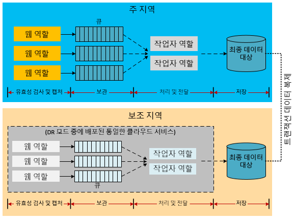
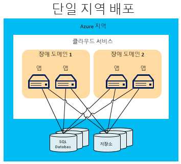
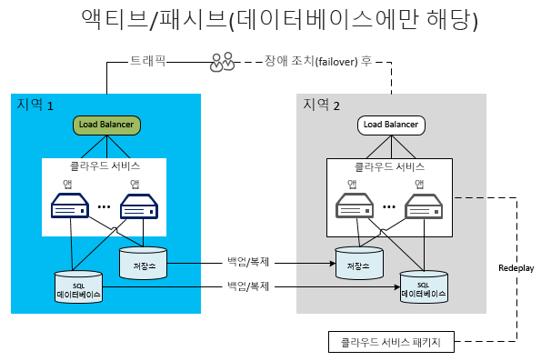
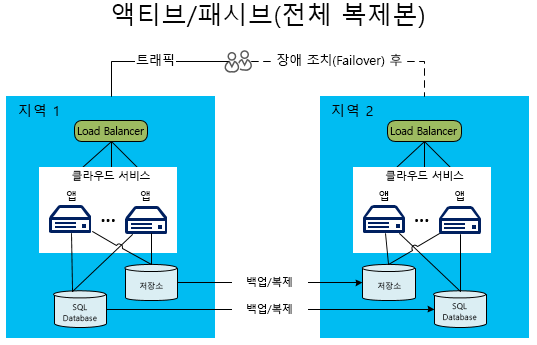
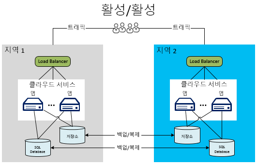

[!INCLUDE [header](../_includes/header.md)]
# Microsoft Azure에 구축된 응용 프로그램의 재해 복구
고가용성은 일시적 오류 관리에 관한 것이지만, 재해 복구(DR)는 응용 프로그램 기능의 치명적 손실에 관한 것입니다. 예를 들어 한 지역이 다운되는 시나리오를 생각해보십시오. 이 경우, Azure 지역 밖에 있는 데이터에 액세스하거나 응용 프로그램을 실행할 계획을 보유하는 것이 필요합니다. 이 계획을 실행하려면 시스템 작동을 허용하는 사람, 프로세스 및 지원 응용 프로그램이 필요합니다. 재해에 대비한 시스템 운영 모드를 정의하는 비즈니스 및 기술 소유자는 또한 재해 기간 중 서비스의 기능 수준도 정의해야 합니다. 기능 수준은 몇 가지 형태 즉 완전히 사용 불가, 부분적 사용 가능 (저하된 기능 또는 지연된 처리) 또는 완전히 사용 가능한 형태가 있습니다.

## Azure 재해 복구의 특징
가용성 고려사항과 마찬가지로, Azure에는 재해 복구를 지원하도록 설계된 [복원 기술 지침](./index.md)이 있습니다. 또한 Azure의 일부 가용성 특징과 재해 복구 간에는 관계가 있습니다. 예를 들어 장애 도메인 전체에 걸쳐 역할을 관리하면 응용 프로그램의 가용성이 향상됩니다. 관리가 없다면 처리되지 못한 하드웨어 고장이 "재해" 시나리오가 될 것입니다. 그러므로 가용성 기능과 전략을 올바로 적용하는 것은 응용 프로그램의 재해 방지에서 중요한 부분입니다.  하지만 이 문서에서는 일반적인 가용성 문제를 벗어나 보다 심각한 (드문) 재해 사건까지 다룹니다.

## 다수의 데이터센터 지역
Azure는 전 세계 다수의 지역에서 데이터센터를 유지하고 있습니다. 이러한 인프라는 시스템에 의해 Azure Storage를 예비 지역으로 복제하는 지리적 복제 등 몇 가지 재해 복구 시나리오를 지원합니다. 이는 또한 클라우드 서비스를 전 세계 다수의 지역에 손쉽고 저렴하게 배포할 수 있음을 의미합니다. 이 상황을 자체 데이터센터를 여러 지역에서 운영할 때의 비용 및 어려움과 비교해보십시오. 데이터와 서비스를 여러 지역에 배포하면 응용 프로그램을 단일 지역의 중대한 중단으로부터 보호하는 데 도움이 됩니다.

## Azure Traffic Manager
지역에 국한된 실패가 발생할 경우 트래픽을 다른 지역에 있는 서비스나 배포로 리디렉션해야 합니다. 이 라우팅은 수동으로 할 수 있지만 자동 프로세스를 사용하면 더욱 효율적입니다. Azure Traffic Manager는 이러한 작업을 위해 설계되었습니다. 기본 지역에 장애가 발생한 경우, 이를 통해서 장애 발생 시 사용자 트래픽을 다른 지역으로 넘기는 관리작업을 자동으로 수행할 수 있습니다. 트래픽 관리는 전체 전략의 중요한 부분이므로 Traffic Manager의 기본을 이해하는 것이 중요합니다.

아래 다이어그램에서는 사용자가 Traffic Manager용 (`http://myATMURL.trafficmanager.net`)으로 지정되어 있고 실제 사이트 URL `http://app1URL.cloudapp.net` 및 `http://app2URL.cloudapp.net`)을 추상화한 URL에 연결합니다. 사용자 라우팅 시기에 관한 기준 구성 방법에 따라 정책이 지시할 경우 사용자를 올바른 실제 사이트로 보냅니다. 정책 옵션으로는 라운드 로빈, 성능 또는 장애 조치가 있습니다. 이 문서에서는 장애 조치(failover) 옵션만 다루겠습니다.

Traffic Manager를 구성할 때 새로운 Traffic Manager DNS 접두사를 제공합니다. 이것이 서비스 액세스를 위해 사용자들에게 제공할 URL 접두사입니다. 이제 Traffic Manager는 지역 수준이 아닌 한 차원 높게 부하 분산을 추상화합니다. Traffic Manager DNS는 모든 관리 대상 배포의 CNAME에 매핑됩니다.

Traffic Manager 내에서, 장애 발생 시 사용자들을 라우팅할 배포의 우선 순위를 지정합니다. 기본 배포에 장애가 발생하면 Traffic Manager는 배포의 끝점과 메모를 모니터링합니다. 장애 발생 시 Traffic Manager가 배포의 우선순위 목록을 분석하여 사용자들을 목록의 다음 배포로 라우팅합니다.

Traffic Manager가 장애 조치 시 어디로 가야 하는지 결정하지만, 장애 조치 모드에 있지 않을 때 장애 조치 도메인이 유휴 상태 또는 활성 상태인지 여부를 결정할 수 있습니다. 그 기능은 Azure Traffic Manager와 아무런 관계가 없습니다. Traffic Manager는 기본 사이트에서 장애를 감지하여 장애 조치 사이트로 롤오버합니다. Traffic Manager는 해당 사이트가 현재 사용자에게 서비스를 제공하는지 여부에 관계 없이 롤오버를 수행합니다.

Azure Traffic Manager 작동 방식에 관한 자세한 내용은 다음을 참조하십시오.

* [Traffic Manager 개요](/azure/traffic-manager/traffic-manager-overview/)
* [장애 조치 라우팅 방법의 구성](/azure/traffic-manager/traffic-manager-configure-failover-routing-method/)

## Azure 재해 시나리오
아래 섹션에서는 몇 가지 재해 시나리오 유형을 설명합니다. 지역 전체의 서비스 중단이 응용 프로그램 전체의 오류를 야기하는 유일한 원인이 아닙니다. 부실한 설계 또는 관리 오류도 중단을 야기할 수 있습니다. 복구 계획의 설계 및 테스트 단계 모두에서 장애의 예상 원인을 고려하는 것이 중요합니다. 좋은 계획은 Azure 기능을 활용하고 응용 프로그램별 전략을 통해서 그 기능을 강화합니다. 선택된 대응 방법은 응용 프로그램의 중요성, 복구 지점 목표(RPO) 및 복구 시간 목표(RTO)에 의해 지시됩니다.

### 응용 프로그램 오류
Azure Traffic Manager는 호스트 가상 컴퓨터의 기본 하드웨어 또는 운영 체제 소프트웨어에서 발생하는 장애(오류)를 자동으로 처리합니다. Azure가 작동 중인 서버의 새로운 역할 인스턴스를 생성하여 부하 분산 장치 회전에 추가시킵니다. 역할 인스턴스의 수가 한 개를 초과할 경우, Azure가 실패한 노드를 대체하면서 처리를 다른 실행 중인 역할로 전환합니다.

하드웨어 또는 운영 체제 장애와는 별개로 발생하는 심각한 응용 프로그램 오류가 있습니다. 불량 논리 또는 데이터 무결성 문제로 야기된 치명적 예외로 인하여 응용 프로그램에 오류가 발생할 수 있습니다. 모니터링 시스템이 오류 상황을 감지하고 응용 프로그램 관리자에게 알릴 수 있도록 충분한 원격 분석 기능을 코드에 포함시켜야 합니다. 재해 복구 프로세스에 관하여 전반적 지식을 보유한 관리자는 장애 조치 프로세스 호출 결정을 할 수 있습니다. 또는 관리자가 심각한 오류를 해결하기 위해 가용성 중단을 단순히 수용할 수도 있습니다.

### 데이터 손상
Azure는 Azure SQL Database 및 Azure Storage 데이터를 동일 지역의 다른 장애 도메인 내에 세 번 중복되게 저장합니다. 지리적 복제를 사용할 경우 데이터는 다른 지역에 추가로 세 번 저장됩니다. 하지만 사용자나 응용 프로그램이 주 복사본에 있는 데이터를 손상시킬 경우 데이터가 신속히 다른 복사본으로 복제됩니다. 그러면 유감스럽게도 손상된 데이터 복사본이 세 개가 생깁니다.

데이터의 손상 가능성을 관리하는 데에는 두 개의 옵션이 있습니다. 첫째, 사용자 지정 백업 전략을 관리할 수 있습니다. 비즈니스 요구 사항 또는 거버넌스 규정에 따라 백업 자료를 Azure 또는 온프레미스에 저장할 수 있습니다. 또 하나의 옵션으로서, SQL 데이터베이스 복구를 위해 새로운 시점 복원 옵션을 사용할 수 있습니다. 자세한 내용은 [재해 복구를 위한 데이터 전략](#data-strategies-for-disaster-recovery)에 관한 섹션을 참조하십시오.

### 네트워크 중단
Azure 네트워크의 일부에 액세스할 수 없을 경우, 원하는 응용 프로그램이나 데이터에 접근하지 못할 수 있습니다. 네트워크 문제로 인하여 한 개 이상의 인스턴스를 사용할 수 없을 경우, Azure는 해당 응용 프로그램의 사용 가능한 나머지 인스턴스를 사용합니다. Azure 네트워크 중단 때문에 응용 프로그램이 해당 데이터에 액세스할 수 없을 경우, 캐시된 데이터를 사용하여 기능 저하 모드로 로컬로 실행하는 것도 가능할 수 있습니다. 응용 프로그램에서 기능 저하 모드로 실행하는 재해 복구 전략을 설계하는 것이 필요합니다. 일부 응용 프로그램의 경우 이것이 불가능할 수 있습니다.

또 하나의 옵션은 연결이 복원될 때까지 데이터를 대체 위치에 저장하는 것입니다. 기능 저하 모드가 옵션이 아닌 경우, 나머지 옵션은 응용 프로그램의 가동 중지 시간을 선택하거나 대체 지역으로 장애 조치를 취하는 것입니다. 기능 저하 모드에서 실행하는 응용 프로그램의 설계는 기술적 결정이라기보다는 비즈니스 결정에 가깝습니다. 이 내용은 [저하된 응용 프로그램 기능](#degraded-application-functionality)에 관한 섹션에서 자세히 설명합니다.

### 종속 서비스의 오류
Azure는 정기적으로 가동 중지가 발생할 수 있는 다수의 서비스를 제공하고 있습니다. 예를 들어 [Azure Redis Cache](https://azure.microsoft.com/services/cache/)를 생각해보십시오. 이 멀티테넌트 서비스를 응용 프로그램에 캐싱 기능을 제공합니다. 종속 서비스를 사용할 수 없을 경우에 응용 프로그램에 어떤 상황이 발생하는지 고려하는 것이 중요합니다. 이 시나리오는 여러 측면에서 네트워크 중단 시나리오와 유사합니다. 하지만 각각의 서비스를 독립적으로 고려하면 전반적 계획이 개선될 가능성이 있습니다.

Azure Redis Cache는 클라우드 서비스 배포 내에서 응용 프로그램에 대한 캐싱 기능을 제공함으로써 재해 복구 혜택을 제공합니다. 먼저, 이제는 이 서비스가 배포의 로컬 역할에서 실행됩니다. 그러므로 클라우드 서비스의 전반적 관리 프로세스의 일환으로 캐시 상태를 더욱 잘 모니터링하고 관리할 수 있습니다. 또한 이러한 캐싱 유형은 새로운 기능도 지원합니다. 새로운 기능 중 하나는 캐시된 데이터의 고가용성입니다. 이는 다른 노드에 중복 복사본을 유지함으로써 단일 노드 실패 시 캐시된 데이터를 보존하는 데 도움이 됩니다.

보조 복사본의 기록을 업데이트해야 하므로 높은 가용성은 처리량을 낮추고 대기 시간을 증가시킵니다. 또한 각 항목에 사용되는 메모리의 양도 두 배가 되므로 그에 대한 계획을 세워야 합니다. 이 특정한 예는 각 종속 서비스가 전반적 가용성과 치명적 장애에 대한 저항성을 높이는 기능을 보유할 수 있음을 나타내고 있습니다.

각 종속 서비스에 대해, 서비스 중단 시의 영향을 이해해야 합니다. 캐싱의 예를 들면, 캐시를 복원할 때까지 데이터베이스의 데이터에 직접 액세스하는 것이 가능할 수 있습니다. 이는 성능이 저하된 모드에서 이루어지겠지만 데이터와 관련해서는 완전한 기능을 제공할 것입니다.

### 지역 전체의 서비스 중단
이전의 장애들은 주로 동일한 Azure 지역 내에서 관리할 수 있는 장애였습니다. 하지만 전체 지역의 서비스 중단이 발생할 가능성에도 대비해야 합니다. 지역 전체의 서비스 중단이 발생하면 로컬에 있는 중복 데이터 복사본을 사용할 수 없습니다. 지리적 복제를 사용하는 것으로 설정했을 경우, 세 개의 추가적인 blob 및 표 복사본을 다른 지역에 보유하게 됩니다. Microsoft가 지역의 손실을 선언할 경우 Azure가 모든 DNS 항목을 지리적 복제 지역에 다시 매핑시킵니다.

> [!참고]
> 이 프로세스에 대한 통제를 하지 않을 경우 지역 전체 서비스 중단의 경우에만 이 상황이 발생한다는 점에 유의하십시오. 그렇기 때문에 최고 수준의 가용성을 달성하려면 다른 응용 프로그램별 백업 전략에 의존해야 합니다. 자세한 내용은 [재해 복구를 위한 데이터 전략](#data-strategies-for-disaster-recovery)에 관한 섹션을 참조하십시오.
> 
> 

### Azure 전체 서비스 중단
재해 계획 시에는 예상되는 재해의 전체 범위를 고려해야 합니다. 가장 심각한 서비스 중단 중 하나는 모든 Azure 지역에 동시에 발생하는 것입니다. 다른 서비스 중단과 마찬가지로, 그 상황에서는 일시적 가동 중지 시간의 위험도 감수하는 결정이 필요할 수 있습니다. 여러 지역에 걸쳐 널리 퍼진 서비스 중단은 종속 서비스 또는 단일 지역에서 격리되어 발생하는 서비스 중단보다는 드문 경우입니다.

하지만 일부 중요 업무용 응용 프로그램의 경우, 이 시나리오에 대해서도 백업 계획을 마련해야 한다는 결정을 할 수 있습니다. 이러한 이벤트에 대한 계획에는 [대체 클라우드](#alternative-cloud) 또는 [하이브리드 온프레미스 및 클라우드 솔루션](#hybrid-on-premises-and-cloud-solution)에 있는 서비스로 장애 조치하는 것이 포함될 수 있습니다.

### 저하된 응용 프로그램 기능
잘 설계된 응용 프로그램에서는 일반적으로 느슨하게 결합된 정보 교환 패턴을 구현하여 서로 통신하는 일련의 모듈들이 사용됩니다. DR 친화형 응용 프로그램은 모듈 수준에서 작업들을 분리하는 것이 필요합니다. 이는 독립 서비스의 중단이 전체 응용 프로그램을 중지시키는 것을 방지하기 위함입니다. 예를 들어 Y 회사를 위한 웹 커머스 응용 프로그램을 생각해보겠습니다. 이 응용 프로그램에는 아래의 모듈이 포함될 수 있습니다.

* **제품 카탈로그:** 사용자들이 제품을 찾아볼 때 사용합니다.
* **장바구니:** 사용자들이 장바구니에 제품을 추가/제거할 때 사용합니다.
* **주문 상태:** 사용자 주문의 배송 상태를 표시합니다.
* **주문 제출:** 결제와 함께 주문을 제출함으로써 쇼핑 세션을 마무리합니다.
* **주문 처리:** 주문의 데이터 무결성을 확인하고 수량이 있는지 확인합니다.

이 응용 프로그램 모듈의 종속 항목이 다운될 경우, 해당 부분이 복구될 때까지 모듈이 어떻게 작동합니까? 잘 설계된 시스템은 설계 시점 및 런타임 시에도 작업 분리를 통해서 격리 경계를 구현합니다. 모든 장애는 복구 가능 및 복구 불가능 범주로 구분할 수 있습니다. 복구 불가능 오류는 해당 모듈을 해제하지만, 대체 수단을 통해서 복구 가능한 오류를 완화할 수 있습니다. 고가용성 섹션에서 설명했듯이, 결함을 처리하고 대체 조치를 취함으로써 일부 문제들을 사용자에게 숨길 수 있습니다. 보다 심각한 서비스 중단이 있는 동안에는 응용 프로그램을 완전히 사용하지 못할 수도 있습니다. 하지만 세 번째 옵션은 기능 저하 모드에서 사용자들에 대한 서비스를 지속하는 것입니다.

예를 들어, 주문 호스팅 데이터베이스가 다운될 경우, 주문 처리 모듈은 매출 거래 처리 기능을 상실하게 됩니다. 아키텍처에 따라 응용 프로그램의 주문 제출 및 주문 처리 부분을 계속 운용하는 것이 어렵거나 불가능할 수도 있습니다. 응용 프로그램이 이 시나리오를 처리하도록 설계되지 않았다면, 전체 응용 프로그램이 오프라인 상태가 될 수 있습니다.

하지만 동일한 시나리오에서 제품 데이터를 다른 위치에 저장하는 것이 가능합니다. 이 경우 제품 카탈로그 모듈은 제품 조회를 위해 계속 사용할 수 있습니다. 기능 저하 모드에서는 응용 프로그램의 제품 카탈로그 보기 등 사용 가능한 기능을 사용자가 계속 이용할 수 있습니다. 하지만 응용 프로그램의 다른 부분들(예: 주문 또는 재고 질의)은 사용할 수 없습니다.

기능 저하 모드의 또 하나의 변형은 기능이 아닌 성능에 중점을 두는 것입니다. 예를 들어, 제품 카탈로그가 Azure Redis Cache를 통해서 캐시되는 시나리오를 생각해보십시오. 카탈로그를 사용할 수 없게 되면, 응용 프로그램이 서버 저장소로 직접 가서 제품 카탈로그 정보를 가져올 수 있습니다. 하지만 이러한 액세스는 캐시된 버전보다 훨씬 느립니다. 따라서 캐싱 서비스가 완전히 복원될 때까지는 응용 프로그램 성능이 저하됩니다.

기능 저하 모드에서 얼마나 많은 응용 프로그램이 계속 작동할 것인가에 대한 결정은 비즈니스 결정이면서 동시에 기술적 결정입니다. 또한 응용 프로그램은 사용자들에게 임시 문제를 알리는 방법도 결정해야 합니다. 이 예에서 응용 프로그램은 제품 보기, 심지어 제품을 장바구니에 추가하는 것까지 허용할 수 있습니다. 하지만 사용자가 구매를 시도할 때, 응용 프로그램이 사용자에게 판매 모듈에 일시적으로 액세스할 수 없음을 알려줍니다. 이것이 고객들에게는 바람직하지 않지만, 응용 프로그램 전반에 걸친 서비스 중단을 방지합니다.

## 재해 복구를 위한 데이터 전략
재해 복구 계획에 바로 진입할 때 가장 어려운 부분이 올바른 데이터 처리입니다. 또한 데이터 복원은 일반적으로 대부분의 시간이 소비되는 복구 프로세스 부분입니다. 기능 저하 모드에서 다양한 선택을 하면 장애 데이터 복구 그리고 장애 후 공정성 및 일관성 유지에 도전하는 것이 어렵게 됩니다.

그 중 한 가지 요소는 응용 프로그램 데이터 복사본을 복원하거나 유지해야 할 필요성입니다. 이 데이터는 보조 사이트에서 참조 및 트랜잭션 목적으로 사용합니다. 온프레미스 환경에서 다중 지역 재해 복구 전략을 구현하는 것은 비용이 많이 들고 장시간의 계획 프로세스가 필요합니다. 편리하게도 Azure를 포함한 대부분의 클라우드 제공자들은 여러 지역에 응용 프로그램을 손쉽게 배포하도록 지원합니다. 이들 지역은 여러 지역에서 서비스 중단이 발생하는 것이 지극히 어렵도록 지리적으로 분산되어 있습니다. 여러 지역에 걸친 데이터 취급 전략은 재해 복구 계획의 성공에 기여하는 여러 요소들 중 하나입니다.

아래 섹션에서는 데이터 백업, 참조 데이터 및 트랜잭션 데이터와 관련된 재해 복구 기법을 설명합니다.

### 백업 및 복원
응용 프로그램 데이터의 정기적인 백업은 일부 재해 복구 시나리오를 지원할 수 있습니다. 다양한 저장소 리소스에서 다양한 기법들을 요구합니다.

기본, 표준, 프리미엄 SQL 데이터베이스 계층의 경우 데이터베이스 복구를 위해 특정 시점 복원을 활용할 수 있습니다. 자세한 내용은 [개요: SQL 데이터베이스를 통한 클라우드 비즈니스 연속성 및 데이터베이스 재해 복구](/azure/sql-database/sql-database-business-continuity/)를 참조하십시오. 또 하나의 옵션은 SQL 데이터베이스용 활성 지리적 복제(Active Geo-Replication)를 사용하는 것입니다. 이는 데이터베이스 변경 내용을 동일한 Azure 지역 심지어 다른 Azure 지역에 있는 보조 데이터베이스에 자동으로 복제합니다. 그리고 이 문서에서 제기하는 보다 수동적인 데이터 동기화 기법의 일부에 대해 잠재적 대안을 제공합니다. 자세한 내용은 [개요: SQL 데이터베이스 활성 지리적 복제](/azure/sql-database/sql-database-geo-replication-overview/)를 참조하십시오.

또한 보다 수동적인 백업 및 복원 접근법을 사용할 수도 있습니다. 데이터베이스 복사복을 생성하려면 DATABASE COPY 명령을 사용합니다. 이 명령은 트랜잭션 일관성이 있는 백업을 얻을 때 사용해야 합니다. 또한 Azure SQL Database의 가져오기/내보내기 서비스를 사용할 수도 있습니다. 이 서비스는 데이터베이스를 Azure Blob 저장소에 저장되는 BACPAC 파일로 내보내는 것을 지원합니다.

Azure Storage의 내장된 중복성은 동일 지역에서 백업 파일 복제본을 두 개 만듭니다. 하지만 백업 프로세스 실행 빈도가 RPO를 결정하며, 이것은 재해 시나리오에서 손실될 수 있는 데이터의 양입니다. 예를 들어 매번 정시에 백업을 수행하는데 재해가 정시 2분 전에 발생했다고 가정하겠습니다. 그러면 최근 백업 수행 이후로 발생했던 58분 분량의 데이터가 손실됩니다. 또한 지역 전체 서비스 중단을 방지하려면 BACPAC 파일을 대체 지역에 복사해야 합니다. 그 다음에, 그러한 백업을 대체 지역에 복구하는 옵션이 있습니다. 자세한 내용은 [개요: SQL 데이터베이스를 통한 클라우드 비즈니스 연속성 및 데이터베이스 재해 복구](/azure/sql-database/sql-database-business-continuity/)를 참조하십시오.

Azure Storage의 경우 자체 사용자 지정 백업 프로세스를 개발하거나 또는 여러 타사 백업 도구 중 하나를 사용할 수 있습니다. 대부분의 응용 프로그램 설계에는 저장소 리소스들이 서로 참조하는 추가적인 복잡성이 있다는 점에 유의하십시오. 예를 들어, Azure Storage의 Blob에 링크되는 열을 가진 SQL 데이터베이스를 생각해보십시오. 백업이 동시에 발생하지 않을 경우, 장애 발생 전에 백업되지 않았던 Blob에 대한 포인터가 데이터베이스에 있을 수 있습니다. 응용 프로그램 또는 재해 복구 계획은 복구 후에 이러한 불일치를 처리할 프로세스를 구현해야 합니다.

### 재해 복구를 위한 참조 데이터 패턴
참조 데이터는 읽기 전용 데이터로서 응용 프로그램 기능을 지원합니다. 일반적으로 이는 자주 변경되지는 않습니다. 백업 및 복원이 지역 전체의 서비스 중단을 처리하는 한 방법이기는 하지만, RTO는 비교적 깁니다. 응용 프로그램을 보조 지역에 배포할 때 일부 전략이 참조 데이터의 RTO를 향상할 수 있습니다.

참조 데이터는 자주 변경되지 않기 때문에 참조 데이터의 영구적 사본을 보조 지역에 유지함으로써 RTO를 향상할 수 있습니다. 그러면 재해 발생 시 백업 복원에 필요한 시간이 제거됩니다. 다중 지역 재해 복구 요구 사항을 충족하려면 응응 프로그램과 참조 데이터를 여러 지역에 함께 배포해야 합니다. [고가용성을 위한 참조 데이터 패턴](high-availability-azure-applications.md#reference-data-pattern-for-high-availability)에 언급되어 있듯이 참조 데이터를 역할 자체, 외부 저장소 또는 둘 모두에 배포할 수도 있습니다.

계산 노드 내에서의 참조 데이터 배포는 재해 복구 요구 사항을 암시적으로 충족합니다. SQL 데이터베이스에 참조 데이터를 배포하려면 각 지역에 참조 데이터 복사본을 배포하는 것이 필요합니다. 동일한 전략이 Azure Storage에도 적용됩니다. Azure Storage에 저장된 모든 참조 데이터 복사본을 기본 지역 및 보조 지역에 배포해야 합니다.

참조 데이터를 포함하여 모든 데이터에 대해 자체 응용 프로그램별 백업 루틴을 구현해야 합니다. 전체 지역에 걸친 지리적 복제 복사본은 지역 전체 서비스 중단 시에만 사용됩니다. 가동 중지 시간의 확장을 방지하기 위해 응용 프로그램 데이터의 중요 업무용 부분을 보조 지역에 배포합니다. 이러한 토폴로지의 예는 [액티브-패시브 모델](#active-passive)을 참조하십시오.

### 재해 복구를 위한 트랜잭션 데이터 패턴
완전한 기능을 하는 재해 모드 전략을 구현하려면 트랜잭션 데이터를 보조 지역에 비동기적으로 복제하는 것이 필요합니다. 복제가 발생할 수 있는 실제적 시간대가 응용 프로그램의 RPO 특성을 결정합니다. 복제 시간대 동안에 기본 지역에서 손실되었던 데이터를 여전히 복구할 수 있습니다. 또한 나중에 보조 지역과 병합할 수도 있습니다.

아래 아키텍처의 예는 장애 조치 시나리오에서 트랜잭션 데이터를 처리하는 다양한 방법에 관해 일부 아이디어를 제공합니다. 이들 예는 완전하지 않다는 점에 유의하는 것이 중요합니다. 예를 들어 큐와 같은 중간 저장소 위치를 Azure SQL Database로 대체할 수 있습니다. 큐 자체는 Azure Storage 큐 또는 Azure Service Bus 큐가 될 수 있습니다(참조: [Azure 큐 및 Service Bus 큐--비교 및 대비](/azure/service-bus-messaging/service-bus-azure-and-service-bus-queues-compared-contrasted/)). 서버 저장소 대상은 SQL 데이터베이스가 아닌 Azure 등으로 변할 수 있습니다. 또한 다양한 단계에서 작업자 역할을 중간 역할로 삽입할 수 있습니다. 중요한 것은 이러한 아키텍처를 정확히 에뮬레이트하지 않고 트랜잭션 데이터 및 관련 모듈을 복구할 때 다양한 대안을 고려하는 것입니다.

#### 재해 복구에 대비한 트랜잭션 데이터 복제
트랜잭션 데이터 유지를 위해 Azure Storage를 사용하는 응용 프로그램을 생각해보십시오. 이는 작업자 역할을 통해 분리된 아키텍처에서 트랜잭션 데이터를 서버 데이터베이스로 처리하는 것을 허용합니다. 이를 위해, 프런트 엔드 역할에서 해당 데이터에 대한 즉시 쿼리가 필요한 경우 트랜잭션에서 일정 형태의 임시 캐싱을 사용하는 것이 필요합니다. 데이터 손실 허용 수준에 따라 큐, 데이터베이스 또는 모든 저장소 리소스를 복제하는 방식을 선택할 수 있습니다. 데이터베이스 복제만으로도 기본 지역이 다운되고 나서 기본 지역이 회복될 경우에 여전히 큐의 데이터를 복구할 수 있습니다.

아래 다이어그램은 서버 데이터베이스가 전체 지역에 걸쳐 동기화되는 아키텍처를 보여주고 있습니다.

이 아키텍처를 구현할 때 가장 큰 과제는 지역 간 복제 전략입니다. Azure SQL 데이터 동기화 서비스는 이 유형의 복제를 가능하게 합니다. 하지만 이 서비스는 여전히 예비 검토 단계에 있으며 프로덕션 환경에서는 권장되지 않습니다. 자세한 내용은 [개요: SQL 데이터베이스를 통한 클라우드 비즈니스 연속성 및 데이터베이스 재해 복구](/azure/sql-database/sql-database-business-continuity/)를 참조하십시오. 프로덕션 응용 프로그램의 경우 타사 솔루션에 투자하거나 자체 복제 논리를 코드로 작성해야 합니다. 아키텍처에 따라 양방향 복제가 될 수 있는데 이것도 더욱 복잡합니다.

예상되는 하나의 구현 방식에서는 이전의 예처럼 중간 큐를 사용할 수 있습니다. 데이터를 최종 저장소 목적지로 처리하는 작업자 역할이 기본 지역과 보조 지역 모두에서 변경을 수행할 수 있습니다. 이는 사소한 작업이 아니며, 복제 코드에 대한 완전한 지침은 이 문서의 설명 범위를 벗어납니다. 중요한 점은 많은 시간과 테스트가 데이터를 보조 지역에 복제하는 방법에 맞춰져야 한다는 것입니다. 추가적인 처리 및 테스트 작업을 수행하면 장애 조치 및 복구 프로세스가 예상되는 모든 데이터 불일치 또는 중복 트랜잭션을 올바로 처리하는데 도움이 될 수 있습니다.

> [!참고]
> 이 문서의 대부분은 서비스형 플랫폼(PaaS)에 초점을 맞추고 있습니다. 하지만 하이브리드 응용 프로그램의 추가적인 복제 및 가용성 옵션은 Azure 가상 컴퓨터를 사용합니다. 이러한 하이브리드 응용 프로그램은 SQL Server를 Azure의 가상 시스템에 호스팅하기 위해 서비스형 인프라(IaaS)를 사용합니다. 이를 통해 AlwaysOn 가용성 그룹 또는 로그 전달 등 SQL Server의 기존 가용성 접근법을 지원합니다. AlwaysOn 등의 일부 기법은 온프레미스 SQL Server 인스턴스와 Azure 가상 컴퓨터 사이에서만 작동합니다. 자세한 내용은 [Azure 가상 컴퓨터의 SQL Server를 위한 고가용성 및 재해 복구](/azure/virtual-machines/windows/sql/virtual-machines-windows-sql-high-availability-dr/)를 참조하십시오.
> 
> 

#### 트랜잭션 캡처를 위해 저하된 응용 프로그램 모드
기능 저하 모드에서 작동하는 두 번째 아키텍처를 생각해보십시오. 보조 지역의 응용 프로그램은 보고, 비즈니스 인텔리전스(BI), 드레이닝 큐 등 모든 기능을 비활성화합니다. 따라서 비즈니스 요구 사항의 정의에 따라 가장 중요한 트랜잭션 워크플로 유형만을 수용합니다. 시스템이 트랜잭션을 캡처하여 그 내용을 큐에 기록합니다. 시스템이 서비스 중단 초기 단계에서는 데이터 처리를 지연시킬 수 있습니다. 기본 지역의 시스템이 예상 시간대 내에서 다시 활성화되면 기본 영역의 작업자 역할이 큐를 배출할 수 있습니다. 이 프로세스는 데이터베이스 병합의 필요성을 없애줍니다. 기본 지역의 서비스 중단이 허용 가능한 범위를 벗어날 경우, 응용 프로그램이 큐 처리를 시작할 수 있습니다.

이 시나리오에서는 보조 데이터베이스에, 기본 데이터베이스가 재활성화된 후에 병합해야 하는 증분 트랜잭션 데이터가 포함되어 있습니다. 아래 다이어그램은 기본 지역이 복원될 때까지 트랜잭션 데이터를 임시로 저장하는 전략을 보여주고 있습니다.

복원 가능한 Azure 응용 프로그램을 위한 데이터 관리 기법에 관한 자세한 설명은 [장애극복: 복원 가능한 클라우드 아키텍처에 대한 지침](https://channel9.msdn.com/Series/FailSafe)을 참조하십시오.

## 재해 복구를 위한 배포 토폴로지
지역 전체의 서비스 중단 가능성에 대비하여 중요 업무용 응용 프로그램을 준비해야 합니다. 이 준비는 다중 지역 배포 전략을 운영 계획에 포함시키는 방식으로 수행합니다.

다중 지역 배포에는 재해 발생 후에 응용 프로그램 및 참조 데이터를 보조 지역에 게시하는 IT-pro 프로세스가 포함될 수 있습니다. 응용 프로그램에서 즉시 장애 조치를 요구할 경우 배포 프로세스에 액티브/패시브 설정 또는 액티브/액티브 설정이 포함될 수 있습니다. 이러한 배포 유형에는 대체 지역에서 실행되는 응용 프로그램의 기존 인스턴스가 있습니다. Azure Traffic Manager와 같은 라우팅 도구는 DNS 수준에서 부하 분산 서비스를 제공합니다. 이 서비스는 서비스 중단을 감지하고 필요 시 사용자들을 다른 지역으로 라우팅할 수 있습니다.

성공적인 Azure 재해 복구 부분은 복구 기능을 처음부터 솔루션에 구조화하는 것입니다. 클라우드는 재해 동안에 장애를 복구하는 추가 옵션을 제공하는데, 이 옵션을 기존의 호스팅 서비스 업체는 제공하지 않습니다. 특히 리소스를 다른 지역에 동적으로 신속하게 할당할 수 있습니다. 그러므로 장애 발생 시까지 기다리는 동안 유휴 리소스에 대해 많은 비용을 지불하지 않습니다.

아래 섹션에서는 다양한 재해 복구 배포 토폴로지에 대하여 설명합니다. 일반적으로 추가적인 가용성을 얻기 위한 비용 또는 복잡성의 증가에는 장단점이 있습니다.

### 단일 지역 배포
단일 지역 배포는 실질적으로 재해 복구 토폴로지가 아니지만, 다른 아키텍처와 대비하기 위한 목적이 있습니다. 단일 지역 배포는 Azure에 있는 응용 프로그램들에 일반적인 것입니다. 하지만 이 배포 유형은 재해 복구 계획의 심각한 경쟁자가 아닙니다.

아래 다이어그램은 단일 Azure 지역에서 실행되는 응용 프로그램을 표시하고 있습니다. Azure Traffic Manager 그리고 오류 및 업그레이드 도메인을 사용하면 지역 내에서 응용 프로그램의 가용성이 높아집니다.

여기서는 데이터베이스가 단일 실패 지점이라는 것이 명확합니다. Azure가 다른 장애 도메인들의 데이터를 내부 복제본에 복제하지만 이 모두가 동일한 지역에서 발생합니다. 응용 프로그램이 치명적 오류를 극복할 수 없습니다. 지역이 다운되면, 모든 서비스 인스턴스와 저장소 리소스를 포함하여 전체 장애 도메인들이 다운됩니다.

최소한 중요한 응용 프로그램들 만이라도 여러 지역에 배포하는 계획을 마련해야 합니다. 또한 어떤 배포 토폴로지를 사용할지 고려할 때 RTO와 비용 제약도 고려해야 합니다.

이제 다양한 지역간 장애 조치를 지원하는 구체적인 패턴에 대해 살펴보겠습니다. 이 예에서는 모두 프로세스 설명을 위해 두 개 지역을 사용합니다.

### 보조 Azure 지역에 재배포
보조 지역에 재배포 패턴에서는 기본 지역에서만 응용 프로그램과 데이터베이스가 실행됩니다. 보조 지역은 자동 장애 조치를 위한 설정을 하지 않습니다. 그러므로 재해가 발생하면 서비스의 모든 부분을 새 지역에서 가동해야 합니다.  여기에는 클라우드 서비스를 Azure에 업로드하고, 클라우드 서비스를 배포하고, 데이터를 복원하고, 트래픽 경로 조정을 위해 DNS를 변경하는 것이 포함됩니다.

이 방식이 다중 지역 옵션 중에서 가장 경제적이지만 RTO 특성은 가장 좋지 않습니다. 이 모델에서는 서비스 패키지와 데이터베이스 백업이 온프레미스 저장소 또는 보조 지역의 Azure Blob 저장소 인스턴스에 저장됩니다. 하지만 작업을 재개하기 전에 새로운 서비스를 배포하고 데이터를 복원해야 합니다. 백업 저장소에서의 데이터 전송을 완전히 자동화한 경우에도 새로운 데이터베이스 환경을 가동하는 데에는 많은 시간이 소요됩니다.  데이터를 백업 디스크 저장소에서 보조 지역의 빈 데이터베이스로 이동하는 것이 복원 프로세스 중 가장 비용이 많이 드는 부분입니다. 하지만 데이터베이스가 복제되지 않기 때문에 새 데이터베이스를 작동하려면 이동 작업을 반드시 수행해야 합니다.

가장 좋은 접근법은 서비스 패키지를 보조 지역의 Blob 저장소에 저장하는 것입니다. 그러면 패키지를 Azure에 업로드하는 작업이 필요 없게 되는데, 그 작업은 온프레미스 배포 컴퓨터에서 배포할 때 발생합니다. PowerShell 스크립트를 사용하면 서비스 패키지를 Blob 저장소에서 새로운 클라우드 서비스로 신속히 배포할 수 있습니다.

이 옵션은 높은 RTO를 허용할 수 있는 중요하지 않은 응용 프로그램에서만 실용적입니다. 예를 들어 몇 시간 다운되어도 무방하지만 24시간 내에 다시 실행해야 하는 응용 프로그램의 경우에 활용할 수 있습니다.

### 액티브-패시브
액티브-패시브 패턴은 다수의 기업들이 선호하는 방안입니다. 이 패턴은 재배포 패턴에 비하여 비교적 적은 비용 증가로 RTO를 개선할 수 있습니다
이 시나리오에서도 기본 Azure 지역과 보조 지역이 있습니다. 모든 트래픽이 기본 지역의 액티브 배포로 향합니다. 데이터베이스가 양쪽 지역에서 실행되고 있기 때문에 보조 지역의 재해 복구 대비가 더 좋습니다. 또한 양 지역 간에 동기화 메커니즘이 구비되어 있습니다. 이 대기 접근법에는 두 가지 변형 즉 데이터베이스 전용 접근법 또는 보조 지역에 완전 배포 방식이 포함될 수 있습니다.

#### 데이터베이스 전용
액티브-패시브 패턴의 첫 번째 변형은 기본 지역에만 클라우드 서비스 응용 프로그램이 배포됩니다. 하지만 재배포 패턴과 달리, 양쪽 지역이 데이터베이스 콘텐츠로 동기화됩니다. (자세한 내용은 [재해 복구를 위한 트랜잭션 데이터 패턴](#transactional-data-pattern-for-disaster-recovery) 섹션을 참조하십시오.) 재해 발생 시에 활성화 요구 사항이 더 적습니다. 보조 지역에서 응용 프로그램을 시작하고, 연결 문자열을 새 데이터베이스로 변경하고, 트래픽 경로 조정을 위해 DNS 항목을 변경합니다.

재배포 패턴과 마찬가지로, 보다 신속한 배포를 위해서는 서비스 패키지를 보조 지역의 Azure Blob 저장소에 이미 저장하고 있어야 합니다. 재배포 패턴과는 달리, 데이터베이스 복원 작업에 필요한 대부분의 오버헤드가 발생하지 않습니다. 데이터베이스가 준비되어 실행됩니다. 따라서 많은 시간이 절약되므로 경제적인 DR 패턴이 되는 것입니다. 또한 가장 인기 있는 DR 패턴이기도 합니다.

#### 전체 복제본
액티브-패시브 패턴의 두 번째 변형은 기본 지역과 보조 지역 모두에 전체 배포를 보유하는 것입니다. 이러한 배포에는 클라우드 서비스와 동기화된 데이터베이스가 포함됩니다. 하지만 기본 지역만이 사용자들의 네트워크 요청을 적극적으로 처리합니다. 보조 지역은 기본 지역에 서비스 중단이 발생할 경우에만 활성화됩니다. 이 경우 모든 네트워크 요청이 보조 지역으로 라우팅됩니다. Azure Traffic Manager는 이 장애 조치를 자동으로 관리할 수 있습니다.

서비스가 이미 배포되어 있기 때문에 데이터 전용 변형보다 장애 조치가 더 신속히 수행됩니다. 이 패턴에서는 RTO가 매우 낮습니다. 보조 장애 조치 지역은 기본 지역의 장애 발생 직후에 실행될 준비가 되어 있어야 합니다.

이 패턴은 보다 빠른 대응 시간 외에도 백업 서비스를 사전에 할당하고 배포하는 이전이 있습니다. 재해가 발생할 경우 새로운 인스턴스를 할당할 공간이 없는 지역에 대해 걱정할 필요가 없습니다. 이 내용은 보조 Azure 지역의 용량이 거의 찬 경우에 중요합니다. 모든 지역에 다수의 새로운 클라우드 서비스를 즉시 배포할 수 있다는 보장(서비스 수준 계약)은 없습니다.

이 모델에서 대응 시간을 가장 빠르게 하려면 기본 지역과 보조 지역의 규모(역할 인스턴스의 수)가 비슷해야 합니다. 이러한 이점에도 불구하고 미사용 계산 인스턴스에 대한 비용이 고가이므로, 가장 신중한 재정적 선택이 아닐 수도 있습니다.  그러므로 보조 지역에는 약간 축소된 클라우드 서비스 버전을 사용하는 것이 보다 일반적입니다. 그러면 신속히 장애 조치를 취하고, 필요 시 보조 배포를 확장할 수 있습니다. 기본 지역의 액세스가 불가능해진 후에 부하에 따라 추가 인스턴스를 활성화할 수 있도록 장애 조치 프로세스를 자동화해야 합니다. 이를 위해 [가상 컴퓨터 크기 집합](/azure/virtual-machine-scale-sets/virtual-machine-scale-sets-overview/) 등 자동 크기 조정 메커니즘을 사용하는 것이 필요할 수 있습니다.

아래 다이어그램은 액티브-패시브 패턴에서 기본 지역과 보조 지역에 완전히 배포된 클라우드 서비스가 포함된 모델을 보여주고 있습니다.

### 액티브-액티브
이제는 여러분이 아마도 패턴의 진화를 찾고 있을 것입니다. RTO줄이면 비용과 복잡성이 높아지니까요. 액티브-액티브 솔루션이 실제로 비용과 관련해서 이러한 경향을 깨뜨립니다. 

액티브-액티브 패턴에서는 클라우드 서비스와 데이터베이스가 양쪽 지역에 완전히 배포됩니다. 액티브-패시브 모델과 달리, 양쪽 지역에서 사용자 트래픽을 수신합니다. 이 옵션의 재해 복구 시간이 가장 빠릅니다. 각 지역의 부하 부분을 처리할 수 있도록 서비스들이 이미 확장되어 있습니다. 보조 지역을 사용할 수 있도록 DNS가 이미 활성화 되어 있습니다. 사용자들을 해당 지역으로 라우팅하는 방법을 결정하는 데에는 복잡성이 추가됩니다. 라운드로빈 스케줄링이 가능할 수 있습니다. 일부 사용자들은 자신의 데이터 주 복사본이 있는 특정 지역의 이용을 원할 가능성이 더 높습니다.

장애 조치 시에 간단히 기본 지역에 대한 DNS만 해제하면 됩니다. 그러면 모든 트래픽이 보조 지역으로 라우팅됩니다.

이 모델에서도 몇 가지 변형이 있습니다. 예를 들어, 아래 다이어그램은 기본 지역에 데이터베이스 마스터 복사본이 있는 모델을 표시하고 있습니다. 양쪽 지역의 클라우드 서비스가 주 데이터베이스에 기록합니다. 보조 배포는 주 데이터베이스 또는 복제된 데이터베이스에서 읽을 수 있습니다. 이 예에서 복제는 한 방향으로 발생합니다.

앞의 다이어그램에서 액티브-액티브 아키텍처의 단점도 있습니다. 두 번째 지역이 반드시 첫 지역의 데이터베이스에 액세스해야 하는데, 그 이유는 첫 지역에 마스터 복사본이 있기 때문입니다. 지역 밖에 있는 데이터에 액세스하면 성능이 크게 떨어집니다. 교차 지역 데이터베이스 호출의 경우, 호출 성능을 향상하기 위해 일부 유형의 일괄 처리 전략을 고려해야 합니다. 자세한 내용은 [SQL 데이터베이스 응용 프로그램 성능 향상을 위한 일괄 처리 활용법](/azure/sql-database/sql-database-use-batching-to-improve-performance/)을 참조하십시오.

대체 아키텍처에는 각 지역이 자체 데이터베이스에 직접 액세스 하는 방법이 포함될 수 있습니다. 이 모델에서는 각 지역의 데이터베이스 동기화를 위해 양방향 복제 유형이 필요합니다.

액티브-액티브 패턴에서는 액티브-패시브 패턴에서처럼 기본 지역에 많은 수의 인스턴스가 필요하지 않을 수 있습니다. 액티브-패시브 아키텍처에서 기본 지역에 10개의 인스턴스가 있다면, 액티브-액티브 아키텍처에서는 각 지역에 5개만 필요할 수 있습니다. 이제 양쪽 지역이 부하를 공유하는 것입니다. 패시브 지역에서 장애 조치에 대비하여 10개의 인스턴스로 웜 대기 상태를 유지할 경우, 액티브-패시브 패턴에 비하여 비용이 절감될 수 있습니다.

기본 지역이 복원될 때까지는 보조 지역에서 새로운 사용자 유입이 갑자기 증가할 수 있다는 점에 유의하십시오. 기본 지역에서 서비스 중단이 발생할 때 각 서버에 10,000 사용자가 있었다면, 보조 지역에서 갑자가 20,000 사용자를 처리해야 됩니다. 보조 지역의 모니터링 규칙이 이러한 증가를 감지하고 보조 지역의 인스턴스를 두 배로 증가시켜야 합니다. 이에 관한 자세한 내용은 [장애 감지](#failure-detection) 섹션을 참조하십시오.

## 하이브리드 온프레미스 및 클라우드 솔루션
재해 복구를 위한 또 하나의 추가 전략은 온프레미스와 클라우드에서 실행되는 하이브리드 응용 프로그램을 설계하는 것입니다. 응용 프로그램에 따라 기본 지역은 아무 위치나 될 수 있습니다. 이전의 아키텍처를 고려하면서, 기본 지역이나 보조 지역을 온프레미스 장소라고 생각해 보십시오.

이러한 하이브리드 아키텍처에서는 약간의 해결 과제가 있습니다. 먼저, 이 문서의 대부분에서는 PaaS 아키텍처 패턴을 다루었습니다. Azure의 전형적인 PaaS 응용 프로그램은 역할, 클라우드 서비스, Traffic Manager 등 Azure의 특정 구조체에 의존합니다. 이러한 유형의 PaaS 응용 프로그램을 위해 온프레미스 솔루션을 만들려면 상당히 다른 아키텍처가 필요합니다. 이는 관리 또는 비용 관점에서는 타당성이 없을 수 있습니다.

하지만 재해 복구를 위한 하이브리드 솔루션에는 단순히 클라우드로 이동시킨 기존 아키텍처에 비하여 해결 과제가 적습니다. IaaS를 사용하는 아키텍처에서도 마찬가지입니다. IaaS 응용 프로그램은 직접적인 온프레미스 컴퓨터를 가질 수 있는 클라우드에서 가상 컴퓨터를 사용합니다. 또한 온프레미스 네트워크 리소스가 있는 클라우드의 컴퓨터에 연결하기 위해 가상 네트워크를 사용할 수도 있습니다. 그러면 PaaS 전용 응용 프로그램에서는 불가능한 몇 가지가 가능해집니다. 예를 들면, SQL Server가 AlwaysOn 가용성 그룹, 데이터베이스 미러링 등 재해 복구 솔루션을 활용할 수 있습니다. 자세한 내용은 [Azure 가상 컴퓨터의 SQL Server를 위한 고가용성 및 재해 복구](/azure/virtual-machines/windows/sql/virtual-machines-windows-sql-high-availability-dr/)를 참조하십시오.

또한 IaaS 솔루션은 온프레미스 응용 프로그램이 장애 조치 옵션으로서 Azure를 사용할 수 있는 손쉬운 경로를 제공합니다. 기존 온프레미스 지역에 완전한 기능을 하는 응용 프로그램을 보유하고 있을 수 있습니다. 하지만 장애 조치를 위해 지리적으로 분리된 지역을 유지하는 데 필요한 리소스가 부족하다면 어떻게 하겠습니까? Azure에서 응용 프로그램을 실행하기 위해 가상 컴퓨터와 가상 네트워크를 이용한다는 결정을 할 수 있습니다. 그 경우에 데이터를 클라우드와 동기화하는 프로세스를 정의합니다. 그러면 Azure 배포가 장애 조치를 사용하기 위한 보조 지역이 되는 것입니다. 기본 지역은 온프레미스 응용 프로그램에 유지됩니다. IaaS 아키텍처와 기능에 관한 자세한 내용은 [가상 컴퓨터 설명서](https://azure.microsoft.com/documentation/services/virtual-machines/)를 참조하십시오.

## 대체 클라우드
강력한 Microsoft 클라우드도 여러분의 조직에서 요구하는 내부 규정 준수나 정책을 충족할 수 없는 경우도 있습니다. 클라우드 서비스 제공자의 글로벌 서비스 중단이 발생할 경우, 재해 기간에 백업 시스템을 구현하기 위해 최고로 준비하고 설계하더라도 부족할 수가 있습니다.

가용성 요구 사항을 가용성 증대 비용 및 복잡성과 비교하기를 원할 수 있습니다. 그러면 위험 분석을 수행하고 솔루션의 RTO와 RPO를 정의하십시오. 자신의 응용 프로그램이 가동 중지 시간을 허용할 수 없다면, 다른 클라우드 솔루션의 사용을 고려하는 것이 타당성이 있습니다. 전체 인터넷이 다운되지 않는 한, Azure가 전 세계에서 액세스할 수 없는 상황이 되더라도 다른 클라우드 솔루션은 여전히 사용 가능한 상태일 수 있습니다.

하이브리드 시나리오와 마찬가지로, 앞서 설명한 재해 복구 아키텍처의 장애 조치 배포도 역시 다른 클라우드 솔루션 내에 존재할 수 있습니다. 대체 클라우드 DR 사이트는 RTO가 매우 적은 가동 중지 시간을 허용하는 솔루션에만 사용해야 합니다. Azure 외부의 DR 사이트를 사용하는 솔루션은 구성, 개발, 배포, 유지관리에 더 많은 작업이 필요하다는 점에 유의하십시오. 또한 크로스 클라우드 아키텍처(cross-cloud architecture)에서는 모범 사례를 구현하는 것이 더욱 어렵습니다. 클라우드 플랫폼의 기본적 개념은 유사하지만 API와 아키텍처는 다릅니다.

DR을 다른 플랫폼 간에 분할하는 결정을 할 경우, 솔루션 설계 시에 추상화 계층을 설계하는 것이 타당할 것입니다. 그러면 재해 발생 시 다른 클라우드 플랫폼에 대해 동일한 응용 프로그램의 두 개 버전을 별도로 개발하여 유지할 필요가 없습니다. 하이브리드 시나리오와 마찬가지로, 이 경우 클라우드별 PaaS 설계를 사용하는 것보다 Azure 가상 컴퓨터 또는 Azure 컨테이너 서비스를 이용하는 것이 더 쉬울 수 있습니다.

## 자동화
방금 설명한 일부 패턴들은 시스템의 특정 부분의 복원은 물론 오프라인 배포의 신속한 활성화를 요구합니다. 자동화 또는 스크립팅이 요구에 따른 리소스 활성화 및 신속한 솔루션 배포 기능을 지원합니다. 이 문서에서는 DR 관련 자동화가 [Azure PowerShell](https://msdn.microsoft.com/library/azure/jj156055.aspx)과 동일시 되지만 [서비스 관리 REST API](https://msdn.microsoft.com/library/azure/ee460799.aspx)도 하나의 옵션입니다.

스크립트를 개발하면 Azure가 투명하게 처리하지 못하는 DR 부분을 관리하는 데 도움이 됩니다. 이는 매번 일관된 결과를 생산하는 이점이 있으며, 따라서 사람의 실수 가능성이 최소화됩니다. 미리 정의한 DR 스크립트가 있으면 재해 도중에 시스템과 그 구성 부분들을 재구축하는 시간도 단축됩니다. 사이트가 중단되었고 매분마다 손실이 발생하고 있는 상황에서 수동으로 사이트 복원 방법을 파악하려는 시도는 하고 싶지 않을 것입니다.

스크립트를 만들고 나면 처음부터 끝까지 반복적으로 테스트해야 합니다. 기본 기능을 확인한 후에는 반드시 [재해 시뮬레이션](#disaster-simulation)을 통해 테스트해야 합니다. 그러면 스크립트나 프로세스의 결함을 찾는데 도움이 됩니다.

자동화 모범 사례는 Azure 재해 복구를 위해 PowerShell 스크립트 또는 명령줄 인터페이스(CLI) 스크립트 리포지토리를 만드는 것입니다. 쉽게 조회할 수 있도록 스크립트를 명확히 표시하고 범주화하십시오. 리포지토리와 스크립트 버전을 관리할 한 사람을 지정하십시오. 매개 변수 설명 및 스크립트 용도에 대한 예를 포함하여 그 내용을 문서화하십시오. 또한 이 설명서는 여러분의 Azure 배포와 동기화하여 유지해야 합니다. 이는 리포지토리의 모든 부분을 책임지는 한 사람을 지명하는 것의 목적을 강조한 것입니다.

## 장애 감지
가용성 문제 및 재해 복구를 올바로 처리하려면 장애를 감지하여 진단할 수 있어야 합니다. 시스템 또는 그 부품이 갑자기 다운될 때를 신속히 알 수 있도록 고급 서버 및 배포 모니터링을 수행해야 합니다. 클라우드 서비스와 그 종속성의 전반적 상태를 살펴보는 모니터링 도구가 이 작업의 일부를 수행할 수 있습니다. 하나의 Microsoft 도구는 [System Center 2016](https://www.microsoft.com/en-us/server-cloud/products/system-center-2016/)입니다. 타사 도구도 모니터링 기능을 제공할 수 있습니다. 대부분의 모니터링 솔루션이 주요 성능 카운터와 서비스 가용성을 추적합니다.

이러한 도구들이 중요하지만, 클라우드 서비스 내에서 오류 감지 및 보고 기능을 계획할 필요성을 대체하는 것은 아닙니다. 반드시 Azure 진단을 적절히 사용할 계획을 마련해야 합니다. 사용자 지정 성능 카운터 또는 이벤트 로그 항목도 전반적 전략의 일부가 될 수 있습니다. 그러면 장애 기간에 더 많은 데이터를 제공하므로 신속히 문제를 진단하고 전체 기능을 복원할 수 있습니다. 또한 모니터링 도구가 응용 프로그램 상태 파악을 위해 사용할 수 있는 추가적인 메트릭도 제공합니다. 자세한 내용은 [Azure 클라우드 서비스에서 Azure 진단 사용하기](/azure/cloud-services/cloud-services-dotnet-diagnostics/)를 참조하십시오. 전체적 "상태 모델"의 계획 방법에 대한 설명은 [장애극복: 복원 가능한 클라우드 아키텍처에 대한 지침](https://channel9.msdn.com/Series/FailSafe)을 참조하십시오.

## 재해 시뮬레이션
시뮬레이션 테스트에는 팀원의 대응 방법을 관찰하기 위해 근무 현장에 소규모 실제 상황을 만드는 작업이 포함됩니다. 또한 시뮬레이션은 복구 계획에서 솔루션이 얼마나 효율적인지를 보여줍니다. 실제 상황과 같은 느낌을 유지하면서도, 작성된 시나리오가 실제 비즈니스를 중단시키지 않는 방식으로 시뮬레이션을 수행하십시오.

가용성 문제를 수동으로 시뮬레이션하기 위해 응용 프로그램에 일종의 "스위치보드"를 설계하십시오. 예를 들어 소프트 스위치를 통해서, 오작동을 야기함으로써 주문 모듈에서 데이터베이스 액세스 예외를 트리거하십시오. 네트워크 인터페이스 수준에서 다른 모듈에 대해 그와 비슷한 간단한 접근법을 적용할 수 있습니다.

적절히 대응하지 못했던 문제들이 시뮬레이션을 통해서 드러나게 됩니다. 시뮬레이션 시나리오는 완전히 통제 가능해야 합니다. 즉 복구 계획이 실패하는 것처럼 보여도 중대한 손상을 야기하지 않고 상황을 정상으로 복원할 수 있어야 합니다. 또한 시뮬레이션 연습을 실행할 시기와 방법을 고위 경영진에게 알리는 것도 중요합니다. 이 계획에는 시뮬레이션 테스트 실행 중에 생산에 사용하지 못할 수도 있는 시간이나 리소스에 관한 정보가 포함되어야 합니다. 재해 복구 계획을 테스트할 경우, 성공을 측정하는 방법을 정의하는 것도 중요합니다.

재해 복구 계획을 테스트할 때 사용할 수 있는 몇 가지 다른 기법이 있습니다. 하지만 그 중 대부분은 단순히 그러한 기본 기법의 버전만 바꾼 것에 불과합니다. 이 테스트의 주된 동기는 복구 계획의 실현 가능성과 운용 가능성을 평가하는 것입니다. 재해 복구 테스트는 기본 복구 계획의 허점을 발견하기 위한 세부사항에 초점을 맞춥니다.

## 서비스별 지침

아래 주제에서는 재해 복구별 Azure 서비스를 설명합니다.

| 서비스 | 주제 |
|---------|-------|
| 클라우드 서비스 | [Azure 클라우드 서비스에 영향을 주는 Azure 서비스 중단 발생 시 수행할 조치](/azure/cloud-services/cloud-services-disaster-recovery-guidance) |
| 주요 자격 증명 모음 | [Azure 주요 자격 증명 모음 가용성 및 중복성](/azure/key-vault/key-vault-disaster-recovery-guidance) |
|저장소 | [Azure Storage 중단이 발생할 경우 수행할 조치](/azure/storage/storage-disaster-recovery-guidance) |
| SQL 데이터베이스 | [Azure SQL Database 복원 또는 보조 데이터베이스로 장애 처리](/azure/sql-database/sql-database-disaster-recovery) |
| 가상 컴퓨터 | [Azure 가상 컴퓨터에 영향을 주는 Azure 서비스 중단 발생 시 수행할 조치](/azure/virtual-machines/virtual-machines-disaster-recovery-guidance) |
| 가상 네트워크 | [가상 네트워크 - 비즈니스 연속성](/azure/virtual-network/virtual-network-disaster-recovery-guidance) |

