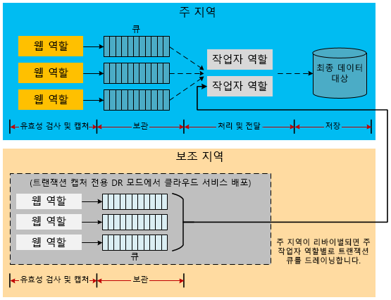

# Azure 응용 프로그램에 대한 재해 복구

DR(재해 복구)은 응용 프로그램 기능의 치명적인 손실에서 복구하는 데 집중합니다. 예를 들어 응용 프로그램을 호스팅하는 Azure 지역을 사용할 수 없는 경우 응용 프로그램을 실행하거나 다른 지역의 데이터에 액세스하기 위한 계획이 필요합니다. 

비즈니스 및 기술 소유자는 재해 중 필요한 기능 양을 결정해야 합니다. 기능 수준은 완전히 사용할 수 없는 경우, 제한된 기능 또는 지연된 처리를 통해 부분적으로 사용 가능한 경우 또는 전체를 사용할 수 있는 경우 등 여러 형태를 사용할 수 있습니다.

복원력 및 고가용성 전략은 일시적인 오류 상황을 처리하는 데 사용됩니다.  이 계획의 실행에는 시스템이 계속해서 작동할 수 있는 인력, 프로세스 및 지원 응용 프로그램이 포함됩니다. 계획은 실패 예행 연습 및 계획이 적절한지 확인하기 위한 데이터베이스의 복구 테스트를 포함해야 합니다. 

## Azure 재해 복구 기능

가용성을 고려하여 Azure는 재해 복구를 지원하도록 설계된 [복구 기술 지침](./index.md)을 제공합니다. 또한 Azure와 재해 복구의 가용성 기능 사이의 관계도 있습니다. 예를 들어 장애 도메인 간 역할을 관리하면 응용 프로그램의 가용성이 증가합니다. 관리하지 않으면 처리되지 않은 하드웨어 오류가 "재해" 시나리오가 됩니다. 이러한 가용성 기능 및 전략 활용은 재해 방지 응용 프로그램의 중요한 부분입니다. 그러나 이 문서에서는 일반적인 가용성 문제보다 심각한(및 특수한) 재해 이벤트를 다룹니다.

## 여러 데이터 센터 지역
Azure는 전 세계 여러 지역에서 데이터 센터를 유지 관리합니다. 이 인프라는 보조 지역에 Azure Storage의 시스템 제공 지역에서 복제와 같은 여러 가지 재해 복구 시나리오를 지원합니다. 또한 클라우드 서비스를 전 세계의 여러 곳에 쉽고 저렴하게 배치할 수 있습니다. 여러 지역에서 고유한 데이터 센터를 빌드 및 유지 관리하는 비용 및 문제를 비교합니다. 여러 지역에 데이터 및 서비스 배포하여 단일 지역에 발생한 심각한 중단으로부터 응용 프로그램을 보호할 수 있습니다. 재해 복구 계획을 디자인할 때 쌍을 이루는 지역의 개념을 이해하는 것은 중요합니다. 자세한 내용은 [BCDR(비즈니스 연속성 및 재해 복구): Azure 쌍을 이루는 지역](/azure/best-practices-availability-paired-regions)을 참조하세요.

## Azure Site Recovery

[Azure Site Recovery](/azure/site-recovery/)는 지역 간에 Azure VM을 복제하는 간단한 방법을 제공합니다. 보조 영역에 추가 리소스를 프로비전할 필요가 없기 때문에 최소한의 관리 오버헤드를 갖습니다. 복제를 사용하도록 설정하면 Site Recovery가 원본 VM 설정에 따라 대상 지역에 필요한 리소스를 자동으로 만듭니다. 자동화된 연속 복제를 제공하며 한 번의 클릭으로 응용 프로그램 장애 조치(failover)를 수행할 수 있습니다. 프로덕션 작업 또는 진행 중인 복제에 영향을 주지 않고 장애 조치(failover)를 테스트하여 재해 복구 훈련을 실행할 수도 있습니다. 

## Azure Traffic Manager
지역 특정 오류가 발생하는 경우 다른 지역의 서비스 또는 배포에 트래픽을 리디렉션해야 합니다. 주 지역이 실패하는 경우 다른 지역으로 사용자 트래픽의 장애 조치(failover)를 자동화하는 Azure Traffic Manager와 같은 서비스를 통해 이를 처리하는 것이 가장 효과적입니다. 효과적인 DR 전략을 디자인할 때 Traffic Manager의 기초를 이해하는 것은 중요합니다.

Traffic Manager는 DNS(Domain Name System)를 사용하여 클라이언트 요청을 트래픽 라우팅 방법 및 끝점의 상태를 기준으로 가장 적절한 끝점으로 리디렉션합니다. 다음 다이어그램에서 사용자는 실제 사이트 URL(`http://app1URL.cloudapp.net` 및 `http://app2URL.cloudapp.net`)을 추상화하는 Traffic Manager URL(`http://myATMURL.trafficmanager.net`)에 연결합니다. 사용자 요청은 구성된 [Traffic Manager 라우팅 메서드](/azure/traffic-manager/traffic-manager-routing-methods)를 기반으로 하는 적절한 기본 URL로 라우팅됩니다. 이 문서에서는 장애 조치 옵션에 대해서만 알아보겠습니다.

Traffic Manager를 구성하는 경우 사용자가 서비스에 액세스하는 데 사용할 새 Traffic Manager DNS 접두사를 제공합니다. Traffic Manager는 이제 부하 분산을 지역 수준보다 한 단계 높게 추상화합니다. Traffic Manager DNS는 관리하는 모든 배포에 대한 CNAME에 매핑합니다.

Traffic Manager 내에서 오류가 발생할 경우 사용자가 라우팅되는 배포의 우선 순위 목록을 지정합니다. Traffic Manager는 배포 엔드포인트를 모니터링합니다. 기본 배포를 사용할 수 없는 경우 Traffic Manager는 기본 목록에서 다음 배포로 사용자를 라우팅합니다.

Traffic Manager가 장애 조치(failover) 중 이동할 위치를 결정하지만 장애 조치 모드(Traffic Manager와 관련되지 않음)가 아닌 경우에도 장애 조치 도메인이 유휴인지 아니면 활성인지를 결정할 수 있습니다. Traffic Manager는 해당 사이트가 현재 사용자를 처리하는지 여부에 관계 없이 주 사이트에서 오류를 감지하고 장애 조치 사이트로 롤오버합니다.

Azure Traffic Manager 작동 방식에 대한 자세한 내용은 다음을 참조하세요.

* [Traffic Manager 개요](/azure/traffic-manager/traffic-manager-overview/)
* [Traffic Manager 라우팅 방법](/azure/traffic-manager/traffic-manager-routing-methods)
* [장애 조치(Failover) 라우팅 방법 구성](/azure/traffic-manager/traffic-manager-configure-failover-routing-method/)

## Azure 재해 시나리오
다음 섹션에서는 여러 가지 재해 시나리오를 다룹니다. 지역 전체의 서비스 중단이 응용 프로그램 전체 오류가 발생하는 유일한 원인은 아닙니다. 설계 및 관리 오류가 중단을 초래할 수도 있습니다. 복구 계획의 설계 및 테스트 단계 중에 실패의 원인을 생각하는 것도 중요합니다. 좋은 계획은 Azure 기능을 활용하고 응용 프로그램별 전략을 통해 보강합니다. 선택한 응답은 응용 프로그램, RPO(복구 지점 목표), RTO(복구 시간 목표)의 중요도에 따라 결정됩니다.

### 응용 프로그램 오류
Azure Traffic Manager는 호스트 가상 머신에서 기본 하드웨어 또는 운영 체제 소프트웨어로 인한 오류를 자동으로 처리합니다. Azure는 새 역할 인스턴스를 만들고 사용 가능한 풀에 추가합니다. 둘 이상의 역할 인스턴스가 이미 실행 중인 경우 Azure는 실패한 노드를 교체하면서 처리를 다른 실행 중인 역할 인스턴스로 이동시킵니다.

하드웨어 또는 운영 체제의 기본 오류 없이 심각한 응용 프로그램 오류가 발생할 수 있습니다. 응용 프로그램은 잘못된 논리 또는 데이터 무결성 문제로 발생한 재앙과도 같은 예외로 인해 실패할 수 있습니다. 모니터링 시스템이 오류 조건을 감지하고 응용 프로그램 관리자에게 알릴 수 있도록 응용 프로그램 코드에 충분한 원격 분석을 포함해야 합니다. 재해 복구 프로세스에 대한 완전한 지식이 있는 관리자는 장애 조치(failover) 프로세스를 트리거하거나 중요 오류를 해결하는 동안 가용성 중단을 수용할지 여부를 결정할 수 있습니다.

### 데이터 손상
Azure는 동일한 지역에 있는 여러 장애 도메인 내에 Azure SQL Database 및 Azure Storage 데이터를 세 번 중복해서 자동으로 저장합니다. 지역에서 복제를 사용하는 경우 데이터는 다른 지역에 세 번 중복해서 저장됩니다. 그러나 사용자 또는 응용 프로그램이 주 복사본에서 해당 데이터를 손상시킨 경우 데이터를 다른 복사본으로 빠르게 복제합니다. 그러나 이로 인해 손상된 데이터의 복사본은 여러 개가 됩니다.

데이터의 잠재적 손상을 관리하려면 두 가지 옵션이 있습니다. 첫째, 사용자 지정 백업 전략을 관리할 수 있습니다. 비즈니스 요구 사항 또는 통제 규정에 따라 Azure 또는 온-프레미스에 백업을 저장할 수 있습니다. 또 다른 옵션은 SQL 데이터베이스를 복구하기 위한 특정 시점 복원 옵션을 사용하는 것입니다. 자세한 내용은 아래 [재해 복구를 위한 데이터 전략](#data-strategies-for-disaster-recovery) 섹션을 참조하세요.

### 네트워크 중단
Azure 네트워크의 부분에 액세스할 수 없을 경우 응용 프로그램 또는 데이터에 액세스할 수 없습니다. 하나 이상의 역할 인스턴스를 네트워크 문제로 인해 사용할 수 없는 경우 Azure는 응용 프로그램의 나머지 사용 가능한 인스턴스를 사용합니다. Azure 네트워크가 중단되어 응용 프로그램이 해당 데이터에 액세스할 수 없는 경우 캐시된 데이터를 사용하여 제한된 응용 프로그램 기능으로 로컬로 실행할 수 있습니다. 응용 프로그램에서 제한된 기능으로 실행하기 위한 재해 복구 전략을 디자인해야 합니다. 일부 응용 프로그램에서는 불가능할 수 있습니다.

또 다른 옵션은 연결이 복원될 때까지 대체 위치에 데이터를 저장하는 것입니다. 제한된 기능을 사용할 수 없는 경우 나머지 옵션은 응용 프로그램 가동 중지 시간이거나 대체 지역에 장애 조치입니다. 제한된 기능으로 실행 중인 응용 프로그램의 설계는 기술적인 만큼 비즈니스적인 의사 결정입니다. 이에 대해서 [제한된 응용 프로그램 기능](#reduced-application-functionality) 섹션에서 자세히 설명합니다.

### 종속 서비스 오류
Azure는 주기적인 작동 중지가 발생할 수 있는 많은 서비스를 제공합니다. 예를 들어 [Azure Redis Cache](https://azure.microsoft.com/services/cache/)는 응용 프로그램에 캐싱 기능을 제공하는 다중 테넌트 서비스입니다. 종속된 서비스를 사용할 수 없는 경우 응용 프로그램에서 어떤 일이 발생할지 고려해야 합니다. 이 시나리오는 다양한 면에서 네트워크 중단 시나리오와 비슷합니다. 그러나 각 서비스를 독립적으로 고려하여 전체 계획을 잠재적으로 개선합니다.

Azure Redis Cache는 클라우드 서비스 배포 내에서 응용 프로그램에 캐싱을 제공하며 이는 재해 복구 혜택을 제공합니다. 첫째, 서비스는 이제 배포에 대해 로컬인 역할에서 실행됩니다. 따라서 클라우드 서비스에 대한 전체 관리 프로세스의 일부로 캐시의 상태를 모니터링하고 관리할 수 있습니다. 또한 이러한 유형의 캐싱은 다른 노드에서 중복 복사본을 유지하여 단일 노드가 실패하면 캐시된 데이터를 보존하는 캐시된 데이터에 대한 고가용성과 같은 새로운 기능을 노출합니다.

고가용성은 처리량을 감소시키며 쓰기 작업에서 보조 복사본을 업데이트해야 하기 때문에 대기 시간을 증가시킵니다. 캐시된 데이터를 저장하는 데 필요한 메모리 양은 효과적으로 두 배이며 용량 계획 중 고려해야 합니다.  이 예제에서는 각 종속 서비스가 전체 가용성 및 심각한 실패에 대한 저항을 향상시키는 기능을 포함할 수 있음을 보여 줍니다.

각 종속 서비스를 통해 서비스 중단의 의미를 이해해야 합니다. 캐싱 예제에서는 캐시를 복원할 때까지 데이터베이스에서 직접 데이터에 액세스할 수 있습니다. 따라서 응용 프로그램 데이터에 대한 모든 권한을 제공하는 동안 성능이 저하됩니다.

### 지역 전체 서비스 중단
이전 오류는 주로 동일한 Azure 지역 내에서 관리할 수 있는 오류였습니다. 그러나 전체 지역의 서비스 중단이 없다는 가능성도 대비해야 합니다. 지역 전체 서비스 중단이 발생하는 경우 데이터의 로컬 중복 복사본을 사용할 수 있습니다. 지역에서 복제를 사용하는 경우 Blob 및 테이블의 추가 사본 3개가 다른 지역에 있습니다. Microsoft가 손실된 지역을 선언할 경우 Azure는 지역에서 복제된 지역에 DNS 항목을 모두 다시 매핑합니다.

> [!NOTE]
> 이 프로세스는 사용자가 제어할 수 없으며 지역 전체 서비스 중단에 대해서만 발생합니다. 더 나은 RPO 및 RTO를 달성하기 위해 [Azure Site Recovery](/azure/site-recovery/)를 사용하는 것이 좋습니다. Site Recovery는 응용 프로그램에서 허용 가능한 작동 중단이 무엇이며 복제된 VM에 장애 조치(failover)하는 시기를 결정할 수 있도록 합니다.

### Azure 전체 서비스 중단
재해 계획에서 가능한 재해의 전체 범위를 고려해야 합니다. 가장 심각한 서비스 중단 중 하나는 동시에 모든 Azure 지역을 포함합니다. 다른 서비스 중단과 마찬가지로 이벤트의 일시적인 작동 중단의 위험을 수용하기로 결정할 수 있습니다. 여러 지역에 걸친 광범위한 서비스 중단은 종속 서비스 또는 단일 지역을 포함한 격리된 서비스 중단보다 더 드뭅니다.

그러나 다중 지역 서비스 중단에 대해 백업 계획이 필요한 중요 업무용 응용 프로그램을 결정할 수 있습니다. 이 계획은 [대체 클라우드](#alternative-cloud) 또는 [하이브리드 온-프레미스 및 클라우드 솔루션](#hybrid-on-premises-and-cloud-solution)의 서비스에 대한 장애 조치를 포함할 수 있습니다.

### 제한된 응용 프로그램 기능
잘 설계된 응용 프로그램은 보통 느슨하게 결합된 정보 교환 패턴을 구현하여 서로 통신하는 서비스를 사용합니다. DR과 친근한 응용 프로그램은 서비스 수준에서 책임을 구분해야 합니다. 종속 서비스의 중단이 전체 응용 프로그램을 중단하지 않도록 방지합니다. 예를 들어 회사 Y에 대한 웹 상거래 응용 프로그램을 생각해봅시다. 다음 모듈은 이렇게 응용 프로그램을 구성할 수 있습니다.

* **제품 카탈로그** 를 사용하면 사용자가 제품을 찾아볼 수 있습니다.
* **쇼핑 카트** 를 사용하면 사용자가 해당 쇼핑 카트에 제품을 추가/제거할 수 있습니다.
* **주문 상태** 에서는 사용자가 주문한 제품의 배송 상태를 보여 줍니다.
* **주문 제출** 은 결제와 동시에 주문을 제출하여 쇼핑 세션을 종료합니다.
* **주문 처리** 는 데이터 무결성을 위해 주문의 유효성을 검사하고 재고 수량을 확인합니다.

이 응용 프로그램에서 서비스 종속성을 사용할 수 없는 경우 종속성이 복구될 때까지 서비스 기능은 어떻게 작동하나요? 잘 설계된 시스템은 설계 시간 및 런타임 시 책임을 구분함으로써 격리 경계를 구현합니다. 모든 오류를 복구 가능 및 복구 불가능으로 분류할 수 있습니다. 복구 불가능한 오류는 서비스를 중단하지만 대체 방법을 통해 복구 가능한 오류를 줄일 수 있습니다. 오류를 자동으로 처리하고 대체 작업을 수행하여 해결된 특정 문제는 사용자에게 투명합니다. 더 심각한 서비스 중단이 일어나면 응용 프로그램을 완전히 사용할 수 없게될 수 있습니다. 세 번째 옵션은 제한된 기능으로 사용자 요청을 계속해서 처리하는 것입니다.

예를 들어 호스팅 주문을 위한 데이터베이스가 중단되면 주문 처리 서비스가 판매 트랜잭션을 처리할 수 있는 능력을 상실하게 됩니다. 아키텍처에 따라 응용 프로그램의 주문 제출 및 주문 처리 서비스를 계속하기 어렵거나 불가능할 수 있습니다. 응용 프로그램이 이 시나리오를 처리하도록 설계하지 않으면 전체 응용 프로그램이 오프라인 상태가 될 수 있습니다. 그러나 제품 데이터가 다른 위치에 저장되는 경우 제품 카탈로그 모듈은 여전히 제품을 보기 위해 사용될 수 있습니다. 그러나 주문 또는 재고 확인과 같은 응용 프로그램의 다른 부분은 사용할 수 없습니다.

사용 가능한 제한된 응용 프로그램 기능을 결정하는 것은 비즈니스 결정 및 기술 결정입니다. 응용 프로그램에서 사용자에게 일시적인 문제를 알리는 방법을 결정해야 합니다. 위의 예제에서 응용 프로그램은 제품 보기 및 장바구니에 추가도 가능할 수 있습니다. 그러나 사용자가 제품을 구매하려고 하는 경우 응용 프로그램은 사용자에게 주문 기능을 일시적으로 사용할 수 없음을 알립니다. 고객에게 적합하지는 않지만 응용 프로그램 전체 서비스 중단을 방지합니다.

## 재해 복구를 위한 데이터 전략
적절한 데이터 처리는 재해 복구 계획의 어려운 측면입니다. 복구 프로세스 중 데이터 복원에 일반적으로 가장 많은 시간이 소요됩니다. 기능 제한에 대한 다른 선택 사항은 오류가 발생한 후에 오류 및 일관성으로부터 데이터 복구에 어려운 과제를 발생시킵니다.

응용 프로그램 데이터의 복사본을 복원하거나 유지하기 위해 한 가지 고려 사항이 필요합니다. 보조 사이트에서 참조 및 트랜잭션 목적을 위해 이 데이터를 사용합니다. 온-프레미스 배포에는 여러 지역 재해 복구 전략을 구현하기 위해 시간이 걸리고 비용이 많이 드는 계획 프로세스가 필요합니다. Azure를 비롯한 클라우드 공급자는 간편하게 여러 지역에 응용 프로그램을 배포할 수 있습니다. 이러한 지역은 여러 지역 서비스 중단이 거의 발생할 수 없는 방식을 통해 지리적으로 분산됩니다. 지역에 걸쳐 데이터를 처리하기 위한 전략은 재해 복구 계획의 성공에 영향을 주는 요인 중 하나입니다.

다음 섹션에서는 데이터 백업, 참조 데이터 및 트랜잭션 데이터와 관련된 재해 복구 기술을 설명합니다.

### Backup 및 복원
응용 프로그램 데이터를 정기적으로 백업하여 일부 재해 복구 시나리오를 지원할 수 있습니다. 다른 저장소 리소스에는 다른 기술이 필요합니다.

#### SQL Database
기본, 표준 및 프리미엄 SQL Database 계층의 경우 특정 시점 복원을 활용하여 데이터베이스를 복구할 수 있습니다. 자세한 내용은 [개요: SQL Database의 클라우드 무중단 업무 방식 및 데이터베이스 재해 복구](/azure/sql-database/sql-database-business-continuity/)를 참조하세요. 또 다른 방법은 SQL Database에 활성 지역 복제를 사용하는 것입니다. 이는 동일한 Azure 지역 또는 다른 Azure 지역에서도 보조 데이터베이스에 대한 데이터베이스 변경 사항을 자동으로 복제합니다. 이 문서에 나타난 수동 데이터 동기화 기술 중 일부에 대해 잠재적인 대체 형식을 제공합니다. 자세한 내용은 [개요: SQL Database 활성 지역 복제](/azure/sql-database/sql-database-geo-replication-overview/)를 참조하세요.

백업 및 복원에 수동 접근 방식을 사용할 수도 있습니다. DATABASE COPY 명령을 사용하여 트랜잭션 일관성으로 데이터베이스의 백업 복사본을 만듭니다. Azure Blob 저장소에 저장된 BACPAC 파일(데이터베이스 스키마 및 연결된 데이터가 들어 있는 압축된 파일)에 데이터베이스 내보내기를 지원하는 Azure SQL Database의 가져오기/내보내기 서비스를 사용할 수도 있습니다.

Azure Storage의 기본 제공 중복성으로 인해 동일한 지역에 두 개의 백업 파일 복제본을 만듭니다. 그러나 백업 프로세스를 실행하는 빈도가 RPO를 결정하며 이는 재해 시나리오에서 손실될 수는 데이터 양입니다. 예를 들어 매 정시에 백업을 수행하고 재해는 정시가 되기 2분 전에 발생한다고 가정합니다. 마지막으로 백업이 수행된 후에 기록된 데이터의 58분이 손실됩니다. 또한 지역 전체 서비스 중단을 방지하려면 대체 지역에 BACPAC 파일을 복사해야 합니다. 그러면 대체 지역에 이러한 백업을 복원하는 옵션이 있습니다. 자세한 내용은 [개요: SQL Database의 클라우드 무중단 업무 방식 및 데이터베이스 재해 복구](/azure/sql-database/sql-database-business-continuity/)를 참조하세요.

#### Azure Storage
Azure Storage의 경우 사용자 지정 백업 프로세스를 개발하거나 여러 타사 백업 도구 중 하나를 사용할 수 있습니다. 대부분의 응용 프로그램 설계는 저장소 리소스를 서로 참조하기 때문에 더 복잡합니다. 예를 들어 Azure Storage의 Blob에 연결하는 열이 있는 SQL 데이터베이스를 가정하겠습니다. 백업이 동시에 발생하지 않는 경우 데이터베이스에는 실패하기 전에 백업되지 않은 Blob에 대한 포인터가 있을 수 있습니다. 응용 프로그램 또는 재해 복구 계획은 복구 후에 이러한 불일치를 처리하는 프로세스를 구현해야 합니다.

#### 다른 데이터 플랫폼
Elasticsearch 또는 MongoDB와 같은 데이터 플랫폼을 호스팅하는 다른 IaaS(Infrastructure-as-a-Service)에는 통합된 백업 및 복원 프로세스를 만들 때 고유한 기능 및 고려 사항이 있습니다. 이러한 데이터 플랫폼의 경우 일반적으로 네이티브 또는 사용 가능한 통합 기반 복제 또는 스냅숏 작성 기능을 사용하는 것이 좋습니다. 이러한 기능이 존재하지 않거나 적합하지 않은 경우 응용 프로그램 데이터의 지정 시간 복사본을 만드는 데 Azure Backup 서비스 또는 관리되는/관리되지 않는 디스크 스냅숏을 사용하는 것이 좋습니다. 모든 경우에서, 특히 응용 프로그램 데이터가 여러 파일 시스템에 걸쳐 있거나 여러 드라이브가 볼륨 관리자 또는 소프트웨어 기반 RAID를 사용하는 단일 파일 시스템으로 결합된 경우 일관된 백업을 수행하는 방법을 결정하는 것은 중요합니다.

### 재해 복구에 대한 참조 데이터 패턴
참조 데이터는 응용 프로그램 기능을 지원하는 읽기 전용 데이터입니다. 일반적으로 자주 변경하지 않습니다. 백업 및 복원이 지역 전체 서비스 중단을 처리하는 한 가지 방법이지만 RTO는 비교적 깁니다. 보조 지역에 응용 프로그램을 배포할 경우 몇 가지 전략을 통해 참조 데이터에 대한 RTO를 향상시킬 수 있습니다.

참조 데이터가 자주 변경되기 때문에 보조 지역에서 참조 데이터의 영구 복사본을 유지하여 RTO를 향상시킬 수 있습니다. 이렇게 하면 재해 발생 시 백업을 복원하는 데 필요한 시간을 제거합니다. 여러 지역 재해 복구 요구 사항을 충족하려면 여러 지역에 응용 프로그램 및 참조 데이터를 함께 배포해야 합니다. [고가용성을 위한 참조 데이터 패턴](high-availability-azure-applications.md#reference-data-pattern-for-high-availability)에서 설명한 것처럼 역할 자체, 외부 저장소 또는 둘의 조합에 참조 데이터를 배포할 수 있습니다.

계산 노드 내의 참조 데이터 배포 모델은 암시적으로 재해 복구 요구 사항을 충족합니다. SQL Database에 참조 데이터를 배포하려면 각 지역에 참조 데이터의 복사본을 배포해야 합니다. Azure Storage에 동일한 전략이 적용됩니다. Azure Storage에 저장된 참조 데이터의 복사본을 주 지역 및 보조 지역에 배포해야 합니다.

참조 데이터를 포함하여 모든 데이터에 대해 고유한 응용 프로그램 특정 백업 루틴을 구현해야 합니다. 지역에 걸친 지역에서 복제된 복사본은 지역 전체 서비스 중단에만 사용됩니다. 확장된 가동 중지 시간을 방지하려면 보조 지역에 응용 프로그램의 데이터 중 업무상 중요한 부분을 배포합니다. 이 토폴로지에 대한 예제를 보려면 [활성-수동 모델](#active-passive)을 참조하세요.

### 재해 복구에 대한 트랜잭션 데이터 패턴
완전히 작동하는 재해 모드 전략을 구현하려면 보조 지역에 대한 트랜잭션 데이터를 비동기로 복제해야 합니다. 복제할 수 있는 실제 시간 창은 응용 프로그램의 RPO 특성을 결정합니다. 복제 창이 열린 동안 주 지역에서 손실된 데이터를 복구할 수 있습니다. 나중에 보조 지역으로 병합할 수도 있습니다.

다음 아키텍처 예제는 장애 조치 시나리오에서 트랜잭션 데이터를 처리하는 다양한 방법에 대해 몇 가지 아이디어를 제공합니다. 이러한 예제는 완전하지 않은지 확인해야 합니다. 예를 들어 큐와 같은 중간 저장소 위치를 Azure SQL Database로 대체할 수 있습니다. 큐 자체는 Azure Storage 및 Azure Service Bus 큐일 수 있습니다( [Azure 큐 및 Service Bus 큐 - 비교 및 대조](/azure/service-bus-messaging/service-bus-azure-and-service-bus-queues-compared-contrasted/) 참조). 서버 저장소 대상은 SQL Database 대신 Azure 테이블과 같이 달라질 수 있습니다. 또한 작업자 역할은 다양한 단계에서 중간 단계로 삽입될 수 있습니다. 의도는 이러한 아키텍처를 정확하게 에뮬레이트하는 것이 아니라 트랜잭션 데이터 및 관련된 모듈을 복구하는 다양한 대안을 고려하는 것입니다.

#### 재해 복구를 위한 준비 과정에서 트랜잭션 데이터 복제
트랜잭션 데이터를 보유하는 Azure Storage 큐를 사용하는 응용 프로그램을 가정하겠습니다. 따라서 작업자 역할이 분리된 아키텍처의 서버 데이터베이스에 대한 트랜잭션 데이터를 처리할 수 있습니다. 프런트 엔드 역할에 해당 데이터의 쿼리가 즉시 필요한 경우 임시 캐싱의 형태를 사용하는 트랜잭션이 필요합니다. 데이터 손실 허용 수준에 따라 큐, 데이터베이스 또는 모든 저장소 리소스를 복제하도록 선택할 수 있습니다. 데이터베이스의 복제로 주 지역이 중단된 경우 주 지역이 다시 시작되면 여전히 큐에 있는 데이터를 복구할 수 있습니다

다음 다이어그램은 지역에 걸쳐 서버 데이터베이스가 동기화되는 아키텍처를 보여 줍니다.

이 아키텍처를 구현하기 위한 가장 큰 과제는 지역 간의 복제 전략입니다. [Azure SQL 데이터 동기화](/azure/sql-database/sql-database-get-started-sql-data-sync/) 서비스를 사용하면 이 유형의 복제를 활성화할 수 있습니다. 이 작성일 기준으로 서비스는 미리 보기 상태이며 프로덕션 환경에서 사용하지 않는 것이 좋습니다. 자세한 내용은 [개요: SQL Database의 클라우드 무중단 업무 방식 및 데이터베이스 재해 복구](/azure/sql-database/sql-database-business-continuity/)를 참조하세요. 프로덕션 응용 프로그램의 경우 타사 솔루션에 투자하거나 코드에 고유한 복제 논리를 만들어야 합니다. 아키텍처에 따라 복제는 양방향일 수 있으며 더 복잡합니다.

이전 예제에서 잠재적인 구현은 중간 큐를 사용할 수 있습니다. 주 지역 및 보조 지역에서 최종 저장소 대상에 데이터를 처리하는 작업자 역할의 변경 내용을 적용할 수 있습니다. 이는 간단한 작업이 아니며 복제 코드에 대한 전체 지침은 이 문서에서 다루지 않습니다. 보조 지역으로 데이터 복제를 위한 접근 방식으로 상당한 시간 및 테스트를 투자합니다. 추가 처리 및 테스트 작업은 장애 조치 및 복구 프로세스가 가능한 데이터 불일치 또는 중복된 트랜잭션을 올바르게 처리하도록 도울 수 있습니다.

> [!NOTE]
> 이 문서는 대부분 PaaS(platform as a service)에 중점을 둡니다. 그러나 하이브리드 응용 프로그램에 대한 추가적인 복제 및 가용성 옵션은 Azure Virtual Machines를 사용합니다. 이러한 하이브리드 응용 프로그램은 IaaS(Infrastructure as a Service)를 사용하여 Azure의 가상 머신에서 SQL Server를 호스트합니다. 따라서 AlwaysOn 가용성 그룹 또는 로그 전달과 같은 SQL Server의 기존 가용성 방식을 사용할 수 있습니다. AlwaysOn과 같은 일부 기법은 온-프레미스 SQL Server 인스턴스와 Azure 가상 머신 간에서만 작동합니다. 자세한 내용은 [Azure Virtual Machines의 SQL Server에 대한 고가용성 및 재해 복구](/azure/virtual-machines/windows/sql/virtual-machines-windows-sql-high-availability-dr/)를 참조하세요.
> 
> 

#### 트랜잭션 캡처를 위한 제한된 응용 프로그램 기능
제한된 기능으로 작동하는 두 번째 아키텍처를 가정하겠습니다. 보조 지역의 응용 프로그램은 보고, BI(비즈니스 인텔리전스) 또는 큐 비우기와 같은 모든 기능을 비활성화합니다. 비즈니스 요구 사항에 정의된 대로 가장 중요한 유형의 트랜잭션 워크플로만 허용됩니다. 시스템은 트랜잭션을 캡처하고 큐에 기록합니다. 시스템은 서비스 중단의 초기 단계에서 데이터 처리를 연기할 수 있습니다. 주 지역의 시스템이 예상되는 시간 창 내에서 다시 활성화되면 주 지역의 작업자 역할은 큐를 비울 수 있습니다. 이 프로세스에서는 데이터베이스 병합을 수행할 필요가 없습니다. 주 지역 서비스 중단이 허용 창을 넘어서면 응용 프로그램은 큐를 처리하기 시작할 수 있습니다.

이 시나리오에서 보조 지역의 데이터베이스는 주 지역이 다시 활성화된 후에 병합되어야 하는 증분 트랜잭션 데이터를 포함합니다. 다음 다이어그램에서는 주 지역이 복원될 때까지 트랜잭션 데이터를 임시로 저장하는 전략을 보여 줍니다.

복원력 있는 Azure 응용 프로그램의 데이터 관리 기술에 대한 자세한 내용은 [Failsafe: 복원력 있는 클라우드 아키텍처 지침](https://channel9.msdn.com/Series/FailSafe)을 참조하세요.

## 재해 복구를 위한 배포 토폴로지
업무상 중요한 응용 프로그램에서 지역 전체 서비스 중단을 처리하도록 준비해야 합니다. 여러 지역 배포 전략을 운영 계획에 통합합니다.

여러 지역 배포는 재해가 발생한 후에 보조 지역에 응용 프로그램 및 참조 데이터를 게시하는 IT 프로세스를 포함할 수 있습니다. 응용 프로그램에 즉각적인 장애 조치가 필요한 경우 배포 프로세스는 활성/수동 설정 또는 활성/활성 설정을 포함할 수 있습니다. 이 유형의 배포에는 대체 지역에서 실행되는 응용 프로그램의 기존 인스턴스가 있습니다. Azure Traffic Manager와 같은 라우팅 서비스는 DNS 수준에서 부하 분산 서비스를 제공합니다. 서비스 중단을 감지하고 필요할 경우 다른 지역에 사용자를 라우팅할 수 있습니다.

성공적인 Azure 재해 복구는 솔루션에 대한 처음부터 해당 복구 빌드를 포함합니다. 클라우드는 기존의 호스팅 공급자에 사용할 수 없는 재해 발생 중 오류로부터 복구하기 위한 추가 옵션을 제공합니다. 특히, 오류가 발생하기 전에 유휴 리소스 비용을 방지하도록 동적으로 신속하게 다른 지역에서 리소스를 할당할 수 있습니다.

다음 섹션에서는 재해 복구를 위한 다양한 배포 토폴로지를 설명합니다. 일반적으로 추가적인 가용성을 위해 비용이나 복잡성이 증가하는 경우 균형을 유지합니다.

### 단일 지역 배포
단일 지역 배포는 실제로 재해 복구 토폴로지는 아니지만 다른 아키텍처와 대비되는 점이 있습니다. 단일 지역 배포는 Azure에서 응용 프로그램에 대해 일반적이지만 재해 복구 토폴로지의 요구 사항을 충족하지 않습니다.

다음 다이어그램에서는 단일 Azure 지역에서 실행 중인 응용 프로그램을 보여 줍니다. Azure Traffic Manager와 장애 도메인 및 업그레이드 도메인을 사용하면 지역 내에서 응용 프로그램의 가용성을 증가시킵니다.

이 시나리오에서 데이터베이스는 단일 실패 지점입니다. Azure가 내부 복제본에 대한 여러 장애 도메인에 걸쳐 데이터를 복제하더라도 이 복제는 동일한 지역 내에서만 발생합니다. 응용 프로그램은 치명적인 오류를 견딜 수 없습니다. 지역을 사용할 수 없는 경우 모든 서비스 인스턴스 및 저장소 리소스를 포함한 장애 도메인도 사용할 수 없게 됩니다.

중요하지 않은 응용 프로그램의 경우에도 여러 지역에 걸쳐 응용 프로그램을 배포하는 계획을 마련해야 합니다. 또한 사용할 배포 토폴로지를 고려하는 경우 RTO 및 비용 제약 조건도 고려해야 합니다.

이제 다른 지역에 걸쳐 장애 조치(failover)를 지원하는 특정 방법을 살펴보겠습니다. 이 예제에서는 프로세스를 설명하기 위해 두 지역을 사용합니다.

### Azure Site Recovery를 사용하여 장애 조치(failover)

Azure Site Recovery를 사용하여 Azure VM 복제를 활성화하는 경우 보조 지역에서 여러 리소스가 생성됩니다.

- 리소스 그룹
- VNet(가상 네트워크)
- Storage 계정 
- 장애 조치(failover) 후 VM을 보관하는 가용성 집합

주 지역에서 VM 디스크의 데이터 쓰기가 보조 지역의 저장소 계정에 지속적으로 전송됩니다. 몇 분마다 대상 저장소 계정에 복구 지점이 생성됩니다. 장애 조치(failover)를 시작하면 대상 리소스 그룹, VNet 및 가용성 집합에 복구된 VM이 만들어집니다. 장애 조치(failover) 중에는 모든 사용 가능한 복구 지점을 선택할 수 있습니다.

### 보조 Azure 지역에 재배포
보조 지역에 대한 재배포 방식의 경우 주 지역에만 실행되는 응용 프로그램 및 데이터베이스가 있습니다. 보조 지역은 자동 장애 조치가 설정되지 않았습니다. 따라서 재해가 발생하는 경우 새 지역에서 서비스의 모든 부분을 스핀업해야 합니다. 여기에는 트래픽 다시 라우팅하기 위해 Azure에 클라우드 서비스를 업로드하고 클라우드 서비스를 배포하며 데이터를 복원하고 DNS를 변경하는 작업이 포함됩니다.

다중 지역 옵션 중 가장 저렴하지만 가장 나쁜 RTO 특성을 갖습니다. 이 모델에서 서비스 패키지 및 데이터베이스 백업은 온-프레미스 또는 보조 지역의 Azure Blob 저장소 인스턴스에 저장됩니다. 그러나 작업을 다시 시작하기 전에 새 서비스를 배포하고 데이터를 복원해야 합니다. 백업 저장소에서 데이터 전송을 완전히 자동화하더라도 새로운 데이터베이스 환경을 프로비저닝하는 데 시간이 많이 소비됩니다. 보조 지역의 백업 디스크 저장소에서 빈 데이터베이스에 데이터를 이동하는 작업은 복원 프로세스 중 비용이 가장 많이 듭니다. 그러나 복제되지 않기 때문에 이를 수행하여 새 데이터베이스를 작동 상태로 설정해야 합니다.

보조 지역의 Blob 저장소에 서비스 패키지를 저장하는 것이 좋습니다. 이 패키지를 Azure에 업로드해야 할 필요를 제거하며 이는 온-프레미스 개발 컴퓨터에서 배포할 경우 발생합니다. PowerShell 스크립트를 사용하여 Blob 저장소에서 새 클라우드 서비스에 서비스 패키지를 신속하게 배포할 수 있습니다.

이 옵션은 높은 RTO를 감당할 수 있는 중요하지 않은 응용 프로그램에만 실용적입니다. 예를 들어 몇 시간 동안 중지될 수 있는 응용 프로그램에서 작동할 수 있지만 24시간 내에 다시 사용될 수 있어야 합니다.

### 활성-수동
활성-수동 토폴로지는 대부분의 회사에서 선호하는 선택입니다. 이 토폴로지는 재배포 방식을 통한 비용이 상대적으로 적게 증가하는 RTO에 향상된 기능을 제공합니다. 이 시나리오에서는 다시 기본 및 보조 Azure 지역을 사용합니다. 모든 트래픽은 주 지역에서 활성 배포로 이동합니다. 데이터베이스가 두 지역에서 실행되기 때문에 보조 지역은 재해 복구에 더 잘 대비합니다. 또한 두 지역 간에는 동기화 메커니즘이 있습니다. 이 대기 방식은 데이터베이스 전용 방식 또는 보조 지역에서 완전한 배포 방식 등 두 가지 변형을 포함할 수 있습니다.

#### 데이터베이스에만 해당
활성-수동 토폴로지의 첫 번째 변형에서 주 지역에는 배포된 클라우드 서비스 응용 프로그램이 있습니다. 하지만 재배포 방식과 달리 두 영역은 데이터베이스의 내용과 동기화됩니다. 자세한 내용은 [재해 복구를 위한 트랜잭션 데이터 패턴](#transactional-data-pattern-for-disaster-recovery)의 섹션을 참조하세요. 재해가 발생하는 경우 활성화 요구 사항이 더 적어집니다. 트래픽을 다시 라우팅하기 위해 보조 지역에서 응용 프로그램을 시작하고 연결 문자열을 새로운 데이터베이스로 변경하며 DNS 항목을 변경합니다.

재배포 방식과 마찬가지로 빠른 배포를 위해 보조 지역의 Azure Blob 저장소에 서비스 패키지를 이미 저장했어야 합니다. 그러나 데이터베이스가 준비되어 실행되므로 데이터베이스 복원 작업에 필요한 오버헤드의 다수를 발생시키지 않습니다. 이렇게 하면 상당한 시간을 절약하여 저렴한 DR 패턴(및 가장 자주 사용되는 패턴)이 됩니다.

#### 전체 복제본
활성-수동 토폴로지의 두 번째 변형에서 주 지역 및 보조 지역에는 각각 전체 배포가 있습니다. 이 배포에는 클라우드 서비스와 동기화된 데이터베이스가 포함됩니다. 그러나 주 지역만이 사용자의 네트워크 요청을 활발히 처리합니다. 보조 지역은 주 지역에서 서비스 중단이 발생하는 경우에만 활성화됩니다. 이 경우에 모든 새로운 네트워크 요청은 보조 지역으로 라우팅됩니다. Azure Traffic Manager는 이 장애 조치를 자동으로 관리할 수 있습니다.

서비스가 이미 배포되어 있기 때문에 장애 조치는 데이터베이스 전용 변형보다 빠르게 발생합니다. 이 토폴로지는 매우 낮은 RTO를 제공합니다. 보조 장애 조치 지역은 주 지역이 실패한 후에 즉시 준비되어야 합니다.

더욱 빠른 응답 시간과 함께 이 토폴로지는 재해 중 새 인스턴스를 할당할 공간이 부족할 수 있는 가능성을 방지하도록 백업 서비스를 미리 할당하고 배포합니다. 이것은 보조 Azure 지역이 용량에 아주 가까운 경우에 중요합니다. SLA(서비스 수준 약정)는 모든 지역에서 하나 이상의 새 클라우드 서비스를 즉시 배포할 수 있음을 보장하지 않습니다.

이 모델에서 가장 빠른 대응 시간을 보이려면 기본 및 보조 지역에서 유사한 규모(역할 인스턴스 수)를 가져야 합니다. 이러한 이점에도 불구하고 사용하지 않는 계산 인스턴스에 대한 비용이 많이 들기 때문에 재정적으로 선택하지 않는 것이 좋을 수 있습니다. 이로 인해 보조 지역에서 약간 규모가 축소된 버전의 클라우드 서비스를 사용하는 것이 더 일반적입니다. 그러면 신속하게 장애 조치하고 필요한 경우 보조 배포의 규모를 확장할 수 있습니다. 주 지역에 액세스할 수 없게 되면 부하에 따라 추가 인스턴스를 활성화하도록 장애 조치 프로세스를 자동화해야 합니다. [가상 머신 크기 집합](/azure/virtual-machine-scale-sets/virtual-machine-scale-sets-overview/)과 같은 자동 크기 조정 메커니즘을 사용하도록 할 수 있습니다.

다음 다이어그램에서는 기본 및 보조 지역이 활성-수동 토폴로지에서 완벽하게 배포된 클라우드 서비스를 포함하는 모델을 보여 줍니다.

### 활성-활성
활성-활성 토폴로지에서 클라우드 서비스 및 데이터베이스는 두 지역에 완벽하게 배포됩니다. 활성-수동 모델과 달리 두 지역에서는 사용자 트래픽을 수신합니다. 이 옵션으로 복구 시간이 가장 빨라집니다. 서비스의 크기를 조정하여 이미 각 지역에서 부하의 일부를 처리합니다. DNS는 이미 보조 지역을 사용하도록 설정됩니다. 적절한 지역에 사용자를 라우팅하는 방법을 결정하는 작업은 더 복잡합니다. 라운드 로빈 예약이 가능할 수 있습니다. 특정 사용자가 해당 데이터의 기본 복사본이 있는 특정 지역을 사용할 가능성이 높습니다.

장애 조치의 경우 단순히 주 지역에 DNS를 사용하지 않도록 설정합니다. 보조 지역으로 모든 트래픽을 라우팅합니다.

이 모델에도 일부 변형이 있습니다. 예를 들어 다음 다이어그램에서는 데이터베이스의 마스터 복사본을 소유하는 주 지역을 보여 줍니다. 두 지역의 클라우드 서비스는 해당 주 데이터베이스에 작성합니다. 보조 배포는 주 또는 복제된 데이터베이스에서 읽을 수 있습니다. 이 예제의 복제는 단방향입니다.

위의 다이어그램에는 활성-활성 아키텍처에 대한 단점이 있습니다. 두 번째 지역에는 마스터 복사본이 있기 때문에 첫 번째 지역의 데이터베이스에 액세스해야 합니다. 지역 외부의 데이터에 액세스할 경우 성능이 크게 저하됩니다. 지역 간 데이터베이스 호출에서 특정 유형의 배치 전략을 고려하여 이러한 호출의 성능을 개선해야 합니다. 자세한 내용은 [배치를 사용하여 SQL Database 응용 프로그램 성능을 개선하는 방법](/azure/sql-database/sql-database-use-batching-to-improve-performance/)을 참조하세요.

대체 아키텍처는 고유한 데이터베이스에 직접 액세스하는 각 지역을 포함할 수 있습니다. 이러한 모델에서 각 지역에 데이터베이스를 동기화하기 위해 일부 유형의 양방향 복제가 요구됩니다.

이전 토폴로지를 사용하여 RTO를 감소시키면 일반적으로 비용 및 복잡성이 증가합니다. 활성-활성 토폴로지는 이 비용 패턴에서 벗어납니다. 활성-활성 토폴로지에서는 활성-수동 토폴로지와 마찬가지로 주 지역에 많은 인스턴스가 필요하지 있습니다. 활성-수동 아키텍처의 주 지역에 10개의 인스턴스가 있는 경우 활성-활성 아키텍처의 각 지역에서 5개만 필요할 수 있습니다. 이제 두 지역은 부하를 공유합니다. 장애 조치에 대해 대기하는 10개의 인스턴스를 가진 수동 지역에서 웜 대기를 유지하면 활성-수동 토폴로지보다 비용을 절감할 수 있습니다.

주 지역을 복원할 때까지 보조 지역에 새 사용자가 갑작스럽게 증가할 수 있습니다. 각 서버에 10,000명의 사용자가 있다면 주 지역에서 서비스 중단이 발생하는 경우 보조 지역은 갑작스럽게 20,000명의 사용자를 처리해야 합니다. 보조 지역의 모니터링 규칙은 이러한 증가를 감지하고 보조 지역에서 인스턴스를 두 배로 증가시켜야 합니다. 이에 대한 자세한 내용은 [실패 감지](#failure-detection)섹션을 참조하세요.

## 하이브리드 온-프레미스 및 클라우드 솔루션
재해 복구에 대한 한 가지 추가 전략은 온-프레미스 및 클라우드에서 실행되는 하이브리드 응용 프로그램을 설계하는 것입니다. 응용 프로그램에 따라 주 지역은 둘 중 하나에 위치할 수 있습니다. 이전 아키텍처를 고려하고 주 지역 또는 보조 지역이 온-프레미스 위치라고 생각합니다.

이러한 하이브리드 아키텍처에는 몇 가지 문제가 있습니다. 첫째, 이 문서에서는 대부분 PaaS 아키텍처 패턴을 설명했습니다. Azure에서 일반적인 PaaS 응용 프로그램은 역할, 클라우드 서비스 및 Traffic Manager와 같은 Azure 관련 구성을 사용합니다. 이러한 유형의 PaaS 응용 프로그램에 대한 온-프레미스 솔루션을 만드는 데 상당히 상이한 아키텍처가 필요합니다. 관리 또는 비용 측면에서 바람직한 방법이 아닐 수 있습니다.

그러나 재해 복구를 위한 하이브리드 솔루션은 IaaS 기반 아키텍처와 같은 클라우드로 마이그레이션된 기존 아키텍처에 비해 문제가 적습니다. IaaS 응용 프로그램은 직접적으로 온-프레미스와 해당하는 클라우드에서 가상 머신을 사용합니다. 가상 네트워크를 사용하여 온-프레미스 네트워크 리소스가 있는 클라우드에서 컴퓨터에 연결할 수도 있습니다. PaaS 전용 응용 프로그램에서 사용할 수 없는 여러 가지 가능성을 허용합니다. 예를 들어 SQL Server AlwaysOn 가용성 그룹 및 데이터베이스 미러링과 같은 재해 복구 솔루션의 장점은 얻을 수 있습니다. 자세한 내용은 [Azure 가상 머신에서 SQL Server에 대한 고가용성 및 재해 복구](/azure/virtual-machines/windows/sql/virtual-machines-windows-sql-high-availability-dr/)를 참조하세요.

또한 IaaS 솔루션은 온-프레미스 응용 프로그램에 대한 보다 쉬운 경로를 제공하여 Azure를 장애 조치 옵션으로 사용합니다. 기존 온-프레미스 지역에서 완벽하게 작동하는 응용 프로그램을 가질 수 있습니다. 그러나 장애 조치를 위해 지리적으로 분산된 지역을 유지할 리소스가 부족한 경우 어떻게 해야 하나요? 가상 머신 및 가상 네트워크를 사용하여 Azure에서 실행 중인 응용 프로그램을 가져올 수 있습니다. 이 경우에 클라우드로 데이터를 동기화하는 프로세스를 정의합니다. 그러면 Azure 배포가 장애 조치에 사용할 보조 지역이 됩니다. 주 지역은 온-프레미스 응용 프로그램을 유지합니다. IaaS 아키텍처와 기능에 대한 자세한 내용은 [Virtual Machines 설명서](https://azure.microsoft.com/documentation/services/virtual-machines/)를 참조하세요.

## 대체 클라우드
Microsoft Azure의 광범위한 기능이 조직에서 필요한 내부 준수 규칙 또는 정책에 여전히 맞지 않는 경우가 있습니다. 최선을 다해 준비하고 재해 중 백업 시스템을 구현하도록 설계하더라도 클라우드 서비스 공급자의 전역 서비스 중단 중에는 부족합니다.

가용성 증가의 비용 및 복잡성과 가용성 요구 사항을 비교해야 합니다. 위험 분석을 수행하고 솔루션의 RTO 및 RPO를 정의합니다. 응용 프로그램에서 가동 중지 시간을 허용할 수 없는 경우 다른 클라우드 솔루션을 사용하는 것이 좋습니다. 전체 인터넷이 중단되지 않는 한 Azure에 전체적으로 액세스할 수 없게 되는 경우 다른 클라우드 솔루션을 사용할 수 있습니다.

하이브리드 시나리오와 같이 이전 재해 복구 아키텍처의 장애 조치 배포는 다른 클라우드 솔루션 내에서도 존재할 수 있습니다. 대체 클라우드 DR 사이트는 가동이 중지되는 경우 RTO에서 가동 중지 시간을 허용하는 해당 솔루션에 대해서만 사용해야 합니다. Azure 외부의 DR 사이트를 사용하는 솔루션은 구성, 개발, 배포 및 유지 관리에 더 많은 작업이 필요합니다. 클라우드 간 아키텍처에서 검증된 사례를 구현하는 것 또한 어려워집니다. 클라우드 플랫폼과 높은 수준 개념이 비슷하더라도 API와 아키텍처가 완전히 다릅니다.

DR 전략이 여러 클라우드 플랫폼을 사용하는 경우 솔루션 디자인에서 추상화 레이어를 포함하는 것이 유용합니다. 이렇게 하면 재해 발생 시 다른 클라우드 플랫폼에 두 가지 버전의 동일한 응용 프로그램을 개발하고 유지 관리할 필요가 없습니다. 이러한 경우에 하이브리드 시나리오처럼 Azure Virtual Machines 또는 Azure 컨테이너 서비스를 사용하는 작업은 클라우드에 지정된 PaaS 설계를 사용하는 것보다 쉬울 수 있습니다.

## Automation
앞서 설명한 패턴 중 일부는 시스템의 특정 부분을 복원해야 할 뿐만 아니라 오프라인 배포를 신속하게 실행해야 합니다. Automation 스크립트는 주문형 리소스를 활성화하고 솔루션을 신속하게 배포할 수 있습니다. 아래 DR 관련 자동화 예제는 [Azure PowerShell](https://msdn.microsoft.com/library/azure/jj156055.aspx)을 사용하지만 [Azure CLI](https://docs.microsoft.com/en-us/cli/azure/get-started-with-azure-cli) 또는 [Service Management REST API](https://msdn.microsoft.com/library/azure/ee460799.aspx)를 사용하는 것도 좋은 옵션입니다.

Automation 스크립트는 Azure에 의해 투명하게 처리되지 않는 DR의 측면을 관리합니다. 이는 인적 오류를 최소화하여 일관적이고 반복적인 결과를 생성합니다. 또한 미리 정의된 DR 스크립트는 재해 중 시스템과 해당 구성 요소를 다시 빌드하는 데 필요한 시간을 줄입니다. 사이트가 중단되어 매초마다 비용이 손실되는 경우 사이트를 복원하는 방법을 수동으로 확인하기는 어렵습니다.

처음부터 끝까지 반복적으로 스크립트를 테스트합니다. 기본 기능을 확인한 후에 [재해 시뮬레이션](#disaster-simulation)에서 테스트해야 합니다. 이렇게 하면 스크립트 또는 프로세스의 결함을 발견할 수 있습니다.

자동화의 모범 사례는 Azure 재해 복구에 대한 PowerShell 스크립트 또는 CLI(명령줄 인터페이스) 스크립트의 리포지토리를 만드는 것입니다. 빠른 액세스를 위해 명확하게 표시하고 분류합니다. 리포지토리 및 스크립트의 버전을 관리할 기본 사용자를 지정합니다. 매개 변수에 대한 설명 및 스크립트 사용 예를 사용하여 문서화합니다. 또한 이 설명서가 Azure 배포와 동기화되었는지 확인합니다. 리포지토리의 모든 부분을 담당하는 기본 사용자가 필요하다는 목적을 달성합니다.

## 실패 감지
가용성 및 재해 복구와 관련된 문제를 올바르게 처리하려면 오류를 감지하고 진단할 수 있어야 합니다. 시스템 또는 해당 구성 요소가 갑자기 사용할 수 없게 되는 경우를 빠르게 인식하도록 고급 서버 및 배포 모니터링을 수행합니다. 클라우드 서비스 및 해당 종속성의 전반적인 상태를 평가하는 모니터링 도구는 이러한 작업의 일부를 수행할 수 있습니다. 적합한 Microsoft 도구는 [System Center 2016](https://www.microsoft.com/en-us/server-cloud/products/system-center-2016/)입니다. 타사 도구가 모니터링 기능을 제공할 수도 있습니다. 대부분의 모니터링 솔루션은 주요 성능 카운터 및 서비스 가용성을 추적합니다.

이러한 도구가 중요하지만 클라우드 서비스 내에서 오류 감지 및 보고에 대해 계획해야 합니다. 또한 Azure 진단을 올바르게 사용하기 위해 계획해야 합니다. 사용자 지정 성능 카운터 또는 이벤트 로그 항목도 전반적인 전략의 일부가 될 수 있습니다. 오류 중에 더 많은 데이터를 제공하여 신속하게 문제를 진단하고 전체 기능을 복원합니다. 또한 모니터링 도구가 응용 프로그램 상태를 확인하는 데 사용할 수 있는 추가 메트릭을 제공합니다. 자세한 내용은 [Azure Cloud Services에서 Azure 진단 사용](/azure/cloud-services/cloud-services-dotnet-diagnostics/)을 참조하세요. 전반적인 “상태 모델”에 대한 계획하는 방법은 [Failsafe: 복원력 있는 클라우드 아키텍처에 대한 지침](https://channel9.msdn.com/Series/FailSafe)을 참조하세요.

## 재해 시뮬레이션
시뮬레이션 테스트에는 팀 구성원의 대응 방법을 관찰하기 위해 업무 현장에서 작은 실제 상황을 만듭니다. 시뮬레이션에서는 복구 계획에서 솔루션이 얼마나 효과적인지를 보여 줍니다. 여전히 실제 상황이라고 여겨지지만 생성된 시나리오가 실제 비즈니스를 중단하지 않도록 시뮬레이션을 실행합니다.

응용 프로그램에서 "스위치 보드"의 종류를 설계하도록 고려하여 수동으로 가용성 문제를 시뮬레이션합니다. 예를 들어 소프트 스위치를 통해 오작동하도록 만들어서 정렬된 모듈에 데이터베이스 액세스 예외를 트리거합니다. 네트워크 인터페이스 수준에서 다른 모듈에 비슷한 가벼운 접근 방식을 사용할 수 있습니다.

시뮬레이션은 적절하지 않게 처리된 모든 문제를 강조 표시합니다. 시뮬레이션된 시나리오를 완전히 제어할 수 있어야 합니다. 즉, 복구 계획에 실패한 것처럼 보이더라도 심각한 손상 없이 상황을 정상 상태로 복원할 수 있습니다. 시뮬레이션의 실행 시기와 방법에 대해 고급 관리에 알리는 것도 중요합니다. 이 계획은 시뮬레이션 중에 영향을 받는 시간 또는 리소스를 자세히 설명해야 합니다. 또한 재해 복구 계획을 테스트할 때 성공의 측정값을 정의합니다.

Azure Site Recovery를 사용하는 경우 데이터 손실 또는 가동 중지 없이 복제 전략의 유효성을 검사하거나 재해 복구 훈련을 수행하기 위해 Azure에 대한 테스트 장애 조치(failover)를 실행할 수 있습니다. 테스트 장애 조치(failover)는 진행 중인 VM 복제 또는 프로덕션 환경에 영향을 주지 않습니다.

여러 가지 기술로 재해 복구 계획을 테스트할 수 있습니다. 그러나 대부분은 이러한 기본 기술의 간단한 변형입니다. 이 테스트의 목적은 복구 계획의 실행 가능성을 평가하기 위한 것입니다. 재해 복구 테스트는 세부 정보에 초점을 맞추어 기본 복구 계획의 헛점을 찾아 냅니다.

## 서비스 관련 지침

다음 항목은 재해 복구 특정 Azure 서비스를 설명합니다.

| 서비스 | 항목 |
|---------|-------|
| Cloud Services | [Azure Cloud Services에 영향을 주는 Azure 서비스 중단 발생 시 수행할 작업](/azure/cloud-services/cloud-services-disaster-recovery-guidance) |
| Key Vault | [Azure Key Vault 가용성 및 중복성](/azure/key-vault/key-vault-disaster-recovery-guidance) |
|Storage | [Azure Storage 중단이 발생할 경우 수행할 작업](/azure/storage/storage-disaster-recovery-guidance) |
| SQL Database | [Azure SQL Database 복원 또는 보조 데이터베이스에 대한 장애 조치](/azure/sql-database/sql-database-disaster-recovery) |
| 가상 머신 | [Azure 가상 머신에 영향을 주는 Azure 서비스 중단 발생 시 수행할 작업](/azure/virtual-machines/virtual-machines-disaster-recovery-guidance) |
| 가상 네트워크 | [Virtual Network – 비즈니스 연속성](/azure/virtual-network/virtual-network-disaster-recovery-guidance) |

