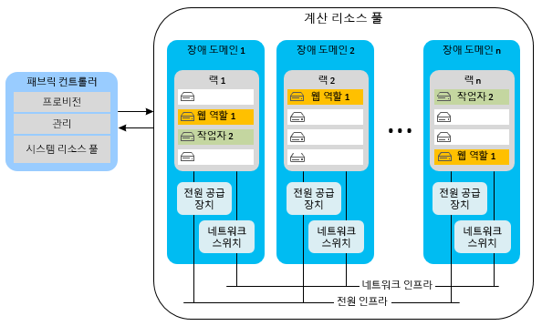
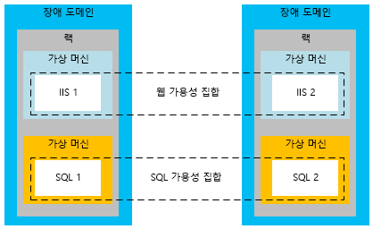
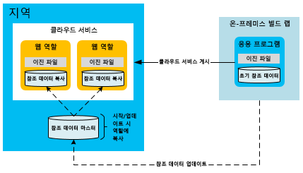
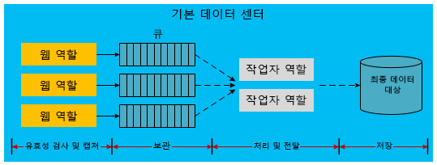

[!INCLUDE [header](../_includes/header.md)]

# Microsoft Azure에 빌드된 응용 프로그램에 대한 고가용성High availability for applications built on Microsoft Azure
가용성이 높은 응용 프로그램은 종속 서비스 및 하드웨어의 가용성, 부하 및 임시 오류의 변동 폭을 완화합니다.A highly available application absorbs fluctuations in availability, load, and temporary failures in dependent services and hardware. 응용 프로그램은 비즈니스 요구 사항 또는 응용 프로그램 SLA(서비스 수준 계약)에 정의된 바와 같이 계속해서 적절한 수준으로 작동합니다.The application continues to perform acceptably, as defined by business requirements or application service-level agreements (SLAs).

## Azure 고가용성 기능Azure high-availability features
Azure에는 항상 사용 가능한 응용 프로그램을 지원하는 많은 기본 제공 플랫폼 기능이 있습니다.Azure has many built-in platform features that support highly available applications. 이 섹션에서는 이러한 주요 기능 중 일부를 설명합니다.This section describes some of those key features.

### 패브릭 컨트롤러Fabric controller
Azure 패브릭 컨트롤러는 Azure 계산 인스턴스의 상태를 프로비전하고 모니터링합니다.The Azure fabric controller provisions and monitors the condition of Azure compute instances. 패브릭 컨트롤러는 호스트 및 게스트 머신 인스턴스의 하드웨어 및 소프트웨어의 상태를 모니터링합니다.The fabric controller monitors the status of the hardware and software of the host and guest machine instances. 오류가 감지되면 VM 인스턴스를 자동으로 재배치하여 SLA를 유지합니다.When it detects a failure, it maintains SLAs by automatically relocating the VM instances. 장애 도메인 및 업그레이드 도메인의 개념에서는 계산 SLA를 지원합니다.The concept of fault and upgrade domains further supports the compute SLA.

여러 클라우드 서비스 역할 인스턴스를 배포할 경우 Azure는 여러 장애 도메인에 이러한 인스턴스를 배포합니다.When multiple Cloud Service role instances are deployed, Azure deploys these instances to different fault domains. 장애 도메인 경계는 기본적으로 동일한 지역에 있는 다른 하드웨어 랙입니다.A fault domain boundary is essentially a different hardware rack in the same region. 장애 도메인은 국소적인 하드웨어 오류로 인해 응용 프로그램의 서비스가 중단될 가능성을 줄입니다.Fault domains reduce the probability that a localized hardware failure interrupts the service of an application. 사용자는 작업자 역할 또는 웹 역할의 장애 도메인의 수를 관리할 수 없습니다.You cannot manage the number of fault domains of your worker roles or web roles. 패브릭 컨트롤러는 Azure에서 호스팅한 응용 프로그램과 구별된 전용 리소스를 사용합니다.The fabric controller uses dedicated resources that are separate from Azure-hosted applications. 패브릭 컨트롤러는 Azure 시스템의 핵심이기 때문에 100% 가동 시간이 요구됩니다.It requires 100 percent uptime because it serves as the nucleus of the Azure system. 장애 도메인에서 역할 인스턴스를 모니터링하고 관리합니다.It monitors and manages role instances across fault domains.

다음 다이어그램에서는 패브릭 컨트롤러에서 여러 장애 도메인에 배포하고 관리하는 Azure 공유 리소스를 보여 줍니다.The following diagram shows Azure shared resources that the fabric controller deploys and manages across different fault domains.

장애 도메인은 장애를 완화하기 위한 물리적 분리인 반면, 업그레이드 도메인은 특정 시간에 서비스의 어느 인스턴스가 업그레이드될지를 결정하는 인스턴스 분리의 논리 단위입니다.While fault domains are physical separations to mitigate failure, upgrade domains are logical units of instance separation that determine which instances of a service will be upgraded at a specific time. 기본적으로 호스팅된 서비스 배포에는 다섯 개의 업그레이드 도메인이 정의됩니다.By default, five upgrade domains are defined for your hosted service deployment. 그러나 서비스 정의 파일에서 해당 값을 변경할 수 있습니다.However, you can change that value in the service definition file. 예를 들어 웹 역할이 8개 있다면 3개의 업그레이드 도메인에 2개의 인스턴스가 존재하고, 1개의 업그레이드 도메인에 2개의 인스턴스가 존재합니다.For example, if you have eight instances of your web role, there are two instances in three upgrade domains and two instances in one upgrade domain. Azure는 업그레이드 도메인의 개수를 바탕으로 업데이트 시퀀스를 정의합니다.Azure defines the update sequence based on the number of upgrade domains. 자세한 내용은 [클라우드 서비스 업데이트](/azure/cloud-services/cloud-services-update-azure-service/)를 참조하세요.For more information, see [Update a cloud service](/azure/cloud-services/cloud-services-update-azure-service/).

### 다른 서비스의 기능Features in other services
계산 리소스의 고가용성을 지원하는 이러한 플랫폼 기능 외에도 Azure의 다른 서비스에도 고가용성 기능이 포함되어 있습니다.In addition to the platform features that support high availability of compute resources, Azure embeds high-availability features in its other services. 예를 들어 Azure Storage는 Azure 저장소 계정에 모든 데이터에 대한 셋 이상의 복제본을 유지합니다.For example, Azure Storage maintains at least three replicas of all data in your Azure storage account. 또한, 보조 지역에 데이터 복사본을 저장하는 지역 복제를 지원합니다.It also enables geo-replication to store copies of your data in a secondary region. Azure Content Delivery Network를 사용하면 중복성, 확장성 및 낮은 대기 시간을 위해 세계 각지에 Blob을 캐시할 수 있습니다.The Azure Content Delivery Network allows blobs to be cached around the world for redundancy, scalability, and lower latency. Azure SQL Database는 여러 복제본도 유지 관리합니다.Azure SQL Database maintains multiple replicas as well.

Azure 플랫폼의 가용성 기능에 대해 자세히 알아보려면 [복원력 기술 지침](index.md)을 참조하세요.For a deeper discussion of Azure platform availability features, see [Resiliency technical guidance](index.md). [Microsoft Azure에서 대규모 서비스를 설계하는 모범 사례](https://azure.microsoft.com/blog/best-practices-for-designing-large-scale-services-on-windows-azure/)도 참조하세요.Also see [Best practices for designing large-scale services on Windows Azure](https://azure.microsoft.com/blog/best-practices-for-designing-large-scale-services-on-windows-azure/).

Azure에서 고가용성을 지원하는 여러 기능을 제공하지만 이러한 기능의 한계를 이해하는 것이 중요합니다.Although Azure provides multiple features that support high availability, it's important to understand their limitations:

* 계산의 경우 Azure는 역할을 사용할 수 있고 실행 중임을 보장하지만 응용 프로그램이 실행 중인지 또는 과부하된 상태인지는 알 수 없습니다.For compute, Azure guarantees that your roles are available and running, but it cannot detect whether your application is running or overloaded.
* Azure SQL Database의 경우 데이터는 지역 내에서 동기적으로 복제됩니다.For Azure SQL Database, data is replicated synchronously within the region. 활성 지역 복제를 선택하면 동일한 지역(또는 다른 지역)에서 최대 4개의 추가 데이터베이스 복사본을 보유할 수 있습니다.You can choose active geo-replication, which allows up to four additional database copies in the same region (or different regions). 이 데이터베이스 복제본은 특정 시점 백업이 아니지만, SQL Database에서 특정 시점 백업 기능을 제공합니다.While these database replicas are not point-in-time backups, SQL Database does provide point-in-time backup capabilities. 자세한 내용은 [자동화된 데이터 백업을 사용하여 Azure SQL Database 복구: 특정 시점 복원](/azure/sql-database/sql-database-recovery-using-backups#point-in-time-restore)을 참조하세요.For more information, see [Recover an Azure SQL Database using automated data backups: Point-in-time restore](/azure/sql-database/sql-database-recovery-using-backups#point-in-time-restore).
* Azure Storage의 경우 테이블 데이터 및 Blob 데이터는 기본적으로 대체 지역에 복제됩니다.For Azure Storage, table data and blob data are replicated by default to an alternate region. 그러나 Microsoft가 대체 사이트로 장애 조치를 선택할 때까지 사용자는 복제본에 액세스할 수 없습니다.However, you cannot access the replicas until Microsoft chooses to fail over to the alternate site. 지역 장애 조치는 장시간 지역 전체 서비스 중단 시에만 발생하고 지역 장애 조치 시간에 대한 SLA는 발생하지 않습니다.A region failover occurs only during a prolonged region-wide service disruption, and there is no SLA for geo-failover time. 데이터 손상이 복제본에 신속하게 확장된다는 점을 기억합니다.It's also important to note that any data corruption quickly spreads to the replicas. 따라서 사용자는 Blob 데이터의 특정 시점 백업을 생성하는 Blob 스냅숏 기능을 비롯한 각 응용 프로그램별 가용성 기능으로 플랫폼의 가용성 기능을 보완해야 합니다.For these reasons, you must supplement platform availability features with application-specific availability features, including the blob snapshot feature to create point-in-time backups of blob data.

### Azure Virtual Machines에 대한 가용성 집합Availability sets for Azure Virtual Machines
이 문서에서는 PaaS(Platform-as-a-Service) 모델을 사용하는 클라우드 서비스를 주로 다룹니다.This document primarily focuses on cloud services, which use a platform-as-a-service (PaaS) model. 이 외에도 IaaS(Infrastructure-as-a-Service) 모델을 사용하는 Azure Virtual Machines를 위한 (IaaS) 가용성 기능도 존재합니다.There are also specific availability features for Azure Virtual Machines, which use an infrastructure-as-a-service (IaaS) model. Virtual Machines를 사용하여 고가용성을 달성하려면 장애 도메인 및 업그레이드 도메인과 비슷한 기능을 수행하는 가용성 집합을 사용해야 합니다.To achieve high availability with Virtual Machines, you must use availability sets, which serve a similar function to fault and upgrade domains. 가용성 집합 내에서 Azure는 하드웨어 오류 및 유지 관리 활동이 해당 그룹에서 컴퓨터를 모두 중지시키지 않도록 방지하는 방식으로 가상 머신을 배치합니다.Within an availability set, Azure positions the virtual machines in a way that prevents localized hardware faults and maintenance activities from bringing down all the machines in that group. 가용성 집합은 Virtual Machines의 가용성을 위해 Azure SLA를 달성해야 합니다.Availability sets are required to achieve the Azure SLA for the availability of Virtual Machines.

다음 다이어그램에서는 각각 웹 가상 머신과 SQL Server 가상 머신을 위한 가용성 집합을 보여줍니다.The following diagram shows two availability sets for web and SQL Server virtual machines, respectively.

> [!NOTE]
> 위의 다이어그램에서 SQL Server는 가상 머신에 설치되고 실행됩니다.In the preceding diagram, SQL Server is installed and running on virtual machines. 이것은 데이터베이스를 관리되는 서비스로 제공하는 Azure SQL Database와 다릅니다.This is different from Azure SQL Database, which provides a database as a managed service.
> 
> 

## 고가용성을 위한 응용 프로그램 전략Application strategies for high availability
고가용성을 위한 대부분의 응용 프로그램 전략에는 응용 프로그램 구성 요소 간의 굳은 종속성을 중복하거나 제거하는 작업이 포함됩니다.Most application strategies for high availability involve either redundancy or the removal of hard dependencies between application components. 응용 프로그램 설계는 Azure 또는 타사 서비스의 산발적 가동 중지 시간 동안 내결함성을 지원해야 합니다.Application design should support fault tolerance during sporadic downtime of Azure or third-party services. 다음 섹션에서는 클라우드 서비스의 가용성을 높이기 위한 응용 프로그램 패턴을 설명합니다.The following sections describe application patterns for improving the availability of your cloud services.

### 비동기 통신 및 지속성 큐Asynchronous communication and durable queues
Azure 응용 프로그램의 가용성을 높이기 위해 느슨하게 결합된 서비스 사이의 비동기식 통신을 고려할 수 있습니다.To increase availability in Azure applications, consider asynchronous communication between loosely coupled services. 이 패턴에서는 메시지가 나중에 처리될 수 있도록 저장소 큐 또는 Azure Service Bus 큐에 쓰기됩니다.In this pattern, messages are written to either storage queues or Azure Service Bus queues for later processing. 메시지가 큐에 쓰기되는 즉시 보낸 사람에게 제어권이 반환됩니다.When a message is written to the queue, control immediately returns to the sender. 응용 프로그램의 다른 서비스(일반적으로 작업자 역할로 구현됨)가 메시지를 처리합니다.Another service of the application (typically implemented as a worker role) processes the message. 처리 서비스의 작동이 중지되면 처리 서비스가 복원될 때까지 메시지가 큐에 누적됩니다.If the processing service stops working, the messages accumulate in the queue until the processing service is restored. 프론트 엔드 보낸 사람과 메시지 처리기 사이에 직접적인 종속성은 존재하지 않습니다.There is no direct dependency between the front-end sender and the message processor. 이렇게 하면 분산 응용 프로그램에서 병목 현상을 유발할 수 있는 동기식 서비스 호출이 제거됩니다.This eliminates synchronous service calls that can cause bottlenecks in distributed applications.

이 패턴의 다른 변형에서는 실패한 데이터베이스 호출에 대한 정보를 Azure Storage(Blob, Table 또는 Queue) 또는 Service Bus 큐에 저장합니다.A variation of this pattern stores information about failed database calls in Azure Storage (blobs, tables, or queues) or Service Bus queues. 예를 들어, 다른 서비스(예: Azure SQL Database)에 대한 응용 프로그램 내의 동기적 호출이 반복해서 실패합니다.For example, a synchronous call within an application to another service (such as Azure SQL Database) fails repeatedly. 사용자는 이러한 요청을 내구성 높은 저장소에 직렬화할 수 있습니다.You might be able to serialize that request into durable storage. 나중에 서비스 또는 데이터베이스가 다시 온라인 상태가 되면 응용 프로그램은 저장소의 요청을 다시 제출할 수 있습니다.At some later point when the service or database is back online, the application can resubmit the request from storage. 이 모델의 차이점은 중간 위치가 응용 프로그램의 지속적인 부분으로서가 아니라 장애 시에만 사용된다는 점입니다.The difference in this model is that the intermediate location is used only during failures, not as a regular part of the application workflow.

두 시나리오 모두에서 비동기적 통신과 중간 저장소는 중단된 백 엔드 서비스가 전체 응용 프로그램을 중단하지 않도록 방지합니다.In both scenarios, asynchronous communication and intermediate storage prevent a downed back-end service from bringing down the entire application. 큐는 논리적 매개자로 사용됩니다.Queues serve as a logical intermediary. 다양한 큐 서비스 중 하나를 선택하는 방법에 자세한 내용은 [Azure 큐 및 Azure Service Bus 큐&mdash; 비교 및 대조](/azure/service-bus-messaging/service-bus-azure-and-service-bus-queues-compared-contrasted/)를 참조하세요.For more information on choosing between queuing services, see [Azure queues and Azure Service Bus queues &mdash; compared and contrasted](/azure/service-bus-messaging/service-bus-azure-and-service-bus-queues-compared-contrasted/).

### 오류 감지 및 다시 시도 논리Fault detection and retry logic
고가용성 응용 프로그램을 설계할 때 중요한 점은 코드 내에서 재시도 논리를 사용하여 일시적으로 중단된 서비스를 정상적으로 처리하는 것입니다.A key aspect of the design of highly available applications is the use of retry logic within code to gracefully handle a service that is temporarily unavailable. Azure Storage와 Azure Service Bus의 최신 버전의 SDK는 기본적으로 재시도를 지원합니다.Recent versions of SDKs for both Azure Storage and Azure Service Bus natively support retries. 응용 프로그램에 사용자 지정 재시도 로직을 적용하는 자세한 방법은 [재시도 패턴](../patterns/retry.md)을 참조하세요.For more information on providing custom retry logic for your application, see the [Retry pattern](../patterns/retry.md).

### 고가용성에 대한 참조 데이터 패턴Reference data pattern for high availability
참조 데이터는 응용 프로그램의 읽기 전용 데이터입니다.Reference data is the read-only data of an application. 이 데이터는 응용 프로그램이 비즈니스 작업 과정에서 트랜잭션 데이터를 생성하는 비즈니스 컨텍스트를 제공합니다.This data provides the business context within which the application generates transactional data during a business operation. 트랜잭션 데이터의 무결성은 트랜잭션이 완료된 시점의 참조 데이터에 대한 스냅숏에 의해 좌우됩니다.The integrity of transactional data depends on a snapshot of the reference data at the time the transaction was completed.

응용 프로그램이 올바르게 작동하려면 참조 데이터가 반드시 필요합니다.Reference data is necessary for the proper operation of the application. 다양한 응용 프로그램이 참조 데이터를 만들고 유지 관리합니다. MDM(마스터 데이터 관리) 시스템도 종종 이러한 기능을 수행합니다.Various applications create and maintain reference data; master data management (MDM) systems often perform this function. 이러한 시스템은 참조 데이터의 수명 주기를 담당합니다.These systems are responsible for the life cycle of the reference data. 참조 데이터의 예로 제품 카탈로그, 직원 마스터, 부품 마스터 및 장비 마스터가 있습니다.Examples of reference data include product catalog, employee master, parts master, and equipment master. 참조 데이터는 우편 번호 또는 세율 등 조직 외부에서 비롯되기도 합니다.Reference data can also originate from outside the organization, for example, postal codes or tax rates. 참조 데이터의 가용성을 높이기 위한 전략은 일반적으로 트랜잭션 데이터에 대한 전략보다 쉽습니다.Strategies for increasing the availability of reference data are typically less difficult than those for transactional data. 참조 데이터는 대부분 변경할 수 없다는 장점이 있습니다.Reference data has the advantage of being mostly immutable.

응용 프로그램과 함께 참조 데이터를 배포하면 참조 데이터를 사용하는 Azure 웹 역할과 작업자 역할이 런타임에 자치적 특성을 갖도록 만들 수 있습니다.Azure web and worker roles that consume reference data can be made autonomous at runtime by deploying the reference data along with the application. 이 방식은 로컬 저장소가 이러한 배포를 수용할 수 있을 만큼 큰 경우 적합합니다.This approach is ideal if the size of the local storage allows such a deployment. 임베디드 SQL 데이터베이스, NoSQL 데이터베이스 또는 로컬에 배포된 XML 파일은 Azure 계산 배율 단위의 자치적 특성을 지원합니다.Embedded SQL databases, NoSQL databases, or XML files deployed locally help with the autonomy of Azure compute scale units. 그러나 재배포하지 않아도 각 역할에서 데이터를 업데이트하는 메커니즘이 있어야 합니다.However, you should have a mechanism to update the data in each role without requiring redeployment. 이렇게 하려면 클라우드 저장소 끝점(예: Azure Blob Storage 또는 SQL Database)에 있는 참조 데이터를 업데이트해야 합니다.To do this, place any updates to the reference data at a cloud storage endpoint (for example, Azure Blob storage or SQL Database). 역할 시작 시 계산 노드에 데이터 업데이트를 다운로드하는 각 역할에 코드를 추가합니다.Add code to each role that downloads the data updates into the compute nodes at role startup. 또는 관리자가 역할 인스턴스에 강제 다운로드를 수행할 수 있게 하는 코드를 추가합니다.Alternatively, add code that allows an administrator to perform a forced download into the role instances.

또한 가용성을 향상하려면 저장소가 중지된 경우 역할이 참조 데이터 집합을 포함해야 합니다.To increase availability, the roles should also contain a set of reference data in case storage is down. 역할은 저장소 리소스가 업데이트를 사용할 수 있게 될 때까지 참조 데이터의 기본 집합을 이용할 수 있습니다.Roles can start with a basic set of reference data until the storage resource becomes available for the updates.

이 패턴에서는 다량의 참조 데이터를 배포 또는 다운로드하는 경우 새로운 배포 또는 역할 인스턴스가 시작하는 데 더 오랜 시간이 걸릴 수 있습니다.With this pattern, new deployments or role instances may take longer to start if you are deploying or downloading large amounts of reference data. 이러한 트레이드오프는 외부 저장소 서비스에 의존하지 않고 각 역할에서 즉시 사용할 수 있는 참조 데이터를 갖는 자치적 특성을 위해 허용될 수 있습니다.This tradeoff might be acceptable for the autonomy of having the reference data immediately available on each role, rather than depending on external storage services.

### 고가용성에 대한 트랜잭션 데이터 패턴Transactional data pattern for high availability
트랜잭션 데이터는 응용 프로그램이 비즈니스 컨텍스트에서 생성시킨 데이터입니다.Transactional data is the data that the application generates in a business context. 트랜잭션 데이터는 응용 프로그램이 구현하는 일련의 비즈니스 프로세스와 이러한 프로세스를 지원하는 참조 데이터의 조합입니다.Transactional data is a combination of the set of business processes that the application implements and the reference data that supports these processes. 트랜잭션 데이터의 예로 주문, 고급 선적 통지, 송장 및 CRM(고객 관계 관리) 기회가 있습니다.Examples of transactional data can include orders, advanced shipping notices, invoices, and customer relationship management (CRM) opportunities. 트랜잭션 데이터는 기록 보관 또는 추가 처리를 위해 외부 시스템으로 제공됩니다.Transactional data is supplied to external systems for record keeping or for further processing.

참조 데이터는 이 데이터를 담당하는 시스템 내에서 변경될 수 있습니다.Reference data can change within the systems that are responsible for that data. 따라서 트랜잭션 데이터는 해당 의미 체계의 일관성에 대한 외부 종속성을 최소화하기 위해 특정 시점 참조 데이터 컨텍스트를 저장해야 합니다.Therefore, transactional data must save the point-in-time reference data context to minimize external dependencies for its semantic consistency. 예를 들어 주문이 처리된 시점으로부터 몇 달 뒤에 제품이 카탈로그에서 제거될 수 있습니다.For example, a product may be removed from the catalog several months after an order is fulfilled. 이 경우 트랜잭션과 함께 가능한 한 많은 참조 데이터 컨텍스트를 저장하는 것이 좋습니다.Storing as much reference data context as possible with the transaction is recommended. 이 방식에서는 트랜잭션이 캡처된 뒤에 참조 데이터가 변경되어도 트랜잭션과 관련된 의미 체계가 유지됩니다.This approach preserves the semantics associated with the transaction, even if the reference data changes after the transaction is captured.

앞에서 설명한 것처럼 느슨한 결합 및 비동기식 통신을 사용하는 아키텍처는 높은 수준의 가용성을 제공합니다.As mentioned previously, architectures that use loose coupling and asynchronous communication can provide higher levels of availability. 트랜잭션 데이터의 경우에도 그렇지만 구현은 좀 더 복잡합니다.This is true for transactional data as well, but the implementation is more complex. 기존의 트랜잭션 패턴은 일반적으로 트랜잭션을 보장하기 위해 데이터베이스에 의존합니다.Traditional transactional patterns usually rely on the database for guaranteeing the transaction. 중간 계층을 도입할 경우 응용 프로그램 코드는 다양한 계층에서 데이터를 올바르게 처리하여 충분한 일관성 및 영속성을 확보해야 합니다.When you introduce intermediate layers, the application code must correctly handle the data at various layers to ensure sufficient consistency and durability.

다음 순서에서는 해당 처리에서 트랜잭션 데이터의 캡처를 구분하는 워크플로에 대해 설명합니다.The following sequence describes a workflow that separates the capture of transactional data from its processing:

1. 웹 계산 노드: 참조 데이터를 표시합니다.Web compute node: Present reference data.
2. 외부 저장소: 중간 트랜잭션 데이터를 저장합니다.External storage: Save intermediate transactional data.
3. 웹 계산 노드: 최종 사용자 트랜잭션을 완료합니다.Web compute node: Complete the end-user transaction.
4. 웹 계산 노드: 예측 가능한 응답을 제공하도록 보장하는 임시 지속성 저장소에 참조 데이터 컨텍스트와 함께 완료된 트랜잭션 데이터를 보냅니다.Web compute node: Send the completed transactional data with its reference data context to temporary durable storage that is guaranteed to give a predictable response.
5. 웹 계산 노드: 최종 사용자에게 트랜잭션 완료를 알립니다.Web compute node: Signal the end-user completion of the transaction.
6. 백그라운드 계산 노드: 트랜잭션 데이터를 추출하고 필요한 경우를 추가로 처리한 뒤 이를 현재 시스템에서 최종 저장소 위치로 전송합니다.Background compute node: Extract the transactional data, process it further if necessary, and send it to its final storage location in the current system.

다음 다이어그램은 Azure에서 호스팅되는 클라우드 서비스에서 이 디자인을 구현하는 방법을 보여 줍니다.The following diagram shows one possible implementation of this design in an Azure-hosted cloud service.

위의 다이어그램에서 점선으로 된 화살표는 비동기 처리를 나타냅니다.The dashed arrows in the preceding diagram indicate asynchronous processing. 프런트 엔드 웹 역할은 비동기 처리를 인식하지 않습니다.The front-end web role is not aware of this asynchronous processing. 이렇게 하면 현재 시스템에 대한 참조가 있는 최종 대상에 트랜잭션을 저장하게 됩니다.This leads to the storage of the transaction at its final destination with reference to the current system. 이 비동기 모델에서 발생한 대기 시간으로 인해 트랜잭션 데이터는 쿼리에 즉시 사용할 수 없습니다.Due to the latency that this asynchronous model introduces, the transactional data is not immediately available for query. 따라서 각 트랜잭션 데이터 단위를 캐시 또는 사용자 세션에 저장하여 즉각적인 UI 요구를 충족해야 합니다.Therefore, each unit of the transactional data needs to be saved in a cache or a user session to meet the immediate UI needs.

웹 역할은 나머지 인프라로부터 자치적입니다.The web role is autonomous from the rest of the infrastructure. 가용성 프로필은 전체 인프라가 아니라 웹 역할 및 Azure 큐의 조합입니다.Its availability profile is a combination of the web role and the Azure queue and not the entire infrastructure. 이 방법을 사용하면 고가용성을 달성하는 것 외에도 웹 역할을 백엔드 저장소와 독립적으로 수평 확장할 수 있습니다.In addition to high availability, this approach allows the web role to scale horizontally, independent of the back-end storage. 이러한 고가용성 모델은 작업의 경제에 영향을 미칠 수 있습니다.This high-availability model can have an impact on the economics of operations. Azure 큐 및 작업자 역할과 같은 추가 구성 요소가 월간 사용 비용에 영향을 줄 수 있습니다.Additional components like Azure queues and worker roles can affect monthly usage costs.

위의 다이어그램에서는 트랜잭션 데이터를 분리하는 방식을 한 가지 구현을 보여줍니다.The previous diagram shows one implementation of this decoupled approach to transactional data. 가능한 다른 구현이 많이 있습니다.There are many other possible implementations. 다음 목록은 몇 가지 대안을 제공합니다.The following list provides some alternatives:

* 작업자 역할은 웹 역할과 저장소 큐 간에 있을 수 있습니다.A worker role might be placed between the web role and the storage queue.
* Azure Storage 큐 대신 Service Bus 큐를 사용할 수 있습니다.A Service Bus queue can be used instead of an Azure Storage queue.
* 최종 대상은 Azure Storage 또는 다른 데이터베이스 공급자일 수 있습니다.The final destination might be Azure Storage or a different database provider.
* Azure 캐시는 트랜잭션 이후에 즉각적인 캐싱 요구 사항을 제공하는 웹 계층에 사용될 수 있습니다.Azure Cache can be used at the web layer to provide the immediate caching requirements after the transaction.

### 확장성 패턴Scalability patterns
클라우드 서비스의 확장성이 가용성에 직접 영향을 준다는 사실을 고려해야 합니다.It's important to note that the scalability of a cloud service directly affects availability. 부하 증가로 인해 서비스가 응답하지 않는 경우 사용자는 응용 프로그램이 중단되었다는 인상을 받습니다.If increased load causes your service to be unresponsive, the user perception is that the application is down. 예상되는 응용 프로그램 부하와 추후 예측에 기반하여 확장성 모범 사례를 따라야 합니다.Follow proven practices for scalability based on your expected application load and future expectations. 확장성을 극대화하려면 단일 및 다중 저장소 계정의 사용, 여러 데이터베이스 사이의 공유 및 캐싱 전략과 같은 다양한 사항을 고려해야 합니다.Maximizing scale involves many considerations, such as single versus multiple storage accounts, sharing across multiple databases, and caching strategies. 이러한 패턴에 대한 자세한 내용은 [Microsoft Azure에서 대규모 서비스 설계를 위한 모범 사례](https://azure.microsoft.com/blog/best-practices-for-designing-large-scale-services-on-windows-azure/)를 참조하세요.For in-depth information about these patterns, see [Best practices for designing large-scale services on Microsoft Azure](https://azure.microsoft.com/blog/best-practices-for-designing-large-scale-services-on-windows-azure/).

## 다음 단계Next steps
이 문서 시리즈에서는 Microsoft Azure에서 빌드된 응용 프로그램의 재해 복구 및 고가용성을 다룹니다.This series of documents covers disaster recovery and high availability for applications built on Microsoft Azure. 이 시리즈의 다음 문서는 [Microsoft Azure에서 빌드된 응용 프로그램의 재해 복구](disaster-recovery-azure-applications.md)입니다.The next article in the series is [Disaster recovery for applications built on Microsoft Azure](disaster-recovery-azure-applications.md).

