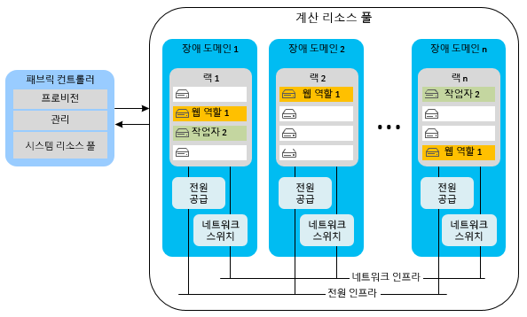
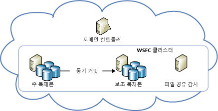
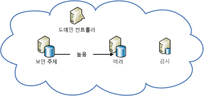

[!INCLUDE [header](../_includes/header.md)]
# Azure 복원 기술 지침: Azure의 로컬 장애 복구

응용 프로그램 가용성에 대한 주된 위협에는 두 가지가 있습니다.

* •	장치(드라이브, 서버 등) 장애
* •	중요한 리소스(최대 부하 상황에서의 컴퓨팅)의 소진

Azure는 이러한 상황에서 고가용성을 확보하기 위해 리소스 관리, 유연성, 부하 분산 및 파티셔닝의 조합을 제공합니다. 이들 기능 중 일부는 모든 Azure 서비스에서 자동으로 수행됩니다. 하지만 일부의 경우 그 혜택을 받으려면 응용 프로그램 개발자가 일부 추가 작업을 수행해야 합니다.

## 클라우드 서비스
Azure 클라우드 서비스는 한 개 이상의 웹 또는 작업자 역할 모음으로 구성됩니다. 한 개 이상의 역할 인스턴스가 동시에 실행될 수 있습니다. 구성을 통해 인스턴스의 수가 결정됩니다. 역할 인스턴스는 패브릭 컨트롤러라고 불리는 구성 요소를 통해 모니터링하여 관리합니다. 패브릭 컨트롤러는 소프트웨어 및 하드웨어 장애를 모두 감지하여 자동으로 대응합니다.

모든 역할 인스턴스는 자체 가상 컴퓨터(VM)을 실행하고 게스트 에이전트를 통해 해당 패브릭 컨트롤러와 통신합니다. 게스트 에이전트는 VM 사용량, 상태, 로그, 리소스 사용량, 예외 및 장애 상태 등 리소스와 노드 메트릭을 수집합니다. 패브릭 컨트롤러는 구성된 간격으로 게스트 에이전트에 쿼리하고, 게스트 에이전트가 응답하지 않으면 VM을 다시 시작합니다. 하드웨어 고장인 경우, 관련 패브릭 컨트롤러가 모든 해당 역할 인스턴스를 새 하드웨어 노드로 이동하고, 트래픽이 그쪽으로 라우팅하도록 네트워크를 구성합니다.

이러한 기능의 혜택을 받으려면 개발자는 모든 서비스가 역할 인스턴스에 상태를 저장하는 것을 피하도록 해야 합니다. 대신에 Azure Storage 또는 Azure SQL Database 등 영구 저장소에서 모든 영구적 데이터에 액세스해야 합니다. 그러면 모든 역할이 요청을 처리할 수 있습니다. 이는 또한 역할 인스턴스가 언제든지 서비스의 일시적 또는 지속적 상태에 불일치를 야기하지 않고 다운될 수 있음을 의미합니다.

상태를 외부적으로 역할에 저장하는 요구 사항에는 몇 가지 의미가 있습니다. 예를 들어 Azure Storage 테이블에 대한 모든 관련 변경 사항이 단일 엔티티 그룹 트랜잭션에서 변경되어야 함을 암시합니다 (가능한 경우). 물론 단일 트랜잭션에서 모든 변경을 수행하는 것이 항상 가능한 것은 아닙니다. 역할 인스턴스 장애가 서비스의 지속적 상태에 대해 두 개 이상의 업데이트가 포함된 장기 실행 작업을 중단시킬 경우, 그 장애가 문제를 야기하지 않도록 특별히 주의해야 합니다. 다른 역할이 그 작업을 재시도할 경우, 작업이 부분적으로 완료되었을 경우를 예상하고 처리해야 합니다.

예를 들어 여러 스토어에 걸쳐 데이터를 분할하는 서비스를 생각해보십시오. 작업자 역할이 분할된 데이터(shard)을 재배치하는 동안 다운될 경우 분할된 데이터 재배치가 완료되지 않았을 수 있습니다. 또는 다른 작업자 역할이 처음부터 재배치를 반복할 수 있으며, 그러면 데이터가 분리되거나 데이터 손상이 발생할 가능성이 있습니다. 문제를 방지하려면 장기 실행 작업은 다음 중 하나 또는 둘 모두에 해당되어야 합니다.

* *Idempotent*: 부작용 없이 반복 가능합니다. Idempotent이 가능하려면, 장기 실행 작업이 실행이 중단되는 경우에도 실행 횟수에 관계 없이 동일한 결과를 내야 합니다.
* *증분 다시 시작 가능*: 최근 실패 지점에서 계속할 수 있습니다. 증분 다시 시작이 가능하려면, 장기 실행 작업이 작은 원자성 작업 시퀀스로 구성되어야 합니다. 또한 진행 상태를 영구 저장소에 기록해야 하며, 따라서 각 후속 호출 시에 이전 작업이 중지되었던 지점을 포착할 수 있어야 합니다.

결국 모든 장기 실행 작업은 성공할 때까지 반복적으로 호출되어야 합니다. 예를 들어 프로비저닝 작업을 Azure 큐에 배치한 후, 성공할 경우에만 작업자 역할이 큐에서 이를 제거할 수 있습니다. 중단된 작업으로 만들어진 데이터를 정리하기 위해 가비지 수집이 필요할 수 있습니다.

### 유연성
각 역할에서 수행되는 초기 인스턴스 수는 각 역할의 구성을 통해 결정됩니다. 처음에 관리자는 예상 부하를 바탕으로 각 역할이 두 개 이상의 인스턴스로 실행되도록 구성해야 합니다. 하지만 사용 패턴이 변화함에 따라 역할 인스턴스를 손쉽게 확대/축소할 수 있습니다. 이 작업을 Azure 포털에서 수동으로 수행하거나, 또는 Windows PowerShell, Service Management AP나 타사 도구를 사용하여 그 프로세스를 자동화할 수도 있습니다. 자세한 내용은 [응용 프로그램 자동 크기 조정](/azure/cloud-services/cloud-services-how-to-scale/)을 참조하십시오.

### 분할
Azure 패브릭 컨트롤러는 두 가지 파티션을 사용합니다.

* *업데이트 도메인* 은 그룹에서 서비스의 역할 인스턴스를 업그레이드하기 위해 사용합니다. Azure는 서비스 인스턴스를 여러 업데이트 도메인에 배포합니다. In-place 업데이트의 경우, 패브릭 컨트롤러가 한쪽 업데이트 도메인에서 모든 인스턴스를 다운시키고 업데이트한 뒤 다시 시작한 후에 다음 업데이트 도메인으로 이동시킵니다. 이러한 접근법은 업데이트 프로세스 동안에 전체 서비스를 사용할 수 없게 되는 상황을 방지합니다.
* *장애 도메인* 은 예상되는 하드웨어 또는 네트워크 장애 지점을 정의합니다. 두 개 이상의 인스턴스가 있는 역할의 경우, 패브릭 컨트롤러가 인스턴스들을 여러 장애 도메인에 걸쳐 분산시키므로 격리된 하드웨어 장애가 서비스를 중단시키는 것을 방지합니다. 장애 도메인은 서버와 클러스터 장애에 대한 노출을 통제합니다.

[Azure 서비스 수준 계약(SLA)](https://azure.microsoft.com/support/legal/sla/) 은 두 개 이상의 웹 역할 인스턴스를 다른 장애 도메인 및 업그레이드 도메인에 배포할 경우 적어도 99.95%의 시간에서 외부 연결이 유지되도록 보장합니다. 업데이트 도메인과는 달리 장애 도메인의 수를 제어할 방법이 없습니다. Azure는 장애 도메인을 자동으로 할당하고 따라서 역할 인스턴스를 배분합니다. 적어도 모든 역할의 처음 두 개 인스턴스는 다른 장애 도메인과 업그레이드 도메인에 배치함으로써 적어도 두 개 이상의 인스턴스를 가진 역할은 SLA를 충족하도록 보장합니다. 그 내용이 다음 다이어그램에 표시되어 있습니다.

### 부하 분산
웹 역할의 모든 인바운드 트래픽은 상태 비저장 부하 분산 장치를 통과하며, 이 장치는 클라이언트 요청을 역할 인스턴스 간에 배분합니다. 개별 역할 인스턴스에는 공개 IP 주소가 없으며, 이들은 인터넷에서 직접 주소 지정을 할 수 없습니다. 웹 역할은 상태 비저장 방식이므로 모든 클라이언트 요청이 임의 역할 인스턴스로 라우팅됩니다. [StatusCheck](https://msdn.microsoft.com/library/microsoft.windowsazure.serviceruntime.roleenvironment.statuscheck.aspx) 이벤트는 15초마다 발생합니다. 이를 사용하여 역할이 트래픽을 수신할 준비가 되어 있는지 또는 작업 중이므로 부하 분산 장치의 로테이션에서 빠져야 하는지를 나타낼 수 있습니다.

## 가상 컴퓨터
Azure 가상 컴퓨터는 고가용성과 관련하여 몇 가지 측면에서 서비스형 플랫폼 (PaaS) 컴퓨팅 역할과 다릅니다. 일부 인스턴스의 경우 고가용성을 보장하려면 추가 작업을 수행해야 합니다.

### 디스크 내구성
PaaS 역할 인스턴스와는 달리, 가상 컴퓨터 드라이브에 저장된 데이터는 가상 컴퓨터를 재배치하더라도 영구적으로 유지됩니다. Azure 가상 컴퓨터는 Azure Storage 저장소에 Blob로 존재하는 VM 디스크를 사용합니다. Azure Storage의 가용성 특성 때문에 가상 컴퓨터의 드라이브에 저장된 데이터도 가용성이 높습니다.

(Windows VM의) D 드라이브는 이 규칙에서 예외라는 점에 유의하십시오. D 드라이브는 VM을 호스팅하는 랙 서버의 실제 물리적 저장소로서 VM을 재활용하면 그 안의 데이터가 손실됩니다. D 드라이브는 임시 저장소 용도로만 사용됩니다. Linux에서는 Azure가 "일반적으로" (항상은 아님) 로컬 임시 디스크를 /dev/sdb 블록 장치로 노출합니다. Azure Linux 에이전트는 /mnt/resource 또는 /mnt 탑재 지점으로 탑재하는 경우가 많습니다 (/etc/waagent.conf에서 구성 가능).

### 분할
Azure는 기본적으로 PaaS 응용 프로그램(웹 역할 및 작업자 역할)의 계층을 이해하므로 이를 장애 도메인 및 업데이트 도메인이 적절히 배분할 수 있습니다. 대조적으로 서비스형 인프라(IaaS) 응용 프로그램의 계층들은 가용성 집합을 통해서 수동으로 정의해야 합니다. 가용성 집합은 IaaS에 근거한 SLA에 필요합니다.

앞의 다이어그램에서 인터넷 정보 서비스(IIS) 계층(웹 앱 계층으로 작동)과 SQL 계층(데이터 계층으로 작동)이 다른 가용성 집합에 할당되어 있습니다. 따라서 가상 컴퓨터를 여러 장애 도메인에 걸쳐 배분함으로써 각 계층의 모든 인스턴스가 하드웨어 중복성을 확보하고, 업데이트 동안에 전체 계층이 다운되지 않습니다.

### 부하 분산
VM들이 트래픽을 서로 간에 배분해야 할 경우, 응용 프로그램에서 VM들을 그룹화하여 특정 TCP 또는 UDP 끝점에 걸쳐 부하를 분산해야 합니다. 자세한 내용은 [가상 컴퓨터의 부하 분산](/azure/virtual-machines/virtual-machines-linux-load-balance/?toc=%2fazure%2fvirtual-machines%2flinux%2ftoc.json)을 참조하십시오. VM이 다른 소스(예: 큐잉 메커니즘)로부터 입력을 받을 경우 부하 분산 장치가 필요하지 않습니다. 부하 분산 장치는 트래픽을 노드로 전송해야 하는지 여부를 결정하기 위해 기본적 상태 검사 기능을 사용합니다. VM이 트래픽을 수신해야 하는지 여부를 결정하기 위한 응용 프로그램별 상태 메트릭을 구현하기 위해 자체 프로브를 작성할 수도 있습니다.

## 저장소
Azure Storage는 Azure를 위한 기본적 지속형 데이터 서비스입니다. 이는 Blob, 표, 큐, VM 디스크 저장소를 제공합니다. 그리고 단일 데이터센터 내에서 고가용성을 제공하기 위해 복제 및 리소스 관리 기능의 조합을 사용합니다. Azure Storage 가용성 SLA는 적어도 99.9%의 시간에서 다음 사항을 보장합니다.

* 올바른 형식으로 된 데이터 추가, 업데이트, 읽기, 삭제 요청을 정확하게 성공적으로 처리함.
* 저장소 계정들이 인터넷 게이트웨이에 대한 연결을 유지하도록 함.

### 복제
Azure Storage는 전체 데이터의 복사본 여러 개를 지역 내의 완전히 독립된 물리적 저장소 서브시스템에 걸쳐 있는 다른 드라이브에 유지함으로써 데이터의 내구성을 확보해줍니다. 데이터가 동기적으로 복제되고, 기록을 인정하기 전에 모든 본사본을 커밋합니다. Azure Storage는 일관성이 매우 높은데, 이는 최근 기록을 반영하기 위한 확실하게 읽기를 수행한다는 의미입니다. 또한 데이터 복제본을 지속적으로 스캔하여 비트 로트(bit rot) 및 저장된 데이터의 무결성에 대해 간과된 위협을 감지하여 수리합니다.

서비스는 간단히 Azure Storage를 사용함으로써 복제 혜택을 받습니다. 서비스 개발자는 로컬 장애로부터 복구하기 위해 추가 작업을 수행할 필요가 없습니다.

### 자원 관리
2014년 5월 이후에 만들어진 저장소는 이제 최대 500TB까지 확장할 수 있습니다 (이전의 최대는 200TB였음). 추가 공간이 필요할 경우 응용 프로그램이 여러 저장소 계정을 하도록 설계해야 합니다.

### 가상 컴퓨터 디스크
가상 컴퓨터 디스크는 Azure Storage에 페이지 Blob로 저장되며, Blob 저장소와 동일한 내구성 및 확장성 속성을 부여합니다. 이러한 설계 방식은 VM에서 실행되는 서버가 고장 나거나 VM을 다른 서버에서 다시 시작해야 하는 경우에도 가상 컴퓨터 디스크에 있는 데이터를 지속적으로 유지해줍니다.

## 데이터베이스
### SQL 데이터베이스
Azure SQL Database는 서비스형 데이터베이스를 제공합니다. 이를 통해 응용 프로그램은 신속한 프로비저닝, 데이터 삽입 및 관계형 데이터베이스 쿼리를 수행할 수 있습니다. 또한 우리에게 익숙한 많은 SQL Server 특성과 기능을 제공하고 아울러 하드웨어, 구성, 패칭 및 복원성 부담을 줄여줍니다.

> [!참고]
> Azure SQL Database는 SQL Server와의 일대일 기능 패리티를 제공하지는 않습니다. 이는 다양한 요구 사항 집합 즉 클라우드 응용 프로그램에 고유하게 적합한 사항(예: 유연한 확장, 유지 보수 비용을 줄이기 위한 서비스형 데이터베이스)을 수행하도록 고안되었습니다. 자세한 내용은 [클라우드 SQL Server 옵션 선택: Azure SQL (PaaS) 데이터베이스 또는 Azure VM(IaaS)의 SQL Server](/azure/sql-database/sql-database-paas-vs-sql-server-iaas/)를 참조하십시오.
> 
> 

#### 복제
Azure SQL Database는 노드 수준의 장애에 대해 기본적인 복원력을 제공합니다. 모든 데이터베이스 기록이 쿼럼 커밋 기법(quorum commit technique)을 통해서 두 개 이상의 백그라운드 노드에 자동으로 복제됩니다. (트랜잭션이 성공한 것으로 간주되어 반환하기 전에, 기본 항목과 적어도 한 개의 보조 항목이 활동을 트랜잭션 로그에 기록하는 것을 확인해야 합니다.) 노드에 장애가 발생할 경우 데이터베이스가 자동으로 보조 복제본 중 하나로 장애 조치됩니다. 그러면 클라이언트 응용 프로그램의 일시적 연결 중단이 야기됩니다. 따라서 모든 Azure SQL Database 클라이언트는 일정 형태의 일시적 연결 처리 방식을 구현해야 합니다. 자세한 내용은 [서비스별 재시도 지침](/azure/best-practices-retry-service-specific/)을 참조하십시오.

#### 자원 관리
작성된 각 데이터베이스는 크기 상한으로 구성됩니다. 현재 이용 가능한 최대 크기는 1TB입니다 (크기 한도는 서비스 계층에 따라 달라집니다). [Azure SQL Database의 서비스 계층 및 성능 수준](/azure/sql-database/sql-database-resource-limits/#service-tiers-and-performance-levels)을 참조하십시오. 데이터베이스가 크기 상한에 도달하면 추가적인 INSERT 또는 UPDATE 명령을 거부합니다. (데이터 쿼리 및 삭제는 여전히 가능합니다.)

Azure SQL Database는 데이터베이스 내에서 리소스 관리를 위해 패브릭을 사용합니다. 하지만 패브릭 컨트롤러 대신에 장애 감지를 위해 링 토폴로지를 사용합니다. 클러스터의 모든 복제본에는 두 개의 인접 라우터가 있고, 다운될 때를 감지할 책임이 있습니다. 복제본이 다운되면 인접 라우터가 재구성 에이전트를 트리거하여 다른 컴퓨터에 그것을 다시 만듭니다. 논리 서버가 컴퓨터에 있는 리소스를 너무 많이 사용하지 못하게 하고, 컴퓨터의 물리적 한도를 초과하지 못하게 하기 위해 엔진 제한을 지원합니다.

### 유연성
응용 프로그램이 1TB 데이터베이스 한도 이상을 요구할 경우, 확장 접근법을 구현해야 합니다.  여러 SQL 데이터베이스에 걸쳐 데이터를 수동으로 분할(partitioning, 또는 sharding이라고도 함)함으로써 Azure SQL Database로 확장할 수 있습니다. 이 확장 접근법은 거의 선형에 가까운 비용 증가로 확장을 달성할 기회를 제공합니다. 데이터베이스 요금은 가능한 최대 크기 기준이 아닌, 일일 평균 실제 사용 크기를 기준으로 청구하므로 유연한 성장 또는 주문형 용량은 필요 시 추가 비용을 부담하고 확장할 수 있습니다.

## 가상 컴퓨터의 SQL Server
Azure 가상 컴퓨터에 SQL Server(버전 2014 이후)를 설치함으로써 SQL Server의 전통적 가용성 기능을 활용할 수 있습니다. 이들 기능에는 AlwaysOn 가용성 그룹, 데이터베이스 미러링 등이 포함됩니다. Azure VM, 저장소, 네트워킹은 가상화되지 않은 온프레미스 IT 인프라와는 다른 운영 특성을 가지고 있다는 점에 유의하십시오. Azure에 고가용성/재해 복구 (HA/DR) SQL Server 솔루션을 성공적으로 구현하려면 이러한 차이점을 이해하고 이를 수용하도록 솔루션을 설계해야 합니다.

### 가용성 집합의 고가용성 노드
Azure에 고가용성 솔루션을 구현할 때, Azure의 가용성 집합을 사용하여 고가용성 노드를 별도의 장애 도메인과 업그레이드 도메인에 배치할 수 있습니다. 보다 명확히 하자면 가용성 집합은 Azure 개념입니다. 이는 AlwaysOn 가용성 그룹, 데이터베이스 미러링 또는 다른 어떤 것을 사용하든 간에 진정으로 높은 데이터베이스 가용성을 확보하려면 따라야 할 모범 사례입니다. 이 모범 사례를 따르지 않으면, 시스템의 가용성이 높다는 잘못된 가정을 할 수 있습니다. 하지만 실제로 여러 노드에서 동시에 장애가 발생할 수 있는데 그 이유는 이들이 우연히 Azure 지역의 동일한 장애 도메인에 배치되기 때문입니다.

이 권고사항은 로그 전달과 함께 적용할 수 없습니다. 재해 복구 특성으로서, 서버들이 반드시 별도의 Azure 지역에서 실행되도록 해야 합니다. 정의상 이들 지역은 별도의 장애 도메인들입니다.

클래식 포털을 통해서 배포되는 Azure 클라우드 서비스 VM들이 동일한 가용성 집합에 포함되려면, 이들을 동일한 클라우드 서비스에 배포해야 합니다. Azure Resource Manager(현재 포털)을 통해서 배포된 VM에는 이러한 제한이 없습니다. 클래식 포털에 배포된 Azure 클라우드 서비스의 VM의 경우, 동일한 클라우드 서비스에 있는 노드들만 동일한 가용성 집합에 참여할 수 있습니다. 또한 클라우드서비스 VM들은 서비스 복구 후에도 해당 IP를 유지하도록 동일한 가상 네트워크에 있어야 합니다. 그러면 DNS 업데이트 중단이 발생하지 않습니다.

### Azure 전용: 고가용성 솔루션
AlwaysOn 가용성 집합 또는 데이터베이스 미러링을 사용하여 Azure에 있는 SQL Server 데이터베이스를 위해 고가용성 솔루션을 보유할 수 있습니다.

아래 다이어그램은 Azure 가상 컴퓨터에서 실행되는 AlwaysOn 가용성 그룹 아키텍처를 보여주고 있습니다. 이 다이어그램은 본 주제에 관한 심층적 문서인 [Azure 가상 컴퓨터의 SQL Server를 위한 고가용성 및 재해 복구](/azure/virtual-machines/windows/sql/virtual-machines-windows-sql-high-availability-dr/)를 참조하십시오.

또한 Azure 포털에 있는 AlwaysOn 템플릿을 사용하여 Azure VM에 AlwaysOn 가용성 그룹 배포를 종단간에 자동으로 구축할 수 있습니다. 자세한 내용은 [Microsoft Azure 포털 갤러리에서 SQL Server AlwaysOn 제공](https://blogs.technet.microsoft.com/dataplatforminsider/2014/08/25/sql-server-alwayson-offering-in-microsoft-azure-portal-gallery/)을 참조하십시오.

아래 다이어그램은 Azure 가상 컴퓨터에서 데이터베이스를 활용하는 것을 보여주고 있습니다. 이 내용도 심층적 주제인 [Azure 가상 컴퓨터의 SQL Server를 위한 고가용성 및 재해 복구](/azure/virtual-machines/windows/sql/virtual-machines-windows-sql-high-availability-dr/)에서 가져왔습니다.

> [!참고]
> 두 아키텍처에서 모두 도메인 컨트롤러가 필요합니다. 하지만 데이터베이스 미러링의 경우 서버 인증서를 사용함으로써 도메인 컨트롤러의 필요성을 없앨 수 있습니다.
> 
> 

## 기타 Azure 플랫폼 서비스
Azure에 구축된 응용 프로그램은 플랫폼 기능의 이점을 활용하여 로컬 장애로부터 복구할 수 있습니다. 일부의 경우 특정 시나리오의 가용성을 높이기 위해 특정 조치를 취할 수도 있습니다.

### 서비스 버스
Azure Service Bus의 일시적 중단을 경감하기 위해 클라이언트 측에 지속형 큐를 만드는 것을 고려해보십시오. 이는 서비스 버스 큐에 추가할 수 없는 메시지를 저장하는 대체 로컬 저장소 메커니즘을 임시로 사용합니다. 응용 프로그램이 서비스 복구 후에 임시 저장된 메시지를 처리하는 방법을 결정할 수 있습니다. 자세한 내용은 [서비스 버스 중개 메시징을 이용한 성능 향상 모범 사례](/azure/service-bus-messaging/service-bus-performance-improvements/) 및 [서비스 버스(재해 복구)](recovery-loss-azure-region.md#other-azure-platform-services)를 참조하십시오.

### HDInsight
Azure HDInsight와 관련된 데이터는 기본적으로 Azure Blob 저장소에 저장됩니다. Azure Storage는 Blob 저장소의 고가용성 및 내구성 속성을 지정합니다. Hadoop MapReduce 작업과 관련된 멀티 노드 프로세싱은, HDInsight에서 필요할 때 프로비저닝되는 일시적 Hadoop 분산 파일 시스템(HDFS)에서 이루어집니다. MapReduce 작업의 결과도 기본적으로 Azure Blob 저장소에 저장되므로 처리되는 데이터는 지속형이며 Hadoop 클러스터가 다시 디프로비저닝된 후에 높은 가용성을 유지하게 됩니다. 자세한 내용은 [HDInsight (재해 복구)](recovery-loss-azure-region.md#other-azure-platform-services)를 참조하십시오.

## 로컬 장애 체크리스트
### 클라우드 서비스
1. 이 문서의 클라우드 서비스 섹션을 검토합니다.
2. 각 역할에 대해 최소한 두 개의 인스턴스를 구성합니다.
3. 상태를 역할 인스턴스가 아닌 영구 저장소에 유지합니다.
4. StatusCheck 이벤트를 올바로 처리합니다.
5. 가능할 경우 관련 변경 사항을 트랜잭션에 래핑합니다.
6. 작업자 역할 작업이 idempotent인지 다시 시작 가능한지 확인합니다.
7. 성공할 때까지 작업을 계속 호출합니다.
8. 자동 크기 조정 전략을 고려합니다.

### 가상 컴퓨터
1. 이 문서의 가상 컴퓨터 섹션을 검토합니다.
2. D 드라이브는 영구 저장소로 사용하지 마십시오.
3. 서비스 계층에 있는 컴퓨터를 가용성 집합으로 그룹화합니다.
4. 부하 분산 및 프로브 옵션을 구성합니다.

### 저장소
1. 이 문서의 저장소 섹션을 검토합니다.
2. 데이터나 대역폭이 할당량을 초과할 경우 여러 저장소 계정을 사용합니다.

### SQL 데이터베이스
1. 이 문서의 SQL Database 섹션을 검토합니다.
2. 일시적 오류를 처리하기 위해 재시도 정책을 구현합니다.
3. 확장 전략으로 파티셔닝/분할을 사용합니다.

### 가상 컴퓨터의 SQL Server
1. 이 문서에 있는 가상 컴퓨터의 SQL Server 섹션을 검토합니다.
2. 가상 컴퓨터에 대한 이전의 권장 사항을 따릅니다.
3. AlwaysOn과 같은 SQL Server 고가용성 기능을 사용합니다.

### 서비스 버스
1. 이 문서의 Service Bus 섹션을 검토합니다.
2. 백업을 위해 지속형 클라이언트 측 큐를 만드는 것을 고려하십시오.

### HDInsight
1. 이 문서의 HDInsight 섹션을 검토합니다.
2. 로컬 장애에 대해서는 추가적인 가용성 절차가 필요하지 않습니다.

