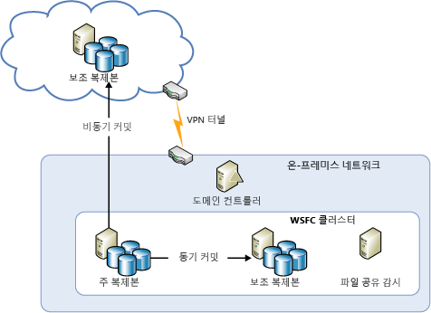
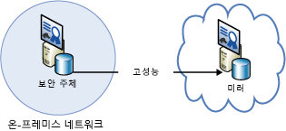
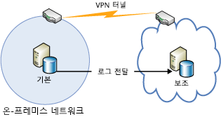
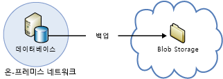

[!INCLUDE [header](../_includes/header.md)]

# Azure 복원력 기술 지침: 온-프레미스에서 Azure로 복구Azure resiliency technical guidance: Recovery from on-premises to Azure
Azure는 고가용성 및 재해 복구를 위해서 Azure에 대한 온-프레미스 데이터 센터의 확장을 사용하도록 설정한 일련의 포괄적인 서비스를 제공합니다.Azure provides a comprehensive set of services for enabling the extension of an on-premises datacenter to Azure for high availability and disaster recovery purposes:

* **네트워킹**: 가상 개인 네트워크를 통해 온-프레미스 네트워크를 클라우드로 안전하게 확장할 수 있습니다.**Networking**: With a virtual private network, you securely extend your on-premises network to the cloud.
* **Compute**: Hyper-V 온-프레미스를 사용하는 고객은 기존 VM(가상 머신)을 Azure로 “전환”할 수 있습니다.**Compute**: Customers using Hyper-V on-premises can “lift and shift” existing virtual machines (VMs) to Azure.
* **저장소**: StorSimple을 사용하여 파일 시스템을 Azure Storage로 확장할 수 있습니다.**Storage**: StorSimple extends your file system to Azure Storage. Azure Backup 서비스는 파일 및 SQL 데이터베이스를 Azure Storage에 백업하는 기능을 제공합니다.The Azure Backup service provides backup for files and SQL databases to Azure Storage.
* **데이터베이스 복제**: SQL Server 2014 이상 가용성 그룹을 통해 온-프레미스 데이터에 대한 고가용성 및 재해 복구를 구현할 수 있습니다.**Database replication**: With SQL Server 2014 (or later) Availability Groups, you can implement high availability and disaster recovery for your on-premises data.

## 네트워킹Networking
Azure Virtual Network를 사용하면 Azure에 논리적으로 분리된 섹션을 만들 수 있으며 IPsec 연결을 사용하여 온-프레미스 데이터 센터 또는 단일 클라이언트 컴퓨터에 안전하게 연결할 수 있습니다.You can use Azure Virtual Network to create a logically isolated section in Azure and securely connect it to your on-premises datacenter or a single client machine by using an IPsec connection. Virtual Network를 사용하면 Windows Server, 메인프레임 및 UNIX에서 실행되는 시스템을 비롯한 데이터 및 응용 프로그램 온-프레미스에 연결을 제공하는 동시에 Azure에서 확장성 있는 주문형 인프라를 쉽게 이용할 수 있습니다.With Virtual Network, you can take advantage of the scalable, on-demand infrastructure in Azure while providing connectivity to data and applications on-premises, including systems running on Windows Server, mainframes, and UNIX. 자세한 내용은 [Azure 네트워킹 설명서](/azure/virtual-network/virtual-networks-overview/) 를 참조하세요.See [Azure networking documentation](/azure/virtual-network/virtual-networks-overview/) for more information.

## 컴퓨팅Compute
Hyper-V를 사용하는 경우 온-프레미스는 VM을 변경하거나 VM 형식을 변환하지 않고 기존 가상 머신을 Windows Server 2012(또는 이상)를 실행하는 Azure 및 서비스 공급자에 “전환”할 수 있습니다.If you're using Hyper-V on-premises, you can “lift and shift” existing virtual machines to Azure and service providers running Windows Server 2012 (or later), without making changes to the VM or converting VM formats. 자세한 내용은 [Azure 가상 머신용 디스크 및 VHD 정보](/azure/virtual-machines/virtual-machines-linux-about-disks-vhds/?toc=%2fazure%2fvirtual-machines%2flinux%2ftoc.json)를 참조하세요.For more information, see [About disks and VHDs for Azure virtual machines](/azure/virtual-machines/virtual-machines-linux-about-disks-vhds/?toc=%2fazure%2fvirtual-machines%2flinux%2ftoc.json).

## Azure Site RecoveryAzure Site Recovery
DRaaS(disaster recovery as a service)를 선호하는 경우 Azure는 [Azure Site Recovery](https://azure.microsoft.com/services/site-recovery/)를 제공합니다.If you want disaster recovery as a service (DRaaS), Azure provides [Azure Site Recovery](https://azure.microsoft.com/services/site-recovery/). Azure Site Recovery는 VMware, Hyper-V 및 물리적 서버에 대한 포괄적인 보호 기능을 제공합니다.Azure Site Recovery offers comprehensive protection for VMware, Hyper-V, and physical servers. Azure Site Recovery를 사용하면 다른 온-프레미스 서버 또는 Azure를 복구 사이트로 사용할 수 있습니다.With Azure Site Recovery, you can use another on-premises server or Azure as your recovery site. Azure Site Recovery에 대한 자세한 내용은 [Azure Site Recovery 설명서](https://azure.microsoft.com/documentation/services/site-recovery/)를 참조하세요.For more information on Azure Site Recovery, see the [Azure Site Recovery documentation](https://azure.microsoft.com/documentation/services/site-recovery/).

## StorageStorage
온-프레미스 데이터에 대한 백업 사이트로 Azure를 사용하는 경우 몇 가지 옵션이 있습니다.There are several options for using Azure as a backup site for on-premises data.

### StorSimpleStorSimple
StorSimple는 온-프레미스 응용 프로그램에 대한 클라우드 저장소를 안전하고 투명하게 통합합니다.StorSimple securely and transparently integrates cloud storage for on-premises applications. 또한 고성능 계층화된 로컬 및 클라우드 저장소, 라이브 보관, 클라우드 기반 데이터 보호 및 재해 복구를 구현하는 단일 어플라이언스를 제공합니다.It also offers a single appliance that delivers high-performance tiered local and cloud storage, live archiving, cloud-based data protection, and disaster recovery. 자세한 내용은 [StorSimple 제품 페이지](https://azure.microsoft.com/services/storsimple/)를 참조하세요.For more information, see the [StorSimple product page](https://azure.microsoft.com/services/storsimple/).

### Azure BackupAzure Backup
Azure Backup을 통해 Windows Server 2012(또는 이상), Windows Server 2012 Essentials(또는 이상) 및 System Center 2012 Data Protection Manager(또는 이상)에서 익숙한 백업 도구를 사용하여 클라우드 백업을 활성화할 수 있습니다.Azure Backup enables cloud backups by using the familiar backup tools in Windows Server 2012 (or later), Windows Server 2012 Essentials (or later), and System Center 2012 Data Protection Manager (or later). 이러한 도구는 로컬 디스크 또는 Azure Storage 여부에 상관 없이 백업의 저장 위치와 독립적인 백업 관리에 대한 워크플로를 제공합니다.These tools provide a workflow for backup management that is independent of the storage location of the backups, whether a local disk or Azure Storage. 클라우드로 데이터를 백업한 후에는 권한 있는 사용자가 서버로 백업을 쉽게 복구할 수 있습니다.After data is backed up to the cloud, authorized users can easily recover backups to any server.

증분 백업으로, 변경된 파일만 클라우드에 전송됩니다.With incremental backups, only changes to files are transferred to the cloud. 이렇게 하면 저장소 공간을 효율적으로 사용하고 대역폭 사용을 줄일 수 있으며 여러 버전의 데이터에 대해 지정 시간 복구를 지원할 수 있습니다.This helps to efficiently use storage space, reduce bandwidth consumption, and support point-in-time recovery of multiple versions of the data. 또한 데이터 보존 정책, 데이터 압축 및 데이터 전송 제한 등의 추가 기능을 사용할 수 있습니다.You can also choose to use additional features, such as data retention policies, data compression, and data transfer throttling. Azure를 백업 위치로 사용하면 백업이 자동으로 "오프사이트"가 된다는 장점이 있습니다.Using Azure as the backup location has the obvious advantage that the backups are automatically “offsite”. 이렇게 하면 추가 요구 사항을 제거하여 온사이트 백업 미디어를 보호할 수 있습니다.This eliminates the extra requirements to secure and protect on-site backup media.

자세한 내용은 [Azure Backup이란?](/azure/backup/backup-introduction-to-azure-backup/) 및 [DPM 데이터를 위한 Azure Backup 구성](https://technet.microsoft.com/library/jj728752.aspx)을 참조하세요.For more information, see [What is Azure Backup?](/azure/backup/backup-introduction-to-azure-backup/) and [Configure Azure Backup for DPM data](https://technet.microsoft.com/library/jj728752.aspx).

## 데이터베이스Database
AlwaysOn 가용성 그룹, 데이터베이스 미러링, 로그 전달, Azure Blob 저장소를 사용한 백업 및 복원을 사용하여 하이브리드 IT 환경 내에 SQL Server 데이터베이스에 대한 재해 복구 솔루션을 구축할 수 있습니다.You can have a disaster recovery solution for your SQL Server databases in a hybrid-IT environment by using AlwaysOn Availability Groups, database mirroring, log shipping, and backup and restore with Azure Blob storage. 다음 솔루션은 모두 Azure Virtual Machines에서 실행되는 SQL Server를 사용합니다.All of these solutions use SQL Server running on Azure Virtual Machines.

데이터베이스 복제본이 온-프레미스와 클라우드 모두에 존재하는 하이브리드 IT 환경에서 AlwaysOn 가용성 그룹을 사용할 수 있습니다.AlwaysOn Availability Groups can be used in a hybrid-IT environment where database replicas exist both on-premises and in the cloud. 다음 다이어그램에 나와 있습니다.This is shown in the following diagram.

데이터베이스 미러링은 온-프레미스 서버 및 인증서 기반 설정의 클라우드에 걸쳐 있을 수도 있습니다.Database mirroring can also span on-premises servers and the cloud in a certificate-based setup. 아래 다이어그램은 이 개념을 보여 줍니다.The following diagram illustrates this concept.

로그 전달을 사용하여 Azure 가상 머신에서 SQL Server 데이터베이스를 포함한 온-프레미스 데이터베이스를 동기화할 수 있습니다.Log shipping can be used to synchronize an on-premises database with a SQL Server database in an Azure virtual machine.

마지막으로 Azure Blob 저장소에 직접 온-프레미스 데이터베이스를 백업할 수 있습니다.Finally, you can back up an on-premises database directly to Azure Blob storage.

자세한 내용은 [Azure 가상 머신에서 SQL Server의 고가용성 및 재해 복구](/azure/virtual-machines/windows/sql/virtual-machines-windows-sql-high-availability-dr/) 및 [Azure 가상 머신에서 SQL Server Backup 및 복원](/azure/virtual-machines/windows/sql/virtual-machines-windows-sql-backup-recovery/)을 참조하세요.For more information, see [High availability and disaster recovery for SQL Server in Azure virtual machines](/azure/virtual-machines/windows/sql/virtual-machines-windows-sql-high-availability-dr/) and [Backup and restore for SQL Server in Azure virtual machines](/azure/virtual-machines/windows/sql/virtual-machines-windows-sql-backup-recovery/).

## Microsoft Azure에서 온-프레미스 복구를 위한 검사 목록Checklists for on-premises recovery in Microsoft Azure
### 네트워킹Networking
1. 이 문서의 네트워킹 섹션을 검토합니다.Review the Networking section of this document.
2. Virtual Network를 사용하여 온-프레미스를 클라우드로 안전하게 연결합니다.Use Virtual Network to securely connect on-premises to the cloud.

### 컴퓨팅Compute
1. 이 문서의 Compute 섹션을 검토합니다.Review the Compute section of this document.
2. Hyper-V와 Azure 간에 VM을 재배치합니다.Relocate VMs between Hyper-V and Azure.

### StorageStorage
1. 이 문서의 저장소 섹션을 검토합니다.Review the Storage section of this document.
2. 클라우드 저장소를 사용하기 위해 StorSimple 서비스를 활용합니다.Take advantage of StorSimple services for using cloud storage.
3. Azure Backup 서비스를 사용합니다.Use the Azure Backup service.

### 데이터베이스Database
1. 이 문서의 데이터베이스 섹션을 검토합니다.Review the Database section of this document.
2. Azure VM에서 SQL Server를 백업으로 사용하도록 고려합니다.Consider using SQL Server on Azure VMs as the backup.
3. AlwaysOn 가용성 그룹을 설정합니다.Set up AlwaysOn Availability Groups.
4. 인증서 기반 데이터베이스 미러링을 구성합니다.Configure certificate-based database mirroring.
5. 로그 전달을 사용합니다.Use log shipping.
6. 온-프레미스 데이터베이스를 Azure Blob 저장소에 백업합니다.Back up on-premises databases to Azure Blob storage.

