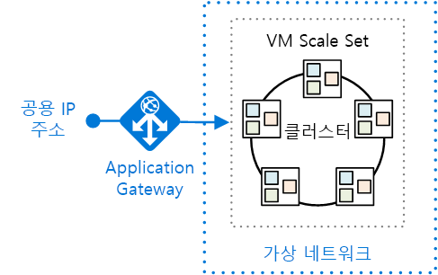
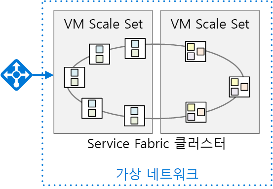

# <a name="migrate-an-azure-cloud-services-application-to-azure-service-fabric"></a><span data-ttu-id="16a37-103">Azure Service Fabric으로 Azure Cloud Services 응용 프로그램 마이그레이션</span><span class="sxs-lookup"><span data-stu-id="16a37-103">Migrate an Azure Cloud Services application to Azure Service Fabric</span></span> 

<span data-ttu-id="16a37-104">[ 샘플 코드][sample-code]</span><span class="sxs-lookup"><span data-stu-id="16a37-104">[ Sample code][sample-code]</span></span>

<span data-ttu-id="16a37-105">이 문서는 Azure Cloud Services에서 Azure Service Fabric으로 응용 프로그램을 마이그레이션하는 방법을 설명합니다.</span><span class="sxs-lookup"><span data-stu-id="16a37-105">This article describes migrating an application from Azure Cloud Services to Azure Service Fabric.</span></span> <span data-ttu-id="16a37-106">아키텍처 관련 결정 사항 및 권장 사례에 중점을 둡니다.</span><span class="sxs-lookup"><span data-stu-id="16a37-106">It focuses on architectural decisions and recommended practices.</span></span> 

<span data-ttu-id="16a37-107">이 프로젝트의 경우 설문 조사라고 하는 Cloud Services 응용 프로그램으로 시작했으며, Service Fabric으로 포팅했습니다.</span><span class="sxs-lookup"><span data-stu-id="16a37-107">For this project, we started with a Cloud Services application called Surveys and ported it to Service Fabric.</span></span> <span data-ttu-id="16a37-108">목적은 응용 프로그램을 최대한 적게 변경하며 마이그레이션하는 것입니다.</span><span class="sxs-lookup"><span data-stu-id="16a37-108">The goal was to migrate the application with as few changes as possible.</span></span> <span data-ttu-id="16a37-109">이후 문서에서는 마이크로 서비스 아키텍처를 채택하여 응용 프로그램을 Service Fabric에 최적화합니다.</span><span class="sxs-lookup"><span data-stu-id="16a37-109">In a later article, we will optimize the application for Service Fabric by adopting a microservices architecture.</span></span>

<span data-ttu-id="16a37-110">이는 이 문서를 읽기 전에 Service Fabric 및 마이크로 서비스 아키텍처의 기본 사항을 전반적으로 이해하는 데 유용할 것입니다.</span><span class="sxs-lookup"><span data-stu-id="16a37-110">Before reading this article, it will be useful to understand the basics of Service Fabric and microservices architectures in general.</span></span> <span data-ttu-id="16a37-111">다음 문서를 참조하세요.</span><span class="sxs-lookup"><span data-stu-id="16a37-111">See the following articles:</span></span>

- <span data-ttu-id="16a37-112">[Azure Service Fabric의 개요][sf-overview]</span><span class="sxs-lookup"><span data-stu-id="16a37-112">[Overview of Azure Service Fabric][sf-overview]</span></span>
- <span data-ttu-id="16a37-113">[응용 프로그램 구축에 마이크로 서비스 접근 방식이 필요한 이유][sf-why-microservices]</span><span class="sxs-lookup"><span data-stu-id="16a37-113">[Why a microservices approach to building applications?][sf-why-microservices]</span></span>


## <a name="about-the-surveys-application"></a><span data-ttu-id="16a37-114">설문 조사 응용 프로그램에 대한 정보</span><span class="sxs-lookup"><span data-stu-id="16a37-114">About the Surveys application</span></span>

<span data-ttu-id="16a37-115">2012년에 패턴 및 연습 그룹은 [클라우드에 대한 다중 테넌트 응용 프로그램 개발][tailspin-book]이란 책을 위해 설문 조사라는 응용 프로그램을 만들었습니다.</span><span class="sxs-lookup"><span data-stu-id="16a37-115">In 2012, the patterns & practices group created an application called Surveys, for a book called [Developing Multi-tenant Applications for the Cloud][tailspin-book].</span></span> <span data-ttu-id="16a37-116">책은 설문 조사 응용 프로그램을 디자인하고 구현하는 Tailspin이라는 가상의 회사를 설명합니다.</span><span class="sxs-lookup"><span data-stu-id="16a37-116">The book describes a fictitious company named Tailspin that designs and implements the Surveys application.</span></span>

<span data-ttu-id="16a37-117">설문 조사는 고객이 설문 조사를 만들 수 있도록 허용하는 다중 테넌트 응용 프로그램입니다.</span><span class="sxs-lookup"><span data-stu-id="16a37-117">Surveys is a multitenant application that allows customers to create surveys.</span></span> <span data-ttu-id="16a37-118">고객이 응용 프로그램에 등록하면 고객의 조직 내 팀원들이 설문 조사를 만들고, 게시하고, 분석에 대한 결과를 수집할 수 있습니다.</span><span class="sxs-lookup"><span data-stu-id="16a37-118">After a customer signs up for the application,  members of the customer's organization can create and publish surveys, and collect the results for analysis.</span></span> <span data-ttu-id="16a37-119">응용 프로그램에는 사람들이 설문 조사를 수행할 수 있는 공용 웹 사이트가 포함됩니다.</span><span class="sxs-lookup"><span data-stu-id="16a37-119">The application includes a public website where people can take a survey.</span></span> <span data-ttu-id="16a37-120">[여기][tailspin-scenario]에서 Tailspin 시나리오에 대해 자세히 읽어보세요.</span><span class="sxs-lookup"><span data-stu-id="16a37-120">Read more about the original Tailspin scenario [here][tailspin-scenario].</span></span>

<span data-ttu-id="16a37-121">이제 Tailspin은 Azure에서 실행되는 Service Fabric를 사용하여 설문 조사 응용 프로그램을 마이크로 서비스 아키텍처로 이동하고자 합니다.</span><span class="sxs-lookup"><span data-stu-id="16a37-121">Now Tailspin wants to move the Surveys application to a microservices architecture, using Service Fabric running on Azure.</span></span> <span data-ttu-id="16a37-122">응용 프로그램은 이미 Cloud Services 응용 프로그램으로 배포했으므로 Tailspin은 다중 단계 접근 방식을 채택합니다.</span><span class="sxs-lookup"><span data-stu-id="16a37-122">Because the application is already deployed as a Cloud Services application, Tailspin adopts a multi-phase approach:</span></span>

1.  <span data-ttu-id="16a37-123">응용 프로그램에 대한 변경을 최소화하면서 클라우드 서비스를 Service Fabric에 포팅합니다.</span><span class="sxs-lookup"><span data-stu-id="16a37-123">Port the cloud services to Service Fabric, while minimizing changes to the application.</span></span>
2.  <span data-ttu-id="16a37-124">마이크로 서비스 아키텍처로 이동하여 응용 프로그램을 Service Fabric에 최적화합니다.</span><span class="sxs-lookup"><span data-stu-id="16a37-124">Optimize the application for Service Fabric, by moving to a microservices architecture.</span></span>

<span data-ttu-id="16a37-125">이 문서에서는 첫 번째 단계를 설명합니다.</span><span class="sxs-lookup"><span data-stu-id="16a37-125">This article describes the first phase.</span></span> <span data-ttu-id="16a37-126">이후 문서에서는 두 번째 단계를 설명합니다.</span><span class="sxs-lookup"><span data-stu-id="16a37-126">A later article will describe the second phase.</span></span> <span data-ttu-id="16a37-127">실제 프로젝트에서는 두 단계가 겹칠 가능성이 높습니다.</span><span class="sxs-lookup"><span data-stu-id="16a37-127">In a real-world project, it's likely that both stages would overlap.</span></span> <span data-ttu-id="16a37-128">Service Fabric에 포팅하는 동안 마이크로 서비스로 응용 프로그램을 재설계할 수도 있습니다.</span><span class="sxs-lookup"><span data-stu-id="16a37-128">While porting to Service Fabric, you would also start to re-architect the application into micro-services.</span></span> <span data-ttu-id="16a37-129">나중에 성긴(coarse-grained) 서비스를 더 작은 서비스로 나누면서 아키텍처를 추가로 구체화할 수도 있습니다.</span><span class="sxs-lookup"><span data-stu-id="16a37-129">Later you might refine the architecture further, perhaps dividing coarse-grained services into smaller services.</span></span>  

<span data-ttu-id="16a37-130">응용 프로그램 코드는 [GitHub][sample-code]에서 사용할 수 있습니다.</span><span class="sxs-lookup"><span data-stu-id="16a37-130">The application code is available on [GitHub][sample-code].</span></span> <span data-ttu-id="16a37-131">이 리포지토리에는 Cloud Services 응용 프로그램 및 Service Fabric 버전이 모두 포함되어 있습니다.</span><span class="sxs-lookup"><span data-stu-id="16a37-131">This repo contains both the Cloud Services application and the Service Fabric version.</span></span> 

> <span data-ttu-id="16a37-132">클라우드 서비스는 *다중 테넌트 응용 프로그램 개발* 책에 나오는 원래 응용 프로그램의 업데이트된 버전입니다.</span><span class="sxs-lookup"><span data-stu-id="16a37-132">The cloud service is an updated version of the original application from the *Developing Multi-tenant Applications* book.</span></span>

## <a name="why-microservices"></a><span data-ttu-id="16a37-133">마이크로 서비스를 사용하는 이유</span><span class="sxs-lookup"><span data-stu-id="16a37-133">Why Microservices?</span></span>

<span data-ttu-id="16a37-134">마이크로 서비스에 대한 심도있는 논의는 이 문서의 범위를 벗어납니다. 하지만 마이크로 서비스 아키텍처로 이동함으로써 Tailspin에서 얻고자 하는 몇 가지 이점은 다음과 같습니다.</span><span class="sxs-lookup"><span data-stu-id="16a37-134">An in-depth discussion of microservices is beyond scope of this article, but here are some of the benefits that Tailspin hopes to get by moving to a microservices architecture:</span></span>

- <span data-ttu-id="16a37-135">**응용 프로그램 업그레이드**.</span><span class="sxs-lookup"><span data-stu-id="16a37-135">**Application upgrades**.</span></span> <span data-ttu-id="16a37-136">서비스를 독립적으로 배포할 수 있으므로 응용 프로그램을 업그레이드하는 증분 방식을 사용할 수 있습니다.</span><span class="sxs-lookup"><span data-stu-id="16a37-136">Services can be deployed independently, so you can take an incremental approach to upgrading an application.</span></span>
- <span data-ttu-id="16a37-137">**복원력 및 결함 분리**.</span><span class="sxs-lookup"><span data-stu-id="16a37-137">**Resiliency and fault isolation**.</span></span> <span data-ttu-id="16a37-138">서비스가 실패하는 경우 다른 서비스가 계속 실행합니다.</span><span class="sxs-lookup"><span data-stu-id="16a37-138">If a service fails, other services continue to run.</span></span>
- <span data-ttu-id="16a37-139">**확장성**.</span><span class="sxs-lookup"><span data-stu-id="16a37-139">**Scalability**.</span></span> <span data-ttu-id="16a37-140">서비스를 독립적으로 확장할 수 있습니다.</span><span class="sxs-lookup"><span data-stu-id="16a37-140">Services can be scaled independently.</span></span>
- <span data-ttu-id="16a37-141">**유연성**.</span><span class="sxs-lookup"><span data-stu-id="16a37-141">**Flexibility**.</span></span> <span data-ttu-id="16a37-142">서비스는 기술 스택이 아닌 비즈니스 시나리오를 위해 설계되어 새 기술, 프레임워크 또는 데이터 저장소로 서비스를 더욱 쉽게 마이그레이션할 수 있습니다.</span><span class="sxs-lookup"><span data-stu-id="16a37-142">Services are designed around business scenarios, not technology stacks, making it easier to migrate services to new technologies, frameworks, or data stores.</span></span>
- <span data-ttu-id="16a37-143">**기민한 개발**.</span><span class="sxs-lookup"><span data-stu-id="16a37-143">**Agile development**.</span></span> <span data-ttu-id="16a37-144">개별 서비스에는 모놀리식 응용 프로그램보다 코드가 더 적으므로 코드 베이스를 더 쉽게 이해, 추론 및 테스트할 수 있습니다.</span><span class="sxs-lookup"><span data-stu-id="16a37-144">Individual services have less code than a monolithic application, making the code base easier to understand, reason about, and test.</span></span>
- <span data-ttu-id="16a37-145">**집중화된 소규모 팀**.</span><span class="sxs-lookup"><span data-stu-id="16a37-145">**Small, focused teams**.</span></span> <span data-ttu-id="16a37-146">응용 프로그램이 많은 소형 서비스로 나뉘기 때문에 집중화된 소규모 팀이 각 서비스를 빌드할 수 있습니다.</span><span class="sxs-lookup"><span data-stu-id="16a37-146">Because the application is broken down into many small services, each service can be built by a small focused team.</span></span>

## <a name="why-service-fabric"></a><span data-ttu-id="16a37-147">왜 Service Fabric인가?</span><span class="sxs-lookup"><span data-stu-id="16a37-147">Why Service Fabric?</span></span>
      
<span data-ttu-id="16a37-148">Service Fabric에는 다음과 같이 분산된 시스템에 필요한 기능 대부분이 빌드되어 있어 마이크로 서비스 아키텍처에 적합합니다.</span><span class="sxs-lookup"><span data-stu-id="16a37-148">Service Fabric is a good fit for a microservices architecture, because most of the features needed in a distributed system are built into Service Fabric, including:</span></span>

- <span data-ttu-id="16a37-149">**클러스터 관리**.</span><span class="sxs-lookup"><span data-stu-id="16a37-149">**Cluster management**.</span></span> <span data-ttu-id="16a37-150">Service Fabric은 노드 장애 조치(failover), 상태 모니터링 및 기타 클러스터 관리 기능을 자동으로 처리합니다.</span><span class="sxs-lookup"><span data-stu-id="16a37-150">Service Fabric automatically handles node failover, health monitoring, and other cluster management functions.</span></span>
- <span data-ttu-id="16a37-151">**수평적 크기 조정**.</span><span class="sxs-lookup"><span data-stu-id="16a37-151">**Horizontal scaling**.</span></span> <span data-ttu-id="16a37-152">Service Fabric 클러스터에 노드를 추가하면 서비스가 새 노드에 분산됨에 따라 응용 프로그램은 자동으로 크기를 조정합니다.</span><span class="sxs-lookup"><span data-stu-id="16a37-152">When you add nodes to a Service Fabric cluster, the application automatically scales, as services are distributed across the new nodes.</span></span>
- <span data-ttu-id="16a37-153">**서비스 검색**.</span><span class="sxs-lookup"><span data-stu-id="16a37-153">**Service discovery**.</span></span> <span data-ttu-id="16a37-154">Service Fabric은 명명된 서비스에서 엔드포인트를 해결할 수 있는 검색 서비스를 제공합니다.</span><span class="sxs-lookup"><span data-stu-id="16a37-154">Service Fabric provides a discovery service that can resolve the endpoint for a named service.</span></span>
- <span data-ttu-id="16a37-155">**상태 비저장 및 상태 저장 서비스**.</span><span class="sxs-lookup"><span data-stu-id="16a37-155">**Stateless and stateful services**.</span></span> <span data-ttu-id="16a37-156">상태 저장 서비스는 캐시 또는 큐를 대신 사용할 수 있으며 분할될 수 있는 [신뢰할 수 있는 컬렉션][sf-reliable-collections]을 사용합니다.</span><span class="sxs-lookup"><span data-stu-id="16a37-156">Stateful services use [reliable collections][sf-reliable-collections], which can take the place of a cache or queue, and can be partitioned.</span></span>
- <span data-ttu-id="16a37-157">**응용 프로그램 수명 주기 관리**.</span><span class="sxs-lookup"><span data-stu-id="16a37-157">**Application lifecycle management**.</span></span> <span data-ttu-id="16a37-158">독립적으로 응용 프로그램의 가동 중지 시간 없이 서비스를 업그레이드할 수 있습니다.</span><span class="sxs-lookup"><span data-stu-id="16a37-158">Services can be upgraded independently and without application downtime.</span></span>
- <span data-ttu-id="16a37-159">**서비스 오케스트레이션** - 컴퓨터의 클러스터 전체에 해당합니다.</span><span class="sxs-lookup"><span data-stu-id="16a37-159">**Service orchestration** across a cluster of machines.</span></span>
- <span data-ttu-id="16a37-160">**더 높은 밀도** - 리소스 사용을 최적화합니다.</span><span class="sxs-lookup"><span data-stu-id="16a37-160">**Higher density** for optimizing resource consumption.</span></span> <span data-ttu-id="16a37-161">단일 노드는 여러 서비스를 호스팅할 수 있습니다.</span><span class="sxs-lookup"><span data-stu-id="16a37-161">A single node can host multiple services.</span></span>

<span data-ttu-id="16a37-162">Service Fabric은 분산된 클라우드 응용 프로그램을 빌드하기 위한 검증된 플랫폼을 만드는 Azure SQL Database, Cosmos DB, Azure Event Hubs 등을 포함한 다양한 Microsoft 서비스에서 사용됩니다.</span><span class="sxs-lookup"><span data-stu-id="16a37-162">Service Fabric is used by various Microsoft services, including Azure SQL Database, Cosmos DB, Azure Event Hubs, and others, making it a proven platform for building distributed cloud applications.</span></span> 

## <a name="comparing-cloud-services-with-service-fabric"></a><span data-ttu-id="16a37-163">Cloud Services와 Service Fabric 비교</span><span class="sxs-lookup"><span data-stu-id="16a37-163">Comparing Cloud Services with Service Fabric</span></span>

<span data-ttu-id="16a37-164">다음 표에는 Cloud Services와 Service Fabric 응용 프로그램 간의 중요한 차이점이 몇 가지 요약되어 있습니다.</span><span class="sxs-lookup"><span data-stu-id="16a37-164">The following table summarizes some of the important differences between Cloud Services and Service Fabric applications.</span></span> <span data-ttu-id="16a37-165">자세한 내용은 [응용 프로그램을 마이그레이션하기 전에 Cloud Services와 Service Fabric 간의 차이점 알아보기][sf-compare-cloud-services]를 참조하세요.</span><span class="sxs-lookup"><span data-stu-id="16a37-165">For a more in-depth discussion, see [Learn about the differences between Cloud Services and Service Fabric before migrating applications][sf-compare-cloud-services].</span></span>

|        | <span data-ttu-id="16a37-166">Cloud Services</span><span class="sxs-lookup"><span data-stu-id="16a37-166">Cloud Services</span></span> | <span data-ttu-id="16a37-167">Service Fabric</span><span class="sxs-lookup"><span data-stu-id="16a37-167">Service Fabric</span></span> |
|--------|---------------|----------------|
| <span data-ttu-id="16a37-168">응용 프로그램 구성</span><span class="sxs-lookup"><span data-stu-id="16a37-168">Application composition</span></span> | <span data-ttu-id="16a37-169">역할</span><span class="sxs-lookup"><span data-stu-id="16a37-169">Roles</span></span>| <span data-ttu-id="16a37-170">Services</span><span class="sxs-lookup"><span data-stu-id="16a37-170">Services</span></span> |
| <span data-ttu-id="16a37-171">밀도</span><span class="sxs-lookup"><span data-stu-id="16a37-171">Density</span></span> |<span data-ttu-id="16a37-172">VM당 하나의 역할 인스턴스</span><span class="sxs-lookup"><span data-stu-id="16a37-172">One role instance per VM</span></span> | <span data-ttu-id="16a37-173">단일 노드의 여러 서비스</span><span class="sxs-lookup"><span data-stu-id="16a37-173">Multiple services in a single node</span></span> |
| <span data-ttu-id="16a37-174">최소 노드 수</span><span class="sxs-lookup"><span data-stu-id="16a37-174">Minimum number of nodes</span></span> | <span data-ttu-id="16a37-175">역할당 2개</span><span class="sxs-lookup"><span data-stu-id="16a37-175">2 per role</span></span> | <span data-ttu-id="16a37-176">프로덕션 배포의 경우 클러스터당 5개</span><span class="sxs-lookup"><span data-stu-id="16a37-176">5 per cluster, for production deployments</span></span> |
| <span data-ttu-id="16a37-177">상태 관리</span><span class="sxs-lookup"><span data-stu-id="16a37-177">State management</span></span> | <span data-ttu-id="16a37-178">상태 비저장</span><span class="sxs-lookup"><span data-stu-id="16a37-178">Stateless</span></span> | <span data-ttu-id="16a37-179">상태 비저장 또는 상태 저장\*</span><span class="sxs-lookup"><span data-stu-id="16a37-179">Stateless or stateful\*</span></span> |
| <span data-ttu-id="16a37-180">Hosting</span><span class="sxs-lookup"><span data-stu-id="16a37-180">Hosting</span></span> | <span data-ttu-id="16a37-181">Azure</span><span class="sxs-lookup"><span data-stu-id="16a37-181">Azure</span></span> | <span data-ttu-id="16a37-182">클라우드 또는 온-프레미스</span><span class="sxs-lookup"><span data-stu-id="16a37-182">Cloud or on-premises</span></span> |
| <span data-ttu-id="16a37-183">웹 호스팅</span><span class="sxs-lookup"><span data-stu-id="16a37-183">Web hosting</span></span> | <span data-ttu-id="16a37-184">IIS**</span><span class="sxs-lookup"><span data-stu-id="16a37-184">IIS**</span></span> | <span data-ttu-id="16a37-185">자체 호스팅</span><span class="sxs-lookup"><span data-stu-id="16a37-185">Self-hosting</span></span> |
| <span data-ttu-id="16a37-186">배포 모델</span><span class="sxs-lookup"><span data-stu-id="16a37-186">Deployment model</span></span> | <span data-ttu-id="16a37-187">[클래식 배포 모델][azure-deployment-models]</span><span class="sxs-lookup"><span data-stu-id="16a37-187">[Classic deployment model][azure-deployment-models]</span></span> | <span data-ttu-id="16a37-188">[리소스 관리자][azure-deployment-models]</span><span class="sxs-lookup"><span data-stu-id="16a37-188">[Resource Manager][azure-deployment-models]</span></span>  |
| <span data-ttu-id="16a37-189">패키징</span><span class="sxs-lookup"><span data-stu-id="16a37-189">Packaging</span></span> | <span data-ttu-id="16a37-190">클라우드 서비스 패키지 파일(.cspkg)</span><span class="sxs-lookup"><span data-stu-id="16a37-190">Cloud service package files (.cspkg)</span></span> | <span data-ttu-id="16a37-191">응용 프로그램 및 서비스 패키지</span><span class="sxs-lookup"><span data-stu-id="16a37-191">Application and service packages</span></span> |
| <span data-ttu-id="16a37-192">응용 프로그램 업데이트</span><span class="sxs-lookup"><span data-stu-id="16a37-192">Application update</span></span> | <span data-ttu-id="16a37-193">VIP 스왑 또는 롤링 업데이트</span><span class="sxs-lookup"><span data-stu-id="16a37-193">VIP swap or rolling update</span></span> | <span data-ttu-id="16a37-194">롤링 업데이트</span><span class="sxs-lookup"><span data-stu-id="16a37-194">Rolling update</span></span> |
| <span data-ttu-id="16a37-195">자동 확장</span><span class="sxs-lookup"><span data-stu-id="16a37-195">Auto-scaling</span></span> | <span data-ttu-id="16a37-196">[기본 제공 서비스][cloud-service-autoscale]</span><span class="sxs-lookup"><span data-stu-id="16a37-196">[Built-in service][cloud-service-autoscale]</span></span> | <span data-ttu-id="16a37-197">자동 규모 확장에 대한 VM Scale Sets</span><span class="sxs-lookup"><span data-stu-id="16a37-197">VM Scale Sets for auto scale out</span></span> |
| <span data-ttu-id="16a37-198">디버그</span><span class="sxs-lookup"><span data-stu-id="16a37-198">Debugging</span></span> | <span data-ttu-id="16a37-199">로컬 에뮬레이터</span><span class="sxs-lookup"><span data-stu-id="16a37-199">Local emulator</span></span> | <span data-ttu-id="16a37-200">로컬 클러스터</span><span class="sxs-lookup"><span data-stu-id="16a37-200">Local cluster</span></span> |


<span data-ttu-id="16a37-201">\\* 상태 저장 서비스는 [신뢰할 수 있는 컬렉션][sf-reliable-collections]을 사용하여 복제본 간에 상태를 저장하므로 모든 읽기는 클러스터의 노드에 대해 로컬입니다.</span><span class="sxs-lookup"><span data-stu-id="16a37-201">\\* Stateful services use [reliable collections][sf-reliable-collections] to store state across replicas, so that all reads are local to the nodes in the cluster.</span></span> <span data-ttu-id="16a37-202">쓰기는 안정성을 위해 노드에 걸쳐 복제됩니다.</span><span class="sxs-lookup"><span data-stu-id="16a37-202">Writes are replicated across nodes for reliability.</span></span> <span data-ttu-id="16a37-203">상태 비저장 서비스는 데이터베이스 또는 다른 외부 저장소를 사용하는 외부 상태를 가질 수 있습니다.</span><span class="sxs-lookup"><span data-stu-id="16a37-203">Stateless services can have external state, using a database or other external storage.</span></span>

<span data-ttu-id="16a37-204">** 작업자 역할은 OWIN을 사용하여 ASP.NET Web API를 자체 호스트팅할 수 있습니다.</span><span class="sxs-lookup"><span data-stu-id="16a37-204">** Worker roles can also self-host ASP.NET Web API using OWIN.</span></span>

## <a name="the-surveys-application-on-cloud-services"></a><span data-ttu-id="16a37-205">Cloud Services에서의 설문 조사 응용 프로그램</span><span class="sxs-lookup"><span data-stu-id="16a37-205">The Surveys application on Cloud Services</span></span>

<span data-ttu-id="16a37-206">다음 다이어그램은 Cloud Services에서 실행되는 설문 조사 응용 프로그램의 아키텍처를 보여 줍니다.</span><span class="sxs-lookup"><span data-stu-id="16a37-206">The following diagram shows the architecture of the Surveys application running on Cloud Services.</span></span> 


<span data-ttu-id="16a37-207">응용 프로그램은 두 개의 웹 역할과 하나의 작업자 역할로 구성됩니다.</span><span class="sxs-lookup"><span data-stu-id="16a37-207">The application consists of two web roles and a worker role.</span></span>

- <span data-ttu-id="16a37-208">**Tailspin.Web** 웹 역할은 Tailspin 고객이 설문 조사를 만들고 관리하는 데 사용하는 ASP.NET 웹 사이트를 호스트합니다.</span><span class="sxs-lookup"><span data-stu-id="16a37-208">The **Tailspin.Web** web role hosts an ASP.NET website that Tailspin customers use to create and manage surveys.</span></span> <span data-ttu-id="16a37-209">또한 고객은 이 웹 사이트를 사용하여 응용 프로그램에 등록하고 해당 구독을 관리합니다.</span><span class="sxs-lookup"><span data-stu-id="16a37-209">Customers also use this website to sign up for the application and manage their subscriptions.</span></span> <span data-ttu-id="16a37-210">마지막으로, Tailspin 관리자는 이를 통해 테넌트 목록을 확인하고 테넌트 데이터를 관리할 수 있습니다.</span><span class="sxs-lookup"><span data-stu-id="16a37-210">Finally, Tailspin administrators can use it to see the list of tenants and manage tenant data.</span></span> 

- <span data-ttu-id="16a37-211">**Tailspin.Web.Survey.Public** 웹 역할은 ASP.NET 웹 사이트를 호스트하는데, 여기에서 Tailspin 고객이 게시하는 설문 조사를 사람들이 수행할 수 있습니다.</span><span class="sxs-lookup"><span data-stu-id="16a37-211">The **Tailspin.Web.Survey.Public** web role hosts an ASP.NET website where people can take the surveys that Tailspin customers publish.</span></span> 

- <span data-ttu-id="16a37-212">**Tailspin.Workers.Survey** 작업자 역할은 백그라운드 처리를 수행합니다.</span><span class="sxs-lookup"><span data-stu-id="16a37-212">The **Tailspin.Workers.Survey** worker role does background processing.</span></span> <span data-ttu-id="16a37-213">웹 역할은 큐에 작업 항목을 배치하며 작업자 역할은 항목을 처리합니다.</span><span class="sxs-lookup"><span data-stu-id="16a37-213">The web roles put work items onto a queue, and the worker role processes the items.</span></span> <span data-ttu-id="16a37-214">Azure SQL Database에 대한 설문 조사 답변을 내보내고, 설문 조사 답변에 대한 통계를 계산하는 두 개의 백그라운드 작업이 정의됩니다.</span><span class="sxs-lookup"><span data-stu-id="16a37-214">Two background tasks are defined: Exporting survey answers to Azure SQL Database, and calculating statistics for survey answers.</span></span>

<span data-ttu-id="16a37-215">Cloud Services 외에도 설문 조사 응용 프로그램은 다음과 같은 다른 Azure 서비스를 사용합니다.</span><span class="sxs-lookup"><span data-stu-id="16a37-215">In addition to Cloud Services, the Surveys application uses some other Azure services:</span></span>

- <span data-ttu-id="16a37-216">**Azure Storage** 설문 조사, 설문 조사 답변 및 테넌트 정보를 저장합니다.</span><span class="sxs-lookup"><span data-stu-id="16a37-216">**Azure Storage** to store surveys, surveys answers, and tenant information.</span></span>

- <span data-ttu-id="16a37-217">**Azure Redis Cache** 더 빠른 읽기 권한을 위해 Azure Storage에 저장된 일부 데이터를 캐시합니다.</span><span class="sxs-lookup"><span data-stu-id="16a37-217">**Azure Redis Cache** to cache some of the data that is stored in Azure Storage, for faster read access.</span></span> 

- <span data-ttu-id="16a37-218">**Azure Active Directory**(Azure AD) 고객과 Tailspin 관리자를 인증합니다.</span><span class="sxs-lookup"><span data-stu-id="16a37-218">**Azure Active Directory** (Azure AD) to authenticate customers and Tailspin administrators.</span></span>

- <span data-ttu-id="16a37-219">**Azure SQL Database** 분석에 대한 설문 조사 답변을 저장합니다.</span><span class="sxs-lookup"><span data-stu-id="16a37-219">**Azure SQL Database** to store the survey answers for analysis.</span></span> 

## <a name="moving-to-service-fabric"></a><span data-ttu-id="16a37-220">Service Fabric으로 마이그레이션</span><span class="sxs-lookup"><span data-stu-id="16a37-220">Moving to Service Fabric</span></span>

<span data-ttu-id="16a37-221">언급했듯이 이 단계의 목표는 필수 변경 내용을 최소한으로 하면서 Service Fabric으로 마이그레이션하는 것입니다.</span><span class="sxs-lookup"><span data-stu-id="16a37-221">As mentioned, the goal of this phase was migrating to Service Fabric with the minimum necessary changes.</span></span> <span data-ttu-id="16a37-222">이를 위해 원래 응용 프로그램에서 각 클라우드 서비스 역할에 해당하는 상태 비저장 서비스를 만들었습니다.</span><span class="sxs-lookup"><span data-stu-id="16a37-222">To that end, we created stateless services corresponding to each cloud service role in the original application:</span></span>


<span data-ttu-id="16a37-223">의도적으로, 이 아키텍처는 원래 응용 프로그램과 매우 비슷합니다.</span><span class="sxs-lookup"><span data-stu-id="16a37-223">Intentionally, this architecture is very similar to the original application.</span></span> <span data-ttu-id="16a37-224">단, 다이어그램에는 몇 가지 중요한 차이점이 숨겨져 있습니다.</span><span class="sxs-lookup"><span data-stu-id="16a37-224">However, the diagram hides some important differences.</span></span> <span data-ttu-id="16a37-225">이 문서의 나머지 부분에서는 이러한 차이점에 대해 살펴보겠습니다.</span><span class="sxs-lookup"><span data-stu-id="16a37-225">In the rest of this article, we'll explore those differences.</span></span> 


## <a name="converting-the-cloud-service-roles-to-services"></a><span data-ttu-id="16a37-226">클라우드 서비스 역할을 서비스로 변환</span><span class="sxs-lookup"><span data-stu-id="16a37-226">Converting the cloud service roles to services</span></span>

<span data-ttu-id="16a37-227">설명한 것처럼 각 클라우드 서비스 역할을 Service Fabric 서비스로 마이그레이션했습니다.</span><span class="sxs-lookup"><span data-stu-id="16a37-227">As mentioned, we migrated each cloud service role to a Service Fabric service.</span></span> <span data-ttu-id="16a37-228">클라우드 서비스 역할은 상태 비저장이므로, 이 단계에서는 Service Fabric에 상태 비저장 서비스를 만들어야 합니다.</span><span class="sxs-lookup"><span data-stu-id="16a37-228">Because cloud service roles are stateless, for this phase it made sense to create stateless services in Service Fabric.</span></span> 

<span data-ttu-id="16a37-229">마이그레이션의 경우 [웹 및 작업자 역할을 Service Fabric 상태 비저장 서비스로 변환하기 위한 가이드][sf-migration]에 간략히 나온 단계를 수행하였습니다.</span><span class="sxs-lookup"><span data-stu-id="16a37-229">For the migration, we followed the steps outlined in [Guide to converting Web and Worker Roles to Service Fabric stateless services][sf-migration].</span></span> 

### <a name="creating-the-web-front-end-services"></a><span data-ttu-id="16a37-230">웹 프런트 엔드 서비스 만들기</span><span class="sxs-lookup"><span data-stu-id="16a37-230">Creating the web front-end services</span></span>

<span data-ttu-id="16a37-231">Service Fabric에서 서비스는 Service Fabric 런타임에서 만든 프로세스 내에서 실행됩니다.</span><span class="sxs-lookup"><span data-stu-id="16a37-231">In Service Fabric, a service runs inside a process created by the Service Fabric runtime.</span></span> <span data-ttu-id="16a37-232">웹 프런트 엔드의 경우에는 서비스가 IIS 내에서 실행되지 않음 의미합니다.</span><span class="sxs-lookup"><span data-stu-id="16a37-232">For a web front end, that means the service is not running inside IIS.</span></span> <span data-ttu-id="16a37-233">대신, 서비스는 웹 서버를 호스팅해야 합니다.</span><span class="sxs-lookup"><span data-stu-id="16a37-233">Instead, the service must host a web server.</span></span> <span data-ttu-id="16a37-234">이 방법은 프로세스 내에서 실행되는 코드가 웹 서버 호스트처럼 작동하므로 *자체 호스팅*이라고 부릅니다.</span><span class="sxs-lookup"><span data-stu-id="16a37-234">This approach is called *self-hosting*, because the code that runs inside the process acts as the web server host.</span></span> 

<span data-ttu-id="16a37-235">자체 호스트에 대한 요구 사항은 그러한 프레임워크에 IIS가 필요하며 자체 호스팅을 지원하지 않으므로 Service Fabric 서비스가 ASP.NET MVC 또는 ASP.NET Web Forms를 사용할 수 없음을 의미합니다.</span><span class="sxs-lookup"><span data-stu-id="16a37-235">The requirement to self-host means that a Service Fabric service can't use ASP.NET MVC or ASP.NET Web Forms, because those frameworks require IIS and do not support self-hosting.</span></span> <span data-ttu-id="16a37-236">자체 호스팅에 대한 옵션은 다음과 같습니다.</span><span class="sxs-lookup"><span data-stu-id="16a37-236">Options for self-hosting include:</span></span>

- <span data-ttu-id="16a37-237">[ASP.NET Core][aspnet-core], [Kestrel][kestrel] 웹 서버를 사용하여 자체 호스팅됨.</span><span class="sxs-lookup"><span data-stu-id="16a37-237">[ASP.NET Core][aspnet-core], self-hosted using the [Kestrel][kestrel] web server.</span></span> 
- <span data-ttu-id="16a37-238">[ASP.NET Web API][aspnet-webapi], [OWIN][owin]을 사용하여 자체 호스팅됨.</span><span class="sxs-lookup"><span data-stu-id="16a37-238">[ASP.NET Web API][aspnet-webapi], self-hosted using [OWIN][owin].</span></span>
- <span data-ttu-id="16a37-239">[Nancy](http://nancyfx.org/)와 같은 타사 프레임워크.</span><span class="sxs-lookup"><span data-stu-id="16a37-239">Third-party frameworks such as [Nancy](http://nancyfx.org/).</span></span>

<span data-ttu-id="16a37-240">ASP.NET MVC를 사용하는 원래 설문 조사 응용 프로그램.</span><span class="sxs-lookup"><span data-stu-id="16a37-240">The original Surveys application uses ASP.NET MVC.</span></span> <span data-ttu-id="16a37-241">ASP.NET MVC는 Service Fabric에서 자체 호스팅될 수 없으므로 다음과 같은 마이그레이션 옵션을 고려했습니다.</span><span class="sxs-lookup"><span data-stu-id="16a37-241">Because ASP.NET MVC cannot be self-hosted in Service Fabric, we considered the following migration options:</span></span>

- <span data-ttu-id="16a37-242">웹 역할을 자체적으로 호스팅될 수 있는 ASP.NET Core로 포팅합니다.</span><span class="sxs-lookup"><span data-stu-id="16a37-242">Port the web roles to ASP.NET Core, which can be self-hosted.</span></span>
- <span data-ttu-id="16a37-243">웹 사이트를 ASP.NET Web API를 사용하여 구현된 웹 API를 호출하는 SPA(단일 페이지 응용 프로그램)로 변환합니다.</span><span class="sxs-lookup"><span data-stu-id="16a37-243">Convert the web site into a single-page application (SPA) that calls a web API implemented using ASP.NET Web API.</span></span> <span data-ttu-id="16a37-244">이를 위해서는 웹 프런트 엔드를 완전히 다시 디자인해야 합니다.</span><span class="sxs-lookup"><span data-stu-id="16a37-244">This would have required a complete redesign of the web front end.</span></span>
- <span data-ttu-id="16a37-245">기존 ASP.NET MVC 코드를 유지하고 Windows Server 컨테이너의 IIS를 Service Fabric에 배포합니다.</span><span class="sxs-lookup"><span data-stu-id="16a37-245">Keep the existing ASP.NET MVC code and deploy IIS in a Windows Server container to Service Fabric.</span></span> <span data-ttu-id="16a37-246">이 방법은 코드가 거의 변경되지 않습니다.</span><span class="sxs-lookup"><span data-stu-id="16a37-246">This approach would require little or no code change.</span></span> <span data-ttu-id="16a37-247">그러나 Service Fabric의 [컨테이너 지원][sf-containers]은 현재 미리 보기 상태입니다.</span><span class="sxs-lookup"><span data-stu-id="16a37-247">However, [container support][sf-containers] in Service Fabric is currently still in preview.</span></span>

<span data-ttu-id="16a37-248">이러한 고려 사항에 따라, 첫 번째 옵션을 선택하여 ASP.NET Core로 포팅했습니다.</span><span class="sxs-lookup"><span data-stu-id="16a37-248">Based on these considerations, we selected the first option, porting to ASP.NET Core.</span></span> <span data-ttu-id="16a37-249">이를 위해 [ASP.NET MVC에서 ASP.NET Core MVC로 마이그레이션][aspnet-migration]에 설명된 단계를 수행하였습니다.</span><span class="sxs-lookup"><span data-stu-id="16a37-249">To do so, we followed the steps described in [Migrating From ASP.NET MVC to ASP.NET Core MVC][aspnet-migration].</span></span> 

> [!NOTE]
> <span data-ttu-id="16a37-250">Kestrel과 함께 ASP.NET Core를 사용하는 경우 보안상의 이유로 인터넷을 통해 트래픽을 처리하도록 Kestrel 앞에 역방향 프록시를 배치해야 합니다.</span><span class="sxs-lookup"><span data-stu-id="16a37-250">When using ASP.NET Core with Kestrel, you should place a reverse proxy in front of Kestrel to handle traffic from the Internet, for security reasons.</span></span> <span data-ttu-id="16a37-251">자세한 내용은 [ASP.NET Core에서 Kestrel 웹 서버 구현][kestrel]을 참조하세요.</span><span class="sxs-lookup"><span data-stu-id="16a37-251">For more information, see [Kestrel web server implementation in ASP.NET Core][kestrel].</span></span> <span data-ttu-id="16a37-252">[응용 프로그램 배포](#deploying-the-application) 섹션에 권장되는 Azure 배포가 설명되어 있습니다.</span><span class="sxs-lookup"><span data-stu-id="16a37-252">The section [Deploying the application](#deploying-the-application) describes a recommended Azure deployment.</span></span>

### <a name="http-listeners"></a><span data-ttu-id="16a37-253">HTTP 수신기</span><span class="sxs-lookup"><span data-stu-id="16a37-253">HTTP listeners</span></span>

<span data-ttu-id="16a37-254">Cloud Services에서 웹 또는 작업자 역할은 [서비스 정의 파일][cloud-service-endpoints]에서 HTTP 엔드포인트를 선언함으로써 노출합니다.</span><span class="sxs-lookup"><span data-stu-id="16a37-254">In Cloud Services, a web or worker role exposes an HTTP endpoint by declaring it in the [service definition file][cloud-service-endpoints].</span></span> <span data-ttu-id="16a37-255">웹 역할에는 하나 이상의 엔드포인트가 있어야 합니다.</span><span class="sxs-lookup"><span data-stu-id="16a37-255">A web role must have at least one endpoint.</span></span>

```xml
<!-- Cloud service endpoint -->
<Endpoints>
    <InputEndpoint name="HttpIn" protocol="http" port="80" />
</Endpoints>
```

<span data-ttu-id="16a37-256">마찬가지로, Service Fabric 엔드포인트는 서비스 매니페스트에서 선언됩니다.</span><span class="sxs-lookup"><span data-stu-id="16a37-256">Similarly, Service Fabric endpoints are declared in a service manifest:</span></span> 

```xml
<!-- Service Fabric endpoint -->
<Endpoints>
    <Endpoint Protocol="http" Name="ServiceEndpoint" Type="Input" Port="8002" />
</Endpoints>
```

<span data-ttu-id="16a37-257">하지만 클라우드 서비스 역할과 달리 Service Fabric 서비스는 동일한 노드 내에 공동 배치할 수 있습니다.</span><span class="sxs-lookup"><span data-stu-id="16a37-257">Unlike a cloud service role, however, Service Fabric services can be co-located within the same node.</span></span> <span data-ttu-id="16a37-258">따라서 모든 서비스는 서로 다른 포트에서 수신해야 합니다.</span><span class="sxs-lookup"><span data-stu-id="16a37-258">Therefore, every service must listen on a distinct port.</span></span> <span data-ttu-id="16a37-259">이 문서의 뒷부분에서는 포트 80 또는 포트 443에 대한 클라이언트 요청이 어떻게 서비스에 대한 올바른 포트로 라우팅되는지에 대해 논의합니다.</span><span class="sxs-lookup"><span data-stu-id="16a37-259">Later in this article, we'll discuss how client requests on port 80 or port 443 get routed to the correct port for the service.</span></span>

<span data-ttu-id="16a37-260">서비스는 각 엔드포인트에 대한 수신기를 명시적으로 만들어야 합니다.</span><span class="sxs-lookup"><span data-stu-id="16a37-260">A service must explicitly create listeners for each endpoint.</span></span> <span data-ttu-id="16a37-261">Service Fabric은 통신 스택에 구애받지 않기 때문입니다.</span><span class="sxs-lookup"><span data-stu-id="16a37-261">The reason is that Service Fabric is agnostic about communication stacks.</span></span> <span data-ttu-id="16a37-262">자세한 내용은 [ASP.NET Core를 사용하여 응용 프로그램에 대한 웹 서비스 프런트 엔드 구축][sf-aspnet-core]을 참조하세요.</span><span class="sxs-lookup"><span data-stu-id="16a37-262">For more information, see [Build a web service front end for your application using ASP.NET Core][sf-aspnet-core].</span></span>

## <a name="packaging-and-configuration"></a><span data-ttu-id="16a37-263">패키징 및 구성</span><span class="sxs-lookup"><span data-stu-id="16a37-263">Packaging and configuration</span></span>

 <span data-ttu-id="16a37-264">클라우드 서비스에는 다음과 같은 구성 및 패키지 파일이 들어 있습니다.</span><span class="sxs-lookup"><span data-stu-id="16a37-264">A cloud service contains the following configuration and package files:</span></span>

| <span data-ttu-id="16a37-265">파일</span><span class="sxs-lookup"><span data-stu-id="16a37-265">File</span></span> | <span data-ttu-id="16a37-266">설명</span><span class="sxs-lookup"><span data-stu-id="16a37-266">Description</span></span> |
|------|-------------|
| <span data-ttu-id="16a37-267">서비스 정의(.csdef)</span><span class="sxs-lookup"><span data-stu-id="16a37-267">Service definition (.csdef)</span></span> | <span data-ttu-id="16a37-268">Azure에서 클라우드 서비스를 구성하는 데 사용하는 설정입니다.</span><span class="sxs-lookup"><span data-stu-id="16a37-268">Settings used by Azure to configure the cloud service.</span></span> <span data-ttu-id="16a37-269">역할, 엔드포인트, 시작 작업 및 구성 설정의 이름을 정의합니다.</span><span class="sxs-lookup"><span data-stu-id="16a37-269">Defines the roles, endpoints, startup tasks, and the names of configuration settings.</span></span> |
| <span data-ttu-id="16a37-270">서비스 구성(.cscfg)</span><span class="sxs-lookup"><span data-stu-id="16a37-270">Service configuration (.cscfg)</span></span> | <span data-ttu-id="16a37-271">역할 인스턴스 수, 엔드포인트 포트 번호 및 구성 설정의 값을 포함하는 배포별 설정입니다.</span><span class="sxs-lookup"><span data-stu-id="16a37-271">Per-deployment settings, including the number of role instances, endpoint port numbers, and the values of configuration settings.</span></span> 
| <span data-ttu-id="16a37-272">서비스 패키지(.cspkg)</span><span class="sxs-lookup"><span data-stu-id="16a37-272">Service package (.cspkg)</span></span> | <span data-ttu-id="16a37-273">응용 프로그램 코드와 구성 및 서비스 정의 파일이 포함됩니다.</span><span class="sxs-lookup"><span data-stu-id="16a37-273">Contains the application code and configurations, and the service definition file.</span></span>  |

<span data-ttu-id="16a37-274">전체 응용 프로그램에 대해 하나의 .csdef 파일이 있습니다.</span><span class="sxs-lookup"><span data-stu-id="16a37-274">There is one .csdef file for the entire application.</span></span> <span data-ttu-id="16a37-275">로컬 테스트 또는 프로덕션과 같은 다양한 환경에서 여러 개의 .cscfg 파일을 가질 수 있습니다.</span><span class="sxs-lookup"><span data-stu-id="16a37-275">You can have multiple .cscfg files for different environments, such as local, test, or production.</span></span> <span data-ttu-id="16a37-276">서비스가 실행 중인 경우 .csdef가 아닌 .cscfg를 업데이트할 수 있습니다.</span><span class="sxs-lookup"><span data-stu-id="16a37-276">When the service is running, you can update the .cscfg but not the .csdef.</span></span> <span data-ttu-id="16a37-277">자세한 내용은 [클라우드 서비스 모델 정의 및 패키지 방법][cloud-service-config]을 참조하세요.</span><span class="sxs-lookup"><span data-stu-id="16a37-277">For more information, see [What is the Cloud Service model and how do I package it?][cloud-service-config]</span></span>

<span data-ttu-id="16a37-278">Service Fabric은 서비스 *정의*와 서비스 *설정* 간 비슷한 구분을 갖지만 구조는 더 세분화됩니다.</span><span class="sxs-lookup"><span data-stu-id="16a37-278">Service Fabric has a similar division between a service *definition* and service *settings*, but the structure is more granular.</span></span> <span data-ttu-id="16a37-279">Service Fabric의 구성 모델을 이해하려면 Service Fabric 응용 프로그램을 어떻게 패키징하는지 이해하는 것이 도움이 됩니다.</span><span class="sxs-lookup"><span data-stu-id="16a37-279">To understand Service Fabric's configuration model, it helps to understand how a Service Fabric application is packaged.</span></span> <span data-ttu-id="16a37-280">구조는 다음과 같습니다.</span><span class="sxs-lookup"><span data-stu-id="16a37-280">Here is the structure:</span></span>

```
Application package
  - Service packages
    - Code package
    - Configuration package
    - Data package (optional)
```

<span data-ttu-id="16a37-281">응용 프로그램 패키지란 배포하는 것입니다.</span><span class="sxs-lookup"><span data-stu-id="16a37-281">The application package is what you deploy.</span></span> <span data-ttu-id="16a37-282">여기에는 하나 이상의 서비스 패키지가 포함됩니다.</span><span class="sxs-lookup"><span data-stu-id="16a37-282">It contains one or more service packages.</span></span> <span data-ttu-id="16a37-283">서비스 패키지에는 코드, 구성 및 데이터 패키지가 포함됩니다.</span><span class="sxs-lookup"><span data-stu-id="16a37-283">A service package contains code, configuration, and data packages.</span></span> <span data-ttu-id="16a37-284">코드 패키지에는 서비스의 이진 파일이 포함되고 구성 패키지에는 구성 설정이 포함됩니다.</span><span class="sxs-lookup"><span data-stu-id="16a37-284">The code package contains the binaries for the services, and the configuration package contains configuration settings.</span></span> <span data-ttu-id="16a37-285">이 모델을 사용하면 전체 응용 프로그램을 다시 배포하지 않고도 개별 서비스를 업그레이드할 수 있습니다.</span><span class="sxs-lookup"><span data-stu-id="16a37-285">This model allows you to upgrade individual services without redeploying the entire application.</span></span> <span data-ttu-id="16a37-286">또한 코드를 다시 배포하거나 서비스를 다시 시작하지 않고도 구성 설정만 업데이트할 수 있습니다.</span><span class="sxs-lookup"><span data-stu-id="16a37-286">It also lets you update just the configuration settings, without redeploying the code or restarting the service.</span></span>

<span data-ttu-id="16a37-287">Service Fabric 응용 프로그램에는 다음과 같은 구성 파일이 들어 있습니다.</span><span class="sxs-lookup"><span data-stu-id="16a37-287">A Service Fabric application contains the following configuration files:</span></span>

| <span data-ttu-id="16a37-288">파일</span><span class="sxs-lookup"><span data-stu-id="16a37-288">File</span></span> | <span data-ttu-id="16a37-289">위치</span><span class="sxs-lookup"><span data-stu-id="16a37-289">Location</span></span> | <span data-ttu-id="16a37-290">설명</span><span class="sxs-lookup"><span data-stu-id="16a37-290">Description</span></span> |
|------|----------|-------------|
| <span data-ttu-id="16a37-291">ApplicationManifest.xml</span><span class="sxs-lookup"><span data-stu-id="16a37-291">ApplicationManifest.xml</span></span> | <span data-ttu-id="16a37-292">응용 프로그램 패키지</span><span class="sxs-lookup"><span data-stu-id="16a37-292">Application package</span></span> | <span data-ttu-id="16a37-293">응용 프로그램을 구성하는 서비스를 정의합니다.</span><span class="sxs-lookup"><span data-stu-id="16a37-293">Defines the services that compose the application.</span></span> |
| <span data-ttu-id="16a37-294">ServiceManifest.xml</span><span class="sxs-lookup"><span data-stu-id="16a37-294">ServiceManifest.xml</span></span> | <span data-ttu-id="16a37-295">서비스 패키지</span><span class="sxs-lookup"><span data-stu-id="16a37-295">Service package</span></span>| <span data-ttu-id="16a37-296">하나 이상의 서비스를 설명합니다.</span><span class="sxs-lookup"><span data-stu-id="16a37-296">Describes one or more services.</span></span> |
| <span data-ttu-id="16a37-297">Settings.xml</span><span class="sxs-lookup"><span data-stu-id="16a37-297">Settings.xml</span></span> | <span data-ttu-id="16a37-298">구성 패키지</span><span class="sxs-lookup"><span data-stu-id="16a37-298">Configuration package</span></span> | <span data-ttu-id="16a37-299">서비스 패키지에서 정의되어 있는 서비스에 대한 구성 설정을 포함합니다.</span><span class="sxs-lookup"><span data-stu-id="16a37-299">Contains configuration settings for the services defined in the service package.</span></span> |

<span data-ttu-id="16a37-300">자세한 내용은 [Service Fabric에서 응용 프로그램 모델링][sf-application-model]을 참조하세요.</span><span class="sxs-lookup"><span data-stu-id="16a37-300">For more information, see [Model an application in Service Fabric][sf-application-model].</span></span>

<span data-ttu-id="16a37-301">여러 환경에 대한 다양한 구성 설정을 지원하려면 [여러 환경에 대한 응용 프로그램 매개 변수 관리][sf-multiple-environments]에 설명된 다음 접근 방식을 사용합니다.</span><span class="sxs-lookup"><span data-stu-id="16a37-301">To support different configuration settings for multiple environments, use the following approach, described in [Manage application parameters for multiple environments][sf-multiple-environments]:</span></span>

1. <span data-ttu-id="16a37-302">서비스에 대한 Setting.xml 파일에 있는 설정을 정의합니다.</span><span class="sxs-lookup"><span data-stu-id="16a37-302">Define the setting in the Setting.xml file for the service.</span></span>
2. <span data-ttu-id="16a37-303">응용 프로그램 매니페스트에서 설정에 대한 재정의를 정의합니다.</span><span class="sxs-lookup"><span data-stu-id="16a37-303">In the application manifest, define an override for the setting.</span></span>
3. <span data-ttu-id="16a37-304">환경 관련 설정을 응용 프로그램 매개 변수 파일에 배치합니다.</span><span class="sxs-lookup"><span data-stu-id="16a37-304">Put environment-specific settings into application parameter files.</span></span>


## <a name="deploying-the-application"></a><span data-ttu-id="16a37-305">응용 프로그램 배포</span><span class="sxs-lookup"><span data-stu-id="16a37-305">Deploying the application</span></span>

<span data-ttu-id="16a37-306">반면 Azure Cloud Services는 관리되는 서비스이며, Service Fabric은 런타임입니다.</span><span class="sxs-lookup"><span data-stu-id="16a37-306">Whereas Azure Cloud Services is a managed service, Service Fabric is a runtime.</span></span> <span data-ttu-id="16a37-307">Azure 또는 온-프레미스를 포함한 다양한 환경에서 Service Fabric 클러스터를 만들 수 있습니다.</span><span class="sxs-lookup"><span data-stu-id="16a37-307">You can create Service Fabric clusters in many environments, including Azure and on premises.</span></span> <span data-ttu-id="16a37-308">이 문서에서는 Azure에 배포하는 것에 초점을 맞춥니다.</span><span class="sxs-lookup"><span data-stu-id="16a37-308">In this article, we focus on deploying to Azure.</span></span> 

<span data-ttu-id="16a37-309">다음 다이어그램에는 권장되는 배포가 나와 있습니다.</span><span class="sxs-lookup"><span data-stu-id="16a37-309">The following diagram shows a recommended deployment:</span></span>



<span data-ttu-id="16a37-310">Service Fabric 클러스터가 [VM 확장 집합][vm-scale-sets]에 배포되었습니다.</span><span class="sxs-lookup"><span data-stu-id="16a37-310">The Service Fabric cluster is deployed to a [VM scale set][vm-scale-sets].</span></span> <span data-ttu-id="16a37-311">크기 집합은 동일한 VM 집합을 배포하고 관리하는 데 사용할 수 있는 Azure Compute 리소스입니다.</span><span class="sxs-lookup"><span data-stu-id="16a37-311">Scale sets are an Azure Compute resource that can be used to deploy and manage a set of identical VMs.</span></span> 

<span data-ttu-id="16a37-312">앞서 언급했듯이 보안상의 이유로 Kestrel 웹 서버에는 역방향 프록시가 필요합니다.</span><span class="sxs-lookup"><span data-stu-id="16a37-312">As mentioned, the Kestrel web server requires a reverse proxy for security reasons.</span></span> <span data-ttu-id="16a37-313">이 다이어그램에는 다양한 계층 7 부하 분산 기능을 제공하는 Azure 서비스인 [Azure Application Gateway][application-gateway]가 나와 있습니다.</span><span class="sxs-lookup"><span data-stu-id="16a37-313">This diagram shows [Azure Application Gateway][application-gateway], which is an Azure service that offers various layer 7 load balancing capabilities.</span></span> <span data-ttu-id="16a37-314">이 게이트웨이는 역방향 프록시 서비스 역할을 하며 클라이언트 연결을 종료하고 백 엔드 끝점으로 요청을 전달합니다.</span><span class="sxs-lookup"><span data-stu-id="16a37-314">It acts as a reverse-proxy service, terminating the client connection and forwarding requests to back-end endpoints.</span></span> <span data-ttu-id="16a37-315">nginx와 같은 다양한 역방향 프록시 솔루션을 사용할 수도 있습니다.</span><span class="sxs-lookup"><span data-stu-id="16a37-315">You might use a different reverse proxy solution, such as nginx.</span></span>  

### <a name="layer-7-routing"></a><span data-ttu-id="16a37-316">계층 7 라우팅</span><span class="sxs-lookup"><span data-stu-id="16a37-316">Layer 7 routing</span></span>

<span data-ttu-id="16a37-317">[원래 설문 조사 응용 프로그램](https://msdn.microsoft.com/en-us/library/hh534477.aspx#sec21)에서 한 웹 역할은 포트 80에서, 다른 웹 역할은 포트 443에서 수신 대기합니다.</span><span class="sxs-lookup"><span data-stu-id="16a37-317">In the [original Surveys application](https://msdn.microsoft.com/en-us/library/hh534477.aspx#sec21), one web role listened on port 80, and the other web role listened on port 443.</span></span> 

| <span data-ttu-id="16a37-318">공용 사이트</span><span class="sxs-lookup"><span data-stu-id="16a37-318">Public site</span></span> | <span data-ttu-id="16a37-319">설문 조사 관리 사이트</span><span class="sxs-lookup"><span data-stu-id="16a37-319">Survey management site</span></span> |
|-------------|------------------------|
| `http://tailspin.cloudapp.net` | `https://tailspin.cloudapp.net` |

<span data-ttu-id="16a37-320">다른 옵션은 계층 7 라우팅을 사용하는 것입니다.</span><span class="sxs-lookup"><span data-stu-id="16a37-320">Another option is to use layer 7 routing.</span></span> <span data-ttu-id="16a37-321">이 방법에서는 다양한 URL 경로가 백 엔드에서 다른 포트 번호에 라우팅됩니다.</span><span class="sxs-lookup"><span data-stu-id="16a37-321">In this approach, different URL paths get routed to different port numbers on the back end.</span></span> <span data-ttu-id="16a37-322">예를 들어 공용 사이트는 `/public/`으로 시작하는 URL 경로를 사용할 수도 있습니다.</span><span class="sxs-lookup"><span data-stu-id="16a37-322">For example, the public site might use URL paths starting with `/public/`.</span></span> 

<span data-ttu-id="16a37-323">계층 7 라우팅에 대한 옵션에는 다음이 포함됩니다.</span><span class="sxs-lookup"><span data-stu-id="16a37-323">Options for layer 7 routing include:</span></span>

- <span data-ttu-id="16a37-324">Application Gateway를 사용합니다.</span><span class="sxs-lookup"><span data-stu-id="16a37-324">Use Application Gateway.</span></span> 

- <span data-ttu-id="16a37-325">nginx와 같은 NVA(네트워크 가상 어플라이언스)를 사용합니다.</span><span class="sxs-lookup"><span data-stu-id="16a37-325">Use a network virtual appliance (NVA), such as nginx.</span></span>

- <span data-ttu-id="16a37-326">사용자 지정 게이트웨이를 상태 비저장 서비스로 작성합니다.</span><span class="sxs-lookup"><span data-stu-id="16a37-326">Write a custom gateway as a stateless service.</span></span>

<span data-ttu-id="16a37-327">공용 HTTP 엔드포인트를 사용하는 서비스가 둘 이상 있지만, 단일 도메인 이름을 사용하여 하나의 사이트로 표시하려는 경우 이 방법을 고려합니다.</span><span class="sxs-lookup"><span data-stu-id="16a37-327">Consider this approach if you have two or more services with public HTTP endpoints, but want them to appear as one site with a single domain name.</span></span>

> <span data-ttu-id="16a37-328">외부 클라이언트에서 Service Fabric [역방향 프록시][sf-reverse-proxy]를 통해 요청을 보내도록 허용하는 방법은 권장하지 *않습니다*.</span><span class="sxs-lookup"><span data-stu-id="16a37-328">One approach that we *don't* recommend is allowing external clients to send requests through the Service Fabric [reverse proxy][sf-reverse-proxy].</span></span> <span data-ttu-id="16a37-329">가능한 경우, 역방향 프록시는 서비스 간 통신에 사용되도록 고안되었습니다.</span><span class="sxs-lookup"><span data-stu-id="16a37-329">Although this is possible, the reverse proxy is intended for service-to-service communication.</span></span> <span data-ttu-id="16a37-330">이를 외부 클라이언트로 열면 HTTP 엔드포인트가 있는 클러스터에서 실행되는 *모든* 서비스가 노출됩니다.</span><span class="sxs-lookup"><span data-stu-id="16a37-330">Opening it to external clients exposes *any* service running in the cluster that has an HTTP endpoint.</span></span>

### <a name="node-types-and-placement-constraints"></a><span data-ttu-id="16a37-331">노드 형식 및 배치 제약 조건</span><span class="sxs-lookup"><span data-stu-id="16a37-331">Node types and placement constraints</span></span>

<span data-ttu-id="16a37-332">위에 표시된 배포에서 모든 서비스는 모든 노드에서 실행됩니다.</span><span class="sxs-lookup"><span data-stu-id="16a37-332">In the deployment shown above, all the services run on all the nodes.</span></span> <span data-ttu-id="16a37-333">그러나 서비스를 그룹화하여 특정 서비스가 클러스터 내 특정 노드에 대해서만 실행되도록 할 수도 있습니다.</span><span class="sxs-lookup"><span data-stu-id="16a37-333">However, you can also group services, so that certain services run only on particular nodes within the cluster.</span></span> <span data-ttu-id="16a37-334">이 방법을 사용하는 이유는 다음과 같습니다.</span><span class="sxs-lookup"><span data-stu-id="16a37-334">Reasons to use this approach include:</span></span>

- <span data-ttu-id="16a37-335">다른 VM 유형에서 일부 서비스를 실행합니다.</span><span class="sxs-lookup"><span data-stu-id="16a37-335">Run some services on different VM types.</span></span> <span data-ttu-id="16a37-336">예를 들어 일부 서비스는 계산 집약적이거나 GPU가 필요할 수 있습니다.</span><span class="sxs-lookup"><span data-stu-id="16a37-336">For example, some services might be compute-intensive or require GPUs.</span></span> <span data-ttu-id="16a37-337">Service Fabric 클러스터에서 VM 형식 혼합을 사용할 수 있습니다.</span><span class="sxs-lookup"><span data-stu-id="16a37-337">You can have a mix of VM types in your Service Fabric cluster.</span></span>
- <span data-ttu-id="16a37-338">보안상의 이유로 백 엔드 서비스에서 프런트 엔드 서비스를 격리합니다.</span><span class="sxs-lookup"><span data-stu-id="16a37-338">Isolate front-end services from back-end services, for security reasons.</span></span> <span data-ttu-id="16a37-339">모든 프런트 엔드 서비스는 하나의 노드 집합에서 실행되고 백 엔드 서비스는 동일한 클러스터의 다른 노드에서 실행됩니다.</span><span class="sxs-lookup"><span data-stu-id="16a37-339">All the front-end services will run on one set of nodes, and the back-end services will run on different nodes in the same cluster.</span></span>
- <span data-ttu-id="16a37-340">다른 크기 조정 요구 사항입니다.</span><span class="sxs-lookup"><span data-stu-id="16a37-340">Different scale requirements.</span></span> <span data-ttu-id="16a37-341">일부 서비스는 다른 서비스에 비해 더 많은 노드에서 실행해야 할 수도 합니다.</span><span class="sxs-lookup"><span data-stu-id="16a37-341">Some services might need to run on more nodes than other services.</span></span> <span data-ttu-id="16a37-342">예를 들어 프런트 엔드 노드 및 백 엔드 노드를 정의하는 경우 각 집합은 독립적으로 확장할 수 있습니다.</span><span class="sxs-lookup"><span data-stu-id="16a37-342">For example, if you define front-end nodes and back-end nodes, each set can be scaled independently.</span></span>

<span data-ttu-id="16a37-343">다음 다이어그램에서는 프런트 엔드 및 백 엔드 서비스를 구분하는 클러스터를 보여 줍니다.</span><span class="sxs-lookup"><span data-stu-id="16a37-343">The following diagram shows a cluster that separates front-end and back-end services:</span></span>



<span data-ttu-id="16a37-344">이 방법을 구현하려면 다음을 수행합니다.</span><span class="sxs-lookup"><span data-stu-id="16a37-344">To implement this approach:</span></span>

1.  <span data-ttu-id="16a37-345">클러스터를 만들 때 두 개 이상의 노드 형식을 정의합니다.</span><span class="sxs-lookup"><span data-stu-id="16a37-345">When you create the cluster, define two or more node types.</span></span> 
2.  <span data-ttu-id="16a37-346">각 서비스에 대해 [배치 제약 조건][sf-placement-constraints]을 사용하여 서비스를 노드 형식에 할당합니다.</span><span class="sxs-lookup"><span data-stu-id="16a37-346">For each service, use [placement constraints][sf-placement-constraints] to assign the service to a node type.</span></span>

<span data-ttu-id="16a37-347">Azure에 배포할 때 각 노드 형식이 별도 VM 확장 집합에 배포됩니다.</span><span class="sxs-lookup"><span data-stu-id="16a37-347">When you deploy to Azure, each node type is deployed to a separate VM scale set.</span></span> <span data-ttu-id="16a37-348">Service Fabric 클러스터는 모든 노드 형식에 걸쳐 있습니다.</span><span class="sxs-lookup"><span data-stu-id="16a37-348">The Service Fabric cluster spans all node types.</span></span> <span data-ttu-id="16a37-349">자세한 내용은 [Service Fabric 노드 형식과 Virtual Machine Scale Sets 간의 관계][sf-node-types]를 참조하세요.</span><span class="sxs-lookup"><span data-stu-id="16a37-349">For more information, see [The relationship between Service Fabric node types and Virtual Machine Scale Sets][sf-node-types].</span></span>

> <span data-ttu-id="16a37-350">클러스터에 여러 개 노드 형식이 있는 경우 하나의 노드 형식이 *기본* 노드 형식으로 지정됩니다.</span><span class="sxs-lookup"><span data-stu-id="16a37-350">If a cluster has multiple node types, one node type is designated as the *primary* node type.</span></span> <span data-ttu-id="16a37-351">클러스터 관리 서비스와 같은 Service Fabric 런타임 서비스는 기본 노드 형식에서 실행됩니다.</span><span class="sxs-lookup"><span data-stu-id="16a37-351">Service Fabric runtime services, such as the Cluster Management Service, run on the primary node type.</span></span> <span data-ttu-id="16a37-352">프로덕션 환경에서 기본 노드 형식에 대한 최소 5개 노드를 프로비전합니다.</span><span class="sxs-lookup"><span data-stu-id="16a37-352">Provision at least 5 nodes for the primary node type in a production environment.</span></span> <span data-ttu-id="16a37-353">다른 노드 형식에는 2개 이상의 노드가 있어야 합니다.</span><span class="sxs-lookup"><span data-stu-id="16a37-353">The other node type should have at least 2 nodes.</span></span>

## <a name="configuring-and-managing-the-cluster"></a><span data-ttu-id="16a37-354">클러스터 구성 및 관리</span><span class="sxs-lookup"><span data-stu-id="16a37-354">Configuring and managing the cluster</span></span>

<span data-ttu-id="16a37-355">권한이 없는 사용자가 연결되지 않도록 클러스터를 보호해야 합니다.</span><span class="sxs-lookup"><span data-stu-id="16a37-355">Clusters must be secured to prevent unauthorized users from connecting to your cluster.</span></span> <span data-ttu-id="16a37-356">Azure AD를 사용하여 클라이언트 및 노드 간 보안을 위한 X.509 인증서를 인증하는 것이 좋습니다.</span><span class="sxs-lookup"><span data-stu-id="16a37-356">It is recommended to use Azure AD to authenticate clients, and X.509 certificates for node-to-node security.</span></span> <span data-ttu-id="16a37-357">자세한 내용은 [Service Fabric 클러스터 보안 시나리오][sf-security]를 참조하세요.</span><span class="sxs-lookup"><span data-stu-id="16a37-357">For more information, see [Service Fabric cluster security scenarios][sf-security].</span></span>

<span data-ttu-id="16a37-358">공용 HTTPS 엔드포인트를 구성하려면 [서비스 매니페스트에서 리소스 지정][sf-manifest-resources]을 참조하세요.</span><span class="sxs-lookup"><span data-stu-id="16a37-358">To configure a public HTTPS endpoint, see [Specify resources in a service manifest][sf-manifest-resources].</span></span>

<span data-ttu-id="16a37-359">클러스터에 VM을 추가하여 응용 프로그램을 확장할 수 있습니다.</span><span class="sxs-lookup"><span data-stu-id="16a37-359">You can scale out the application by adding VMs to the cluster.</span></span> <span data-ttu-id="16a37-360">VM 확장 집합은 성능 카운터에 따라 자동 크기 조정 규칙을 사용하는 자동 크기 조정을 지원합니다.</span><span class="sxs-lookup"><span data-stu-id="16a37-360">VM scale sets support auto-scaling using auto-scale rules based on performance counters.</span></span> <span data-ttu-id="16a37-361">자세한 내용은 [자동 크기 조정 규칙을 사용하여 Service Fabric 클러스터 크기 조정][sf-auto-scale]을 참조하세요.</span><span class="sxs-lookup"><span data-stu-id="16a37-361">For more information, see [Scale a Service Fabric cluster in or out using auto-scale rules][sf-auto-scale].</span></span>

<span data-ttu-id="16a37-362">클러스터를 실행하는 동안 중앙 위치에서 모든 노드의 로그를 수집해야 합니다.</span><span class="sxs-lookup"><span data-stu-id="16a37-362">While the cluster is running, you should collect logs from all the nodes in a central location.</span></span> <span data-ttu-id="16a37-363">자세한 내용은 [Azure 진단을 사용하여 로그 수집][sf-logs]을 참조하세요.</span><span class="sxs-lookup"><span data-stu-id="16a37-363">For more information, see [Collect logs by using Azure Diagnostics][sf-logs].</span></span>   


## <a name="conclusion"></a><span data-ttu-id="16a37-364">결론</span><span class="sxs-lookup"><span data-stu-id="16a37-364">Conclusion</span></span>

<span data-ttu-id="16a37-365">설문 조사 응용 프로그램을 Service Fabric으로 포팅하는 것은 매우 간단합니다.</span><span class="sxs-lookup"><span data-stu-id="16a37-365">Porting the Surveys application to Service Fabric was fairly straightforward.</span></span> <span data-ttu-id="16a37-366">요약하자면 다음을 수행했습니다.</span><span class="sxs-lookup"><span data-stu-id="16a37-366">To summarize, we did the following:</span></span>

- <span data-ttu-id="16a37-367">역할을 상태 비저장 서비스로 변환했습니다.</span><span class="sxs-lookup"><span data-stu-id="16a37-367">Converted the roles to stateless services.</span></span>
- <span data-ttu-id="16a37-368">웹 프런트 엔드를 ASP.NET Core로 변환했습니다.</span><span class="sxs-lookup"><span data-stu-id="16a37-368">Converted the web front ends to ASP.NET Core.</span></span>
- <span data-ttu-id="16a37-369">Service Fabric 모델에 대해 패키징 및 구성 파일을 변경했습니다.</span><span class="sxs-lookup"><span data-stu-id="16a37-369">Changed the packaging and configuration files to the Service Fabric model.</span></span>

<span data-ttu-id="16a37-370">또한 배포가 Cloud Services에서 VM 확장 집합에서 실행되는 Service Fabric 클러스터로 변경되었습니다.</span><span class="sxs-lookup"><span data-stu-id="16a37-370">In addition, the deployment changed from Cloud Services to a Service Fabric cluster running in a VM Scale Set.</span></span>

<span data-ttu-id="16a37-371">그러나 이 시점에서 응용 프로그램은 독립 서비스 배포 및 버전 관리와 같은 마이크로 서비스의 이점을 모두 제공하지는 않습니다.</span><span class="sxs-lookup"><span data-stu-id="16a37-371">However, at this point the application does not get all the benefits of microservices, such as independent service deployment and versioning.</span></span> <span data-ttu-id="16a37-372">Service Fabric의 이점을 모두 활용하려면 Tailspin에서 좀더 최적화해야 합니다.</span><span class="sxs-lookup"><span data-stu-id="16a37-372">To take full advantage of Service Fabric, Tailspin needs to optimize a bit further.</span></span>


<!-- links -->

[application-gateway]: /azure/application-gateway/
[aspnet-core]: /aspnet/core/
[aspnet-webapi]: https://www.asp.net/web-api
[aspnet-migration]: /aspnet/core/migration/mvc
[aspnet-hosting]: /aspnet/core/fundamentals/hosting
[aspnet-webapi]: https://www.asp.net/web-api
[azure-deployment-models]: /azure/azure-resource-manager/resource-manager-deployment-model
[cloud-service-autoscale]: /azure/cloud-services/cloud-services-how-to-scale-portal
[cloud-service-config]: /azure/cloud-services/cloud-services-model-and-package
[cloud-service-endpoints]: /azure/cloud-services/cloud-services-enable-communication-role-instances#worker-roles-vs-web-roles
[kestrel]: https://docs.microsoft.com/aspnet/core/fundamentals/servers/kestrel
[lb-probes]: /azure/load-balancer/load-balancer-custom-probe-overview
[owin]: https://www.asp.net/aspnet/overview/owin-and-katana
[sample-code]: https://github.com/mspnp/cloud-services-to-service-fabric
[sf-application-model]: /azure/service-fabric/service-fabric-application-model
[sf-aspnet-core]: /azure/service-fabric/service-fabric-add-a-web-frontend
[sf-auto-scale]: /azure/service-fabric/service-fabric-cluster-scale-up-down
[sf-compare-cloud-services]: /azure/service-fabric/service-fabric-cloud-services-migration-differences
[sf-connect-and-communicate]: /azure/service-fabric/service-fabric-connect-and-communicate-with-services
[sf-containers]: /azure/service-fabric/service-fabric-containers-overview
[sf-logs]: /azure/service-fabric/service-fabric-diagnostics-how-to-setup-wad
[sf-manifest-resources]: /azure/service-fabric/service-fabric-service-manifest-resources
[sf-migration]: /azure/service-fabric/service-fabric-cloud-services-migration-worker-role-stateless-service
[sf-multiple-environments]: /azure/service-fabric/service-fabric-manage-multiple-environment-app-configuration
[sf-node-types]: /azure/service-fabric/service-fabric-cluster-nodetypes
[sf-overview]: /azure/service-fabric/service-fabric-overview
[sf-placement-constraints]: /azure/service-fabric/service-fabric-cluster-resource-manager-cluster-description
[sf-reliable-collections]: /azure/service-fabric/service-fabric-reliable-services-reliable-collections
[sf-reliable-services]: /azure/service-fabric/service-fabric-reliable-services-introduction
[sf-reverse-proxy]: /azure/service-fabric/service-fabric-reverseproxy
[sf-security]: /azure/service-fabric/service-fabric-cluster-security
[sf-why-microservices]: /azure/service-fabric/service-fabric-overview-microservices
[tailspin-book]: https://msdn.microsoft.com/en-us/library/ff966499.aspx
[tailspin-scenario]: https://msdn.microsoft.com/en-us/library/hh534482.aspx
[unity]: https://msdn.microsoft.com/en-us/library/ff647202.aspx
[vm-scale-sets]: /azure/virtual-machine-scale-sets/virtual-machine-scale-sets-overview
