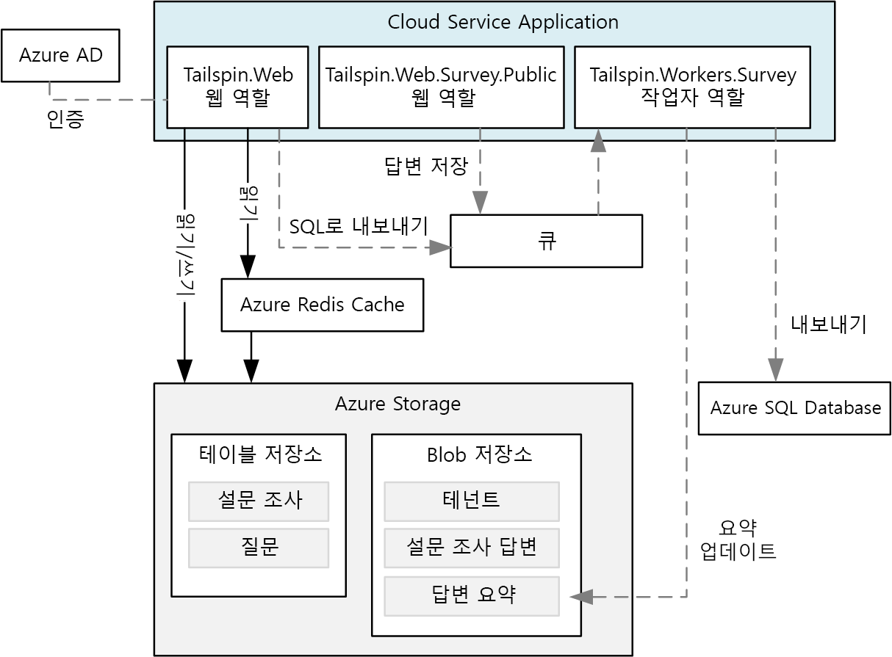
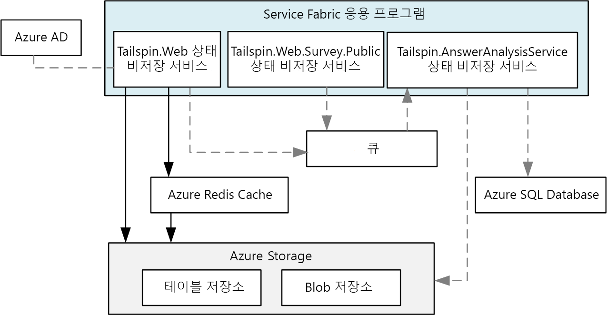
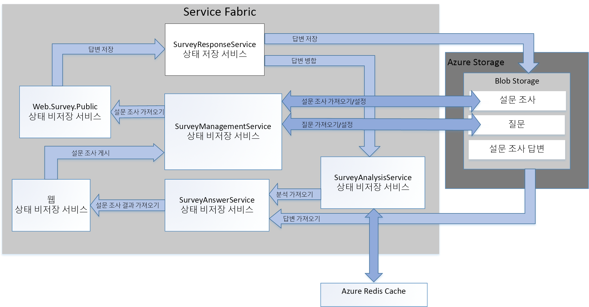

# <a name="refactor-an-azure-service-fabric-application-migrated-from-azure-cloud-services"></a><span data-ttu-id="088f8-103">Azure Cloud Services에서 마이그레이션된 Azure Service Fabric 응용 프로그램 리팩터링</span><span class="sxs-lookup"><span data-stu-id="088f8-103">Refactor an Azure Service Fabric Application migrated from Azure Cloud Services</span></span>

<span data-ttu-id="088f8-104">[ 샘플 코드][sample-code]</span><span class="sxs-lookup"><span data-stu-id="088f8-104">[ Sample code][sample-code]</span></span>

<span data-ttu-id="088f8-105">이 문서에서는 기존 Azure Service Fabric 응용 프로그램을 더 세부적인 아키텍처로 리팩터링하는 방법에 대해 설명합니다.</span><span class="sxs-lookup"><span data-stu-id="088f8-105">This article describes refactoring an existing Azure Service Fabric application to a more granular architecture.</span></span> <span data-ttu-id="088f8-106">이 문서에서는 리팩터링된 Service Fabric 응용 프로그램의 디자인, 패키징, 성능 및 배포 고려 사항에 중점을 둡니다.</span><span class="sxs-lookup"><span data-stu-id="088f8-106">This article focuses on the design, packaging, performance, and deployment considerations of the refactored Service Fabric application.</span></span>

## <a name="scenario"></a><span data-ttu-id="088f8-107">시나리오</span><span class="sxs-lookup"><span data-stu-id="088f8-107">Scenario</span></span>

<span data-ttu-id="088f8-108">이전의 [Azure Service Fabric으로 Azure Cloud Services 응용 프로그램 마이그레이션][migrate-from-cloud-services] 문서에서 설명한 대로, 패턴 및 실습 팀은 2012년 Azure에서 Cloud Services 응용 프로그램을 설계하고 구현하는 프로세스를 문서화한 한 권의 책을 저술했습니다.</span><span class="sxs-lookup"><span data-stu-id="088f8-108">As discussed in the previous article, [Migrating an Azure Cloud Services application to Azure Service Fabric][migrate-from-cloud-services], the patterns & practices team authored a book in 2012 that documented the process for designing and implementing a Cloud Services application in Azure.</span></span> <span data-ttu-id="088f8-109">이 책에서는 **설문 조사**라는 Cloud Services 응용 프로그램을 만들려는 Tailspin이라는 가상의 회사에 대해 설명합니다.</span><span class="sxs-lookup"><span data-stu-id="088f8-109">The book describes a fictitious company named Tailspin that wants to create a Cloud Services application named **Surveys**.</span></span> <span data-ttu-id="088f8-110">설문 조사 응용 프로그램을 사용하면 일반 사람들이 답변할 수 있는 설문 조사를 만들고 게시할 수 있습니다.</span><span class="sxs-lookup"><span data-stu-id="088f8-110">The Surveys application allows users to create and publish surveys that can be answered by the public.</span></span> <span data-ttu-id="088f8-111">다음 다이어그램에서는 이 버전의 설문 조사 응용 프로그램의 아키텍처를 보여 줍니다.</span><span class="sxs-lookup"><span data-stu-id="088f8-111">The following diagram shows the architecture of this version of the Surveys application:</span></span>



<span data-ttu-id="088f8-112">**Tailspin.Web** 웹 역할은 Tailspin 고객이 다음 작업을 수행하는 데 사용하는 ASP.NET MVC 웹 사이트를 호스팅합니다.</span><span class="sxs-lookup"><span data-stu-id="088f8-112">The **Tailspin.Web** web role hosts an ASP.NET MVC site that Tailspin customers use to:</span></span>
* <span data-ttu-id="088f8-113">설문 조사 응용 프로그램에 등록</span><span class="sxs-lookup"><span data-stu-id="088f8-113">sign up for the Surveys application,</span></span>
* <span data-ttu-id="088f8-114">단일 설문 조사 만들기 또는 삭제</span><span class="sxs-lookup"><span data-stu-id="088f8-114">create or delete a single survey,</span></span>
* <span data-ttu-id="088f8-115">단일 설문 조사 결과 보기</span><span class="sxs-lookup"><span data-stu-id="088f8-115">view results for a single survey,</span></span>
* <span data-ttu-id="088f8-116">설문 조사 결과를 SQL로 내보내도록 요청</span><span class="sxs-lookup"><span data-stu-id="088f8-116">request that survey results be exported to SQL, and</span></span>
* <span data-ttu-id="088f8-117">집계된 설문 조사 결과 및 분석 보기</span><span class="sxs-lookup"><span data-stu-id="088f8-117">view aggregated survey results and analysis.</span></span>

<span data-ttu-id="088f8-118">또한 **Tailspin.Web.Survey.Public** 웹 역할은 일반 사람이 설문 조사를 작성하기 위해 방문하는 ASP.NET MVC 사이트를 호스팅합니다.</span><span class="sxs-lookup"><span data-stu-id="088f8-118">The **Tailspin.Web.Survey.Public** web role also hosts an ASP.NET MVC site that the public visits to fill out the surveys.</span></span> <span data-ttu-id="088f8-119">이러한 응답은 큐에 배치되어 저장됩니다.</span><span class="sxs-lookup"><span data-stu-id="088f8-119">These responses are put in a queue to be saved.</span></span>

<span data-ttu-id="088f8-120">**Tailspin.Workers.Survey** 작업자 역할은 여러 큐에서 요청을 선택하여 백그라운드 처리를 수행합니다.</span><span class="sxs-lookup"><span data-stu-id="088f8-120">The **Tailspin.Workers.Survey** worker role performs background processing by picking up requests from multiple queues.</span></span>

<span data-ttu-id="088f8-121">패턴 & 실습 팀은 이 응용 프로그램을 Azure Service Fabric으로 이식하기 위한 새 프로젝트를 만들었습니다.</span><span class="sxs-lookup"><span data-stu-id="088f8-121">The patterns & practices team then created a new project to port this application to Azure Service Fabric.</span></span> <span data-ttu-id="088f8-122">이 프로젝트의 목표는 Azure Service Fabric 클러스터에서 실행되는 응용 프로그램을 가져오는 데 필요한 코드만 변경하는 것이었습니다.</span><span class="sxs-lookup"><span data-stu-id="088f8-122">The goal of this project was to make only the necessary code changes to get the application running in an Azure Service Fabric cluster.</span></span> <span data-ttu-id="088f8-123">결과적으로 원래의 웹 및 작업자 역할은 더 세부적인 아키텍처로 분해되지 않았습니다.</span><span class="sxs-lookup"><span data-stu-id="088f8-123">As a result, the original web and worker roles were not decomposed into a more granular architecture.</span></span> <span data-ttu-id="088f8-124">결과 아키텍처는 Cloud Services 버전의 응용 프로그램과 매우 비슷합니다.</span><span class="sxs-lookup"><span data-stu-id="088f8-124">The resulting architecture is very similar to the Cloud Service version of the application:</span></span>



<span data-ttu-id="088f8-125">**Tailspin.Web** 서비스는 원래의 *Tailspin.Web* 웹 역할에서 이식되었습니다.</span><span class="sxs-lookup"><span data-stu-id="088f8-125">The **Tailspin.Web** service is ported from the original *Tailspin.Web* web role.</span></span>

<span data-ttu-id="088f8-126">**Tailspin.Web.Survey.Public** 서비스는 원래의 *Tailspin.Web.Survey.Public* 웹 역할에서 이식되었습니다.</span><span class="sxs-lookup"><span data-stu-id="088f8-126">The **Tailspin.Web.Survey.Public** service is ported from the original *Tailspin.Web.Survey.Public* web role.</span></span>

<span data-ttu-id="088f8-127">**Tailspin.AnswerAnalysisService** 서비스는 원래의 *Tailspin.Workers.Survey* 작업자 역할에서 이식되었습니다.</span><span class="sxs-lookup"><span data-stu-id="088f8-127">The **Tailspin.AnswerAnalysisService** service is ported from the original *Tailspin.Workers.Survey* worker role.</span></span>

> [!NOTE] 
> <span data-ttu-id="088f8-128">코드는 웹 및 작업자 역할별로 최소한으로 변경되었지만, **Tailspin.Web** 및 **Tailspin.Web.Survey.Public**은 [Kestrel] 웹 서버를 자체 호스팅하도록 수정되었습니다.</span><span class="sxs-lookup"><span data-stu-id="088f8-128">While minimal code changes were made to each of the web and worker roles, **Tailspin.Web** and **Tailspin.Web.Survey.Public** were modified to self-host a [Kestrel] web server.</span></span> <span data-ttu-id="088f8-129">이전의 설문 조사 응용 프로그램은 IIS(인터넷 정보 서비스)를 사용하여 호스팅된 ASP.Net 응용 프로그램이지만, Service Fabric에서 IIS를 서비스로 실행할 수 없습니다.</span><span class="sxs-lookup"><span data-stu-id="088f8-129">The earlier Surveys application is an ASP.Net application that was hosted using Interet Information Services (IIS), but it is not possible to run IIS as a service in Service Fabric.</span></span> <span data-ttu-id="088f8-130">따라서 모든 웹 서버는 [Kestrel]과 같이 자체 호스팅될 수 있어야 합니다.</span><span class="sxs-lookup"><span data-stu-id="088f8-130">Therefore, any web server must be capable of being self-hosted, such as [Kestrel].</span></span> <span data-ttu-id="088f8-131">Service Fabric의 컨테이너에서 IIS를 실행할 수 있는 경우도 있습니다.</span><span class="sxs-lookup"><span data-stu-id="088f8-131">It is possible to run IIS in a container in Service Fabric in some situations.</span></span> <span data-ttu-id="088f8-132">자세한 내용은 [컨테이너 사용 시나리오][container-scenarios]를 참조하세요.</span><span class="sxs-lookup"><span data-stu-id="088f8-132">See [scenarios for using containers][container-scenarios] for more information.</span></span>  

<span data-ttu-id="088f8-133">이제 Tailspin은 설문 조사 응용 프로그램을 더 세부적인 아키텍처로 리팩터링합니다.</span><span class="sxs-lookup"><span data-stu-id="088f8-133">Now, Tailspin is refactoring the Surveys application to a more granular architecture.</span></span> <span data-ttu-id="088f8-134">리팩터링에 대한 Tailspin의 동기 부여는 설문 조사 응용 프로그램을 더 쉽게 개발, 빌드 및 배포할 수 있도록 하는 것입니다.</span><span class="sxs-lookup"><span data-stu-id="088f8-134">Tailspin's motivation for refactoring is to make it easier to develop, build, and deploy the Surveys application.</span></span> <span data-ttu-id="088f8-135">Tailspin은 기존 웹 및 작업자 역할을 더 세부적인 아키텍처로 분해하여 이러한 역할 간에 밀접하게 결합된 기존의 통신 및 데이터 종속성을 제거하려고 합니다.</span><span class="sxs-lookup"><span data-stu-id="088f8-135">By decomposing the existing web and worker roles to a more granular architecture, Tailspin wants to remove the existing tightly coupled communication and data dependencies between these roles.</span></span>

<span data-ttu-id="088f8-136">Tailspin에서 설문 조사 응용 프로그램을 더 세부적인 아키텍처로 전환하는 데 있어 확인되는 다른 이점은 다음과 같습니다.</span><span class="sxs-lookup"><span data-stu-id="088f8-136">Tailspin sees other benefits in moving the Surveys application to a more granular architecture:</span></span>
* <span data-ttu-id="088f8-137">각 서비스는 소규모 팀에서 관리할 수 있을 만큼 작은 범위의 독립적인 프로젝트로 패키지할 수 있습니다.</span><span class="sxs-lookup"><span data-stu-id="088f8-137">Each service can be packaged into independent projects with a scope small enough to be managed by a small team.</span></span>
* <span data-ttu-id="088f8-138">각 서비스는 독립적으로 버전을 지정하고 배포할 수 있습니다.</span><span class="sxs-lookup"><span data-stu-id="088f8-138">Each service can be independently versioned and deployed.</span></span>
* <span data-ttu-id="088f8-139">각 서비스는 해당 서비스에 가장 적합한 기술을 사용하여 구현할 수 있습니다.</span><span class="sxs-lookup"><span data-stu-id="088f8-139">Each service can be implemented using the best technology for that service.</span></span> <span data-ttu-id="088f8-140">예를 들어 Service Fabric 클러스터에는 .Net Frameworks, Java 또는 다른 언어(예: C 또는 C++)의 다양한 버전을 사용하여 빌드된 서비스가 포함될 수 있습니다.</span><span class="sxs-lookup"><span data-stu-id="088f8-140">For example, a service fabric cluster can include services built using different versions of the .Net Frameworks, Java, or other languages such as C or C++.</span></span>
* <span data-ttu-id="088f8-141">각 서비스의 크기는 부하의 증감에 반응하도록 독립적으로 조정할 수 있습니다.</span><span class="sxs-lookup"><span data-stu-id="088f8-141">Each service can be independently scaled to respond to increases and decreases in load.</span></span>

> [!NOTE] 
> <span data-ttu-id="088f8-142">다중 테넌트는 이 응용 프로그램의 리팩터링에 대한 범위를 벗어납니다.</span><span class="sxs-lookup"><span data-stu-id="088f8-142">Multitenancy is out of scope for the refactoring of this application.</span></span> <span data-ttu-id="088f8-143">Tailspin은 다중 테넌트를 지원하는 몇 가지 옵션을 가지고 있으며, 나중에 초기 디자인에 영향을 주지 않고 이러한 디자인 결정을 내릴 수 있습니다.</span><span class="sxs-lookup"><span data-stu-id="088f8-143">Tailspin has several options to support multitenancy and can make these design decisions later without affecting the initial design.</span></span> <span data-ttu-id="088f8-144">예를 들어 Tailspin은 클러스터 내의 각 테넌트에 대한 서비스의 개별 인스턴스를 만들거나 각 테넌트마다 별도의 클러스터를 만들 수 있습니다.</span><span class="sxs-lookup"><span data-stu-id="088f8-144">For example, Tailspin can create separate instances of the services for each tenant within a cluster or create a separate cluster for each tenant.</span></span>

## <a name="design-considerations"></a><span data-ttu-id="088f8-145">디자인 고려 사항</span><span class="sxs-lookup"><span data-stu-id="088f8-145">Design considerations</span></span>
 
<span data-ttu-id="088f8-146">다음 다이어그램에서는 더 세부적인 아키텍처로 리팩터링된 설문 조사 응용 프로그램의 아키텍처를 보여 줍니다.</span><span class="sxs-lookup"><span data-stu-id="088f8-146">The following diagram shows the architecture of the Surveys application refactored to a more granular architecture:</span></span>



<span data-ttu-id="088f8-147">**Tailspin.Web**은 Tailspin 고객이 설문 조사를 만들고 설문 조사 결과를 보기 위해 방문하는 ASP.NET MVC 응용 프로그램을 자체 호스팅하는 상태 비저장 서비스입니다.</span><span class="sxs-lookup"><span data-stu-id="088f8-147">**Tailspin.Web** is a stateless service self-hosting an ASP.NET MVC application that Tailspin customers visit to create surveys and view survey results.</span></span> <span data-ttu-id="088f8-148">이 서비스는 대부분의 코드를 이식된 Service Fabric 응용 프로그램의 *Tailspin.Web* 서비스와 공유합니다.</span><span class="sxs-lookup"><span data-stu-id="088f8-148">This service shares most of its code with the *Tailspin.Web* service from the ported Service Fabric application.</span></span> <span data-ttu-id="088f8-149">앞에서 언급했듯이, 이 서비스는 ASP.NET Core 및 웹 프런트 엔드로 Kestrel을 사용하여 WebListener를 구현하는 스위치를 사용합니다.</span><span class="sxs-lookup"><span data-stu-id="088f8-149">As mentioned earlier, this service uses ASP.NET core and switches from using Kestrel as web frontend to implementing a WebListener.</span></span>

<span data-ttu-id="088f8-150">**Tailspin.Web.Survey.Public**은 ASP.NET MVC 사이트를 자체 호스팅하는 상태 비저장 서비스입니다.</span><span class="sxs-lookup"><span data-stu-id="088f8-150">**Tailspin.Web.Survey.Public** is a stateless service also self-hosting an ASP.NET MVC site.</span></span> <span data-ttu-id="088f8-151">사용자는 이 사이트를 방문하여 목록에서 설문 조사를 선택한 다음, 작성합니다. 이 서비스는 대부분의 코드를 이식된 Service Fabric 응용 프로그램의 *Tailspin.Web.Survey.Public* 서비스와 공유합니다.</span><span class="sxs-lookup"><span data-stu-id="088f8-151">Users visit this site to select surveys from a list and then fill them out. This service shares most of its code with the *Tailspin.Web.Survey.Public* service from the ported Service Fabric application.</span></span> <span data-ttu-id="088f8-152">또한 이 서비스는 ASP.NET Core를 사용하고, Kestrel을 웹 프런트 엔드로 사용하는 방식에서 WebListener를 구현하는 방식으로 전환합니다.</span><span class="sxs-lookup"><span data-stu-id="088f8-152">This service also uses ASP.NET Core and also switches from using Kestrel as web frontend to implementing a WebListener.</span></span>

<span data-ttu-id="088f8-153">**Tailspin.SurveyResponseService**는 Azure Blob Storage에 설문 조사 응답을 저장하는 상태 저장 서비스입니다.</span><span class="sxs-lookup"><span data-stu-id="088f8-153">**Tailspin.SurveyResponseService** is a stateful service that stores survey answers in Azure Blob Storage.</span></span> <span data-ttu-id="088f8-154">또한 응답을 설문 조사 분석 데이터에 병합합니다.</span><span class="sxs-lookup"><span data-stu-id="088f8-154">It also merges answers into the survey analysis data.</span></span> <span data-ttu-id="088f8-155">이 서비스는 [ReliableConcurrentQueue][reliable-concurrent-queue]를 사용하여 설문 조사 응답을 일괄적으로 처리하므로 상태 저장 서비스로 구현됩니다.</span><span class="sxs-lookup"><span data-stu-id="088f8-155">The service is implemented as a stateful service because it uses a [ReliableConcurrentQueue][reliable-concurrent-queue] to process survey answers in batches.</span></span> <span data-ttu-id="088f8-156">이 기능은 원래 이식된 Service Fabric 응용 프로그램의 *Tailspin.AnswerAnalysisService* 서비스에서 구현되었습니다.</span><span class="sxs-lookup"><span data-stu-id="088f8-156">This functionality was originally implemented in the *Tailspin.AnswerAnalysisService* service in the ported Service Fabric application.</span></span>

<span data-ttu-id="088f8-157">**Tailspin.SurveyManagementService**는 설문 조사 및 설문 조사 질문을 저장하고 검색하는 상태 비저장 서비스입니다.</span><span class="sxs-lookup"><span data-stu-id="088f8-157">**Tailspin.SurveyManagementService** is a stateless service that stores and retrieves surveys and survey questions.</span></span> <span data-ttu-id="088f8-158">이 서비스는 Azure Blob Storage를 사용합니다.</span><span class="sxs-lookup"><span data-stu-id="088f8-158">The service uses Azure Blob storage.</span></span> <span data-ttu-id="088f8-159">이 기능도 원래 이식된 Service Fabric 응용 프로그램의 *Tailspin.Web* 및 *Tailspin.Web.Survey.Public* 서비스의 데이터 액세스 구성 요소에서 구현되었습니다.</span><span class="sxs-lookup"><span data-stu-id="088f8-159">This functionality was also originally implemented in the data access components of the *Tailspin.Web* and *Tailspin.Web.Survey.Public* services in the ported Service Fabric application.</span></span> <span data-ttu-id="088f8-160">Tailspin은 원래의 기능을 이 서비스로 리팩터링하여 크기를 독립적으로 조정할 수 있도록 했습니다.</span><span class="sxs-lookup"><span data-stu-id="088f8-160">Tailspin refactored the original functionality into this service to allow it to scale independently.</span></span>

<span data-ttu-id="088f8-161">**Tailspin.SurveyAnswerService**는 설문 조사 응답 및 설문 조사 분석을 검색하는 상태 비저장 서비스입니다.</span><span class="sxs-lookup"><span data-stu-id="088f8-161">**Tailspin.SurveyAnswerService** is a stateless service that retrieves survey answers and survey analysis.</span></span> <span data-ttu-id="088f8-162">이 서비스도 Azure Blob Storage를 사용합니다.</span><span class="sxs-lookup"><span data-stu-id="088f8-162">The service also uses Azure Blob storage.</span></span> <span data-ttu-id="088f8-163">이 기능도 원래 이식된 Service Fabric 응용 프로그램의 *Tailspin.Web* 서비스의 데이터 액세스 구성 요소에서 구현되었습니다.</span><span class="sxs-lookup"><span data-stu-id="088f8-163">This functionality was also originally implemented in the data access components of the *Tailspin.Web* service in the ported Service Fabric application.</span></span> <span data-ttu-id="088f8-164">Tailspin은 부하를 줄이고 더 적은 수의 인스턴스를 사용하여 리소스를 절약할 필요가 있어 원래의 기능을 이 서비스로 리팩터링했습니다.</span><span class="sxs-lookup"><span data-stu-id="088f8-164">Tailspin refactored the original functionality into this service because it expects less load and wants to use fewer instances to conserve resources.</span></span>

<span data-ttu-id="088f8-165">**Tailspin.SurveyAnalysisService**는 설문 조사 응답 요약 데이터를 빠르게 검색할 수 있도록 이 데이터를 Redis 캐시에 유지하는 상태 비저장 서비스입니다.</span><span class="sxs-lookup"><span data-stu-id="088f8-165">**Tailspin.SurveyAnalysisService** is a stateless service that persists survey answer summary data in a Redis cache for quick retrieval.</span></span> <span data-ttu-id="088f8-166">이 서비스는 설문 조사에 응답하고 새 설문 조사 응답 데이터를 요약 데이터에 병합할 때마다 *Tailspin.SurveyResponseService*에서 호출됩니다.</span><span class="sxs-lookup"><span data-stu-id="088f8-166">This service is called by the *Tailspin.SurveyResponseService* each time a survey is answered and the new survey answer data is merged in the summary data.</span></span> <span data-ttu-id="088f8-167">이 서비스는 이식된 Service Fabric 응용 프로그램의 *Tailspin.AnswerAnalysisService* 서비스에서 구현된 기능을 포함합니다.</span><span class="sxs-lookup"><span data-stu-id="088f8-167">This service includes the functionality originally implemented in the *Tailspin.AnswerAnalysisService* service from the ported Service Fabric application.</span></span>

## <a name="stateless-versus-stateful-services"></a><span data-ttu-id="088f8-168">상태 저장 및 상태 비저장 서비스</span><span class="sxs-lookup"><span data-stu-id="088f8-168">Stateless versus stateful services</span></span>

<span data-ttu-id="088f8-169">Azure Service Fabric에서 지원하는 프로그래밍 모델은 다음과 같습니다.</span><span class="sxs-lookup"><span data-stu-id="088f8-169">Azure Service Fabric supports the following programming models:</span></span>
* <span data-ttu-id="088f8-170">게스트 실행 파일 모델을 사용하면 모든 실행 파일을 서비스로 패키지하고 Service Fabric 클러스터에 배포할 수 있습니다.</span><span class="sxs-lookup"><span data-stu-id="088f8-170">The guest executable model allows any executable to be packaged as a service and deployed to a Service Fabric cluster.</span></span> <span data-ttu-id="088f8-171">Service Fabric은 게스트 실행 파일의 실행을 오케스트레이션하고 관리합니다.</span><span class="sxs-lookup"><span data-stu-id="088f8-171">Service Fabric orchestrates and manages execution of the guest executable.</span></span>
* <span data-ttu-id="088f8-172">컨테이너 모델을 사용하면 서비스를 컨테이너 이미지에 배포할 수 있습니다.</span><span class="sxs-lookup"><span data-stu-id="088f8-172">The container model allows for deployment of services in container images.</span></span> <span data-ttu-id="088f8-173">Service Fabric은 Windows Server 컨테이너 외에도 Linux 커널에 기반한 컨테이너의 만들기 및 관리를 지원합니다.</span><span class="sxs-lookup"><span data-stu-id="088f8-173">Service Fabric supports creation and management of containers on top of Linux kernel containers as well as Windows Server containers.</span></span> 
* <span data-ttu-id="088f8-174">신뢰할 수 있는 서비스 프로그래밍 모델을 사용하면 모든 Service Fabric 플랫폼 기능과 통합되는 상태 저장 또는 상태 비저장 서비스를 만들 수 있습니다.</span><span class="sxs-lookup"><span data-stu-id="088f8-174">The reliable services programming model allows for the creation of stateless or stateful services that integrate with all Service Fabric platform features.</span></span> <span data-ttu-id="088f8-175">상태 저장 서비스는 복제 상태가 Service Fabric 클러스터에 저장되도록 합니다.</span><span class="sxs-lookup"><span data-stu-id="088f8-175">Stateful services allow for replicated state to be stored in the Service Fabric cluster.</span></span> <span data-ttu-id="088f8-176">상태 비저장 서비스는 그렇지 않습니다.</span><span class="sxs-lookup"><span data-stu-id="088f8-176">Stateless services do not.</span></span>
* <span data-ttu-id="088f8-177">신뢰할 수 있는 행위자 프로그래밍 모델을 사용하면 가상 행위자 패턴을 구현하는 서비스를 만들 수 있습니다.</span><span class="sxs-lookup"><span data-stu-id="088f8-177">The reliable actors programming model allows for the creation of services that implement the virtual actor pattern.</span></span>

<span data-ttu-id="088f8-178">설문 조사 응용 프로그램의 모든 서비스는 *Tailspin.SurveyResponseService* 서비스를 제외하고는 신뢰할 수 있는 상태 비저장 서비스입니다.</span><span class="sxs-lookup"><span data-stu-id="088f8-178">All the services in the Surveys application are stateless reliable services, except for the *Tailspin.SurveyResponseService* service.</span></span> <span data-ttu-id="088f8-179">이 서비스는 설문 조사 응답을 받을 때 이를 처리하기 위해 [ReliableConcurrentQueue][reliable-concurrent-queue]를 구현합니다.</span><span class="sxs-lookup"><span data-stu-id="088f8-179">This service implements a [ReliableConcurrentQueue][reliable-concurrent-queue] to process survey answers when they are received.</span></span> <span data-ttu-id="088f8-180">ReliableConcurrentQueue의 응답은 Azure Blob Storage에 저장되고, *Tailspin.SurveyAnalysisService*로 전달되어 분석됩니다.</span><span class="sxs-lookup"><span data-stu-id="088f8-180">Responses in the ReliableConcurrentQueue are saved into Azure Blob Storage and passed to the *Tailspin.SurveyAnalysisService* for analysis.</span></span> <span data-ttu-id="088f8-181">Tailspin은 Azure Service Bus와 같은 큐에서 제공하는 엄격한 FIFO(선입 선출) 순서를 요구하지 않으므로 ReliableConcurrentQueue를 선택합니다.</span><span class="sxs-lookup"><span data-stu-id="088f8-181">Tailspin chooses a ReliableConcurrentQueue because responses do not require strict first-in-first-out (FIFO) ordering provided by a queue such as Azure Service Bus.</span></span> <span data-ttu-id="088f8-182">또한 ReliableConcurrentQueue는 큐에 넣기 및 큐에서 제거 작업에 대해 높은 처리량과 짧은 대기 시간을 제공하도록 설계되었습니다.</span><span class="sxs-lookup"><span data-stu-id="088f8-182">A ReliableConcurrentQueue is also designed to deliver high throughput and low latency for queue and dequeue operations.</span></span>

<span data-ttu-id="088f8-183">큐에서 제거된 항목을 ReliableConcurrentQueue에서 유지하는 작업은 원칙적으로 idempotent(멱등원)여야 합니다.</span><span class="sxs-lookup"><span data-stu-id="088f8-183">Note that operations to persist dequeued items from a ReliableConcurrentQueue should ideally be idempotent.</span></span> <span data-ttu-id="088f8-184">큐에서 항목을 처리하는 중에 예외가 throw되면 동일한 항목이 두 번 이상 처리될 수 있습니다.</span><span class="sxs-lookup"><span data-stu-id="088f8-184">If an exception is thrown during the processing of an item from the queue, the same item may be processed more than once.</span></span> <span data-ttu-id="088f8-185">설문 조사 응용 프로그램에서 설문 조사 분석 데이터는 분석 데이터에 대한 현재 스냅숏일 뿐이며 일관성이 필요하지 않으므로, 설문 조사 응답을 *Tailspin.SurveyAnalysisService*에 병합하는 작업은 idempotent가 아닙니다.</span><span class="sxs-lookup"><span data-stu-id="088f8-185">In the Surveys application, the operation to merge survey answers to the *Tailspin.SurveyAnalysisService* is not idempotent because Tailspin decided that the survey analysis data is only a current snapshot of the analysis data and does not need to be consistent.</span></span> <span data-ttu-id="088f8-186">결국에는 Azure Blob Storage에 저장된 설문 조사 응답이 일관되므로 최종적인 설문 조사 분석은 항상 이 데이터에서 정확하게 다시 계산할 수 있습니다.</span><span class="sxs-lookup"><span data-stu-id="088f8-186">The survey answers saved to Azure Blob Storage are eventually consistent, so the survey final analysis can always be recalculated correctly from this data.</span></span>

## <a name="communication-framework"></a><span data-ttu-id="088f8-187">통신 프레임워크</span><span class="sxs-lookup"><span data-stu-id="088f8-187">Communication framework</span></span>

<span data-ttu-id="088f8-188">설문 조사 응용 프로그램의 각 서비스는 RESTful 웹 API를 사용하여 통신합니다.</span><span class="sxs-lookup"><span data-stu-id="088f8-188">Each service in the Surveys application communicates using a RESTful web API.</span></span> <span data-ttu-id="088f8-189">RESTful API는 다음과 같은 이점을 제공합니다.</span><span class="sxs-lookup"><span data-stu-id="088f8-189">RESTful APIs offer the following benefits:</span></span>
* <span data-ttu-id="088f8-190">사용 편의성: 각 서비스는 웹 API 만들기를 기본적으로 지원하는 ASP.Net Core MVC를 사용하여 빌드됩니다.</span><span class="sxs-lookup"><span data-stu-id="088f8-190">Ease of use: each service is built using ASP.Net Core MVC, which natively supports the creation of Web APIs.</span></span>
* <span data-ttu-id="088f8-191">보안: 각 서비스는 SSL을 요구하지 않지만, Tailspin은 각 서비스에 대해 이를 요구할 수 있습니다.</span><span class="sxs-lookup"><span data-stu-id="088f8-191">Security: While each service does not require SSL, Tailspin could require each service to do so.</span></span> 
* <span data-ttu-id="088f8-192">버전 관리: 특정 버전의 웹 API에 대해 클라이언트를 작성하고 테스트할 수 있습니다.</span><span class="sxs-lookup"><span data-stu-id="088f8-192">Versioning: clients can be written and tested against a specific version of a web API.</span></span>

<span data-ttu-id="088f8-193">설문 조사 응용 프로그램의 서비스는 Service Fabric에서 구현된 [역방향 프록시][reverse-proxy]를 사용합니다.</span><span class="sxs-lookup"><span data-stu-id="088f8-193">Services in the Survey application make use of the [reverse proxy][reverse-proxy] implemented by Service Fabric.</span></span> <span data-ttu-id="088f8-194">역방향 프록시는 Service Fabric 클러스터의 각 노드에서 실행되고, 엔드포인트 확인과 자동 다시 시도를 제공하고, 다른 유형의 연결 실패를 처리하는 서비스입니다.</span><span class="sxs-lookup"><span data-stu-id="088f8-194">Reverse proxy is a service that runs on each node in the Service Fabric cluster and provides endpoint resolution, automatic retry, and handles other types of connection failures.</span></span> <span data-ttu-id="088f8-195">역방향 프록시를 사용하려면 미리 정의된 역방향 프록시 포트를 사용하여 특정 서비스에 대한 각 RESTful API를 호출해야 합니다.</span><span class="sxs-lookup"><span data-stu-id="088f8-195">To use the reverse proxy, each RESTful API call to a specific service is made using a predefined reverse proxy port.</span></span>  <span data-ttu-id="088f8-196">예를 들어 역방향 프록시 포트가 **19081**로 설정된 경우 *Tailspin.SurveyAnswerService*에 대한 호출은 다음과 같이 만들 수 있습니다.</span><span class="sxs-lookup"><span data-stu-id="088f8-196">For example, if the reverse proxy port has been set to **19081**, a call to the *Tailspin.SurveyAnswerService* can be made as follows:</span></span>

```csharp
static SurveyAnswerService()
{
    httpClient = new HttpClient
    {
        BaseAddress = new Uri("http://localhost:19081/Tailspin/SurveyAnswerService/")
    };
}
```
<span data-ttu-id="088f8-197">역방향 프록시를 사용하도록 설정하려면 Service Fabric 클러스터를 만드는 동안 역방향 프록시 포트를 지정합니다.</span><span class="sxs-lookup"><span data-stu-id="088f8-197">To enable reverse proxy, specify a reverse proxy port during creation of the Service Fabric cluster.</span></span> <span data-ttu-id="088f8-198">자세한 내용은 Azure Service Fabric의 [역방향 프록시][reverse-proxy]를 참조하세요.</span><span class="sxs-lookup"><span data-stu-id="088f8-198">For more information, see [reverse proxy][reverse-proxy] in Azure Service Fabric.</span></span>

## <a name="performance-considerations"></a><span data-ttu-id="088f8-199">성능 고려 사항</span><span class="sxs-lookup"><span data-stu-id="088f8-199">Performance considerations</span></span>

<span data-ttu-id="088f8-200">Tailspin은 Visual Studio 템플릿을 사용하여 *Tailspin.Web* 및 *Tailspin.Web.Surveys.Public*에 대한 ASP.NET Core 서비스를 만들었습니다.</span><span class="sxs-lookup"><span data-stu-id="088f8-200">Tailspin created the ASP.NET Core services for *Tailspin.Web* and *Tailspin.Web.Surveys.Public* using Visual Studio templates.</span></span> <span data-ttu-id="088f8-201">기본적으로 이러한 템플릿에는 콘솔에 대한 로깅이 포함되어 있습니다.</span><span class="sxs-lookup"><span data-stu-id="088f8-201">By default, these templates include logging to the console.</span></span> <span data-ttu-id="088f8-202">개발 및 디버깅 중에 콘솔에 대한 로깅을 수행할 수 있지만, 응용 프로그램을 프로덕션 환경에 배포할 때는 콘솔에 대한 모든 로깅을 제거해야 합니다.</span><span class="sxs-lookup"><span data-stu-id="088f8-202">Logging to the console may be done during development and debugging, but all logging to the console should be removed when the application is deployed to production.</span></span>

> [!NOTE]
> <span data-ttu-id="088f8-203">프로덕션 환경에서 실행되는 Service Fabric 응용 프로그램에 대한 모니터링 및 진단을 설정하는 방법에 대한 자세한 내용은 Azure Service Fabric에 대한 [모니터링 및 진단][monitoring-diagnostics]을 참조하세요.</span><span class="sxs-lookup"><span data-stu-id="088f8-203">For more information about setting up monitoring and diagnostics for Service Fabric applications running in production, see [monitoring and diagnostics][monitoring-diagnostics] for Azure Service Fabric.</span></span>

<span data-ttu-id="088f8-204">예를 들어 웹 프런트 엔드 서비스 각각에 대한 *startup.cs*에 있는 다음 줄을 주석으로 처리해야 합니다.</span><span class="sxs-lookup"><span data-stu-id="088f8-204">For example, the following lines in *startup.cs* for each of the web front end services should be commented out:</span></span>

```csharp
// This method gets called by the runtime. Use this method to configure the HTTP request pipeline.
public void Configure(IApplicationBuilder app, IHostingEnvironment env, ILoggerFactory loggerFactory)
{
    //loggerFactory.AddConsole(Configuration.GetSection("Logging"));
    //loggerFactory.AddDebug();

    app.UseMvc();
}
```

> [!NOTE]
> <span data-ttu-id="088f8-205">이러한 줄은 게시할 때 Visual Studio가 "릴리스"로 설정된 경우 조건부로 제외될 수 있습니다.</span><span class="sxs-lookup"><span data-stu-id="088f8-205">These lines may be conditionally excluded when Visual Studio is set to “release” when publishing.</span></span>

<span data-ttu-id="088f8-206">마지막으로 Tailspin에서 Tailspin 응용 프로그램을 프로덕션 환경에 배포하면 Visual Studio가 **릴리스** 모드로 전환됩니다.</span><span class="sxs-lookup"><span data-stu-id="088f8-206">Finally, when Tailspin deploys the Tailspin application to production, they switch Visual Studio to **release** mode.</span></span>

## <a name="deployment-considerations"></a><span data-ttu-id="088f8-207">배포 고려 사항</span><span class="sxs-lookup"><span data-stu-id="088f8-207">Deployment considerations</span></span>

<span data-ttu-id="088f8-208">리팩터링된 설문 조사 응용 프로그램은 5개의 상태 비저장 서비스와 1개의 상태 저장 서비스로 구성되므로, 클러스터 계획에서는 올바른 VM 크기 및 노드 수를 결정하도록 제한됩니다.</span><span class="sxs-lookup"><span data-stu-id="088f8-208">The refactored Surveys application is composed of five stateless services and one stateful service, so cluster planning is limited to determining the correct VM size and number of nodes.</span></span> <span data-ttu-id="088f8-209">클러스터를 설명하는 *applicationmanifest.xml* 파일에서 Tailspin은 각 서비스에 대해 *StatelessService* 태그의 *InstanceCount* 특성을 -1로 설정합니다.</span><span class="sxs-lookup"><span data-stu-id="088f8-209">In the *applicationmanifest.xml* file that describes the cluster, Tailspin sets the *InstanceCount* attribute of the *StatelessService* tag to -1 for each of the services.</span></span> <span data-ttu-id="088f8-210">-1 값은 Service Fabric에서 서비스의 인스턴스를 클러스터의 각 노드에 만들도록 합니다.</span><span class="sxs-lookup"><span data-stu-id="088f8-210">A value of -1 directs Service Fabric to create an instance of the service on each node in the cluster.</span></span>

> [!NOTE]
> <span data-ttu-id="088f8-211">상태 저장 서비스에는 데이터에 대해 올바른 수의 파티션과 복제본을 계획하는 추가 단계가 필요합니다.</span><span class="sxs-lookup"><span data-stu-id="088f8-211">Stateful services require the additional step of planning the correct number of partitions and replicas for their data.</span></span>

<span data-ttu-id="088f8-212">Tailspin은 Azure Portal을 사용하여 클러스터를 배포합니다.</span><span class="sxs-lookup"><span data-stu-id="088f8-212">Tailspin deploys the cluster using the Azure Portal.</span></span> <span data-ttu-id="088f8-213">Service Fabric 클러스터 리소스 종류는 VM 확장 집합 및 부하 분산 장치를 포함하여 필요한 인프라를 모두 배포합니다.</span><span class="sxs-lookup"><span data-stu-id="088f8-213">The Service Fabric Cluster resource type deploys all of the necessary infrastructure, including VM scale sets and a load balancer.</span></span> <span data-ttu-id="088f8-214">권장되는 VM 크기는 Service Fabric 클러스터에 대한 프로비전 프로세스 중에 Azure Portal에 표시됩니다.</span><span class="sxs-lookup"><span data-stu-id="088f8-214">The recommended VM sizes are displayed in the Azure portal during the provisioning process for the Service Fabric cluster.</span></span> <span data-ttu-id="088f8-215">VM은 VM 확장 집합에 배포되므로 사용자 로드가 증가함에 따라 강화되고 확장될 수 있습니다.</span><span class="sxs-lookup"><span data-stu-id="088f8-215">Note that because the VMs are deployed in a VM scale set, they can be both scaled up and out as user load increases.</span></span>

> [!NOTE]
> <span data-ttu-id="088f8-216">앞에서 설명한 대로, 마이그레이션된 버전의 설문 조사 응용 프로그램에서 두 웹 프런트 엔드는 ASP.Net Core 및 웹 서버로 Kestrel을 사용하여 자체 호스팅되었습니다.</span><span class="sxs-lookup"><span data-stu-id="088f8-216">As discussed earlier, in the migrated version of the Surveys application the two web front ends were self-hosted using ASP.Net Core and Kestrel as a web server.</span></span> <span data-ttu-id="088f8-217">마이그레이션된 버전의 설문 조사 응용 프로그램은 역방향 프록시를 사용하지 않지만, IIS, Nginx 또는 Apache와 같은 역방향 프록시를 사용하는 것이 좋습니다.</span><span class="sxs-lookup"><span data-stu-id="088f8-217">While the migrated version of the Survey application does not use a reverse proxy, it is strongly recommended to use a reverse proxy such as IIS, Nginx, or Apache.</span></span> <span data-ttu-id="088f8-218">자세한 내용은 [ASP.NET Core에서 Kestrel 웹 서버 구현에 대한 소개][kestrel-intro]를 참조하세요.</span><span class="sxs-lookup"><span data-stu-id="088f8-218">For more information see [introduction to Kestrel web server implementation in ASP.NET core][kestrel-intro].</span></span>
> <span data-ttu-id="088f8-219">리팩터링된 설문 조사 응용 프로그램에서 두 웹 프런트 엔드는 [WebListener][weblistener]가 있는 ASP.Net Core를 웹 서버로 사용하여 자체 호스팅되므로 역방향 프록시가 필요하지 않습니다.</span><span class="sxs-lookup"><span data-stu-id="088f8-219">In the refactored Surveys application, the two web front ends are self-hosted using ASP.Net Core with [WebListener][weblistener] as a web server so a reverse proxy is not necessary.</span></span>

## <a name="next-steps"></a><span data-ttu-id="088f8-220">다음 단계</span><span class="sxs-lookup"><span data-stu-id="088f8-220">Next steps</span></span>

<span data-ttu-id="088f8-221">설문 조사 응용 프로그램 코드는 [GitHub][sample-code]에서 사용할 수 있습니다.</span><span class="sxs-lookup"><span data-stu-id="088f8-221">The Surveys application code is available on [GitHub][sample-code].</span></span>

<span data-ttu-id="088f8-222">[Azure Service Fabric][service-fabric]을 처음 시작하는 경우, 먼저 개발 환경을 설정한 다음, 최신 [Azure SDK][azure-sdk] 및 [Azure Service Fabric SDK][service-fabric-sdk]를 다운로드합니다.</span><span class="sxs-lookup"><span data-stu-id="088f8-222">If you are just getting started with [Azure Service Fabric][service-fabric], first set up your development environment then download the latest [Azure SDK][azure-sdk] and the [Azure Service Fabric SDK][service-fabric-sdk].</span></span> <span data-ttu-id="088f8-223">SDK에는 OneBox 클러스터 관리자가 포함되어 있으므로 F5 전체 디버깅을 사용하여 설문 조사 응용 프로그램을 로컬로 배포하고 테스트할 수 있습니다.</span><span class="sxs-lookup"><span data-stu-id="088f8-223">The SDK includes the OneBox cluster manager so you can deploy and test the Surveys application locally with full F5 debugging.</span></span>

<!-- links -->
[azure-sdk]: https://azure.microsoft.com/downloads/archive-net-downloads/
[container-scenarios]: /azure/service-fabric/service-fabric-containers-overview
[kestrel]: https://docs.microsoft.com/aspnet/core/fundamentals/servers/kestrel?tabs=aspnetcore2x
[kestrel-intro]: https://docs.microsoft.com/aspnet/core/fundamentals/servers/kestrel?tabs=aspnetcore1x
[migrate-from-cloud-services]: migrate-from-cloud-services.md
[monitoring-diagnostics]: /azure/service-fabric/service-fabric-diagnostics-overview
[reliable-concurrent-queue]: /azure/service-fabric/service-fabric-reliable-services-reliable-concurrent-queue
[reverse-proxy]: /azure/service-fabric/service-fabric-reverseproxy
[sample-code]: https://github.com/mspnp/cloud-services-to-service-fabric/tree/master/servicefabric-phase-2
[service-fabric]: /azure/service-fabric/service-fabric-get-started
[service-fabric-sdk]: /azure/service-fabric/service-fabric-get-started
[weblistener]: https://docs.microsoft.com/aspnet/core/fundamentals/servers/weblistener
